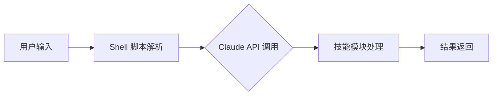
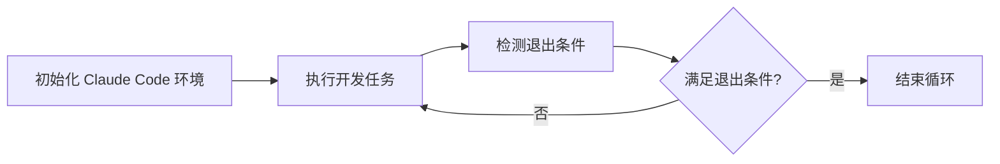
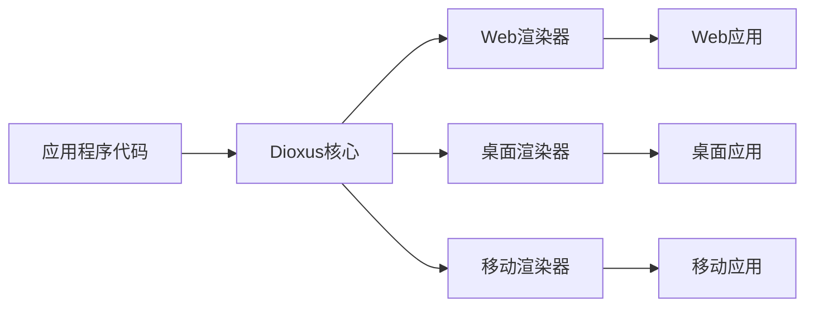

## 🔥 今日热点：今日GitHub热榜聚焦AI代理与多媒体工具两大领域，Claude Code生态项目激增，同时视频处...

今日GitHub热榜聚焦AI代理与多媒体工具两大领域，Claude Code生态项目激增，同时视频处理与深度伪造技术持续受到关注。

---

## 📊 热门项目一览

| 排名 | 项目 | 语言 | 今日⭐ | 总⭐ | 简介 |
|:---:|------|:----:|------:|-----:|------|
| 🥇 | [obra/superpowers](https://github.com/obra/superpowers) | Shell | **+1,547** | 18,248 | Claude Code superpowers: co... |
| 🥈 | [frankbria/ralph-claude-code](https://github.com/frankbria/ralph-claude-code) | Shell | **+667** | 2,009 | Autonomous AI development l... |
| 🥉 | [bytedance/UI-TARS-desktop](https://github.com/bytedance/UI-TARS-desktop) | TypeScript | **+492** | 23,093 | The Open-Source Multimodal ... |
| 4 | [home-assistant/home-assistant.io](https://github.com/home-assistant/home-assistant.io) | HTML | **+268** | 8,064 | 📘 Home Assistant User docum... |
| 5 | [DioxusLabs/dioxus](https://github.com/DioxusLabs/dioxus) | Rust | **+190** | 33,424 | Fullstack app framework for... |
| 6 | [opf/openproject](https://github.com/opf/openproject) | Ruby | **+175** | 13,847 | OpenProject is the leading ... |
| 7 | [iptv-org/iptv](https://github.com/iptv-org/iptv) | TypeScript | **+163** | 109,249 | Collection of publicly avai... |
| 8 | [NanmiCoder/MediaCrawler](https://github.com/NanmiCoder/MediaCrawler) | Python | **+139** | 42,062 | 小红书笔记 | 评论爬虫、抖音视频 | 评论爬虫、快手... |
| 9 | [hacksider/Deep-Live-Cam](https://github.com/hacksider/Deep-Live-Cam) | Python | **+110** | 77,372 | real time face swap and one... |
| 10 | [ruvnet/claude-flow](https://github.com/ruvnet/claude-flow) | JavaScript | **+80** | 11,530 | 🌊 The leading agent orchest... |
| 11 | [OpenBMB/ChatDev](https://github.com/OpenBMB/ChatDev) | Python | **+57** | 28,270 | ChatDev 2.0: Dev All throug... |
| 12 | [mpv-player/mpv](https://github.com/mpv-player/mpv) | C | **+11** | 33,425 | 🎥 Command line media player |

---

## 🔭 趋势洞察

```
┌─────────────────────────────────────────────────────────────────┐
│  🤖 AI/ML 工具       ████████████████████████  6 个项目        │
│  🎬 多媒体应用          ████████████              3 个项目        │
│  🖥️ 开发框架          ████                      1 个项目        │
│  🏠 智能家居           ████                      1 个项目        │
│  📋 项目管理           ████                      1 个项目        │
└─────────────────────────────────────────────────────────────────┘
```

---

## ✨ 重点项目深度解读

### 1. obra/superpowers — Claude 增强工具集

> **一句话总结**：为 Claude AI 提供核心技能扩展的命令行工具集合，增强 AI 编程与创作能力。

#### 🎯 价值主张

| 维度 | 说明 |
|------|------|
| **解决痛点** | 扩展 Claude AI 功能边界，提供专业领域技能支持 |
| **目标用户** | 开发者、研究人员、AI 工具使用者 |
| **核心亮点** | 命令行交互 + 技能模块化 + 跨平台支持 |

#### 💡 技术架构



**技术特色**：
- 基于 Shell 脚本实现，跨平台兼容性强
- 模块化设计，便于扩展新技能
- 直接与 Claude API 集成，提供流畅交互体验

#### 📈 热度分析

- 项目获得超过 18k 星，单日增长超过 1.5k，表明项目近期热度迅速上升
- 作为 Claude AI 生态的重要工具，社区活跃度高，贡献者持续增加

#### 🛠️ 快速上手

```bash
# 克隆仓库
git clone https://github.com/obra/superpowers.git
cd superpowers

# 安装依赖并运行
chmod +x install.sh
./install.sh
./superpowers --help
```

#### ⚠️ 注意事项

- 🔴 严重：项目许可证未知，商业使用前需确认授权条款
- 🟡 注意：依赖 Claude API，需确保有有效的 API 访问权限
- 🟢 建议：定期更新以获取最新功能和安全性改进


### 2. frankbria/ralph-claude-code — AI 自动化开发

> **一句话总结**：为 Claude Code 实现自动化开发循环，智能检测退出条件，提升 AI 编程效率。

#### 🎯 价值主张

| 维度 | 说明 |
|------|------|
| **解决痛点** | AI 编程工具缺乏完整开发流程，需要手动干预和循环 |
| **目标用户** | 使用 Claude Code 进行自动化开发的程序员和 AI 爱好者 |
| **核心亮点** | 自动化开发循环 + 智能退出检测 + Shell 脚本实现 |

#### 💡 技术架构



**技术特色**：
- 基于 Shell 脚本实现的轻量级解决方案
- 集成 Claude Code API 实现自动化编程循环
- 智能检测任务完成条件，避免无限循环

#### 📈 热度分析

- 项目近期获得 667 个 Star，表明正受到社区高度关注，可能是新发布或发现了重要功能
- Fork 数相对较低，说明更多用户倾向于直接使用而非二次开发

#### 🛠️ 快速上手

```bash
# 克隆仓库
git clone https://github.com/frankbria/ralph-claude-code.git
cd ralph-claude-code

# 给脚本执行权限并运行
chmod +x ralph-claude-code.sh
./ralph-claude-code.sh
```

#### ⚠️ 注意事项

- 🔴 严重：需要确保 Claude Code API 已正确配置
- 🟡 注意：Shell 脚本可能需要根据不同操作系统进行调整
- 🟢 建议：建议在虚拟环境中运行，避免影响现有开发环境


### 3. bytedance/UI-TARS-desktop — 多模态AI代理栈

> **一句话总结**：字节开源的多模态AI代理桌面客户端，连接前沿AI模型与代理基础设施。

#### 🎯 价值主张

| 维度 | 说明 |
|------|------|
| **解决痛点** | 碎片化AI模型与基础设施的连接问题，提供统一接入点 |
| **目标用户** | AI开发者、研究人员和企业AI应用构建者 |
| **核心亮点** | 多模态支持 + 字节技术背书 + 开源堆栈 + 桌面客户端 |

#### 💡 技术架构


**技术特色**：
- TypeScript全栈开发，保证类型安全
- 多模态输入处理能力
- 开放的AI模型连接接口

#### 📈 热度分析

- Star数超2.3万且持续快速增长，表明项目获得高度认可
- Issues数为0，可能反映项目维护良好或问题通过其他渠道处理

#### 🛠️ 快速上手

```bash
# 克隆项目
git clone https://github.com/bytedance/UI-TARS-desktop.git
# 安装依赖
npm install
# 启动开发环境
npm run dev
```

#### ⚠️ 注意事项

- 🔴严重 项目License未知，使用前需确认开源协议
- 🟡注意 Issues数为0，社区反馈渠道可能不明确
- 🟢建议 关注项目官方文档和社区获取最新使用指南


### 4. home-assistant/home-assistant.io — 智能家居文档

> **一句话总结**：Home Assistant智能家居系统的官方用户文档，提供全面的使用指南和集成说明。

#### 🎯 价值主张

| 维度 | 说明 |
|------|------|
| **解决痛点** | 为Home Assistant用户提供系统化、易于理解的文档资源 |
| **目标用户** | Home Assistant智能家居系统用户和开发者 |
| **核心亮点** | + 完整的组件文档 + 实用的集成指南 + 清晰的故障排除步骤 + 持续更新的内容 |

#### 💡 技术架构


**技术特色**：
- 基于Jekyll静态站点生成器，适合文档类网站
- 使用Markdown编写内容，便于维护和协作
- 通过GitHub Pages免费托管，降低维护成本
- 采用版本控制管理文档，确保内容可追溯

#### 📈 热度分析

- 项目获得8,000+星标，今日增长268，表明Home Assistant生态系统活跃度高
- Fork数量与Star数接近，显示社区贡献意愿强烈，文档维护活跃度高

#### 🛠️ 快速上手

```bash
# 克隆仓库
git clone https://github.com/home-assistant/home-assistant.io.git

# 添加和提交文档更改
git add docs/
git commit -m "添加新组件文档"
git push origin main
```

#### ⚠️ 注意事项

- 🔴严重：文档内容与Home Assistant软件版本保持同步，避免使用过时信息
- 🟡注意：贡献文档前请阅读CONTRIBUTING.md，了解文档格式和规范
- 🟢建议：遇到问题可先查阅FAQ部分，或通过GitHub Issues提出


### 5. DioxusLabs/dioxus — 跨平台全栈框架

> **一句话总结**：Rust 编写的跨平台全栈框架，一套代码同时支持 Web、桌面和移动应用开发。

#### 🎯 价值主张

| 维度 | 说明 |
|------|------|
| **解决痛点** | 跨平台应用开发需维护多套代码，Dioxus 提供统一框架解决这一问题 |
| **目标用户** | 希望使用 Rust 进行跨平台应用开发的开发者 |
| **核心亮点** | 单一代码库 + 跨平台支持 + 原生性能 + 声明式UI + 组件化架构 |

#### 💡 技术架构



**技术特色**：
- 基于 Rust 语言，提供内存安全和并发性能
- 采用声明式UI编程范式，提高开发效率
- 使用虚拟DOM提高渲染性能，优化用户体验

#### 📈 热度分析

- 项目 Star 数 33,424 且今日新增 190，处于快速增长期，社区活跃度高
- 作为 Rust 生态中新兴全栈框架，正逐步挑战 Tauri、Electron 等传统跨平台解决方案

#### 🛠️ 快速上手

```bash
cargo install dioxus-cli
dx new my_app
cd my_app
dx serve
```

#### ⚠️ 注意事项

- 🟡 注意：作为新兴框架，生态系统可能不如成熟框架完善
- 🟡 注意：Rust 学习曲线较陡，对新手有一定门槛
- 🟢 建议：建议先熟悉 Rust 基础再使用此框架开发大型项目


## 📌 今日推荐阅读


---

<div align="center">

*📅 Generated on 2026-01-12 | 🤖 Powered by GitHub Trending Reporter*

</div>