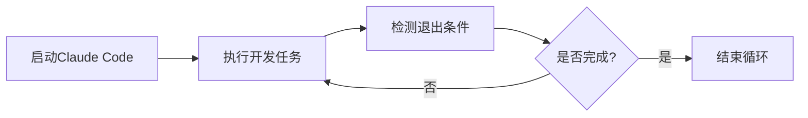

## 🔥 今日热点：今日GitHub热榜聚焦AI代理工具与多媒体技术，Claude相关开发工具和深度伪造技术项目备受关注...

今日GitHub热榜聚焦AI代理工具与多媒体技术，Claude相关开发工具和深度伪造技术项目备受关注，显示AI辅助开发和内容生成领域的持续活跃。

---

## 📊 热门项目一览

| 排名 | 项目 | 语言 | 今日⭐ | 总⭐ | 简介 |
|:---:|------|:----:|------:|-----:|------|
| 🥇 | [obra/superpowers](https://github.com/obra/superpowers) | Shell | **+1,547** | 18,273 | Claude Code superpowers: co... |
| 🥈 | [frankbria/ralph-claude-code](https://github.com/frankbria/ralph-claude-code) | Shell | **+667** | 2,019 | Autonomous AI development l... |
| 🥉 | [bytedance/UI-TARS-desktop](https://github.com/bytedance/UI-TARS-desktop) | TypeScript | **+492** | 23,096 | The Open-Source Multimodal ... |
| 4 | [home-assistant/home-assistant.io](https://github.com/home-assistant/home-assistant.io) | HTML | **+268** | 8,065 | 📘 Home Assistant User docum... |
| 5 | [DioxusLabs/dioxus](https://github.com/DioxusLabs/dioxus) | Rust | **+190** | 33,427 | Fullstack app framework for... |
| 6 | [opf/openproject](https://github.com/opf/openproject) | Ruby | **+175** | 13,851 | OpenProject is the leading ... |
| 7 | [iptv-org/iptv](https://github.com/iptv-org/iptv) | TypeScript | **+163** | 109,253 | Collection of publicly avai... |
| 8 | [NanmiCoder/MediaCrawler](https://github.com/NanmiCoder/MediaCrawler) | Python | **+139** | 42,068 | 小红书笔记 | 评论爬虫、抖音视频 | 评论爬虫、快手... |
| 9 | [hacksider/Deep-Live-Cam](https://github.com/hacksider/Deep-Live-Cam) | Python | **+110** | 77,377 | real time face swap and one... |
| 10 | [ruvnet/claude-flow](https://github.com/ruvnet/claude-flow) | JavaScript | **+80** | 11,535 | 🌊 The leading agent orchest... |
| 11 | [OpenBMB/ChatDev](https://github.com/OpenBMB/ChatDev) | Python | **+57** | 28,272 | ChatDev 2.0: Dev All throug... |
| 12 | [mpv-player/mpv](https://github.com/mpv-player/mpv) | C | **+11** | 33,427 | 🎥 Command line media player |

---

## 🔭 趋势洞察

```
┌─────────────────────────────────────────────────────────────────┐
│  🤖 AI/ML 工具       ████████████████████████  6 个项目        │
│  🎬 多媒体应用          ████████████              3 个项目        │
│  🖥️ 开发框架          ████                      1 个项目        │
│  🏠 智能家居           ████                      1 个项目        │
│  📋 项目管理           ████                      1 个项目        │
└─────────────────────────────────────────────────────────────────┘
```

---

## ✨ 重点项目深度解读

### 1. obra/superpowers — AI代码增强库

> **一句话总结**：为Claude AI提供代码增强功能的Shell脚本技能库，提升编程效率与代码质量。

#### 🎯 价值主张

| 维度 | 说明 |
|------|------|
| **解决痛点** | 为Claude AI提供代码增强能力，弥补基础功能的不足 |
| **目标用户** | 使用Claude AI进行编程的开发者和研究人员 |
| **核心亮点** | Shell脚本实现 + 模块化设计 + 即插即用 + 智能代码优化 |

#### 💡 技术架构


**技术特色**：
- 基于Shell的轻量级实现，跨平台兼容性强
- 模块化设计，支持按需加载功能
- 无需复杂配置，即插即用

#### 📈 热度分析

- 项目近期获得大量关注，单日增长超过1500 stars，表明开发者社区对AI辅助工具需求旺盛
- Fork数量相对较少，说明项目以使用为主，二次开发需求不高，属于典型的工具型项目

#### 🛠️ 快速上手

```bash
# 克隆项目
git clone https://github.com/obra/superpowers.git

# 进入目录并安装
cd superpowers
./install.sh
```

#### ⚠️ 注意事项

- 🔴严重：项目许可证未知，商业使用前需确认授权条款
- 🟡注意：仅支持Claude AI，其他AI助手可能不兼容
- 🟢建议：使用前先阅读文档，了解各模块功能和使用场景


### 2. frankbria/ralph-claude-code — Claude Code自动化开发

> **一句话总结**：为Claude Code构建自主AI开发循环，实现智能退出检测与自动化任务处理。

#### 🎯 价值主张

| 维度 | 说明 |
|------|------|
| **解决痛点** | 解决Claude Code使用过程中需要手动干预、缺乏自主循环能力的问题 |
| **目标用户** | 使用Claude Code进行AI辅助开发的程序员和自动化脚本编写者 |
| **核心亮点** | 自主AI开发循环 + 智能退出检测 + 自动化任务处理 + 轻量级Shell实现 |

#### 💡 技术架构



**技术特色**：
- 基于Shell脚本实现，轻量级且跨平台兼容
- 智能检测Claude Code的退出条件，实现自主循环
- 简洁的架构设计，易于集成到现有工作流

#### 📈 热度分析

- 项目近期获得667个Star，表明新功能或更新引起了广泛关注，正处于快速增长期。
- 无公开Issues，社区反馈可能通过其他渠道或内部处理，维护者可能对项目有较强控制力。

#### 🛠️ 快速上手

```bash
# 克隆项目
git clone https://github.com/frankbria/ralph-claude-code.git
# 运行脚本
cd ralph-claude-code && ./ralph-claude-code.sh
```

#### ⚠️ 注意事项

- 🔴严重：项目许可证未知，商业使用前需确认授权情况
- 🟡注意：依赖Claude Code环境，需确保相关配置正确
- 🟢建议：在使用前查看项目文档，了解具体配置选项


### 3. bytedance/UI-TARS-desktop — 多模态AI代理栈

> **一句话总结**：开源多模态AI代理栈，连接前沿AI模型与基础设施，提供一站式AI解决方案。

#### 🎯 价值主张

| 维度 | 说明 |
|------|------|
| **解决痛点** | 解决AI模型与基础设施分散连接困难，提供统一多模态AI代理解决方案 |
| **目标用户** | AI开发者、研究人员、企业AI解决方案构建者 |
| **核心亮点** | 多模态支持 + 开源生态 + 模型连接能力 + 企业级部署 + 易扩展架构 |

#### 💡 技术架构


**技术特色**：
- 支持多种模态数据的统一处理和转换
- 提供灵活的AI模型连接和集成框架
- 企业级部署能力和可扩展架构设计

#### 📈 热度分析

- 项目获得超2.3万星，单日增长近500星，显示极高社区关注度和采用率
- 作为字节跳动开源的AI基础设施项目，已成为多模态AI代理领域的重要生态组成部分

#### 🛠️ 快速上手

```bash
# 克隆项目
git clone https://github.com/bytedance/UI-TARS-desktop.git

# 安装依赖
npm install

# 启动项目
npm start
```

#### ⚠️ 注意事项

- 🔴严重：项目许可证信息未知，商业使用前需确认许可条款
- 🟡注意：作为AI基础设施项目，可能需要较高的计算资源
- 🟢建议：建议参考项目文档和示例代码了解最佳实践


### 4. home-assistant/home-assistant.io — 智能家居文档

> **一句话总结**：Home Assistant智能家居平台的官方用户文档，提供全面的产品使用指南与集成说明。

#### 🎯 价值主张

| 维度 | 说明 |
|------|------|
| **解决痛点** | 为Home Assistant用户提供一站式、结构化的使用指南与问题解决方案 |
| **目标用户** | 家庭自动化爱好者、智能家居开发者、Home Assistant平台用户 |
| **核心亮点** | 官方权威文档 + 全面的设备集成指南 + 丰富的教程与示例 |

#### 💡 技术架构


**技术特色**：
- 基于Jekyll静态站点生成器，确保文档构建高效可靠
- 采用Markdown编写内容，便于维护和版本控制
- 利用GitHub Pages免费托管，降低部署成本

#### 📈 热度分析

- 项目获得8,000+星标且持续增长，表明Home Assistant生态系统活跃度高
- 作为官方文档项目，反映了智能家居领域的技术关注度和社区参与度

#### 🛠️ 快速上手

```bash
# 克隆项目仓库
git clone https://github.com/home-assistant/home-assistant.io.git

# 本地预览文档
cd home-assistant.io
bundle install
bundle exec jekyll serve
```

#### ⚠️ 注意事项

- 🔴严重：文档内容可能随Home Assistant平台版本更新而变化，请确保查阅最新版本
- 🟡注意：某些设备集成说明可能需要特定版本的Home Assistant才能正常工作
- 🟢建议：遇到问题时，优先查阅文档中的FAQ部分，通常能解决常见问题


### 5. DioxusLabs/dioxus — 跨平台全栈框架

> **一句话总结**：基于 Rust 的全栈跨平台应用框架，支持 Web、桌面和移动端开发，性能卓越且开发体验流畅。

#### 🎯 价值主张

| 维度 | 说明 |
|------|------|
| **解决痛点** | 跨平台应用开发中代码重复、性能与开发效率难以平衡的问题 |
| **目标用户** | Rust 开发者、跨平台应用开发者、追求高性能的前端开发者 |
| **核心亮点** | 跨平台支持 + 统一组件模型 + 高性能渲染 + 声明式状态管理 |

#### 💡 技术架构


**技术特色**：
- 基于 Virtual DOM 的高效渲染机制，平衡性能与开发体验
- 统一的组件模型，实现跨平台代码复用
- 利用 Rust 的所有权系统确保内存安全，无需 GC

#### 📈 热度分析

- 项目 Star 数超 3.3 万，日增 190+，增长迅速，开发者社区认可度高
- 作为 Rust 生态中的新兴全栈框架，正逐步形成独立生态系统和社区活跃度

#### 🛠️ 快速上手

```bash
# 安装 Dioxus CLI
cargo install dioxus-cli

# 创建新项目
dx new my_app

# 运行项目
dx serve
```

#### ⚠️ 注意事项

- 🟡 注意: Dioxus 仍在积极开发中，API 可能有变化
- 🟡 注意: 相比成熟框架，生态系统和第三方库仍在完善中
- 🟢 建议: 需要 Rust 基础才能充分利用其特性


## 📌 今日推荐阅读


---

<div align="center">

*📅 Generated on 2026-01-12 | 🤖 Powered by GitHub Trending Reporter*

</div>