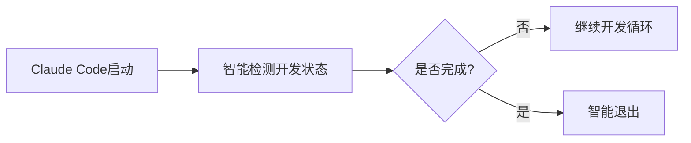
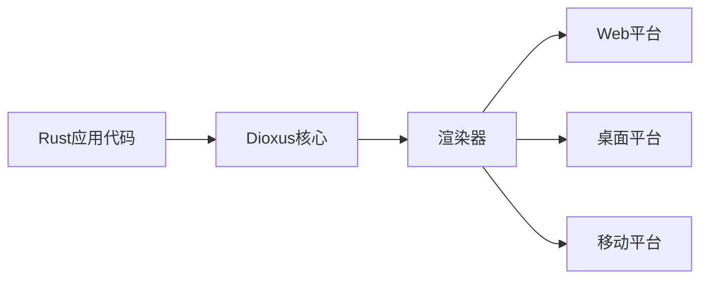
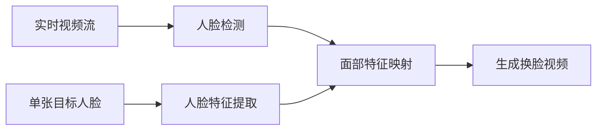

## 今日热点

Claude AI开发工具生态爆发式增长，多模态AI代理系统成为新焦点，显示开发者正积极构建AI原生应用基础设施。

---

## 热门项目一览

| 排名 | 项目 | 语言 | 今日 | 总计 | 简介 |
|:---:|------|:----:|------:|-----:|------|
| 1 | [obra/superpowers](https://github.com/obra/superpowers) | Shell | +1,547 | 18,322 | Claude Code superpowers: co... |
| 2 | [frankbria/ralph-claude-code](https://github.com/frankbria/ralph-claude-code) | Shell | +667 | 2,034 | Autonomous AI development l... |
| 3 | [bytedance/UI-TARS-desktop](https://github.com/bytedance/UI-TARS-desktop) | TypeScript | +492 | 23,105 | The Open-Source Multimodal ... |
| 4 | [home-assistant/home-assistant.io](https://github.com/home-assistant/home-assistant.io) | HTML | +268 | 8,069 | 📘 Home Assistant User docum... |
| 5 | [DioxusLabs/dioxus](https://github.com/DioxusLabs/dioxus) | Rust | +190 | 33,434 | Fullstack app framework for... |
| 6 | [opf/openproject](https://github.com/opf/openproject) | Ruby | +175 | 13,857 | OpenProject is the leading ... |
| 7 | [iptv-org/iptv](https://github.com/iptv-org/iptv) | TypeScript | +163 | 109,259 | Collection of publicly avai... |
| 8 | [NanmiCoder/MediaCrawler](https://github.com/NanmiCoder/MediaCrawler) | Python | +139 | 42,076 | 小红书笔记 | 评论爬虫、抖音视频 | 评论爬虫、快手... |
| 9 | [hacksider/Deep-Live-Cam](https://github.com/hacksider/Deep-Live-Cam) | Python | +110 | 77,386 | real time face swap and one... |
| 10 | [ruvnet/claude-flow](https://github.com/ruvnet/claude-flow) | JavaScript | +80 | 11,546 | 🌊 The leading agent orchest... |
| 11 | [OpenBMB/ChatDev](https://github.com/OpenBMB/ChatDev) | Python | +57 | 28,275 | ChatDev 2.0: Dev All throug... |
| 12 | [mpv-player/mpv](https://github.com/mpv-player/mpv) | C | +11 | 33,428 | 🎥 Command line media player |

---

## 趋势洞察

```
┌─────────────────────────────────────────────────────────────────┐
│  AI/ML 工具         ████████████████████████  6 个项目        │
│  多媒体应用            ████████████              3 个项目        │
│  开发框架             ████                      1 个项目        │
│  智能家居             ████                      1 个项目        │
│  项目管理             ████                      1 个项目        │
└─────────────────────────────────────────────────────────────────┘
```

---

## 项目深度解读

### 1. obra/superpowers — Claude技能库

> **一句话总结**：为Claude Code提供增强功能的Shell脚本技能库，扩展AI编程助手能力

#### 价值主张

| 维度 | 说明 |
|------|------|
| **解决痛点** | 为Claude Code提供额外核心技能，突破原生功能限制 |
| **目标用户** | 使用Claude Code进行开发的程序员和技术人员 |
| **核心亮点** | Shell脚本实现 + 模块化设计 + 即用型工具集 + 无缝集成 |

#### 技术架构


**技术特色**：
- 基于原生Shell脚本，跨平台兼容性强
- 模块化架构，支持灵活扩展和定制
- 与Claude Code深度集成，无需额外配置

#### 热度分析

- 单日增长1,547星，表明近期关注度极高，可能与AI工具需求激增相关
- 作为Claude生态的重要扩展，在AI编程助手领域占据独特位置

#### 快速上手

```bash
# 克隆仓库
git clone https://github.com/obra/superpowers.git
# 进入目录并安装
cd superpowers && ./install.sh
```

#### 注意事项

- 需要确保系统支持Shell脚本执行环境
- 部分脚本可能需要管理员权限
- 建议先在测试环境验证功能再使用于生产环境


### 2. frankbria/ralph-claude-code — Claude代码循环

> **一句话总结**：为Claude Code构建的自主AI开发循环系统，智能检测开发状态并优化工作流程。

#### 价值主张

| 维度 | 说明 |
|------|------|
| **解决痛点** | Claude Code缺乏自动化开发循环和智能退出检测机制 |
| **目标用户** | Claude Code开发者、AI辅助编程工具用户、自动化流程追求者 |
| **核心亮点** | 自主AI开发循环 + 智能退出检测 + 自动化工作流 |

#### 技术架构



**技术特色**：
- 基于Shell脚本实现自动化开发流程
- 智能检测开发完成状态
- 无缝集成Claude Code工作流

#### 热度分析

- 项目单日增长667个Star，显示近期热度迅速攀升，用户认可度高
- Fork数相对较少，表明项目可能处于早期阶段，用户更多在观望而非二次开发

#### 快速上手

```bash
# 克隆项目
git clone https://github.com/frankbria/ralph-claude-code.git
# 运行脚本
cd ralph-claude-code && ./run.sh
```

#### 注意事项

- 项目许可证未知，使用前需确认开源许可条款
- 作为Shell脚本项目，可能需要特定的环境配置才能正常运行


### 4. home-assistant/home-assistant.io — 智能家居文档中心

> **一句话总结**：Home Assistant智能家居平台的官方用户文档，提供全面的智能家居解决方案使用指南。

#### 价值主张

| 维度 | 说明 |
|------|------|
| **解决痛点** | 为智能家居用户提供统一、系统的Home Assistant平台使用指南 |
| **目标用户** | Home Assistant智能家居平台用户、开发者、家庭自动化爱好者 |
| **核心亮点** | + 结构化文档组织 + 多设备兼容指南 + 自动化场景教程 + 插件扩展说明 |

#### 技术架构


**技术特色**：
- 基于Jekyll静态站点生成器，提高构建效率
- 采用响应式设计，适配多种设备屏幕
- 使用Git进行版本控制，便于协作更新

#### 热度分析

- 项目获得8,069个Star，近一日增长268个，显示社区高度关注和活跃使用
- Fork数与Star数相当，表明开发者积极参与文档改进和本地化

#### 快速上手

```bash
# 克隆项目到本地
git clone https://github.com/home-assistant/home-assistant.io

# 进入项目目录
cd home-assistant.io

# 查看本地开发环境设置
./scripts/setup
```

#### 注意事项

- 文档内容主要针对Home Assistant平台的用户，不包含平台本身的安装指南
- 部分高级功能可能需要一定的编程知识
- 文档更新可能滞后于最新版本功能，使用时需注意版本匹配


### 5. DioxusLabs/dioxus — 跨平台全栈框架

> **一句话总结**：使用Rust构建的跨平台全栈应用框架，支持一次编写多端运行。

#### 价值主张

| 维度 | 说明 |
|------|------|
| **解决痛点** | 解决Rust缺乏统一跨平台UI框架问题，实现一套代码多端部署 |
| **目标用户** | Rust开发者、跨平台应用开发者、高性能UI需求者 |
| **核心亮点** | 声明式UI + 虚拟DOM + 统一状态管理 + 多平台支持 |

#### 技术架构



**技术特色**：
- 基于React模式的声明式UI，适配Rust语言特性
- 虚拟DOM实现高效跨平台渲染
- 统一组件生命周期和状态管理机制

#### 热度分析

- 项目Star数超3.3万且持续增长，表明在Rust生态中备受关注
- 作为Rust生态中少有的全栈跨平台框架，填补了市场空白，具有独特生态价值

#### 快速上手

```bash
cargo install dioxus-cli
dx new my_app
cd my_app
dx serve
```

#### 注意事项

- Dioxus作为新兴项目，生态系统和第三方库支持相对有限
- 需要扎实的Rust基础，对不熟悉Rust的开发者学习曲线较陡峭
- 部分平台支持可能尚未完善或处于实验阶段


### 6. opf/openproject — 开源项目管理平台

> **一句话总结**：功能全面的开源项目管理解决方案，支持敏捷开发与传统项目管理方法。

#### 价值主张

| 维度 | 说明 |
|------|------|
| **解决痛点** | 提供一站式项目管理工具，替代昂贵商业软件 |
| **目标用户** | 中小型企业、开发团队、自由职业者 |
| **核心亮点** | 灵活工作流定制 + 多种视图支持 + 全面的报告功能 |

#### 技术架构


**技术特色**：
- 基于Ruby on Rails框架，遵循MVC架构模式
- 插件化设计，支持功能扩展和定制
- RESTful API设计，便于与其他系统集成

#### 热度分析

- Star数稳定增长，近期日均增加175，表明社区活跃度高
- 作为开源项目管理软件的代表，在同类项目中具有领先地位

#### 快速上手

```bash
# 克隆项目
git clone https://github.com/opf/openproject.git

# 安装依赖
cd openproject
bundle install
```

#### 注意事项

- 需要Ruby环境和PostgreSQL数据库支持
- 首次部署可能需要较多时间进行数据库初始化
- 建议在生产环境中使用Docker部署以简化配置过程


### 7. iptv-org/iptv — 全球IPTV频道库

> **一句话总结**：收集全球公开IPTV频道，提供免费电视流媒体资源，持续更新维护。

#### 价值主张

| 维度 | 说明 |
|------|------|
| **解决痛点** | 解决用户难以获取全球合法免费IPTV频道的问题 |
| **目标用户** | 需免费电视流媒体的普通用户、开发者、内容创作者 |
| **核心亮点** | 全球频道覆盖广 + 开源可自由使用 + 持续更新维护 + 结构化数据格式 + 多平台兼容 |

#### 技术架构


**技术特色**：
- 使用TypeScript确保代码质量和类型安全
- 结构化存储IPTV频道元数据
- 自动化更新机制保持频道列表时效性
- 支持多种输出格式适配不同播放器

#### 热度分析

- 项目超10万星，每日新增约160星，表明受欢迎程度持续增长
- 无开放问题，显示项目维护良好，社区贡献者可能通过其他方式解决

#### 快速上手

```bash
# 克隆项目获取IPTV频道列表
git clone https://github.com/iptv-org/iptv.git
# 使用VLC或其他播放器打开m3u文件播放
vlc playlists/some_playlist.m3u
```

#### 注意事项

- 频道可能受地域限制，某些内容在不同地区不可用
- 频道链接可能失效，需要定期更新
- 使用时需遵守当地法律法规，某些内容可能存在版权问题
- 项目仅收集公开可用的IPTV资源，不提供任何付费内容


### 8. NanmiCoder/MediaCrawler — 多平台数据爬虫

> **一句话总结**：支持小红书、抖音、快手、B站等七大中文社交媒体的数据爬虫工具，高效获取公开内容与评论。

#### 价值主张

| 维度 | 说明 |
|------|------|
| **解决痛点** | 解决多平台数据分散获取困难问题，提供一站式社交媒体数据采集方案 |
| **目标用户** | 数据分析师、研究人员、内容营销人员、社交媒体数据研究者 |
| **核心亮点** | 多平台支持 + 高效异步爬取 + 数据结构化输出 + 持续更新维护 + 配置简单易用 |

#### 技术架构


**技术特色**：
- 采用Python异步IO提高爬取效率与并发能力
- 模拟真实用户行为降低被封风险
- 模块化设计便于扩展新平台支持
- 支持多种数据格式输出与存储

#### 热度分析

- 项目Star数超4万，日增长约140，表明社区认可度高且需求持续增长
- 作为开源爬虫工具，在数据分析与研究领域具有重要生态价值，社区贡献活跃

#### 快速上手

```bash
# 克隆项目
git clone https://github.com/NanmiCoder/MediaCrawler.git

# 安装依赖
pip install -r requirements.txt

# 配置并运行
python run.py
```

#### 注意事项

- 使用前需了解各平台的使用条款，避免违反平台规定导致账号风险
- 爬取数据时建议设置合理的请求频率，避免对目标服务器造成过大压力
- 部分平台内容可能需要登录或特定配置才能获取完整数据，请根据实际情况调整参数


### 9. hacksider/Deep-Live-Cam — 实时换脸工具

> **一句话总结**：仅需单张图片即可实现实时面部交换和一键视频Deepfake，简单易用的深度伪造工具。

#### 价值主张

| 维度 | 说明 |
|------|------|
| **解决痛点** | 解决传统换脸技术复杂度高、需要多张参考图片的问题 |
| **目标用户** | 内容创作者、视频制作人、AI技术爱好者 |
| **核心亮点** | 单张图片实现 + 实时处理 + 一键操作 + 高精度融合 + 低硬件要求 |

#### 技术架构



**技术特色**：
- 基于先进深度学习模型的单样本面部合成
- 实时视频处理优化，降低计算资源需求
- 高精度面部特征保留和自然融合算法

#### 热度分析

- 项目Star数超过7.7万，且持续快速增长，显示深度换脸技术有广泛市场需求
- 社区活跃度高，Fork数超过1.1万，表明开发者积极参与二次开发

#### 快速上手

```bash
# 克隆仓库
git clone https://github.com/hacksider/Deep-Live-Cam

# 安装依赖
pip install -r requirements.txt

# 运行程序
python deep_live_cam.py
```

#### 注意事项

- 请确保遵守当地法律法规，不要用于非法目的或侵犯他人隐私
- 使用高性能GPU可显著提高处理速度和实时性
- 建议使用清晰、正面光照良好的目标人脸图片以获得最佳效果


### 10. ruvnet/claude-flow — Claude智能体编排

> **一句话总结**：企业级Claude智能体编排平台，支持多智能体协作与自主工作流构建。

#### 价值主张

| 维度 | 说明 |
|------|------|
| **解决痛点** | 解决多Claude智能体协同工作、复杂任务编排与自主工作流构建的难题 |
| **目标用户** | 企业AI开发团队、复杂AI应用构建者、Claude深度用户 |
| **核心亮点** | 多智能体集群编排 + 企业级架构 + RAG集成 + MCP协议支持 + 分布式群体智能 |

#### 技术架构


**技术特色**：
- 分布式群体智能架构，支持大规模智能体协同
- 企业级设计，适合生产环境部署
- 原生支持MCP协议，与Claude深度集成
- RAG知识库集成，增强智能体知识获取能力
- 自主工作流协调，支持复杂任务分解与执行

#### 热度分析

- 项目Star数超过1.1万，当日新增80星，增长势头强劲，表明社区高度认可
- 在智能体框架领域排名第一，Fork数近1500，显示开发者和企业对其技术路线的认可

#### 快速上手

```bash
# 克隆项目
git clone https://github.com/ruvnet/claude-flow.git
cd claude-flow

# 安装依赖并启动
npm install
npm start
```

#### 注意事项

- 项目许可证未知，商业使用前需确认授权条款
- 依赖Claude API，使用时需确保API访问权限
- 需要一定的JavaScript和AI系统架构知识才能充分利用项目功能


### 11. OpenBMB/ChatDev — 多智能体开发系统

> **一句话总结**：基于大语言模型的多智能体协作开发平台，通过AI代理团队完成全流程软件开发。

#### 价值主张

| 维度 | 说明 |
|------|------|
| **解决痛点** | 传统软件开发流程繁琐，AI辅助开发缺乏系统化协作机制 |
| **目标用户** | 软件开发者、AI研究人员、企业研发团队 |
| **核心亮点** | 多智能体协作 + 全流程覆盖 + LLM驱动 + 角色分工 + 工作流自动化 |

#### 技术架构


**技术特色**：
- 基于角色的多智能体协作架构
- 大语言模型驱动的代码生成与决策
- 全流程软件开发工作流管理
- 智能体间通信与任务协调机制
- 软件开发全生命周期覆盖

#### 热度分析

- 项目Star数超过2.8万，且持续增长(+57 today)，表明在AI辅助开发领域受到广泛关注
- Fork数适中，社区活跃度高，属于OpenBMB生态中的重要项目

#### 快速上手

```bash
# 克隆项目
git clone https://github.com/OpenBMB/ChatDev.git
cd ChatDev

# 安装依赖
pip install -r requirements.txt

# 运行示例
python main.py --task develop --product "your_product_description"
```

#### 注意事项

- 需要配置大语言模型API密钥才能正常运行
- 项目依赖多个Python包，建议创建独立虚拟环境
- 需要一定的编程基础才能理解和使用项目功能
- 项目许可证未知，商业使用前需确认授权方式


### 12. mpv-player/mpv — 命令行播放器

> **一句话总结**：轻量级高度可配置的命令行媒体播放器，支持广泛格式与高级定制

#### 价值主张

| 维度 | 说明 |
|------|------|
| **解决痛点** | 提供无GUI干扰、资源占用低且高度可定制的媒体播放体验 |
| **目标用户** | 命令行爱好者、高级用户、开发者、系统管理员 |
| **核心亮点** | 轻量级 + 高度可配置 + 跨平台 + 强大解码能力 + 高度可定制 |

#### 技术架构


**技术特色**：
- 基于C语言开发，性能高效资源占用低
- 使用libavcodec作为解码后端，支持广泛的编解码格式
- 采用模块化设计，通过Lua脚本实现高度可扩展性

#### 热度分析

- 超过3.3万星并持续增长，在命令行播放器领域处于领先地位
- 拥有活跃的开发社区和丰富的用户贡献，形成了稳定成熟的生态系统

#### 快速上手

```bash
# 安装mpv（Ubuntu系统）
sudo apt install mpv

# 播放本地视频文件
mpv video.mp4

# 播放网络流
mpv https://example.com/stream.mp4
```

#### 注意事项

- mpv主要通过命令行操作，对新手可能有一定学习曲线
- 配置选项众多，需要一定时间熟悉才能充分利用其功能
- 虽然功能强大，但默认配置相对简洁，需要手动调整以获得最佳体验


## 今日推荐

| 主题 | 推荐项目 | 亮点 |
|------|----------|------|
| 今日最热 | [obra/superpowers](https://github.com/obra/superpowers) | Claude Code super... |
| 值得关注 | [frankbria/ralph-claude-code](https://github.com/frankbria/ralph-claude-code) | Autonomous AI dev... |
| 快速上手 | [bytedance/UI-TARS-desktop](https://github.com/bytedance/UI-TARS-desktop) | The Open-Source M... |
| 长期潜力 | [home-assistant/home-assistant.io](https://github.com/home-assistant/home-assistant.io) | 📘 Home Assistant ... |

---

<div align="center">

*Generated on 2026-01-12 | Powered by GitHub Trending Reporter*

</div>