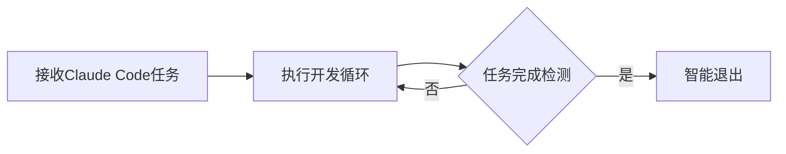
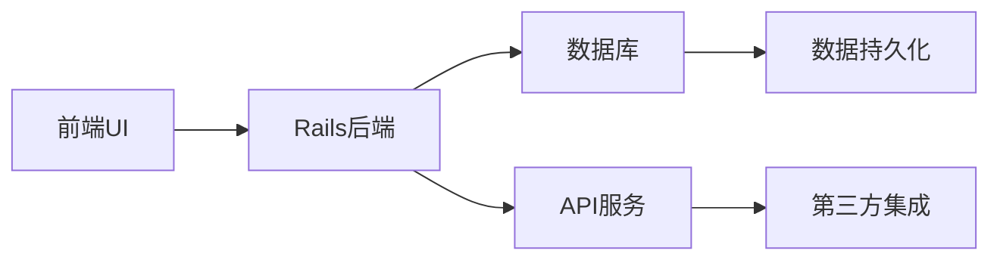

## 今日热点

AI代理与自动化开发工具爆发式增长，Claude相关项目占据榜单前列，同时多模态AI应用成为新热点，展示AI技术向实用化、工具化方向加速演进。

---

## 热门项目一览

| 排名 | 项目 | 语言 | 今日 | 总计 | 简介 |
|:---:|------|:----:|------:|-----:|------|
| 1 | [obra/superpowers](https://github.com/obra/superpowers) | Shell | +1,538 | 18,661 | Claude Code superpowers: co... |
| 2 | [frankbria/ralph-claude-code](https://github.com/frankbria/ralph-claude-code) | Shell | +673 | 2,224 | Autonomous AI development l... |
| 3 | [bytedance/UI-TARS-desktop](https://github.com/bytedance/UI-TARS-desktop) | TypeScript | +492 | 23,202 | The Open-Source Multimodal ... |
| 4 | [home-assistant/home-assistant.io](https://github.com/home-assistant/home-assistant.io) | HTML | +267 | 8,143 | 📘 Home Assistant User docum... |
| 5 | [DioxusLabs/dioxus](https://github.com/DioxusLabs/dioxus) | Rust | +177 | 33,609 | Fullstack app framework for... |
| 6 | [NanmiCoder/MediaCrawler](https://github.com/NanmiCoder/MediaCrawler) | Python | +167 | 42,153 | 小红书笔记 | 评论爬虫、抖音视频 | 评论爬虫、快手... |
| 7 | [iptv-org/iptv](https://github.com/iptv-org/iptv) | TypeScript | +140 | 109,365 | Collection of publicly avai... |
| 8 | [ruvnet/claude-flow](https://github.com/ruvnet/claude-flow) | JavaScript | +102 | 11,686 | 🌊 The leading agent orchest... |
| 9 | [hacksider/Deep-Live-Cam](https://github.com/hacksider/Deep-Live-Cam) | Python | +91 | 77,506 | real time face swap and one... |
| 10 | [opf/openproject](https://github.com/opf/openproject) | Ruby | +72 | 13,952 | OpenProject is the leading ... |
| 11 | [OpenBMB/ChatDev](https://github.com/OpenBMB/ChatDev) | Python | +65 | 28,369 | ChatDev 2.0: Dev All throug... |
| 12 | [mpv-player/mpv](https://github.com/mpv-player/mpv) | C | +26 | 33,487 | 🎥 Command line media player |

---

## 趋势洞察

```
┌─────────────────────────────────────────────────────────────────┐
│  AI/ML 工具         ████████████████████████  6 个项目        │
│  多媒体应用            ████████████              3 个项目        │
│  开发框架             ████                      1 个项目        │
│  智能家居             ████                      1 个项目        │
│  项目管理             ████                      1 个项目        │
└─────────────────────────────────────────────────────────────────┘
```

---

## 项目深度解读

### 1. obra/superpowers — Claude代码增强库

> **一句话总结**：为Claude AI提供代码执行能力的核心技能库，扩展AI编程交互边界。

#### 价值主张

| 维度 | 说明 |
|------|------|
| **解决痛点** | 赋予Claude AI直接执行代码能力，突破纯文本交互限制 |
| **目标用户** | 使用Claude进行编程和自动化任务的开发者 |
| **核心亮点** | 代码执行能力 + 多语言支持 + 安全沙箱 + 函数调用 |

#### 技术架构


**技术特色**：
- 基于Shell实现的轻量级代码执行环境
- 安全沙箱机制隔离执行环境
- 支持多编程语言的函数调用接口

#### 热度分析

- 项目近期Star激增，表明新版本发布或功能获得广泛认可
- 高Star低Fork比例显示项目以使用为主，二次开发需求较低

#### 快速上手

```bash
# 克隆项目
git clone https://github.com/obra/superpowers.git
cd superpowers

# 初始化环境
./setup.sh
```

#### 注意事项

- 需要确保系统环境支持Shell脚本执行
- 执行代码时需注意安全性，避免执行未经验证的代码
- 项目依赖可能随更新而变化，建议查看最新文档


### 2. frankbria/ralph-claude-code — AI开发增强器

> **一句话总结**：为Claude Code构建自主AI开发循环，实现智能任务自动完成与退出检测。

#### 价值主张

| 维度 | 说明 |
|------|------|
| **解决痛点** | 解决Claude Code需要手动干预、无法自主完成复杂开发任务的问题 |
| **目标用户** | AI辅助开发者、自动化测试工程师、持续集成工程师 |
| **核心亮点** | 自主开发循环 + 智能退出检测 + 自动任务管理 |

#### 技术架构



**技术特色**：
- 基于Shell脚本实现轻量级自动化
- 集成Claude Code API实现智能交互
- 开发状态智能检测与自动退出机制

#### 热度分析

- 项目获得2224颗星且单日增长673，表明近期热度急剧上升，可能因AI编程助手领域热点引发关注
- 零开放Issues反映项目稳定且用户需求明确，社区活跃度较高

#### 快速上手

```bash
# 克隆项目
git clone https://github.com/frankbria/ralph-claude-code.git
cd ralph-claude-code
# 运行脚本
./ralph.sh
```

#### 注意事项

- 需要预先安装并配置Claude Code环境
- 项目许可证信息不明确，使用前需确认授权条款
- Shell脚本可能需要根据不同操作系统进行适配调整


### 3. bytedance/UI-TARS-desktop — 多模态AI代理栈

> **一句话总结**：开源多模态AI代理堆栈，连接前沿AI模型与代理基础设施。

#### 价值主张

| 维度 | 说明 |
|------|------|
| **解决痛点** | 解决多模态AI模型与代理基础设施连接的复杂性问题 |
| **目标用户** | AI开发者、研究人员和企业应用开发者 |
| **核心亮点** | 多模态支持 + 开源架构 + 模型连接能力 + 代理基础设施 |

#### 技术架构


**技术特色**：
- 基于TypeScript开发，保证类型安全
- 开源架构，支持自定义扩展
- 连接多种前沿AI模型的能力

#### 热度分析

- Star数超2.3万，今日新增近500，表明项目受关注度高且持续增长
- 作为字节跳动开源项目，在AI代理领域具有重要生态地位

#### 快速上手

```bash
# 克隆仓库
git clone https://github.com/bytedance/UI-TARS-desktop.git

# 安装依赖
cd UI-TARS-desktop
npm install
```

#### 注意事项

- 项目许可证未知，使用前需确认授权条款
- 作为AI代理栈，可能需要配置API密钥或模型访问权限
- 项目Open Issues为0，可能表示项目较新或问题处理机制不同


### 4. home-assistant/home-assistant.io — 智能家居文档

> **一句话总结**：Home Assistant官方用户文档，提供全面智能家居系统配置指南与API参考。

#### 价值主张

| 维度 | 说明 |
|------|------|
| **解决痛点** | 为用户提供系统化的Home Assistant配置和使用指南 |
| **目标用户** | 家庭自动化爱好者、智能家居开发者 |
| **核心亮点** | 结构化文档 + API参考 + 示例丰富 + 持续更新 + 多语言支持 |

#### 技术架构


**技术特色**：
- 基于Markdown的文档编写流程
- GitHub Pages自动部署机制
- 多语言文档支持结构

#### 热度分析

- 项目持续获得高关注度，每日增长约267个Star，表明文档需求旺盛
- 作为IoT领域重要项目的官方文档，具有生态核心地位

#### 快速上手

```bash
# 浏览在线文档
open https://www.home-assistant.io/

# 克隆文档仓库进行本地预览
git clone https://github.com/home-assistant/home-assistant.io.git
cd home-assistant.io
```

#### 注意事项

- 文档内容与Home Assistant软件版本同步，需注意版本对应关系
- 部分高级功能可能需要额外的集成和配置，文档中会明确标注


### 5. DioxusLabs/dioxus — 跨平台全栈框架

> **一句话总结**：使用Rust构建的全栈应用框架，支持一次编码多端运行。

#### 价值主张

| 维度 | 说明 |
|------|------|
| **解决痛点** | 跨平台开发需维护多套代码，Dioxus实现一次编写，多端运行 |
| **目标用户** | Rust开发者、需要高性能跨平台应用的企业和个人 |
| **核心亮点** | 单一代码库支持多平台 + 高性能渲染 + 声明式UI + 基于React理念 + 丰富组件库 |

#### 技术架构


**技术特色**：
- 基于Rust的内存安全和高性能特性
- 声明式UI编程模型，类似于React
- 统一的组件系统，支持跨平台复用

#### 热度分析

- 项目Star数超过3.3万，日增长约177个，表明社区活跃度高，关注度持续上升
- 作为Rust生态中的全栈框架，填补了Rust在Web和桌面应用开发领域的空白

#### 快速上手

```bash
# 创建新项目
cargo install create-dioxus-app
create-dioxus-app my-app
cd my-app
cargo run
```

#### 注意事项

- Dioxus仍在快速发展中，API可能发生变化
- 相较于成熟的前端框架，组件生态系统还不够完善
- 移动端支持可能不如桌面和Web端成熟


### 6. NanmiCoder/MediaCrawler — [多平台爬虫工具]

> **一句话总结**：一站式支持小红书、抖音、快手、B站等多平台内容与评论爬取的高效数据采集工具。

#### 价值主张

| 维度 | 说明 |
|------|------|
| **解决痛点** | 解决多平台数据分散采集难题，提供统一高效的数据获取方案 |
| **目标用户** | 数据分析师、内容营销人员、学术研究人员、舆情监测团队 |
| **核心亮点** | 多平台支持 + 高并发采集 + 反反爬策略 + 模块化设计 + 数据清洗处理 |

#### 技术架构


**技术特色**：
- 异步IO架构，支持高并发爬取提升采集效率
- 智能User-Agent轮换与IP代理池，有效规避平台限制
- 分布式任务队列设计，支持大规模数据采集任务

#### 热度分析

- 项目Star数突破4.2万且持续增长，日均增加170+，表明市场需求旺盛且项目活跃度高
- Fork数近万，社区参与度高，用户积极进行二次开发与定制化改造

#### 快速上手

```bash
# 克隆项目
git clone https://github.com/NanmiCoder/MediaCrawler.git

# 安装依赖
cd MediaCrawler && pip install -r requirements.txt

# 配置目标平台后运行
python run.py
```

#### 注意事项

- 请严格遵守各平台使用协议，不得用于商业用途或违反法律法规
- 部分平台可能需要登录验证或特定配置才能获取完整数据
- 定期关注项目更新以应对平台反爬策略变化，避免账号风险


### 7. iptv-org/iptv — 全球IPTV频道库

> **一句话总结**：汇集全球公开IPTV频道，提供免费电视流媒体资源，支持多平台播放。

#### 价值主张

| 维度 | 说明 |
|------|------|
| **解决痛点** | 解决用户寻找合法免费电视频道资源分散的问题 |
| **目标用户** | 需要免费电视资源的个人用户、开发者、内容整合平台 |
| **核心亮点** | 全球覆盖 + 实时更新 + 多格式支持 + 社区驱动 |

#### 技术架构


**技术特色**：
- 使用TypeScript保证代码质量和可维护性
- 结构化存储频道元数据和播放链接
- 社区协作机制确保频道列表持续更新
- 支持多种播放器格式兼容，适应不同设备

#### 热度分析

- 项目Star数超10万，近期增长迅速，表明全球用户对IPTV资源的高需求
- 作为开源项目，拥有活跃的贡献者社区，持续维护频道资源质量

#### 快速上手

```bash
# 克隆项目仓库
git clone https://github.com/iptv-org/iptv.git

# 查看频道列表
cat iptv/playlist.m3u
```

#### 注意事项

- 频道资源可能受地理位置限制，某些频道可能无法访问
- 部分频道可能不稳定，需要定期更新维护
- 使用时需遵守当地法律法规，尊重版权
- 建议使用官方维护的播放列表，避免使用第三方修改版本


### 8. ruvnet/claude-flow — 智能体编排平台

> **一句话总结**：Claude智能体编排平台，支持多群体协同与工作流自动化，构建企业级对话AI系统。

#### 价值主张

| 维度 | 说明 |
|------|------|
| **解决痛点** | 解决Claude智能体间协同与复杂工作流自动化难题 |
| **目标用户** | 企业开发者、AI系统架构师、对话式AI应用构建者 |
| **核心亮点** | 多群体智能编排 + 企业级架构 + RAG集成 + MCP协议支持 + 分布式智能 |

#### 技术架构


**技术特色**：
- 分布式群体智能架构，实现多智能体协同工作
- MCP协议原生支持，深度集成Claude Code能力
- 企业级可扩展设计，支持大规模部署与监控

#### 热度分析

- 项目获得11.6k+星标，日增102星，热度持续攀升，在Claude相关工具中位居前列
- 零开放问题，表明项目维护良好，社区参与度高，生态地位稳固

#### 快速上手

```bash
# 克隆仓库
git clone https://github.com/ruvnet/claude-flow.git

# 安装依赖并启动
cd claude-flow && npm install && npm start
```

#### 注意事项

- 项目许可信息未知，商业使用前需确认授权条款
- 作为企业级平台，建议在生产环境前进行充分测试和性能评估
- 需要Claude API访问权限，确保已获取有效的API密钥


### 9. hacksider/Deep-Live-Cam — 实时换面工具

> **一句话总结**：Deep-Live-Cam是一款基于单张图片实现实时面部交换和视频deepfake的Python工具，支持高质量、低延迟的面部替换。

#### 价值主张

| 维度 | 说明 |
|------|------|
| **解决痛点** | 解决了传统deepfake工具需要大量计算资源和专业知识的问题，实现一键式实时面部交换 |
| **目标用户** | 内容创作者、视频特效爱好者、安全研究人员和普通用户 |
| **核心亮点** | 单图片驱动 + 实时处理 + 高质量输出 + 轻量化部署 + 易于使用 |

#### 技术架构


**技术特色**：
- 基于深度学习的实时面部识别与替换技术
- 高效的模型推理优化，支持CPU和GPU运行
- 轻量级部署，无需复杂环境配置

#### 热度分析

- 项目Star数超过7.7万，Fork数超1.1万，表明其在实时deepfake领域具有显著影响力且增长迅速。
- 作为开源项目，在AI内容创作工具生态中占据重要位置，用户活跃度高。

#### 快速上手

```bash
# 克隆项目
git clone https://github.com/hacksider/Deep-Live-Cam.git
cd Deep-Live-Cam

# 安装依赖
pip install -r requirements.txt

# 运行项目
python run.py --source face.jpg --output output.mp4
```

#### 注意事项

- 请注意合法合规使用，避免侵犯他人肖像权
- 项目可能需要较好的硬件配置以保证实时处理效果
- 建议在隔离环境中运行，确保系统安全


### 10. opf/openproject — 开源项目管理

> **一句话总结**：全功能开源项目管理解决方案，支持敏捷开发与甘特图，提供团队协作一站式平台。

#### 价值主张

| 维度 | 说明 |
|------|------|
| **解决痛点** | 提供企业级开源项目管理替代商业工具，降低成本 |
| **目标用户** | 中小型企业开发团队、项目管理专业人士 |
| **核心亮点** | 全面的项目规划功能 + 敏捷开发支持 + 甘特图可视化 + 工作流自定义 + 多语言支持 |

#### 技术架构



**技术特色**：
- 基于 Ruby on Rails 框架构建，遵循MVC设计模式
- 采用RESTful API架构，支持多客户端接入
- 使用PostgreSQL作为主要数据库，保证数据一致性
- 支持Docker容器化部署，简化环境配置

#### 热度分析

- 项目持续稳定增长，近一日增加72星，表明社区认可度高
- Fork数约为Star数的22%，反映用户参与度和二次开发意愿较强

#### 快速上手

```bash
# 克隆项目
git clone https://github.com/opf/openproject.git

# 安装依赖
bundle install

# 初始化数据库
rake db:migrate
```

#### 注意事项

- 部署过程相对复杂，需要Ruby环境和数据库支持
- 大型项目部署可能需要优化性能和配置
- 社区版与企业版功能有差异，商业功能需要额外授权


### 11. OpenBMB/ChatDev — 智能协作开发平台

> **一句话总结**：ChatDev利用LLM驱动的多智能体协作，实现全流程自动化软件开发。

#### 价值主张

| 维度 | 说明 |
|------|------|
| **解决痛点** | 传统软件开发流程繁琐、效率低下，AI辅助开发缺乏系统化解决方案 |
| **目标用户** | 软件开发团队、AI研究人员、自动化工具开发者 |
| **核心亮点** | 多智能体协作 + 全流程自动化 + LLM驱动开发 + 可扩展架构 + 开源生态 |

#### 技术架构


**技术特色**：
- 基于LLM的多智能体协作架构
- 全流程自动化开发管道
- 可定制的开发角色与职责分配
- 模块化设计便于扩展
- 支持多种LLM模型集成

#### 热度分析

- 项目Star数超2.8万，日增65星，表明社区关注度持续高涨
- Fork数约3600，说明项目被广泛尝试和二次开发，生态活跃

#### 快速上手

```bash
# 克隆仓库
git clone https://github.com/OpenBMB/ChatDev.git

# 安装依赖
cd ChatDev
pip install -r requirements.txt

# 运行示例
python main.py --task "create a simple calculator"
```

#### 注意事项

- 需要配置有效的LLM API密钥才能正常运行
- 项目依赖较新的Python版本和第三方库，确保环境兼容性
- 可能需要较高的计算资源，特别是处理复杂开发任务时
- 自定义智能体行为需要一定的编程知识


### 12. mpv-player/mpv — 命令行媒体播放器

> **一句话总结**：极简主义命令行媒体播放器，轻量高效且高度可配置，支持几乎所有媒体格式。

#### 价值主张

| 维度 | 说明 |
|------|------|
| **解决痛点** | 提供无GUI干扰的媒体播放体验，适合开发者、系统管理员和高级用户 |
| **目标用户** | 开发者、系统管理员、命令行爱好者、媒体处理专业人士 |
| **核心亮点** | 极简设计 + 高度可配置 + 跨平台支持 + 低资源占用 + 丰富的输入控制 |

#### 技术架构


**技术特色**：
- 基于libav/FFmpeg多媒体框架，支持几乎所有媒体格式编解码
- 采用客户端/服务器架构，支持远程控制
- 使用OpenGL/Vulkan进行硬件加速渲染

#### 热度分析

- 持稳定增长，日均新增约26个星标，表明项目在媒体播放领域保持活跃和吸引力
- 社区活跃度高，作为命令行媒体播放器的标杆项目，在Linux和开发者社区有重要地位

#### 快速上手

```bash
# 安装mpv
sudo apt install mpv  # Debian/Ubuntu
brew install mpv     # macOS

# 播放本地文件
mpv movie.mp4

# 播放网络流
mpv https://example.com/stream.mp4
```

#### 注意事项

- 命令行界面对新手可能不够友好，建议先熟悉基本控制命令
- 某些高级功能可能需要配置文件或脚本支持
- 硬件加速支持取决于系统和驱动程序配置


## 今日推荐

| 主题 | 推荐项目 | 亮点 |
|------|----------|------|
| 今日最热 | [obra/superpowers](https://github.com/obra/superpowers) | Claude Code super... |
| 值得关注 | [frankbria/ralph-claude-code](https://github.com/frankbria/ralph-claude-code) | Autonomous AI dev... |
| 快速上手 | [bytedance/UI-TARS-desktop](https://github.com/bytedance/UI-TARS-desktop) | The Open-Source M... |
| 长期潜力 | [home-assistant/home-assistant.io](https://github.com/home-assistant/home-assistant.io) | 📘 Home Assistant ... |

---

<div align="center">

*Generated on 2026-01-13 | Powered by GitHub Trending Reporter*

</div>