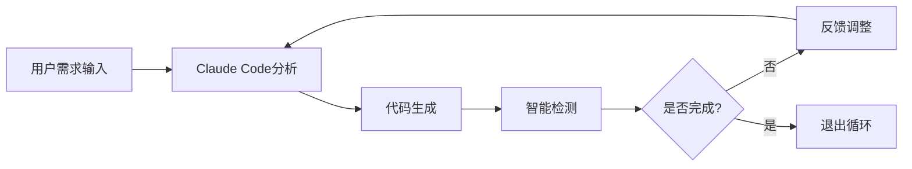

## 今日热点

今日GitHub热榜显示AI代理工具和Claude生态系统呈现爆发式增长，同时深度伪造技术与多模态AI系统持续受到开发者关注。

---

## 热门项目一览

| 排名 | 项目 | 语言 | 今日 | 总计 | 简介 |
|:---:|------|:----:|------:|-----:|------|
| 1 | [obra/superpowers](https://github.com/obra/superpowers) | Shell | +1,538 | 19,210 | Claude Code superpowers: co... |
| 2 | [frankbria/ralph-claude-code](https://github.com/frankbria/ralph-claude-code) | Shell | +673 | 2,369 | Autonomous AI development l... |
| 3 | [bytedance/UI-TARS-desktop](https://github.com/bytedance/UI-TARS-desktop) | TypeScript | +492 | 23,323 | The Open-Source Multimodal ... |
| 4 | [home-assistant/home-assistant.io](https://github.com/home-assistant/home-assistant.io) | HTML | +267 | 8,199 | 📘 Home Assistant User docum... |
| 5 | [DioxusLabs/dioxus](https://github.com/DioxusLabs/dioxus) | Rust | +177 | 33,823 | Fullstack app framework for... |
| 6 | [NanmiCoder/MediaCrawler](https://github.com/NanmiCoder/MediaCrawler) | Python | +167 | 42,390 | 小红书笔记 | 评论爬虫、抖音视频 | 评论爬虫、快手... |
| 7 | [iptv-org/iptv](https://github.com/iptv-org/iptv) | TypeScript | +140 | 109,466 | Collection of publicly avai... |
| 8 | [ruvnet/claude-flow](https://github.com/ruvnet/claude-flow) | JavaScript | +102 | 11,811 | 🌊 The leading agent orchest... |
| 9 | [hacksider/Deep-Live-Cam](https://github.com/hacksider/Deep-Live-Cam) | Python | +91 | 77,634 | real time face swap and one... |
| 10 | [opf/openproject](https://github.com/opf/openproject) | Ruby | +72 | 14,023 | OpenProject is the leading ... |
| 11 | [OpenBMB/ChatDev](https://github.com/OpenBMB/ChatDev) | Python | +65 | 28,452 | ChatDev 2.0: Dev All throug... |
| 12 | [mpv-player/mpv](https://github.com/mpv-player/mpv) | C | +26 | 33,539 | 🎥 Command line media player |

---

## 趋势洞察

```
┌─────────────────────────────────────────────────────────────────┐
│  AI/ML 工具         ████████████████████████  6 个项目        │
│  多媒体应用            ████████████              3 个项目        │
│  开发框架             ████                      1 个项目        │
│  智能家居             ████                      1 个项目        │
│  项目管理             ████                      1 个项目        │
└─────────────────────────────────────────────────────────────────┘
```

---

## 项目深度解读

### 1. obra/superpowers — Claude技能库

> **一句话总结**：为Claude AI提供核心Shell脚本技能库，扩展AI编程能力边界

#### 价值主张

| 维度 | 说明 |
|------|------|
| **解决痛点** | 为Claude AI提供额外编程工具集，突破原有功能限制 |
| **目标用户** | 使用Claude AI的开发者和技术研究人员 |
| **核心亮点** | Shell脚本集成 + AI能力扩展 + 即用型代码库 + 开源协作 + 无缝Claude集成 |

#### 技术架构


**技术特色**：
- 纯Shell脚本实现，跨平台兼容性强
- 模块化设计，功能独立可组合
- 与Claude深度集成，无缝扩展AI能力

#### 热度分析

- 项目获19K+星标，单日增长超1.5K，表明近期热度激增
- 社区活跃度高，形成围绕Claude AI的扩展工具生态圈

#### 快速上手

```bash
# 克隆仓库
git clone https://github.com/obra/superpowers.git
# 进入目录并查看可用脚本
cd superpowers && ls -la scripts/
```

#### 注意事项

- 项目许可证未知，商业使用前需确认版权条款
- 部分脚本可能需要Claude API访问权限或特定环境配置
- Shell脚本执行需注意系统安全，建议在沙箱环境中测试


### 2. frankbria/ralph-claude-code — AI开发自动化

> **一句话总结**：为Claude Code构建的自主AI开发循环工具，实现智能退出检测与自动化代码生成

#### 价值主张

| 维度 | 说明 |
|------|------|
| **解决痛点** | 解决AI辅助开发中人工干预过多、缺乏完整自动化循环的问题 |
| **目标用户** | 使用Claude Code的开发者，希望实现更高效AI辅助编程流程 |
| **核心亮点** | 自主开发循环 + 智能退出检测 + 自动化代码生成 + 减少人工干预 |

#### 技术架构



**技术特色**：
- 基于Shell脚本实现轻量级自动化开发流程
- 集成Claude Code API进行智能代码生成
- 实现智能退出检测机制，避免无限循环

#### 热度分析

- 项目在短时间内获得大量Stars(+673 today)，显示社区对AI辅助开发工具有强烈兴趣
- 虽然Issues为0，但Fork数相对较低，表明项目更偏向于直接使用而非二次开发

#### 快速上手

```bash
# 安装ralph-claude-code
git clone https://github.com/frankbria/ralph-claude-code.git
cd ralph-claude-code
chmod +x ralph-claude-code.sh
./ralph-claude-code.sh
```

#### 注意事项

- 需要确保已安装Claude Code及其依赖环境
- 项目可能需要配置API密钥或其他认证信息
- 由于是自动化开发工具，建议在非关键项目中先测试其生成代码的质量


### 3. bytedance/UI-TARS-desktop — 多模态AI代理栈

> **一句话总结**：开源多模态AI代理堆栈，连接前沿AI模型与代理基础设施。

#### 价值主张

| 维度 | 说明 |
|------|------|
| **解决痛点** | 统一连接多种AI模型和代理基础设施，简化多模态AI应用开发 |
| **目标用户** | AI开发者、研究人员和企业技术团队 |
| **核心亮点** | 多模态支持 + 开源生态 + 模块化架构 + 高性能 + 易于集成 |

#### 技术架构


**技术特色**：
- 统一的多模态数据处理框架
- 模块化AI模型适配机制
- 高性能代理执行引擎

#### 热度分析

- 项目Star数超2.3万，近期增长迅速，日均新增约500星，表明社区关注度极高
- 由字节跳动开源，处于AI基础设施生态重要位置，有望成为行业标准工具

#### 快速上手

```bash
# 克隆项目
git clone https://github.com/bytedance/UI-TARS-desktop.git

# 安装依赖
npm install

# 启动开发环境
npm run dev
```

#### 注意事项

- 项目依赖较新的Node.js版本，建议使用最新稳定版
- 使用前需要配置AI模型访问权限和API密钥
- 部分高级功能需要额外的硬件资源支持


### 4. home-assistant/home-assistant.io — 智能家居文档

> **一句话总结**：Home Assistant 开源智能家居系统的官方用户文档，提供全面的使用指南和API参考。

#### 价值主张

| 维度 | 说明 |
|------|------|
| **解决痛点** | 为 Home Assistant 用户提供系统配置、集成和故障排除的完整指南 |
| **目标用户** | Home Assistant 用户、开发者和智能家居爱好者 |
| **核心亮点** | 完整的文档体系 + 实用的教程指南 + 丰富的API参考 + 社区贡献 + 多语言支持 |

#### 技术架构


**技术特色**：
- 基于 Markdown 的文档编写，便于维护和版本控制
- 采用静态站点生成技术，确保快速加载和高可用性
- 支持多语言文档，满足全球用户需求

#### 热度分析

- 项目 Star 数量持续稳定增长，表明 Home Assistant 用户群体不断扩大，文档需求旺盛
- 作为官方文档项目，在智能家居领域具有重要生态地位，是用户获取信息的主要渠道

#### 快速上手

```bash
# 克隆项目
git clone https://github.com/home-assistant/home-assistant.io

# 安装依赖
pip install -r requirements.txt

# 本地运行
python -m mkdocs serve
```

#### 注意事项

- 文档内容随 Home Assistant 版本更新而变化，需关注版本对应关系
- 社区贡献者可通过 Pull Request 方式参与文档更新和改进
- 部分高级功能可能需要额外的技术背景才能理解


### 5. DioxusLabs/dioxus — 跨平台全栈框架

> **一句话总结**：基于 Rust 的全栈应用框架，支持一次编写，多平台部署（Web、桌面和移动）。

#### 价值主张

| 维度 | 说明 |
|------|------|
| **解决痛点** | 提供统一的 Rust 全栈开发体验，解决多平台重复开发问题 |
| **目标用户** | Rust 开发者，希望构建跨平台全栈应用的开发者 |
| **核心亮点** | 统一组件模型 + 虚拟DOM + 声明式UI + 跨平台支持 |

#### 技术架构


**技术特色**：
- 使用 Rust 语言提供高性能和内存安全保证
- 采用类似 React 的声明式 UI 模型和虚拟 DOM
- 统一的组件模型，可在不同平台间共享代码
- 支持服务器端渲染(SSR)和静态站点生成(SSG)

#### 热度分析

- 项目 Star 数量持续增长，近期新增 177 stars，显示活跃的开发社区
- 在 Rust 全栈框架领域处于领先地位，生态正在快速扩展

#### 快速上手

```bash
# 创建新项目
cargo install create-dioxus-cli
create-dioxus-app my-app
cd my-app
cargo run
```

#### 注意事项

- Dioxus 仍在积极开发中，API 可能会有变化
- 相比成熟的框架，某些高级功能可能还不完善
- 需要一定的 Rust 基础才能充分利用框架特性


### 6. NanmiCoder/MediaCrawler — 全平台媒体爬虫

> **一句话总结**：一站式多平台媒体内容与评论爬取工具，支持小红书、抖音、快手等主流社交平台。

#### 价值主张

| 维度 | 说明 |
|------|------|
| **解决痛点** | 解决多平台媒体数据分散采集难题，提供统一接口 |
| **目标用户** | 数据分析师、内容营销人员、研究人员、竞品分析团队 |
| **核心亮点** | 多平台支持 + 模块化设计 + 反爬应对 + 配置灵活 + 更新及时 |

#### 技术架构


**技术特色**：
- 分布式爬取架构，支持大规模数据采集
- 智能反爬策略，应对各平台反爬机制
- 配置化设计，无需修改代码即可适配不同平台

#### 热度分析

- 项目Star数超过4万，日均增长约170，表明社区活跃度高，需求旺盛
- Fork数近万，说明项目被广泛采用和二次开发，在数据采集领域具有重要影响力

#### 快速上手

```bash
# 克隆项目
git clone https://github.com/NanmiCoder/MediaCrawler.git

# 安装依赖
pip install -r requirements.txt

# 运行示例
python run.py
```

#### 注意事项

- 请遵守各平台的使用协议和法律法规，合理使用爬虫
- 部分平台可能需要登录或使用特定API密钥
- 反爬机制可能随时更新，需要关注项目维护状态


### 7. iptv-org/iptv — [全球IPTV库]

> **一句话总结**：全球公开IPTV频道集合，多国多语种内容，为用户提供免费电视直播源。

#### 价值主张

| 维度 | 说明 |
|------|------|
| **解决痛点** | 解决用户寻找稳定、免费IPTV频道源的困难 |
| **目标用户** | IPTV爱好者、电视内容收集者、开发者 |
| **核心亮点** | 全球覆盖+多语言支持+社区更新+开源免费+结构化数据 |

#### 技术架构


**技术特色**：
- 采用M3U播放列表和EPG电子节目单标准
- 社区驱动的全球频道收集与维护机制
- 结构化数据存储便于程序化处理与集成

#### 热度分析

- 项目获星超10万且持续增长，日增140+，反映全球用户对免费IPTV资源的强烈需求
- 作为开源内容聚合项目，在IPTV领域占据核心生态位置，为众多应用提供频道源

#### 快速上手

```bash
# 克隆项目获取频道列表
git clone https://github.com/iptv-org/iptv.git

# 使用播放器打开m3u播放列表
# 例如VLC: vlc iptv/streams.m3u
```

#### 注意事项

- 频道源可能受地理位置限制，部分内容可能无法访问
- 频道稳定性依赖于原始提供者，项目本身不保证长期可用性
- 使用时请遵守当地法律法规，尊重内容版权


### 8. ruvnet/claude-flow — Claude智能体编排

> **一句话总结**：Claude智能体编排平台，支持多智能体群集、自主工作流和对话AI系统构建。

#### 价值主张

| 维度 | 说明 |
|------|------|
| **解决痛点** | 解决Claude智能体协同工作、复杂任务分解与多智能体编排问题 |
| **目标用户** | 企业级AI应用开发者、对话AI系统构建者、智能体编排需求方 |
| **核心亮点** | 企业级架构 + 分布式群集智能 + RAG集成 + MCP协议原生支持 |

#### 技术架构


**技术特色**：
- 分布式智能体群集架构，支持大规模智能体协同
- 企业级设计，具备高可用性和扩展性
- 通过MCP协议提供原生Claude Code支持

#### 热度分析

- 项目获得11,811个星标，今日新增102个，增长稳定且活跃度高
- Fork数达1,494，表明社区参与度高，在Claude智能体编排领域具有领先地位

#### 快速上手

```bash
# 克隆项目
git clone https://github.com/ruvnet/claude-flow.git
cd claude-flow

# 安装依赖
npm install

# 启动服务
npm start
```

#### 注意事项

- 项目许可证未知，商业使用前需确认授权
- Open Issues为0，可能表示项目处于稳定状态或问题管理方式不同
- 作为企业级平台，可能需要较高的计算资源支持


### 9. hacksider/Deep-Live-Cam — 实时换脸工具

> **一句话总结**：仅需单张图片即可实现实时面部交换和一键视频深度伪造，创造逼真的换脸效果。

#### 价值主张

| 维度 | 说明 |
|------|------|
| **解决痛点** | 用户无需专业技能即可实现高质量实时面部替换，降低深度伪造技术门槛 |
| **目标用户** | 内容创作者、视频爱好者、特效制作人员、社交媒体用户 |
| **核心亮点** | 单张图片即可实现实时面部替换 + 高质量视频生成 + 操作简单一键式 + 支持实时处理 + 低硬件需求 |

#### 技术架构


**技术特色**：
- 基于深度学习的实时面部识别与替换技术
- 仅需单张参考图片即可生成逼真的换脸效果
- 高效的算法优化，支持普通硬件实时处理
- 一键式操作流程，降低技术门槛

#### 热度分析

- 项目获得77k+高星，日增91星，表明技术热点高，社区认可度强
- 11k+ fork数反映开发者社区参与度高，可能有多个衍生版本或改进实现

#### 快速上手

```bash
# 克隆项目
git clone https://github.com/hacksider/Deep-Live-Cam.git

# 安装依赖
pip install -r requirements.txt

# 运行程序
python deep_live_cam.py
```

#### 注意事项

- 注意深度伪造技术的伦理和法律问题，仅在合法合规范围内使用
- 项目可能需要较好的硬件性能（特别是GPU）以实现流畅的实时处理
- 使用不同质量的参考图片可能会影响最终效果
- 项目可能需要较新的Python版本和依赖库


### 10. opf/openproject — 开源项目管理平台

> **一句话总结**：功能全面的企业级开源项目管理解决方案，支持敏捷开发与传统项目管理方法。

#### 价值主张

| 维度 | 说明 |
|------|------|
| **解决痛点** | 企业需要灵活、可定制且成本效益高的项目管理工具，替代昂贵商业软件 |
| **目标用户** | 软件开发团队、工程部门、项目管理办公室和企业组织 |
| **核心亮点** | 端到端项目生命周期管理 + 多种视图模式 + 强大的权限控制系统 + DevOps工具链集成 |

#### 技术架构


**技术特色**：
- 基于Ruby on Rails的全栈MVC架构，保证开发效率
- RESTful API设计，支持第三方集成和自动化
- 插件系统允许功能扩展和定制化开发

#### 热度分析

- 项目Star数持续增长，超过14,000，表明其在开源项目管理领域具有广泛认可度
- 作为替代商业项目管理工具的重要选择，在企业级开源软件生态中占据重要位置

#### 快速上手

```bash
# 克隆项目
git clone https://github.com/opf/openproject.git
# 安装依赖
bundle install
# 初始化数据库
bundle exec rake db:create db:migrate
```

#### 注意事项

- 部署OpenProject需要一定的Ruby on Rails和PostgreSQL知识
- 对于大型团队，可能需要配置足够的服务器资源以确保性能
- 建议使用官方提供的Docker镜像简化部署过程
- 定期更新以获取安全补丁和新功能


### 11. OpenBMB/ChatDev — AI开发协作平台

> **一句话总结**：通过大语言模型驱动的多智能体协作，实现全流程自动化软件开发。

#### 价值主张

| 维度 | 说明 |
|------|------|
| **解决痛点** | 传统软件开发流程繁琐，AI辅助开发缺乏系统性协作 |
| **目标用户** | 软件开发者、AI研究人员、创新团队 |
| **核心亮点** | 多智能体协作 + 全流程开发 + LLM驱动 + 模块化架构 + 自动化生成 |

#### 技术架构


**技术特色**：
- 基于LLM的多智能体协作框架
- 模块化与可扩展的软件开发生态
- 全流程自动化软件开发流水线

#### 热度分析

- Star数达28,452且持续增长，表明AI辅助开发领域热度高
- OpenBMB社区支持下，已成为AI开发工具的重要生态节点

#### 快速上手

```bash
# 克隆仓库
git clone https://github.com/OpenBMB/ChatDev.git

# 安装依赖
pip install -r requirements.txt

# 运行示例
python main.py --task "create a simple calculator" --working_dir ./workspace
```

#### 注意事项

- 需要OpenAI API密钥或其他LLM服务支持
- 项目依赖较多，Python环境配置需谨慎
- 多智能体协作效果受LLM能力限制


### 12. mpv-player/mpv — [轻量级全能播放器]

> **一句话总结**：mpv是一款高度可配置、跨平台的命令行媒体播放器，以简洁高效著称。

#### 价值主张

| 维度 | 说明 |
|------|------|
| **解决痛点** | 解决传统图形界面播放器资源占用高、配置不灵活的问题 |
| **目标用户** | 命令行爱好者、视频发烧友、开发者、系统管理员 |
| **核心亮点** | 轻量级 + 高度可配置 + 跨平台支持 + 硬件加速 + 高度可定制 |

#### 技术架构


**技术特色**：
- 基于MPlayer和mplayer2发展而来，代码精简高效
- 使用libav进行多媒体解码，支持几乎所有格式
- 完整的脚本支持，可通过Lua等扩展功能
- 硬件加速支持，包括OpenGL、Vulkan等
- 无图形界面依赖，资源占用极低

#### 热度分析

- 项目持续稳定增长，Star数超3.3万，表明其在命令行播放器领域的领先地位
- 社区活跃度高，虽Issues为0但通过邮件列表和IRC保持活跃交流，是多媒体处理领域的重要工具

#### 快速上手

```bash
# 安装mpv（以Ubuntu为例）
sudo apt install mpv

# 播放视频文件
mpv video.mp4

# 播放网络流
mpv https://example.com/stream.mp4
```

#### 注意事项

- 命令行界面对新手可能不够友好
- 配置文件位于~/.config/mpv/mpv.conf，需要一定学习成本
- 某些高级功能需要了解特定命令参数或脚本编写


## 今日推荐

| 主题 | 推荐项目 | 亮点 |
|------|----------|------|
| 今日最热 | [obra/superpowers](https://github.com/obra/superpowers) | Claude Code super... |
| 值得关注 | [frankbria/ralph-claude-code](https://github.com/frankbria/ralph-claude-code) | Autonomous AI dev... |
| 快速上手 | [bytedance/UI-TARS-desktop](https://github.com/bytedance/UI-TARS-desktop) | The Open-Source M... |
| 长期潜力 | [home-assistant/home-assistant.io](https://github.com/home-assistant/home-assistant.io) | 📘 Home Assistant ... |

---

<div align="center">

*Generated on 2026-01-13 | Powered by GitHub Trending Reporter*

</div>