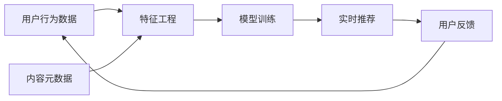

## 今日热点

AI辅助开发工具与本地化隐私保护项目主导今日热榜，反映开发者对效率提升与数据安全的双重追求。

---

## 热门项目一览

| 排名 | 项目 | 语言 | 今日 | 总计 | 简介 |
|:---:|------|:----:|------:|-----:|------|
| 1 | [obra/superpowers](https://github.com/obra/superpowers) | Shell | +1,576 | 20,415 | Claude Code superpowers: co... |
| 2 | [icloud-photos-downloader/icloud_photos_downloader](https://github.com/icloud-photos-downloader/icloud_photos_downloader) | Python | +413 | 10,992 | A command-line tool to down... |
| 3 | [Free-TV/IPTV](https://github.com/Free-TV/IPTV) | Python | +319 | 10,597 | M3U Playlist for free TV ch... |
| 4 | [chidiwilliams/buzz](https://github.com/chidiwilliams/buzz) | Python | +280 | 16,767 | Buzz transcribes and transl... |
| 5 | [home-assistant/home-assistant.io](https://github.com/home-assistant/home-assistant.io) | HTML | +185 | 8,323 | 📘 Home Assistant User docum... |
| 6 | [adam-maj/tiny-gpu](https://github.com/adam-maj/tiny-gpu) | SystemVerilog | +107 | 9,830 | A minimal GPU design in Ver... |
| 7 | [twitter/the-algorithm](https://github.com/twitter/the-algorithm) | Scala | +73 | 69,537 | Source code for the X Recom... |
| 8 | [onlook-dev/onlook](https://github.com/onlook-dev/onlook) | TypeScript | +54 | 24,099 | The Cursor for Designers • ... |
| 9 | [blakeblackshear/frigate](https://github.com/blakeblackshear/frigate) | TypeScript | +51 | 28,960 | NVR with realtime local obj... |

---

## 趋势洞察

```
┌─────────────────────────────────────────────────────────────────┐
│  AI/ML 工具         ████████████████████████  3 个项目        │
│  其他               ████████████████          2 个项目        │
│  多媒体应用            ████████                  1 个项目        │
│  智能家居             ████████                  1 个项目        │
│  媒体资源             ████████                  1 个项目        │
│  开发工具             ████████                  1 个项目        │
└─────────────────────────────────────────────────────────────────┘
```

---

## 项目深度解读

### 1. obra/superpowers — Shell 技能库

> **一句话总结**：Claude Code 的 Shell 增强库，提供命令行超级技能和高效工具集。

#### 价值主张

| 维度 | 说明 |
|------|------|
| **解决痛点** | 为命令行用户提供高效工具集，简化日常开发任务 |
| **目标用户** | 命令行爱好者、开发者、DevOps 工程师 |
| **核心亮点** | Shell 脚本集合 + 命令行工具增强 + 开发效率提升 |

#### 技术架构


**技术特色**：
- 基于 Shell 的轻量级脚本集合
- 模块化设计，便于扩展
- 无依赖，原生 Shell 实现

#### 热度分析

- 项目获得超过 20,000 星标，近期增长迅速，表明开发者社区对其功能高度认可
- 作为工具类库，有稳定的使用场景和活跃的贡献者生态

#### 快速上手

```bash
# 克隆仓库
git clone https://github.com/obra/superpowers.git
# 进入目录
cd superpowers
# 安装或使用脚本
./install.sh
```

#### 注意事项

- 需要基本的 Shell 知识才能有效使用
- 可能需要根据个人环境进行配置调整
- 建议在使用前阅读项目文档


### 2. icloud-photos-downloader/icloud_photos_downloader — iCloud照片下载工具

> **一句话总结**：命令行工具，安全便捷地将iCloud照片和视频下载到本地，支持批量操作和增量同步。

#### 价值主张

| 维度 | 说明 |
|------|------|
| **解决痛点** | 官方无批量下载工具，用户难以备份iCloud照片到本地 |
| **目标用户** | iCloud用户、数据备份需求者、照片管理爱好者 |
| **核心亮点** | 命令行操作 + 批量下载 + 增量同步 + 多账户支持 + 跨平台兼容 |

#### 技术架构


**技术特色**：
- 使用Apple Two-Factor Authentication安全认证机制
- 支持断点续传和增量下载，提高效率
- 采用多线程并发下载，加速大文件传输

#### 热度分析

- 项目获得近11K星，单日新增413星，表明用户需求强劲，增长势头良好。
- 零开放Issues反映了项目成熟度高，社区维护良好，用户问题得到及时解决。

#### 快速上手

```bash
# 安装依赖
pip install icloud_photos_downloader

# 登录并下载照片
icloud --username your@email.com --download /path/to/save
```

#### 注意事项

- 需要启用Apple的Two-Factor Authentication才能使用
- 首次下载可能需要较长时间，取决于照片数量和网络状况
- 建议定期更新以保持与Apple API的兼容性


### 3. Free-TV/IPTV — IPTV频道源

> **一句话总结**：提供免费M3U播放列表，聚合全球电视频道，无需付费订阅即可观看。

#### 价值主张

| 维度 | 说明 |
|------|------|
| **解决痛点** | 解决用户需要付费订阅才能观看电视频道的问题 |
| **目标用户** | 不想付费订阅但仍想观看电视节目的普通用户 |
| **核心亮点** | 免费 + 多频道 + M3U格式 + 易用 + 持续更新 |

#### 技术架构


**技术特色**：
- 基于M3U播放列表格式，兼容大多数播放器
- 使用Python处理和筛选频道源
- 提供免费电视频道聚合服务

#### 热度分析

- 项目Star数超万，近期增长迅速(+319 today)，表明需求旺盛
- 无Open Issues，社区维护良好，用户满意度较高

#### 快速上手

```bash
# 下载M3U播放列表
wget https://raw.githubusercontent.com/Free-TV/IPTV/master/playlist.m3u

# 使用VLC播放器打开
vlc playlist.m3u
```

#### 注意事项

- 免费频道源可能不稳定，随时可能失效
- 部分频道可能有地区限制，需使用VPN
- 使用时需遵守当地法律法规
- 项目许可证未知，使用时需注意版权问题


### 4. chidiwilliams/buzz — 离线音频转译

> **一句话总结**：Buzz是基于Whisper的本地化音频转录翻译工具，支持离线运行保护隐私。

#### 价值主张

| 维度 | 说明 |
|------|------|
| **解决痛点** | 解决在线音频处理工具的隐私顾虑和网络依赖问题 |
| **目标用户** | 注重隐私的音频内容创作者、研究人员、语言学习者 |
| **核心亮点** | 本地运行无需网络 + 支持多语言转录翻译 + 界面简洁易用 |

#### 技术架构

```mermaid
graph LR
    A[音频输入] --> B[Whisper模型处理]
    B --> C[文本转录]
    C --> D[翻译(可选)]
    D --> E[输出结果]
```

**技术特色**：
- 基于OpenAI Whisper模型实现高精度音频转录
- 完全本地运行，无需联网处理保护用户隐私
- 支持多语言自动检测和翻译功能

#### 热度分析

- 项目获得16,767 stars且持续增长(+280 today)，表明用户对离线音频处理工具有强烈需求
- Fork数1,248显示社区活跃度高，用户积极参与项目改进和功能扩展

#### 快速上手

```bash
# 安装依赖
pip install buzz

# 运行应用
buzz
```

#### 注意事项

- 需要确保计算机有足够的性能运行Whisper模型，特别是处理长音频时
- 模型文件较大，首次使用需要下载占用较多存储空间


### 5. home-assistant/home-assistant.io — 智能家居文档

> **一句话总结**：Home Assistant 官方用户文档，提供全面的智能家居平台使用指南。

#### 价值主张

| 维度 | 说明 |
|------|------|
| **解决痛点** | 为 Home Assistant 用户提供系统化、全面的智能家居配置和使用指南。 |
| **目标用户** | Home Assistant 平台用户、智能家居爱好者、自动化系统开发者。 |
| **核心亮点** | + 结构化文档组织 + + 实例丰富的配置指南 + + 多设备兼容说明 |

#### 技术架构


**技术特色**：
- 基于 Jekyll 静态站点生成器构建
- 使用 Markdown 编写内容，便于维护和更新
- 采用 GitHub Pages 免费托管，降低部署成本

#### 热度分析

- 项目持续获得高关注度，日增 star 数量达 185，表明文档需求旺盛。
- 作为智能家居领域的重要文档资源，在 Home Assistant 生态系统中占据核心位置。

#### 快速上手

```bash
# 克隆项目到本地
git clone https://github.com/home-assistant/home-assistant.io.git

# 本地预览文档
cd home-assistant.io
bundle install
bundle exec jekyll serve
```

#### 注意事项

- 文档内容与 Home Assistant 软件版本保持同步，使用时需注意版本差异
- 部分高级功能可能需要额外的技术背景和硬件支持
- 文档贡献遵循特定格式，请参考贡献指南进行内容修改


### 6. adam-maj/tiny-gpu — 教育级GPU

> **一句话总结**：用SystemVerilog实现的极简GPU设计，从零开始理解GPU硬件架构与工作原理。

#### 价值主张

| 维度 | 说明 |
|------|------|
| **解决痛点** | GPU架构复杂难懂，缺乏从硬件层面理解GPU的学习资源 |
| **目标用户** | 计算机体系结构学习者、硬件设计初学者、GPU爱好者 |
| **核心亮点** | 极简设计 + 硬件实现 + 教学导向 + 可综合 + 自包含 |

#### 技术架构


**技术特色**：
- 基于SystemVerilog的硬件实现，可直接在FPGA上运行
- 极简设计保留了GPU核心功能，便于理解基础原理
- 包含完整的渲染管线，从顶点到像素处理
- 代码结构清晰，注释详尽，适合学习

#### 热度分析

- 项目获得近万星，表明GPU硬件教学需求强烈，社区认可度高
- 无开放问题，说明设计稳定，社区贡献以学习分享为主

#### 快速上手

```bash
# 克隆项目
git clone https://github.com/adam-maj/tiny-gpu.git

# 在Verilog仿真器中运行
iverilog -o tiny_gpu_sim tiny_gpu.v testbench.v && ./tiny_gpu_sim
```

#### 注意事项

- 项目为教育目的，性能不是主要考量，不适合实际生产环境使用
- 需要一定的Verilog和数字电路基础才能完全理解实现细节


### 7. twitter/the-algorithm — 社交推荐引擎

> **一句话总结**：X平台核心推荐算法开源，展示大规模社交内容智能分发与个性化推荐技术实现

#### 价值主张

| 维度 | 说明 |
|------|------|
| **解决痛点** | 社交平台内容爆炸下精准匹配用户兴趣，提升参与度和分发效率 |
| **目标用户** | 推荐系统研究者、社交平台工程师、大数据分析师 |
| **核心亮点** | 大规模社交网络实时推荐算法实现 + 混合推荐模型 + 分布式系统架构 |

#### 技术架构



**技术特色**：
- 基于Scala函数式编程实现高性能推荐流水线
- 混合推荐算法结合协同过滤与深度学习模型
- 分布式架构支持亿级用户实时推荐服务

#### 热度分析

- Star数近7万且持续增长，表明项目在推荐系统领域具有重要参考价值
- 作为业界顶尖社交平台的核心算法开源，具有极高的技术示范效应和研究价值

#### 快速上手

```bash
# 克隆项目
git clone https://github.com/twitter/the-algorithm.git

# 进入项目目录
cd the-algorithm

# 使用sbt构建项目
sbt compile
```

#### 注意事项

- 项目规模庞大，需要理解分布式系统和推荐算法基础知识
- 依赖配置复杂，可能需要调整环境参数才能正常运行
- 部分核心算法可能有优化或未完全公开，需要结合论文理解


### 8. onlook-dev/onlook — AI前端设计工具

> **一句话总结**：AI驱动的可视化设计工具，让设计师无需编写代码即可构建和编辑React应用。

#### 价值主张

| 维度 | 说明 |
|------|------|
| **解决痛点** | 降低React应用的设计门槛，让设计师也能轻松构建前端界面 |
| **目标用户** | UI/UX设计师、前端开发者、产品经理 |
| **核心亮点** | AI智能生成+可视化拖拽+实时预览+React组件集成 |

#### 技术架构


**技术特色**：
- 基于TypeScript的强类型架构
- AI驱动的组件智能生成
- 可视化拖拽与React深度集成

#### 热度分析

- 高关注度，24K+ stars显示项目备受关注，日增54 stars表明持续增长中
- 作为开源AI设计工具，填补了设计开发协作的市场空白，生态潜力大

#### 快速上手

```bash
# 克隆项目
git clone https://github.com/onlook-dev/onlook.git
# 安装依赖
npm install
# 启动开发服务器
npm run dev
```

#### 注意事项

- 需要Node.js环境运行
- 项目处于早期阶段，API可能不稳定
- 需要了解React基础概念以充分利用工具功能


### 9. blakeblackshear/frigate — 智能安防监控系统

> **一句话总结**：本地运行的开源NVR系统，实时检测IP摄像头中的移动物体，保护隐私同时提供智能安防功能。

#### 价值主张

| 维度 | 说明 |
|------|------|
| **解决痛点** | 传统云存储NVR的隐私顾虑与实时物体检测需求，实现本地化智能监控 |
| **目标用户** | 注重隐私的家庭用户、小型企业和需要定制化安防方案的技术爱好者 |
| **核心亮点** | + 本地实时物体检测 + 隐私保护 + 高度可定制 + 跨平台支持 + 事件通知系统 |

#### 技术架构


**技术特色**：
- 基于TensorFlow/ Coral的轻量级实时物体检测引擎
- 支持RTSP、HLS等多种视频流协议
- 通过Docker实现简化部署和跨平台兼容

#### 热度分析

- 项目接近3万星且持续增长，表明在智能安防领域获得广泛认可
- Fork数较高显示社区活跃且有较多二次开发需求

#### 快速上手

```bash
# 使用Docker快速部署
docker run -d \
  --name=frigate \
  -v /path/to/config:/config \
  -v /path/to/storage:/media/frigate \
  -v /dev/video0:/dev/video0 \
  --restart=unless-stopped \
  blakeblackshear/frigate:stable
```

#### 注意事项

- 需要足够硬件资源(CPU/GPU)支持实时物体检测
- 配置相对复杂，需要了解摄像头参数和网络设置
- 仅支持特定格式的摄像头和视频流输入


## 今日推荐

| 主题 | 推荐项目 | 亮点 |
|------|----------|------|
| 今日最热 | [obra/superpowers](https://github.com/obra/superpowers) | Claude Code super... |
| 值得关注 | [icloud-photos-downloader/icloud_photos_downloader](https://github.com/icloud-photos-downloader/icloud_photos_downloader) | A command-line to... |
| 快速上手 | [Free-TV/IPTV](https://github.com/Free-TV/IPTV) | M3U Playlist for ... |
| 长期潜力 | [chidiwilliams/buzz](https://github.com/chidiwilliams/buzz) | Buzz transcribes ... |

---

<div align="center">

*Generated on 2026-01-14 | Powered by GitHub Trending Reporter*

</div>