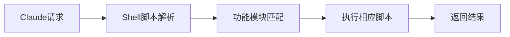
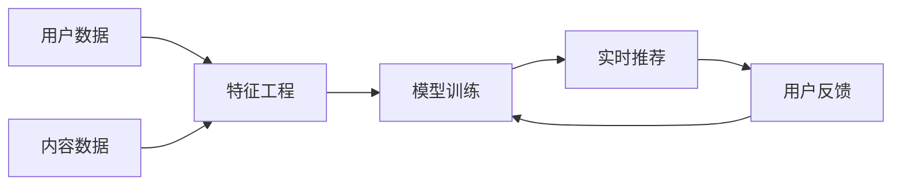
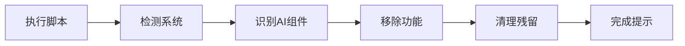
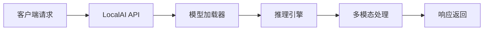
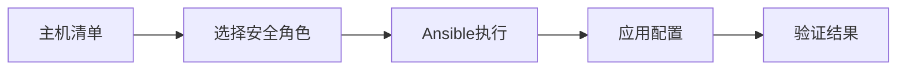
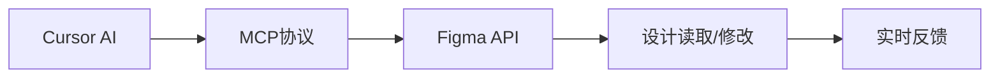
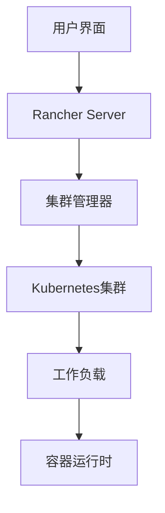

## 今日热点

AI工具本地化与隐私保护成主流，大型科技公司核心算法开源推动技术透明，开发者对AI实用性与隐私安全双重关注。

---

## 热门项目一览

| 排名 | 项目 | 语言 | 今日 | 总计 | 简介 |
|:---:|------|:----:|------:|-----:|------|
| 1 | [obra/superpowers](https://github.com/obra/superpowers) | Shell | +1,863 | 22,267 | Claude Code superpowers: co... |
| 2 | [twitter/the-algorithm](https://github.com/twitter/the-algorithm) | Scala | +366 | 69,873 | Source code for the X Recom... |
| 3 | [zoicware/RemoveWindowsAI](https://github.com/zoicware/RemoveWindowsAI) | PowerShell | +339 | 8,425 | Force Remove Copilot, Recal... |
| 4 | [mudler/LocalAI](https://github.com/mudler/LocalAI) | Go | +64 | 41,564 | 🤖 The free, Open Source alt... |
| 5 | [dev-sec/ansible-collection-hardening](https://github.com/dev-sec/ansible-collection-hardening) | Jinja | +23 | 5,009 | This Ansible collection pro... |
| 6 | [grab/cursor-talk-to-figma-mcp](https://github.com/grab/cursor-talk-to-figma-mcp) | JavaScript | +14 | 5,990 | TalkToFigma: MCP integratio... |
| 7 | [rancher/rancher](https://github.com/rancher/rancher) | Go | +6 | 25,140 | Complete container manageme... |

---

## 趋势洞察

```
┌─────────────────────────────────────────────────────────────────┐
│  AI/ML 工具         ████████████████████████  5 个项目        │
│  其他               █████████                 2 个项目        │
└─────────────────────────────────────────────────────────────────┘
```

---

## 项目深度解读

### 1. obra/superpowers — Claude技能库

> **一句话总结**：为Claude AI提供核心代码技能的Shell脚本库，扩展AI编程能力。

#### 价值主张

| 维度 | 说明 |
|------|------|
| **解决痛点** | 为Claude AI提供原生缺失的编程功能，增强其实用性 |
| **目标用户** | 使用Claude AI进行开发工作的程序员和AI研究者 |
| **核心亮点** | Shell脚本实现 + 模块化设计 + 即插即用扩展 |

#### 技术架构



**技术特色**：
- 基于Shell脚本实现，跨平台兼容性强
- 模块化设计，易于维护和扩展功能
- 与Claude AI原生API无缝集成

#### 热度分析

- 项目获得22K+ Star且近期激增，表明在Claude用户群体中高度认可
- 零Open Issues反映维护良好，社区反馈处理高效

#### 快速上手

```bash
# 克隆仓库
git clone https://github.com/obra/superpowers.git
# 安装并启用
cd superpowers && ./install.sh
```

#### 注意事项

- 需要确保Shell环境支持，特别是Unix-like系统
- 使用前应查看文档了解各模块功能和使用限制
- 可能需要Claude API的特定访问权限


### 2. twitter/the-algorithm — 推荐算法引擎

> **一句话总结**：开源的社交媒体推荐算法实现，通过机器学习技术优化内容分发与用户体验。

#### 价值主张

| 维度 | 说明 |
|------|------|
| **解决痛点** | 解决社交媒体海量内容与用户个性化需求之间的匹配难题，提升内容分发效率与用户参与度 |
| **目标用户** | 社交媒体平台开发者、推荐系统工程师、机器学习研究人员 |
| **核心亮点** | 大规模实时数据处理能力 + 多维度特征融合技术 + 在线学习与迭代优化机制 + 隐私保护与安全设计 |

#### 技术架构



**技术特色**：
- 基于Scala和Spark构建的高性能分布式处理框架
- 多阶段混合推荐策略提升精准度
- 实时特征更新与模型迭代机制
- 大规模A/B测试框架支持算法优化

#### 热度分析

- 项目星标数近7万，日增长约360，表明学术界和工业界对推荐算法高度关注
- 作为Twitter核心算法开源，对社交媒体和内容分发领域具有重要参考价值

#### 快速上手

```bash
# 克隆项目
git clone https://github.com/twitter/the-algorithm.git

# 安装依赖
cd the-algorithm && sbt compile

# 运行示例
sbt "runMain com.twitter.recos.user_tweet_entity_graph.EntityGraphDemo"
```

#### 注意事项

- 项目涉及Twitter核心推荐算法，可能包含未公开的商业机密或敏感信息
- 代码复杂度高，需要具备扎实的机器学习和分布式系统基础
- 部分功能可能需要Twitter内部环境或数据才能完全运行
- 由于是核心算法，可能存在部分代码未完全开源的情况


### 3. zoicware/RemoveWindowsAI — Windows AI 清除器

> **一句话总结**：一个简洁的 PowerShell 脚本，帮助用户彻底移除 Windows 11 中的 Copilot、Recall 等 AI 功能。

#### 价值主张

| 维度 | 说明 |
|------|------|
| **解决痛点** | Windows 11 强制集成 AI 功能，用户希望完全移除但官方未提供简便方法 |
| **目标用户** | 隐私敏感型用户、系统极简主义者、企业IT管理员 |
| **核心亮点** | 一键移除 + 彻底清理 + 兼容性广 + 无需重启 |

#### 技术架构



**技术特色**：
- 直接调用 PowerShell 系统命令修改注册表
- 智能识别不同 Windows 11 版本的 AI 组件
- 提供详细的操作日志和回滚机制

#### 热度分析

- 项目获得 8,425 星且单日增长 339，反映用户对隐私控制的高度关注
- 无开放问题表明脚本成熟度高，社区认可度高

#### 快速上手

```bash
# 以管理员身份运行 PowerShell
Set-ExecutionPolicy RemoteSigned -Scope CurrentUser
. .\RemoveWindowsAI.ps1
Remove-WindowsAI
```

#### 注意事项

- 需要以管理员权限运行 PowerShell
- 某些移除操作可能需要重启系统才能完全生效
- 建议在执行前创建系统还原点，以便需要时恢复


### 4. mudler/LocalAI — 本地AI替代方案

> **一句话总结**：LocalAI是开源的本地部署AI服务，可作为OpenAI等商业服务的替代品，无需GPU即可运行。

#### 价值主张

| 维度 | 说明 |
|------|------|
| **解决痛点** | 提供无需GPU的本地AI服务，解决商业AI服务依赖和数据隐私问题 |
| **目标用户** | 注重数据隐私的开发者、企业用户及AI研究人员 |
| **核心亮点** | 无GPU要求 + 多模态支持 + 分布式部署 + P2P能力 |

#### 技术架构



**技术特色**：
- 采用Go语言开发，性能高效且资源占用低
- 支持多种模型格式，兼容性强
- 无需GPU即可在普通硬件上运行，降低使用门槛

#### 热度分析

- 项目Star数超过4万，且有持续增长，表明社区高度关注
- Fork数适中，说明项目已被广泛采用和二次开发

#### 快速上手

```bash
# 克隆项目
git clone https://github.com/mudler/LocalAI.git
cd LocalAI
# 运行LocalAI
./localai --models-path ./models
```

#### 注意事项

- 项目许可证未知，使用前需确认
- 虽然无需GPU，但在处理复杂任务时可能需要较长时间
- 需要自行下载和配置模型文件


### 5. dev-sec/ansible-collection-hardening — 系统安全加固方案

> **一句话总结**：提供经过实战验证的Linux、SSH、nginx和MySQL安全加固Ansible角色集合。

#### 价值主张

| 维度 | 说明 |
|------|------|
| **解决痛点** | 企业部署服务器缺乏统一标准化安全配置，易留下安全漏洞 |
| **目标用户** | DevOps工程师、系统管理员、安全运维人员 |
| **核心亮点** | 实战验证的安全配置 + 多组件同时加固 + 基于Ansible自动化部署 |

#### 技术架构



**技术特色**：
- 基于Jinja模板实现配置灵活定制
- 模块化角色设计，便于组合使用
- 提供预置的安全基线配置

#### 热度分析

- 项目获得5,009个星标和798个分叉，表明其在安全加固领域有较高认可度，且近期增长趋势稳定。
- 作为Ansible生态中的重要安全组件，该项目在安全自动化领域占据重要位置，尤其适合企业级安全加固场景。

#### 快速上手

```bash
# 安装集合
ansible-galaxy collection install devsec.hardening

# 应用Linux安全加固
ansible-playbook -i inventory devsec.hardening.linux
```

#### 注意事项

- 在生产环境应用前，建议在测试环境中验证配置
- 部分安全加固策略可能会影响现有应用功能，需评估兼容性
- 定期检查项目更新，及时获取最新的安全配置和修复


### 6. grab/cursor-talk-to-figma-mcp — AI-Figma设计桥梁

> **一句话总结**：Cursor与Figma的AI集成桥梁，实现设计读取和程序化修改。

#### 价值主张

| 维度 | 说明 |
|------|------|
| **解决痛点** | 解决AI工具与设计软件之间的数据孤岛问题，实现AI直接操作Figma设计 |
| **目标用户** | 前端开发者、UI设计师、使用Cursor AI的设计团队 |
| **核心亮点** | MCP协议集成 + AI设计理解 + 程序化设计修改 |

#### 技术架构



**技术特色**：
- 利用MCP协议实现AI与设计工具的无缝连接
- 通过Figma API实现设计元素的可编程访问
- 保持设计状态实时同步，减少人工干预

#### 热度分析

- 项目获得近6K星标，日增14星，表明社区对该AI设计集成工具高度关注
- 作为AI辅助设计领域的创新尝试，填补了AI与设计工具之间的空白

#### 快速上手

```bash
# 安装MCP服务器
npm install -g @grab/cursor-talk-to-figma-mcp

# 配置Cursor连接
cursor --mcp-server talk-to-figma
```

#### 注意事项

- 需要有效的Figma API访问权限
- MCP协议支持可能随Cursor版本更新而变化
- AI对设计意图的理解可能存在偏差，需要人工审核


### 7. rancher/rancher — 企业容器管理平台

> **一句话总结**：全栈式容器管理平台，简化多Kubernetes集群部署与运维，一站式解决企业容器化需求。

#### 价值主张

| 维度 | 说明 |
|------|------|
| **解决痛点** | 企业级容器化部署复杂、多集群管理困难、安全与运维挑战 |
| **目标用户** | 企业IT运维团队、DevOps工程师、云平台管理员 |
| **核心亮点** | 多Kubernetes管理 + 企业级安全 + 简化部署 + 统一界面 + 跨云支持 |

#### 技术架构



**技术特色**：
- 基于RKE自研Kubernetes发行版，简化集群部署
- 提供统一API接口，支持多云环境管理
- 集成Istio、Prometheus等CNCF项目，增强功能

#### 热度分析

- 项目Star数超过2.5万，持续稳定增长，显示企业容器管理领域需求旺盛
- 社区活跃度高，拥有完整的企业级解决方案和丰富的生态系统

#### 快速上手

```bash
# 安装Rancher Server
docker run -d --restart=unless-stopped -p 80:80 -p 443:443 rancher/rancher

# 添加Kubernetes集群
# 通过Rancher UI添加现有集群或创建新集群
```

#### 注意事项

- Rancher Server本身建议部署在高可用环境中，避免单点故障
- 生产环境使用时需注意集群版本兼容性和升级路径规划
- 建议根据安全最佳实践配置网络策略和访问控制


## 今日推荐

| 主题 | 推荐项目 | 亮点 |
|------|----------|------|
| AI开发入门 | [mudler/LocalAI](https://github.com/mudler/LocalAI) | 本地

---

<div align="center">

*Generated on 2026-01-15 | Powered by GitHub Trending Reporter*

</div>