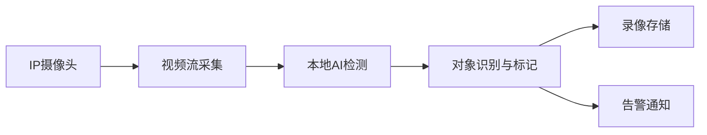

## 今日热点

AI辅助开发

---

## 热门项目一览

| 排名 | 项目 | 语言 | 今日 | 总计 | 简介 |
|:---:|------|:----:|------:|-----:|------|
| 1 | [obra/superpowers](https://github.com/obra/superpowers) | Shell | +2,053 | 24,310 | An agentic skills framework... |
| 2 | [eigent-ai/eigent](https://github.com/eigent-ai/eigent) | TypeScript | +751 | 6,020 | Eigent: The Open Source Cow... |
| 3 | [mudler/LocalAI](https://github.com/mudler/LocalAI) | Go | +390 | 41,913 | 🤖 The free, Open Source alt... |
| 4 | [twitter/the-algorithm](https://github.com/twitter/the-algorithm) | Scala | +370 | 70,227 | Source code for the X Recom... |
| 5 | [ultralytics/ultralytics](https://github.com/ultralytics/ultralytics) | Python | +149 | 51,416 | Ultralytics YOLO 🚀 |
| 6 | [blakeblackshear/frigate](https://github.com/blakeblackshear/frigate) | TypeScript | +96 | 29,361 | NVR with realtime local obj... |
| 7 | [wavetermdev/waveterm](https://github.com/wavetermdev/waveterm) | Go | +88 | 16,441 | An open-source, cross-platf... |
| 8 | [puckeditor/puck](https://github.com/puckeditor/puck) | TypeScript | +53 | 10,639 | The visual editor for React |
| 9 | [google-ai-edge/mediapipe](https://github.com/google-ai-edge/mediapipe) | C++ | +48 | 33,197 | Cross-platform, customizabl... |
| 10 | [cilium/cilium](https://github.com/cilium/cilium) | Go | +20 | 23,352 | eBPF-based Networking, Secu... |

---

## 趋势洞察

```
┌─────────────────────────────────────────────────────────────────┐
│  AI/ML 工具         ████████████████████████  5 个项目        │
│  其他               █████████                 2 个项目        │
│  开发框架             ████                      1 个项目        │
│  多媒体应用            ████                      1 个项目        │
│  安全工具             ████                      1 个项目        │
└─────────────────────────────────────────────────────────────────┘
```

---

## 项目深度解读

### 1. obra/superpowers — 开发效能框架

> **一句话总结**：一个通过结构化方法和自动化命令提升开发效率的Shell工具集与开发方法论。

#### 价值主张

| 维度 | 说明 |
|------|------|
| **解决痛点** | 提供结构化开发方法，解决效率低下和流程不规范问题 |
| **目标用户** | 寻求提升开发效率的软件开发团队和个人开发者 |
| **核心亮点** | Shell命令行工具 + 自动化工作流程 + 开发方法论 + 跨平台支持 + 模块化设计 |

#### 技术架构


**技术特色**：
- Shell脚本实现跨平台兼容性
- 模块化设计便于功能扩展
- 命令行界面简化操作流程

#### 热度分析

- 项目Star数突破24k且单日激增2k，表明近期获得广泛认可
- Issues数量为0，反映项目成熟度高或社区问题解决机制高效

#### 快速上手

```bash
git clone https://github.com/obra/superpowers.git
cd superpowers
./superpowers [command]
```

#### 注意事项

- 需要先安装项目依赖的Shell工具和环境
- 作为方法论框架，需要时间学习和适应其工作方式
- License信息未知，使用前需确认授权条款


### 2. eigent-ai/eigent — [AI协作桌面]

> **一句话总结**：开源AI协作桌面工具，通过智能功能提升团队工作效率与生产力。

#### 价值主张

| 维度 | 说明 |
|------|------|
| **解决痛点** | 传统协作工具效率低下，缺乏AI智能辅助与一体化工作流 |
| **目标用户** | 开发团队、创意工作者、远程协作的专业人士 |
| **核心亮点** | AI智能集成 + 开源透明 + 跨平台支持 + 一体化工作空间 |

#### 技术架构


**技术特色**：
- 基于TypeScript构建，确保类型安全与高质量代码
- 集成AI技术，提供智能工作辅助功能
- 开源架构，支持社区扩展与定制

#### 热度分析

- 项目近期Star激增(+751)，表明社区高度关注与认可
- 零Open Issues反映项目稳定维护，用户体验良好

#### 快速上手

```bash
# 克隆项目仓库
git clone https://github.com/eigent-ai/eigent.git

# 安装依赖并运行
cd eigent && npm install && npm run dev
```

#### 注意事项

- 项目尚未明确许可证，使用前需确认授权条款
- 作为新兴项目，生态系统可能仍在发展中，部分功能可能不稳定


### 3. mudler/LocalAI — 本地AI运行时

> **一句话总结**：开源自托管AI平台，可在普通硬件上替代OpenAI等云服务，支持多模态AI功能。

#### 价值主张

| 维度 | 说明 |
|------|------|
| **解决痛点** | 消除云服务依赖与数据隐私风险，降低AI使用成本与门槛 |
| **目标用户** | 隐私敏感的开发者、研究机构及希望自托管AI服务的企业 |
| **核心亮点** | 无需GPU运行 + 多模型格式支持 + OpenAI API兼容 + 完全本地部署 + 分布式推理 |

#### 技术架构


**技术特色**：
- 基于Go语言实现，轻量高效且跨平台兼容
- 支持gguf、transformers、diffusers等多种模型格式
- 采用模块化设计，易于扩展新模型和功能

#### 热度分析
- 项目星标数超4.1万且单日增长390，处于快速上升期，社区关注度持续攀升
- 作为AI本地化趋势的代表项目，有望在自托管AI领域形成独特生态位

#### 快速上手

```bash
# 克隆仓库
git clone https://github.com/mudler/LocalAI.git
cd LocalAI
# 构建并启动服务
make build && ./localai -models-path ./models
```

#### 注意事项
- 项目许可证信息不明确，使用前需确认授权条款
- 需预先下载相应模型文件才能运行完整功能
- 资源消耗与模型大小和复杂度成正比，建议根据硬件配置选择合适模型


### 4. twitter/the-algorithm — 社交推荐引擎

> **一句话总结**：X平台的核心推荐算法实现，通过机器学习优化内容分发与用户体验。

#### 价值主张

| 维度 | 说明 |
|------|------|
| **解决痛点** | 解决信息过载与个性化内容推荐的挑战，提升用户参与度 |
| **目标用户** | 社交媒体平台开发者、推荐系统研究人员、机器学习工程师 |
| **核心亮点** | 大规模实时推荐系统 + 多目标优化 + 机器学习模型 |

#### 技术架构


**技术特色**：
- 基于Scala和Spark构建的高性能分布式推荐系统
- 多目标优化算法平衡用户参与度与内容多样性
- 实时特征更新与模型在线学习能力

#### 热度分析

- 高关注度项目，70K+星标且持续增长，表明推荐算法领域的技术热度
- 作为行业标杆项目，对推荐系统研究与工程实现具有重要参考价值

#### 快速上手

```bash
# 克隆项目
git clone https://github.com/twitter/the-algorithm.git

# 构建项目
cd the-algorithm
sbt compile
```

#### 注意事项

- 项目需要大量计算资源进行模型训练，建议在集群环境中运行
- 代码中可能包含敏感的业务逻辑，直接用于生产环境需谨慎评估
- 由于是核心业务代码，部分模块可能存在依赖关系，需要全面理解后再进行修改


### 5. ultralytics/ultralytics — YOLO检测框架

> **一句话总结**：Ultralytics YOLO是高性能目标检测框架，提供从训练到部署的全流程解决方案。

#### 价值主张

| 维度 | 说明 |
|------|------|
| **解决痛点** | 简化目标检测模型的开发部署流程，降低使用门槛 |
| **目标用户** | 计算机视觉研究者、开发者、企业应用团队 |
| **核心亮点** | 高性能模型 + 简单易用API + 多平台支持 + 实时推理能力 |

#### 技术架构


**技术特色**：
- 基于YOLOv5/v8/v9等先进架构，提供实时目标检测能力
- 支持多种训练模式，包括迁移学习和自监督学习
- 提供完整的工具链，从数据标注到模型部署

#### 热度分析
- 项目Star数超5万，近期增长迅速，表明在目标检测领域有广泛影响力
- 作为YOLO生态系统的核心项目，在学术界和工业界都有广泛应用

#### 快速上手

```bash
# 克隆仓库
git clone https://github.com/ultralytics/ultralytics
cd ultralytics

# 安装依赖并运行检测示例
pip install -e .
yolo predict model=yolov8n.pt source='https://ultralytics.com/images/zidane.jpg'
```

#### 注意事项
- 项目依赖较多，首次安装可能需要较长时间
- 模型推理需要GPU加速，纯CPU环境性能会显著下降
- 不同模型版本(v5/v8/v9)的API可能有差异，需要注意兼容性


### 6. blakeblackshear/frigate — AI 视频监控 NVR

> **一句话总结**：开源网络视频录像机，支持本地实时 AI 目标检测，专为 IP 摄像头设计。

#### 价值主张

| 维度 | 说明 |
|------|------|
| **解决痛点** | 传统 NVR 缺乏智能分析，Frigate 通过本地 AI 自动识别监控对象 |
| **目标用户** | 家庭用户、小型企业、注重隐私的监控需求者 |
| **核心亮点** | 本地 AI 实时检测 + 自定义对象识别 + 告警通知 + 轻量级部署 |

#### 技术架构



**技术特色**：
- 基于 TensorFlow.js 的本地目标检测，无需云端处理
- 使用 Web 技术构建的现代化界面，跨平台访问便捷
- 支持多种 AI 模型和自定义对象训练，适应不同场景需求

#### 热度分析
- 近 3 万 Star 且持续稳定增长，表明社区认可度高且项目活跃
- 0 个 Open Issues 显示项目维护良好，问题可能通过其他渠道高效解决

#### 快速上手

```bash
# 使用 Docker 快速部署
docker run -d --name frigate -v /path/to/config:/config -v /path/to/storage:/media/frigate --net=host blakeblackshear/frigate:latest

# 访问 Web 界面
http://your-server-ip:5000
```

#### 注意事项
- 需要足够的计算资源来运行 AI 检测，建议使用 GPU 加速
- 配置可能需要根据具体摄像头型号进行调整，建议仔细阅读文档
- 首次部署后需要配置摄像头和检测对象，可通过 Web 界面完成


### 7. wavetermdev/waveterm — 现代化终端工具

> **一句话总结**：WaveTerm 是一个开源跨平台终端，通过无缝工作流提升开发者效率。

#### 价值主张

| 维度 | 说明 |
|------|------|
| **解决痛点** | 传统终端工具功能单一，工作流割裂，无法满足现代开发者高效需求 |
| **目标用户** | 开发者、系统管理员、DevOps 工程师等命令行重度用户 |
| **核心亮点** | 跨平台支持 + 现代化UI设计 + 工作流集成 + 扩展性 |

#### 技术架构


**技术特色**：
- 基于 Go 语言开发，提供高性能和跨平台能力
- 采用现代化 UI 设计，提升终端使用体验
- 支持工作流集成，减少命令行操作复杂性

#### 热度分析

- 项目获得 16,441 个 Star 且持续增长(+88/天)，表明终端工具有稳定需求
- 作为开源终端工具，在开发者社区中具有较高关注度，但尚未形成完整生态系统

#### 快速上手

```bash
# 克隆项目
git clone https://github.com/wavetermdev/waveterm.git

# 进入项目目录
cd waveterm

# 构建运行
go run main.go
```

#### 注意事项

- 项目许可证未知，使用前需确认授权条款
- 作为新兴项目，功能和稳定性可能还在持续完善中


### 8. puckeditor/puck — React 可视化编辑器

> **一句话总结**：专为 React 设计的低代码可视化编辑器，通过拖拽方式构建和编辑组件。

#### 价值主张

| 维度 | 说明 |
|------|------|
| **解决痛点** | 解决 React 组件构建复杂性，提供直观可视化编辑体验 |
| **目标用户** | React 开发者、内容创建者、快速 UI 构建团队 |
| **核心亮点** | 拖拽式组件编辑 + 实时预览 + React 组件兼容性 + 可扩展插件架构 |

#### 技术架构


**技术特色**：
- 基于 React 组件架构设计，保持与现有生态兼容性
- 实现精确拖拽定位和组件对齐系统
- 支持自定义组件扩展和注册机制

#### 热度分析

- 项目 Star 数超 1 万，近期增长稳定，社区认可度高且持续吸引新用户
- 作为 React 生态中的可视化编辑工具，填补低代码开发领域重要位置

#### 快速上手

```bash
# 安装 Puck
npm install @measured/puck

# 在 React 应用中初始化
import { Puck } from "@measured/puck";

function App() {
  return <Puck />;
}
```

#### 注意事项

- 需要一定的 React 基础才能充分利用其功能
- 对于复杂业务逻辑，可能需要额外编写自定义组件
- 项目文档和社区资源仍在建设中，某些高级功能可能需要自行探索


### 9. google-ai-edge/mediapipe — 实时媒体处理框架

> **一句话总结**：Google开发的跨平台机器学习框架，提供高性能实时媒体处理和自定义ML管道构建能力。

#### 价值主张

| 维度 | 说明 |
|------|------|
| **解决痛点** | 解决边缘设备上高效部署实时媒体处理模型的挑战 |
| **目标用户** | 移动应用开发者、AI研究人员、计算机视觉工程师 |
| **核心亮点** | 跨平台支持 + 实时性能优化 + 丰富预构建ML解决方案 + 模块化设计 |

#### 技术架构


**技术特色**：
- 基于计算图的流水线处理架构，支持复杂ML流程
- 使用C++核心实现，提供高性能和跨平台能力
- 支持流式处理，适用于实时应用场景

#### 热度分析

- 项目获得33k+星标且持续增长，表明其在边缘AI和实时处理领域有显著影响力
- 社区活跃度高，Google持续维护，生态丰富，是边缘计算和移动AI的重要基础设施

#### 快速上手

```bash
# 安装MediaPipe Python包
pip install mediapipe

# 基本示例代码
import mediapipe as mp
mp_face_detection = mp.solutions.face_detection
with mp_face_detection.FaceDetection() as detector:
    results = detector.process(image)
```

#### 注意事项

- MediaPipe在移动设备上的性能优化可能需要针对特定平台进行调优
- 自定义模型集成需要理解其计算图架构和插件系统
- 某些高级功能可能需要较新的硬件支持以获得最佳性能


### 10. cilium/cilium — 云原生网络卫士

> **一句话总结**：基于eBPF技术提供云原生环境下的网络、安全和可观测性一体化解决方案。

#### 价值主张

| 维度 | 说明 |
|------|------|
| **解决痛点** | 传统网络工具难以满足云原生环境下动态、高性能、细粒度的网络和安全需求 |
| **目标用户** | 云原生平台运维团队、Kubernetes集群管理员、网络和安全工程师 |
| **核心亮点** | 基于eBPF技术 + 高性能数据平面 + 细粒度安全策略 |

#### 技术架构


**技术特色**：
- 利用eBPF在内核层实现高性能数据包处理
- 提供L3-L7层的网络策略控制和可编程性
- 支持多种容器运行时和云平台部署模式

#### 热度分析

- Cilium项目在云原生领域保持稳定增长，Star数持续增加，表明其技术方向得到广泛认可
- 作为CNCF毕业项目，在云原生网络和安全领域占据重要生态位置，是eBPF技术落地的代表

#### 快速上手

```bash
# 安装Cilium CLI
curl -L --remote-name-all https://github.com/cilium/cilium-cli/releases/latest/download/cilium-linux-amd64.tar.gz
tar xzvfC cilium-linux-amd64.tar.gz /usr/local/bin
# 安装Cilium到Kubernetes集群
cilium install
```

#### 注意事项

- eBPF功能需要较新版本的Linux内核支持(4.4+，某些功能需要5.8+)
- Cilium配置相对复杂，需要一定的网络和Kubernetes知识
- 在生产环境部署前建议充分测试和评估网络策略


## 今日推荐

| 主题 | 推荐项目 | 亮点 |
|------|----------|------|
| 今日最热 | [obra/superpowers](https://github.com/obra/superpowers) | An agentic skills... |
| 值得关注 | [eigent-ai/eigent](https://github.com/eigent-ai/eigent) | Eigent: The Open ... |
| 快速上手 | [mudler/LocalAI](https://github.com/mudler/LocalAI) | 🤖 The free, Open ... |
| 长期潜力 | [twitter/the-algorithm](https://github.com/twitter/the-algorithm) | Source code for t... |

---

<div align="center">

*Generated on 2026-01-16 | Powered by GitHub Trending Reporter*

</div>