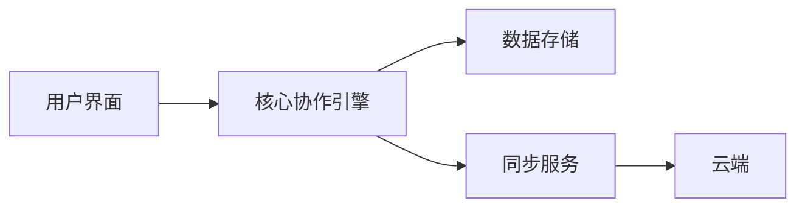
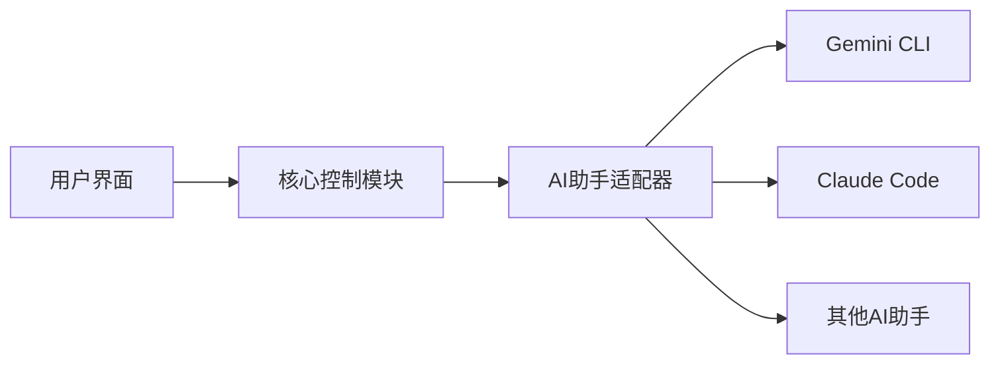

## 今日热点

今日GitHub热榜主要聚焦AI代理编程工具与本地化生产力应用，超级代理技能框架和开源协作工具引领趋势，反映出开发者对AI辅助开发与隐私保护的重视。

---

## 热门项目一览

| 排名 | 项目 | 语言 | 今日 | 总计 | 简介 |
|:---:|------|:----:|------:|-----:|------|
| 1 | [eigent-ai/eigent](https://github.com/eigent-ai/eigent) | TypeScript | +2,179 | 7,517 | Eigent: The Open Source Cow... |
| 2 | [obra/superpowers](https://github.com/obra/superpowers) | Shell | +1,961 | 26,069 | An agentic skills framework... |
| 3 | [puckeditor/puck](https://github.com/puckeditor/puck) | TypeScript | +504 | 11,049 | The visual editor for React |
| 4 | [cjpais/Handy](https://github.com/cjpais/Handy) | TypeScript | +405 | 11,824 | A free, open source, and ex... |
| 5 | [ultralytics/ultralytics](https://github.com/ultralytics/ultralytics) | Python | +379 | 51,768 | Ultralytics YOLO 🚀 |
| 6 | [google/langextract](https://github.com/google/langextract) | Python | +336 | 21,185 | A Python library for extrac... |
| 7 | [iOfficeAI/AionUi](https://github.com/iOfficeAI/AionUi) | TypeScript | +174 | 4,293 | Free, local, open-source Co... |
| 8 | [agentsmd/agents.md](https://github.com/agentsmd/agents.md) | TypeScript | +97 | 15,365 | AGENTS.md — a simple, open ... |
| 9 | [Gentleman-Programming/Gentleman.Dots](https://github.com/Gentleman-Programming/Gentleman.Dots) | Shell | +15 | 1,156 | My personal configuration f... |

---

## 趋势洞察

```
┌─────────────────────────────────────────────────────────────────┐
│  AI/ML 工具         ████████████████████████  6 个项目        │
│  其他               ████████                  2 个项目        │
│  开发框架             ████                      1 个项目        │
└─────────────────────────────────────────────────────────────────┘
```

---

## 项目深度解读

### 1. eigent-ai/eigent — 协作生产力工具

> **一句话总结**：开源协作桌面应用，通过优化工作流程和团队协作，显著提升个人和团队生产力。

#### 价值主张

| 维度 | 说明 |
|------|------|
| **解决痛点** | 团队协作效率低下，工作流程混乱，生产力不足 |
| **目标用户** | 需要高效团队协作的专业人士和开发团队 |
| **核心亮点** | 开源免费 + 桌面应用 + 协作优化 + 生产力提升 |

#### 技术架构



**技术特色**：
- 基于TypeScript开发，确保代码质量和类型安全
- 跨平台桌面应用，支持Windows、macOS和Linux
- 开源架构，允许社区贡献和定制

#### 热度分析

- 项目在短期内获得大量关注（今日新增2179星），表明其解决了一个普遍存在的痛点
- Fork数量相对较少（809），可能表明项目处于早期阶段，社区贡献尚未完全展开

#### 快速上手

```bash
# 克隆仓库
git clone https://github.com/eigent-ai/eigent.git
# 安装依赖
npm install
# 启动应用
npm start
```

#### 注意事项

- 项目许可证未知，使用前需确认商业使用限制
- 项目处于早期阶段，功能可能不够稳定
- 需要确认系统兼容性和硬件要求


### 2. obra/superpowers — 智能开发框架

> **一句话总结**：基于代理的技能框架与实用软件开发方法论，提升开发效率与团队协作。

#### 价值主张

| 维度 | 说明 |
|------|------|
| **解决痛点** | 解决传统开发流程低效、技能碎片化问题 |
| **目标用户** | 软件开发团队与个人开发者 |
| **核心亮点** | 代理化技能框架 + 实用方法论 + 高效工作流 |

#### 技术架构


**技术特色**：
- 基于Shell脚本实现，轻量级跨平台兼容
- 采用模块化代理架构，灵活可扩展
- 集成自动化工作流，减少重复性任务

#### 热度分析

- 项目获26,069星，单日增长近2,000，表明近期关注度急剧上升
- 零开放问题，社区维护良好，用户反馈积极

#### 快速上手

```bash
# 克隆项目
git clone https://github.com/obra/superpowers.git
cd superpowers
# 初始化框架
./superpowers init
```

#### 注意事项

- 项目许可证未知，使用前需确认开源许可条款
- 作为Shell项目，可能需要特定环境配置和依赖支持


### puckeditor/puck — React可视化编辑器

> **一句话总结**：为React应用提供直观的可视化编辑体验，无需编写代码即可构建组件。

#### 价值主张

| 维度 | 说明 |
|------|------|
| **解决痛点** | 降低React组件构建门槛，实现可视化开发，提升开发效率 |
| **目标用户** | React开发者、前端构建工具使用者、快速原型设计团队 |
| **核心亮点** | 可视化编辑界面 + 拖拽式布局 + 实时预览 + 代码生成能力 |

#### 技术架构


**技术特色**：
- 基于React组件化架构，支持自定义组件扩展
- 使用TypeScript提供类型安全，确保代码质量
- 实现了所见即所得的编辑体验，支持复杂交互

#### 热度分析

- 项目Star数突破11,000且持续增长，表明在React可视化编辑领域备受关注
- 作为低代码/无代码开发工具的重要选择，社区活跃度与贡献意愿高

#### 快速上手

```bash
# 安装puck编辑器
npm install @meck-editor/puck

# 在React组件中使用
import { Puck } from "@meck-editor/puck";
function App() {
  return <Puck />;
}
```

#### 注意事项

- 需要React 18+环境支持
- 自定义组件需遵循特定接口规范
- 初次使用可能需要配置组件库和样式


### 4. cjpais/Handy — 离线语音转写

> **一句话总结**：完全离线的开源语音转文本工具，保护用户隐私且无需网络连接。

#### 价值主张

| 维度 | 说明 |
|------|------|
| **解决痛点** | 解决网络依赖的语音转写问题，提供完全离线的隐私保护方案 |
| **目标用户** | 注重隐私的用户、网络受限环境工作者、多语言使用者 |
| **核心亮点** | 完全离线工作 + 多语言支持 + 高度可扩展 + 开源免费 + 跨平台 |

#### 技术架构


**技术特色**：
- 采用WebAssembly技术实现浏览器端离线语音识别
- 支持多种语言的声学模型和语言模型
- 使用TypeScript编写，确保类型安全和跨平台兼容性

#### 热度分析

- 项目近期获得高关注度，单日新增405 stars，表明用户对离线语音转写需求强烈
- 相对fork数量的star数比例较高，反映项目质量获社区认可
- 0个开放问题，表明项目维护状态良好，问题响应及时

#### 快速上手

```bash
# 克隆项目
git clone https://github.com/cjpais/Handy.git
# 安装依赖
npm install
# 启动开发服务器
npm start
```

#### 注意事项

- 需要用户授权麦克风权限才能正常工作
- 离线模式下首次使用可能需要下载语言模型
- 不同语言的识别准确度可能存在差异


### 5. ultralytics/ultralytics — YOLO目标检测

> **一句话总结**：Ultralytics YOLO提供高性能、易用的目标检测解决方案，支持实时推理与训练。

#### 价值主张

| 维度 | 说明 |
|------|------|
| **解决痛点** | 提供简单易用但性能强大的目标检测工具，无需深度学习专业知识 |
| **目标用户** | 计算机视觉研究者、AI工程师、企业开发者 |
| **核心亮点** | 高精度目标检测 + 实时性能 + 预训练模型 + 多平台支持 + 易于扩展 |

#### 技术架构


**技术特色**：
- 基于最新YOLOv8架构，采用CSP和PANet等先进网络结构
- 支持PyTorch和TensorFlow框架，提供灵活的部署选项
- 集成数据增强、模型训练、评估和部署的完整流程

#### 热度分析

- 项目Star数超过5万，近期增长迅速，表明在目标检测领域具有显著影响力
- 活跃的社区贡献和丰富的生态系统，成为目标检测领域的标杆项目

#### 快速上手

```bash
# 安装Ultralytics
pip install ultralytics

# 使用预训练模型进行推理
yolo predict model=yolov8n.pt source='https://ultralytics.com/images/bus.jpg'

# 训练自定义模型
yolo train model=yolov8n.pt data=coco.yaml epochs=100 imgsz=640
```

#### 注意事项

- 模型训练需要较高的计算资源，建议使用GPU加速
- 对于生产环境部署，建议使用TensorRT等优化技术提高推理速度
- 注意数据隐私和合规性，特别是在处理敏感图像数据时


### 6. google/langextract — 文本信息提取器

> **一句话总结**：利用LLMs从非结构化文本中提取结构化信息，提供精确源锚定和交互式可视化功能。

#### 价值主张

| 维度 | 说明 |
|------|------|
| **解决痛点** | 解决从非结构化文本中提取结构化信息时的可追溯性问题 |
| **目标用户** | 数据科学家、NLP研究员和信息抽取工程师 |
| **核心亮点** | LLMs驱动信息提取 + 精确源锚定 + 交互式可视化 |

#### 技术架构


**技术特色**：
- 基于大语言模型的文本理解与信息抽取
- 精确的源引用和可追溯性机制
- 交互式数据可视化展示

#### 热度分析

- 项目拥有21,185个stars，单日增长336个，呈现快速增长态势，社区关注度极高
- 0个open issues表明项目成熟度高或问题处理机制高效，在LLM应用生态中占据重要位置

#### 快速上手

```bash
# 安装
pip install langextract

# 基本使用
from langextract import extract
result = extract("非结构化文本内容")
```

#### 注意事项

- 项目可能需要依赖特定版本的大语言模型API
- 源锚定功能可能需要特定的文本预处理步骤以获得最佳效果


### 7. iOfficeAI/AionUi — AI编程协作平台

> **一句话总结**：本地开源的AI编程助手统一工作台，整合多种AI编程工具于一体。

#### 价值主张

| 维度 | 说明 |
|------|------|
| **解决痛点** | 多种AI编程助手独立运行，缺乏统一界面与体验，切换成本高 |
| **目标用户** | 需同时使用多种AI编程助手的开发者、程序员 |
| **核心亮点** | 本地运行保护隐私 + 开源免费 + 多AI助手集成 + 统一界面体验 |

#### 技术架构



**技术特色**：
- 基于TypeScript开发，保证代码质量和类型安全
- 模块化设计，易于扩展新的AI编程助手支持
- 本地运行架构，无需联网保护用户代码隐私

#### 热度分析

- 项目当前拥有4,293个star，当日增长174个，处于快速增长阶段
- 较高的star增长和fork数量表明社区活跃度高，开发者认可度高

#### 快速上手

```bash
# 克隆仓库
git clone https://github.com/iOfficeAI/AionUi.git

# 安装依赖
cd AionUi && npm install

# 启动应用
npm start
```

#### 注意事项

- 项目许可证未知，使用前需要确认其开源协议
- 可能需要用户自行配置各种AI编程助手的API或本地环境
- 项目没有开放的issue，社区可能通过其他渠道交流


### 8. agentsmd/agents.md — AI编程指南

> **一句话总结**：AGENTS.md定义了一种轻量级标记语言，用于为AI编程助手提供结构化任务指令。

#### 价值主张

| 维度 | 说明 |
|------|------|
| **解决痛点** | AI编程助手缺乏标准化指导格式，导致任务描述不明确、结果不一致 |
| **目标用户** | 开发者、AI编程工具使用者、自动化工作流设计者 |
| **核心亮点** | 简单易学的标记语法 + 支持复杂任务描述 + 跨平台兼容性 |

#### 技术架构


**技术特色**：
- 基于Markdown的轻量级语法
- 结构化任务描述能力
- 与主流AI编程助手兼容

#### 热度分析
- 项目获得超过15k星，近期增长稳定，表明开发者社区对标准化AI编程指导格式的强烈需求
- 作为新兴领域的基础设施项目，有望成为AI辅助编程的标准规范

#### 快速上手

```bash
# 创建agents.md文件
echo "# Task: 创建一个简单的Web服务器\n- 使用Node.js\n- 监听3000端口" > agents.md

# 使用支持AGENTS.md的工具
agentsmd agents.md
```

#### 注意事项
- AGENTS.md格式仍在发展中，可能会有语法变化
- 需要配合支持该格式的AI编程工具使用
- 复杂任务可能需要结合其他工具或脚本实现


### 9. Gentleman-Programming/Gentleman.Dots — LazyVim 精品配置

> **一句话总结**：一个精心打造的 LazyVim 个人配置方案，提供高效的开发环境定制。

#### 价值主张

| 维度 | 说明 |
|------|------|
| **解决痛点** | 简化 Neovim 配置流程，提供开箱即用的开发环境 |
| **目标用户** | 希望高效配置 Neovim 的开发者，尤其是 LazyVim 用户 |
| **核心亮点** | + 精心挑选的插件组合 + 优化的键位映射 + 美观的界面主题 |

#### 技术架构


**技术特色**：
- 基于 LazyVim 框架构建，继承其模块化设计理念
- 使用 Lua 语言编写配置，充分利用 Neovim 的高性能特性
- 通过优化插件组合实现高效的开发工作流

#### 热度分析

- 项目获得 1156 星和 182 次分叉，表明在开发者社区中受到一定关注，近期呈现稳定增长趋势
- 作为 LazyVim 生态中的个人配置项目，为社区提供了实用的参考方案，促进了 Neovim 配置的最佳实践分享

#### 快速上手

```bash
# 克隆仓库
git clone https://github.com/Gentleman-Programming/Gentleman.Dots.git
# 按照项目说明进行配置（通常涉及备份现有配置并应用新配置）
```

#### 注意事项

- 使用前需要备份现有的 Neovim 配置，避免冲突
- 需要安装 Neovim 和 LazyVim 框架才能正确应用此配置
- 可能需要根据个人开发习惯调整部分插件配置和键位映射


## 今日推荐

| 主题 | 推荐项目 | 亮点 |
|------|----------|------|
| 今日最热 | [eigent-ai/eigent](https://github.com/eigent-ai/eigent) | Eigent: The Open ... |
| 值得关注 | [obra/superpowers](https://github.com/obra/superpowers) | An agentic skills... |
| 快速上手 | [puckeditor/puck](https://github.com/puckeditor/puck) | The visual editor... |
| 长期潜力 | [cjpais/Handy](https://github.com/cjpais/Handy) | A free, open sour... |

---

<div align="center">

*Generated on 2026-01-17 | Powered by GitHub Trending Reporter*

</div>