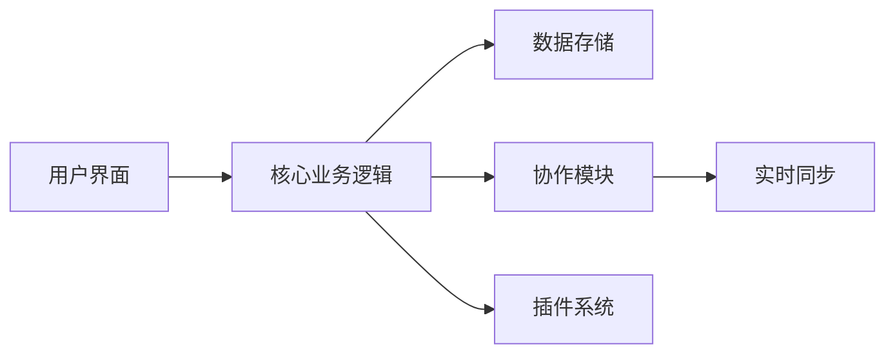

## 今日热点

今日GitHub热榜主要聚焦AI驱动的开发工具与生产力协作平台，特别是结合大语言模型的前端编辑器和本地化开源协作工具受到广泛关注。

---

## 热门项目一览

| 排名 | 项目 | 语言 | 今日 | 总计 | 简介 |
|:---:|------|:----:|------:|-----:|------|
| 1 | [obra/superpowers](https://github.com/obra/superpowers) | Shell | +1,422 | 27,401 | An agentic skills framework... |
| 2 | [eigent-ai/eigent](https://github.com/eigent-ai/eigent) | TypeScript | +760 | 8,641 | Eigent: The Open Source Cow... |
| 3 | [iOfficeAI/AionUi](https://github.com/iOfficeAI/AionUi) | TypeScript | +605 | 4,909 | Free, local, open-source Co... |
| 4 | [google/langextract](https://github.com/google/langextract) | Python | +425 | 21,595 | A Python library for extrac... |
| 5 | [puckeditor/puck](https://github.com/puckeditor/puck) | TypeScript | +336 | 11,391 | The visual editor for React... |

---

## 趋势洞察

```
┌─────────────────────────────────────────────────────────────────┐
│  AI/ML 工具         ████████████████████████  5 个项目        │
└─────────────────────────────────────────────────────────────────┘
```

---

## 项目深度解读

### 1. obra/superpowers — 技能开发框架

> **一句话总结**：一个实用的代理技能框架和软件开发方法论，帮助提升个人和团队效能。

#### 价值主张

| 维度 | 说明 |
|------|------|
| **解决痛点** | 解决软件开发中技能零散、方法论缺失的问题 |
| **目标用户** | 软件开发者和希望提升技能的专业人士 |
| **核心亮点** | 实用性 + 系统化 + 可操作性 + 持续改进 |

#### 技术架构


**技术特色**：
- 基于Shell的轻量级实现
- 模块化技能框架设计
- 实践驱动的开发方法论

#### 热度分析

- 高星增长表明项目受到广泛关注，近期新增1,422星显示社区活跃度高
- 在软件开发方法论领域具有显著影响力，可能成为行业标准实践

#### 快速上手

```bash
# 克隆项目
git clone https://github.com/obra/superpowers.git

# 进入项目目录
cd superpowers

# 查看使用说明
./superpowers --help
```

#### 注意事项

- 需要基本的Shell知识才能充分利用项目功能
- 项目方法论需要实践和持续应用才能见效
- 由于项目文档可能有限，需要通过实践探索最佳使用方式


### 2. eigent-ai/eigent — 高效协作桌面工具

> **一句话总结**：开源桌面协作平台，整合工作流与生产力工具，提升团队协作效率。

#### 价值主张

| 维度 | 说明 |
|------|------|
| **解决痛点** | 多工具切换繁琐，信息分散，缺乏统一协作环境 |
| **目标用户** | 远程团队、知识工作者和追求效率的专业人士 |
| **核心亮点** | 开源免费 + 桌面集成 + 实时协作 + 工作流自动化 |

#### 技术架构



**技术特色**：
- 基于TypeScript构建，提供类型安全的开发体验
- 采用模块化架构，支持功能扩展和定制
- 实现了高效的实时数据同步机制

#### 热度分析

- 项目获得8639个Star且单日增长760，表明社区对其功能高度认可，需求旺盛
- 零开放Issues反映项目维护良好，用户体验问题及时解决，社区参与度高

#### 快速上手

```bash
# 克隆项目
git clone https://github.com/eigent-ai/eigent.git

# 安装依赖
npm install

# 启动应用
npm run start
```

#### 注意事项

- 项目许可证未知，商业使用前需确认授权条款
- 作为桌面应用，需确保目标操作系统的兼容性
- 建议关注官方文档获取最新安装指南和功能说明


### 3. iOfficeAI/AionUi — AI编程助手协作平台

> **一句话总结**：免费本地运行的开源界面，为多种AI编程助手提供统一协同工作环境。

#### 价值主张

| 维度 | 说明 |
|------|------|
| **解决痛点** | 多AI编程助手分散操作，缺乏统一管理界面 |
| **目标用户** | 开发者、AI工具使用者、多AI助手集成需求者 |
| **核心亮点** | 本地运行隐私保护 + 多AI助手统一支持 + 开源可定制 |

#### 技术架构


**技术特色**：
- TypeScript开发，保证代码类型安全与可维护性
- 本地化架构设计，确保用户数据隐私安全
- 模块化扩展接口，支持多种AI助手集成

#### 热度分析
- 单日增长600+ Star，近5K总星数，社区关注度极高
- 0个Open Issues反映项目维护高效且用户反馈良好

#### 快速上手

```bash
# 克隆仓库
git clone https://github.com/iOfficeAI/AionUi.git

# 安装依赖并启动
npm install && npm start
```

#### 注意事项
- 项目许可证未知，商业使用前需确认授权条款
- 需用户自行配置各AI助手的API密钥
- 建议使用Node.js最新稳定版以确保兼容性


### 4. google/langextract — 结构化信息提取器

> **一句话总结**：基于LLM的文本结构化提取工具，提供精确源追溯和交互式可视化功能。

#### 价值主张

| 维度 | 说明 |
|------|------|
| **解决痛点** | 从非结构化文本中提取结构化信息困难且缺乏源追溯 |
| **目标用户** | 数据分析师、研究人员、信息提取从业者 |
| **核心亮点** | LLM驱动 + 精确源追溯 + 交互式可视化 |

#### 技术架构


**技术特色**：
- 基于大型语言模型的深度文本理解
- 精确的源位置追踪与引用系统
- 交互式可视化展示提取结果

#### 热度分析

- 项目获得21,595个星标，今日新增425个，显示快速增长趋势
- 作为Google开源项目，在信息提取领域具有显著影响力

#### 快速上手

```bash
# 安装langextract库
pip install langextract

# 基本使用示例
from langextract import extract_structured_info
result = extract_structured_info("非结构化文本内容", schema="预定义结构")
```

#### 注意事项

- 需要依赖LLM服务，可能涉及API调用成本
- 提取精度取决于所使用的LLM模型能力
- 需要预定义提取结构或schema


### 5. puckeditor/puck — React 可视化编辑器

> **一句话总结**：为 React 打造的 AI 赋能可视化编辑器，无需编写代码即可构建组件和页面。

#### 价值主张

| 维度 | 说明 |
|------|------|
| **解决痛点** | 解决 React 开发中可视化编辑与组件复用难题，降低 UI 开发门槛 |
| **目标用户** | React 开发者、内容创作者、前端团队及需要快速原型构建的设计师 |
| **核心亮点** | 可视化拖拽 + AI 辅助生成 + 组件化架构 + 实时预览 + 代码导出 |

#### 技术架构


**技术特色**：
- 基于 TypeScript 的类型安全编辑器架构
- 组件化设计模式支持自定义组件扩展
- 插件化系统实现功能灵活扩展

#### 热度分析

- 项目 Star 数超 11k 且单日增长 300+，处于高速增长期，社区关注度极高
- 在 React 编辑器领域形成独特竞争力，填补了传统代码编辑器与低代码平台间的空白

#### 快速上手

```bash
# 安装 puck
npm install @measured/puck

# 基础使用
import { Puck } from "@measured/puck";

function App() {
  return <Puck />;
}
```

#### 注意事项

- 项目采用 MIT 许可证，可免费用于商业项目
- 需要一定的 React 知识才能充分发挥其组件化优势
- AI 功能可能需要额外的配置或 API 密钥才能完全使用


## 今日推荐

| 主题 | 推荐项目 | 亮点 |
|------|----------|------|
| 团队协作提高效率 | [eig

---

<div align="center">

*Generated on 2026-01-18 | Powered by GitHub Trending Reporter*

</div>