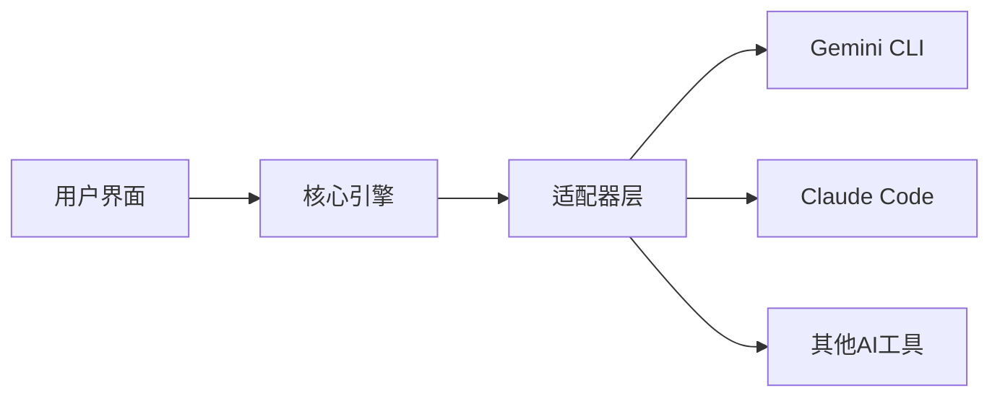
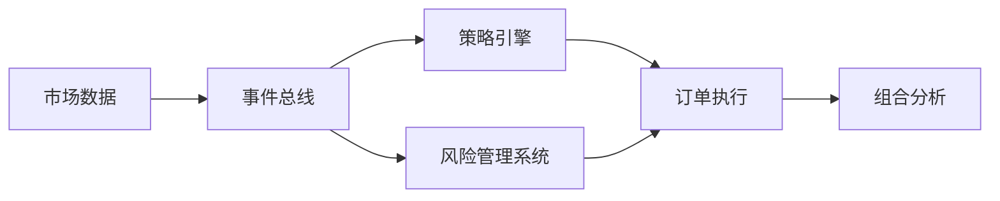

## 今日热点

今日GitHub热榜主要聚焦AI工具生态扩展与MCP协议兴起，尤其是本地化、私有化AI应用成为新热点，同时开源替代商业AI工具的趋势明显。

---

## 热门项目一览

| 排名 | 项目 | 语言 | 今日 | 总计 | 简介 |
|:---:|------|:----:|------:|-----:|------|
| 1 | [iOfficeAI/AionUi](https://github.com/iOfficeAI/AionUi) | TypeScript | +1,192 | 6,821 | Free, local, open-source Co... |
| 2 | [OpenBMB/VoxCPM](https://github.com/OpenBMB/VoxCPM) | Python | +673 | 4,883 | VoxCPM: Tokenizer-Free TTS ... |
| 3 | [google/langextract](https://github.com/google/langextract) | Python | +652 | 22,687 | A Python library for extrac... |
| 4 | [nautechsystems/nautilus_trader](https://github.com/nautechsystems/nautilus_trader) | Rust | +518 | 18,050 | A high-performance algorith... |
| 5 | [yichuan-w/LEANN](https://github.com/yichuan-w/LEANN) | Python | +374 | 9,310 | RAG on Everything with LEAN... |
| 6 | [DavidXanatos/TaskExplorer](https://github.com/DavidXanatos/TaskExplorer) | C | +236 | 2,452 | Power full Task Manager |
| 7 | [ahujasid/blender-mcp](https://github.com/ahujasid/blender-mcp) | Python | +188 | 15,915 | No description |
| 8 | [czlonkowski/n8n-mcp](https://github.com/czlonkowski/n8n-mcp) | TypeScript | +95 | 12,171 | A MCP for Claude Desktop / ... |

---

## 趋势洞察

```
┌─────────────────────────────────────────────────────────────────┐
│  其他               ████████████████████████  4 个项目        │
│  AI/ML 工具         ██████████████████        3 个项目        │
│  项目管理             ██████                    1 个项目        │
└─────────────────────────────────────────────────────────────────┘
```

---

## 项目深度解读

### 1. iOfficeAI/AionUi — AI代码助手统一界面

> **一句话总结**：本地开源的AI代码助手统一界面，整合多种主流AI编程工具。

#### 价值主张

| 维度 | 说明 |
|------|------|
| **解决痛点** | 统一分散的AI代码助手界面，提供一致使用体验 |
| **目标用户** | AI编程工具使用者，多模型协作开发者 |
| **核心亮点** | 本地部署 + 开源免费 + 多模型支持 + 统一界面 |

#### 技术架构



**技术特色**：
- 基于TypeScript构建，类型安全
- 模块化适配器设计，支持多种AI工具
- 本地部署，保护代码隐私

#### 热度分析

- Star数6,821且今日增长1,192，表明项目正处于快速增长期，社区认可度高
- 作为开源AI工具生态中的重要组件，填补了多模型统一界面的市场空白

#### 快速上手

```bash
# 克隆项目
git clone https://github.com/iOfficeAI/AionUi.git
# 安装依赖
npm install
# 启动应用
npm start
```

#### 注意事项

- 项目许可证未知，使用前需确认授权条款
- 本地部署可能需要较高的系统资源，特别是同时使用多个AI模型时
- 需要预先安装对应的AI代码助手工具才能正常使用


### 2. OpenBMB/VoxCPM — 上下文语音生成

> **一句话总结**：无分词器文本转语音技术，实现上下文感知的语音生成与逼真声音克隆。

#### 价值主张

| 维度 | 说明 |
|------|------|
| **解决痛点** | 传统TTS技术缺乏上下文理解，难以实现自然流畅的语音转换 |
| **目标用户** | 语音合成研究人员、AI内容创作者、声音克隆应用开发者 |
| **核心亮点** | 无分词器架构 + 上下文感知能力 + 逼真声音克隆 + 高效生成 |

#### 技术架构


**技术特色**：
- 无分词器架构直接从文本生成语音波形
- 上下文感知机制提升语音自然度
- 高效的语音克隆技术保留声音特征

#### 热度分析

- 项目Star数增长迅速(+673 today)，显示社区对该技术的高度关注
- 作为OpenBMB社区项目，依托开源大模型生态，具有良好发展潜力

#### 快速上手

```bash
# 安装依赖
pip install voxcpm

# 基本语音生成
python -m voxcpM --input "你好，世界" --output output.wav

# 声音克隆
python -m voxcpm --clone --reference reference.wav --text "这是克隆的声音"
```

#### 注意事项

- 项目依赖可能需要较高计算资源
- 语音质量可能受输入文本长度和复杂度影响
- 声音克隆效果受参考音频质量和时长影响


### 3. google/langextract — 文本结构化提取

> **一句话总结**：利用大语言模型从非结构化文本中提取结构化信息，支持精确溯源和交互式可视化。

#### 价值主张

| 维度 | 说明 |
|------|------|
| **解决痛点** | 非结构化文本信息提取困难，缺乏可解释性和可视化支持 |
| **目标用户** | 数据科学家、NLP研究人员、信息抽取开发者 |
| **核心亮点** | LLM驱动的信息提取 + 精确源基础 + 交互式可视化 |

#### 技术架构


**技术特色**：
- 大语言模型驱动的信息提取技术
- 精确的源基础追踪机制
- 交互式可视化组件

#### 热度分析

- 项目Star数超22K且单日增长652，呈现快速增长趋势
- 零开放Issues表明项目维护质量高，社区问题得到及时处理

#### 快速上手

```bash
# 安装langextract库
pip install langextract

# 基本使用示例
import langextract
extractor = langextract.Extractor()
structured_data = extractor.extract("非结构化文本输入")
```

#### 注意事项

- 项目使用大语言模型，可能需要API密钥或特定环境配置
- 可视化功能可能需要额外的依赖库支持
- 精确源基础功能可能会增加处理时间和资源消耗


### 4. nautechsystems/nautilus_trader — 高性能量化交易系统

> **一句话总结**：基于Rust构建的高性能量化交易平台，支持事件驱动回测，专为高频交易算法设计。

#### 价值主张

| 维度 | 说明 |
|------|------|
| **解决痛点** | 提供高性能、低延迟的算法交易解决方案，解决传统交易平台性能瓶颈 |
| **目标用户** | 专业量化交易者、高频交易机构和金融科技开发者 |
| **核心亮点** | Rust语言高性能 + 事件驱动架构 + 完整回测功能 + 模块化设计 |

#### 技术架构



**技术特色**：
- 使用Rust语言实现内存安全和并发性能，适合高频交易场景
- 事件驱动架构提供高度解耦和可扩展性
- 完整的订单生命周期管理，支持多种交易场景

#### 热度分析

- 项目Star数达18,050且单日增长500+，表明在量化交易领域获得高度关注
- 作为Rust生态中少有的成熟量化交易平台，已形成专业开发者社区

#### 快速上手

```bash
git clone https://github.com/nautechsystems/nautilus_trader.git
cd nautilus_trader
cargo run --example basic_trading_strategy
```

#### 注意事项

- 项目使用Rust语言，需要熟悉Rust生态系统才能有效使用
- 作为专业交易系统，需要一定的金融市场和量化交易知识
- 项目文档较为专业，初学者可能需要额外学习资源


### 5. yichuan-w/LEANN — 高效私有RAG框架

> **一句话总结**：LEANN是一个高效私有RAG框架，可在个人设备上实现97%存储节省，确保数据隐私与高性能。

#### 价值主张

| 维度 | 说明 |
|------|------|
| **解决痛点** | 传统RAG系统存储需求大且存在隐私风险，无法在个人设备高效运行 |
| **目标用户** | 注重数据隐私的个人用户，希望在本地运行高效RAG应用的开发者 |
| **核心亮点** | 97%存储节省 + 100%数据隐私 + 高性能准确性 + 个人设备部署 |

#### 技术架构


**技术特色**：
- 采用专有压缩算法实现97%存储节省
- 完全本地化处理确保100%数据隐私
- 优化检索算法提升响应速度与准确性
- 高效的内存管理和计算资源利用

#### 热度分析

- 项目获9,310个Star和806个Fork，近期增长374个Star，社区关注度持续攀升
- 0个Open Issues反映项目成熟度高或问题解决机制完善，社区活跃度处于上升期

#### 快速上手

```bash
# 克隆仓库
git clone https://github.com/yichuan-w/LEANN.git

# 安装依赖
pip install -r requirements.txt

# 运行示例
python examples/basic_rag.py
```

#### 注意事项

- 项目许可证未知，商业使用前需确认授权条款
- 由于强调100%私有，需确保本地设备有足够的计算资源
- 97%存储节省可能依赖于特定压缩算法，需评估其对检索准确度的影响
- 项目文档可能需要进一步完善，以降低新用户的上手门槛


### 6. DavidXanatos/TaskExplorer — 系统任务管理工具

> **一句话总结**：基于C语言开发的高性能系统任务管理器，提供全面的进程监控与管理功能。

#### 价值主张

| 维度 | 说明 |
|------|------|
| **解决痛点** | 提供比系统自带任务管理器更强大的进程管理与系统监控能力 |
| **目标用户** | 系统管理员、高级开发者、性能优化专业人士 |
| **核心亮点** | 轻量级高效 + 深度系统信息 + 多进程管理 + 实时监控 |

#### 技术架构


**技术特色**：
- 直接调用Windows API获取底层进程信息
- 轻量级设计，资源占用极低
- 支持实时监控和批量操作

#### 热度分析

- 项目获得2452个Star，今日增长236，表明近期热度显著上升
- 零Open Issues显示项目维护良好，社区参与度高

#### 快速上手

```bash
# 克隆项目
git clone https://github.com/DavidXanatos/TaskExplorer.git
# 使用Visual Studio编译
msbuild TaskExplorer.sln
```

#### 注意事项

- 项目许可证未知，商业使用前需确认授权
- 仅支持Windows平台，非跨解决方案
- 需要管理员权限才能获取完整的系统进程信息


### 7. ahujasid/blender-mcp — Blender 控制增强

> **一句话总结**：为 Blender 提供 MCP 控制面板，增强建模和材质处理效率。

#### 价值主张

| 维度 | 说明 |
|------|------|
| **解决痛点** | 解决 Blender 中复杂模型和材质控制的效率问题 |
| **目标用户** | 3D艺术家、建模师、动画设计师 |
| **核心亮点** | 直观控制面板 + 材质管理 + 快捷操作 + 参数调整 |

#### 技术架构

**技术特色**：
- 基于 Python 开发，与 Blender API 深度集成
- 提供可视化控制面板，简化复杂操作
- 支持自定义快捷键和工作流程

#### 热度分析

- 项目获得近1.6万星，近期增长迅速，表明社区认可度高
- Fork 数量适中，说明项目被广泛使用但分支较少

#### 快速上手

```bash
# 克隆项目
git clone https://github.com/ahujasid/blender-mcp.git
# 安装到 Blender
# 将文件夹复制到 Blender 的 scripts/addons 目录
# 在 Blender 的首选项中启用该插件
```

#### 注意事项

- 需要 Blender 软件支持
- 可能需要特定版本的 Blender 才能正常工作
- 建议在使用前阅读项目的文档和说明


### 8. czlonkowski/n8n-mcp — AI工作流集成

> **一句话总结**：通过MCP协议连接Claude与n8n，实现AI辅助的工作流自动化构建。

#### 价值主张

| 维度 | 说明 |
|------|------|
| **解决痛点** | 简化复杂工作流创建，降低自动化门槛 |
| **目标用户** | 开发者、自动化工程师、工作流设计者 |
| **核心亮点** | AI辅助构建 + 跨平台集成 + n8n工作流可视化 |

#### 技术架构


**技术特色**：
- 基于TypeScript开发，确保类型安全与高性能
- 实现MCP标准协议，支持多种AI工具集成
- 提供工作流可视化构建能力，降低使用门槛

#### 热度分析

- 项目获得12k+ stars，近期增长迅速，日均增长约95 stars，表明AI工作流集成需求旺盛
- 作为MCP生态的重要项目，处于AI辅助自动化工具的前沿位置，社区活跃度高

#### 快速上手

```bash
# 安装n8n-mcp
npm install -g n8n-mcp

# 配置Claude Desktop
echo '{
  "mcpServers": {
    "n8n": {
      "command": "n8n-mcp",
      "args": []
    }
  }
}' > claude_desktop_config.json

# 启动Claude Desktop并开始构建工作流
```

#### 注意事项

- 需要预先安装并配置n8n环境
- MCP协议支持可能随Claude工具更新而变化，需关注兼容性


## 今日推荐

| 主题 | 推荐项目 | 亮点 |
|------|----------|------|
| 今日最热 | [iOfficeAI/AionUi](https://github.com/iOfficeAI/AionUi) | Free, local, open... |
| 值得关注 | [OpenBMB/VoxCPM](https://github.com/OpenBMB/VoxCPM) | VoxCPM: Tokenizer... |
| 快速上手 | [google/langextract](https://github.com/google/langextract) | A Python library ... |
| 长期潜力 | [nautechsystems/nautilus_trader](https://github.com/nautechsystems/nautilus_trader) | A high-performanc... |

---

<div align="center">

*Generated on 2026-01-20 | Powered by GitHub Trending Reporter*

</div>