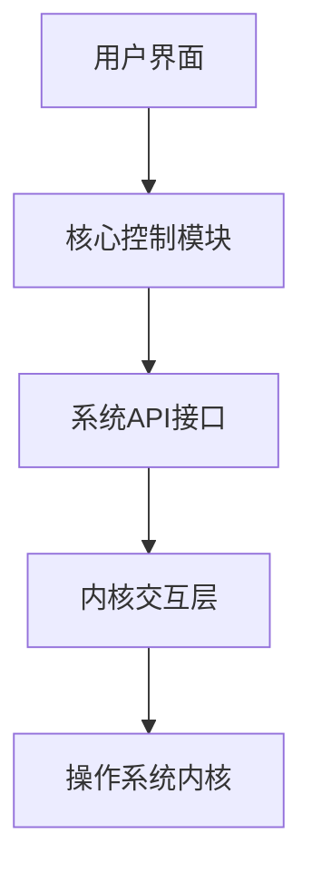

## 今日热点

AI开发工具与本地化解决方案引领今日GitHub热榜，多模型支持的AionUI暴增千星，显示开发者对隐私保护型AI工具的强烈需求。

---

## 热门项目一览

| 排名 | 项目 | 语言 | 今日 | 总计 | 简介 |
|:---:|------|:----:|------:|-----:|------|
| 1 | [iOfficeAI/AionUi](https://github.com/iOfficeAI/AionUi) | TypeScript | +961 | 7,515 | Free, local, open-source Co... |
| 2 | [google/langextract](https://github.com/google/langextract) | Python | +566 | 23,050 | A Python library for extrac... |
| 3 | [DavidXanatos/TaskExplorer](https://github.com/DavidXanatos/TaskExplorer) | C | +326 | 2,674 | Power full Task Manager |
| 4 | [lukasz-madon/awesome-remote-job](https://github.com/lukasz-madon/awesome-remote-job) | Unknown | +244 | 42,378 | A curated list of awesome r... |
| 5 | [tobi/try](https://github.com/tobi/try) | Shell | +168 | 2,872 | fresh directories for every... |
| 6 | [microsoft/agent-lightning](https://github.com/microsoft/agent-lightning) | Python | +43 | 10,615 | The absolute trainer to lig... |
| 7 | [AlexxIT/go2rtc](https://github.com/AlexxIT/go2rtc) | Go | +25 | 11,381 | Ultimate camera streaming a... |

---

## 趋势洞察

```
┌─────────────────────────────────────────────────────────────────┐
│  AI/ML 工具         ████████████████████████  3 个项目        │
│  其他               ████████████████          2 个项目        │
│  多媒体应用            ████████                  1 个项目        │
│  项目管理             ████████                  1 个项目        │
└─────────────────────────────────────────────────────────────────┘
```

---

## 项目深度解读

### 1. iOfficeAI/AionUi — AI编程协作平台

> **一句话总结**：本地开源的AI编程协作界面，支持多种主流AI编程助手，提升开发效率。

#### 价值主张

| 维度 | 说明 |
|------|------|
| **解决痛点** | 分散的AI编程工具整合，提供统一本地协作环境 |
| **目标用户** | 开发者、AI工具使用者、需要提升编程效率的人群 |
| **核心亮点** | 本地部署 + 多AI工具支持 + 开源免费 + 跨平台兼容 |

#### 技术架构


**技术特色**：
- 基于TypeScript构建，保证代码质量和类型安全
- 支持多种AI编程助手，展现强大的扩展性和集成能力
- 本地部署方案，确保数据隐私和离线使用能力

#### 热度分析

- 项目Star数高达7515，且单日增长近千，表明近期受到开发者广泛关注
- Issues为0，可能反映项目维护良好或问题解决迅速，社区活跃度高

#### 快速上手

```bash
# 克隆项目
git clone https://github.com/iOfficeAI/AionUi.git

# 安装依赖
npm install

# 启动项目
npm run dev
```

#### 注意事项

- 项目许可证未知，商业使用前需确认授权条款
- 本地部署可能需要较高的计算资源，特别是同时运行多个AI助手时
- 由于支持多种AI工具，可能需要配置各自的API密钥或访问权限


### 2. google/langextract — 文本结构提取

> **一句话总结**：利用大型语言模型从非结构化文本中提取结构化信息，提供精确源定位和交互式可视化。

#### 价值主张

| 维度 | 说明 |
|------|------|
| **解决痛点** | 解决文本信息提取缺乏源定位和可视化的问题 |
| **目标用户** | 数据分析师、研究人员、开发者等需要从文本中提取结构化信息的人群 |
| **核心亮点** | 大型语言模型支持 + 精确源定位 + 交互式可视化 + 结构化输出 |

#### 技术架构


**技术特色**：
- 利用大型语言模型进行智能文本理解
- 提供精确的源定位功能，确保信息可追溯
- 支持交互式可视化，直观展示提取结果

#### 热度分析

- 项目Star数超过23,000，今日新增566个Star，显示出快速增长的趋势
- 高Star数和Fork数表明项目在文本处理领域具有重要影响力

#### 快速上手

```bash
# 安装langextract库
pip install langextract

# 基本使用示例
import langextract
result = langextract.extract(text, schema)
print(result)
```

#### 注意事项

- 需要依赖大型语言模型，可能需要API密钥或本地模型
- 处理大量文本时可能需要考虑性能优化
- 输出结果的准确性依赖于底层LLM的能力


### 3. DavidXanatos/TaskExplorer — 系统任务管理器

> **一句话总结**：C语言编写的轻量级系统级任务管理器，提供深度进程监控与控制功能。

#### 价值主张

| 维度 | 说明 |
|------|------|
| **解决痛点** | 系统自带任务管理器功能有限，无法满足高级用户深度系统控制需求 |
| **目标用户** | 系统管理员、开发人员、高级用户和需要系统级控制权的用户 |
| **核心亮点** | 直接系统调用访问 + 轻量级设计 + 实时进程监控 + 资源使用分析 + 多线程任务管理 |

#### 技术架构



**技术特色**：
- 直接系统调用实现进程控制，绕过标准库限制
- 轻量级设计，资源占用极低，不影响系统性能
- 支持实时进程监控和分析，提供详细系统调用信息

#### 热度分析

- 项目近期Star增长迅速，单日增长326，表明社区关注度持续上升
- 零未解决问题，显示项目维护状态良好，问题响应及时

#### 快速上手

```bash
# 克隆项目
git clone https://github.com/DavidXanatos/TaskExplorer.git
cd TaskExplorer

# 编译项目
make

# 运行程序
./TaskExplorer
```

#### 注意事项

- 需要管理员/root权限才能访问某些系统功能
- 项目可能仅在特定操作系统上测试过（如Windows）
- 由于是C语言项目，编译时可能需要特定的开发环境


### 4. lukasz-madon/awesome-remote-job — 远程工作资源库

> **一句话总结**：精心策划的远程工作资源和职位列表，为全球求职者提供一站式远程工作平台。

#### 价值主张

| 维度 | 说明 |
|------|------|
| **解决痛点** | 解决远程工作者寻找可靠工作机会和资源分散的问题 |
| **目标用户** | 寻找远程工作的开发者、设计师、营销人员等专业人士 |
| **核心亮点** | 精选优质资源 + 分类清晰 + 定期更新 + 社区驱动 |

#### 技术架构


**技术特色**：
- 采用 GitHub Issues 和 Pull Requests 进行内容贡献管理
- 使用 Markdown 格式维护内容，便于阅读和编辑
- 社区驱动的内容更新机制，保持资源新鲜度

#### 热度分析

- 高星项目(+244今日增长)，显示远程工作需求持续增长，项目已成为行业标杆
- 作为 awesome 系列项目，在远程工作领域具有生态引领地位，吸引大量求职者和招聘方关注

#### 快速上手

```bash
# 克隆项目到本地
git clone https://github.com/lukasz-madon/awesome-remote-job.git

# 浏览 README.md 文件获取最新远程工作资源
cat README.md
```

#### 注意事项

- 资源链接可能失效，需要定期检查和更新
- 提交新资源时请确保符合项目主题和标准
- 项目主要面向技术岗位，非技术类远程工作资源相对较少


### 5. tobi/try — 目录环境管理工具

> **一句话总结**：自动创建全新工作目录，为不同项目和情境提供独立干净的环境。

#### 价值主张

| 维度 | 说明 |
|------|------|
| **解决痛点** | 手动创建和管理项目目录繁琐，缺乏统一标准 |
| **目标用户** | 开发者、测试人员、需要频繁创建临时环境者 |
| **核心亮点** | 自动创建新目录 + 每次都是全新环境 + 简单命令行 + 跨平台兼容 |

#### 技术架构


**技术特色**：
- Shell脚本实现，无需额外依赖
- 轻量级设计，启动快速
- 命令行接口直观易用

#### 热度分析

- 项目Star数达2872且近期增长显著(+168/天)，表明社区认可度高
- 作为实用工具而非框架，Fork数相对较低，用户更倾向于直接使用

#### 快速上手

```bash
# 克隆项目
git clone https://github.com/tobi/try.git
cd try

# 使用
./try my-new-project
```

#### 注意事项

- 项目License未知，商业使用前需确认授权条款
- Shell脚本在不同操作系统上的兼容性可能有限
- 可能需要手动设置执行权限


### 6. microsoft/agent-lightning — 智能代理训练器

> **一句话总结**：微软开源的AI代理训练框架，简化复杂AI代理的开发与部署流程。

#### 价值主张

| 维度 | 说明 |
|------|------|
| **解决痛点** | 简化AI代理训练流程，降低开发门槛，提高训练效率 |
| **目标用户** | AI开发者、研究人员及企业技术团队 |
| **核心亮点** | 简化训练接口 + 预置模型模板 + 多架构支持 + 训练优化 + 生态集成 |

#### 技术架构


**技术特色**：
- 模块化训练框架设计，支持灵活扩展
- 自动化超参数优化，减少人工调参
- 分布式训练支持，加速大规模模型训练

#### 热度分析

- 项目拥有10,615个Star，且当日增长43个，表明项目近期热度较高，受到社区广泛关注
- 作为Microsoft AI战略重要组成部分，在AI代理开发领域具有重要生态位置

#### 快速上手

```bash
# 安装agent-lightning
pip install agent-lightning

# 基本使用示例
from agent_lightning import AgentTrainer
trainer = AgentTrainer()
trainer.train(model="your_model", config="config.yaml")
```

#### 注意事项

- 项目需要较新的Python版本和相关依赖库
- 训练过程可能需要强大的计算资源支持
- 建议配合Microsoft Azure服务使用以获得最佳性能
- 部分高级功能可能需要Microsoft账户或API密钥


### 7. AlexxIT/go2rtc — 全能流媒体服务器

> **一句话总结**：支持多协议的终极摄像头流媒体应用，实现视频流的采集、转换与分发一体化。

#### 价值主张

| 维度 | 说明 |
|------|------|
| **解决痛点** | 统一处理多种视频流协议，解决不同设备间流媒体兼容性问题 |
| **目标用户** | 需要处理多种视频流的开发者、安防系统部署人员、IoT系统集成商 |
| **核心亮点** | 支持多协议输入输出 + 轻量级Go实现 + 即插即用配置 |

#### 技术架构


**技术特色**：
- 基于Go语言的高性能流媒体处理
- 支持广泛的流媒体协议，包括实时和流媒体协议
- 集成FFmpeg进行编解码处理

#### 热度分析

- 项目获得11k+星标且持续增长，表明在流媒体处理领域受到广泛认可
- 零开放问题反映项目成熟度高，社区维护良好

#### 快速上手

```bash
# 安装go2rtc
go get github.com/AlexxIT/go2rtc

# 启动默认服务
go2rtc

# 配置摄像头流
go2rtc --rtsp "rtsp://camera/stream" --webrtc
```

#### 注意事项

- 需要了解不同流媒体协议的特点和适用场景
- 可能需要配置网络端口和防火墙规则
- 性能可能受限于硬件编解码能力


## 今日推荐

| 主题 | 推荐项目 | 亮点 |
|------|----------|------|
| 今日最热 | [iOfficeAI/AionUi](https://github.com/iOfficeAI/AionUi) | Free, local, open... |
| 值得关注 | [google/langextract](https://github.com/google/langextract) | A Python library ... |
| 快速上手 | [DavidXanatos/TaskExplorer](https://github.com/DavidXanatos/TaskExplorer) | Power full Task M... |
| 长期潜力 | [lukasz-madon/awesome-remote-job](https://github.com/lukasz-madon/awesome-remote-job) | A curated list of... |

---

<div align="center">

*Generated on 2026-01-20 | Powered by GitHub Trending Reporter*

</div>