```mermaid
graph LR
    A[用户行为数据] --> B[特征工程]
    B --> C[模型训练]
    C --> D[候选生成]
    D --> E[排序与过滤]
    E --> F[个性化推荐]
```

```mermaid
graph LR
    A[文档输入] --> B[分页处理]
    B --> C[推理索引构建]
    C --> D[查询解析]
    D --> E[推理检索]
    E --> F[结果输出]
```

```mermaid
graph LR
    A[用户代码/需求] --> B[Claude Code分析]
    B --> C[复合工程处理]
    C --> D[优化建议/生成代码]
    D --> E[集成到开发环境]
```

```mermaid
graph LR
    A[UI 定义/配置] --> B[生成引擎]
    B --> C[React 组件]
    C --> D[渲染界面]
```

```mermaid
graph LR
    A[文本输入] --> B[Tokenization]
    B --> C[Grok-1 Transformer]
    C --> D[解码]
    D --> E[文本输出]
```

```mermaid
graph LR
    A[数据输入] --> B[模型训练]
    B --> C[智能体构建]
    C --> D[评估优化]
    D --> E[部署应用]
```

```mermaid
graph LR
    A[用户输入] --> B[生成唯一目录名]
    B --> C[创建新目录]
    C --> D[进入目录]
    D --> E[准备环境]
```

```mermaid
graph LR
    A[基础知识学习] --> B[数据处理实践]
    B --> C[数据分析探索]
    C --> D[机器学习应用]
    D --> E[项目实战]
```

## 今日热点

AI开发工具与模型开源成为主流，生成式UI、AI代理训练及文档检索技术受关注，显示AI正在深度融入开发全流程。

---

## 热门项目一览

| 排名 | 项目 | 语言 | 今日 | 总计 | 简介 |
|:---:|------|:----:|------:|-----:|------|
| 1 | [twitter/the-algorithm](https://github.com/twitter/the-algorithm) | Scala | +414 | 71,160 | Source code for the X Recom... |
| 2 | [VectifyAI/PageIndex](https://github.com/VectifyAI/PageIndex) | Python | +288 | 5,900 | 📑 PageIndex: Document Index... |
| 3 | [EveryInc/compound-engineering-plugin](https://github.com/EveryInc/compound-engineering-plugin) | Python | +272 | 5,424 | Official Claude Code compou... |
| 4 | [tambo-ai/tambo](https://github.com/tambo-ai/tambo) | TypeScript | +246 | 2,978 | Generative UI SDK for React |
| 5 | [xai-org/grok-1](https://github.com/xai-org/grok-1) | Python | +135 | 50,800 | Grok open release |
| 6 | [microsoft/agent-lightning](https://github.com/microsoft/agent-lightning) | Python | +98 | 11,055 | The absolute trainer to lig... |
| 7 | [tobi/try](https://github.com/tobi/try) | Shell | +43 | 3,032 | fresh directories for every... |
| 8 | [microsoft/Data-Science-For-Beginners](https://github.com/microsoft/Data-Science-For-Beginners) | Jupyter Notebook | +34 | 31,946 | 10 Weeks, 20 Lessons, Data ... |

---

## 趋势洞察

```
┌─────────────────────────────────────────────────────────────────┐
│  AI/ML 工具         ████████████████████████  5 个项目        │
│  其他               █████████                 2 个项目        │
│  数据分析             ████                      1 个项目        │
└─────────────────────────────────────────────────────────────────┘
```

---

## 项目深度解读

### 1. twitter/the-algorithm — 社交推荐引擎

> **一句话总结**：Twitter/X开源推荐算法，实现内容个性化分发与用户兴趣匹配。

#### 价值主张

| 维度 | 说明 |
|------|------|
| **解决痛点** | 解决社交媒体信息过载问题，实现精准内容推荐 |
| **目标用户** | 社交媒体平台开发者、推荐系统研究者、数据科学家 |
| **核心亮点** | 大规模实时推荐系统 + 机器学习算法 + 开源透明性 + 可扩展架构 |

#### 技术架构



**技术特色**：
- 基于Scala和Akka构建的高并发推荐系统
- 结合深度学习的多阶段推荐流水线
- 支持实时反馈的在线学习机制
- 大规模数据处理与特征工程能力

#### 热度分析

- 项目获得7万+星标且持续增长，表明推荐算法开源在技术社区引起高度关注
- 作为首个大型社交媒体平台公开核心算法，具有行业标杆意义和广泛研究价值

#### 快速上手

```bash
# 克隆仓库
git clone https://github.com/twitter/the-algorithm.git

# 构建项目
cd the-algorithm
sbt compile

# 运行测试
sbt test
```

#### 注意事项

- 项目代码可能涉及复杂的机器学习算法和分布式系统知识，需要一定技术背景
- 作为生产环境代码，可能需要大量计算资源和优化才能运行
- 算法效果可能需要针对特定数据集进行调优
- 注意遵守项目许可协议（虽然当前显示为Unknown）


### 2. VectifyAI/PageIndex — 无向量推理索引

> **一句话总结**：PageIndex通过推理而非向量嵌入实现文档索引，为RAG系统提供轻量高效的检索方案。

#### 价值主张

| 维度 | 说明 |
|------|------|
| **解决痛点** | 传统RAG依赖向量数据库计算量大且需要GPU，PageIndex提供无需向量计算的替代方案 |
| **目标用户** | 需要高效文档检索但资源受限的开发者和研究团队 |
| **核心亮点** | + 无向量索引技术 + 推理式检索 + 低资源消耗 + 高精度匹配 + 轻量级部署 |

#### 技术架构



**技术特色**：
- 基于语义推理而非向量相似度的检索机制
- 页面级文档索引结构，精准定位信息
- 无需GPU支持，降低部署门槛

#### 热度分析

- 项目Star数达5900且单日增长288，表明其解决的实际问题获得广泛认可，正处于快速上升期
- 零开放Issues反映项目维护质量高，社区反馈渠道可能已迁移至其他平台

#### 快速上手

```bash
# 克隆仓库
git clone https://github.com/VectifyAI/PageIndex.git
cd PageIndex

# 安装依赖
pip install -r requirements.txt

# 基本使用示例
python index.py --document path/to/document.pdf
python query.py --query "your search query"
```

#### 注意事项

- 项目许可证未知，商业使用前需确认授权条款
- 作为新兴技术，其推理能力可能不如传统向量方法在复杂语义理解上表现稳定
- 实际效果可能因文档类型和查询复杂度而异


### 3. EveryInc/compound-engineering-plugin — AI编程增强插件

> **一句话总结**：Claude Code官方插件，通过复合工程技术增强AI编程能力，提供智能代码生成与优化。

#### 价值主张

| 维度 | 说明 |
|------|------|
| **解决痛点** | 提升AI编程辅助效果，解决复杂工程场景下的代码生成与优化难题 |
| **目标用户** | 开发者、AI编程工具用户、复杂工程项目的工程师 |
| **核心亮点** | AI增强代码生成+工程化代码优化+多语言支持+智能错误修复+项目结构理解 |

#### 技术架构



**技术特色**：
- 基于Python的插件化架构，易于扩展
- 整合复合工程技术处理复杂编程场景
- 与Claude Code深度集成，提供上下文感知的编程辅助

#### 热度分析

- 项目获得5422个Star且单日增长272，表明AI编程辅助工具需求旺盛，社区关注度极高
- 零Open Issues显示项目维护良好，用户问题主要通过其他渠道解决，生态成熟度高

#### 快速上手

```bash
# 安装插件
pip install compound-engineering-plugin

# 在Claude Code中启用插件
claude-code --enable-plugin compound
```

#### 注意事项

- 需要Claude Code环境支持
- 可能需要API密钥访问Claude服务
- 插件可能需要特定版本的Python支持


### 4. tambo-ai/tambo — React 生成UI工具

> **一句话总结**：通过声明式配置自动生成 React UI 组件，提升开发效率并保持界面一致性。

#### 价值主张

| 维度 | 说明 |
|------|------|
| **解决痛点** | 减少重复 UI 组件编写工作，确保多场景界面一致性 |
| **目标用户** | React 开发团队，追求高效一致 UI 构建的 |
| **核心亮点** | 声明式配置 + 自动生成组件 + 设计系统集成 |

#### 技术架构



**技术特色**：
- 基于 TypeScript 开发，提供完整类型支持
- 与 React 生态系统无缝集成
- 支持主题和设计系统自定义配置

#### 热度分析

- 项目近期获得显著关注，今日新增 246 个 Star，表明社区对该技术有强烈兴趣
- 作为新兴的生成式 UI 工具，在 React 生态系统中填补了自动化 UI 生成领域的空白

#### 快速上手

```bash
# 安装
npm install tambo

# 基本使用
import { createUI } from 'tambo';

const Button = createUI({
  base: 'button',
  variants: {
    primary: { bg: 'blue', color: 'white' },
    secondary: { bg: 'gray', color: 'black' }
  }
});
```

#### 注意事项

- 项目 License 信息不明确，商业使用前需确认授权方式
- 生成式 UI 需要学习特定的配置语法或概念，存在一定的学习曲线
- 对于高度定制化的复杂组件，可能需要结合传统开发方式


### 5. xai-org/grok-1 — 开源大模型

> **一句话总结**：xAI开源的Grok-1大语言模型，挑战闭源AI霸权的前沿尝试。

#### 价值主张

| 维度 | 说明 |
|------|------|
| **解决痛点** | 打破AI模型黑盒，提供开源替代方案，促进AI技术民主化 |
| **目标用户** | 研究机构、AI开发者、技术爱好者和企业用户 |
| **核心亮点** | 大规模参数模型 + 开源可定制 + 高性能对话能力 |

#### 技术架构



**技术特色**：
- 基于Transformer架构的大规模语言模型
- 采用混合专家模型(MoE)设计提升计算效率
- 支持高上下文长度理解和生成

#### 热度分析

- 项目短时间内获得5万+星，显示社区对开源大模型的高度关注
- 作为xAI首个开源大模型，在AI开源生态中占据重要位置

#### 快速上手

```bash
# 克隆仓库
git clone https://github.com/xai-org/grok-1.git
cd grok-1

# 安装依赖
pip install -r requirements.txt
```

#### 注意事项

- 模型参数量巨大，需要高性能硬件支持
- 使用时需遵守相关许可证条款，目前许可证信息不明确
- 模型可能包含偏见，需谨慎用于生产环境


### 6. microsoft/agent-lightning — AI智能体训练框架

> **一句话总结**：微软开源的AI智能体高效训练框架，简化复杂智能体的开发与部署流程。

#### 价值主张

| 维度 | 说明 |
|------|------|
| **解决痛点** | 简化AI智能体开发流程，降低训练技术门槛 |
| **目标用户** | AI开发者、研究人员及企业技术团队 |
| **核心亮点** | 模块化智能体设计+高效训练算法+完整工具链支持 |

#### 技术架构



**技术特色**：
- 分布式训练支持加速模型收敛
- 模块化设计便于定制智能体行为
- 内置评估体系确保性能达标

#### 热度分析

- 项目获得11k+星标，近期增长迅速，表明AI智能体开发工具需求旺盛
- 作为微软出品的项目，在AI智能体训练领域具有技术领先性和生态整合优势

#### 快速上手

```bash
# 克隆项目
git clone https://github.com/microsoft/agent-lightning.git
# 安装依赖
pip install -r requirements.txt
# 运行示例
python examples/basic_agent.py
```

#### 注意事项

- 项目可能需要较高的计算资源，特别是进行大规模智能体训练时
- 需要了解基本的AI和强化学习概念，以充分利用框架功能


### 7. tobi/try — 目录创建工具

> **一句话总结**：为每次尝试创建全新独立的工作目录，提供干净的开发环境。

#### 价值主张

| 维度 | 说明 |
|------|------|
| **解决痛点** | 每次新项目需要创建独立目录，避免文件混乱 |
| **目标用户** | 开发者、测试人员、需要临时环境的用户 |
| **核心亮点** | 自动命名 + 隔离环境 + 快速切换 |

#### 技术架构



**技术特色**：
- Shell脚本实现，轻量级无需依赖
- 简单命令接口，易于集成到工作流
- 自动命名机制，避免目录冲突

#### 热度分析

- 项目获得3032星，近期增长稳定，表明实用价值高
- 社区关注度适中，适合个人开发者和小型团队使用

#### 快速上手

```bash
# 基本使用
try

# 指定名称创建目录
try my-project

# 在当前目录下创建
try -c my-project
```

#### 注意事项

- 目录创建位置可能需要根据配置调整
- 长期使用可能需要定期清理旧目录
- 不同Shell环境可能需要额外配置


### 8. microsoft/Data-Science-For-Beginners — 数据科学入门教程

> **一句话总结**：微软出品的10周20课数据科学入门教程，零基础也能轻松学习。

#### 价值主张

| 维度 | 说明 |
|------|------|
| **解决痛点** | 为初学者提供系统、结构化的数据科学学习路径，降低入门门槛 |
| **目标用户** | 数据科学零基础或初级学习者，希望系统掌握数据科学技能的人 |
| **核心亮点** | 微软官方出品 + 结构化课程设计 + 实践导向 + 免费开放 |

#### 技术架构



**技术特色**：
- 基于Jupyter Notebook的交互式学习环境，边学边练
- 融合理论与实践，每个知识点配有可运行的代码示例
- 采用循序渐进的课程设计，知识点层层递进

#### 热度分析

- 项目获得近3.2万星，每日新增约34星，表明持续受到社区高度关注
- 作为微软官方教育项目，在数据科学入门领域具有权威性和影响力

#### 快速上手

```bash
# 克隆项目到本地
git clone https://github.com/microsoft/Data-Science-For-Beginners.git

# 进入项目目录
cd Data-Science-For-Beginners
```

#### 注意事项

- 项目使用Jupyter Notebook，需要安装Python环境和Jupyter才能运行
- 建议按照10周课程顺序学习，循序渐进掌握知识点
- 部分课程可能需要额外的数据集或依赖库，需按说明配置


## 今日推荐

| 主题 | 推荐项目 | 亮点 |
|------|----------|------|
| 今日最热 | [twitter/the-algorithm](https://github.com/twitter/the-algorithm) | Source code for t... |
| 值得关注 | [VectifyAI/PageIndex](https://github.com/VectifyAI/PageIndex) | 📑 PageIndex: Docu... |
| 快速上手 | [EveryInc/compound-engineering-plugin](https://github.com/EveryInc/compound-engineering-plugin) | Official Claude C... |
| 长期潜力 | [tambo-ai/tambo](https://github.com/tambo-ai/tambo) | Generative UI SDK... |

---

<div align="center">

*Generated on 2026-01-21 | Powered by GitHub Trending Reporter*

</div>