```mermaid
graph LR
    A[智能体定义] --> B[训练框架]
    B --> C[模型优化]
    C --> D[部署工具]
    D --> E[监控与反馈]
```

```mermaid
graph LR
    A[用户行为数据] --> B[特征提取]
    B --> C[模型计算]
    C --> D[内容排序]
    D --> E[个性化推荐]
```

```mermaid
graph LR
    A[自然语言描述] --> B[AI解析]
    B --> C[组件生成]
    C --> D[React渲染]
    D --> E[实时预览]
```

```mermaid
graph LR
    A[开发环境] --> B[Claude API]
    B --> C[插件处理]
    C --> D[代码生成]
    D --> E[IDE集成]
```

```mermaid
graph LR
    A[执行try命令] --> B[生成唯一目录名]
    B --> C[创建新目录]
    C --> D[自动切换到新目录]
```

```mermaid
graph LR
    A[输入文本] --> B[编码层]
    B --> C[Transformer核心]
    C --> D[解码层]
    D --> E[生成文本]
```

```mermaid
graph LR
    A[文档输入] --> B[文档解析]
    B --> C[推理式索引构建]
    C --> D[基于推理的检索]
    D --> E[生成式输出]
```

```mermaid
graph LR
    A[理论学习] --> B[代码示例]
    B --> C[实践练习]
    C --> D[项目实战]
```

## 今日热点

AI开源模型与工具引领今日热榜，xAI的Grok、微软的Agent Lightning等AI项目获高度关注，同时生成式UI SDK和开发工具也受到开发者青睐。

---

## 热门项目一览

| 排名 | 项目 | 语言 | 今日 | 总计 | 简介 |
|:---:|------|:----:|------:|-----:|------|
| 1 | [microsoft/agent-lightning](https://github.com/microsoft/agent-lightning) | Python | +527 | 11,190 | The absolute trainer to lig... |
| 2 | [twitter/the-algorithm](https://github.com/twitter/the-algorithm) | Scala | +391 | 71,358 | Source code for the X Recom... |
| 3 | [tambo-ai/tambo](https://github.com/tambo-ai/tambo) | TypeScript | +222 | 3,291 | Generative UI SDK for React |
| 4 | [EveryInc/compound-engineering-plugin](https://github.com/EveryInc/compound-engineering-plugin) | TypeScript | +190 | 5,672 | Official Claude Code compou... |
| 5 | [tobi/try](https://github.com/tobi/try) | Shell | +189 | 3,138 | fresh directories for every... |
| 6 | [xai-org/grok-1](https://github.com/xai-org/grok-1) | Python | +141 | 50,950 | Grok open release |
| 7 | [VectifyAI/PageIndex](https://github.com/VectifyAI/PageIndex) | Python | +100 | 6,084 | 📑 PageIndex: Document Index... |
| 8 | [microsoft/Data-Science-For-Beginners](https://github.com/microsoft/Data-Science-For-Beginners) | Jupyter Notebook | +99 | 32,248 | 10 Weeks, 20 Lessons, Data ... |

---

## 趋势洞察

```
┌─────────────────────────────────────────────────────────────────┐
│  AI/ML 工具         ████████████████████████  5 个项目        │
│  其他               █████████                 2 个项目        │
│  数据分析             ████                      1 个项目        │
└─────────────────────────────────────────────────────────────────┘
```

---

## 项目深度解读

### 1. microsoft/agent-lightning — AI智能体训练框架

> **一句话总结**：微软出品的AI智能体训练框架，提供高效开发与部署能力。

#### 价值主张

| 维度 | 说明 |
|------|------|
| **解决痛点** | AI智能体开发复杂、训练效率低下的问题 |
| **目标用户** | AI开发者、研究人员和企业应用构建者 |
| **核心亮点** | 模块化设计 + 高性能训练 + 微软技术支持 + 易于集成 |

#### 技术架构



**技术特色**：
- 基于微软最新AI技术栈构建
- 支持多种模型架构和训练策略
- 提供端到端解决方案与工具链

#### 热度分析

- 项目热度增长迅速，一天内新增527个star，表明社区关注度高
- 微软出品加上AI Agent热门领域，使其在开源生态中占据重要位置

#### 快速上手

```bash
# 安装agent-lightning
pip install agent-lightning

# 初始化项目
agent-lightning init my-agent

# 开始训练
agent-lightning train --config config.yaml
```

#### 注意事项

- 项目许可证未知，商业使用前需确认授权
- 作为微软项目，可能需要Azure服务支持最佳性能
- 开发活跃度需关注，当前Open Issues为0，可能表示项目处于早期阶段


### 2. twitter/the-algorithm — 社交推荐引擎

> **一句话总结**：开源社交平台核心推荐算法，实现内容精准分发与个性化体验。

#### 价值主张

| 维度 | 说明 |
|------|------|
| **解决痛点** | 解决信息过载环境下优质内容精准触达问题 |
| **目标用户** | 社交媒体开发者、推荐系统研究人员、算法工程师 |
| **核心亮点** | 大规模实时推荐处理 + 多维度特征融合 + 分布式架构设计 |

#### 技术架构



**技术特色**：
- 基于Scala构建的高性能处理系统
- 分布式计算架构支持大规模实时数据处理
- 多阶段推荐流程优化用户体验与参与度

#### 热度分析

- 项目Star数超7万且持续增长，表明推荐算法领域关注度持续提升
- 作为社交平台核心技术，社区贡献活跃，具有高参考价值

#### 快速上手

```bash
# 克隆项目
git clone https://github.com/twitter/the-algorithm.git

# 进入项目目录
cd the-algorithm
```

#### 注意事项

- 项目依赖复杂的分布式环境配置
- 需要深入了解推荐系统基础知识才能有效使用
- 代码可能包含Twitter内部特有的数据处理逻辑


### 3. tambo-ai/tambo — React生成式UI框架

> **一句话总结**：通过AI技术自动生成React组件，大幅提升UI开发效率与一致性。

#### 价值主张

| 维度 | 说明 |
|------|------|
| **解决痛点** | 手动编写React组件效率低下，难以保持设计一致性 |
| **目标用户** | React开发者、前端工程师、UI/UX设计师 |
| **核心亮点** | AI驱动生成 + 类型安全 + 响应式设计 + 组件库集成 + 设计系统支持 |

#### 技术架构



**技术特色**：
- 基于TypeScript提供完整类型支持与IDE智能提示
- 集成主流设计系统确保UI一致性
- 支持组件参数化配置与二次开发

#### 热度分析
- 项目Star数3,291且单日增长222，显示社区高度关注与采用率快速上升
- 无Open Issues表明项目维护质量高，问题响应及时

#### 快速上手

```bash
# 安装tambo
npm install tambo-ai

# 在React组件中使用
import { generate } from 'tambo-ai';

const MyComponent = generate("创建一个带有搜索框和登录按钮的导航栏");
```

#### 注意事项
- 需要配置AI服务API密钥才能使用生成功能
- 生成的组件可能需要根据具体项目需求进行样式调整
- 建议结合现有组件库使用以获得最佳效果


### 4. EveryInc/compound-engineering-plugin — AI编程助手插件

> **一句话总结**：官方 Claude Code 复合工程插件，将 AI 能力深度集成开发环境，提升编码效率

#### 价值主张

| 维度 | 说明 |
|------|------|
| **解决痛点** | 将 Claude AI 能力集成到开发环境，提供智能编程辅助 |
| **目标用户** | 使用 Claude AI 的开发者和工程师 |
| **核心亮点** | 深度集成 + 智能代码生成 + 上下文感知 + 多语言支持 |

#### 技术架构



**技术特色**：
- 基于 TypeScript 开发，提供类型安全和良好的开发体验
- 与 Claude AI 深度集成，利用其强大的代码理解能力
- 支持多种开发环境和工具链，提高兼容性

#### 热度分析

- 项目 Star 数达 5,672 且持续增长(+190 today)，表明社区对该 AI 编程辅助工具高度认可
- 0 Open Issues 反映项目维护良好，用户问题可能通过其他渠道解决

#### 快速上手

```bash
# 安装插件
npm install @everyinc/compound-engineering-plugin

# 在项目中初始化
npx compound-init

# 启动开发模式
compound dev
```

#### 注意事项

- 需要有效的 Claude API 密钥才能使用完整功能
- 插件可能与某些特定开发环境或版本不兼容，使用前需检查兼容性


### 5. tobi/try — 目录创建工具

> **一句话总结**：为每次工作会话创建全新隔离目录的轻量级Shell工具

#### 价值主张

| 维度 | 说明 |
|------|------|
| **解决痛点** | 避免手动创建和命名临时目录，提高工作效率 |
| **目标用户** | 命令行爱好者、临时项目开发者 |
| **核心亮点** | 自动创建唯一目录 + 简单易用 + 即时切换 + 零配置 |

#### 技术架构



**技术特色**：
- 使用Shell内置功能实现零依赖
- 通过随机命名确保目录唯一性
- 简单的命令接口，提高工作效率

#### 热度分析

- 项目获得3,138个Star且今日新增189个，表明近期热度快速增长，受到开发者社区广泛认可。
- 仅有116个Fork，说明更多用户选择直接使用而非二次开发，工具设计简洁实用。

#### 快速上手

```bash
# 直接运行try命令创建并切换到新目录
try

# 或者可能支持自定义目录前缀
try myproject
```

#### 注意事项

- 需要确认是否安装了特定Shell环境
- 可能不适用于所有操作系统或Shell
- 需要了解如何清理创建的临时目录


### 6. xai-org/grok-1 — AI大模型开源

> **一句话总结**：xAI公司开源的先进语言模型，提供强大的文本理解和生成能力。

#### 价值主张

| 维度 | 说明 |
|------|------|
| **解决痛点** | 提供高性能开源替代方案，降低先进AI模型使用门槛 |
| **目标用户** | AI研究人员、开发者和企业应用构建者 |
| **核心亮点** | 大规模参数架构 + 高效推理能力 + 开源可定制 |

#### 技术架构



**技术特色**：
- 基于Transformer架构的大规模预训练模型
- 优化的注意力机制实现
- 高效的推理计算路径和内存管理

#### 热度分析

- 项目短期内获得5万+星标，日均增长141星，显示AI社区对开源大模型的高度关注
- Fork数达8400+，表明开发者积极参与模型研究和二次开发

#### 快速上手

```bash
# 安装依赖
pip install torch transformers

# 基本使用
from transformers import AutoModelForCausalLM, AutoTokenizer

tokenizer = AutoTokenizer.from_pretrained("xai-org/grok-1")
model = AutoModelForCausalLM.from_pretrained("xai-org/grok-1")

inputs = tokenizer("Tell me about artificial intelligence", return_tensors="pt")
outputs = model.generate(**inputs)
print(tokenizer.decode(outputs[0], skip_special_tokens=True))
```

#### 注意事项

- 模型体积大，需要充足的GPU内存和计算资源
- 许可证信息不明确，使用前需确认具体授权条款
- 建议在专业环境中使用，避免潜在的安全风险和合规问题


### 7. VectifyAI/PageIndex — 推理式文档索引

> **一句话总结**：无需向量化文档，通过推理机制实现高效检索与生成，降低RAG应用门槛。

#### 价值主张

| 维度 | 说明 |
|------|------|
| **解决痛点** | 解决传统RAG系统向量依赖问题，降低计算成本和复杂度 |
| **目标用户** | 需要RAG功能但缺乏向量处理经验的开发者 |
| **核心亮点** | 无向量依赖 + 基于推理的检索 + 多文档格式支持 + 简化RAG实现 |

#### 技术架构



**技术特色**：
- 基于推理而非向量相似度的文档检索机制
- 降低RAG系统对向量计算资源的依赖
- 支持更精确的语义理解和上下文关联

#### 热度分析

- 项目Star数达6084，近期增长迅速，表明社区对其创新方法高度认可
- 作为RAG领域创新方法，填补了无向量推理空白，吸引关注但生态尚在形成中

#### 快速上手

```bash
# 安装项目
pip install pageindex
# 构建索引
pageindex index --input documents/ --output index.db
# 执行查询
pageindex query --index index.db --question "什么是RAG?"
```

#### 注意事项

- 项目License未知，商业使用前需确认授权
- 作为新兴技术，可能存在稳定性和性能优化空间


### 8. microsoft/Data-Science-For-Beginners — 微软数据科学入门

> **一句话总结**：微软推出的10周结构化数据科学入门课程，零基础学习者也能轻松掌握核心概念与实践技能。

#### 价值主张

| 维度 | 说明 |
|------|------|
| **解决痛点** | 为零基础学习者提供系统、友好的数据科学学习路径，解决资源零散问题 |
| **目标用户** | 数据科学初学者、转行人士、在校学生 |
| **核心亮点** | 结构化课程设计 + 实践导向教学 + 微软官方背书 + 免费开放获取 |

#### 技术架构



**技术特色**：
- 基于Jupyter Notebook的交互式学习环境
- 结合理论与实践的教学方法
- 提供多种语言版本的内容

#### 热度分析

- 项目获得3.2万+星标，日增近百星，表明持续受到数据科学学习者关注
- 作为微软官方教育项目，在数据科学学习领域具有较高影响力和社区认可度

#### 快速上手

```bash
# 克隆项目到本地
git clone https://github.com/microsoft/Data-Science-For-Beginners.git

# 或在GitHub上直接浏览和运行Notebook文件
```

#### 注意事项

- 课程内容需要一定的基础编程知识，建议同时学习Python基础
- 部分课程可能需要额外的数据集或工具配置
- 学习者需要按照每周进度逐步完成，保持学习连续性


## 今日推荐

| 主题 | 推荐项目 | 亮点 |
|------|----------|------|
| 今日最热 | [microsoft/agent-lightning](https://github.com/microsoft/agent-lightning) | The absolute trai... |
| 值得关注 | [twitter/the-algorithm](https://github.com/twitter/the-algorithm) | Source code for t... |
| 快速上手 | [tambo-ai/tambo](https://github.com/tambo-ai/tambo) | Generative UI SDK... |
| 长期潜力 | [EveryInc/compound-engineering-plugin](https://github.com/EveryInc/compound-engineering-plugin) | Official Claude C... |

---

<div align="center">

*Generated on 2026-01-22 | Powered by GitHub Trending Reporter*

</div>