```mermaid
graph LR
    A[数据准备] --> B[智能体训练]
    B --> C[性能评估]
    C --> D[模型优化]
    D --> E[部署应用]
```

```mermaid
graph LR
    A[用户数据] --> B[特征工程]
    B --> C[模型训练]
    C --> D[实时预测]
    D --> E[内容排序]
    E --> F[个性化推荐]
```

```mermaid
graph LR
    A[用户需求描述] --> B[AI分析处理]
    B --> C[生成UI组件]
    C --> D[React渲染]
    D --> E[用户交互反馈]
    E --> B
```

```mermaid
graph LR
    A[Claude Code] --> B[复合工程插件]
    B --> C[工程任务处理]
    C --> D[开发环境反馈]
```

```mermaid
graph LR
    A[执行try命令] --> B[生成唯一目录名]
    B --> C[创建新目录]
    C --> D[切换到新目录]
    D --> E[返回新目录路径]
```

```mermaid
graph LR
    A[输入文本] --> B[Tokenization]
    B --> C[Transformer编码器]
    C --> D[注意力机制]
    D --> E[语言模型头]
    E --> F[输出文本]
```

```mermaid
graph LR
    A[文档输入] --> B[文档分页处理]
    B --> C[推理式索引构建]
    C --> D[查询语义理解]
    D --> E[相关页面检索]
    E --> F[生成增强回答]
```

```mermaid
graph LR
    A[基础知识] --> B[数据获取]
    B --> C[数据清洗]
    C --> D[数据分析]
    D --> E[数据可视化]
    E --> F[机器学习入门]
```

## 今日热点

AI技术持续引领开发潮流，生成式UI与智能代理工具备受关注，同时大型科技公司开源项目推动行业透明度与技术民主化。

---

## 热门项目一览

| 排名 | 项目 | 语言 | 今日 | 总计 | 简介 |
|:---:|------|:----:|------:|-----:|------|
| 1 | [microsoft/agent-lightning](https://github.com/microsoft/agent-lightning) | Python | +527 | 11,307 | The absolute trainer to lig... |
| 2 | [twitter/the-algorithm](https://github.com/twitter/the-algorithm) | Scala | +391 | 71,528 | Source code for the X Recom... |
| 3 | [tambo-ai/tambo](https://github.com/tambo-ai/tambo) | TypeScript | +222 | 3,520 | Generative UI SDK for React |
| 4 | [EveryInc/compound-engineering-plugin](https://github.com/EveryInc/compound-engineering-plugin) | TypeScript | +190 | 5,881 | Official Claude Code compou... |
| 5 | [tobi/try](https://github.com/tobi/try) | Shell | +189 | 3,205 | fresh directories for every... |
| 6 | [xai-org/grok-1](https://github.com/xai-org/grok-1) | Python | +141 | 51,075 | Grok open release |
| 7 | [VectifyAI/PageIndex](https://github.com/VectifyAI/PageIndex) | Python | +100 | 6,238 | 📑 PageIndex: Document Index... |
| 8 | [microsoft/Data-Science-For-Beginners](https://github.com/microsoft/Data-Science-For-Beginners) | Jupyter Notebook | +99 | 32,479 | 10 Weeks, 20 Lessons, Data ... |

---

## 趋势洞察

```
┌─────────────────────────────────────────────────────────────────┐
│  AI/ML 工具         ████████████████████████  5 个项目        │
│  其他               █████████                 2 个项目        │
│  数据分析             ████                      1 个项目        │
└─────────────────────────────────────────────────────────────────┘
```

---

## 项目深度解读

### 1. microsoft/agent-lightning — AI智能体训练框架

> **一句话总结**：Microsoft开发的AI智能体训练框架，提供高效、可扩展的智能体开发解决方案。

#### 价值主张

| 维度 | 说明 |
|------|------|
| **解决痛点** | 简化AI智能体开发流程，提供一站式训练与部署解决方案 |
| **目标用户** | AI开发者、研究人员、构建智能体应用的企业团队 |
| **核心亮点** | 高效训练 + 微软技术支持 + 易于集成 + 可扩展架构 |

#### 技术架构



**技术特色**：
- 基于Python构建，易于集成到现有AI工作流
- 提供完整的智能体生命周期管理工具
- 支持分布式训练，提高大规模模型训练效率
- 与Microsoft Azure AI服务深度集成

#### 热度分析

- 项目Star数超过11,000且持续快速增长，表明AI智能体领域需求旺盛
- 微软品牌加持加上开源策略，使其在AI智能体生态中占据重要位置

#### 快速上手

```bash
# 克隆项目
git clone https://github.com/microsoft/agent-lightning.git
cd agent-lightning

# 安装依赖
pip install -r requirements.txt

# 基本使用示例
from agent_lightning import AgentTrainer

trainer = AgentTrainer()
trainer.train("config.yaml")
```

#### 注意事项

- 项目依赖Microsoft生态系统，可能与其他云服务集成更佳
- 需要一定的AI和机器学习基础知识才能充分利用
- 由于是微软项目，可能会优先支持Windows平台


### 2. twitter/the-algorithm — 推荐算法源码

> **一句话总结**：Twitter(X)的核心推荐算法开源实现，展示大规模社交内容分发系统。

#### 价值主张

| 维度 | 说明 |
|------|------|
| **解决痛点** | 解决海量社交内容个性化推荐和实时分发的技术挑战 |
| **目标用户** | 社交媒体平台工程师、推荐系统研究者 |
| **核心亮点** | 大规模实时处理 + 多目标优化 + 个性化推荐 + 可扩展架构 |

#### 技术架构



**技术特色**：
- 基于Scala的高效实时处理框架
- 多目标优化的推荐算法设计
- 分布式系统架构支持大规模用户

#### 热度分析

- 高星高增长项目，日均新增近400星，显示业界高度关注
- 作为Twitter核心算法开源，对推荐系统领域有重要参考价值

#### 快速上手

```bash
# 克隆项目
git clone https://github.com/twitter/the-algorithm.git

# 运行测试
cd the-algorithm && sbt test
```

#### 注意事项

- 项目依赖Scala生态系统，需要熟悉相关工具链
- 推荐算法涉及大量数据处理，需要充足的计算资源
- 代码中可能包含特定业务逻辑，需要根据实际需求调整


### 3. tambo-ai/tambo — 生成式UI框架

> **一句话总结**：tambo是一个基于React的生成式UI SDK，通过AI自动创建和优化用户界面组件。

#### 价值主张

| 维度 | 说明 |
|------|------|
| **解决痛点** | 减少手动UI组件编写工作，加速复杂界面开发流程 |
| **目标用户** | React开发者，特别是需要快速构建原型和生产级应用的团队 |
| **核心亮点** | AI驱动UI生成 + 组件自动优化 + TypeScript类型安全 |

#### 技术架构



**技术特色**：
- 基于TypeScript的强类型系统，提供完整的开发时类型检查
- 利用大型语言模型分析用户意图，生成符合语义的UI组件
- 支持实时反馈循环，通过用户交互持续优化界面设计

#### 热度分析

- 项目Star数达3520且单日增长222，表明生成式UI领域正受到开发者高度关注
- 零开放Issues反映项目维护质量高，社区问题解决效率卓越

#### 快速上手

```bash
# 安装tambo
npm install tambo

# 在React组件中使用
import { generateUI } from 'tambo';

// 基于需求生成UI组件
const LoginForm = generateUI({
  purpose: "用户登录表单",
  requirements: ["邮箱输入", "密码输入", "提交按钮"]
});
```

#### 注意事项

- 项目License未知，商业应用前需确认授权条款
- 作为新兴技术，API可能存在变更，建议关注版本更新
- 需提供清晰的需求描述以获得理想的UI生成效果


### 4. EveryInc/compound-engineering-plugin — Claude工程插件

> **一句话总结**：官方Claude Code插件，提供复合工程学功能，提升AI辅助开发体验。

#### 价值主张

| 维度 | 说明 |
|------|------|
| **解决痛点** | 解决AI辅助开发中复杂工程任务处理问题 |
| **目标用户** | 使用Claude Code的软件工程师和开发者 |
| **核心亮点** | 官方支持 + 复合工程学集成 + 开发效率提升 |

#### 技术架构



**技术特色**：
- TypeScript开发，保证类型安全
- 插件化架构，易于扩展集成
- 与Claude Code深度协同工作

#### 热度分析
- 近5900星标且持续增长，表明社区高度关注和认可
- 零开放问题显示项目维护良好，功能已相对稳定成熟

#### 快速上手

```bash
# 安装Claude Code
npm install -g @anthropic-ai/claude-code

# 安装复合工程插件
claude-code install compound-engineering
```

#### 注意事项
- 需要Claude Code环境支持才能正常运行
- 可能需要特定配置才能启用复合工程学高级功能
- 建议查阅官方文档了解完整功能和使用场景


### 5. tobi/try — 目录环境管理器

> **一句话总结**：为每个项目或场景快速创建隔离的目录环境，避免文件混乱与冲突。

#### 价值主张

| 维度 | 说明 |
|------|------|
| **解决痛点** | 快速创建隔离目录环境，避免项目间文件混杂 |
| **目标用户** | 开发者、系统管理员、多任务工作者 |
| **核心亮点** | 简单易用 + 自动命名 + 即时切换 |

#### 技术架构



**技术特色**：
- 纯 Shell 实现，零依赖，跨平台兼容
- 简洁命令行接口，单命令完成所有操作
- 智能生成唯一目录名，避免命名冲突

#### 热度分析

- 项目获3200+ stars且持续增长，表明开发者对简化目录管理工具有强烈需求
- 118个fork显示社区有积极参与和二次开发的意愿

#### 快速上手

```bash
# 克隆项目
git clone https://github.com/tobi/try.git
cd try

# 安装到PATH
cp try /usr/local/bin/

# 使用try创建新目录
try
try my-project
try experimental-feature
```

#### 注意事项

- 需要确保Shell环境支持所使用的特性
- 可能需要手动将try命令添加到系统PATH中以全局使用
- 目录创建位置取决于当前工作目录，建议在项目根目录下使用


### 6. xai-org/grok-1 — 开源大模型

> **一句话总结**：xAI 开源的 Grok-1 大型语言模型，展现强大的推理与对话能力。

#### 价值主张

| 维度 | 说明 |
|------|------|
| **解决痛点** | 提供开源替代方案，打破闭源大模型的垄断 |
| **目标用户** | 研究机构、开发者、AI爱好者 |
| **核心亮点** | 高性能推理能力 + 开源透明性 + 对话交互能力 |

#### 技术架构



**技术特色**：
- 基于 Transformer 架构的大型语言模型
- 高性能推理与对话能力
- 开源模型权重与架构

#### 热度分析

- 项目获得超5万星，增长迅速，表明社区对开源大模型的强烈兴趣
- 作为xAI的开源项目，在开源AI生态中占据重要位置，为研究者提供重要资源

#### 快速上手

```bash
# 克隆仓库
git clone https://github.com/xai-org/grok-1.git
cd grok-1

# 安装依赖
pip install -r requirements.txt

# 运行示例
python example.py
```

#### 注意事项

- 模型需要大量计算资源才能有效运行
- 需要遵守项目许可证的使用条款（目前显示为Unknown）
- 模型输出可能需要进一步评估以确保安全性


### 7. VectifyAI/PageIndex — 无向量文档索引

> **一句话总结**：PageIndex提供无需向量化、基于推理的文档索引系统，优化RAG应用的检索效率。

#### 价值主张

| 维度 | 说明 |
|------|------|
| **解决痛点** | 解决传统RAG系统依赖向量化带来的高计算成本和语义理解局限问题 |
| **目标用户** | 需要构建高效文档检索系统的AI研究者和开发者 |
| **核心亮点** | 无需向量化 + 基于推理 + 页面级索引 + 低资源消耗 |

#### 技术架构



**技术特色**：
- 采用推理式索引替代传统向量嵌入，大幅降低计算资源需求
- 基于页面级别的文档组织结构，提高检索精确度和上下文完整性
- 结合语义理解和推理能力，增强复杂查询的检索质量

#### 热度分析

- 项目获得6,238 stars且持续增长(+100 today)，表明社区对其无向量RAG方案高度认可
- 零开放问题反映项目成熟度高，已形成稳定的技术解决方案

#### 快速上手

```bash
# 安装依赖
pip install pageindex

# 基本使用
from pageindex import PageIndex
index = PageIndex()
index.add_document("example.pdf")
results = index.query("如何提高RAG系统的准确性？")
```

#### 注意事项

- 项目可能需要依赖特定的推理模型或框架，确保环境兼容性
- 无向量方法可能在某些复杂语义场景下效果不如传统向量方法全面
- 文档格式支持可能有限，需提前确认兼容的文档类型


### 8. microsoft/Data-Science-For-Beginners — 数据科学入门课程

> **一句话总结**：微软官方推出的10周数据科学入门教程，零基础友好，理论与实践并重。

#### 价值主张

| 维度 | 说明 |
|------|------|
| **解决痛点** | 为初学者提供系统、结构化的数据科学学习路径，降低入门门槛 |
| **目标用户** | 零基础或初级数据科学学习者，希望系统掌握数据科学知识的人群 |
| **核心亮点** | 10周系统学习计划 + 20节实战课程 + 微软官方背书 + Jupyter Notebook实践 + 全方位数据科学覆盖 |

#### 技术架构



**技术特色**：
- 基于Jupyter Notebook的交互式学习环境
- 理论与实践相结合的教学方法
- 微软官方出品，内容权威可靠

#### 热度分析

- 项目获得超3.2万星标，近期仍有稳定增长，表明在数据科学入门领域具有广泛影响力
- 作为微软官方教程，在数据科学学习生态中占据重要位置，为初学者提供了权威学习资源

#### 快速上手

```bash
# 克隆项目到本地
git clone https://github.com/microsoft/Data-Science-For-Beginners.git

# 使用Jupyter Notebook打开课程
cd Data-Science-For-Beginners
jupyter notebook
```

#### 注意事项

- 本项目需要一定的Python基础知识，建议同时学习Python编程
- 课程需要安装Jupyter Notebook和相关数据科学库（如pandas, numpy等）
- 完整学习需要约10周时间，建议保持持续学习习惯
- 部分课程可能需要较强的数学基础，特别是统计学和线性代数知识


## 今日推荐

| 主题 | 推荐项目 | 亮点 |
|------|----------|------|
| 今日最热 | [microsoft/agent-lightning](https://github.com/microsoft/agent-lightning) | The absolute trai... |
| 值得关注 | [twitter/the-algorithm](https://github.com/twitter/the-algorithm) | Source code for t... |
| 快速上手 | [tambo-ai/tambo](https://github.com/tambo-ai/tambo) | Generative UI SDK... |
| 长期潜力 | [EveryInc/compound-engineering-plugin](https://github.com/EveryInc/compound-engineering-plugin) | Official Claude C... |

---

<div align="center">

*Generated on 2026-01-22 | Powered by GitHub Trending Reporter*

</div>