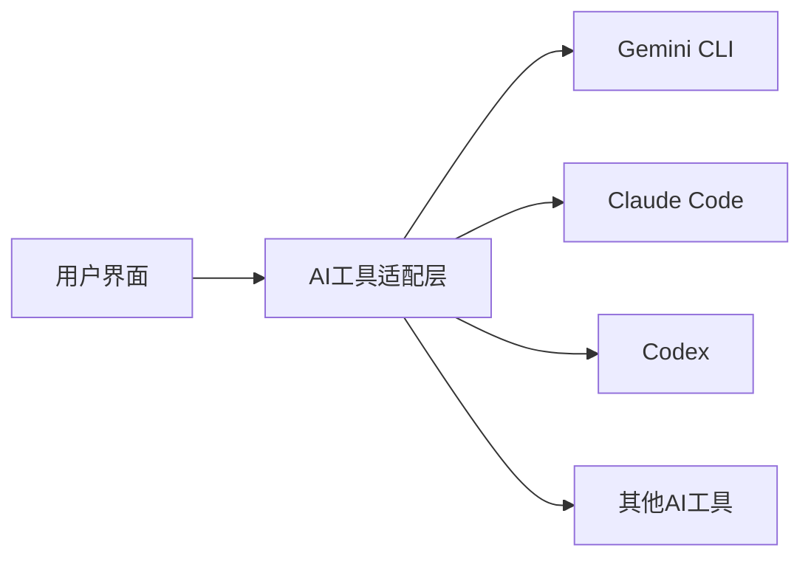
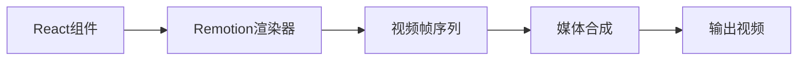

## 今日热点

AI代理与框架占据今日热榜主导，TypeScript成AI开发首选，大模型开源加速，视频处理技术不断创新突破。

---

## 热门项目一览

| 排名 | 项目 | 语言 | 今日 | 总计 | 简介 |
|:---:|------|:----:|------:|-----:|------|
| 1 | [microsoft/Data-Science-For-Beginners](https://github.com/microsoft/Data-Science-For-Beginners) | Jupyter Notebook | +651 | 32,857 | 10 Weeks, 20 Lessons, Data ... |
| 2 | [iOfficeAI/AionUi](https://github.com/iOfficeAI/AionUi) | TypeScript | +554 | 9,229 | Free, local, open-source Co... |
| 3 | [remotion-dev/remotion](https://github.com/remotion-dev/remotion) | TypeScript | +537 | 26,988 | 🎥 Make videos programmatica... |
| 4 | [twitter/the-algorithm](https://github.com/twitter/the-algorithm) | Scala | +473 | 71,761 | Source code for the X Recom... |
| 5 | [xai-org/grok-1](https://github.com/xai-org/grok-1) | Python | +348 | 51,227 | Grok open release |
| 6 | [block/goose](https://github.com/block/goose) | Rust | +347 | 27,151 | an open source, extensible ... |
| 7 | [microsoft/agent-lightning](https://github.com/microsoft/agent-lightning) | Python | +327 | 11,465 | The absolute trainer to lig... |
| 8 | [nexmoe/VidBee](https://github.com/nexmoe/VidBee) | TypeScript | +267 | 4,618 | Download videos from almost... |
| 9 | [virattt/dexter](https://github.com/virattt/dexter) | TypeScript | +248 | 8,400 | An autonomous agent for dee... |
| 10 | [mastra-ai/mastra](https://github.com/mastra-ai/mastra) | TypeScript | +227 | 20,158 | From the team behind Gatsby... |
| 11 | [deepseek-ai/FlashMLA](https://github.com/deepseek-ai/FlashMLA) | C++ | +30 | 12,148 | FlashMLA: Efficient Multi-h... |

---

## 趋势洞察

```
┌─────────────────────────────────────────────────────────────────┐
│  AI/ML 工具         ████████████████████████  7 个项目        │
│  开发框架             ███                       1 个项目        │
│  多媒体应用            ███                       1 个项目        │
│  数据分析             ███                       1 个项目        │
│  其他               ███                       1 个项目        │
└─────────────────────────────────────────────────────────────────┘
```

---

## 项目深度解读

### 1. microsoft/Data-Science-For-Beginners — 数据科学入门课程

> **一句话总结**：微软官方推出的10周系统化数据科学课程，20节课带你从零入门数据科学。

#### 价值主张

| 维度 | 说明 |
|------|------|
| **解决痛点** | 为零基础学习者提供清晰的数据科学学习路径和实用技能 |
| **目标用户** | 数据科学初学者、跨领域转型人士、在校学生 |
| **核心亮点** | 微软官方出品 + 系统化课程设计 + 实践导向 + 多语言支持 |

#### 技术架构


**技术特色**：
- 基于Jupyter Notebook的交互式学习体验
- 融合Python、R等多种主流数据科学工具
- 涵盖从数据获取到模型部署的完整工作流

#### 热度分析

- 项目Star数超3.2万，日均新增600+，表明数据科学学习需求持续高涨
- 作为微软官方教育项目，在数据科学学习领域具有权威性和广泛影响力

#### 快速上手

```bash
# 克隆课程仓库
git clone https://github.com/microsoft/Data-Science-For-Beginners.git

# 启动Jupyter Notebook
cd Data-Science-For-Beginners
jupyter notebook
```

#### 注意事项

- 课程内容为英文，需要一定的英语阅读能力
- 建议提前安装Python和Jupyter环境，或使用在线Jupyter服务
- 部分示例代码可能需要额外的数据集或依赖库


### 2. iOfficeAI/AionUi — AI代码协作界面

> **一句话总结**：本地开源的AI代码助手协作界面，支持多种主流AI编程工具统一接入。

#### 价值主张

| 维度 | 说明 |
|------|------|
| **解决痛点** | 为多个AI代码助手提供统一本地界面，解决工具切换困扰 |
| **目标用户** | 开发者、程序员、AI工具使用者 |
| **核心亮点** | 本地部署 + 开源免费 + 多AI工具支持 + 界面统一 |

#### 技术架构



**技术特色**：
- 基于TypeScript构建，提供类型安全保障
- 模块化设计，支持多种AI工具灵活接入
- 本地化部署，确保代码数据隐私安全

#### 热度分析

- 单日增长554星，显示项目正处于快速上升期，社区认可度高
- 0个开放问题表明维护团队响应及时，项目稳定性良好

#### 快速上手

```bash
# 克隆项目
git clone https://github.com/iOfficeAI/AionUi.git

# 安装依赖并启动
cd AionUi && npm install && npm start
```

#### 注意事项

- 项目许可证信息不明确，使用前需确认授权条款
- 需要配置各AI工具的API密钥或访问权限才能正常使用
- 本地部署可能需要一定的系统资源支持


### 3. remotion-dev/remotion — React视频生成器

> **一句话总结**：使用React组件化方式程序化创建视频，让前端开发者无需专业视频编辑工具即可制作动态内容。

#### 价值主张

| 维度 | 说明 |
|------|------|
| **解决痛点** | 将视频制作转化为React组件开发，降低视频内容创建的技术门槛 |
| **目标用户** | 前端开发者、内容自动化团队、教育视频创作者 |
| **核心亮点** | 声明式视频编程 + TypeScript支持 + 媒体集成能力 + 动画控制 + 跨平台渲染 |

#### 技术架构



**技术特色**：
- 基于React虚拟DOM的视频帧渲染机制
- 提供时间轴控制和关键帧动画API
- 支持Canvas、SVG、WebGL等多种渲染方式
- 内置媒体处理和音频同步功能
- 服务端和客户端双环境运行支持

#### 热度分析

- 项目Star数近2.7万且日增500+，处于快速增长期，表明开发者对其需求强烈
- 高Fork数和零开放Issues反映出项目稳定性高，社区通过其他渠道解决支持问题

#### 快速上手

```bash
# 创建新项目
npx create-video-app my-video-project

# 开发预览
npm start
```

#### 注意事项

- 项目依赖FFmpeg，首次使用需要确保系统正确安装
- 视频渲染为CPU密集型操作，长时间或高分辨率视频可能需要大量计算资源
- 开发时建议使用预览模式，仅在最终阶段渲染完整视频以提高效率


### 4. twitter/the-algorithm — X推荐引擎源码

> **一句话总结**：开源社交平台核心推荐算法实现，基于Scala构建的高性能内容分发系统

#### 价值主张

| 维度 | 说明 |
|------|------|
| **解决痛点** | 解决海量社交内容的高效个性化分发问题，提升用户参与度 |
| **目标用户** | 推荐系统开发者、大数据工程师、社交媒体平台架构师 |
| **核心亮点** | 大规模实时推荐算法实现 + 机器学习驱动的内容个性化 + 高性能分布式架构设计 |

#### 技术架构


**技术特色**：
- 基于Scala构建的高性能实时推荐系统
- 采用机器学习算法进行内容个性化
- 分布式架构处理大规模用户行为数据

#### 热度分析

- 项目Star数超7万且持续增长，表明推荐算法领域高度关注，工业界价值显著
- 作为知名社交平台核心系统开源，成为推荐系统研究与实现的标杆项目

#### 快速上手

```bash
# 克隆项目
git clone https://github.com/twitter/the-algorithm.git

# 使用sbt构建项目
cd the-algorithm && sbt compile
```

#### 注意事项

- 项目代码复杂度高，需要具备Scala和分布式系统基础
- 算法实现依赖大量内部数据特征，实际应用需适配业务场景
- 部分组件可能需要Twitter内部环境支持才能完整运行


### 5. xai-org/grok-1 — 大型语言模型

> **一句话总结**：xAI开源的先进语言模型，提供类ChatGPT的对话与推理能力

#### 价值主张

| 维度 | 说明 |
|------|------|
| **解决痛点** | 打破先进AI模型封闭生态，提供开源替代方案 |
| **目标用户** | AI研究人员、开发者和AI模型爱好者 |
| **核心亮点** | 开源透明 + 高性能对话 + 多领域知识 + 推理能力 |

#### 技术架构


**技术特色**：
- 基于Transformer架构的大规模预训练模型
- 支持长上下文理解和多轮对话
- 整合实时知识与推理能力

#### 热度分析

- 项目迅速获得5万+星，增长率高，显示社区强烈兴趣
- Fork数适中，表明开发者积极参与二次开发与应用探索

#### 快速上手

```bash
# 克隆仓库
git clone https://github.com/xai-org/grok-1.git

# 安装依赖
cd grok-1
pip install -r requirements.txt

# 运行示例
python examples/demo.py
```

#### 注意事项

- 项目许可证信息不明确，使用前需确认授权条款
- 模型运行需要大量计算资源，建议使用高性能GPU
- 作为AI模型，使用时需注意内容安全与伦理规范


### 6. block/goose — AI智能代理

> **一句话总结**：开源可扩展的AI代理，超越代码建议，支持安装、执行、编辑和测试任何LLM。

#### 价值主张

| 维度 | 说明 |
|------|------|
| **解决痛点** | 解决AI工具仅限于代码建议的局限，提供全方位LLM交互能力 |
| **目标用户** | 开发者、研究人员和需要深度LLM交互的技术用户 |
| **核心亮点** | 开源可扩展 + 超越代码建议 + 多种LLM操作支持 |

#### 技术架构


**技术特色**：
- Rust高性能实现确保低资源消耗
- 模块化设计支持多种LLM扩展
- 安全沙箱环境保障执行安全

#### 热度分析

- 项目获得27k+星标且持续增长，今日新增347星，显示高关注度与活跃度
- 0开放问题反映项目维护良好，在AI代理工具生态中占据领先位置

#### 快速上手

```bash
# 克隆仓库
git clone https://github.com/block/goose.git
cd goose

# 构建并运行
cargo build --release
./target/release/goose --help
```

#### 注意事项

- 项目许可证未知，使用前需确认许可条款
- 作为AI代理工具，使用时需注意数据安全和隐私保护


### 7. microsoft/agent-lightning — AI智能体训练框架

> **一句话总结**：微软推出的高效AI智能体训练框架，提供全流程开发支持。

#### 价值主张

| 维度 | 说明 |
|------|------|
| **解决痛点** | 简化AI智能体训练流程，降低开发门槛 |
| **目标用户** | AI研究人员、智能体开发者、企业技术团队 |
| **核心亮点** | 微软官方支持 + 全流程训练支持 + 高效易用 |

#### 技术架构


**技术特色**：
- 微软官方支持的AI智能体训练工具链
- 提供从零开始的完整训练支持
- 简化复杂AI模型训练流程

#### 热度分析

- 项目获得11,465星，近一日增长327，表明社区关注度持续上升
- 作为微软官方项目，在AI智能体开发领域具有较高影响力

#### 快速上手

```bash
# 克隆项目仓库
git clone https://github.com/microsoft/agent-lightning.git
cd agent-lightning

# 安装依赖并运行示例
pip install -r requirements.txt
python examples/quickstart.py
```

#### 注意事项

- 需要具备一定的AI和机器学习基础知识
- 可能需要较高的计算资源进行模型训练
- 建议查阅官方文档以获取最新使用指南


### 8. nexmoe/VidBee — 全能视频下载工具

> **一句话总结**：VidBee 是一款基于 TypeScript 开发的全能型视频下载工具，支持从全球几乎所有网站下载视频内容。

#### 价值主张

| 维度 | 说明 |
|------|------|
| **解决痛点** | 解决用户无法从多平台下载视频内容的问题 |
| **目标用户** | 需要从各种网站下载视频内容的普通用户 |
| **核心亮点** | 支持全球几乎所有网站 + TypeScript开发 + 跨平台支持 |

#### 技术架构


**技术特色**：
- 使用TypeScript开发，类型安全性强
- 支持全球几乎所有网站，适配性广
- 跨平台兼容，可在多种操作系统上运行

#### 热度分析

- 项目Star数达4618且近期增长迅速(+267 today)，表明社区认可度高且热度持续上升
- Issues数量为0，表明项目维护良好且用户反馈渠道可能已转移

#### 快速上手

```bash
# 安装
npm install -g vidbee

# 使用
vidbee <video-url>
```

#### 注意事项

- 请遵守目标网站的使用条款和版权法规，仅下载允许的内容
- 部分网站可能有反爬虫机制，请合理使用工具
- 下载的视频仅用于个人学习或研究目的，不得用于商业用途


### 9. virattt/dexter — 金融研究智能体

> **一句话总结**：基于AI的自主金融研究助手，能深入分析市场数据并提供专业投资见解。

#### 价值主张

| 维度 | 说明 |
|------|------|
| **解决痛点** | 金融研究耗时繁琐，缺乏深度分析和自动化处理能力 |
| **目标用户** | 金融分析师、投资经理、量化交易研究员 |
| **核心亮点** | AI自主研究 + 多源数据整合 + 专业金融分析 |

#### 技术架构


**技术特色**：
- 基于TypeScript构建，类型安全性强
- 集成多种金融数据源API
- 自主学习优化的AI分析模型

#### 热度分析

- 项目获得8400星且单日增长248，显示金融科技领域对AI研究工具的强烈需求
- 零开放问题表明项目维护良好，社区反馈高效解决

#### 快速上手

```bash
# 克隆项目
git clone https://github.com/virattt/dexter.git

# 安装依赖
cd dexter && npm install

# 启动服务
npm start
```

#### 注意事项

- 项目许可证未知，商业使用前需确认授权条款
- 金融数据的准确性和分析结果需要用户自行验证
- 可能需要配置API密钥以访问金融数据源


### 10. mastra-ai/mastra — AI应用开发框架

> **一句话总结**：Mastra是Gatsby团队推出的现代TypeScript框架，专为构建类型安全的AI应用和代理而设计。

#### 价值主张

| 维度 | 说明 |
|------|------|
| **解决痛点** | 简化AI应用开发流程，解决类型安全和复杂集成挑战 |
| **目标用户** | TypeScript开发者、AI应用构建者和智能代理系统开发者 |
| **核心亮点** | 类型安全 + 现代架构 + 模块化设计 + 高可扩展性 |

#### 技术架构


**技术特色**：
- TypeScript强类型系统保障AI应用开发安全
- 模块化架构支持多种AI模型灵活集成
- 基于现代前端工具链提供卓越开发体验

#### 热度分析

- 项目Star数突破2万，单日增长227，显示强劲社区关注度和采用趋势
- 作为Gatsby团队推出的AI开发框架，有望在AI应用生态中占据重要位置

#### 快速上手

```bash
# 安装Mastra CLI
npm install -g @mastra/cli

# 创建新项目
mastra new my-ai-app

# 启动开发服务器
cd my-ai-app && npm run dev
```

#### 注意事项

- 项目许可证信息未明确标注，使用前需确认开源协议
- 作为新兴框架，生态系统和第三方库可能仍在快速发展中
- 需关注与目标AI服务的兼容性和API更新情况


### 11. deepseek-ai/FlashMLA — 高效注意力引擎

> **一句话总结**：FlashMLA 提供优化的多头潜在注意力内核，显著提升大模型推理效率。

#### 价值主张

| 维度 | 说明 |
|------|------|
| **解决痛点** | 大模型多头注意力计算效率低下，内存占用过高 |
| **目标用户** | 大模型开发者、AI 研究人员、高性能计算工程师 |
| **核心亮点** | 高效计算优化 + 显著降低内存占用 + 支持大规模注意力矩阵 |

#### 技术架构


**技术特色**：
- 潜在注意力机制优化，减少计算复杂度
- 高效内存管理，降低显存占用
- 专为大规模注意力矩阵设计

#### 热度分析

- 项目获得12,148个星标且持续增长，表明技术价值获得广泛认可
- 作为大模型优化领域的重要项目，社区活跃度高，影响力显著

#### 快速上手

```bash
# 克隆仓库
git clone https://github.com/deepseek-ai/FlashMLA.git

# 编译项目
cd FlashMLA && mkdir build && cd build
cmake .. && make
```

#### 注意事项

- 项目依赖 CUDA 环境，需要支持 CUDA 的 GPU
- 代码可能需要特定版本的 C++ 编译器
- 由于项目描述简短，建议进一步阅读源码了解具体使用方法


## 今日推荐

| 主题 | 推荐项目 | 亮点 |
|------|----------|------|
| 今日最热 | [microsoft/Data-Science-For-Beginners](https://github.com/microsoft/Data-Science-For-Beginners) | 10 Weeks, 20 Less... |
| 值得关注 | [iOfficeAI/AionUi](https://github.com/iOfficeAI/AionUi) | Free, local, open... |
| 快速上手 | [remotion-dev/remotion](https://github.com/remotion-dev/remotion) | 🎥 Make videos pro... |
| 长期潜力 | [twitter/the-algorithm](https://github.com/twitter/the-algorithm) | Source code for t... |

---

<div align="center">

*Generated on 2026-01-23 | Powered by GitHub Trending Reporter*

</div>