## 今日热点

AI编程助手向终端渗透，大模型推理效率优化成焦点。AI代理自主操作网站能力增强，开发者与AI协作方式正在重塑。

---

## 热门项目一览

| 排名 | 项目 | 语言 | 今日 | 总计 | 简介 |
|:---:|------|:----:|------:|-----:|------|
| 1 | [remotion-dev/remotion](https://github.com/remotion-dev/remotion) | TypeScript | +1,618 | 28,442 | 🎥 Make videos programmatica... |
| 2 | [microsoft/Data-Science-For-Beginners](https://github.com/microsoft/Data-Science-For-Beginners) | Jupyter Notebook | +555 | 33,366 | 10 Weeks, 20 Lessons, Data ... |
| 3 | [lyogavin/airllm](https://github.com/lyogavin/airllm) | Jupyter Notebook | +493 | 8,636 | AirLLM 70B inference with s... |
| 4 | [block/goose](https://github.com/block/goose) | Rust | +491 | 27,600 | an open source, extensible ... |
| 5 | [anthropics/claude-code](https://github.com/anthropics/claude-code) | Shell | +393 | 59,955 | Claude Code is an agentic c... |
| 6 | [microsoft/VibeVoice](https://github.com/microsoft/VibeVoice) | Python | +261 | 21,264 | Open-Source Frontier Voice AI |
| 7 | [browser-use/browser-use](https://github.com/browser-use/browser-use) | Python | +205 | 76,375 | 🌐 Make websites accessible ... |
| 8 | [deepseek-ai/FlashMLA](https://github.com/deepseek-ai/FlashMLA) | C++ | +184 | 12,317 | FlashMLA: Efficient Multi-h... |
| 9 | [OpenBMB/UltraRAG](https://github.com/OpenBMB/UltraRAG) | Python | +130 | 2,949 | UltraRAG v3: A Low-Code MCP... |
| 10 | [github/copilot-cli](https://github.com/github/copilot-cli) | Shell | +125 | 7,234 | GitHub Copilot CLI brings t... |
| 11 | [Asabeneh/30-Days-Of-Python](https://github.com/Asabeneh/30-Days-Of-Python) | Python | +91 | 56,337 | The 30 Days of Python progr... |
| 12 | [KellerJordan/modded-nanogpt](https://github.com/KellerJordan/modded-nanogpt) | Python | +54 | 4,382 | NanoGPT (124M) in 2 minutes |

---

## 趋势洞察

```
┌─────────────────────────────────────────────────────────────────┐
│  AI/ML 工具         ████████████████████████  9 个项目        │
│  开发框架             █████                     2 个项目        │
│  多媒体应用            ██                        1 个项目        │
│  数据分析             ██                        1 个项目        │
└─────────────────────────────────────────────────────────────────┘
```

---

## 项目深度解读

### 1. remotion-dev/remotion — React视频生成引擎

> **一句话总结**：使用React组件化方式程序化生成视频，让开发者用熟悉的UI技术创造动态视觉内容。

#### 价值主张

| 维度 | 说明 |
|------|------|
| **解决痛点** | 将复杂的视频制作流程转化为React组件开发，降低视频创作技术门槛 |
| **目标用户** | 前端开发者、内容创作者、自动化视频生成需求者 |
| **核心亮点** | React组件化开发 + 动态内容生成 + 自动化渲染流程 + 版本控制友好 + 跨平台支持 |

#### 技术架构

```mermaid
graph LR
    A[React组件] --> B[序列化渲染]
    B --> C[帧数据处理]
    C --> D[视频编码]
    D --> E[输出视频文件]
```

**技术特色**：
- 利用React的声明式UI特性构建动态视频内容
- 基于Web技术栈实现跨平台视频生成能力
- 提供精确的帧级别控制和时间轴管理

#### 热度分析

- 项目Star数快速增长，单日增长超1600，表明视频生成领域需求旺盛
- 作为前端生态的创新应用，正在拓展React的应用边界和可能性

#### 快速上手

```bash
# 创建新项目
npx create-video@latest my-video

# 启动开发服务器
npm run dev

# 渲染视频
npm run render
```

#### 注意事项

- 视频渲染可能需要较高的计算资源，建议在性能较好的机器上运行
- 复杂动画和大量特效可能会显著增加渲染时间
- 需要确保使用的React组件和库与Remotion兼容


### 2. microsoft/Data-Science-For-Beginners — 数据科学入门课

> **一句话总结**：微软官方推出的10周20课系统化数据科学入门课程，零基础也能轻松上手。

#### 价值主张

| 维度 | 说明 |
|------|------|
| **解决痛点** | 降低数据科学学习门槛，提供系统化学习路径 |
| **目标用户** | 零基础数据科学初学者、职业转型者 |
| **核心亮点** | 微软官方出品 + 系统化课程设计 + 实践导向 + 免费 |

#### 技术架构

```mermaid
graph LR
    A[基础概念] --> B[数据获取]
    B --> C[数据处理]
    C --> D[数据分析]
    D --> E[数据可视化]
    E --> F[机器学习入门]
```

**技术特色**：
- 基于Jupyter Notebook的交互式学习环境
- 涵盖Python、R等多种数据科学工具
- 结合实际案例进行项目式学习

#### 热度分析

- 项目Star数超3.3万，单日增长500+，显示数据科学学习需求持续高涨
- 作为微软官方教育项目，在开源学习社区具有重要影响力，适合作为系统性学习资源

#### 快速上手

```bash
# 克隆项目到本地
git clone https://github.com/microsoft/Data-Science-For-Beginners.git

# 启动Jupyter Notebook查看课程
cd Data-Science-For-Beginners
jupyter notebook
```

#### 注意事项

- 需要预先安装Python及相关数据科学库
- 建议按照10周课程安排循序渐进学习
- 部分课程可能需要额外数据集或工具支持


### 3. lyogavin/airllm — 大模型压缩

> **一句话总结**：突破显存限制，实现4GB GPU运行70B大模型的高效推理方案。

#### 价值主张

| 维度 | 说明 |
|------|------|
| **解决痛点** | 解决大模型在低显存设备上无法运行的问题 |
| **目标用户** | 研究者、开发者及资源受限的AI应用方 |
| **核心亮点** | 显存优化 + 模型压缩 + 高效推理 |

#### 技术架构

```mermaid
graph LR
    A[大模型输入] --> B[模型分片/量化]
    B --> C[显存优化处理]
    C --> D[GPU推理]
    D --> E[结果整合]
```

**技术特色**：
- 模型权重分片与动态加载技术
- 高效的显存管理与计算优化
- 保持模型性能的同时降低硬件门槛

#### 热度分析

- 项目近期获得大量关注，单日增长近500星，说明技术突破性强
- 社区活跃度高，Fork数也较多，表明开发者积极尝试复现与应用

#### 快速上手

```bash
git clone https://github.com/lyogavin/airllm.git
cd airllm
pip install -r requirements.txt
jupyter notebook
```

#### 注意事项

- 需要确保系统有足够的系统内存，即使显存只有4GB
- 模型推理速度可能比高端GPU慢，需要权衡性能与资源限制
- 可能需要根据具体硬件环境调整某些参数


### 4. block/goose — AI开发代理

> **一句话总结**：开源可扩展的AI开发代理，超越代码建议，支持安装、执行、编辑和测试任何LLM。

#### 价值主张

| 维度 | 说明 |
|------|------|
| **解决痛点** | 解决AI工具仅限于代码建议的局限，提供完整的AI开发代理能力 |
| **目标用户** | AI开发者、LLM集成工程师和自动化测试团队 |
| **核心亮点** | 支持任意LLM集成+完整的开发工作流自动化+高度可扩展架构 |

#### 技术架构

```mermaid
graph LR
    A[用户输入] --> B[LLM接口层]
    B --> C[任务执行引擎]
    C --> D[文件系统操作]
    D --> E[测试验证]
    E --> F[结果反馈]
```

**技术特色**：
- 基于Rust构建，提供高性能与内存安全保证
- 插件化架构设计，支持灵活扩展功能
- 多LLM兼容性，不局限于单一模型提供商

#### 热度分析

- 27.6k高星且持续增长，表明项目获得开发者广泛认可与应用
- 零未解决问题反映项目维护良好，有望成为AI开发工具生态重要组成部分

#### 快速上手

```bash
# 克隆仓库
git clone https://github.com/block/goose.git
# 构建项目
cargo build --release
# 运行示例
./target/release/goose --help
```

#### 注意事项

- 项目许可证未知，商业使用前需确认授权条款
- 作为AI代理工具，使用时需关注数据隐私与安全


### 5. anthropics/claude-code — 终端AI编程助手

> **一句话总结**：Claude Code 是嵌入终端的AI编程助手，通过自然语言理解代码库并自动化完成开发任务。

#### 价值主张

| 维度 | 说明 |
|------|------|
| **解决痛点** | 开发者频繁切换上下文、理解复杂代码和执行重复性编码任务的问题 |
| **目标用户** | 需要在命令行环境中工作的软件开发人员 |
| **核心亮点** | 代码库结构理解 + 自然语言交互 + 自动化执行常规任务 + Git工作流集成 |

#### 技术架构

```mermaid
graph LR
    A[自然语言输入] --> B[代码库分析]
    B --> C[任务理解与规划]
    C --> D[代码生成/修改]
    D --> E[Git操作执行]
    E --> F[终端输出结果]
```

**技术特色**：
- Shell脚本实现终端集成，轻量级部署
- 代码库结构理解与上下文保持机制
- 自然语言到命令行的转换执行系统

#### 热度分析

- 项目获得近6万星，每日新增近400星，表明开发者社区对该工具需求旺盛
- 作为Anthropic官方工具，在AI辅助编程领域具有生态优势，与GitHub Copilot等形成差异化竞争

#### 快速上手

```bash
# 安装Claude Code
npm install -g @anthropic/claude-code

# 初始化项目
claude-code init

# 启动交互式会话
claude-code
```

#### 注意事项

- 需要有效的Anthropic API密钥才能使用
- 可能需要配置项目特定的上下文信息以获得最佳效果
- 在处理大型代码库时可能需要较长的初始化时间


### 6. microsoft/VibeVoice — 前沿语音AI

> **一句话总结**：微软开源的高性能语音AI框架，提供先进语音识别与合成能力。

#### 价值主张

| 维度 | 说明 |
|------|------|
| **解决痛点** | 提供高质量、易集成的语音AI解决方案 |
| **目标用户** | AI开发者、语音应用构建者、研究人员 |
| **核心亮点** | 开源商用级 + 低延迟处理 + 多语言支持 + 微软技术背书 |

#### 技术架构

```mermaid
graph LR
    A[音频输入] --> B[语音预处理]
    B --> C[特征提取]
    C --> D[神经网络模型]
    D --> E[语音输出]
```

**技术特色**：
- 采用端到端神经网络架构，提升语音处理效率
- 支持实时流式处理，降低响应延迟
- 多模态语音理解，增强上下文感知能力

#### 热度分析

- 项目获2万+星标，日增260+，社区关注度持续攀升
- 微软开源生态中的重要语音AI组件，具有高技术影响力

#### 快速上手

```bash
# 克隆仓库
git clone https://github.com/microsoft/VibeVoice.git

# 安装依赖
pip install -r requirements.txt

# 运行示例
python examples/voice_synthesis.py
```

#### 注意事项

- 项目许可证信息不明确，使用前需确认开源协议
- 建议使用GPU加速以获得最佳性能
- 部分高级功能可能需要申请微软AI服务访问权限


### 7. browser-use/browser-use — AI网页交互工具

> **一句话总结**：使AI代理能够自动化操作网页，实现复杂在线任务的智能执行与交互。

#### 价值主张

| 维度 | 说明 |
|------|------|
| **解决痛点** | 解决AI无法直接与网页交互和执行在线操作的难题 |
| **目标用户** | AI开发者、自动化测试工程师、智能代理构建者 |
| **核心亮点** | 网页智能交互+自动化任务执行+多模态理解+代理控制 |

#### 技术架构

```mermaid
graph LR
    A[AI模型输入] --> B[网页理解与分析]
    B --> C[任务规划]
    C --> D[浏览器控制]
    D --> E[结果反馈]
    E --> A
```

**技术特色**：
- 基于大语言模型的网页智能理解与交互
- 无需传统UI元素的直接网页操作能力
- 自适应不同网页结构的代理控制机制

#### 热度分析

- 高星高增长项目，社区活跃度显著，表明AI自动化网页操作需求强劲
- 处于AI与浏览器自动化交叉领域，填补了AI代理直接与网页交互的技术空白

#### 快速上手

```bash
# 安装
pip install browser-use

# 基本使用示例
from browser_use import BrowserAgent
agent = BrowserAgent()
agent.run("搜索最新的AI技术发展")
```

#### 注意事项

- 该项目可能需要配合特定的AI模型使用，确保环境中有相应的模型支持
- 由于涉及浏览器自动化，可能需要处理各种网页的兼容性问题，建议在实际应用中进行充分测试


### 8. deepseek-ai/FlashMLA — 高效注意力库

> **一句话总结**：优化多头注意力计算的 C++ 高性能库，通过潜在注意力核大幅提升 Transformer 推理效率。

#### 价值主张

| 维度 | 说明 |
|------|------|
| **解决痛点** | Transformer 模型注意力计算复杂度高，内存消耗大，长序列处理效率低 |
| **目标用户** | 大型语言模型开发者、高性能计算研究人员、AI 工程师 |
| **核心亮点** | 潜在注意力机制 + 内存优化 + 计算加速 + C++ 高性能实现 |

#### 技术架构

```mermaid
graph LR
    A[输入序列] --> B[分块处理]
    B --> C[潜在注意力计算]
    C --> D[多头注意力合并]
    D --> E[输出结果]
```

**技术特色**：
- 潜在注意力机制减少内存占用
- 优化的 C++ 实现提供计算加速
- 支持长序列高效处理

#### 热度分析

- 项目获得超过 12,000 stars，近期增长迅速，社区关注度持续攀升
- 作为深度学习优化库，在当前大模型热潮中具有重要技术价值，处于 AI 性能优化工具生态的关键位置

#### 快速上手

```bash
# 克隆仓库
git clone https://github.com/deepseek-ai/FlashMLA.git
cd FlashMLA

# 编译项目
mkdir build && cd build
cmake ..
make -j8
```

#### 注意事项

- 项目需要 C++ 编译环境和相关依赖库支持
- 可能需要特定的 CUDA 版本支持 GPU 加速
- 需要了解注意力机制基础才能有效使用


### 9. OpenBMB/UltraRAG — 低代码RAG框架

> **一句话总结**：UltraRAG v3是一个低代码MCP框架，简化复杂RAG管道的构建与部署。

#### 价值主张

| 维度 | 说明 |
|------|------|
| **解决痛点** | 降低复杂RAG应用开发门槛，无需深度编码即可构建高级管道 |
| **目标用户** | AI应用开发者、企业AI解决方案构建者、研究人员 |
| **核心亮点** | 低代码可视化 + 模块化组件 + 高性能处理 + 易于扩展 |

#### 技术架构

```mermaid
graph LR
    A[数据源] --> B[数据处理]
    B --> C[向量存储]
    C --> D[检索引擎]
    D --> E[生成模型]
    E --> F[结果输出]
```

**技术特色**：
- 基于MCP协议的模块化组件设计
- 可视化编排界面支持拖拽式构建
- 内置多种检索与生成策略优化
- 支持多跳推理与知识图谱整合

#### 热度分析

- 项目获近3K星标且快速增长(+130/天)，社区认可度高
- 作为OpenBMB生态项目，受益于开源AI社区的活跃支持与资源

#### 快速上手

```bash
# 克隆项目并安装依赖
git clone https://github.com/OpenBMB/UltraRAG.git
cd UltraRAG && pip install -e .

# 运行示例
python examples/quick_start.py
```

#### 注意事项

- 项目许可证信息不明确，使用前需确认
- 文档对MCP框架的详细说明可能需要进一步完善
- 生产环境使用前建议评估项目稳定性与持续更新情况


### 10. github/copilot-cli — 终端编程助手

> **一句话总结**：将Copilot AI编程助手引入终端，提供代码生成、解释和调试等智能编程辅助功能。

#### 价值主张

| 维度 | 说明 |
|------|------|
| **解决痛点** | 在命令行环境中缺乏智能编程辅助工具，降低开发效率 |
| **目标用户** | 终端重度用户、命令行开发者、DevOps工程师 |
| **核心亮点** | AI代码生成 + 自然语言交互 + 跨语言支持 + 集成开发环境 |

#### 技术架构

```mermaid
graph LR
    A[用户输入] --> B[命令行解析]
    B --> C[请求处理]
    C --> D[GitHub Copilot API]
    D --> E[AI响应]
    E --> F[格式化输出]
```

**技术特色**：
- 基于Shell脚本构建，轻量级且跨平台兼容
- 利用GitHub Copilot的强大AI能力进行代码生成和理解
- 通过自然语言接口降低技术门槛，提高开发者体验
- 支持多种编程语言和开发场景的统一入口

#### 热度分析

- 项目获得7,234个Star且持续增长(+125 today)，表明终端编程辅助工具有强烈市场需求
- 社区活跃度高，无开放问题，反映项目成熟度和维护质量良好

#### 快速上手

```bash
# 安装Copilot CLI
curl -fsSL https://github.com/github/copilot-cli/raw/main/scripts/install.sh | sh

# 登录GitHub账户
copilot auth login

# 使用Copilot询问编程问题
copilot "如何用Python实现快速排序算法？"
```

#### 注意事项

- 需要GitHub账户和有效的Copilot订阅才能使用
- 网络连接是必需的，因为需要与GitHub API交互
- 代码生成质量取决于Copilot模型的能力，可能需要人工审查和优化
- 在处理敏感代码时要谨慎，避免将专有代码发送到外部服务


### 11. Asabeneh/30-Days-Of-Python — Python学习路径

> **一句话总结**：30天系统化Python学习挑战，从基础到实践，循序渐进掌握编程技能。

#### 价值主张

| 维度 | 说明 |
|------|------|
| **解决痛点** | 解决Python初学者学习内容零散、缺乏系统性规划的问题 |
| **目标用户** | 编程初学者、希望系统学习Python基础知识的自学者 |
| **核心亮点** | 30天结构化学习 + 实践项目导向 + 多媒体资源补充 |

#### 技术架构

```mermaid
graph LR
    A[学习计划] --> B[每日主题]
    B --> C[示例代码]
    C --> D[练习题]
    D --> E[项目实践]
```

**技术特色**：
- 结构化内容组织，便于渐进式学习
- 结合视频资源，提供多维度学习体验
- 实践与理论相结合，强化学习效果

#### 热度分析

- 项目获56,337个Star，表明其在Python学习领域有极高认可度和广泛影响力
- 作为开源教育项目，在Python学习生态中具有重要地位，成为初学者首选学习资源

#### 快速上手

```bash
# 克隆项目到本地
git clone https://github.com/Asabeneh/30-Days-Of-Python.git

# 进入项目目录并查看学习计划
cd 30-Days-Of-Python && cat README.md
```

#### 注意事项

- 项目标注为30天挑战，但实际可能需要100天或更长时间完成，需合理规划学习进度
- 学习过程中应主动完成练习题和项目实践，而非仅阅读理论内容


### 12. KellerJordan/modded-nanogpt — 高效NanoGPT实现

> **一句话总结**：优化版的NanoGPT模型实现，显著提升训练和推理速度，2分钟完成124M参数模型训练。

#### 价值主张

| 维度 | 说明 |
|------|------|
| **解决痛点** | 大型语言模型训练耗时过长，资源消耗大，难以快速实验和迭代 |
| **目标用户** | AI研究人员、机器学习工程师、NLP爱好者，需要快速实验GPT模型的人群 |
| **核心亮点** | 训练速度提升10倍 + 124M参数模型 + 2分钟完成训练 + 资源消耗优化 + 易于部署和使用 |

#### 技术架构

```mermaid
graph LR
    A[文本数据] --> B[Tokenization]
    B --> C[Transformer模型]
    C --> D[并行计算优化]
    D --> E[快速训练]
    E --> F[模型输出]
```

**技术特色**：
- 高效的并行计算策略，显著减少训练时间
- 优化的内存管理，降低显存占用
- 简化的模型架构，保持性能的同时提高效率

#### 热度分析

- 项目近期增长迅速，日增54星，表明社区高度关注和认可
- 在小型GPT实现领域具有较强影响力，成为快速实验的参考实现

#### 快速上手

```bash
git clone https://github.com/KellerJordan/modded-nanogpt.git
cd modded-nanogpt
python train.py --data /path/to/data --out_dir /path/to/output
```

#### 注意事项

- 需要一定的计算资源，特别是GPU加速
- 代码可能需要根据具体硬件环境进行调优
- 数据预处理步骤对模型性能有重要影响


### 13. ai-dynamo/dynamo — 分布式推理框架

> **一句话总结**：基于Rust的高性能分布式AI推理服务框架，支持大规模数据中心部署。

#### 价值主张

| 维度 | 说明 |
|------|------|
| **解决痛点** | 解决大规模AI模型在数据中心环境下的高效分布式推理需求 |
| **目标用户** | 需要部署大规模AI推理服务的企业和云服务提供商 |
| **核心亮点** | 高性能 + 分布式架构 + Rust安全 + 低延迟 + 高吞吐量 |

#### 技术架构

```mermaid
graph LR
    A[客户端请求] --> B[负载均衡器]
    B --> C[推理节点]
    C --> D[模型推理]
    D --> E[结果返回]
```

**技术特色**：
- 基于Rust语言编写，提供内存安全和并发性能优势
- 支持模型动态加载和热更新，减少服务中断
- 采用智能调度算法优化资源利用和推理延迟

#### 热度分析

- 项目star数接近6000，近期增长稳定，表明其在分布式推理领域获得持续关注
- 社区活跃度较高，fork数超过800，显示开发者和企业对其技术路线的认可

#### 快速上手

```bash
git clone https://github.com/ai-dynamo/dynamo.git
cd dynamo && cargo build --release
./target/release/dynamo --config config.yaml
```

#### 注意事项

- 许可证信息不明确，使用前需确认开源许可条款
- 项目文档可能不够完善，新用户可能需要一定时间熟悉架构
- 作为分布式系统，部署和维护需要一定的专业知识


## 今日推荐

| 主题 | 推荐项目 | 亮点 |
|------|----------|------|
| 今日最热 | [remotion-dev/remotion](https://github.com/remotion-dev/remotion) | 🎥 Make videos pro... |
| 值得关注 | [microsoft/Data-Science-For-Beginners](https://github.com/microsoft/Data-Science-For-Beginners) | 10 Weeks, 20 Less... |
| 快速上手 | [lyogavin/airllm](https://github.com/lyogavin/airllm) | AirLLM 70B infere... |
| 长期潜力 | [block/goose](https://github.com/block/goose) | an open source, e... |

---

<div align="center">

*Generated on 2026-01-24 | Powered by GitHub Trending Reporter*

</div>