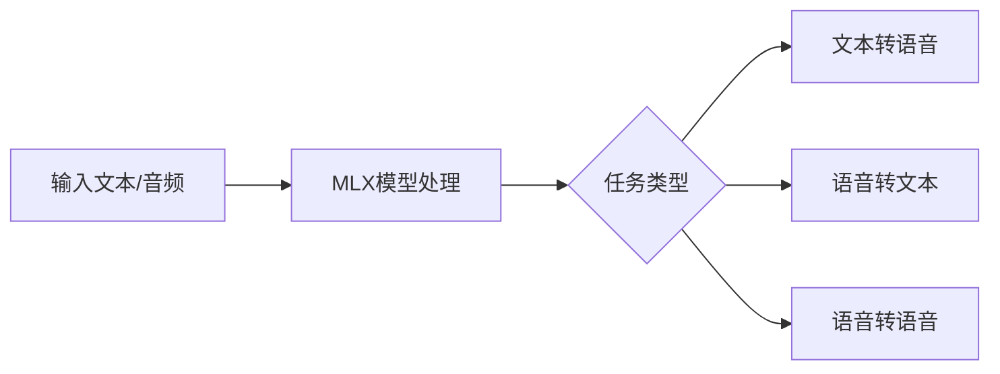

## 今日热点

AI代理与语音技术成为今日焦点，RAG框架持续演进，AI自动化能力在各领域加速落地，技术创新与应用场景深度融合。

---

## 热门项目一览

| 排名 | 项目 | 语言 | 今日 | 总计 | 简介 |
|:---:|------|:----:|------:|-----:|------|
| 1 | [VectifyAI/PageIndex](https://github.com/VectifyAI/PageIndex) | Python | +1,374 | 8,377 | 📑 PageIndex: Document Index... |
| 2 | [remotion-dev/remotion](https://github.com/remotion-dev/remotion) | TypeScript | +1,171 | 29,544 | 🎥 Make videos programmatica... |
| 3 | [OpenBMB/UltraRAG](https://github.com/OpenBMB/UltraRAG) | Python | +585 | 3,460 | UltraRAG v3: A Low-Code MCP... |
| 4 | [microsoft/VibeVoice](https://github.com/microsoft/VibeVoice) | Python | +454 | 21,650 | Open-Source Frontier Voice AI |
| 5 | [block/goose](https://github.com/block/goose) | Rust | +407 | 28,363 | an open source, extensible ... |
| 6 | [browser-use/browser-use](https://github.com/browser-use/browser-use) | Python | +380 | 76,785 | 🌐 Make websites accessible ... |
| 7 | [putyy/res-downloader](https://github.com/putyy/res-downloader) | Go | +211 | 14,368 | 视频号、小程序、抖音、快手、小红书、直播流、m3u8、... |
| 8 | [Blaizzy/mlx-audio](https://github.com/Blaizzy/mlx-audio) | Python | +65 | 3,521 | A text-to-speech (TTS), spe... |
| 9 | [simstudioai/sim](https://github.com/simstudioai/sim) | TypeScript | +65 | 26,154 | Open-source platform to bui... |
| 10 | [AI4Finance-Foundation/FinRobot](https://github.com/AI4Finance-Foundation/FinRobot) | Jupyter Notebook | +34 | 5,226 | FinRobot: An Open-Source AI... |

---

## 趋势洞察

```
┌─────────────────────────────────────────────────────────────────┐
│  AI/ML 工具         ████████████████████████  7 个项目        │
│  开发框架             ██████                    2 个项目        │
│  其他               ███                       1 个项目        │
└─────────────────────────────────────────────────────────────────┘
```

---

## 项目深度解读

### 1. VectifyAI/PageIndex — 无向量文档索引

> **一句话总结**：基于推理而非向量的文档索引系统，为RAG提供高效检索方案。

#### 价值主张

| 维度 | 说明 |
|------|------|
| **解决痛点** | 传统向量数据库计算成本高、语义理解有限的文档检索问题 |
| **目标用户** | 需要构建高效检索系统的AI开发者与研究人员 |
| **核心亮点** | 无向量索引 + 推理检索机制 + 高效文档处理 + 低资源需求 |

#### 技术架构


**技术特色**：
- 非向量的文档索引方法，降低计算复杂度
- 基于推理的检索机制，提高语义理解能力
- 优化的文档处理流程，支持大规模文档集

#### 热度分析

- 项目短时间内获得大量关注，今日新增1374个Star，显示技术方向受社区高度认可
- 高Star/Fork比值表明项目以参考学习为主，技术理念新颖且实用

#### 快速上手

```bash
# 克隆项目
git clone https://github.com/VectifyAI/PageIndex.git
cd PageIndex

# 安装依赖并运行
pip install -r requirements.txt
python main.py --index documents/ --query "查询内容"
```

#### 注意事项

- 项目许可证信息未知，使用前需确认授权条款
- 项目较新，可能存在稳定性问题，建议关注后续更新
- 需要完善的使用文档以充分发挥系统功能


### 2. remotion-dev/remotion — 视频生成框架

> **一句话总结**：使用React组件化方式程序化创建视频，让视频开发如同编写React应用一样简单。

#### 价值主张

| 维度 | 说明 |
|------|------|
| **解决痛点** | 传统视频制作工具复杂难用，无法与代码集成，难以自动化和规模化 |
| **目标用户** | 需要程序化生成视频的开发者、内容创作者和数据可视化团队 |
| **核心亮点** | React组件化开发 + 程序化控制 + 自动化渲染 + 跨平台支持 |

#### 技术架构


**技术特色**：
- 利用React声明式UI构建视频内容，降低视频开发门槛
- 支持Canvas、SVG、Three.js等多种渲染方式，适应不同场景
- 提供时间轴控制和关键帧动画系统，实现复杂视频效果
- 支持音频处理和合成，创建多媒体完整体验
- 基于Web技术栈，跨平台兼容性好，便于部署和扩展

#### 热度分析

- 项目Star数近3万且近期增长迅速，表明视频生成领域需求旺盛，技术栈受开发者认可
- 作为React生态中的创新工具，正在填补前端与视频制作之间的技术鸿沟，生态潜力巨大

#### 快速上手

```bash
# 创建新项目
npx create-video@latest my-video-project

# 安装依赖
cd my-video-project
npm install

# 开发预览
npm run start
```

#### 注意事项

- 需要一定的React开发经验才能充分利用
- 视频渲染可能需要较长时间和较多计算资源
- 对于复杂视频效果，可能需要深入了解Remotion的API和优化技巧


### 3. OpenBMB/UltraRAG — 低代码RAG框架

> **一句话总结**：UltraRAG提供低代码框架，简化复杂RAG管道构建，支持创新应用开发，降低技术门槛。

#### 价值主张

| 维度 | 说明 |
|------|------|
| **解决痛点** | 传统RAG开发复杂度高，构建创新应用门槛大 |
| **目标用户** | AI应用开发者、企业技术团队、研究人员 |
| **核心亮点** | 低代码开发 + 模块化架构 + 高度可扩展 + 易于集成 |

#### 技术架构


**技术特色**：
- 低代码MCP框架，简化RAG开发流程
- 模块化设计，支持灵活组合与创新
- 高度可扩展，适应不同场景需求

#### 热度分析

- 项目Star数增长迅速，单日增加585，显示社区高度关注
- 作为OpenBMB社区项目，处于AI应用开发前沿，生态潜力大

#### 快速上手

```bash
# 安装UltraRAG
pip install ultrarag

# 初始化项目
ultrarag init my-rag-project

# 启动开发服务器
ultrarag dev
```

#### 注意事项

- 项目许可证信息不明确，使用前需确认授权条款
- 作为低代码框架，高级定制可能需要深入理解底层实现
- 项目处于活跃开发阶段，API可能会有变化


### 4. microsoft/VibeVoice — 前沿语音AI平台

> **一句话总结**：开源前沿语音AI技术，提供高精度语音识别与情感分析能力。

#### 价值主张

| 维度 | 说明 |
|------|------|
| **解决痛点** | 传统语音AI在情感识别和复杂环境下的准确率不足 |
| **目标用户** | AI开发者、语音应用构建者、人机交互研究者 |
| **核心亮点** | 多语言支持 + 实时情感识别 + 低资源部署 + 高精度语音合成 |

#### 技术架构


**技术特色**：
- 基于深度学习的端到端语音处理
- 轻量级模型设计，支持边缘设备部署
- 多模态情感分析技术，识别语音中的情感变化

#### 热度分析

- 项目Star数高且增长迅速(+454 today)，表明项目受到广泛关注和认可
- 作为微软开源的语音AI项目，在人机交互领域具有重要生态位置

#### 快速上手

```bash
# 克隆项目仓库
git clone https://github.com/microsoft/VibeVoice.git
cd VibeVoice

# 安装依赖并运行示例
pip install -r requirements.txt
python examples/basic_voice_recognition.py
```

#### 注意事项

- 项目需要较高的计算资源，特别是训练模型时
- 使用前需仔细阅读相关许可协议，确认商业使用限制


### 5. block/goose — 全能AI编程助手

> **一句话总结**：基于Rust构建的开源AI代理，支持与任何LLM集成，实现代码编写、执行、编辑和测试全流程自动化。

#### 价值主张

| 维度 | 说明 |
|------|------|
| **解决痛点** | 传统AI工具仅限于代码建议，无法实现完整开发流程自动化 |
| **目标用户** | 软件开发者、DevOps工程师、AI辅助编程技术团队 |
| **核心亮点** | 支持任意LLM集成 + 全流程自动化 + 开源可扩展 + Rust高性能实现 |

#### 技术架构


**技术特色**：
- 基于Rust构建的高性能AI代理框架
- 支持与多种LLM提供商的无缝集成
- 提供完整的开发工作流自动化能力

#### 热度分析

- 项目获得超过28k星，单日增长400+，表明AI开发工具领域热度持续上升
- 零开放问题反映项目成熟度高，社区维护良好，处于AI辅助编程工具生态前沿位置

#### 快速上手

```bash
# 安装Goose
cargo install goose

# 配置LLM连接
goose config --llm openai --api-key YOUR_API_KEY

# 使用Goose辅助开发
goose help
```

#### 注意事项

- 项目许可信息不明确，使用前需确认开源许可类型
- 作为AI代理，需注意数据隐私和安全问题，避免处理敏感信息


### 6. browser-use/browser-use — AI网页自动化工具

> **一句话总结**：让AI代理能够理解、操作网页，实现复杂网络任务自动化。

#### 价值主张

| 维度 | 说明 |
|------|------|
| **解决痛点** | AI难以直接与网页交互，无法自动化处理网络任务 |
| **目标用户** | AI开发者、自动化测试人员、网络爬虫开发者 |
| **核心亮点** | 网页元素智能识别 + 多步骤任务执行 + 错误处理与恢复 + 会话状态保持 |

#### 技术架构


**技术特色**：
- 基于大语言模型的网页理解能力
- 智能网页元素定位与操作
- 完善的错误处理与重试机制

#### 热度分析

- 项目获得7.6万星，日增380星，呈快速增长态势，表明社区高度认可
- 作为AI网页交互领域的重要工具，处于AI自动化生态的关键位置

#### 快速上手

```bash
# 安装browser-use
pip install browser-use

# 基本使用示例
from browser_use import BrowserAgent

agent = BrowserAgent()
agent.run("搜索最新的AI技术新闻并总结前三条")
```

#### 注意事项

- 由于Open Issues为0，可能项目尚处于早期阶段，API可能不稳定
- 需要配合大语言模型使用，可能有API调用成本
- 网页结构变化可能导致操作失败，需要良好的错误处理机制


### 7. putyy/res-downloader — 多平台资源下载器

> **一句话总结**：一款支持多平台视频、音频及直播流的Go语言资源下载工具。

#### 价值主张

| 维度 | 说明 |
|------|------|
| **解决痛点** | 解决用户从多个主流平台下载视频、音频等资源的难题 |
| **目标用户** | 需要从各平台下载视频、音频内容的普通用户和开发者 |
| **核心亮点** | 支持多平台下载 + 支持m3u8流媒体 + 纯Go语言实现 + 命令行操作简单 |

#### 技术架构


**技术特色**：
- 支持多平台URL解析和资源提取
- 支持m3u8流媒体下载和合并
- 纯Go语言实现，无需额外依赖

#### 热度分析

- 项目Star数超14k，日均增长200+，热度持续攀升
- 零Open Issues表明项目维护良好，用户反馈问题少

#### 快速上手

```bash
# 克隆项目
git clone https://github.com/putyy/res-downloader.git
cd res-downloader
# 运行下载示例
go run main.go -url "https://v.douyin.com/xxxxx"
```

#### 注意事项

- 仅用于学习和研究目的，请遵守相关平台的使用条款
- 某些平台的下载可能受到限制或需要处理反爬机制
- 不同平台的资源格式不同，下载效果可能有所差异


### 8. Blaizzy/mlx-audio — Apple语音处理

> **一句话总结**：基于MLX框架的高效语音处理库，支持TTS/STT/STS，专为Apple Silicon优化。

#### 价值主张

| 维度 | 说明 |
|------|------|
| **解决痛点** | 提供Apple Silicon上的高效语音处理解决方案，弥补非x86平台语音工具生态不足 |
| **目标用户** | Apple开发者、语音处理研究人员、需要本地化语音应用的开发者 |
| **核心亮点** | 跨平台支持+本地化处理+高质量输出 |

#### 技术架构



**技术特色**：
- 利用Apple MLX框架实现高效计算
- 支持多种语音处理任务于一身
- 专为Apple Silicon硬件优化，性能卓越

#### 热度分析

- 项目获得3500+星标，65个今日新增，显示快速增长态势
- 作为Apple生态语音工具填补空白，社区关注度持续上升

#### 快速上手

```bash
# 安装依赖
pip install mlx-audio

# 基本使用示例
from mlx_audio import TTS, STT

# 文本转语音
tts = TTS()
tts.save("output.wav", "这是一段示例文本。")

# 语音转文本
stt = STT()
text = stt.transcribe("input.wav")
print(text)
```

#### 注意事项

- 项目依赖Apple MLX框架，仅支持Apple Silicon设备
- 许可证信息不明确，商业使用前需确认授权条款
- 作为较新项目，API可能存在变更


### 9. simstudioai/sim — AI代理工作流平台

> **一句话总结**：开源平台用于构建和部署AI代理工作流，简化复杂AI系统的创建过程。

#### 价值主张

| 维度 | 说明 |
|------|------|
| **解决痛点** | 简化AI代理工作流的构建、集成和部署，降低技术门槛 |
| **目标用户** | AI开发者、数据科学家、自动化工程师和企业AI解决方案构建者 |
| **核心亮点** | 可视化工作流设计 + 低代码/无代码接口 + 模块化AI组件集成 + 端到端部署能力 |

#### 技术架构


**技术特色**：
- 基于TypeScript的全栈架构设计
- 模块化AI代理组件支持
- 容器化部署与微服务架构

#### 热度分析

- 超过26k星且持续增长，表明项目获得社区广泛认可
- 零开放问题显示项目维护成熟，可能已进入稳定阶段

#### 快速上手

```bash
git clone https://github.com/simstudioai/sim.git
cd sim
npm install
npm run dev
```

#### 注意事项

- 需要Node.js环境运行
- 可能需要配置API密钥以连接AI服务
- 需要了解基本的工作流概念以充分利用平台功能


### 10. AI4Finance-Foundation/FinRobot — AI金融分析平台

> **一句话总结**：基于大语言模型的开放源代码AI金融分析智能体平台，赋能专业金融分析。

#### 价值主张

| 维度 | 说明 |
|------|------|
| **解决痛点** | 金融分析复杂度高，传统工具难以处理非结构化金融数据 |
| **目标用户** | 金融分析师、量化交易员、投资机构研究人员 |
| **核心亮点** | LLM驱动 + 多模态金融数据处理 + 开放API + 可扩展架构 |

#### 技术架构


**技术特色**：
- 基于大语言模型的智能分析能力
- 支持多种金融数据源接入
- 模块化设计便于扩展和定制

#### 热度分析

- 项目获得5226星，日增34星，处于快速增长阶段，表明市场对AI+金融解决方案高度关注
- 零开放问题，社区维护良好，项目成熟度高，在AI金融领域具有明显影响力

#### 快速上手

```bash
# 克隆项目仓库
git clone https://github.com/AI4Finance-Foundation/FinRobot.git
# 安装依赖
cd FinRobot
pip install -r requirements.txt
# 启动Jupyter Notebook
jupyter notebook
```

#### 注意事项

- 项目依赖大语言模型，需要配置相应的API密钥或本地模型
- 使用前需要具备一定的金融领域知识和Python编程基础
- 不同版本的LLM可能影响分析结果的准确性


## 今日推荐

| 主题 | 推荐项目 | 亮点 |
|------|----------|------|
| 今日最热 | [VectifyAI/PageIndex](https://github.com/VectifyAI/PageIndex) | 📑 PageIndex: Docu... |
| 值得关注 | [remotion-dev/remotion](https://github.com/remotion-dev/remotion) | 🎥 Make videos pro... |
| 快速上手 | [OpenBMB/UltraRAG](https://github.com/OpenBMB/UltraRAG) | UltraRAG v3: A Lo... |
| 长期潜力 | [microsoft/VibeVoice](https://github.com/microsoft/VibeVoice) | Open-Source Front... |

---

<div align="center">

*Generated on 2026-01-25 | Powered by GitHub Trending Reporter*

</div>