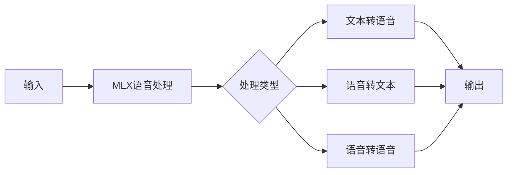
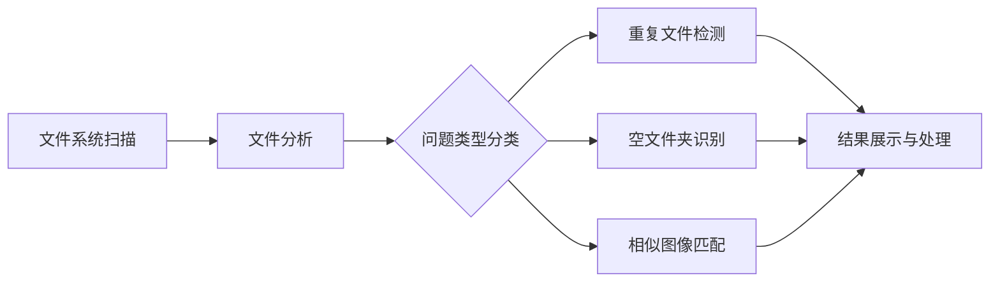

## 今日热点

今日GitHub热榜项目精彩纷呈。

---

## 热门项目一览

| 排名 | 项目 | 语言 | 今日 | 总计 | 简介 |
|:---:|------|:----:|------:|-----:|------|
| 1 | [remotion-dev/remotion](https://github.com/remotion-dev/remotion) | TypeScript | +1,118 | 30,203 | 🎥 Make videos programmatica... |
| 2 | [VectifyAI/PageIndex](https://github.com/VectifyAI/PageIndex) | Python | +1,007 | 8,835 | 📑 PageIndex: Document Index... |
| 3 | [OpenBMB/UltraRAG](https://github.com/OpenBMB/UltraRAG) | Python | +437 | 3,771 | UltraRAG v3: A Low-Code MCP... |
| 4 | [microsoft/VibeVoice](https://github.com/microsoft/VibeVoice) | Python | +362 | 21,858 | Open-Source Frontier Voice AI |
| 5 | [Blaizzy/mlx-audio](https://github.com/Blaizzy/mlx-audio) | Python | +263 | 3,811 | A text-to-speech (TTS), spe... |
| 6 | [openai/codex](https://github.com/openai/codex) | Rust | +193 | 57,295 | Lightweight coding agent th... |
| 7 | [supermemoryai/supermemory](https://github.com/supermemoryai/supermemory) | TypeScript | +159 | 14,536 | Memory engine and app that ... |
| 8 | [qarmin/czkawka](https://github.com/qarmin/czkawka) | Rust | +60 | 28,389 | Multi functional app to fin... |

---

## 趋势洞察

```
┌─────────────────────────────────────────────────────────────────┐
│  AI/ML 工具         ████████████████████████  5 个项目        │
│  开发框架             █████████                 2 个项目        │
│  多媒体应用            ████                      1 个项目        │
└─────────────────────────────────────────────────────────────────┘
```

---

## 项目深度解读

### 1. remotion-dev/remotion — 视频编程制作框架

> **一句话总结**：基于React的视频制作解决方案，允许开发者使用组件化方式创建动态视频内容。

#### 价值主张

| 维度 | 说明 |
|------|------|
| **解决痛点** | 传统视频制作工具复杂难自动化，提供基于React的编程式视频制作流程 |
| **目标用户** | 前端开发者、内容创作者、需要自动化视频生成的团队 |
| **核心亮点** | React生态兼容 + 组件化视频制作 + TypeScript支持 + 开源免费 + 跨平台支持 |

#### 技术架构


**技术特色**：
- 基于React组件模型，复用前端开发技能和生态
- 提供Canvas和WebGL渲染引擎，支持复杂视觉效果
- 内置时间轴管理和帧精确控制，确保视频质量

#### 热度分析

- 项目获30k+ stars且近期增长迅速，表明在视频生成领域受到广泛关注
- 作为AIGC时代的创新工具，在自动化内容生成领域具有重要生态价值

#### 快速上手

```bash
# 创建新项目
npx create-video@latest my-video

# 启动开发服务器
npm run dev

# 渲染视频
npm run render
```

#### 注意事项

- 需要React开发基础，理解组件生命周期和状态管理
- 视频渲染过程计算密集，建议在性能较好的环境中进行
- 对于复杂视频效果，可能需要深入了解Remotion的API和渲染原理


### 2. VectifyAI/PageIndex — 推理式文档索引

> **一句话总结**：PageIndex是一种无需向量嵌入、基于推理能力的文档索引系统，专为RAG应用优化。

#### 价值主张

| 维度 | 说明 |
|------|------|
| **解决痛点** | 传统向量检索的语义局限性及高计算资源消耗 |
| **目标用户** | 需要高效文档检索的AI应用开发者和研究人员 |
| **核心亮点** | 无需向量嵌入 + 基于推理能力 + 轻量化计算 + 高准确性 |

#### 技术架构


**技术特色**：
- 采用推理机制替代传统向量嵌入
- 显著降低计算资源需求
- 保持高检索准确性和语义理解

#### 热度分析

- 项目近期获得大量关注，单日增长超1000星，表明技术方向受社区热捧
- 无开放问题反映项目成熟度高，已形成稳定的技术解决方案

#### 快速上手

```bash
# 克隆项目
git clone https://github.com/VectifyAI/PageIndex.git

# 安装依赖
pip install -r requirements.txt
```

#### 注意事项

- 项目未明确许可证，使用前需确认授权条款
- 可能需要针对特定文档类型进行定制化配置


### 3. OpenBMB/UltraRAG — 低代码RAG框架

> **一句话总结**：UltraRAG是一个低代码MCP框架，简化复杂RAG管道构建，支持创新检索增强生成应用。

#### 价值主张

| 维度 | 说明 |
|------|------|
| **解决痛点** | RAG系统构建复杂度高、技术门槛大，难以快速实现创新应用 |
| **目标用户** | AI应用开发者、研究人员、企业技术团队 |
| **核心亮点** | 低代码可视化 + 模块化组件 + 高度可定制 + 支持复杂管道 |

#### 技术架构


**技术特色**：
- 基于MCP协议的低代码框架设计
- 模块化组件架构，支持灵活组合与扩展
- 可视化配置界面，降低开发门槛
- 支持复杂RAG管道的构建与优化
- 内置多种预置组件和最佳实践模板

#### 热度分析

- 项目Star数3771且单日增长437，显示社区高度关注和快速采纳
- 作为OpenBMB项目，处于AI应用开发前沿生态位置，影响力持续提升

#### 快速上手

```bash
# 克隆仓库
git clone https://github.com/OpenBMB/UltraRAG.git
cd UltraRAG

# 安装依赖
pip install -r requirements.txt

# 启动低代码界面
python ultra_rag_app.py
```

#### 注意事项

- 需要一定的RAG和LLM基础知识才能充分利用框架功能
- 可能需要API密钥或特定环境配置才能使用某些服务
- 作为较新项目，文档和示例可能不够完善，需要一定探索时间
- 许可证信息不明确，使用前需确认开源条款和商业适用性


### 4. microsoft/VibeVoice — [语音情感AI]

> **一句话总结**：微软开源的先进语音情感识别与合成系统，实现情感驱动的语音交互体验。

#### 价值主张

| 维度 | 说明 |
|------|------|
| **解决痛点** | 传统语音交互缺乏情感理解与表达，用户体验机械 |
| **目标用户** | AI语音开发者、情感计算研究者、智能产品设计师 |
| **核心亮点** | 高精度情感识别 + 多样化情感合成 + 跨语言支持 |

#### 技术架构


**技术特色**：
- 端到端深度学习模型实现情感识别与合成
- 多模态情感分析融合语音、语调和上下文信息
- 轻量化模型设计支持边缘设备部署

#### 热度分析

- 项目呈现高速增长趋势，单日新增stars超360，表明技术前沿性强
- 微软生态加持，吸引大量AI开发者和企业关注，形成活跃社区

#### 快速上手

```bash
# 克隆项目
git clone https://github.com/microsoft/VibeVoice.git
cd VibeVoice

# 安装依赖并运行示例
pip install -r requirements.txt
python demo.py --input sample.wav --output output.wav
```

#### 注意事项

- 项目依赖最新版PyTorch，需确保CUDA兼容性
- 情感标签体系可能需要根据具体应用场景调整
- 商业应用需注意微软开源协议的具体条款


### 5. Blaizzy/mlx-audio — 苹果语音处理框架

> **一句话总结**：基于Apple MLX框架的高效语音处理库，支持文本、语音双向转换与处理。

#### 价值主张

| 维度 | 说明 |
|------|------|
| **解决痛点** | 为Apple Silicon设备提供原生优化的语音处理解决方案 |
| **目标用户** | Apple开发者、AI语音应用研究者、跨平台语音处理需求者 |
| **核心亮点** | 基于MLX框架 + 多模态语音处理 + Apple Silicon优化 + 零未解决问题 |

#### 技术架构



**技术特色**：
- 利用Apple MLX框架实现硬件加速
- 统一接口支持多种语音处理模式
- 针对Apple Silicon架构深度优化
- 提供端到端语音处理能力
- Python接口简化集成流程

#### 热度分析
- 单日增长263 stars，社区认可度快速提升，语音AI领域热度高
- 零未解决问题显示项目维护活跃，生态位置处于Apple AI工具链前沿

#### 快速上手

```bash
# 安装mlx-audio
pip install mlx-audio

# 基本使用示例
import mlx_audio
# 文本转语音
mlx_audio.tts("Hello, Apple Silicon!")
# 语音转文本
text = mlx_audio.stt("audio.wav")
```

#### 注意事项
- 仅支持Apple Silicon设备，无法在Intel Mac或其他平台运行
- 依赖Apple MLX框架，需确保系统环境兼容
- 项目文档可能不够完善，需要参考源代码了解API细节
- 许可证信息不明确，使用前需确认授权条款


### 6. openai/codex — 终端编程助手

> **一句话总结**：这是一个在终端中运行的轻量级AI编码助手，能够帮助开发者快速生成和优化代码。

#### 价值主张

| 维度 | 说明 |
|------|------|
| **解决痛点** | 简化终端环境下的代码编写和调试，提高开发效率 |
| **目标用户** | 命令行开发者、系统管理员和终端爱好者 |
| **核心亮点** | 轻量级设计 + 终端集成 + AI辅助编码 + 跨平台支持 + 开源免费 |

#### 技术架构


**技术特色**：
- 使用Rust语言编写，提供高性能和内存安全保证
- 轻量级设计，资源占用少，适合在终端环境运行
- 集成AI编码能力，能够理解上下文并提供智能代码建议

#### 热度分析

- 项目拥有57k+ stars且持续增长，表明开发者社区对其高度认可
- 零Open Issues可能意味着项目成熟度高或问题管理机制完善，社区活跃度稳定

#### 快速上手

```bash
# 安装codex
cargo install codex

# 启动codex辅助
codex --help

# 在项目中使用codex
codex generate "实现一个快速排序算法"
```

#### 注意事项

- 需要确保系统已安装Rust环境
- 可能需要配置API密钥以使用OpenAI的编码服务
- 项目仍在开发中，可能会有API变更


### 7. supermemoryai/supermemory — AI记忆引擎

> **一句话总结**：为AI应用提供极速、可扩展的记忆存储与检索解决方案。

#### 价值主张

| 维度 | 说明 |
|------|------|
| **解决痛点** | 解决AI应用记忆存储效率低、检索速度慢、扩展性差的核心问题 |
| **目标用户** | AI应用开发者、智能系统构建者、需要记忆功能的技术团队 |
| **核心亮点** | 极速记忆检索 + 高度可扩展架构 + TypeScript全栈开发 + AI时代API设计 |

#### 技术架构


**技术特色**：
- 基于TypeScript实现，保证类型安全与开发效率
- 优化的数据结构与算法，实现毫秒级记忆检索
- 分布式架构设计，支持大规模记忆数据的横向扩展

#### 热度分析

- 14k+星标且持续增长(+159今日)，表明社区对该技术高度认可
- 零未解决问题显示项目维护良好，代码质量与稳定性受信任

#### 快速上手

```bash
# 克隆项目
git clone https://github.com/supermemoryai/supermemory.git

# 安装依赖
cd supermemory && npm install

# 启动开发服务器
npm run dev
```

#### 注意事项

- 项目许可证信息不明确，使用前需确认开源协议
- 作为AI时代记忆解决方案，可能需要一定的AI相关知识才能充分利用


### 8. qarmin/czkawka — 全能文件清理工具

> **一句话总结**：Rust开发的多功能工具，可快速识别并清理重复文件、空文件夹和相似图像，提升磁盘空间管理效率。

#### 价值主张

| 维度 | 说明 |
|------|------|
| **解决痛点** | 自动检测系统中的冗余文件，释放存储空间，提高文件管理效率 |
| **目标用户** | 需要管理大量文件、释放存储空间的普通用户和系统管理员 |
| **核心亮点** | 重复文件检测 + 空文件夹清理 + 相似图像识别 + 跨平台支持 + 高性能Rust实现 |

#### 技术架构



**技术特色**：
- 基于Rust开发，提供高性能文件处理能力
- 多种文件比较算法（哈希值、内容相似度等）
- 同时支持图形界面和命令行两种使用方式

#### 热度分析

- 项目Star数超28,000且持续增长，每日新增约60个Star，显示出强劲的用户增长趋势
- 无Open Issues表明项目维护良好，用户反馈得到及时处理，社区活跃度高

#### 快速上手

```bash
# 安装
cargo install czkawka_cli

# 查找重复文件
czkawka_cli duplicates -d /path/to/folder

# 查找空文件夹
czkawka_cli empty_folders -d /path/to/folder
```

#### 注意事项

- 对于大型文件系统，扫描可能需要较长时间和较多内存
- 图形界面版本需要额外安装，与命令行版本是分离的
- 删除文件前建议先预览结果，避免误删重要文件


## 今日推荐

| 主题 | 推荐项目 | 亮点 |
|------|----------|------|
| 今日最热 | [remotion-dev/remotion](https://github.com/remotion-dev/remotion) | 🎥 Make videos pro... |
| 值得关注 | [VectifyAI/PageIndex](https://github.com/VectifyAI/PageIndex) | 📑 PageIndex: Docu... |
| 快速上手 | [OpenBMB/UltraRAG](https://github.com/OpenBMB/UltraRAG) | UltraRAG v3: A Lo... |
| 长期潜力 | [microsoft/VibeVoice](https://github.com/microsoft/VibeVoice) | Open-Source Front... |

---

<div align="center">

*Generated on 2026-01-25 | Powered by GitHub Trending Reporter*

</div>