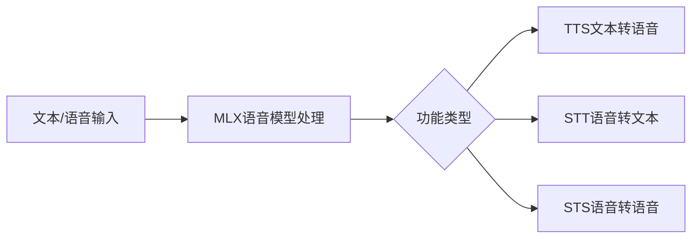

## 今日热点

AI语音处理与视频生成技术持续火热，RAG框架创新与内存引擎升级成为开发者关注焦点，多模态AI应用与开发工具链生态加速构建。

---

## 热门项目一览

| 排名 | 项目 | 语言 | 今日 | 总计 | 简介 |
|:---:|------|:----:|------:|-----:|------|
| 1 | [remotion-dev/remotion](https://github.com/remotion-dev/remotion) | TypeScript | +1,114 | 30,629 | 🎥 Make videos programmatica... |
| 2 | [VectifyAI/PageIndex](https://github.com/VectifyAI/PageIndex) | Python | +1,004 | 9,054 | 📑 PageIndex: Document Index... |
| 3 | [OpenBMB/UltraRAG](https://github.com/OpenBMB/UltraRAG) | Python | +437 | 4,046 | UltraRAG v3: A Low-Code MCP... |
| 4 | [microsoft/VibeVoice](https://github.com/microsoft/VibeVoice) | Python | +362 | 22,034 | Open-Source Frontier Voice AI |
| 5 | [Blaizzy/mlx-audio](https://github.com/Blaizzy/mlx-audio) | Python | +272 | 4,247 | A text-to-speech (TTS), spe... |
| 6 | [openai/codex](https://github.com/openai/codex) | Rust | +170 | 57,434 | Lightweight coding agent th... |
| 7 | [supermemoryai/supermemory](https://github.com/supermemoryai/supermemory) | TypeScript | +157 | 14,694 | Memory engine and app that ... |
| 8 | [qarmin/czkawka](https://github.com/qarmin/czkawka) | Rust | +65 | 28,563 | Multi functional app to fin... |
| 9 | [Psiphon-Inc/conduit](https://github.com/Psiphon-Inc/conduit) | TypeScript | +17 | 86 | Conduit React Native app |

---

## 趋势洞察

```
┌─────────────────────────────────────────────────────────────────┐
│  AI/ML 工具         ████████████████████████  5 个项目        │
│  开发框架             ██████████████            3 个项目        │
│  多媒体应用            ████                      1 个项目        │
└─────────────────────────────────────────────────────────────────┘
```

---

## 项目深度解读

### 1. remotion-dev/remotion — 视频制作React引擎

> **一句话总结**：使用React组件程序化创建视频的开源框架，让前端开发者用熟悉的技能制作动态视频内容。

#### 价值主张

| 维度 | 说明 |
|------|------|
| **解决痛点** | 传统视频制作需专业软件，Remotion让开发者用React技能即可创建动态视频 |
| **目标用户** | 前端开发者、内容创作者、需要自动化生成视频的企业开发团队 |
| **核心亮点** | React组件化视频制作 + 动态内容渲染 + 高质量视频导出 + 丰富动画效果 + TypeScript类型支持 |

#### 技术架构


**技术特色**：
- 基于React组件树作为视频场景描述，降低视频制作门槛
- 利用Web技术栈实现跨平台视频生成，无需专业视频编辑软件
- 支持动态数据和变量注入，实现个性化视频批量生成
- 提供基于时间轴的动画系统，实现复杂视觉效果
- 内置音频处理功能，支持音效和背景音乐同步

#### 热度分析

- 项目Star数超3万且每日新增超1千，处于快速增长期，表明开发者对其高度认可
- 作为前端生态中的创新工具，填补了使用Web技术制作视频的空白，具有独特生态价值

#### 快速上手

```bash
# 创建Remotion项目
npx create-video-app my-video-app
cd my-video-app

# 开发并预览
npm run start

# 导出视频
npm run build
```

#### 注意事项

- 视频渲染是计算密集型任务，确保开发环境有足够性能
- 复杂场景需要优化渲染性能，避免导出时间过长
- 音频和视频同步需要精确的时间控制，建议仔细处理时间轴


### 2. VectifyAI/PageIndex — [文档智能索引]

> **一句话总结**：无需向量数据库的基于推理的文档索引系统，实现高效精准的RAG检索增强生成。

#### 价值主张

| 维度 | 说明 |
|------|------|
| **解决痛点** | 传统RAG依赖向量数据库，构建成本高、检索效率低、语义理解有限 |
| **目标用户** | 需要高效文档检索增强生成的研究人员和企业开发者 |
| **核心亮点** | 无需向量数据库 + 基于推理的检索 + 高效文档索引 + 准确语义理解 + 降低部署成本 |

#### 技术架构


**技术特色**：
- 创新性的无向量检索架构，摆脱传统向量数据库依赖
- 基于推理的文档分析方法，提升语义理解深度
- 高效的分页索引技术，优化大文档处理能力

#### 热度分析

- 项目Star数快速增长，单日增长超1000，表明技术方向获得社区高度认可
- 零开放Issues反映项目成熟度高，维护状态良好，技术实现稳定可靠

#### 快速上手

```bash
# 克隆项目
git clone https://github.com/VectifyAI/PageIndex.git

# 安装依赖
cd PageIndex
pip install -r requirements.txt

# 基本使用示例
python page_index.py --document path/to/document.pdf --query "检索问题"
```

#### 注意事项

- 项目尚未明确开源协议，使用前需确认授权条款
- 可能需要特定的硬件配置以支持推理功能，建议查看项目文档了解系统要求
- 对于非结构化文档的处理效果可能需要根据实际场景评估


### 3. OpenBMB/UltraRAG — 低代码 RAG 框架

> **一句话总结**：UltraRAG 是一个低代码框架，简化复杂 RAG 管道的构建，提供模块化组件与灵活配置能力。

#### 价值主张

| 维度 | 说明 |
|------|------|
| **解决痛点** | 传统 RAG 系统构建复杂、组件集成困难、定制化成本高 |
| **目标用户** | NLP 研究人员、AI 工程师、企业应用开发者 |
| **核心亮点** | 低代码开发 + 模块化组件 + 可扩展架构 + 即插即用接口 |

#### 技术架构


**技术特色**：
- 基于组件的模块化设计，便于灵活组合
- 提供低代码接口，降低开发门槛
- 支持多种模型和嵌入方式，适应不同场景需求

#### 热度分析

- 项目获得 4,046 星，单日增长 437 星，显示社区高度关注
- Fork 数量适中，表明用户更倾向于直接使用而非深度定制

#### 快速上手

```bash
# 安装 UltraRAG
pip install ultrarag

# 初始化项目
ultrarag init my-rag-project

# 启动开发服务器
ultrarag serve --port 8000
```

#### 注意事项

- 需要熟悉 RAG 基本概念才能充分利用框架优势
- 某些高级功能可能需要额外的 API 密钥或服务订阅
- 项目文档可能需要进一步完善以支持更广泛的用户群体


### 4. microsoft/VibeVoice — 前沿语音AI

> **一句话总结**：微软开源的高性能语音AI模型，提供自然流畅的语音合成与识别能力。

#### 价值主张

| 维度 | 说明 |
|------|------|
| **解决痛点** | 突破传统语音合成机械感问题，提供情感丰富的自然语音交互 |
| **目标用户** | AI开发者、智能助手构建者、语音应用开发者 |
| **核心亮点** | 情感语音合成 + 低资源部署 + 多语言支持 + 实时处理能力 |

#### 技术架构


**技术特色**：
- 基于Transformer架构的情感语音编码技术
- 端到端训练减少语音失真
- 轻量化设计适配边缘设备部署

#### 热度分析

- 项目Star数破2.2万且持续高速增长，日均增长362，社区关注度极高
- 微软开源战略重点项目，在AI语音领域具有标杆引领作用

#### 快速上手

```bash
# 克隆项目
git clone https://github.com/microsoft/VibeVoice.git
cd VibeVoice

# 安装依赖并运行演示
pip install -r requirements.txt
python demo.py --input "Hello, this is VibeVoice demo"
```

#### 注意事项

- 模型资源占用较大，推荐使用GPU环境运行
- 需遵守开源协议的具体条款，特别是商业使用限制
- 语音合成效果受训练数据覆盖范围影响，某些小语种可能表现不佳


### 5. Blaizzy/mlx-audio — 苹果语音处理库

> **一句话总结**：基于Apple MLX框架的高效语音处理库，支持TTS、STT和STS功能。

#### 价值主张

| 维度 | 说明 |
|------|------|
| **解决痛点** | 为Apple Silicon提供高效本地化语音处理能力 |
| **目标用户** | Apple设备开发者、语音处理研究人员 |
| **核心亮点** | 基于MLX框架 + 本地高效运行 + 多语音功能支持 |

#### 技术架构



**技术特色**：
- 基于Apple MLX框架优化，充分利用Apple Silicon性能
- 支持多种语音处理功能于一身
- 本地运行，保护数据隐私

#### 热度分析

- 项目Star数增长迅速，今日新增272星，显示社区高度关注
- 作为Apple生态下的语音处理库，填补了开源市场空白

#### 快速上手

```bash
# 安装mlx-audio库
pip install mlx-audio

# 基本使用示例
import mlx_audio as ma

# 文本转语音
ma.tts("Hello, world!", output="output.wav")

# 语音转文本
text = ma.stt("input.wav")
print(text)
```

#### 注意事项

- 仅支持Apple Silicon设备，需要MLX框架支持
- 可能需要额外下载模型文件
- 许可证信息不明确，使用前需确认授权条款


### 7. supermemoryai/supermemory — AI内存引擎

> **一句话总结**：提供极速可扩展的内存引擎与API，专为AI应用设计的记忆系统。

#### 价值主张

| 维度 | 说明 |
|------|------|
| **解决痛点** | AI应用缺乏高效、可扩展的记忆系统，难以处理长期上下文 |
| **目标用户** | AI开发者、构建需要记忆功能的应用程序的开发者 |
| **核心亮点** | 极速性能 + 高度可扩展 + 专为AI优化 + 内存API + 无缝集成 |

#### 技术架构


**技术特色**：
- 基于TypeScript开发，提供类型安全和现代开发体验
- 高性能内存引擎，专为AI应用优化
- 可扩展架构，支持大规模记忆存储和检索

#### 热度分析

- Star数超过1.4万且持续增长，表明项目受到广泛关注和认可
- Fork数相对较少，暗示项目可能更注重使用而非二次开发

#### 快速上手

```bash
# 克隆项目
git clone https://github.com/supermemoryai/supermemory.git
cd supermemory

# 安装依赖
npm install

# 启动开发服务器
npm run dev
```

#### 注意事项

- 项目许可证未知，使用前需确认授权条款
- 作为AI时代的内存引擎，可能需要一定的AI/ML知识才能充分利用
- 项目描述强调"极速"和"可扩展"，但具体性能指标需在实际环境中验证


### 8. qarmin/czkawka — 文件清理工具集

> **一句话总结**：一站式文件清理工具，可查找重复文件、空文件夹和相似图像等多种系统垃圾。

#### 价值主张

| 维度 | 说明 |
|------|------|
| **解决痛点** | 解决文件系统混乱、重复文件占用空间、难以识别相似文件等问题 |
| **目标用户** | 需要整理电脑文件、释放存储空间的普通用户和系统管理员 |
| **核心亮点** | 多功能集成 + 高性能Rust实现 + 直观图形界面 |

#### 技术架构


**技术特色**：
- 基于Rust高性能文件系统扫描算法
- 多线程处理加速大规模文件分析
- 支持多种文件类型和相似度检测方法

#### 热度分析

- 项目Star数超28k且每日新增65星，表明用户认可度高且持续增长
- 作为系统工具类项目，在开源社区中属于活跃且实用的工具，有稳定用户群体

#### 快速上手

```bash
# 克隆仓库
git clone https://github.com/qarmin/czkawka.git

# 构建项目
cd czkawka
cargo build --release

# 运行可执行文件
./target/release/czkawka_gui
```

#### 注意事项

- 需要安装Rust环境才能编译运行
- 处理大量文件时可能需要较高内存
- 删除文件前建议先预览确认


### 9. Psiphon-Inc/conduit — [隐私保护应用]

> **一句话总结**：基于 React Native 构建的隐私保护网络访问工具，保障用户网络自由。

#### 价值主张

| 维度 | 说明 |
|------|------|
| **解决痛点** | 突破网络限制，保障用户隐私安全和访问自由 |
| **目标用户** | 需要绕过网络审查、保护隐私的网络用户 |
| **核心亮点** | React Native 跨平台 + 隐私保护 + 网络自由 |

#### 技术架构


**技术特色**：
- 基于 TypeScript 提供类型安全和代码质量
- React Native 实现跨平台一致性体验
- Psiphon 核心技术提供强大的网络穿透能力

#### 热度分析

- 项目虽小但近期增长迅速，17个新Star表明项目处于活跃开发阶段
- 作为隐私工具，社区参与度相对较高，但受众相对特定

#### 快速上手

```bash
# 克隆项目
git clone https://github.com/Psiphon-Inc/conduit.git
cd conduit

# 安装依赖
npm install
```

#### 注意事项

- 项目许可证未知，使用前需确认授权条款
- 作为隐私工具，需注意当地法律法规限制


## 今日推荐

| 主题 | 推荐项目 | 亮点 |
|------|----------|------|
| 今日最热 | [remotion-dev/remotion](https://github.com/remotion-dev/remotion) | 🎥 Make videos pro... |
| 值得关注 | [VectifyAI/PageIndex](https://github.com/VectifyAI/PageIndex) | 📑 PageIndex: Docu... |
| 快速上手 | [OpenBMB/UltraRAG](https://github.com/OpenBMB/UltraRAG) | UltraRAG v3: A Lo... |
| 长期潜力 | [microsoft/VibeVoice](https://github.com/microsoft/VibeVoice) | Open-Source Front... |

---

<div align="center">

*Generated on 2026-01-26 | Powered by GitHub Trending Reporter*

</div>