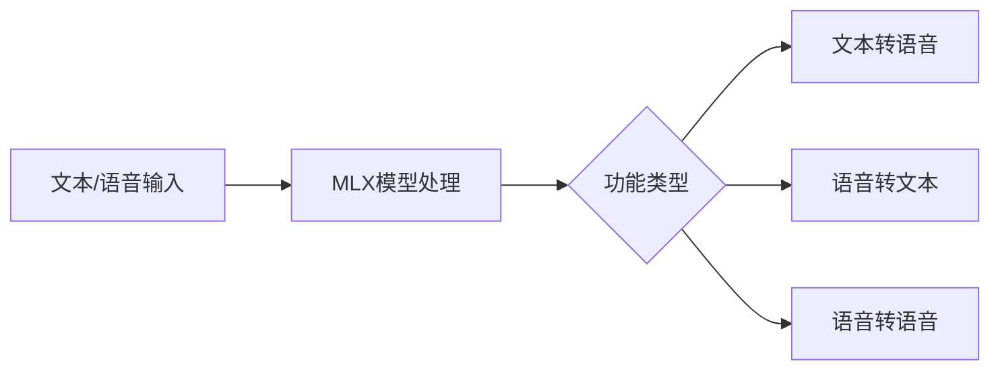

## 今日热点

AI代理与自动化工具引领今日趋势，同时多媒体处理和垂直领域AI应用持续火热，显示AI技术在各场景的深度融合与实用化进程。

---

## 热门项目一览

| 排名 | 项目 | 语言 | 今日 | 总计 | 简介 |
|:---:|------|:----:|------:|-----:|------|
| 1 | [remotion-dev/remotion](https://github.com/remotion-dev/remotion) | TypeScript | +1,374 | 31,969 | 🎥 Make videos programmatica... |
| 2 | [Blaizzy/mlx-audio](https://github.com/Blaizzy/mlx-audio) | Python | +1,233 | 5,097 | A text-to-speech (TTS), spe... |
| 3 | [VectifyAI/PageIndex](https://github.com/VectifyAI/PageIndex) | Python | +726 | 9,770 | 📑 PageIndex: Document Index... |
| 4 | [k4yt3x/video2x](https://github.com/k4yt3x/video2x) | C++ | +468 | 18,030 | A machine learning-based vi... |
| 5 | [supermemoryai/supermemory](https://github.com/supermemoryai/supermemory) | TypeScript | +420 | 15,095 | Memory engine and app that ... |
| 6 | [block/goose](https://github.com/block/goose) | Rust | +332 | 29,151 | an open source, extensible ... |
| 7 | [business-science/ai-data-science-team](https://github.com/business-science/ai-data-science-team) | Python | +80 | 4,171 | An AI-powered data science ... |
| 8 | [AI4Finance-Foundation/FinRobot](https://github.com/AI4Finance-Foundation/FinRobot) | Jupyter Notebook | +68 | 5,687 | FinRobot: An Open-Source AI... |

---

## 趋势洞察

```
┌─────────────────────────────────────────────────────────────────┐
│  AI/ML 工具         ████████████████████████  7 个项目        │
│  开发框架             ███                       1 个项目        │
└─────────────────────────────────────────────────────────────────┘
```

---

## 项目深度解读

### 1. remotion-dev/remotion — React视频生成

> **一句话总结**：使用React组件化方式程序化创建视频，将前端开发技能扩展到视频制作领域

#### 价值主张

| 维度 | 说明 |
|------|------|
| **解决痛点** | 传统视频制作工具学习曲线陡峭，难以实现程序化视频生成 |
| **目标用户** | 前端开发者，特别是熟悉React需要生成动态视频内容的团队 |
| **核心亮点** | 基于React组件化开发 + TypeScript支持 + 精确帧控制 + 多媒体格式支持 + 实时预览 |

#### 技术架构


**技术特色**：
- 基于React的声明式视频创建，降低视频制作门槛
- 提供完整的TypeScript类型定义，提升开发体验
- 支持在代码中精确控制视频的每一帧和元素

#### 热度分析

- 项目Star数超31,000且近期增长显著(+1,374 today)，表明在创意编码领域备受关注
- 作为视频生成领域的创新工具，在自动化内容生成和程序化视频制作领域占据重要位置

#### 快速上手

```bash
# 创建Remotion项目
npx create-video-app my-video-app
cd my-video-app
# 开发并预览视频
npm run dev
```

#### 注意事项

- 需要一定的React开发基础，不适合React初学者
- 视频渲染过程可能消耗较多计算资源，需要合理规划渲染时间
- 复杂的视频效果需要深入了解Remotion的API和视频渲染原理


### 2. Blaizzy/mlx-audio — 苹果语音处理库

> **一句话总结**：基于MLX框架的高效语音处理库，支持TTS/STT/STS三大功能，专为苹果芯片优化。

#### 价值主张

| 维度 | 说明 |
|------|------|
| **解决痛点** | 为苹果设备提供高效、低延迟的语音处理解决方案，弥补传统框架在苹果芯片上的性能不足 |
| **目标用户** | 苹果开发者、语音应用开发者、苹果设备AI研究人员 |
| **核心亮点** | 基于MLX框架 + 苹果芯片优化 + 支持TTS/STT/STS三大功能 |

#### 技术架构



**技术特色**：
- 基于苹果MLX框架，充分利用苹果芯片性能
- 统一架构支持多种语音处理功能
- 轻量级设计，适合本地部署

#### 热度分析

- 项目近期获得大量关注，单日增长1233星，表明语音处理在苹果生态中需求旺盛
- 零开放Issues，说明项目维护良好，社区参与度高，适合生产环境使用

#### 快速上手

```bash
# 安装mlx-audio库
pip install mlx-audio

# 基本文本转语音示例
python -c "from mlx_audio import TTS; tts = TTS(); tts.save('output.wav', 'Hello, this is a test.')"
```

#### 注意事项

- 仅支持苹果设备，需要MLX框架环境
- 可能需要较大的模型文件和计算资源
- 许可证信息不明确，商用前需确认授权条款


### 3. VectifyAI/PageIndex — 智能文档索引

> **一句话总结**：PageIndex提供了一种基于推理而非向量嵌入的文档索引方法，实现高效的知识检索与增强生成。

#### 价值主张

| 维度 | 说明 |
|------|------|
| **解决痛点** | 传统RAG系统依赖向量嵌入，计算资源消耗大且难以处理复杂推理任务 |
| **目标用户** | 需要高效文档检索和知识增强的应用开发者和研究人员 |
| **核心亮点** | 无向量索引技术 + 推理驱动的文档检索 + 资源高效利用 + 支持复杂查询 |

#### 技术架构


**技术特色**：
- 基于推理而非向量嵌入的索引方法
- 页面级别的文档处理与检索
- 资源高效利用的架构设计

#### 热度分析

- 项目Star数近万，单日增长700+，表明该项目近期获得高度关注，可能是RAG领域的新兴解决方案。
- 高Fork数和Star增长表明社区活跃，开发者正在尝试和应用该技术。

#### 快速上手

```bash
# 安装PageIndex
pip install pageindex

# 初始化文档索引
pageindex init --path /path/to/documents

# 执行查询
pageindex query "你的查询内容"
```

#### 注意事项

- 项目License未知，使用前需确认开源协议
- 作为新兴技术，可能存在稳定性问题，不建议在生产环境直接使用
- 可能需要特定的Python环境依赖，建议在虚拟环境中使用


### 4. k4yt3x/video2x — 视频超分辨率

> **一句话总结**：基于机器学习的视频超分辨率与帧插值工具，可显著提升视频画质并优化流畅度。

#### 价值主张

| 维度 | 说明 |
|------|------|
| **解决痛点** | 低分辨率视频画质提升问题 |
| **目标用户** | 视频处理爱好者、内容创作者 |
| **核心亮点** | 超分辨率 + 帧插值 + 多模型支持 + 跨平台 |

#### 技术架构


**技术特色**：
- 基于深度学习的视频超分辨率技术
- 支持Waifu2x、ESRGAN等多种AI模型
- 帧插值技术提升视频流畅度
- 跨平台支持，包括Windows、Linux和macOS

#### 热度分析

- 项目Star数超18k且持续增长，显示社区高度认可
- 无开放Issues，反映项目成熟度高，问题解决及时

#### 快速上手

```bash
# 安装依赖
pip install video2x

# 基本使用
video2x -i input.mp4 -o output.mp4 --model waifu2x
```

#### 注意事项

- 处理大视频文件需要较高的计算资源
- 不同模型适合不同类型的视频内容
- 建议使用GPU加速以缩短处理时间


### 5. supermemoryai/supermemory — AI记忆引擎

> **一句话总结**：为AI时代打造的极速、可扩展的内存引擎与应用，提供高效记忆API服务。

#### 价值主张

| 维度 | 说明 |
|------|------|
| **解决痛点** | 解决AI应用中高效记忆、检索和处理大规模信息的需求 |
| **目标用户** | AI应用开发者、智能系统构建者、需要记忆功能的技术团队 |
| **核心亮点** | 极速性能 + 高可扩展性 + AI专用API + 内存引擎技术 |

#### 技术架构


**技术特色**：
- 基于TypeScript开发，提供类型安全的API接口
- 极速数据处理引擎，专为AI应用场景优化
- 可扩展架构设计，支持大规模数据存储与检索

#### 热度分析

- 项目获15k+ stars，单日增长420+，显示极高社区关注度与认可度
- Fork数达1.5k+，表明开发者积极参与项目贡献和二次开发

#### 快速上手

```bash
# 克隆项目
git clone https://github.com/supermemoryai/supermemory.git

# 安装依赖
npm install

# 启动开发服务器
npm run dev
```

#### 注意事项

- 项目许可证未知，商业使用前需确认授权情况
- 作为AI时代的内存引擎，使用时需考虑数据隐私和安全问题
- 项目文档可能不够完善，建议深入查看源码了解完整功能


### 6. block/goose — AI编程代理

> **一句话总结**：开源可扩展AI代理，超越代码建议，支持安装、执行、编辑和测试任何LLM。

#### 价值主张

| 维度 | 说明 |
|------|------|
| **解决痛点** | 统一多LLM交互接口，解决代码处理碎片化问题 |
| **目标用户** | 开发者、AI研究人员和需要多LLM协作的团队 |
| **核心亮点** | 可扩展架构 + 支持任意LLM + 集成代码全生命周期管理 |

#### 技术架构


**技术特色**：
- Rust高性能内存安全设计
- 模块化LLM适配器架构
- 异步处理提升响应速度

#### 热度分析

- 项目Star数近3万，日增300+，呈现快速增长态势
- 0开放Issues表明问题解决高效，在AI开发工具领域具有重要地位

#### 快速上手

```bash
# 安装goose
cargo install goose

# 配置LLM
goose config --llm openai --model gpt-4

# 使用goose处理代码
goose execute --file example.py
```

#### 注意事项

- 需要配置适当的LLM API密钥才能正常使用
- 不同LLM可能有不同的功能限制和性能表现


### 7. business-science/ai-data-science-team — AI数据助手

> **一句话总结**：AI驱动的数据科学代理团队，将常见数据处理任务效率提升10倍。

#### 价值主张

| 维度 | 说明 |
|------|------|
| **解决痛点** | 数据科学任务耗时长、专业知识门槛高 |
| **目标用户** | 数据科学家、分析师、机器学习工程师 |
| **核心亮点** | AI代理团队 + 任务自动化 + 多智能体协作 |

#### 技术架构


**技术特色**：
- 多智能体协作系统，模拟团队工作模式
- 自动化数据科学全流程，减少人工干预
- AI驱动决策，优化任务执行路径

#### 热度分析

- 项目获得4,171个Star，今日新增80个，处于活跃增长阶段
- Fork数771，社区参与度高，用户愿意二次开发

#### 快速上手

```bash
# 安装项目
pip install ai-data-science-team

# 初始化AI团队
ai-team init

# 执行分析任务
ai-team analyze data.csv
```

#### 注意事项

- 项目许可信息未知，使用前需确认授权条款
- 依赖AI模型，需要稳定网络和计算资源
- 自动化执行可能需要人工监督确保结果质量


### 8. AI4Finance-Foundation/FinRobot — 金融AI代理平台

> **一句话总结**：基于大型语言模型的开放金融AI代理平台，提供自动化金融分析与决策支持能力。

#### 价值主张

| 维度 | 说明 |
|------|------|
| **解决痛点** | 金融分析依赖专业知识，传统工具效率低，AI应用门槛高 |
| **目标用户** | 金融分析师、投资经理、量化交易员、研究人员 |
| **核心亮点** | 大型语言模型集成 + 自动化分析流程 + 开源可定制 + 多模态数据处理 |

#### 技术架构


**技术特色**：
- 大型语言模型在金融领域的创新应用
- 模块化设计支持多种金融分析任务
- 开源架构促进社区协作与扩展

#### 热度分析

- Star数5,687且持续增长(+68 today)，显示项目热度高，发展迅速
- Fork数974，表明社区活跃，用户参与度高，项目生态正在形成

#### 快速上手

```bash
# 克隆项目
git clone https://github.com/AI4Finance-Foundation/FinRobot.git

# 安装依赖
pip install -r requirements.txt

# 启动Jupyter Notebook
jupyter notebook
```

#### 注意事项

- 需要具备基础的Python和金融知识
- 使用前需配置适当的大语言模型API
- 注意数据隐私和合规性问题


## 今日推荐

| 主题 | 推荐项目 | 亮点 |
|------|----------|------|
| 今日最热 | [remotion-dev/remotion](https://github.com/remotion-dev/remotion) | 🎥 Make videos pro... |
| 值得关注 | [Blaizzy/mlx-audio](https://github.com/Blaizzy/mlx-audio) | A text-to-speech ... |
| 快速上手 | [VectifyAI/PageIndex](https://github.com/VectifyAI/PageIndex) | 📑 PageIndex: Docu... |
| 长期潜力 | [k4yt3x/video2x](https://github.com/k4yt3x/video2x) | A machine learnin... |

---

<div align="center">

*Generated on 2026-01-27 | Powered by GitHub Trending Reporter*

</div>