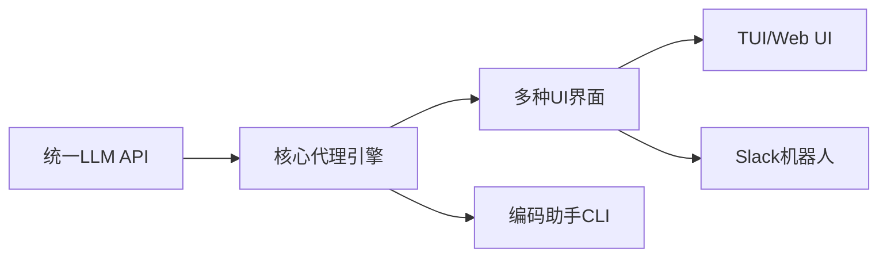
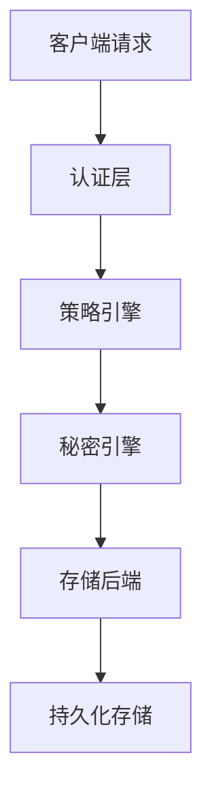

## 今日热点

AI工具链与LLM应用生态系统持续繁荣，企业级AI代理工具和记忆系统受热捧，Apple Silicon特定开发工具崭露头角。

---

## 热门项目一览

| 排名 | 项目 | 语言 | 今日 | 总计 | 简介 |
|:---:|------|:----:|------:|-----:|------|
| 1 | [Blaizzy/mlx-audio](https://github.com/Blaizzy/mlx-audio) | Python | +458 | 5,439 | A text-to-speech (TTS), spe... |
| 2 | [supermemoryai/supermemory](https://github.com/supermemoryai/supermemory) | TypeScript | +435 | 15,564 | Memory engine and app that ... |
| 3 | [Free-TV/IPTV](https://github.com/Free-TV/IPTV) | Python | +295 | 12,558 | M3U Playlist for free TV ch... |
| 4 | [Shubhamsaboo/awesome-llm-apps](https://github.com/Shubhamsaboo/awesome-llm-apps) | Python | +294 | 90,164 | Collection of awesome LLM a... |
| 5 | [badlogic/pi-mono](https://github.com/badlogic/pi-mono) | TypeScript | +118 | 2,717 | AI agent toolkit: coding ag... |
| 6 | [hashicorp/vault](https://github.com/hashicorp/vault) | Go | +13 | 34,108 | A tool for secrets manageme... |

---

## 趋势洞察

```
┌─────────────────────────────────────────────────────────────────┐
│  AI/ML 工具         ████████████████████████  4 个项目        │
│  媒体资源             ██████                    1 个项目        │
│  项目管理             ██████                    1 个项目        │
└─────────────────────────────────────────────────────────────────┘
```

---

## 项目深度解读

### 1. Blaizzy/mlx-audio — 苹果语音库

> **一句话总结**：基于MLX框架的跨语音处理库，为Apple Silicon提供高效TTS/STT/STS功能。

#### 价值主张

| 维度 | 说明 |
|------|------|
| **解决痛点** | 为Apple设备提供原声高效语音处理能力，解决跨平台框架效率低下问题 |
| **目标用户** | Apple开发者、语音AI研究人员、苹果设备用户 |
| **核心亮点** | + MLX框架原生支持 + Apple Silicon优化 + 三模态语音处理 + 零依赖设计 |

#### 技术架构


**技术特色**：
- 利用MLX框架的自动微分和硬件加速特性
- 采用模块化设计，支持多种语音处理模式无缝切换
- 优化内存使用，适合资源受限的Apple设备环境

#### 热度分析

- 项目近期Star激增(+458/天)，显示社区对Apple专用AI工具的强烈需求
- 在Apple生态AI工具链中占据重要位置，填补MLX框架语音处理空白

#### 快速上手

```bash
# 安装依赖
pip install mlx mlx-audio

# 基本使用
import mlx_audio as ma

# 文本转语音
ma.tts("Hello, this is a test.", "output.wav")

# 语音转文本
text = ma.stt("input.wav")

# 语音转语音
ma.sts("input.wav", "output.wav")
```

#### 注意事项

- 此库仅支持Apple Silicon设备(M1/M2/M3芯片)，无法在其他平台上运行
- 需要安装MLX框架，该框架依赖于Apple的机器学习工具和硬件加速
- 许可证信息不明确，使用前需确认开源许可条款


### 2. supermemoryai/supermemory — AI记忆引擎

> **一句话总结**：为AI时代打造的高性能、可扩展的记忆引擎与应用程序，提供记忆API服务。

#### 价值主张

| 维度 | 说明 |
|------|------|
| **解决痛点** | 解决AI应用中记忆存储、检索与管理的效率问题 |
| **目标用户** | AI开发者、应用构建者、需要长期记忆功能的产品团队 |
| **核心亮点** | 高性能 + 可扩展性 + 专为AI优化 + API驱动 + 无需复杂配置 |

#### 技术架构


**技术特色**：
- 基于TypeScript开发，提供类型安全与良好的开发体验
- 高性能记忆存储与检索机制，适合AI应用场景
- 提供简洁的API接口，便于集成到各类AI应用中
- 可扩展架构设计，支持大规模记忆数据管理
- 针对AI时代的记忆需求优化，处理上下文与长期记忆

#### 热度分析

- 项目获得15,564个Star，单日增长435，表明在AI记忆领域受到高度关注
- Fork数1,588显示开发者积极参与二次开发与定制，社区活跃度高

#### 快速上手

```bash
# 克隆项目
git clone https://github.com/supermemoryai/supermemory.git
cd supermemory

# 安装依赖并启动
npm install
npm start
```

#### 注意事项

- 项目许可证未知，商业使用前需确认授权条款
- 项目Issues为0，可能表示项目处于早期阶段或社区反馈渠道不完善
- 作为AI记忆引擎，需注意数据隐私与合规性问题
- 建议查看项目文档了解具体的API使用方法和最佳实践


### 3. Free-TV/IPTV — IPTV播放列表源

> **一句话总结**：提供全球免费电视频道的M3U播放列表，支持多种播放器设备使用。

#### 价值主张

| 维度 | 说明 |
|------|------|
| **解决痛点** | 提供免费、合法的电视频道观看渠道，无需订阅付费服务 |
| **目标用户** | 寻求免费电视内容、不想订阅传统电视服务的用户 |
| **核心亮点** | 全球频道覆盖 + M3U格式通用 + 持续更新 + 多设备支持 |

#### 技术架构


**技术特色**：
- 使用Python脚本自动化收集和验证电视频道源
- M3U格式确保跨平台兼容性
- 定期更新机制保证频道列表时效性

#### 热度分析

- 项目高增长率表明对免费电视内容需求旺盛，社区认可度高
- 无开放问题反映项目维护良好，用户满意度高

#### 快速上手

```bash
# 克隆项目
git clone https://github.com/Free-TV/IPTV.git

# 查看播放列表
cat playlist.m3u
```

#### 注意事项

- 仅限合法使用，请遵守当地法律法规
- 频道可用性可能因地区而异，部分频道可能需要额外配置
- 项目不保证所有频道的长期可用性


### 4. Shubhamsaboo/awesome-llm-apps — LLM应用大全

> **一句话总结**：精选集合OpenAI、Anthropic、Gemini及开源模型的LLM应用、AI代理与RAG实现方案。

#### 价值主张

| 维度 | 说明 |
|------|------|
| **解决痛点** | 整合分散的LLM应用资源，提供一站式参考与学习材料 |
| **目标用户** | AI开发者、研究人员和希望构建LLM应用的技术人员 |
| **核心亮点** | 覆盖主流模型 + 多样化应用场景 + 实用代码示例 |

#### 技术架构


**技术特色**：
- 聚合多种主流LLM平台应用
- 包含RAG和AI代理实现方案
- 提供从简单到复杂的完整示例

#### 热度分析

- 项目获得超9万星，日均增长近300星，表明LLM应用开发领域热度极高
- 作为资源集合项目，在AI开发社区具有重要参考价值，是开发者寻找LLM应用灵感的重要来源

#### 快速上手

```bash
# 克隆仓库
git clone https://github.com/Shubhamsaboo/awesome-llm-apps.git

# 浏览目录结构
cd awesome-llm-apps && ls -la

# 查看README获取完整资源列表
cat README.md
```

#### 注意事项

- 这是一个资源收集项目，不包含可直接运行的代码，而是链接到各个项目的资源
- 使用时需要遵循各个子项目的许可协议
- 部分链接可能已过时，需要自行验证项目状态


### 5. badlogic/pi-mono — AI代理工具集

> **一句话总结**：全栈AI代理工具集，提供统一API和多种交互界面，简化LLM应用开发。

#### 价值主张

| 维度 | 说明 |
|------|------|
| **解决痛点** | 碎片化AI工具集成困难，缺乏统一LLM应用开发框架 |
| **目标用户** | AI应用开发者、需要集成LLM功能的团队、Slack自动化用户 |
| **核心亮点** | 统一LLM API接口 + 多种UI界面支持(vLLM pods) + 编程助手CLI |

#### 技术架构



**技术特色**：
- 统一的LLM抽象层，简化不同模型接入
- 支持vLLM pods，提供高性能推理能力
- TypeScript实现，提供完整类型安全保障

#### 热度分析

- 项目获2.7k+星标，单日增长118，显示热度快速上升
- 0个Open Issues，表明项目维护良好，问题处理高效

#### 快速上手

```bash
# 安装依赖
npm install

# 启动编码助手
npm run coding-agent

# 启动Web UI
npm run web-ui
```

#### 注意事项

- 项目许可证未知，商业使用前需确认授权
- 依赖vLLM pods，需要相应的硬件支持
- 统一API接口可能对特定高级功能有限制


### 6. hashicorp/vault — 安全密钥管理

> **一句话总结**：企业级秘密管理工具，提供集中化密钥存储、动态凭证生成和加密即服务能力。

#### 价值主张

| 维度 | 说明 |
|------|------|
| **解决痛点** | 解决敏感信息分散存储、难以管理和审计的安全风险 |
| **目标用户** | DevOps团队、安全工程师、云基础设施管理员 |
| **核心亮点** | 集中化秘密管理 + 动态凭证生成 + 多租户访问控制 + 审计日志 + 多种后端支持 |

#### 技术架构



**技术特色**：
- 基于租赁机制的临时凭证自动管理
- 多层加密保护确保数据安全
- 支持多种云环境和本地部署模式

#### 热度分析

- Vault作为秘密管理领域标杆项目，持续稳定增长，企业采用度高
- 在云原生安全生态中占据核心位置，与HashiCorp其他产品形成完整解决方案

#### 快速上手

```bash
# 启动开发模式Vault服务器
vault server -dev

# 设置环境变量并写入秘密
export VAULT_ADDR='http://127.0.0.1:8200'
export VAULT_TOKEN='s.1a2b3c4d5e'
vault write secret/hello value=world
```

#### 注意事项

- 生产环境必须使用非开发模式配置，启用适当的认证和加密机制
- 定期测试备份恢复流程，确保灾难恢复能力
- 严格配置访问策略，遵循最小权限原则
- 启用审计日志以跟踪所有访问和操作，满足合规要求


## 今日推荐

| 主题 | 推荐项目 | 亮点 |
|------|----------|------|
| 今日最热 | [Blaizzy/mlx-audio](https://github.com/Blaizzy/mlx-audio) | A text-to-speech ... |
| 值得关注 | [supermemoryai/supermemory](https://github.com/supermemoryai/supermemory) | Memory engine and... |
| 快速上手 | [Free-TV/IPTV](https://github.com/Free-TV/IPTV) | M3U Playlist for ... |
| 长期潜力 | [Shubhamsaboo/awesome-llm-apps](https://github.com/Shubhamsaboo/awesome-llm-apps) | Collection of awe... |

---

<div align="center">

*Generated on 2026-01-28 | Powered by GitHub Trending Reporter*

</div>