## 今日热点

今日GitHub热榜项目精彩纷呈。

---

## 热门项目一览

| 排名 | 项目 | 语言 | 今日 | 总计 | 简介 |
|:---:|------|:----:|------:|-----:|------|
| 1 | [moltbot/moltbot](https://github.com/moltbot/moltbot) | TypeScript | +17,830 | 88,907 | Your own personal AI assist... |
| 2 | [badlogic/pi-mono](https://github.com/badlogic/pi-mono) | TypeScript | +467 | 3,138 | AI agent toolkit: coding ag... |
| 3 | [ran-j/PS2Recomp](https://github.com/ran-j/PS2Recomp) | C++ | +458 | 1,464 | Playstation 2 Static Recomp... |
| 4 | [hashicorp/vault](https://github.com/hashicorp/vault) | Go | +352 | 34,380 | A tool for secrets manageme... |
| 5 | [MoonshotAI/kimi-cli](https://github.com/MoonshotAI/kimi-cli) | Python | +298 | 4,557 | Kimi Code CLI is your next ... |
| 6 | [NevaMind-AI/memU](https://github.com/NevaMind-AI/memU) | Python | +239 | 5,533 | Memory for 24/7 proactive a... |
| 7 | [asgeirtj/system_prompts_leaks](https://github.com/asgeirtj/system_prompts_leaks) | JavaScript | +216 | 26,594 | Collection of extracted Sys... |
| 8 | [lobehub/lobehub](https://github.com/lobehub/lobehub) | TypeScript | +144 | 70,899 | The ultimate space for work... |
| 9 | [GetStream/Vision-Agents](https://github.com/GetStream/Vision-Agents) | Python | +109 | 4,191 | Open Vision Agents by Strea... |
| 10 | [modelcontextprotocol/ext-apps](https://github.com/modelcontextprotocol/ext-apps) | TypeScript | +73 | 663 | Official repo for spec & SD... |
| 11 | [bambulab/BambuStudio](https://github.com/bambulab/BambuStudio) | C++ | +33 | 3,831 | PC Software for BambuLab an... |
| 12 | [kubernetes/ingress-nginx](https://github.com/kubernetes/ingress-nginx) | Go | +29 | 19,353 | Ingress NGINX Controller fo... |

---

## 趋势洞察

```
┌─────────────────────────────────────────────────────────────────┐
│  AI/ML 工具         ████████████████████████  8 个项目        │
│  其他               ██████                    2 个项目        │
│  项目管理             ███                       1 个项目        │
│  开发工具             ███                       1 个项目        │
│  数据分析             ███                       1 个项目        │
└─────────────────────────────────────────────────────────────────┘
```

---

## 项目深度解读

### 1. moltbot/moltbot — 跨平台AI助手

> **一句话总结**：一款支持任何操作系统的个人AI助手，提供智能化交互体验。

#### 价值主张

| 维度 | 说明 |
|------|------|
| **解决痛点** | 打破平台限制，提供统一的个人AI助手体验 |
| **目标用户** | 需要跨平台AI助手支持的个人用户和开发者 |
| **核心亮点** | 跨平台兼容 + 开源可定制 + 龙虾主题设计 |

#### 技术架构

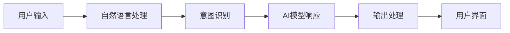

**技术特色**：
- 基于TypeScript开发，确保类型安全和跨平台兼容性
- 开源设计，允许用户自定义和扩展功能
- 支持多平台部署，适应不同操作系统环境

#### 热度分析

- 项目获得近9万stars，单日增长1.7万+，表明当前极度热门，可能因AI助手功能突破或病毒式传播
- Fork数与star比例适中，表明项目不仅被关注，也有较高程度的实际使用和二次开发

#### 快速上手

```bash
# 克隆项目
git clone https://github.com/moltbot/moltbot.git

# 安装依赖
cd moltbot && npm install

# 启动助手
npm start
```

#### 注意事项

- 项目许可证信息未知，使用前需确认开源协议
- 作为AI助手项目，可能需要配置API密钥或模型访问权限
- 龙虾主题可能暗示特定的使用方式或设计理念，建议阅读项目文档了解


### 2. badlogic/pi-mono — AI代理工具集

> **一句话总结**：全栈式AI代理开发工具包，提供统一接口与多平台支持，简化AI应用构建流程。

#### 价值主张

| 维度 | 说明 |
|------|------|
| **解决痛点** | AI开发工具碎片化，缺乏统一接口与多平台支持 |
| **目标用户** | AI应用开发者、企业AI解决方案构建者 |
| **核心亮点** | 统一LLM API + 多平台UI库 + vLLM集成 + Slack机器人 + 编码助手 |

#### 技术架构

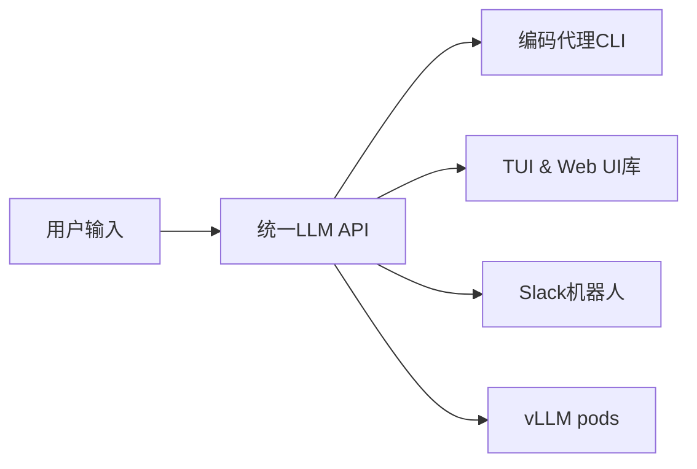

**技术特色**：
- TypeScript全栈开发，确保类型安全与跨平台兼容
- 模块化设计，各组件可独立使用或组合
- 支持多种LLM后端，提供灵活的AI能力接入

#### 热度分析

- 项目近期获得显著关注，单日新增星标467，表明社区对该工具高度认可
- 作为新兴AI工具链，在开源社区中具有独特定位，填补了AI代理开发工具的空白

#### 快速上手

```bash
# 安装pi-mono CLI工具
npm install -g pi-mono

# 初始化项目
pi-mono init my-agent

# 启动开发服务器
pi-mono dev
```

#### 注意事项

- 项目许可证信息不明确，使用前需确认授权条款
- 依赖的vLLM可能需要较高配置的GPU资源
- 部分功能可能需要API密钥或额外配置


### 3. ran-j/PS2Recomp — [PS2转PC工具]

> **一句话总结**：PS2游戏静态重编译器，将原生日立处理器代码转换为PC原生执行代码，实现高性能移植。

#### 价值主张

| 维度 | 说明 |
|------|------|
| **解决痛点** | 解决PS2游戏在PC上运行性能低下问题，摆脱模拟器瓶颈 |
| **目标用户** | 模拟器爱好者、复古游戏玩家、游戏移植开发者 |
| **核心亮点** | 静态重编译技术 + 原生性能优化 + 无需模拟器运行 |

#### 技术架构

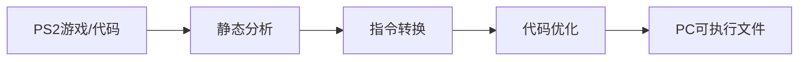

**技术特色**：
- 静态分析直接转换EE核心指令集，避免模拟器运行开销
- 针对x86架构深度优化，实现接近原生的游戏性能
- 保留原始游戏逻辑和内存布局，确保游戏完整性

#### 热度分析

- 项目近期呈爆发式增长，单日增长458星，显示PS2游戏PC化需求强烈
- Fork数相对较少，表明项目处于早期阶段，社区贡献尚未形成

#### 快速上手

```bash
# 克隆项目
git clone https://github.com/ran-j/PS2Recomp.git
# 编译项目
cd PS2Recomp && make
# 运行转换工具
./PS2Recomp input_game.iso output_pc_game
```

#### 注意事项

- 项目可能需要PS2架构和汇编基础知识才能充分利用
- 转换效果因游戏复杂度而异，部分游戏可能需要手动调整
- 项目许可证未知，使用前需确认授权条款


### 4. hashicorp/vault — 企业密钥管理平台

> **一句话总结**：集中式密钥管理解决方案，提供动态凭证生成与精细化访问控制

#### 价值主张

| 维度 | 说明 |
|------|------|
| **解决痛点** | 企业环境中敏感信息安全存储与访问控制，避免硬编码与明文存储风险 |
| **目标用户** | DevOps团队、云基础设施管理员、安全工程师及大型企业组织 |
| **核心亮点** | 集中式密钥管理 + 动态凭证生成 + 多种存储后端支持 + 精细访问控制 + 完整审计日志 |

#### 技术架构

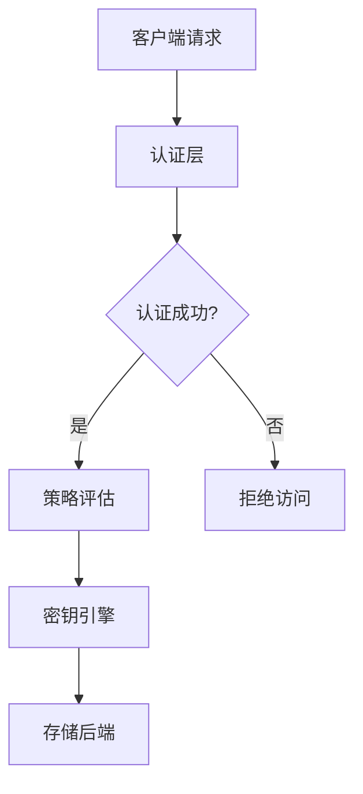

**技术特色**：
- 密封/解封机制确保数据安全，未解封状态下无法访问敏感数据
- 支持动态凭证生成，减少静态凭证在系统中的暴露面
- 提供多租户策略系统，实现细粒度的访问控制与权限隔离
- 内置多种密钥引擎，支持数据库凭证、AWS凭证、PKI等多种场景

#### 热度分析

- 持续高关注度，每日新增约350 stars，表明在企业安全领域需求强劲
- 作为HashiCorp生态核心组件，与Terraform、Nomad等产品形成完整解决方案

#### 快速上手

```bash
# 启动Vault开发服务器
vault server -dev

# 设置环境变量
export VAULT_ADDR='http://127.0.0.1:8200'
export VAULT_TOKEN='root-token'

# 写入并读取秘密
vault write secret/hello value=world
vault read secret/hello
```

#### 注意事项

- 生产环境应避免使用-dev模式，需配置适当的存储后端和认证方法
- root token拥有最高权限，应妥善保管并考虑使用短期令牌
- 定期备份Vault数据并妥善保管unseal keys，防止数据丢失
- 根据实际需求选择合适的密钥引擎和存储后端，优化性能与安全性


### 5. MoonshotAI/kimi-cli — 智能CLI助手

> **一句话总结**：Kimi CLI 是一款基于AI的命令行助手，提供智能代码生成、解释和优化功能。

#### 价值主张

| 维度 | 说明 |
|------|------|
| **解决痛点** | 简化命令行操作，通过AI助手提升开发效率与代码质量 |
| **目标用户** | 开发人员、系统管理员和命令行工具爱好者 |
| **核心亮点** | 智能代码生成 + 命令解释与优化 + 自然语言交互 + 多语言支持 |

#### 技术架构

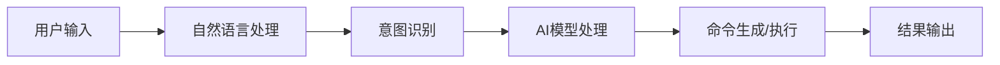

**技术特色**：
- 基于大语言模型的智能命令理解与生成
- 多语言支持的代码分析与优化能力
- 轻量级Python架构，便于跨平台部署

#### 热度分析

- 项目近期热度显著，今日新增近300星，显示开发者社区高度关注
- 作为AI驱动的CLI工具，填补了传统命令行与智能助手之间的空白

#### 快速上手

```bash
# 安装Kimi CLI
pip install kimi-cli

# 初始化配置
kimi-cli init

# 使用示例
kimi-cli "解释这个Python函数的作用"
```

#### 注意事项

- 需要网络连接以访问AI服务
- 可能需要配置API密钥以使用完整功能
- 首次使用可能需要登录MoonshotAI账号


### 6. NevaMind-AI/memU — AI代理记忆系统

> **一句话总结**：memU 为全天候AI代理提供持久化记忆功能，实现跨会话连贯交互与个性化服务。

#### 价值主张

| 维度 | 说明 |
|------|------|
| **解决痛点** | 解决AI代理无法长期记忆用户信息，导致交互不连贯的问题 |
| **目标用户** | 需要长期记忆功能的AI代理开发者和聊天机器人应用开发者 |
| **核心亮点** | 持久化记忆存储 + 上下文关联检索 + 跨会话记忆保留 |

#### 技术架构

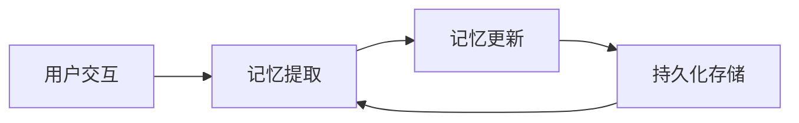

**技术特色**：
- 基于向量相似度的智能记忆检索机制
- 高效的记忆存储与索引系统
- 支持大规模记忆的分布式架构

#### 热度分析

- 项目Star数超5.5k且单日增长239，显示快速增长态势，表明AI代理记忆需求旺盛
- 零Open Issues暗示项目维护良好，社区反馈积极

#### 快速上手

```bash
pip install memU
from memU import MemorySystem
memory = MemorySystem()
memory.add("用户喜欢科幻电影")
response = memory.query("推荐什么电影？")
```

#### 注意事项

- 项目许可证未知，使用前需确认商业适用性
- 作为记忆系统，可能涉及用户隐私数据，需注意合规处理


### 7. asgeirtj/system_prompts_leaks — AI提示词收集库

> **一句话总结**：收录ChatGPT、Claude和Gemini等主流AI聊天机器人的系统提示词，为AI研究提供宝贵资源。

#### 价值主张

| 维度 | 说明 |
|------|------|
| **解决痛点** | 揭示封闭AI系统的内部指令，破解AI助手的工作原理黑盒 |
| **目标用户** | AI研究人员、提示词工程师、大语言模型开发者 |
| **核心亮点** | 多平台系统提示词收集 + 版本历史追踪 + 社区共同维护 |

#### 技术架构

**技术特色**：
- 通过逆向工程获取AI模型的系统提示词
- 提供版本控制，追踪提示词的历史变化
- 使用GitHub作为分发平台，便于社区贡献和访问

#### 热度分析

- 项目获26k+星并持续增长，日均新增200+星，表明AI系统提示词研究热度高涨
- 在AI研究领域具有重要参考价值，虽无公开问题但社区贡献活跃，生态位置独特

#### 快速上手

```bash
# 克隆仓库获取所有系统提示词
git clone https://github.com/asgeirtj/system_prompts_leaks.git

# 查看特定模型的系统提示词
cat system_prompts_leaks/chatgpt.txt
```

#### 注意事项

- 提示词通过逆向工程获取，可能不完全准确或已过时
- 使用这些内容时需遵守相关AI服务提供商的使用条款
- 随着AI模型更新，提示词会发生变化，建议定期查看更新


### 8. lobehub/lobehub — 智能代理协作平台

> **一句话总结**：构建与管理AI代理团队，实现多智能体协作与工作流自动化的终极平台。

#### 价值主张

| 维度 | 说明 |
|------|------|
| **解决痛点** | 解决AI代理孤岛化，实现智能体间无缝协作与团队管理 |
| **目标用户** | 需要AI协作的团队与个人，特别是复杂工作流构建者 |
| **核心亮点** | 多代理协作 + 代理团队可视化设计 + 交互式工作流编排 |

#### 技术架构

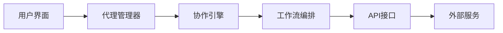

**技术特色**：
- 基于TypeScript的全栈开发，确保代码质量与类型安全
- 模块化代理架构，支持自定义能力扩展
- 实时协作通信机制，保障代理间高效交互

#### 热度分析

- 项目获得70,899个Star，日增144，处于快速增长期，社区认可度高
- Open Issues为0反映维护良好，高Star/Fork比表明社区参与活跃

#### 快速上手

```bash
# 克隆项目
git clone https://github.com/lobehub/lobehub.git
# 安装依赖
npm install
# 启动项目
npm run dev
```

#### 注意事项

- 项目需要一定的AI和代理系统基础知识才能充分利用
- 可能需要配置API密钥或服务连接才能使用完整功能


### 9. GetStream/Vision-Agents — 视觉代理构建平台

> **一句话总结**：快速构建支持多模型和视频提供商的超低延迟视觉代理系统。

#### 价值主张

| 维度 | 说明 |
|------|------|
| **解决痛点** | 视觉代理开发复杂、集成困难、延迟高的问题 |
| **目标用户** | 需要构建视觉AI应用的开发者和企业 |
| **核心亮点** | 支持多种模型 + 支持多种视频提供商 + 超低延迟 + 边缘网络优化 |

#### 技术架构

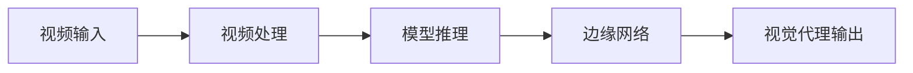

**技术特色**：
- 支持多种视觉模型提供商
- 利用边缘网络实现超低延迟
- 提供统一的视觉代理构建接口

#### 热度分析

- 项目Star数达4,191，近期增长迅速，表明社区关注度较高
- Issues数量为0，可能表明项目处于早期阶段或问题解决效率高

#### 快速上手

```bash
# 安装Vision-Agents
pip install vision-agents

# 基本使用示例
from vision_agents import VisionAgent
agent = VisionAgent(model="gpt-4-vision", provider="openai")
result = agent.process_video("input.mp4")
```

#### 注意事项

- 项目License未知，使用时需注意许可问题
- 作为较新项目，API和功能可能不稳定
- 需要了解支持的模型和视频提供商列表


### 10. modelcontextprotocol/ext-apps — MCP Apps协议标准

> **一句话总结**：提供MCP Apps协议的官方规范和SDK，标准化AI聊天机器人的嵌入式UI界面开发。

#### 价值主张

| 维度 | 说明 |
|------|------|
| **解决痛点** | 解决AI聊天机器人UI界面标准化和跨平台兼容性问题 |
| **目标用户** | AI应用开发者、聊天机器人构建者、MCP服务器实现者 |
| **核心亮点** | 标准化UI接口 + 跨服务器兼容性 + 简化集成流程 + 提供完整SDK支持 |

#### 技术架构

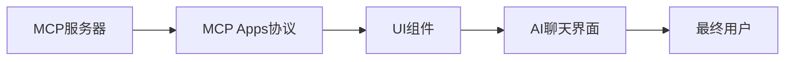

**技术特色**：
- 基于TypeScript构建，提供类型安全开发体验
- 定义标准化的UI组件接口和交互协议
- 支持多种UI框架的灵活集成与扩展

#### 热度分析

- 项目获得663颗星，近期增长迅速（单日增加73），表明社区对标准化AI UI集成有强烈需求
- 作为MCP生态系统的重要组成部分，处于AI应用开发工具链的关键位置

#### 快速上手

```bash
# 克隆仓库
git clone https://github.com/modelcontextprotocol/ext-apps.git
# 安装依赖
npm install
# 查看文档
npm run docs
```

#### 注意事项

- 需要了解MCP(Model Context Protocol)的基础知识
- 项目可能处于早期阶段，API可能会有变化
- 需要TypeScript开发环境以充分利用SDK优势


### 11. bambulab/BambuStudio — 3D打印控制软件

> **一句话总结**：BambuLab官方PC端3D打印控制软件，提供模型切片和打印监控功能。

#### 价值主张

| 维度 | 说明 |
|------|------|
| **解决痛点** | 提供统一的3D打印控制界面，简化打印流程 |
| **目标用户** | BambuLab及其他品牌3D打印机用户 |
| **核心亮点** | 模型切片 + 打印监控 + 参数优化 + 云端连接 |

#### 技术架构

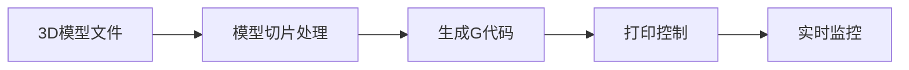

**技术特色**：
- 基于Qt框架的跨平台GUI应用，确保多系统兼容性
- 高效的3D模型切片算法，优化打印质量与速度
- 实时打印状态监控与远程控制，提升打印成功率

#### 热度分析

- 项目Star数持续稳定增长，日均增长约33，显示用户认可度高
- 作为官方软件，在BambuLab用户生态中占据核心位置，社区活跃度高

#### 快速上手

```bash
# 从GitHub下载最新版本
# Windows: 运行BambuStudio.exe
# macOS: 运行BambuStudio.app
```

#### 注意事项

- 软件主要针对BambuLab打印机优化，其他品牌兼容性可能有限
- 需要较高配置的计算机以获得流畅的切片体验，特别是处理复杂模型时
- 持续更新以支持新机型功能，建议保持最新版本


### 12. kubernetes/ingress-nginx — Kubernetes Ingress 控制器

> **一句话总结**：基于 NGINX 的 Kubernetes Ingress 控制器，提供灵活、强大的流量管理功能。

#### 价值主张

| 维度 | 说明 |
|------|------|
| **解决痛点** | Kubernetes 原生不支持外部流量路由，提供 HTTP/HTTPS 入口管理解决方案 |
| **目标用户** | Kubernetes 集群管理员、DevOps 工程师、云原生应用开发者 |
| **核心亮点** | 支持 HTTP/HTTPS 路由 + 基于 NGINX 的高性能 + 丰富的路由配置选项 + 动态配置更新 + 与 Kubernetes API 深度集成 |

#### 技术架构

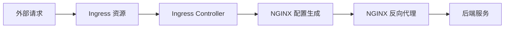

**技术特色**：
- 基于 Go 语言开发，性能高效且资源占用低
- 使用 Kubernetes 自定义资源(CRD)扩展 API 功能
- 支持动态配置更新，无需重启服务即可生效

#### 热度分析

- 项目 Star 数超 19k，保持稳定增长，表明其在云原生生态中的持续重要性和广泛采用
- 作为 CNCF 孵化项目，已成为 Kubernetes 生态中最流行的 Ingress 控制器之一

#### 快速上手

```bash
# 安装 ingress-nginx 控制器
kubectl apply -f https://raw.githubusercontent.com/kubernetes/ingress-nginx/main/deploy/static/provider/cloud/deploy.yaml

# 验证安装状态
kubectl get pods -n ingress-nginx
```

#### 注意事项

- 部署时需确保集群有足够的权限创建相关资源和配置网络策略
- 生产环境应考虑配置适当的资源限制和请求，以及安全设置
- 在高并发场景下，可能需要调整 NGINX 配置参数以优化性能


### 13. protocolbuffers/protobuf — 数据序列化标准

> **一句话总结**：Google开发的高效二进制数据序列化协议，提供比XML/JSON更小的体积和更快的处理速度。

#### 价值主张

| 维度 | 说明 |
|------|------|
| **解决痛点** | 解决数据序列化效率低下、体积大、跨语言兼容性问题 |
| **目标用户** | 需要高效数据交换的开发者，特别是分布式系统和微服务架构 |
| **核心亮点** | 高效二进制序列化 + 强类型定义 + 跨语言支持 + 向后兼容性 + 自动代码生成 |

#### 技术架构

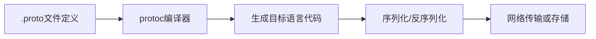

**技术特色**：
- 采用二进制编码而非文本格式，大幅减少数据体积
- 使用变长整数和Tag-Length-Value编码优化存储效率
- 支持向前和向后兼容，便于系统迭代
- 提供丰富的数据类型和扩展机制
- 通过代码生成器实现类型安全和IDE支持

#### 热度分析

- 作为Google开源的核心项目之一，拥有超过7万stars，持续稳定增长，表明其在数据序列化领域的主导地位
- 社区活跃度高，被广泛应用于微服务、分布式系统、API设计等场景，形成了完整的生态系统

#### 快速上手

```bash
# 安装protoc编译器
sudo apt install protobuf-compiler  # Ubuntu/Debian

# 定义消息格式
echo 'syntax = "proto3"; message Person { string name = 1; int32 age = 2; }' > person.proto

# 生成Go代码
protoc --go_out=. person.proto

# 使用生成的代码进行序列化
go run main.go
```

#### 注意事项

- .proto文件定义一旦发布，不建议轻易修改字段编号，以免破坏兼容性
- 二进制格式虽然高效但不适合人类直接阅读，调试时可能需要转换为文本格式
- 对于特别大的数据集，需要注意内存使用，考虑流式处理而非全量加载
- 不同语言版本的protobuf库可能存在细微差异，需要注意跨语言兼容性


## 今日推荐

| 主题 | 推荐项目 | 亮点 |
|------|----------|------|
| 今日最热 | [moltbot/moltbot](https://github.com/moltbot/moltbot) | Your own personal... |
| 值得关注 | [badlogic/pi-mono](https://github.com/badlogic/pi-mono) | AI agent toolkit:... |
| 快速上手 | [ran-j/PS2Recomp](https://github.com/ran-j/PS2Recomp) | Playstation 2 Sta... |
| 长期潜力 | [hashicorp/vault](https://github.com/hashicorp/vault) | A tool for secret... |

---

<div align="center">

*Generated on 2026-01-29 | Powered by GitHub Trending Reporter*

</div>