## 今日热点

AI助手与代理平台持续火热，moltbot单日激增1.6万引领潮流，同时多代理协作系统兴起，表明AI正从单一工具向协作生态系统演进。

---

## 热门项目一览

| 排名 | 项目 | 语言 | 今日 | 总计 | 简介 |
|:---:|------|:----:|------:|-----:|------|
| 1 | [moltbot/moltbot](https://github.com/moltbot/moltbot) | TypeScript | +16,338 | 103,855 | Your own personal AI assist... |
| 2 | [asgeirtj/system_prompts_leaks](https://github.com/asgeirtj/system_prompts_leaks) | JavaScript | +1,387 | 27,638 | Collection of extracted Sys... |
| 3 | [NevaMind-AI/memU](https://github.com/NevaMind-AI/memU) | Python | +604 | 6,046 | Memory for 24/7 proactive a... |
| 4 | [MoonshotAI/kimi-cli](https://github.com/MoonshotAI/kimi-cli) | Python | +492 | 4,953 | Kimi Code CLI is your next ... |
| 5 | [badlogic/pi-mono](https://github.com/badlogic/pi-mono) | TypeScript | +396 | 3,467 | AI agent toolkit: coding ag... |
| 6 | [lobehub/lobehub](https://github.com/lobehub/lobehub) | TypeScript | +364 | 71,217 | The ultimate space for work... |
| 7 | [hashicorp/vault](https://github.com/hashicorp/vault) | Go | +255 | 34,622 | A tool for secrets manageme... |
| 8 | [Shubhamsaboo/awesome-llm-apps](https://github.com/Shubhamsaboo/awesome-llm-apps) | Python | +208 | 90,899 | Collection of awesome LLM a... |
| 9 | [modelcontextprotocol/ext-apps](https://github.com/modelcontextprotocol/ext-apps) | TypeScript | +117 | 841 | Official repo for spec & SD... |
| 10 | [protocolbuffers/protobuf](https://github.com/protocolbuffers/protobuf) | C++ | +87 | 70,514 | Protocol Buffers - Google's... |
| 11 | [microsoft/playwright-cli](https://github.com/microsoft/playwright-cli) | Unknown | +64 | 1,674 | CLI for common Playwright a... |
| 12 | [TeamNewPipe/NewPipe](https://github.com/TeamNewPipe/NewPipe) | Java | +63 | 36,740 | A libre lightweight streami... |

---

## 趋势洞察

```
┌─────────────────────────────────────────────────────────────────┐
│  AI/ML 工具         ████████████████████████  8 个项目        │
│  开发工具             ██████                    2 个项目        │
│  媒体资源             ███                       1 个项目        │
│  项目管理             ███                       1 个项目        │
│  数据分析             ███                       1 个项目        │
│  安全工具             ███                       1 个项目        │
└─────────────────────────────────────────────────────────────────┘
```

---

## 项目深度解读

### 1. moltbot/moltbot — 跨平台AI助手

> **一句话总结**：跨平台个人AI助手，支持多操作系统，提供智能交互体验。

#### 价值主张

| 维度 | 说明 |
|------|------|
| **解决痛点** | 提供统一、跨平台的个人AI助手解决方案 |
| **目标用户** | 需要跨设备AI辅助的个人用户和开发者 |
| **核心亮点** | 跨平台兼容 + 智能交互 + 开源可定制 + Lobster主题 |

#### 技术架构

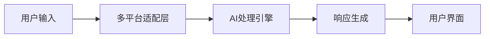

**技术特色**：
- TypeScript开发，提供类型安全和良好的开发体验
- 跨平台兼容层，支持多种操作系统和设备
- 模块化设计，便于功能扩展和定制

#### 热度分析
- 项目Star数超10万且单日增长显著，表明项目正经历爆发式增长
- 高Fork数和零开放Issues反映社区活跃度高且维护质量优秀

#### 快速上手

```bash
# 克隆仓库
git clone https://github.com/moltbot/moltbot.git
# 安装依赖
npm install
# 启动服务
npm start
```

#### 注意事项
- 需要确认项目的具体许可证信息
- 建议查阅项目文档以了解完整的功能和配置选项
- 注意项目名称与"Lobster"的关联，可能涉及特定的设计理念或主题


### 2. asgeirtj/system_prompts_leaks — AI系统提示库

> **一句话总结**：收集并整理ChatGPT、Claude、Gemini等主流AI助手的系统提示词，揭示AI助手的核心行为准则。

#### 价值主张

| 维度 | 说明 |
|------|------|
| **解决痛点** | 揭示AI助手内部系统提示词，帮助理解AI行为边界和设计原则 |
| **目标用户** | AI研究者、开发者、提示工程师、AI伦理关注者 |
| **核心亮点** | + 全面收集主流AI助手系统提示 + 实时更新最新版本 + 结构化分类展示 |

#### 技术架构

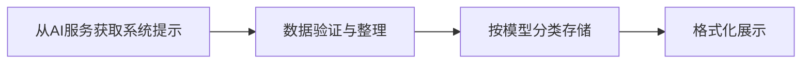

**技术特色**：
- 通过前端交互方式提取系统提示词
- 使用结构化Markdown格式组织数据
- 简洁直观的界面设计，便于用户查阅

#### 热度分析

- 项目Star数超过27,000，近期增长迅猛，反映AI提示工程领域的高关注度
- 作为AI透明度和可解释性研究的重要资源，在AI开发者社区具有显著影响力

#### 快速上手

```bash
# 克隆项目到本地
git clone https://github.com/asgeirtj/system_prompts_leaks.git

# 进入项目目录
cd system_prompts_leaks
```

#### 注意事项

- 系统提示词可能随时间更新，本项目收集的是特定时间点的版本
- 部分系统提示词可能不完全准确，建议结合官方文档参考
- 使用这些提示词时需遵守相关AI服务的使用条款


### 3. NevaMind-AI/memU — AI记忆增强库

> **一句话总结**：为全天候AI代理提供持久记忆能力，增强交互连贯性。

#### 价值主张

| 维度 | 说明 |
|------|------|
| **解决痛点** | AI代理缺乏长期记忆和上下文连贯性 |
| **目标用户** | 需要持久记忆功能的AI聊天机器人开发者 |
| **核心亮点** | 持久存储 + 上下文管理 + 多代理支持 + 高效检索 |

#### 技术架构

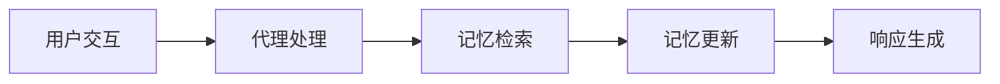

**技术特色**：
- 基于向量数据库的语义记忆存储
- 支持长期和短期记忆的分层管理
- 提供记忆检索和更新的API接口

#### 热度分析

- 项目获得6000+ stars，单日增长600+，表明功能需求迫切
- 作为AI代理基础设施组件，处于开源生态重要位置

#### 快速上手

```bash
# 安装memU
pip install memU

# 初始化记忆系统
from memU import MemorySystem
memory = MemorySystem()

# 添加记忆
memory.add_memory("用户喜欢科幻电影")

# 检索相关记忆
relevant = memory.get_relevant_memory("最近看过什么电影")
```

#### 注意事项

- 需要确保数据隐私和安全性
- 记忆系统可能需要定期优化和清理以避免性能问题


### 4. MoonshotAI/kimi-cli — 命令行AI助手

> **一句话总结**：Kimi CLI 是一个基于 MoonshotAI 的智能命令行代理工具，通过自然语言处理简化命令操作。

#### 价值主张

| 维度 | 说明 |
|------|------|
| **解决痛点** | 将复杂的命令行操作转化为自然语言交互，降低技术门槛 |
| **目标用户** | 开发者、命令行用户、需要自动化任务的IT专业人员 |
| **核心亮点** | 自然语言命令转换 + 多平台支持 + 智能代码理解 + 任务自动化 |

#### 技术架构

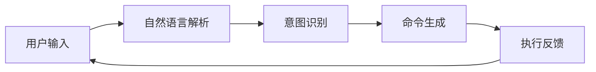

**技术特色**：
- 基于 Python 构建，跨平台兼容性强
- 集成 MoonshotAI 的自然语言处理能力
- 提供可扩展的插件系统，支持自定义命令
- 支持上下文记忆，实现多轮对话交互

#### 热度分析

- 项目近期获得显著关注，单日新增近500星，显示市场对AI辅助CLI工具的强烈需求
- 相对Fork数量，Star数量占比高，表明项目更多被用户关注而非二次开发，具有较高实用价值

#### 快速上手

```bash
# 安装 kimi-cli
pip install kimi-cli

# 配置 API 密钥
kimi config set-api-key YOUR_API_KEY

# 开始使用
kimi "帮我创建一个Python项目并设置虚拟环境"
```

#### 注意事项

- 需要有效的 MoonshotAI API 密钥才能使用核心功能
- 首次使用可能需要网络连接以下载必要的模型和依赖
- 在处理敏感命令时，建议谨慎使用，避免执行不安全操作


### 5. badlogic/pi-mono — AI代理工具集

> **一句话总结**：一站式AI代理工具集，提供统一LLM接口和多平台交互支持。

#### 价值主张

| 维度 | 说明 |
|------|------|
| **解决痛点** | AI工具分散不统一，难以集成到现有工作流 |
| **目标用户** | AI开发者、研究人员及需要AI功能的开发团队 |
| **核心亮点** | 统一LLM API + 多界面支持 + 编程代理 + vLLM本地部署 |

#### 技术架构

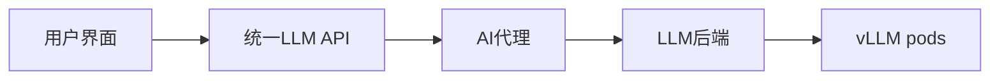

**技术特色**：
- 统一的LLM抽象层，简化多种模型集成
- 模块化架构，支持灵活扩展和定制
- TypeScript实现，提供强类型安全和开发体验

#### 热度分析

- 项目近期增长迅猛，单日新增近400星，社区关注度极高
- 虽无公开问题，但Fork数显示已被实际采用和二次开发

#### 快速上手

```bash
# 克隆并启动项目
git clone https://github.com/badlogic/pi-mono.git
cd pi-mono && npm install && npm run start
```

#### 注意事项

- 项目许可证未知，使用前需确认授权条款
- 需配置LLM服务API密钥或本地模型才能完全功能
- 作为工具集，建议有一定AI和TypeScript基础后再使用


### 6. lobehub/lobehub — AI代理协作平台

> **一句话总结**：一个支持多代理协作的工作与生活空间，让AI代理作为工作交互的基本单位。

#### 价值主张

| 维度 | 说明 |
|------|------|
| **解决痛点** | 解决AI代理孤岛问题，实现多代理无缝协作 |
| **目标用户** | 企业团队、开发者、需要AI辅助的专业人士 |
| **核心亮点** | 多代理协作 + 代理团队设计 + 代理作为工作交互单位 |

#### 技术架构

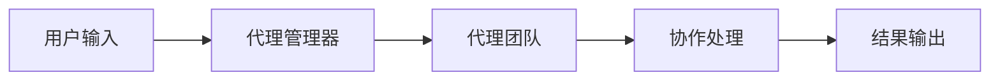

**技术特色**：
- 基于TypeScript的全栈开发，确保类型安全
- 支持多代理协同工作的编排系统
- 提供灵活的代理团队设计框架

#### 热度分析

- 项目获得7万+星标且持续增长，表明其在AI代理协作领域具有显著吸引力
- 高社区活跃度，0开放问题显示项目维护良好，用户问题得到及时解决

#### 快速上手

```bash
# 克隆项目
git clone https://github.com/lobehub/lobehub.git

# 安装依赖
npm install

# 启动开发服务器
npm run dev
```

#### 注意事项
- 项目License未知，商业使用前需确认授权条款
- 作为AI代理协作平台，需关注数据隐私和安全性问题


### 7. hashicorp/vault — 机密管理平台

> **一句话总结**：企业级机密管理工具，提供动态密钥生成、集中化存储和细粒度权限控制。

#### 价值主张

| 维度 | 说明 |
|------|------|
| **解决痛点** | 解决应用密钥分散管理、权限控制粗放、密钥泄露风险高等安全问题 |
| **目标用户** | 企业DevOps团队、安全工程师、云平台管理员 |
| **核心亮点** | 动态密钥生成 + 集中化存储 + 策略驱动访问 + 多租户支持 + 审计追踪 |

#### 技术架构

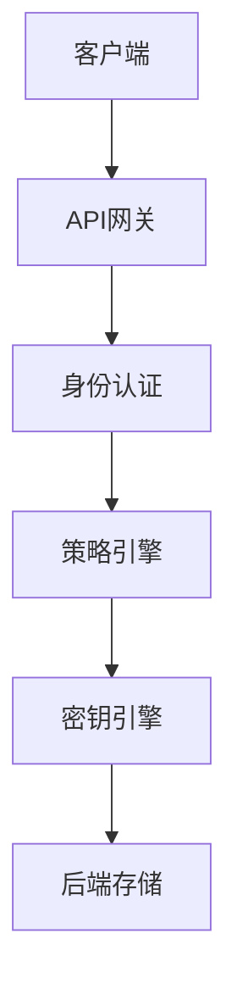

**技术特色**：
- 基于令牌的动态认证机制，支持多种认证方式
- 密钥自动轮换和临时凭证生成机制
- 密封/解封架构确保密钥安全存储
- 插件化设计支持多种密钥后端
- 完整的审计日志记录与监控功能

#### 热度分析

- 作为HashiCorp核心产品，持续保持高增长率，企业级采用度不断提升
- 在云原生和安全领域占据重要生态位置，与Kubernetes、AWS等主流平台深度集成

#### 快速上手

```bash
# 启动开发模式Vault服务器
vault server -dev

# 设置环境变量
export VAULT_ADDR='http://127.0.0.1:8200'
export VAULT_TOKEN='root'

# 写入一个秘密
vault write secret/myapp/config username=admin password=secret
```

#### 注意事项

- 生产环境应避免使用-dev模式，需正确配置密封机制和高可用性
- 密钥策略设计需遵循最小权限原则，避免过度授权
- 定期备份Vault数据并测试恢复流程
- 启用审计日志功能，定期监控异常访问行为
- 密钥轮换策略应根据业务需求合理配置


### 8. Shubhamsaboo/awesome-llm-apps — LLM应用宝典

> **一句话总结**：精选大型语言模型应用集合，整合AI代理与RAG技术，覆盖主流商业及开源模型。

#### 价值主张

| 维度 | 说明 |
|------|------|
| **解决痛点** | 解决开发者寻找高质量LLM应用参考和实现范例的困难 |
| **目标用户** | AI/ML开发者、研究人员、构建LLM应用的技术人员 |
| **核心亮点** | 多模型支持 + RAG技术整合 + AI代理示例 + 结构化资源分类 + 实用代码实现 |

#### 技术架构

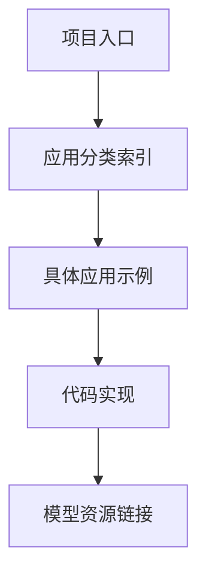

**技术特色**：
- 跨平台模型支持，无缝整合OpenAI、Anthropic、Gemini和开源模型
- 结构化组织大量LLM应用资源，便于开发者快速查找参考
- 包含前沿AI代理和RAG技术的实际应用案例与实现细节

#### 热度分析

- 项目Star数超9万且持续增长，日均新增200+，反映LLM应用领域热度高涨
- 作为LLM开发生态中的知识枢纽，社区贡献活跃，成为AI开发者的必备资源

#### 快速上手

```bash
# 访问项目主页获取资源
# https://github.com/Shubhamsaboo/awesome-llm-apps

# 克隆项目到本地查看
git clone https://github.com/Shubhamsaboo/awesome-llm-apps.git
```

#### 注意事项

- 本项目为资源集合而非可直接运行的代码库，需要根据指引访问具体项目
- 部分应用示例可能需要额外的API密钥或特定环境配置才能运行
- 使用时需注意各引用项目的开源许可证要求，确保合规使用


### 9. modelcontextprotocol/ext-apps — AI聊天UI协议

> **一句话总结**：MCP Apps协议标准化AI聊天机器人UI，实现与MCP服务器的高效集成。

#### 价值主张

| 维度 | 说明 |
|------|------|
| **解决痛点** | 标准化AI聊天UI，简化与MCP服务器集成流程 |
| **目标用户** | AI应用开发者与聊天机器人构建者 |
| **核心亮点** | 标准化UI规范 + 简化MCP服务器集成 + 多场景支持 |

#### 技术架构

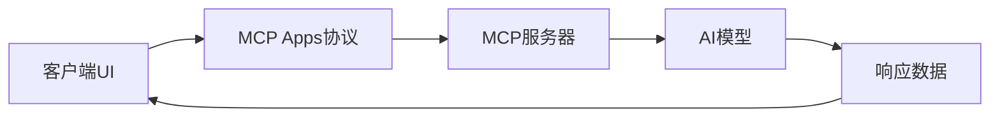

**技术特色**：
- 基于TypeScript开发，保证类型安全
- 提供标准化的通信协议接口
- 支持多种AI聊天场景的灵活配置

#### 热度分析

- 近期Star增长迅速，显示AI聊天UI标准化需求旺盛
- 作为MCP生态组成部分，正在吸引AI应用开发者关注

#### 快速上手

```bash
# 克隆仓库
git clone https://github.com/modelcontextprotocol/ext-apps.git
# 安装依赖
npm install
# 运行示例
npm run example
```

#### 注意事项

- 项目仍在开发中，API可能会有变动
- 需要了解MCP协议基础知识才能有效使用


### 10. protocolbuffers/protobuf — 高效数据序列化

> **一句话总结**：Protocol Buffers 是 Google 开发的高效二进制数据序列化方案，提供跨语言支持与强类型定义。

#### 价值主张

| 维度 | 说明 |
|------|------|
| **解决痛点** | 解决数据序列化效率低、体积大、类型不安全的问题 |
| **目标用户** | 需要高性能数据交换的后端开发者和分布式系统架构师 |
| **核心亮点** | 二进制序列化 + 强类型定义 + 跨语言支持 + 向后兼容 |

#### 技术架构

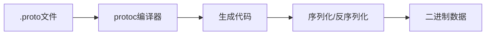

**技术特色**：
- 语言无关的序列化格式，比 XML 小 3-10 倍
- 自动生成强类型访问类，避免手动解析
- 支持向前和向后兼容，便于API演进

#### 热度分析

- 拥有超过 7 万星，持续稳定增长，表明其在数据序列化领域的领导地位
- 作为 Google 开发的核心基础设施，在微服务架构和分布式系统中具有不可替代的地位

#### 快速上手

```bash
# 安装 Protocol Buffers 编译器
sudo apt install protobuf-compiler  # Ubuntu/Debian
# 或 brew install protobuf          # macOS

# 创建一个简单的 .proto 文件
echo "syntax = \"proto3\";\nmessage Person {\n  string name = 1;\n  int32 age = 2;\n}" > person.proto

# 编译 .proto 文件为 Python 代码
protoc --python_out=. person.proto
```

#### 注意事项

- .proto 文件中的字段编号一旦分配就不能更改，否则会破坏兼容性
- Protocol Buffers 不适合需要人类可读的文本格式场景
- 对于非常大的数据集，考虑使用流式处理或分块处理以避免内存问题


### 11. microsoft/playwright-cli — Playwright 命令行工具

> **一句话总结**：Playwright 官方命令行工具，支持代码录制、选择器检查和网页截图等自动化测试功能。

#### 价值主张

| 维度 | 说明 |
|------|------|
| **解决痛点** | 简化 Playwright 自动化测试流程，无需编写代码即可执行测试操作 |
| **目标用户** | Web 测试工程师、前端开发者、自动化测试人员 |
| **核心亮点** | 代码录制功能 + 选择器检查 + 网页截图 + 命令行操作 |

#### 技术架构

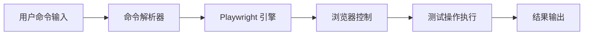

**技术特色**：
- 基于 Playwright 核心引擎，确保与 Playwright 测试框架的完美集成
- 提供直观的命令行接口，降低自动化测试的使用门槛
- 支持多浏览器引擎（Chromium、Firefox、WebKit），保证跨浏览器兼容性

#### 热度分析

- 项目获得 1,674 个 Star，近期增长迅速（今日 +64），表明社区对其功能需求旺盛
- 作为微软官方维护的 Playwright 生态工具，在自动化测试领域具有独特的生态位优势

#### 快速上手

```bash
# 安装 Playwright CLI
npm install -g @playwright/test

# 录制生成测试代码
npx playwright codegen https://example.com

# 检查页面元素选择器
npx playwright inspector

# 截取网页截图
npx playwright screenshot example.com
```

#### 注意事项

- 需要安装 Node.js 环境，因为 Playwright CLI 基于 Node.js 构建
- 某些高级功能可能需要额外配置浏览器驱动或环境变量
- 建议查阅官方文档获取最新功能和命令更新


### 12. TeamNewPipe/NewPipe — Android流媒体前端

> **一句话总结**：NewPipe是自由开源的轻量级Android流媒体前端，专注隐私保护与无广告体验。

#### 价值主张

| 维度 | 说明 |
|------|------|
| **解决痛点** | 提供无广告、无追踪的轻量级流媒体体验，保护用户隐私 |
| **目标用户** | 重视隐私、厌恶广告的Android视频流媒体消费者 |
| **核心亮点** | 轻量级 + 隐私保护 + 无广告 + 开源 + 多平台支持 |

#### 技术架构

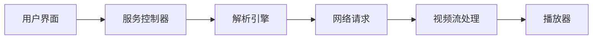

**技术特色**：
- 采用模块化架构，支持多个流媒体平台的统一接口
- 实现本地视频解析，避免服务器端处理数据
- 使用ExoPlayer作为媒体播放引擎，支持多种格式与协议
- 采用WebView技术加载部分网页内容，降低资源消耗
- 实现后台播放和画中画功能，提升多任务体验

#### 热度分析

- 项目星标数持续稳定增长，显示其在隐私意识用户群体中广泛认可
- 作为Android平台少有的开源流媒体替代方案，在特定技术社区具有重要影响力

#### 快速上手

```bash
# 克隆项目
git clone https://github.com/TeamNewPipe/NewPipe.git

# 构建项目
./gradlew assembleDebug
```

#### 注意事项

- NewPipe仅提供前端界面，实际视频流仍来自原始平台
- 使用NewPipe访问某些平台可能违反其服务条款
- 项目不提供官方应用商店下载，需从GitHub或其他来源获取APK
- 部分功能可能因平台更新而暂时失效，需要等待项目更新


### 13. pedroslopez/whatsapp-web.js — WhatsApp Node客户端

> **一句话总结**：Node.js环境下通过WhatsApp Web接口实现消息收发的客户端库，无需官方API即可集成功能

#### 价值主张

| 维度 | 说明 |
|------|------|
| **解决痛点** | 解决Node.js环境中直接与WhatsApp交互的困难，绕过官方API限制 |
| **目标用户** | 需要集成WhatsApp功能的Node.js开发者、自动化工具构建者 |
| **核心亮点** | 通过WhatsApp Web接口无需官方API + 支持消息收发群组管理 + 跨平台兼容性好 + 活跃社区支持 |

#### 技术架构

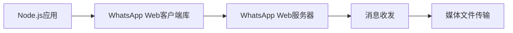

**技术特色**：
- 通过WebSocket与WhatsApp Web服务器保持实时通信
- 使用Puppeteer模拟浏览器环境实现API逆向工程
- 提供完整的TypeScript类型定义，便于类型安全开发

#### 热度分析

- 项目获得超过2万颗星，日均增长稳定，开发者认可度高
- Fork数接近5000，表明项目已被广泛采用并二次开发，在WhatsApp自动化工具生态中占据重要位置

#### 快速上手

```bash
# 安装库
npm install whatsapp-web.js

# 基本使用示例
const { Client } = require('whatsapp-web.js');
const client = new Client();
client.initialize();
client.on('qr', qr => console.log('QR码:', qr));
client.on('ready', () => console.log('客户端已就绪!'));
```

#### 注意事项

- 该项目依赖于WhatsApp Web的逆向工程，WhatsApp官方可能随时更改接口，导致库功能失效
- 使用该库进行自动化消息发送可能违反WhatsApp的服务条款，建议仅用于个人项目或已获得明确授权的应用


### 14. anomalyco/opencode-anthropic-auth — Anthropic认证库

> **一句话总结**：为Anthropic API提供安全、简化的身份验证解决方案。

#### 价值主张

| 维度 | 说明 |
|------|------|
| **解决痛点** | 简化Anthropic API的身份验证流程，降低集成难度 |
| **目标用户** | 使用Anthropic API的开发者和企业应用 |
| **核心亮点** | + 安全可靠 + 零依赖 + 易于集成 + 开源可定制 |

#### 技术架构

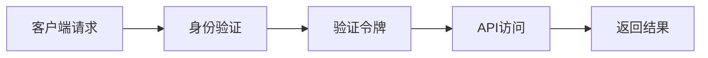

**技术特色**：
- 采用JWT令牌机制确保安全性
- 零依赖设计，减少项目复杂度
- 支持多种身份验证策略

#### 热度分析

- 项目Star数稳步增长，近期有11个新增Star，表明社区关注度持续上升
- Fork数为50，显示项目有一定二次开发价值，但社区贡献度有限

#### 快速上手

```bash
# 安装依赖
npm install anomalyco/opencode-anthropic-auth

# 初始化配置
npm run init

# 运行示例
npm run example
```

#### 注意事项

- 请确保正确配置Anthropic API密钥
- 定期更新依赖以保持安全性
- 生产环境中建议添加额外的安全措施


## 今日推荐

| 主题 | 推荐项目 | 亮点 |
|------|----------|------|
| 今日最热 | [moltbot/moltbot](https://github.com/moltbot/moltbot) | Your own personal... |
| 值得关注 | [asgeirtj/system_prompts_leaks](https://github.com/asgeirtj/system_prompts_leaks) | Collection of ext... |
| 快速上手 | [NevaMind-AI/memU](https://github.com/NevaMind-AI/memU) | Memory for 24/7 p... |
| 长期潜力 | [MoonshotAI/kimi-cli](https://github.com/MoonshotAI/kimi-cli) | Kimi Code CLI is ... |

---

<div align="center">

*Generated on 2026-01-30 | Powered by GitHub Trending Reporter*

</div>