## 今日热点

AI代理与助手工具今日热度飙升，跨平台AI助手openclaw爆火，多代理协作平台lobehub获大量关注，显示AI助手向个人化与协作化方向演进。

---

## 热门项目一览

| 排名 | 项目 | 语言 | 今日 | 总计 | 简介 |
|:---:|------|:----:|------:|-----:|------|
| 1 | [openclaw/openclaw](https://github.com/openclaw/openclaw) | TypeScript | +14,228 | 119,686 | Your own personal AI assist... |
| 2 | [asgeirtj/system_prompts_leaks](https://github.com/asgeirtj/system_prompts_leaks) | JavaScript | +1,083 | 28,575 | Collection of extracted Sys... |
| 3 | [NevaMind-AI/memU](https://github.com/NevaMind-AI/memU) | Python | +465 | 6,469 | Memory for 24/7 proactive a... |
| 4 | [MoonshotAI/kimi-cli](https://github.com/MoonshotAI/kimi-cli) | Python | +377 | 5,300 | Kimi Code CLI is your next ... |
| 5 | [lobehub/lobehub](https://github.com/lobehub/lobehub) | TypeScript | +376 | 71,561 | The ultimate space for work... |
| 6 | [Shubhamsaboo/awesome-llm-apps](https://github.com/Shubhamsaboo/awesome-llm-apps) | Python | +365 | 91,219 | Collection of awesome LLM a... |
| 7 | [badlogic/pi-mono](https://github.com/badlogic/pi-mono) | TypeScript | +285 | 3,755 | AI agent toolkit: coding ag... |
| 8 | [hashicorp/vault](https://github.com/hashicorp/vault) | Go | +227 | 34,820 | A tool for secrets manageme... |
| 9 | [microsoft/playwright-cli](https://github.com/microsoft/playwright-cli) | Unknown | +207 | 1,926 | CLI for common Playwright a... |
| 10 | [modelcontextprotocol/ext-apps](https://github.com/modelcontextprotocol/ext-apps) | TypeScript | +195 | 1,015 | Official repo for spec & SD... |
| 11 | [TeamNewPipe/NewPipe](https://github.com/TeamNewPipe/NewPipe) | Java | +122 | 36,874 | A libre lightweight streami... |
| 12 | [pedroslopez/whatsapp-web.js](https://github.com/pedroslopez/whatsapp-web.js) | JavaScript | +113 | 20,848 | A WhatsApp client library f... |

---

## 趋势洞察

```
┌─────────────────────────────────────────────────────────────────┐
│  AI/ML 工具         ████████████████████████  8 个项目        │
│  开发工具             ██████                    2 个项目        │
│  媒体资源             ███                       1 个项目        │
│  项目管理             ███                       1 个项目        │
│  数据分析             ███                       1 个项目        │
│  安全工具             ███                       1 个项目        │
└─────────────────────────────────────────────────────────────────┘
```

---

## 项目深度解读

### 1. openclaw/openclaw — 跨平台AI助手

> **一句话总结**：一个跨平台的个人AI助手，支持任何操作系统，以龙虾方式运行。

#### 价值主张

| 维度 | 说明 |
|------|------|
| **解决痛点** | 打破平台限制，提供统一的AI助手体验 |
| **目标用户** | 需要跨平台AI辅助的个人开发者和普通用户 |
| **核心亮点** | 跨平台兼容 + 开源可定制 + 个人化AI助手 |

#### 技术架构

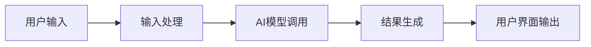

**技术特色**：
- 使用TypeScript开发，提供类型安全和跨平台能力
- 跨平台架构设计，支持Windows、macOS和Linux
- 开源架构，允许用户自定义和扩展功能

#### 热度分析

- 项目Star数高达119,686，单日增长14,228，显示极高的用户关注度和采用率
- Fork数16,916表明社区活跃度高，用户积极参与项目贡献和定制

#### 快速上手

```bash
# 克隆仓库
git clone https://github.com/openclaw/openclaw.git

# 安装依赖
npm install

# 运行应用
npm start
```

#### 注意事项

- 项目许可证未知，使用前需确认开源协议
- 作为AI助手项目，可能需要配置API密钥或模型访问权限
- 项目名称中的"lobster"可能暗示独特的交互方式或设计理念


### 2. asgeirtj/system_prompts_leaks — AI提示词库

> **一句话总结**：收集并整理主流聊天机器人的系统提示词，为开发者和研究人员提供AI行为参考

#### 价值主张

| 维度 | 说明 |
|------|------|
| **解决痛点** | 提供集中访问主流AI模型系统提示的途径，解决信息分散问题 |
| **目标用户** | AI开发者、研究人员、提示词工程师和AI伦理研究者 |
| **核心亮点** | 覆盖主流AI模型 + 持续更新维护 + 结构化组织展示 |

#### 技术架构

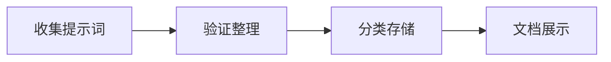

**技术特色**：
- 轻量级JavaScript实现，便于快速访问
- 结构化组织提示词，便于查找和比较
- 简洁的用户界面，专注于内容展示

#### 热度分析

- 项目获得28k+星标且持续高增长(+1k今日)，显示AI提示词研究需求旺盛
- 零开放Issues表明项目维护高效，社区贡献稳定，在AI研究生态中具有重要参考价值

#### 快速上手

```bash
# 克隆仓库
git clone https://github.com/asgeirtj/system_prompts_leaks.git

# 查看README获取完整提示词列表
cat README.md
```

#### 注意事项

- 提示词可能随AI模型更新而变化，需关注项目最新更新
- 项目许可证未知，商业使用前需确认授权情况
- 使用这些提示词时应遵守相关AI服务提供商的使用条款


### 3. NevaMind-AI/memU — AI代理记忆系统

> **一句话总结**：为持续运行的AI代理提供长期记忆和上下文保持功能，实现24/7主动智能。

#### 价值主张

| 维度 | 说明 |
|------|------|
| **解决痛点** | 解决AI代理缺乏长期记忆和上下文维持的问题 |
| **目标用户** | 开发24/7持续运行AI代理的开发者和研究人员 |
| **核心亮点** | 长期记忆存储 + 上下文管理 + 持续运行支持 |

#### 技术架构

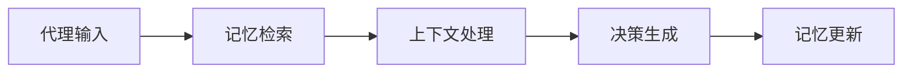

**技术特色**：
- 基于Python实现的轻量级记忆管理系统
- 支持分布式记忆存储和高效检索
- 为AI代理提供持久化记忆能力

#### 热度分析

- 项目单日增长465星标，表明在AI代理领域受到高度关注
- 作为AI代理基础设施组件，在AI开发生态中具有重要战略位置

#### 快速上手

```bash
# 克隆项目
git clone https://github.com/NevaMind-AI/memU.git
cd memU

# 安装依赖
pip install -r requirements.txt
```

#### 注意事项

- 项目许可证未知，使用前需确认授权条款
- 需要与具体AI代理框架集成使用，可能需要额外配置
- 项目API可能处于迭代中，关注更新日志以了解变更


### 4. MoonshotAI/kimi-cli — 智能CLI助手

> **一句话总结**：Kimi CLI是AI驱动的命令行助手，将自然语言转换为高效终端操作。

#### 价值主张

| 维度 | 说明 |
|------|------|
| **解决痛点** | 简化复杂命令行操作，降低技术门槛，提高效率 |
| **目标用户** | 开发者、运维人员和终端用户 |
| **核心亮点** | AI理解自然语言 + 智能命令生成 + 安全执行控制 + 多平台兼容 |

#### 技术架构

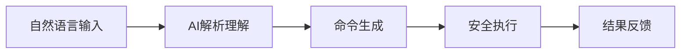

**技术特色**：
- 基于大语言模型的意图识别和命令映射
- 沙盒环境确保命令执行安全性
- 上下文记忆实现连续对话式操作

#### 热度分析

- 项目5300星标且单日增长377，显示AI辅助工具领域热度攀升
- 0开放问题与高fork数表明项目维护良好且社区参与积极

#### 快速上手

```bash
# 安装kimi-cli
pip install kimi-cli

# 配置API密钥
kimi-cli config --api-key YOUR_API_KEY

# 使用示例
kimi-cli "帮我查找当前目录下所有大于1MB的文件"
```

#### 注意事项

- 需要有效的API密钥才能使用AI功能
- 执行系统级命令前建议先预览确认
- 确保网络连接以正常调用AI服务


### 5. lobehub/lobehub — 下一代 AI 智能体协作生态

> **一句话总结**：一个集成了多模态交互与插件系统的 AI 智能体工作区，致力于通过多智能体协作重新定义人机交互与生产力模式。

#### 价值主张

| 维度 | 说明 |
|------|------|
| **解决痛点** | 解决单一 LLM 能力受限、私有化部署门槛高以及缺乏可视化多智能体协作编排的痛点。 |
| **目标用户** | AI 应用开发者、追求极致效率的生产力极客、以及需要定制化 AI 工作流的企业团队。 |
| **核心亮点** | 多智能体协作编排 + 可视化角色设计 + 插件生态市场 + 本地数据隐私优先 |

#### 技术架构

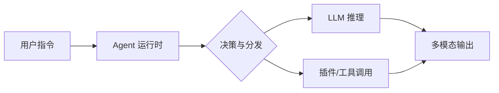

**技术特色**：
- **全栈 TypeScript 生态**：基于 Next.js 构建的前后端一体化架构，保证了类型安全与开发效率。
- **模块化 Agent 设计**：采用高内聚低耦合的架构，支持动态加载各类工具插件与自定义角色设定。
- **本地优先策略**：核心数据存储于浏览器端（IndexedDB），兼顾隐私安全与云端同步能力。

#### 热度分析

- Star 数突破 7.1 万且日增稳定，显示出项目在开源 AI 应用领域的极强号召力与生命力。
- Open Issues 为 0 并不意味着无问题，通常代表社区管理极强（即时关闭）或使用 Discussions 处理反馈，维护质量极高。

#### 快速上手

```bash
# 克隆仓库
git clone https://github.com/lobehub/lobehub.git
cd lobehub

# 安装依赖并启动
pnpm install
pnpm dev
```

#### 注意事项

- 项目依赖复杂，强烈建议使用 pnpm 作为包管理器以避免依赖幽灵问题。
- 若需使用完整 AI 功能，需在配置文件中自行接入 OpenAI 或其他兼容协议的 API Key。


### 6. Shubhamsaboo/awesome-llm-apps — 精选LLM应用集合

> **一句话总结**：整合AI Agents与RAG技术的优秀LLM应用案例，支持多模型实现的资源宝库。

#### 价值主张

| 维度 | 说明 |
|------|------|
| **解决痛点** | 开发者难以系统性地找到高质量、多样化的LLM应用实现方案 |
| **目标用户** | LLM应用开发者、AI研究人员、企业技术团队 |
| **核心亮点** | 多模型支持 + 实际案例集合 + RAG技术应用 + 开源实现 + 持续更新 |

#### 技术架构

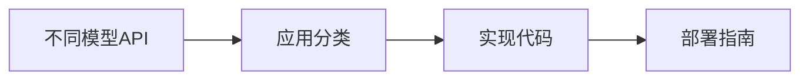

**技术特色**：
- 整合OpenAI、Anthropic、Gemini及开源模型方案
- 结构化分类展示不同应用场景与实现路径
- 提供可直接参考的完整代码示例

#### 热度分析

- Star数超9万且持续增长，反映LLM应用开发需求旺盛
- 作为资源集合项目，在AI开发社区具有权威参考价值

#### 快速上手

```bash
# 访问项目主页获取完整列表
# https://github.com/Shubhamsaboo/awesome-llm-apps

# 克隆项目到本地
git clone https://github.com/Shubhamsaboo/awesome-llm-apps.git
```

#### 注意事项

- 项目内容持续更新，需关注最新进展以获取最新应用案例
- 不同应用可能需要不同的API密钥和依赖环境配置
- 部分高级应用可能需要一定的AI技术背景才能完全理解和部署


### 7. badlogic/pi-mono — AI代理工具包

> **一句话总结**：全栈AI代理开发工具集，提供统一LLM接口和多平台部署能力。

#### 价值主张

| 维度 | 说明 |
|------|------|
| **解决痛点** | 碎片化AI工具整合困难，缺乏统一开发框架 |
| **目标用户** | AI应用开发者、企业AI解决方案提供商 |
| **核心亮点** | 统一LLM API + 多平台UI组件库 + 编码代理CLI + Slack集成 |

#### 技术架构

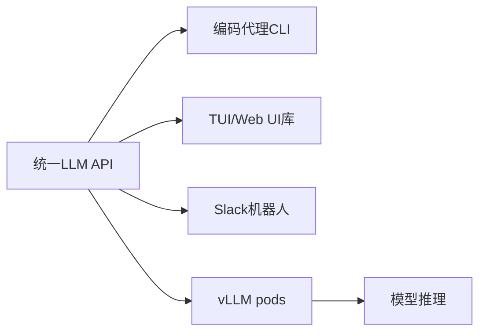

**技术特色**：
- 统一的LLM抽象层，支持多种模型后端
- 模块化设计，各组件可独立部署
- 支持从CLI到完整UI的多种交互方式

#### 热度分析

- 项目获得3,755星，单日增长285，显示强劲增长势头
- 零开放问题表明项目维护积极，用户反馈渠道可能已转向其他平台

#### 快速上手

```bash
# 安装项目
npm install -g pi-mono

# 启动编码代理
pi-mono code-agent

# 启动Web UI
pi-mono web-ui

# 配置Slack机器人
pi-mono slack-bot --token <your-token>
```

#### 注意事项
- 项目许可证未知，商业使用前需确认授权方式
- vLLM pods可能需要额外的GPU资源部署
- 与具体LLM提供商的API集成可能需要额外配置


### 8. hashicorp/vault — [企业密钥管家]

> **一句话总结**：企业级密钥管理工具，提供集中化、动态且安全的密钥存储与访问控制。

#### 价值主张

| 维度 | 说明 |
|------|------|
| **解决痛点** | 解决企业密钥分散管理、安全风险高、权限控制复杂的问题 |
| **目标用户** | 企业DevOps团队、安全工程师、云服务管理员 |
| **核心亮点** | 动态密钥 + 多后端支持 + 审计日志 + 策略引擎 + 高可用性 |

#### 技术架构

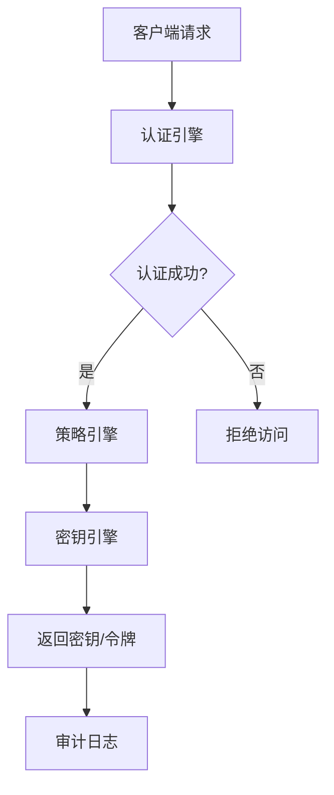

**技术特色**：
- 支持多种认证方式，包括令牌、LDAP、Kubernetes等
- 提供动态密钥生成，减少静态密钥暴露风险
- 采用密封/解封机制，确保数据安全

#### 热度分析

- Vault作为HashiCorp核心产品之一，持续保持高增长率，表明企业对密钥管理需求旺盛
- 在DevOps和云原生生态中占据重要位置，与Terraform、Nomad等产品形成生态协同

#### 快速上手

```bash
# 启动开发模式Vault服务器
vault server -dev -dev-root-token-id=root

# 设置环境变量
export VAULT_ADDR='http://127.0.0.1:8200'
export VAULT_TOKEN=root

# 写入一个密钥
vault write secret/hello value=world

# 读取密钥
vault read secret/hello
```

#### 注意事项

- Vault部署后需要妥善保管unseal keys和root token，丢失将导致数据无法访问
- 生产环境应配置高可用模式，避免单点故障
- 定期审计日志和配置策略，确保安全合规


### 9. microsoft/playwright-cli — Playwright测试CLI工具

> **一句话总结**：提供命令行界面，简化Playwright测试流程，支持代码录制、选择器检查和截图功能。

#### 价值主张

| 维度 | 说明 |
|------|------|
| **解决痛点** | 简化Playwright常用操作，无需编写复杂代码即可执行测试任务 |
| **目标用户** | Web测试工程师、自动化测试开发者、前端开发者 |
| **核心亮点** | + 命令行操作简化测试流程 + 支持代码录制和生成 + 内置选择器检查工具 |

#### 技术架构

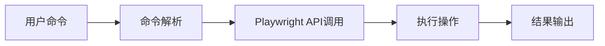

**技术特色**：
- 基于Playwright核心API构建，确保功能完整性
- 模块化命令设计，便于扩展新功能
- 内置智能选择器生成和验证机制

#### 热度分析

- 项目获得近2K星标，单日增长超过200，表明开发者社区对此CLI工具需求强烈
- 作为微软官方维护的Playwright生态组件，在自动化测试领域具有重要生态位置

#### 快速上手

```bash
# 安装
npm install -g @playwright/test

# 录制生成代码
npx playwright codegen https://example.com

# 检查页面元素
npx playwright inspect https://example.com
```

#### 注意事项

- 需要Node.js环境支持
- 某些高级功能可能需要Playwright浏览器支持
- 建议查阅官方文档获取最新命令和参数


### 10. modelcontextprotocol/ext-apps — AI聊天界面标准

> **一句话总结**：为AI聊天机器人提供标准化UI协议和SDK，实现与MCP服务器无缝集成。

#### 价值主张

| 维度 | 说明 |
|------|------|
| **解决痛点** | AI聊天界面缺乏统一标准，跨系统互操作困难，开发复杂度高 |
| **目标用户** | AI应用开发者、聊天机器人构建者、MCP服务器实现者 |
| **核心亮点** | 标准化UI协议 + 降低开发复杂度 + 确保跨系统兼容性 + 简化MCP集成 |

#### 技术架构

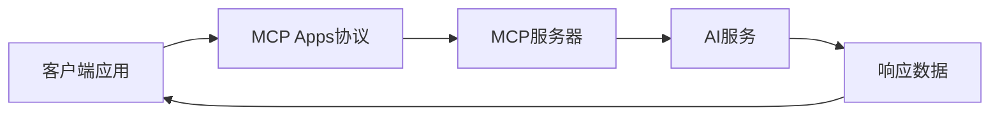

**技术特色**：
- 基于TypeScript开发，提供类型安全保障
- 采用标准化协议设计，确保广泛兼容性
- 提供完整SDK简化开发流程与集成工作

#### 热度分析

- 项目Star数达1015且单日增长195，显示社区高度关注和快速采用趋势
- 作为MCP生态系统关键组成部分，处于AI标准化技术前沿位置

#### 快速上手

```bash
# 克隆仓库
git clone https://github.com/modelcontextprotocol/ext-apps.git

# 安装依赖
npm install

# 构建项目
npm run build
```

#### 注意事项

- 项目仍在积极开发中，API可能发生变化
- 需要熟悉MCP协议基础才能有效使用
- 许可证信息不明确，使用前需确认授权条款


### 11. TeamNewPipe/NewPipe — 轻量安卓流媒体

> **一句话总结**：NewPipe是一款开源轻量的Android流媒体客户端，提供无广告的视频体验，尊重用户隐私。

#### 价值主张

| 维度 | 说明 |
|------|------|
| **解决痛点** | 提供无广告、隐私保护的流媒体体验，替代官方臃肿客户端 |
| **目标用户** | 注重隐私、厌恶广告、追求轻量体验的Android用户 |
| **核心亮点** | 轻量级 + 无广告 + 隐私保护 + 开源免费 + 多平台支持 |

#### 技术架构

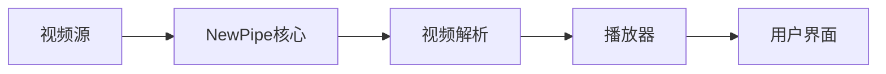

**技术特色**：
- 采用Extractors架构设计，支持多平台视频源解析
- 自定义播放器实现，无需依赖Google服务
- 轻量级设计，资源占用极低

#### 热度分析

- 项目Star数持续稳定增长，社区活跃度高，表明项目获得广泛认可
- 作为少数不依赖Google服务的开源视频应用，在隐私保护领域具有独特生态位置

#### 快速上手

```bash
# 克隆仓库
git clone https://github.com/TeamNewPipe/NewPipe.git

# 构建APK
./gradlew assembleDebug
```

#### 注意事项

- 此应用不依赖Google服务，可能无法播放某些需要DRM保护的内容
- 部分国家/地区的视频源可能因地区限制无法访问
- 长时间使用可能需要定期更新以适应平台变化


### 12. pedroslopez/whatsapp-web.js — WhatsApp Web API

> **一句话总结**：Node.js 库通过 WhatsApp Web 接口实现消息收发、群组管理等功能，无需官方 API。

#### 价值主张

| 维度 | 说明 |
|------|------|
| **解决痛点** | 解决 Node.js 应用中无法直接与 WhatsApp 交互的难题 |
| **目标用户** | 需要自动化 WhatsApp 消息处理的开发者与集成者 |
| **核心亮点** | 无需官方 API + 支持消息收发 + 支持媒体文件 + 支持群组管理 + 支持状态更新 |

#### 技术架构

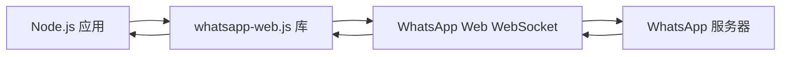

**技术特色**：
- 通过 WhatsApp Web 协议逆向工程实现无需官方 API 的连接
- 使用 Puppeteer 控制浏览器环境进行自动化操作
- 提供完整的 TypeScript 支持，增强类型安全性
- 支持多实例并发连接，适合高并发场景

#### 热度分析

- 项目 Star 数超过 20,000 且持续稳定增长，表明市场需求强劲
- Fork 数近 5,000，显示社区活跃度高，有大量二次开发或定制需求

#### 快速上手

```bash
# 安装
npm install whatsapp-web.js

# 基本使用示例
const { Client } = require('whatsapp-web.js');
const client = new Client();

client.initialize();
client.on('qr', qr => console.log('QR Code received:', qr));
client.on('ready', () => console.log('Client is ready!'));
client.on('message', message => console.log(message.body));
```

#### 注意事项

- 该库基于 WhatsApp Web 协议，可能违反 WhatsApp 服务条款
- WhatsApp 可能随时更新协议导致库失效
- 需要注意 WhatsApp 的使用限制，避免账号被封禁
- 建议仅在测试环境使用，生产环境需承担风险


### 13. anomalyco/opencode-anthropic-auth — Anthropic认证工具

> **一句话总结**：为Anthropic API提供开源认证解决方案，简化开发者接入流程。

#### 价值主张

| 维度 | 说明 |
|------|------|
| **解决痛点** | 解决开发者接入Anthropic API时认证配置复杂的问题 |
| **目标用户** | 需要集成Anthropic AI服务的开发者 |
| **核心亮点** + 简化配置流程 + 开源透明 + 安全认证机制 + 易于集成 |

#### 技术架构

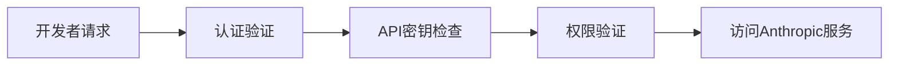

**技术特色**：
- 基于JavaScript实现，便于Web应用集成
- 采用安全密钥管理机制
- 提供灵活的认证中间件支持

#### 热度分析

- 项目获得350个Star，近期增长迅速（今日新增79个），表明社区关注度较高
- 零Open Issues，说明项目稳定性良好，或问题解决机制高效

#### 快速上手

```bash
# 安装依赖
npm install anomalyco/opencode-anthropic-auth

# 初始化认证
const AnthropicAuth = require('anomalyco/opencode-anthropic-auth');
const auth = new AnthropicAuth({ apiKey: 'your-api-key' });
```

#### 注意事项

- 由于项目描述为空，建议查看项目README获取详细使用说明
- 注意API密钥的安全存储，避免泄露
- 定期更新依赖以确保安全性


### 14. protocolbuffers/protobuf — 高效数据序列化

> **一句话总结**：Google开发的高效二进制序列化框架，比XML/JSON更小更快，支持多语言和自动代码生成。

#### 价值主张

| 维度 | 说明 |
|------|------|
| **解决痛点** | 解决数据序列化效率低、格式冗余、跨语言兼容性差的问题 |
| **目标用户** | 分布式系统开发者，微服务架构师，高性能应用开发者 |
| **核心亮点** | 高效二进制编码 + 强类型定义 + 跨语言支持 + 向后兼容性 + 自动代码生成 |

#### 技术架构

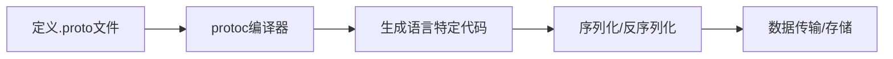

**技术特色**：
- 使用Varint编码和Tag-Length-Value格式，显著减少数据体积
- 支持字段默认值和可选字段，优化数据传输效率
- 提供完整的版本控制和兼容性保证机制

#### 热度分析

- 作为Google核心基础设施，保持稳定高星增长，证明其在序列化领域的领导地位
- 社区活跃度高，被Kubernetes、TensorFlow等顶级项目广泛采用

#### 快速上手

```bash
# 安装protoc编译器
sudo apt-get install protobuf-compiler

# 创建示例文件
echo 'syntax = "proto3"; message Person { string name = 1; int32 id = 2; }' > person.proto

# 生成C++代码
protoc --cpp_out=. person.proto
```

#### 注意事项

- 二进制格式不易人类阅读，调试时需转换为文本格式
- .proto文件变更时需重新编译代码，确保数据兼容性
- 对于频繁变更的数据结构，需谨慎设计字段编号避免破坏兼容性


## 今日推荐

| 主题 | 推荐项目 | 亮点 |
|------|----------|------|
| 今日最热 | [openclaw/openclaw](https://github.com/openclaw/openclaw) | Your own personal... |
| 值得关注 | [asgeirtj/system_prompts_leaks](https://github.com/asgeirtj/system_prompts_leaks) | Collection of ext... |
| 快速上手 | [NevaMind-AI/memU](https://github.com/NevaMind-AI/memU) | Memory for 24/7 p... |
| 长期潜力 | [MoonshotAI/kimi-cli](https://github.com/MoonshotAI/kimi-cli) | Kimi Code CLI is ... |

---

<div align="center">

*Generated on 2026-01-31 | Powered by GitHub Trending Reporter*

</div>