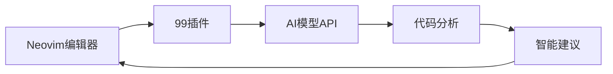
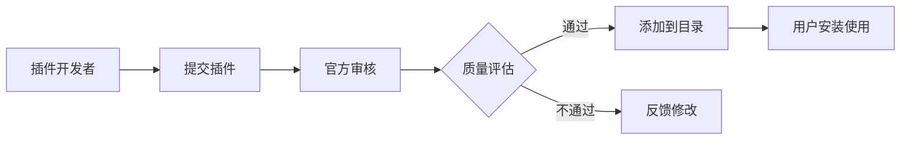
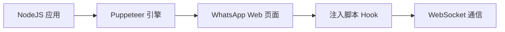
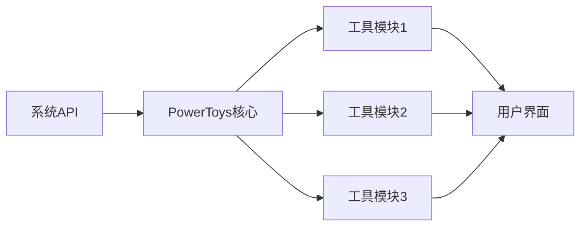
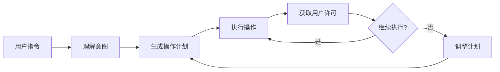
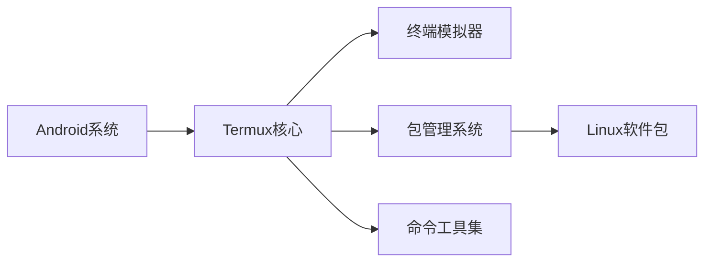

## 今日热点

AI代理助手爆发式增长，大模型优化与开发工具智能化成为GitHub今日主旋律，微软与Anthropic引领技术前沿。

---

## 热门项目一览

| 排名 | 项目 | 语言 | 今日 | 总计 | 简介 |
|:---:|------|:----:|------:|-----:|------|
| 1 | [openclaw/openclaw](https://github.com/openclaw/openclaw) | TypeScript | +14,780 | 132,745 | Your own personal AI assist... |
| 2 | [ThePrimeagen/99](https://github.com/ThePrimeagen/99) | Lua | +542 | 2,272 | Neovim AI agent done right |
| 3 | [microsoft/agent-lightning](https://github.com/microsoft/agent-lightning) | Python | +516 | 12,627 | The absolute trainer to lig... |
| 4 | [anthropics/claude-plugins-official](https://github.com/anthropics/claude-plugins-official) | Shell | +237 | 5,861 | Official, Anthropic-managed... |
| 5 | [PaddlePaddle/PaddleOCR](https://github.com/PaddlePaddle/PaddleOCR) | Python | +171 | 69,597 | Turn any PDF or image docum... |
| 6 | [microsoft/BitNet](https://github.com/microsoft/BitNet) | Python | +137 | 27,273 | Official inference framewor... |
| 7 | [pedroslopez/whatsapp-web.js](https://github.com/pedroslopez/whatsapp-web.js) | JavaScript | +137 | 20,997 | A WhatsApp client library f... |
| 8 | [reconurge/flowsint](https://github.com/reconurge/flowsint) | TypeScript | +120 | 2,135 | A modern platform for visua... |
| 9 | [AlexanderGrooff/mermaid-ascii](https://github.com/AlexanderGrooff/mermaid-ascii) | Go | +74 | 843 | Render Mermaid graphs insid... |
| 10 | [microsoft/PowerToys](https://github.com/microsoft/PowerToys) | C# | +46 | 128,748 | Microsoft PowerToys is a co... |
| 11 | [cline/cline](https://github.com/cline/cline) | TypeScript | +44 | 57,372 | Autonomous coding agent rig... |
| 12 | [termux/termux-app](https://github.com/termux/termux-app) | Java | +41 | 49,522 | Termux - a terminal emulato... |

---

## 趋势洞察

```
┌─────────────────────────────────────────────────────────────────┐
│  AI/ML 工具         ████████████████████████  9 个项目        │
│  开发工具             █████                     2 个项目        │
│  安全工具             ██                        1 个项目        │
└─────────────────────────────────────────────────────────────────┘
```

---

## 项目深度解读

### 1. openclaw/openclaw — 跨平台AI助手

> **一句话总结**：基于TypeScript开发的全平台个人AI助手，提供一致的用户体验和智能交互能力。

#### 价值主张

| 维度 | 说明 |
|------|------|
| **解决痛点** | 打破平台限制，提供跨操作系统的一致AI助手体验 |
| **目标用户** | 需要统一AI体验的开发者和技术爱好者 |
| **核心亮点** | 跨平台兼容性 + TypeScript实现 + 开源可定制 + 隐私保护 |

#### 技术架构


**技术特色**：
- 使用TypeScript确保类型安全和代码质量
- 模块化架构支持多平台无缝适配
- 开源设计允许社区贡献和功能扩展

#### 热度分析

- 项目Star数快速增长，单日增长超1.4万，显示社区高度关注
- Fork数适中，表明项目处于活跃发展阶段，有良好的社区参与度

#### 快速上手

```bash
# 克隆项目
git clone https://github.com/openclaw/openclaw.git

# 安装依赖
npm install

# 启动服务
npm start
```

#### 注意事项

- 项目许可证信息不明确，使用前需确认授权条款
- 建议查看项目文档了解具体功能配置和使用方法
- 0个Open Issues可能意味着问题管理方式特殊，建议通过其他渠道反馈问题


### 2. ThePrimeagen/99 — [Neovim AI助手]

> **一句话总结**：为 Neovim 实现的高效 AI 编程助手，提升开发效率与代码质量

#### 价值主张

| 维度 | 说明 |
|------|------|
| **解决痛点** | 解决 Neovim 中缺乏高效 AI 辅助编程工具的问题 |
| **目标用户** | Neovim 用户、AI 辅助编程爱好者、效率追求者 |
| **核心亮点** | Lua实现 + 深度Neovim集成 + 高效AI代理 + 简洁设计 |

#### 技术架构



**技术特色**：
- 基于 Lua 语言实现，与 Neovim 高度集成
- 采用轻量级设计，不增加过多系统负担
- 通过 API 与 AI 模型交互，提供智能编程辅助

#### 热度分析

- 项目获得 2,272 stars 且单日增长 542，表明社区对该项目高度关注
- 作为 ThePrimeagen 的作品，继承了他在开发者社区的高信誉度

#### 快速上手

```bash
# 克隆仓库
git clone https://github.com/ThePrimeagen/99.git

# 在 Neovim 中配置
:lua require('99').setup()
```

#### 注意事项

- 需要配置 AI API 密钥才能使用完整功能
- 可能需要较新的 Neovim 版本支持
- 项目许可证未知，使用时需注意版权问题
- 作为新兴项目，API 可能会有变动


### 3. microsoft/agent-lightning — AI代理训练框架

> **一句话总结**：微软推出的高效AI代理训练框架，简化复杂AI系统的开发流程。

#### 价值主张

| 维度 | 说明 |
|------|------|
| **解决痛点** | 简化AI代理的开发和训练流程，降低AI系统构建门槛 |
| **目标用户** | AI开发者、研究人员和企业构建AI应用团队 |
| **核心亮点** | 模块化设计 + 高性能训练 + 易于集成 + 微软背书 |

#### 技术架构


**技术特色**：
- 基于Python的高效训练框架
- 模块化组件设计，支持灵活组合
- 优化计算资源利用，加速训练过程

#### 热度分析

- 项目获得12k+星标且持续快速增长，表明AI代理开发领域需求旺盛
- 微软背书的项目在AI开发社区具有较高影响力和认可度

#### 快速上手

```bash
# 克隆项目
git clone https://github.com/microsoft/agent-lightning.git
cd agent-lightning

# 安装依赖
pip install -r requirements.txt

# 运行示例
python examples/basic_agent.py
```

#### 注意事项

- 项目许可证未知，商业使用前需确认授权条款
- 作为微软项目，可能依赖微软特定的云服务或生态系统
- 由于Issues为0，可能项目处于早期阶段或问题通过其他渠道处理


### 4. anthropics/claude-plugins-official — 官方插件目录

> **一句话总结**：Anthropic官方维护的高质量Claude插件目录，提供标准化插件开发与分发平台。

#### 价值主张

| 维度 | 说明 |
|------|------|
| **解决痛点** | 解决Claude插件发现难、质量参差不齐问题 |
| **目标用户** | Claude开发者、企业用户和AI应用构建者 |
| **核心亮点** | 官方认证 + 质量筛选 + 标准化接口 + 社区支持 |

#### 技术架构



**技术特色**：
- 基于Shell的轻量级插件管理脚本
- 标准化的插件认证与验证流程
- 插件目录自动更新与索引机制

#### 热度分析

- 项目获得5861 stars，今日增长237，表明Claude插件生态正处于快速发展阶段
- 作为官方目录项目，在Claude生态中具有核心枢纽地位，社区参与度高

#### 快速上手

```bash
# 克隆官方插件目录
git clone https://github.com/anthropics/claude-plugins-official.git
cd claude-plugins-official
# 查看可用插件列表
./plugins/list.sh
```

#### 注意事项

- 这是官方维护的项目，使用前请确保符合Anthropic的使用条款
- 插件可能需要特定的Claude版本才能正常工作
- 建议在使用任何插件前查看其安全性和隐私政策


### 5. PaddlePaddle/PaddleOCR — 多语言OCR工具包

> **一句话总结**：强大轻量级OCR工具，桥接图像/PDF与LLMs，支持100+语言转换结构化数据。

#### 价值主张

| 维度 | 说明 |
|------|------|
| **解决痛点** | 将非结构化图像/PDF转换为AI可用的结构化数据 |
| **目标用户** | 需要从图像/PDF提取数据的AI开发者和企业 |
| **核心亮点** | 支持100+语言 + 轻量级设计 + 桥接LLMs + 强大OCR能力 |

#### 技术架构


**技术特色**：
- 基于PaddlePaddle深度学习框架的OCR技术栈
- 支持多语言识别的先进算法模型
- 轻量级设计，适合多种部署环境

#### 热度分析

- Star数近7万，今日新增171，表明项目持续受到关注和认可
- 作为百度开源的OCR工具，在企业级AI文档处理领域具有重要生态位置

#### 快速上手

```bash
# 安装
pip install paddlepaddle paddleocr

# 使用
from paddleocr import PaddleOCR
ocr = PaddleOCR(use_angle_cls=True, lang="ch")
result = ocr.ocr('image.jpg', cls=True)
```

#### 注意事项

- 需要安装PaddlePaddle深度学习框架
- 对于不同语言需要设置相应的lang参数
- 模型文件可能较大，首次使用会自动下载


### 6. microsoft/BitNet — 1位LLM推理框架

> **一句话总结**：Microsoft官方1位大语言模型推理框架，通过极致量化技术实现高效低资源消耗的模型部署。

#### 价值主张

| 维度 | 说明 |
|------|------|
| **解决痛点** | 传统LLM资源消耗大、推理速度慢，难以在边缘设备部署的问题 |
| **目标用户** | 需要部署大语言模型但计算资源受限的开发者与企业 |
| **核心亮点** | 1位极致量化 + 微软官方支持 + 保持高性能 + 推理优化 + 资源节省 |

#### 技术架构


**技术特色**：
- 创新的1位权重量化技术，将模型压缩32倍
- 专为推理优化的计算路径，减少内存带宽需求
- 保持模型性能的同时显著降低计算资源消耗

#### 热度分析

- 项目27K+ stars且持续增长，显示1-bit LLM技术受到高度关注与期待
- 作为Microsoft官方框架，在模型量化领域占据生态核心位置，推动边缘AI发展

#### 快速上手

```bash
# 克隆仓库
git clone https://github.com/microsoft/BitNet.git
cd BitNet

# 安装依赖
pip install -e .

# 运行示例
python examples/benchmark.py
```

#### 注意事项

- 1位量化可能导致模型精度下降，需在特定场景评估性能影响
- 硬件兼容性要求较高，需确保支持特定指令集以获得最佳性能
- 作为新兴技术，API和功能可能快速迭代，关注版本更新日志


### 7. pedroslopez/whatsapp-web.js — NodeJS WhatsApp 自动化客户端

> **一句话总结**：基于 Puppeteer 模拟 WhatsApp Web 协议的 NodeJS 客户端，实现低成本消息自动化与聊天机器人构建。

#### 价值主张

| 维度 | 说明 |
|------|------|
| **解决痛点** | 解决官方 API 门槛高且收费昂贵的问题，提供基于 Web 协议的零成本自动化接入方案。 |
| **目标用户** | NodeJS 开发者、社群运营人员及需要构建自动化客服或消息通知系统的中小企业。 |
| **核心亮点** | Puppeteer 无头浏览器 + 模拟 Web 协议 + 丰富的 API 接口 + 支持多设备 |

#### 技术架构



**技术特色**：
- **Puppeteer 注入技术**：通过 Headless Chrome 运行 WhatsApp Web，注入 JS 获取内部函数调用权限。
- **事件驱动架构**：封装了完整的生命周期事件（QR码生成、认证、消息接收），开发体验流畅。
- **无协议依赖**：不需要对接复杂的二进制协议，直接模拟浏览器行为，维护成本相对较低但资源占用较高。

#### 热度分析

- 2万+ Star 数且保持每日增长，显示出市场对非官方 WhatsApp 自动化方案的巨大需求。
- Fork 数量庞大，社区活跃度高，拥有丰富的第三方插件生态和问题解决方案。

#### 快速上手

```bash
npm install whatsapp-web.js
```

```javascript
const { Client } = require('whatsapp-web.js');
const client = new Client();

client.on('qr', (qr) => {
    console.log('QR RECEIVED', qr);
    // 生成二维码供扫描
});

client.on('ready', () => {
    console.log('Client is ready!');
});

client.initialize();
```

#### 注意事项

- **封号风险**：该项目使用非官方协议，Meta 反作弊机制严格，频繁或大量发送消息极易导致账号被封禁。
- **资源消耗**：由于依赖 Chromium 运行，相比纯 API 库内存占用较高，不适合在低配 VPS 上大规模部署。
- **协议维护**：WhatsApp Web 更新可能导致库失效，需密切关注项目更新及时升级版本。


### 8. reconurge/flowsint — 可视化调查平台

> **一句话总结**：基于图形的可视化调查平台，为网络安全分析师提供灵活、可扩展的调查能力。

#### 价值主张

| 维度 | 说明 |
|------|------|
| **解决痛点** | 网络安全调查过程中缺乏直观、灵活的可视化工具 |
| **目标用户** | 网络安全分析师和数字取证调查人员 |
| **核心亮点** | 可视化界面 + 图形化调查 + 可扩展架构 + 协作功能 |

#### 技术架构


**技术特色**：
- 基于 TypeScript 开发，提供类型安全的前端体验
- 采用图形化界面，直观展示调查流程和数据关系
- 模块化架构设计，支持功能扩展和自定义

#### 热度分析

- 项目获得2135个星标，今日增长120，表明项目受到社区高度关注
- 零开放问题，显示项目维护状态良好，用户反馈渠道可能通过其他方式处理

#### 快速上手

```bash
# 克隆项目
git clone https://github.com/reconurge/flowsint.git

# 安装依赖
npm install

# 启动开发服务器
npm run dev
```

#### 注意事项

- 项目许可证未知，商业使用前需确认授权条款
- 作为专业安全工具，可能需要特定知识背景才能充分利用其功能


### 9. AlexanderGrooff/mermaid-ascii — [终端图表渲染]

> **一句话总结**：一款 Go 编写的工具，可在终端中直接渲染 Mermaid 图表，提升开发者文档阅读体验。

#### 价值主张

| 维度 | 说明 |
|------|------|
| **解决痛点** | 解决终端环境下无法直接查看图表的问题，提升文档可读性 |
| **目标用户** | 开发者、技术文档编写者、终端爱好者 |
| **核心亮点** | 纯终端渲染 + 轻量级 + 跨平台支持 |

#### 技术架构


**技术特色**：
- 使用 Go 语言实现，提供良好的跨平台兼容性
- 将 Mermaid 语法直接转换为 ASCII 字符，无需图形界面
- 轻量级设计，适合在资源受限的环境中运行

#### 热度分析

- 项目近期增长迅速，今日新增 74 个 Star，显示出社区对该工具的强烈兴趣
- Fork 数相对较少，表明项目可能处于早期阶段，社区贡献尚未大规模展开

#### 快速上手

```bash
# 安装
go install github.com/AlexanderGrooff/mermaid-ascii@latest

# 使用
mermaid-ascii "graph TD; A-->B; A-->C; B-->D; C-->D"
```

#### 注意事项

- 项目许可证信息不明确，商业使用前需确认授权方式
- 可能不支持所有 Mermaid 图表类型，复杂图表可能无法完美呈现


### 10. microsoft/PowerToys — Windows效率工具集

> **一句话总结**：微软官方打造的Windows系统增强工具集，提供多种实用工具提升系统使用效率和体验。

#### 价值主张

| 维度 | 说明 |
|------|------|
| **解决痛点** | Windows原生功能不足，需要额外工具提升工作效率和系统定制性 |
| **目标用户** | Windows高级用户、效率追求者和系统定制爱好者 |
| **核心亮点** | 系统增强工具集合 + 官方支持 + 开源免费 + 模块化设计 + 持续更新 |

#### 技术架构



**技术特色**：
- 基于.NET框架构建，利用C#语言实现跨版本Windows兼容
- 采用模块化设计，各工具可独立安装和运行
- 使用WPF构建现代化用户界面，提供流畅交互体验

#### 热度分析

- 项目Star数超12万，近期持续增长，表明Windows用户对系统增强工具需求旺盛
- 作为微软官方开源项目，在Windows生态系统中具有权威性和高关注度

#### 快速上手

```bash
# 使用winget安装PowerToys
winget install Microsoft.PowerToys

# 从GitHub Releases下载最新版本
# https://github.com/microsoft/PowerToys/releases
```

#### 注意事项

- PowerToys主要适用于Windows 10和Windows 11系统
- 部分高级功能可能需要管理员权限
- 建议从官方渠道下载，确保安全性


### 11. cline/cline — 智能编码助手

> **一句话总结**：IDE内嵌式自主编码助手，通过用户许可执行文件操作、命令执行和浏览器交互，提升开发效率。

#### 价值主张

| 维度 | 说明 |
|------|------|
| **解决痛点** | 解决开发中重复性编码任务和复杂操作自动化需求 |
| **目标用户** | 专业软件开发者和需要提高编码效率的技术人员 |
| **核心亮点** | IDE深度集成 + 用户每步许可 + 多功能操作支持 + 自主决策能力 |

#### 技术架构



**技术特色**：
- 基于大语言模型的代码理解与生成能力
- IDE深度集成，支持多语言环境
- 安全执行机制，每步操作需用户确认
- 跨平台支持，兼容主流开发环境

#### 热度分析

- 项目获得57k+高星，日增44星，表明开发者社区对AI编码助手需求强劲
- 无开放Issues可能表明项目成熟度高或问题处理机制高效，社区活跃度稳定

#### 快速上手

```bash
# 安装Cline扩展
vscode --install-extension cline.cline

# 配置API密钥
cline config set-api-key YOUR_API_KEY

# 在IDE中使用Ctrl+Shift+C启动Cline助手
```

#### 注意事项

- 需要配置有效的API密钥才能使用
- 执行文件操作和命令时需要仔细确认，避免意外修改
- 建议在非关键项目中先试用，确认可靠性后再用于重要工作


### 12. termux/termux-app — Android终端模拟器

> **一句话总结**：Termux是一个功能强大的Android终端模拟器，提供完整的Linux命令行环境和包管理系统。

#### 价值主张

| 维度 | 说明 |
|------|------|
| **解决痛点** | 解决Android设备缺乏原生命令行环境问题，提供Linux工具集 |
| **目标用户** | 开发者、系统管理员、Linux爱好者、需要命令行工具的Android用户 |
| **核心亮点** | 完整的Linux命令行环境 + 丰富的包管理系统 + 无需root权限 |

#### 技术架构



**技术特色**：
- 使用Android Termux API实现无需root的Linux环境
- 自定义包管理系统，支持apt命令和软件仓库
- 通过命名空间技术实现进程隔离和资源管理

#### 热度分析

- Star数近5万且持续增长，表明项目拥有庞大用户基础和社区支持
- 作为Android开发工具生态的重要组成部分，处于不可替代的技术位置

#### 快速上手

```bash
# 安装Termux应用
pkg update
pkg install python
```

#### 注意事项

- 需要在Android设置中允许Termux访问存储权限
- 某些Android版本可能需要额外配置才能正常工作
- 不建议用于需要root权限的敏感操作


## 今日推荐

| 主题 | 推荐项目 | 亮点 |
|------|----------|------|
| 今日最热 | [openclaw/openclaw](https://github.com/openclaw/openclaw) | Your own personal... |
| 值得关注 | [ThePrimeagen/99](https://github.com/ThePrimeagen/99) | Neovim AI agent d... |
| 快速上手 | [microsoft/agent-lightning](https://github.com/microsoft/agent-lightning) | The absolute trai... |
| 长期潜力 | [anthropics/claude-plugins-official](https://github.com/anthropics/claude-plugins-official) | Official, Anthrop... |

---

<div align="center">

*Generated on 2026-02-01 | Powered by GitHub Trending Reporter*

</div>