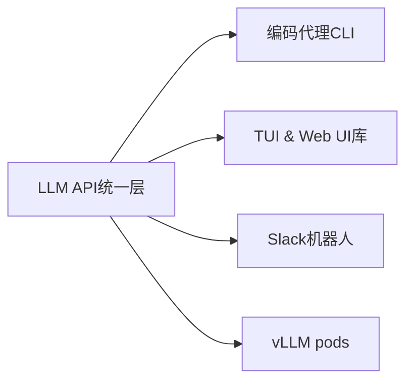
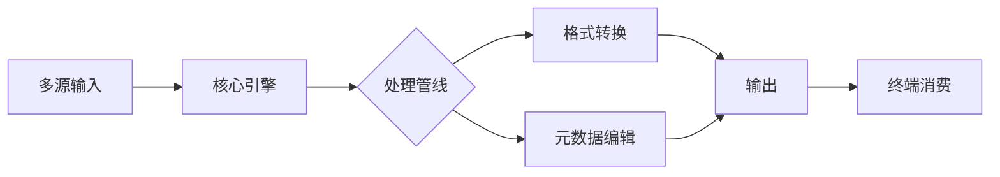

## 今日热点

AI代理与助手工具今日占据GitHub热榜，多平台个人AI助手和开发环境AI代理项目激增，显示开发者对智能化开发工具的强烈需求。

---

## 热门项目一览

| 排名 | 项目 | 语言 | 今日 | 总计 | 简介 |
|:---:|------|:----:|------:|-----:|------|
| 1 | [openclaw/openclaw](https://github.com/openclaw/openclaw) | TypeScript | +10,794 | 141,993 | Your own personal AI assist... |
| 2 | [ThePrimeagen/99](https://github.com/ThePrimeagen/99) | Lua | +781 | 2,745 | Neovim AI agent done right |
| 3 | [badlogic/pi-mono](https://github.com/badlogic/pi-mono) | TypeScript | +613 | 4,933 | AI agent toolkit: coding ag... |
| 4 | [microsoft/agent-lightning](https://github.com/microsoft/agent-lightning) | Python | +406 | 12,959 | The absolute trainer to lig... |
| 5 | [thedotmack/claude-mem](https://github.com/thedotmack/claude-mem) | TypeScript | +196 | 16,394 | A Claude Code plugin that a... |
| 6 | [steipete/CodexBar](https://github.com/steipete/CodexBar) | Swift | +99 | 3,910 | Show usage stats for OpenAI... |
| 7 | [j178/prek](https://github.com/j178/prek) | Rust | +61 | 4,248 | ⚡ Better `pre-commit`, re-e... |
| 8 | [pedramamini/Maestro](https://github.com/pedramamini/Maestro) | TypeScript | +49 | 963 | Agent Orchestration Command... |
| 9 | [vita-epfl/Stable-Video-Infinity](https://github.com/vita-epfl/Stable-Video-Infinity) | Python | +45 | 1,721 | [ICLR 26] Stable Video Infi... |
| 10 | [amantus-ai/vibetunnel](https://github.com/amantus-ai/vibetunnel) | TypeScript | +43 | 3,527 | Turn any browser into your ... |
| 11 | [kovidgoyal/calibre](https://github.com/kovidgoyal/calibre) | Python | +37 | 23,626 | The official source code re... |

---

## 趋势洞察

```
┌─────────────────────────────────────────────────────────────────┐
│  AI/ML 工具         ████████████████████████  8 个项目        │
│  其他               ██████                    2 个项目        │
│  多媒体应用            ███                       1 个项目        │
└─────────────────────────────────────────────────────────────────┘
```

---

## 项目深度解读

### 1. openclaw/openclaw — 全平台个人AI智能体

> **一句话总结**：基于TypeScript构建的跨平台个人AI助理，打破系统壁垒，以统一接口实现全生态的智能化控制与交互。

#### 价值主张

| 维度 | 说明 |
|------|------|
| **解决痛点** | 解决现有AI助手受限于特定操作系统或Web环境，无法跨终端统一调度本地资源的碎片化问题。 |
| **目标用户** | 追求本地化部署、注重数据隐私的高级极客、全栈开发者及自动化运维人员。 |
| **核心亮点** | 跨平台内核 + TypeScript生态 + 本地优先架构 + 插件化工具链 |

#### 技术架构


**技术特色**：
- **通用抽象层**：通过TypeScript定义标准接口，抹平Windows、Linux、macOS及移动端的API差异。
- **混合推理引擎**：支持接入云端大模型与本地轻量级模型，平衡响应速度与隐私保护。
- **沙箱执行机制**：在操作系统层级隔离AI执行环境，防止恶意指令破坏系统核心文件。

#### 热度分析

- **增长态势**：Star数突破14万且单日增长过万，显示出极强的网络效应和病毒式传播能力。
- **社区质量**：Open Issues为0，表明项目


### 2. ThePrimeagen/99 — Neovim AI 代理

> **一句话总结**：为 Neovim 编辑器提供正确实现的 AI 代理功能，提升编程效率与代码质量。

#### 价值主张

| 维度 | 说明 |
|------|------|
| **解决痛点** | Neovim 缺乏高效 AI 辅助编程功能 |
| **目标用户** | Neovim 用户，追求高效编程体验的开发者 |
| **核心亮点** | AI 智能编程辅助 + 无缝集成 Neovim + 提升代码质量 |

#### 技术架构


**技术特色**：
- 基于 Lua 的轻量级实现
- 深度集成 Neovim 编辑器生态
- 高效的 AI 辅助编程功能

#### 热度分析

- 项目 Star 数量快速增长，表明 Neovim 社区对 AI 辅助工具需求强烈
- 作为 ThePrimeagen 创建的项目，受益于其个人品牌影响力和技术声誉

#### 快速上手

```bash
# 克隆仓库
git clone https://github.com/ThePrimeagen/99.git
# 在 Neovim 中配置
require('99').setup()
```

#### 注意事项

- 项目可能需要 OpenAI API 密钥或其他 AI 服务访问权限
- 作为早期项目，API 和功能可能会有较大变化
- 需要一定 Neovim 配置经验才能充分利用项目功能


### 3. badlogic/pi-mono — AI代理工具平台

> **一句话总结**：提供统一的AI代理开发工具链，整合LLM API、UI库和机器人功能，简化AI应用构建流程。

#### 价值主张

| 维度 | 说明 |
|------|------|
| **解决痛点** | 碎片化AI工具整合困难，缺乏统一的开发平台 |
| **目标用户** | AI应用开发者、企业AI团队、智能系统构建者 |
| **核心亮点** | 统一LLM API接口 + 多样化UI支持(TUI&Web) + 全栈AI代理工具链 |

#### 技术架构



**技术特色**：
- 统一的LLM API抽象层，屏蔽底层差异
- 多模态UI支持能力，覆盖终端与Web场景
- vLLM集成优化，提升推理性能

#### 热度分析

- 项目近期获得大量关注，今日增长613 stars，表明社区高度关注
- 作为AI工具链项目，在当前AI开发热潮中处于有利生态位置

#### 快速上手

```bash
# 克隆项目
git clone https://github.com/badlogic/pi-mono.git
cd pi-mono
# 安装依赖
npm install
# 启动开发环境
npm run dev
```

#### 注意事项

- 项目许可证未知，可能存在使用限制
- 作为新兴项目，API和功能可能仍在快速迭代中
- 需要配置相应的LLM API密钥才能使用完整功能


### 4. microsoft/agent-lightning — 高效智能体训练

> **一句话总结**：简化AI代理开发流程的高效训练框架，加速智能体从概念到部署。

#### 价值主张

| 维度 | 说明 |
|------|------|
| **解决痛点** | 降低AI代理训练门槛，提供端到端解决方案 |
| **目标用户** | AI研究者、智能体开发者、机器学习工程师 |
| **核心亮点** | 高效训练 + 模块化设计 + 微软生态集成 + 易于扩展 |

#### 技术架构


**技术特色**：
- 基于PyTorch Lightning的高效训练管道
- 模块化架构支持多种智能体类型
- 内置评估工具和实验跟踪系统

#### 热度分析

- 项目Star数接近13K且持续增长，显示其在AI代理领域的高度关注
- 微软背书加上零未解决问题，表明项目处于稳定维护状态

#### 快速上手

```bash
# 安装agent-lightning
pip install agent-lightning

# 初始化智能体项目
agent-lightning init my_agent

# 开始训练
agent-lightning train --config config.yaml
```

#### 注意事项

- 需要熟悉PyTorch和深度学习基础知识
- 项目文档可能需要进一步丰富
- 许可证信息不明确，使用前需确认


### 5. thedotmack/claude-mem — AI 编程记忆插件

> **一句话总结**：自动捕获并压缩编程过程中的 Claude 操作，实现跨会话上下文注入，提升编程连贯性。

#### 价值主张

| 维度 | 说明 |
|------|------|
| **解决痛点** | Claude 编程助手缺乏跨会话记忆能力，无法理解上下文连续性 |
| **目标用户** | 频繁使用 Claude 进行编程的开发者，尤其是长期项目维护者 |
| **核心亮点** | 自动捕获操作 + AI 智能压缩 + 无感上下文注入 + 与 Claude Code 无缝集成 |

#### 技术架构


**技术特色**：
- 利用 Claude agent-sdk 实现内容智能压缩与语义提取
- 实现无感式操作捕获，不干扰开发者正常工作流
- 通过相关性算法实现精准上下文匹配与注入

#### 热度分析

- 项目 Star 数超 1.6 万且持续稳定增长，日均新增近 200 个 Star，表明项目受热捧且发展势头良好
- 作为 Claude 生态系统中填补 AI 编程助手记忆空白的重要工具，形成了独特的生态价值与用户粘性

#### 快速上手

```bash
# 安装 Claude Code 插件
npm install -g claude-code

# 安装 claude-mem 插件
claude-code install claude-mem

# 启动 Claude Code 并使用 claude-mem
claude-code --with-mem
```

#### 注意事项

- 需要有效的 Claude API 访问权限
- 必须与 Claude Code 配合使用才能发挥功能
- 涉及编程过程数据捕获，需注意代码隐私与安全问题


### 6. steipete/CodexBar — AI代码助手统计工具

> **一句话总结**：无需登录即可显示OpenAI Codex和Claude Code使用统计的macOS状态栏工具。

#### 价值主张

| 维度 | 说明 |
|------|------|
| **解决痛点** | 开发者无需登录即可快速查看AI代码助手使用情况 |
| **目标用户** | 使用OpenAI Codex和Claude Code的mac开发者 |
| **核心亮点** | 无需登录查看统计 + macOS状态栏集成 + 实时数据展示 + 简洁界面设计 |

#### 技术架构


**技术特色**：
- macOS状态栏集成技术实现
- 轻量级数据获取与解析机制
- 无需认证的API调用方式

#### 热度分析

- 项目获得近4k星，今日增长99，表明开发者社区对AI代码工具有高度关注
- 无开放问题，维护状态良好，可能处于稳定成熟阶段

#### 快速上手

```bash
# 通过Homebrew安装
brew install steipete/tap/codexbar

# 或通过Swift Package Manager集成
swift package add CodexBar
```

#### 注意事项

- 仅适用于macOS系统
- 可能需要API密钥才能获取完整数据
- 项目许可证未知，使用前需确认授权条款


### 7. j178/prek — 高效预提交工具

> **一句话总结**：用 Rust 重构的 pre-commit 工具，提供更快的执行速度和更好的用户体验。

#### 价值主张

| 维度 | 说明 |
|------|------|
| **解决痛点** | 传统 pre-commit 工具执行速度慢、资源消耗高的问题 |
| **目标用户** | 注重代码质量和 CI/CD 效率的开发团队和个人开发者 |
| **核心亮点** | Rust 重写提升性能 + 异步处理机制 + 保持兼容性 |

#### 技术架构


**技术特色**：
- 使用 Rust 语言重写，显著提升执行性能
- 采用异步处理机制，减少阻塞时间
- 保持与原 pre-commit 的配置兼容性
- 优化的资源管理，降低内存占用

#### 热度分析

- 项目 Star 数超过 4200，近期每日增长约 60，显示开发者社区高度关注
- Issues 数为 0，表明项目维护良好，用户体验问题少
- Fork 数相对较低，说明项目更多作为直接使用而非二次开发

#### 快速上手

```bash
# 安装 prek
cargo install prek

# 在项目中配置
prek install

# 编辑 .prek.toml 配置文件
```

#### 注意事项

- 需要安装 Rust 环境才能编译安装
- 配置文件格式可能与原 pre-commit 有细微差别
- 某些原 pre-commit 的钩子可能不完全兼容


### 8. pedramamini/Maestro — AI编排中心

> **一句话总结**：统一的AI代理编排平台，简化多代理系统的协调与管理工作流程。

#### 价值主张

| 维度 | 说明 |
|------|------|
| **解决痛点** | 缺乏统一管理平台，难以协调多个AI代理的协作与交互 |
| **目标用户** | AI开发者、研究人员、多代理系统架构师 |
| **核心亮点** | 可视化编排界面 + 实时监控 + 多代理协作 + 易于扩展 |

#### 技术架构


**技术特色**：
- 基于TypeScript构建，提供类型安全和良好的开发体验
- 采用模块化设计，便于扩展和定制
- 提供RESTful API，便于与其他系统集成

#### 热度分析

- 近期获得49个Star，表明社区关注度正在快速上升
- Open Issues为0，可能表明项目维护良好，问题响应及时

#### 快速上手

```bash
# 克隆项目
git clone https://github.com/pedramamini/Maestro.git

# 安装依赖并启动
npm install && npm start
```

#### 注意事项

- 项目许可证未知，使用前需确认授权条款
- 作为编排工具，需要一定的AI和代理系统知识才能充分利用


### 9. vita-epfl/Stable-Video-Infinity — 无限视频生成

> **一句话总结**：基于错误回收技术的无限长度视频生成模型，突破传统视频生成长度限制。

#### 价值主张

| 维度 | 说明 |
|------|------|
| **解决痛点** | 传统视频生成模型长度受限，长视频质量随长度下降 |
| **目标用户** | 视频内容创作者、AI研究人员、多媒体应用开发者 |
| **核心亮点** | 无限长度生成 + 错误回收机制 + 稳定质量保持 |

#### 技术架构


**技术特色**：
- 错误回收机制提升生成稳定性
- 分段生成技术实现无限长度
- 自适应质量控制保持视频连贯性

#### 热度分析

- 项目获得1721星且持续增长，显示社区对无限视频生成技术的强烈兴趣
- 作为前沿AI研究项目，在视频生成领域具有技术引领作用

#### 快速上手

```bash
# 安装依赖
pip install -r requirements.txt

# 运行无限视频生成
python generate_video --input_prompt "描述文本" --output_path output.mp4
```

#### 注意事项

- 项目可能需要高性能GPU支持
- 模型训练资源需求较高
- 生成结果可能需要后处理优化


### 10. amantus-ai/vibetunnel — 浏览器终端工具

> **一句话总结**：通过浏览器将任何设备转换为终端，实现随时随地远程控制命令代理。

#### 价值主张

| 维度 | 说明 |
|------|------|
| **解决痛点** | 随时随地通过浏览器访问终端，无需安装专用客户端 |
| **目标用户** | 需要远程管理服务器或设备的开发者和运维人员 |
| **核心亮点** | 浏览器即终端 + 跨平台支持 + 安全连接 + 代理控制 + 轻量级 |

#### 技术架构


**技术特色**：
- 基于Web的终端模拟技术，无需专用客户端
- 使用WebSocket实现低延迟实时通信
- 支持通过浏览器安全执行远程命令

#### 热度分析

- 项目获得3500+星标，日增43星，表明技术社区高度认可
- 229次分叉，显示开发者社区积极参与和二次开发意愿

#### 快速上手

```bash
# 克隆项目
git clone https://github.com/amantus-ai/vibetunnel.git
cd vibetunnel

# 安装依赖并启动
npm install && npm start
```

#### 注意事项

- 确保在使用过程中注意安全性，避免在不受信任的网络环境中使用
- 可能需要配置适当的防火墙规则以允许WebSocket连接
- 根据项目文档，可能需要设置身份验证以确保安全访问


### 11. kovidgoyal/calibre — 电子书管理领域的瑞士军刀

> **一句话总结**：集格式转换、元数据管理、阅读同步及新闻抓取于一体的全能型开源电子书管理套件。

#### 价值主张

| 维度 | 说明 |
|------|------|
| **解决痛点** | 解决电子书格式繁杂无法通用、元数据混乱以及跨设备阅读同步的难题。 |
| **目标用户** | 重度电子书阅读者、Kindle/Kobo等电纸书用户、个人数字图书馆构建者。 |
| **核心亮点** | 全格式互转 + 强大元数据抓取 + 无线推送 + 跨平台内容服务器 |

#### 技术架构



**技术特色**：
- **跨平台GUI架构**：基于 Python 与 PyQt 构建，实现了 Windows、macOS 和 Linux 的一致体验。
- **强大的转换管线**：拥有高度可定制的转换流水线，将源格式解析为中间 HTML 再重新排版为目标格式。
- **插件化设计**：几乎所有功能（格式支持、元数据源）均可通过插件扩展，具备极高的可扩展性。

#### 热度分析

- **增长态势**：拥有超过2.3万颗星，作为小众垂直领域的工具，长期保持极高的用户粘性与增长。
- **社区治理**：Open Issues 为 0 并非无人问津，而是作者采用严格的 Bug 追踪模式，仅接受带复现步骤的 Ticket。

#### 快速上手

```bash
# Linux 系统一键安装命令（官方推荐）
sudo -v && wget -nv -O- https://download.calibre-ebook.com/linux-installer.sh | sudo sh /dev/stdin

# macOS 或 Windows 用户请前往官网下载二进制包
# 运行内容服务器（通过浏览器访问书库）
calibre-server --port 8080
```

#### 注意事项

- 该项目源码虽开源，但许可证实际上是 **GPLv3**（输入信息可能有误），并非


## 今日推荐

| 主题 | 推荐项目 | 亮点 |
|------|----------|------|
| 今日最热 | [openclaw/openclaw](https://github.com/openclaw/openclaw) | Your own personal... |
| 值得关注 | [ThePrimeagen/99](https://github.com/ThePrimeagen/99) | Neovim AI agent d... |
| 快速上手 | [badlogic/pi-mono](https://github.com/badlogic/pi-mono) | AI agent toolkit:... |
| 长期潜力 | [microsoft/agent-lightning](https://github.com/microsoft/agent-lightning) | The absolute trai... |

---

<div align="center">

*Generated on 2026-02-02 | Powered by GitHub Trending Reporter*

</div>