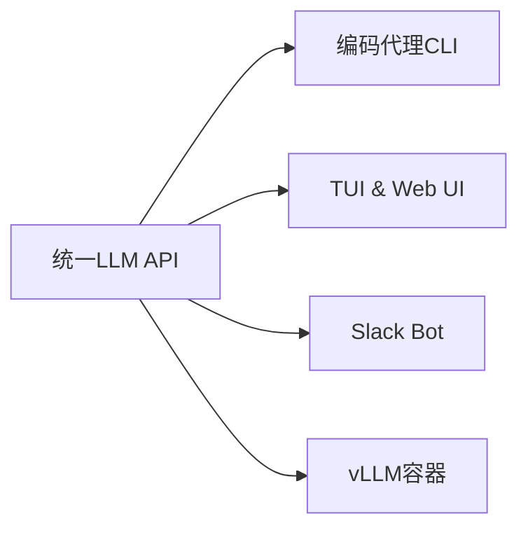
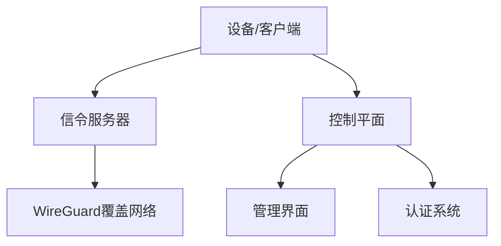
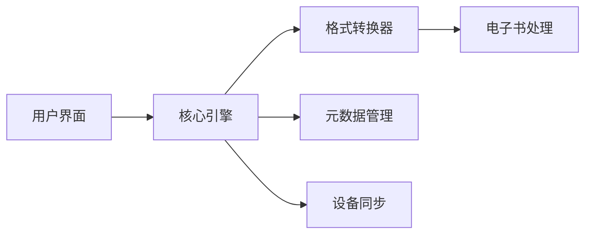
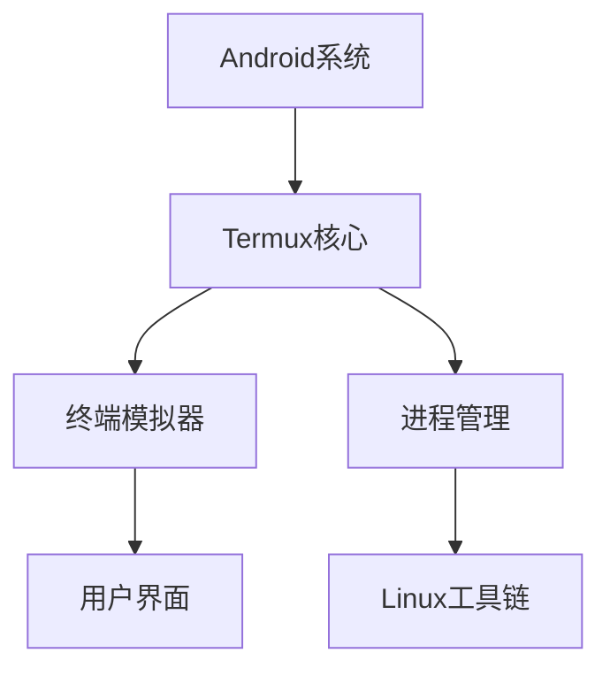

## 今日热点

AI Agent工具链与开发环境集成成为今日热点，Claude记忆插件与Neovim AI代理受追捧，同时RAG技术持续创新，低成本高性能AI应用方案备受关注。

---

## 热门项目一览

| 排名 | 项目 | 语言 | 今日 | 总计 | 简介 |
|:---:|------|:----:|------:|-----:|------|
| 1 | [thedotmack/claude-mem](https://github.com/thedotmack/claude-mem) | TypeScript | +1,474 | 18,121 | A Claude Code plugin that a... |
| 2 | [badlogic/pi-mono](https://github.com/badlogic/pi-mono) | TypeScript | +878 | 5,585 | AI agent toolkit: coding ag... |
| 3 | [VectifyAI/PageIndex](https://github.com/VectifyAI/PageIndex) | Python | +793 | 12,504 | 📑 PageIndex: Document Index... |
| 4 | [netbirdio/netbird](https://github.com/netbirdio/netbird) | Go | +347 | 21,978 | Connect your devices into a... |
| 5 | [pedramamini/Maestro](https://github.com/pedramamini/Maestro) | TypeScript | +336 | 1,281 | Agent Orchestration Command... |
| 6 | [ThePrimeagen/99](https://github.com/ThePrimeagen/99) | Lua | +300 | 3,042 | Neovim AI agent done right |
| 7 | [karpathy/nanochat](https://github.com/karpathy/nanochat) | Python | +254 | 41,646 | The best ChatGPT that $100 ... |
| 8 | [kovidgoyal/calibre](https://github.com/kovidgoyal/calibre) | Python | +183 | 23,799 | The official source code re... |
| 9 | [langchain-ai/rag-from-scratch](https://github.com/langchain-ai/rag-from-scratch) | Jupyter Notebook | +105 | 6,970 | No description |
| 10 | [OpenBMB/ChatDev](https://github.com/OpenBMB/ChatDev) | Python | +93 | 29,400 | ChatDev 2.0: Dev All throug... |
| 11 | [termux/termux-app](https://github.com/termux/termux-app) | Java | +80 | 49,932 | Termux - a terminal emulato... |
| 12 | [autobrr/qui](https://github.com/autobrr/qui) | Go | +77 | 2,839 | A fast, single-binary qBitt... |

---

## 趋势洞察

```
┌─────────────────────────────────────────────────────────────────┐
│  AI/ML 工具         ████████████████████████  8 个项目        │
│  其他               █████████                 3 个项目        │
│  开发工具             ███                       1 个项目        │
└─────────────────────────────────────────────────────────────────┘
```

---

## 项目深度解读

### 1. thedotmack/claude-mem — Claude记忆增强

> **一句话总结**：Claude Code插件，自动捕获编码会话内容并通过AI压缩，将相关上下文注入未来会话中。

#### 价值主张

| 维度 | 说明 |
|------|------|
| **解决痛点** | Claude在长时间编码中缺乏长期记忆，无法有效利用历史对话上下文 |
| **目标用户** | 使用Claude进行长时间编程工作的开发者 |
| **核心亮点** | 自动捕获编码会话 + AI压缩历史内容 + 无缝注入未来会话 |

#### 技术架构


**技术特色**：
- 利用Claude agent-sdk实现智能压缩
- 无缝集成到Claude Code工作流
- TypeScript实现确保类型安全

#### 热度分析

- 项目获18k+ stars，单日增长1.4k+，显示强烈社区需求
- 零开放问题表明项目维护良好，用户体验稳定

#### 快速上手

```bash
# 安装Claude Code插件
npm install -g @anthropic-ai/claude-code

# 安装claude-mem插件
claude-code plugins install thedotmack/claude-mem
```

#### 注意事项

- 需要配合Claude Code使用
- 可能需要配置API密钥
- 隐私考虑：所有编码内容会被记录和处理


### 2. badlogic/pi-mono — 全栈AI工具集

> **一句话总结**：提供统一LLM接口的AI代理工具集，支持编码助手、多种UI界面及vLLM部署。

#### 价值主张

| 维度 | 说明 |
|------|------|
| **解决痛点** | 碎片化AI工具生态，缺乏统一接口和完整解决方案 |
| **目标用户** | AI开发者、系统集成商、需要LLM集成的企业 |
| **核心亮点** | 统一LLM API + 多种UI界面 + vLLM容器化部署 + Slack集成 |

#### 技术架构



**技术特色**：
- 提供统一抽象层兼容多种LLM模型
- 轻量级容器化部署vLLM推理服务
- 多种交互界面适应不同使用场景

#### 热度分析

- 项目Star数增长迅速，单日增长878，显示社区高度关注
- 作为全栈AI工具集，填补了市场空白，具有良好生态潜力

#### 快速上手

```bash
# 克隆仓库
git clone https://github.com/badlogic/pi-mono.git

# 安装依赖并启动
cd pi-mono
npm install
npm run dev
```

#### 注意事项

- 许可证信息不明确，商业使用前需确认授权条款
- 项目依赖vLLM等重型组件，需要充足的计算资源支持


### 3. VectifyAI/PageIndex — 无向量文档索引

> **一句话总结**：PageIndex是一种无需向量的基于推理的文档索引方法，通过语义理解实现高效文档检索。

#### 价值主张

| 维度 | 说明 |
|------|------|
| **解决痛点** | 传统向量嵌入方法资源消耗大且难以处理复杂语义关系 |
| **目标用户** | 需要高效文档检索但资源受限的开发者和研究人员 |
| **核心亮点** | 无需向量嵌入 + 基于推理的检索 + 资源高效 + 语义理解准确 |

#### 技术架构


**技术特色**：
- 采用推理机制而非传统向量嵌入进行文档索引
- 大幅降低计算资源需求，提高检索效率
- 保持高语义理解能力，支持复杂查询

#### 热度分析

- 项目获得12,504个star，单日增长793个，显示快速增长势头
- 零open issues表明项目可能处于稳定状态或问题解决机制高效

#### 快速上手

```bash
# 克隆仓库
git clone https://github.com/VectifyAI/PageIndex.git

# 安装依赖
pip install -r requirements.txt

# 基本使用
python page_index.py --input documents/ --query "your query here"
```

#### 注意事项

- 项目许可证未知，商业使用前需确认授权条款
- 作为较新项目，实际生产环境应用可能需要进一步验证和优化


### 4. netbirdio/netbird — 安全网络连接工具

> **一句话总结**：基于WireGuard的安全覆盖网络解决方案，提供SSO、MFA和细粒度访问控制，简化设备间安全连接。

#### 价值主张

| 维度 | 说明 |
|------|------|
| **解决痛点** | 简化安全网络部署与管理，降低复杂网络环境下的设备连接门槛 |
| **目标用户** | 中小企业、开发团队和需要安全远程连接的组织 |
| **核心亮点** | 基于WireGuard高性能网络 + 零配置自动连接 + SSO与MFA身份验证 + 细粒度访问控制 |

#### 技术架构



**技术特色**：
- 基于WireGuard提供高性能加密通信
- 使用Mesh P2P架构减少中心化依赖
- 内置身份验证与访问控制系统
- 轻量级客户端，跨平台支持
- 支持动态IP和NAT穿透

#### 热度分析

- 项目获得近22K星标，单日增长347，表明项目正处于快速增长期，受到开发者高度关注。
- 作为开源网络基础设施工具，在安全远程连接和分布式团队协作领域具有重要生态价值。

#### 快速上手

```bash
# 下载并安装Netbird
curl -fsSL https://pkgs.netbird.io/install.sh | sh

# 加入网络
sudo netbird up

# 获取你的连接状态
netbird status
```

#### 注意事项

- 需要正确配置防火墙规则以允许WireGuard流量
- 管理员应仔细配置访问控制策略以确保网络安全
- 项目依赖中央协调服务器进行身份验证和网络管理


### 5. pedramamini/Maestro — AI代理指挥中心

> **一句话总结**：统一管理、编排和监控多个AI代理的命令中心平台，简化复杂AI工作流。

#### 价值主张

| 维度 | 说明 |
|------|------|
| **解决痛点** | 解决多AI代理协同工作时的管理复杂性和效率低下问题 |
| **目标用户** | AI开发团队、企业AI应用构建者、自动化流程设计者 |
| **核心亮点** | 统一管理界面 + 可视化编排 + 实时监控 + 插件扩展 |

#### 技术架构


**技术特色**：
- 基于TypeScript构建，提供类型安全开发环境
- 采用模块化设计，支持多种AI代理类型接入
- 提供RESTful API，便于与其他系统集成

#### 热度分析

- 项目近期增长迅速，单日新增Star数达336，显示市场关注度快速提升
- Open Issues为0，表明项目维护良好，用户反馈可能通过其他渠道处理

#### 快速上手

```bash
# 克隆项目
git clone https://github.com/pedramamini/Maestro.git

# 安装依赖
npm install

# 启动服务
npm run dev
```

#### 注意事项

- 项目许可证信息未知，商业使用前需确认授权条款
- 作为新项目，生态系统和社区支持可能仍在发展中
- 需要关注项目的持续更新频率和长期维护情况


### 6. ThePrimeagen/99 — [Neovim智能助手]

> **一句话总结**：为Neovim编辑器打造的AI代理工具，智能化提升编码效率与体验。

#### 价值主张

| 维度 | 说明 |
|------|------|
| **解决痛点** | 为Neovim提供智能化编辑辅助，弥补原生编辑器的AI功能缺失 |
| **目标用户** | Neovim高级用户和开发者，追求高效编程体验 |
| **核心亮点** | + AI驱动 + 智能代码补全 + 自动化编辑任务 |

#### 技术架构


**技术特色**：
- 基于Lua原生开发，与Neovim深度集成
- 采用轻量级设计，不影响Neovim性能表现
- 可扩展的AI接口，支持多种大语言模型

#### 热度分析

- 项目获得3000+星标且持续增长，表明社区高度认可其价值
- 作为Neovim生态中少有的AI辅助工具，填补了市场空白，吸引追求效率的开发者

#### 快速上手

```bash
# 使用vim-plug安装
Plug 'ThePrimeagen/99'
# 重启Neovim并运行:PlugInstall
# 配置AI服务API后即可使用
```

#### 注意事项

- 需要Neovim环境支持，建议使用最新版本
- 需要配置AI服务API密钥才能正常使用
- 项目许可证信息不明确，使用前需确认授权条款


### 7. karpathy/nanochat — 经济版ChatGPT

> **一句话总结**：用百元预算实现类ChatGPT体验，开源经济版的智能对话系统。

#### 价值主张

| 维度 | 说明 |
|------|------|
| **解决痛点** | 降低高质量对话AI的使用门槛，实现经济实惠的智能对话 |
| **目标用户** | 预算有限但需要高质量AI对话的开发者和研究人员 |
| **核心亮点** | 开源免费 + 低成本部署 + 高性能对话 + 自定义能力 |

#### 技术架构


**技术特色**：
- 轻量级设计，适合低成本硬件部署
- 优化推理效率，显著降低计算成本
- 开源可定制，支持本地化私有部署

#### 热度分析

- 项目获得超4万星，日增254星，表明近期热度高涨，社区关注度极高
- 零开放问题显示项目成熟度高，已成为经济版ChatGPT解决方案的标杆

#### 快速上手

```bash
# 克隆仓库
git clone https://github.com/karpathy/nanochat.git
cd nanochat
# 安装依赖并运行
pip install -r requirements.txt && python nanochat.py
```

#### 注意事项

- 需要一定的硬件资源，虽然比原版ChatGPT要求低，但仍然需要一定的计算能力
- 作为开源项目，用户需要自行负责模型的安全性和隐私保护


### 8. kovidgoyal/calibre — 全能电子书管理平台

> **一句话总结**：功能强大的开源电子书管理工具，支持格式转换、图书馆管理和多设备同步。

#### 价值主张

| 维度 | 说明 |
|------|------|
| **解决痛点** | 电子书格式不统一、管理混乱和阅读设备兼容性差的问题 |
| **目标用户** | 电子书爱好者、数字图书馆管理员和跨平台阅读用户 |
| **核心亮点** | 多格式转换 + 强大元数据管理 + 跨平台兼容 + 内置编辑器 |

#### 技术架构



**技术特色**：
- 基于 Python 和 Qt 构建的跨平台桌面应用
- 自研电子书格式转换引擎，支持30+种格式
- 插件系统支持功能扩展和定制化
- 多线程处理架构，优化大文件处理性能

#### 热度分析

- 作为电子书管理领域标杆项目，持续保持高关注度，近期增长稳定
- 拥有庞大用户群体和活跃贡献社区，生态完善度高

#### 快速上手

```bash
# Linux 安装 Calibre
sudo -v && wget -nv -O- https://download.calibre-ebook.com/linux-installer.sh | sudo sh /-

# 添加电子书到图书馆
calibredb add "path/to/ebook.epub"
```

#### 注意事项

- Calibre 功能强大但学习曲线较陡，新用户需要一定时间熟悉
- 某些电子书格式转换可能会丢失部分格式信息，建议备份原始文件
- 定期更新以获取新格式支持和安全修复


### 9. langchain-ai/rag-from-scratch — 零基础RAG教程

> **一句话总结**：从零开始构建检索增强生成系统的完整实践教程，理论与实践并重。

#### 价值主张

| 维度 | 说明 |
|------|------|
| **解决痛点** | 理解RAG系统构建全流程，避免黑盒使用现成工具 |
| **目标用户** | 希望深入理解RAG原理与实践的开发者、研究者和学生 |
| **核心亮点** | +从零开始构建 +理论与实践结合 +代码注释详细 +可复现示例 |

#### 技术架构


**技术特色**：
- 使用LangChain框架构建完整RAG流程
- 详细展示文档处理与向量嵌入技术
- 实现高效的相似度检索机制

#### 热度分析

- 项目获得近7k星，日增百星，表明RAG技术正受到广泛关注
- 作为LangChain生态中的基础教程，具有较高参考价值

#### 快速上手

```bash
# 克隆项目
git clone https://github.com/langchain-ai/rag-from-scratch.git
# 安装依赖
pip install -r requirements.txt
# 运行示例
jupyter notebook rag_tutorial.ipynb
```

#### 注意事项
- 需要具备Python和机器学习基础知识
- 可能需要OpenAI API密钥才能完整运行示例
- 项目基于LangChain框架，需了解相关概念


### 10. OpenBMB/ChatDev — AI驱动开发

> **一句话总结**：基于大语言模型的多智能体协作平台，实现全流程自动化软件开发。

#### 价值主张

| 维度 | 说明 |
|------|------|
| **解决痛点** | 传统软件开发流程繁琐、耗时且成本高，AI智能体协作可自动化全流程 |
| **目标用户** | 软件开发团队、AI研究人员、自动化工具开发者 |
| **核心亮点** | 多智能体协作架构 + LLM驱动 + 全流程自动化 + 开源可扩展 |

#### 技术架构


**技术特色**：
- 基于大语言模型的多智能体协作架构
- 模块化智能体设计，支持灵活组合与扩展
- 全流程自动化软件开发流水线，减少人工干预

#### 热度分析

- 项目Star数接近3万，日增长近百，表明社区关注度极高且持续增长
- Fork数与Star数比例合理，说明项目有较强的实用价值和可扩展性

#### 快速上手

```bash
# 克隆项目
git clone https://github.com/OpenBMB/ChatDev.git
cd ChatDev

# 安装依赖
pip install -r requirements.txt

# 运行示例
python main.py --task "create a simple calculator" --model gpt-4
```

#### 注意事项

- 需要OpenAI API密钥或其他大语言模型访问权限
- 项目可能需要较高的计算资源，特别是使用大型语言模型时
- 由于是AI驱动开发，生成的代码可能需要人工审查和测试


### 11. termux/termux-app — Android终端模拟器

> **一句话总结**：Android终端模拟器，提供Linux环境与丰富命令行工具，打造移动端开发与运维平台。

#### 价值主张

| 维度 | 说明 |
|------|------|
| **解决痛点** | Android系统缺乏完整命令行环境，无法高效进行系统管理与开发工作 |
| **目标用户** | Android开发者、系统管理员、Linux爱好者、移动端运维人员 |
| **核心亮点** | 原生终端体验 + Linux工具生态 + 包管理系统 + 无需root |

#### 技术架构



**技术特色**：
- 基于Android API构建的原生终端模拟器
- 通过Termux API实现与Android系统深度集成
- 采用自研包管理系统管理Linux软件包

#### 热度分析

- 项目Star数接近5万，日增80星，表明项目处于稳定增长期，受到Android开发者广泛认可
- 在Android终端工具领域处于主导地位，形成了完整的工具生态和社区支持

#### 快速上手

```bash
# 安装Termux应用后
pkg update && pkg upgrade
pkg install python vim git
```

#### 注意事项

- Termux提供的Linux环境是用户空间的，无法直接访问Android系统底层功能
- 部分高级Linux功能可能因Android系统限制而无法完全实现
- 使用某些敏感命令可能需要额外权限或特殊配置


### 12. autobrr/qui — 种子管理UI

> **一句话总结**：快速轻量的qBittorrent Web UI，支持多实例管理和自动化种子工作流。

#### 价值主张

| 维度 | 说明 |
|------|------|
| **解决痛点** | 提供直观Web界面并实现种子管理自动化，简化下载流程 |
| **目标用户** | 需要高效管理多个种子下载的极客和技术用户 |
| **核心亮点** | 单二进制部署 + 多实例管理 + 自动化工作流 + 跨种子器支持 |

#### 技术架构


**技术特色**：
- Go语言编写，单二进制部署，轻量高效
- 模块化设计，支持多个qBittorrent实例管理
- 内置自动化规则引擎，灵活配置种子工作流

#### 热度分析

- Star数持续增长(+77今日)，表明项目活跃度高，社区认可度提升
- 作为qBittorrent生态的重要扩展，填补了Web UI和自动化管理空白

#### 快速上手

```bash
# 克隆仓库
git clone https://github.com/autobrr/qui.git
cd qui
# 构建项目
go build -o qui
# 运行
./qui
```

#### 注意事项

- 项目许可证未知，使用前需确认商业授权问题
- 作为种子管理工具，需注意相关法律法规限制
- 项目仍在开发中，功能可能不稳定


## 今日推荐

| 主题 | 推荐项目 | 亮点 |
|------|----------|------|
| 今日最热 | [thedotmack/claude-mem](https://github.com/thedotmack/claude-mem) | A Claude Code plu... |
| 值得关注 | [badlogic/pi-mono](https://github.com/badlogic/pi-mono) | AI agent toolkit:... |
| 快速上手 | [VectifyAI/PageIndex](https://github.com/VectifyAI/PageIndex) | 📑 PageIndex: Docu... |
| 长期潜力 | [netbirdio/netbird](https://github.com/netbirdio/netbird) | Connect your devi... |

---

<div align="center">

*Generated on 2026-02-03 | Powered by GitHub Trending Reporter*

</div>