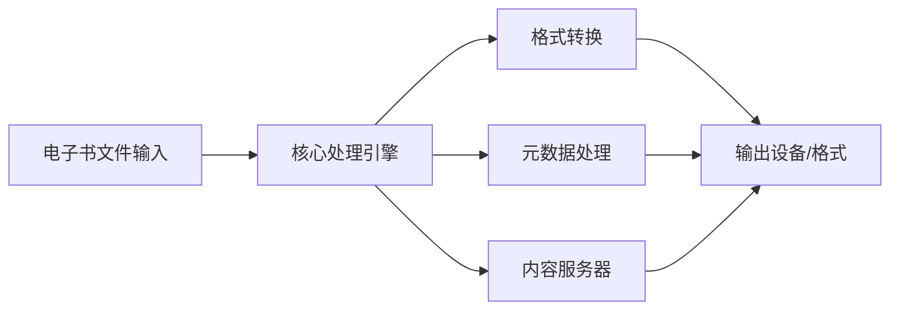
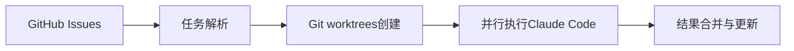

## 今日热点

AI代理与自动化工作流技术主导今日热榜，Claude记忆插件与多代理协作工具备受追捧，反映开发者正加速AI与开发流程的深度融合。

---

## 热门项目一览

| 排名 | 项目 | 语言 | 今日 | 总计 | 简介 |
|:---:|------|:----:|------:|-----:|------|
| 1 | [thedotmack/claude-mem](https://github.com/thedotmack/claude-mem) | TypeScript | +1,730 | 20,307 | A Claude Code plugin that a... |
| 2 | [obra/superpowers](https://github.com/obra/superpowers) | Shell | +817 | 43,528 | An agentic skills framework... |
| 3 | [OpenBMB/ChatDev](https://github.com/OpenBMB/ChatDev) | Python | +476 | 29,784 | ChatDev 2.0: Dev All throug... |
| 4 | [karpathy/nanochat](https://github.com/karpathy/nanochat) | Python | +447 | 42,020 | The best ChatGPT that $100 ... |
| 5 | [openai/skills](https://github.com/openai/skills) | Python | +377 | 3,022 | Skills Catalog for Codex |
| 6 | [pedramamini/Maestro](https://github.com/pedramamini/Maestro) | TypeScript | +269 | 1,501 | Agent Orchestration Command... |
| 7 | [virattt/dexter](https://github.com/virattt/dexter) | TypeScript | +222 | 10,086 | An autonomous agent for dee... |
| 8 | [kovidgoyal/calibre](https://github.com/kovidgoyal/calibre) | Python | +141 | 23,929 | The official source code re... |
| 9 | [automazeio/ccpm](https://github.com/automazeio/ccpm) | Shell | +123 | 6,710 | Project management system f... |
| 10 | [vm0-ai/vm0](https://github.com/vm0-ai/vm0) | TypeScript | +62 | 703 | the easiest way to run natu... |
| 11 | [masoncl/review-prompts](https://github.com/masoncl/review-prompts) | Python | +54 | 350 | AI review prompts |

---

## 趋势洞察

```
┌─────────────────────────────────────────────────────────────────┐
│  AI/ML 工具         ████████████████████████  10 个项目        │
│  其他               ██                        1 个项目        │
└─────────────────────────────────────────────────────────────────┘
```

---

## 项目深度解读

### 1. thedotmack/claude-mem — AI记忆增强插件

> **一句话总结**：Claude Code插件自动捕获编码过程，AI压缩并注入上下文，提升未来会话连贯性。

#### 价值主张

| 维度 | 说明 |
|------|------|
| **解决痛点** | 开发过程中Claude缺乏长期记忆，无法参考历史编码上下文 |
| **目标用户** | 使用Claude Code进行编程的开发者，需要保持上下文连贯性 |
| **核心亮点** | 自动捕获会话内容 + AI智能压缩 + 上下文注入 + 无缝集成Claude Code |

#### 技术架构


**技术特色**：
- 利用Claude agent-sdk实现智能内容压缩
- 无缝集成Claude Code，无需额外配置
- 自动化上下文管理，减少开发者手动干预

#### 热度分析

- 项目获得20,307个Star，单日增长1,730，表明近期热度极高，开发者对AI辅助编程记忆需求强烈
- 作为Claude生态系统工具，处于AI辅助编程工具的前沿位置，社区关注度持续攀升

#### 快速上手

```bash
# 安装Claude Code
npm install -g @anthropic-ai/claude-code

# 安装claude-mem插件
claude-code plugin install thedotmack/claude-mem

# 启动Claude Code并使用插件
claude-code
```

#### 注意事项

- 此插件依赖于Claude Code，需要先安装Claude Code环境
- 插件可能会收集和处理代码内容，需注意敏感信息处理
- 压缩和注入过程可能需要网络连接，确保Claude API可访问


### 2. obra/superpowers — 智能开发框架

> **一句话总结**：基于Shell构建的智能技能框架，提供高效的软件开发方法论与自动化工具集。

#### 价值主张

| 维度 | 说明 |
|------|------|
| **解决痛点** | 提供结构化的软件开发方法，解决效率与质量平衡问题 |
| **目标用户** | 追求高效开发的软件工程师与技术团队 |
| **核心亮点** | Shell脚本实现 + 智能代理框架 + 开发方法论 + 自动化工具 + 实用性验证 |

#### 技术架构


**技术特色**：
- 纯Shell实现，跨平台兼容性强
- 模块化设计，可扩展性好
- 轻量级，无需复杂依赖

#### 热度分析
- Star数高达43,528，今日新增817，表明项目持续获得关注，处于快速增长期
- Open Issues为0，可能表示项目成熟度高或社区通过其他渠道交流

#### 快速上手

```bash
# 克隆项目
git clone https://github.com/obra/superpowers.git
# 进入目录并执行初始化
cd superpowers && ./install.sh
```

#### 注意事项
- 需要基本的Shell脚本知识才能充分利用
- 项目方法论可能需要团队共同实践才能发挥最大效果
- License未知，商业使用前需确认授权条款


### 3. OpenBMB/ChatDev — 智能开发协作

> **一句话总结**：基于大语言模型的多智能体协作平台，实现从需求分析到部署的全流程自动化软件开发。

#### 价值主张

| 维度 | 说明 |
|------|------|
| **解决痛点** | 传统软件开发流程繁琐，角色协作效率低下，AI辅助缺乏系统性 |
| **目标用户** | 软件开发者、产品经理、创业团队、AI研究人员 |
| **核心亮点** | 多智能体协作 + 全流程自动化 + LLM驱动 + 可定制工作流 + 开发过程可视化 |

#### 技术架构

```mermaid
graph LR
    A[用户需求] --> B[任务分解]
    B -->


### 4. karpathy/nanochat — [经济版ChatGPT]

> **一句话总结**：低成本实现类ChatGPT功能的开源项目，提供高效对话体验。

#### 价值主张

| 维度 | 说明 |
|------|------|
| **解决痛点** | 降低大语言模型使用门槛，提供经济高效的对话AI解决方案 |
| **目标用户** | 开发者、研究人员、小企业、个人用户 |
| **核心亮点** | + 低成本部署 + 高性能对话 + 开源可定制 |

#### 技术架构

```mermaid
graph LR
    A[用户输入] --> B[模型处理]
    B --> C[生成回应]
    C --> D[对话输出]
```

**技术特色**：
- 采用轻量级模型架构降低计算成本
- 优化推理速度提升响应效率
- 模块化设计便于功能扩展

#### 热度分析

- 项目热度持续攀升，日增星数447，表明社区关注度高涨
- 高Fork/Star比例(约13%)反映开发者积极参与二次开发

#### 快速上手

```bash
# 克隆仓库
git clone https://github.com/karpathy/nanochat.git
cd nanochat

# 安装依赖并运行
pip install -r requirements.txt
python nanochat.py
```

#### 注意事项

- 项目依赖特定硬件环境，可能需要GPU加速才能获得最佳性能
- 模型参数可能需要根据实际需求进行调整以达到最佳效果
- 使用前请确保遵守相关开源许可证要求


### 5. openai/skills — AI编程技能库

> **一句话总结**：为Codex模型提供结构化编程技能集合，提升AI代码生成能力与效率。

#### 价值主张

| 维度 | 说明 |
|------|------|
| **解决痛点** | 解决AI代码生成中技能组织与复用难题 |
| **目标用户** | AI开发者与研究人员 |
| **核心亮点** | 结构化技能组织 + 代码生成增强 + 可扩展性 |

#### 技术架构


**技术特色**：
- 基于Python实现的技能管理系统
- 与Codex模型深度集成的架构设计
- 技能分类与智能检索机制

#### 热度分析

- 项目近期热度飙升，377日增星表明社区高度关注
- 零未解决问题，显示项目管理严格或处于早期阶段

#### 快速上手

```bash
git clone https://github.com/openai/skills.git
cd skills
pip install -r requirements.txt
python skills_catalog.py --help
```

#### 注意事项

- 许可证信息未知，使用前需确认授权条款
- 项目可能与特定版本的Codex模型绑定，使用时需注意版本兼容性


### 6. pedramamini/Maestro — AI代理编排平台

> **一句话总结**：Maestro是一个集中管理多个AI代理的指挥中心，提供统一编排与任务协调能力。

#### 价值主张

| 维度 | 说明 |
|------|------|
| **解决痛点** | 解决多AI代理协同工作时的管理复杂性和效率低下问题 |
| **目标用户** | AI研究人员、开发团队、需要集成多个AI服务的组织 |
| **核心亮点** | 统一管理界面 + 代理编排能力 + 任务分发 + 状态监控 + 错误处理 |

#### 技术架构


**技术特色**：
- 基于TypeScript构建，提供类型安全和良好的开发体验
- 采用事件驱动架构，实现代理间的高效通信
- 提供RESTful API，便于与其他系统集成

#### 热度分析

- 项目近期获得大量Star（+269），表明社区关注度迅速上升
- 虽然Open Issues为0，但Fork数相对较少，可能处于早期发展阶段

#### 快速上手

```bash
# 克隆项目
git clone https://github.com/pedramamini/Maestro.git

# 安装依赖
npm install

# 启动服务
npm start
```

#### 注意事项

- 由于项目许可证未知，使用前需确认授权条款
- 项目处于早期阶段，API可能会有较大变动
- 需要Node.js环境运行，建议使用最新LTS版本


### 7. virattt/dexter — 智能金融研究助手

> **一句话总结**：基于AI的自主代理工具，可自动执行深度金融研究和分析，为投资决策提供数据支持

#### 价值主张

| 维度 | 说明 |
|------|------|
| **解决痛点** | 自动化复杂金融研究流程，节省人工调研分析时间 |
| **目标用户** | 金融分析师、投资经理、研究机构和个人投资者 |
| **核心亮点** | AI自主研究能力 + 多数据源整合 + 深度财务分析 + 可视化报告生成 |

#### 技术架构


**技术特色**：
- 基于TypeScript构建，确保类型安全和高质量代码
- 多源数据整合能力，连接API、数据库和文件系统
- 自主代理算法，能够独立完成复杂研究任务

#### 热度分析

- 项目获得10K+星标且持续增长，表明在金融科技领域获得高度认可
- 零开放问题反映项目维护良好，社区支持度高

#### 快速上手

```bash
# 克隆项目
git clone https://github.com/virattt/dexter.git
cd dexter

# 安装依赖
npm install

# 运行项目
npm start
```

#### 注意事项

- 项目可能需要配置API密钥才能访问金融数据源
- 需要一定的金融知识才能有效使用和解读分析结果


### 8. kovidgoyal/calibre — 全能电子书管理

> **一句话总结**：开源跨平台电子书管理工具，支持格式转换、元数据编辑与图书同步。

#### 价值主张

| 维度 | 说明 |
|------|------|
| **解决痛点** | 电子书格式不兼容、管理混乱、阅读设备限制问题 |
| **目标用户** | 电子书爱好者、数字图书馆管理者、内容创作者 |
| **核心亮点** | 跨平台支持 + 强大格式转换 + 元数据管理 + 新闻订阅 + 内容服务器 |

#### 技术架构



**技术特色**：
- 使用PyQt构建跨平台GUI界面
- 支持数十种电子书格式的无缝转换
- 插件系统实现功能高度可扩展性

#### 热度分析

- 项目获得近2.4万星，日增长140+，表明电子书管理工具需求稳定且持续增长
- 长期维护的开源项目，在数字阅读领域占据重要生态位置，无开放问题显示项目成熟度高

#### 快速上手

```bash
# 安装Calibre
sudo -v && wget -nv -O- https://download.calibre-ebook.com/linux-installer.py | sudo python -c "import sys; main=lambda:sys.stderr.write('Download failed\n'); exec(sys.stdin.read()); main()"
```

#### 注意事项

- 首次安装可能需要安装系统依赖库，如python3, python3-pyqt5等
- 对于大型电子书库，建议定期进行元数据备份以防止数据丢失


### 9. automazeio/ccpm — AI并行代码管理

> **一句话总结**：利用GitHub Issues和Git worktrees实现Claude Code的并行执行与任务管理。

#### 价值主张

| 维度 | 说明 |
|------|------|
| **解决痛点** | 解决Claude Code串行执行效率低下问题，实现任务并行处理 |
| **目标用户** | 使用Claude Code进行大规模项目开发的AI辅助开发者 |
| **核心亮点** | 基于GitHub Issues管理 + Git worktrees并行执行 + 多代理协作 |

#### 技术架构



**技术特色**：
- 利用Git worktrees实现真正的并行执行环境隔离
- 通过GitHub Issues进行任务全生命周期管理
- 支持多Claude Code代理的协同工作流

#### 热度分析

- 项目获得6,710个Star且每日新增123个，显示出快速增长的开发者关注度
- 作为AI辅助开发工具的新兴项目，在GitHub上获得了显著认可

#### 快速上手

```bash
git clone https://github.com/automazeio/ccpm.git
cd ccpm
chmod +x ccpm.sh
./ccpm.sh --init
```

#### 注意事项

- 需要配置GitHub API访问权限和个人访问令牌
- 依赖Claude Code服务，需要相应的API密钥
- 需要足够的存储空间用于管理多个Git worktrees


### 10. vm0-ai/vm0 — 自然语言工作流

> **一句话总结**：通过自然语言描述工作流并自动执行，简化自动化流程。

#### 价值主张

| 维度 | 说明 |
|------|------|
| **解决痛点** | 将复杂工作流转化为简单的自然语言描述，降低自动化门槛 |
| **目标用户** | 开发者、自动化需求者、非技术背景的业务人员 |
| **核心亮点** | 自然语言输入 + 自动执行 + 无需复杂配置 + 低学习成本 |

#### 技术架构


**技术特色**：
- 基于NLP的自然语言理解技术
- 轻量级工作流引擎设计
- TypeScript实现，提供类型安全和跨平台能力

#### 热度分析

- 项目获得703个Star，近期增长较快（今日+62），表明社区关注度高
- Fork数相对较少（25），可能表明项目尚处于早期阶段，用户更多在试用而非二次开发

#### 快速上手

```bash
# 安装vm0
npm install -g vm0

# 使用自然语言描述工作流
vm0 "当收到邮件时，将附件保存到指定文件夹并发送通知"

# 查看帮助
vm0 --help
```

#### 注意事项

- 项目许可证未知，商业使用前需确认授权条款
- 作为新兴项目，API和功能可能会有较大变化
- 依赖自然语言处理，可能存在理解偏差的情况


### 11. masoncl/review-prompts — 代码提示库

> **一句话总结**：这是一个收集和整理AI代码评审提示的Python库，帮助开发者获取高质量的代码反馈。

#### 价值主张

| 维度 | 说明 |
|------|------|
| **解决痛点** | 开发者难以获得有效代码反馈，缺乏结构化评审标准 |
| **目标用户** | Python开发者、代码审查者、AI辅助编程工具使用者 |
| **核心亮点** | 结构化提示库 + 多场景覆盖 + 易于集成 + 高质量模板 + 持续更新 |

#### 技术架构


**技术特色**：
- 提示模板结构化设计，便于AI理解和处理
- 支持多种编程场景和评审维度
- 轻量级实现，易于集成到开发流程

#### 热度分析

- 项目近期增长迅速，单日增长54星，表明社区对AI辅助代码工具有强烈兴趣
- 作为AI提示库，处于当前热门的AI辅助开发工具生态中，具有良好发展前景

#### 快速上手

```bash
# 克隆仓库
git clone https://github.com/masoncl/review-prompts.git

# 查看可用提示
cat prompts/code_review.md
```

#### 注意事项

- 需要配合AI模型使用，项目本身不包含AI模型
- 提示可能需要根据具体AI模型进行微调以获得最佳效果
- 定期检查更新以获取最新的提示模板


## 今日推荐

| 主题 | 推荐项目 | 亮点 |
|------|----------|------|
| 今日最热 | [thedotmack/claude-mem](https://github.com/thedotmack/claude-mem) | A Claude Code plu... |
| 值得关注 | [obra/superpowers](https://github.com/obra/superpowers) | An agentic skills... |
| 快速上手 | [OpenBMB/ChatDev](https://github.com/OpenBMB/ChatDev) | ChatDev 2.0: Dev ... |
| 长期潜力 | [karpathy/nanochat](https://github.com/karpathy/nanochat) | The best ChatGPT ... |

---

<div align="center">

*Generated on 2026-02-04 | Powered by GitHub Trending Reporter*

</div>