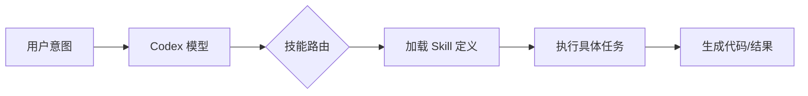
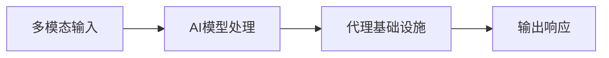
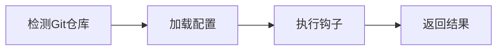
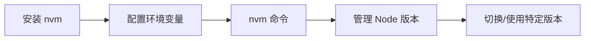
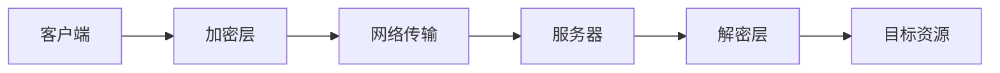
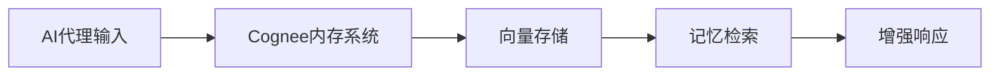
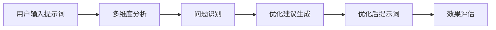
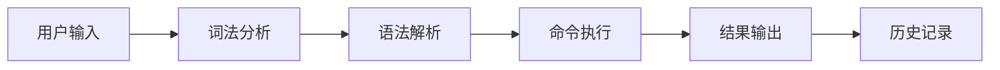
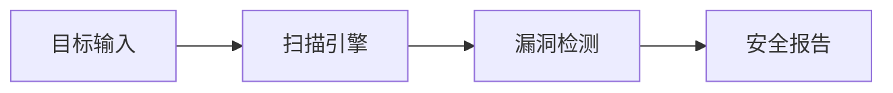

## 今日热点

AI代理与记忆系统爆发式增长，开发工具向Rust等高性能语言迁移，智能辅助开发成为新焦点。

---

## 热门项目一览

| 排名 | 项目 | 语言 | 今日 | 总计 | 简介 |
|:---:|------|:----:|------:|-----:|------|
| 1 | [thedotmack/claude-mem](https://github.com/thedotmack/claude-mem) | TypeScript | +1,930 | 23,718 | A Claude Code plugin that a... |
| 2 | [obra/superpowers](https://github.com/obra/superpowers) | Shell | +887 | 45,367 | An agentic skills framework... |
| 3 | [openai/skills](https://github.com/openai/skills) | Python | +621 | 4,278 | Skills Catalog for Codex |
| 4 | [bytedance/UI-TARS-desktop](https://github.com/bytedance/UI-TARS-desktop) | TypeScript | +566 | 26,707 | The Open-Source Multimodal ... |
| 5 | [j178/prek](https://github.com/j178/prek) | Rust | +258 | 5,516 | ⚡ Better `pre-commit`, re-e... |
| 6 | [nvm-sh/nvm](https://github.com/nvm-sh/nvm) | Shell | +101 | 91,374 | Node Version Manager - POSI... |
| 7 | [ZeroTworu/anet](https://github.com/ZeroTworu/anet) | Rust | +81 | 360 | Simple Rust VPN Client / Se... |
| 8 | [topoteretes/cognee](https://github.com/topoteretes/cognee) | Python | +74 | 11,839 | Memory for AI Agents in 6 l... |
| 9 | [linshenkx/prompt-optimizer](https://github.com/linshenkx/prompt-optimizer) | TypeScript | +51 | 19,356 | 一款提示词优化器，助力于编写高质量的提示词 |
| 10 | [fish-shell/fish-shell](https://github.com/fish-shell/fish-shell) | Rust | +28 | 32,386 | The user-friendly command l... |
| 11 | [aquasecurity/trivy](https://github.com/aquasecurity/trivy) | Go | +25 | 31,368 | Find vulnerabilities, misco... |

---

## 趋势洞察

```
┌─────────────────────────────────────────────────────────────────┐
│  AI/ML 工具         ████████████████████████  6 个项目        │
│  其他               ████████████              3 个项目        │
│  开发工具             ████████                  2 个项目        │
└─────────────────────────────────────────────────────────────────┘
```

---

## 项目深度解读

### 1. thedotmack/claude-mem — AI编程记忆助手

> **一句话总结**：Claude Code插件，自动捕获编程会话内容，AI压缩后注入未来上下文，提升连续编程体验。

#### 价值主张

| 维度 | 说明 |
|------|------|
| **解决痛点** | 解决编程过程中上下文丢失问题，无法连贯利用历史对话信息 |
| **目标用户** | Claude Code用户、AI辅助开发者、需要长期编程记忆的用户 |
| **核心亮点** | 自动捕获 + AI压缩 + 上下文注入 + 无缝集成 + 智能记忆 |

#### 技术架构


**技术特色**：
- 利用Claude agent-sdk进行智能内容压缩
- 无缝集成Claude Code环境
- 自动化捕获与注入机制
- 智能上下文提取算法
- 高效记忆存储与检索系统

#### 热度分析

- 项目Star数高达23,718，近期增长迅速（单日增长1,930），表明开发者社区对该技术高度认可
- Fork数1,569显示项目有较高可扩展性和二次开发价值，可能成为AI辅助编程领域的重要基础设施

#### 快速上手

```bash
# 安装Claude Code
npm install -g @anthropic-ai/claude-code

# 安装claude-mem插件
claude-code plugin install claude-mem

# 启动Claude Code并启用记忆功能
claude-code --with-mem
```

#### 注意事项

- 项目许可证未知，商业使用前需确认授权情况
- 依赖Claude Code环境，需要先配置好相关开发环境
- 隐私方面需注意，所有编程活动都会被记录和AI处理
- 可能需要调整API密钥和配置以获得最佳体验
- 长期使用可能需要定期清理记忆数据以保持性能


### 3. openai/skills — Codex智能体技能定义库

> **一句话总结**：为OpenAI Codex智能体提供标准化的技能定义目录，旨在增强代码生成与任务执行能力的扩展性。

#### 价值主张

| 维度 | 说明 |
|------|------|
| **解决痛点** | 解决通用大模型在特定开发任务中缺乏标准化操作流程与上下文的问题。 |
| **目标用户** | OpenAI Codex 用户、AI 应用开发者及自动化软件工程研究人员。 |
| **核心亮点** | 标准化技能定义 + 可复用提示工程 + 提升Agent执行准确率 + 模块化扩展 |

#### 技术架构



**技术特色**：
- **上下文增强**：通过预定义的技能文件注入特定领域的知识和规范，弥补模型原生知识盲区。
- **结构化指令**：采用标准化的数据结构描述任务步骤，确保模型输出的格式一致性和逻辑严密性。
- **生态集成**：作为连接底层基座模型与上层具体工程任务的适配层，降低定制化开发成本。

#### 热度分析

- **爆发式增长**：单日Star增长超600，显示市场对OpenAI官方Agent生态的高度关注与期待。
- **核心生态位**：作为Codex能力的延伸层，该仓库可能成为未来AI编程工具链的标准组件。

#### 快速上手

```bash
# 克隆仓库以获取最新的技能定义
git clone https://github.com/openai/skills.git

# 进入目录查看结构（假设主要是Python或Markdown定义）
cd skills
ls -R
```

#### 注意事项

- **许可证风险**：目前 License 显示为 Unknown，生产环境引用需关注后续开源协议的明确。
- **强依赖性**：该项目高度依赖 OpenAI Codex 的底层能力，需配合官方 API 或 IDE 插件使用。


### 4. bytedance/UI-TARS-desktop — 多模态AI代理框架

> **一句话总结**：开源多模态AI代理堆栈，无缝连接前沿AI模型与代理基础设施。

#### 价值主张

| 维度 | 说明 |
|------|------|
| **解决痛点** | 解决AI模型与代理基础设施间的连接与整合难题 |
| **目标用户** | AI开发者、研究人员和企业技术团队 |
| **核心亮点** | 多模态支持 + 开源架构 + 前沿AI模型集成 |

#### 技术架构



**技术特色**：
- 多模态AI模型无缝集成
- 开放代理架构设计
- 前沿AI技术栈整合

#### 热度分析

- 项目Star数达2.6万+，日增500+，呈现高速增长态势
- 零开放Issues表明项目维护质量高，社区反馈机制完善

#### 快速上手

```bash
# 克隆项目
git clone https://github.com/bytedance/UI-TARS-desktop.git

# 安装依赖
npm install
```

#### 注意事项

- 需要具备一定的AI和TypeScript开发基础
- 使用前需配置相应的AI模型API密钥
- 项目架构复杂，建议先阅读详细文档再进行二次开发


### 5. j178/prek — 高效 Git 钩子工具

> **一句话总结**：基于 Rust 重构的 pre-commit 工具，提供更快的执行速度和更优化的资源使用。

#### 价值主张

| 维度 | 说明 |
|------|------|
| **解决痛点** | 解决 Python 版 pre-commit 性能瓶颈，提供更快执行速度 |
| **目标用户** | 注重代码质量和开发效率的开发团队 |
| **核心亮点** | Rust 编译 + 原生性能 + 更低资源占用 + 跨平台支持 |

#### 技术架构



**技术特色**：
- Rust 编译提供原生性能优势
- 内存安全设计减少运行时错误
- 异步处理提高钩子执行效率

#### 热度分析

- Star 数持续增长，今日新增258，显示社区关注度快速提升
- 作为 pre-commit 的 Rust 替代品，填补了高性能代码检查工具生态位

#### 快速上手

```bash
# 安装
cargo install prek
# 初始化配置
prek install
# 提交前自动运行钩子
git commit -m "commit message"
```

#### 注意事项

- 需要 Rust 环境来编译和安装
- 配置文件格式可能与原版 pre-commit 有差异


### 6. nvm-sh/nvm — 版本管理工具

> **一句话总结**：Node.js 版本管理器，支持多版本共存与快速切换，简化开发环境配置。

#### 价值主张

| 维度 | 说明 |
|------|------|
| **解决痛点** | 解决 Node.js 版本冲突问题，实现项目间版本隔离 |
| **目标用户** | Node.js 开发者、全栈工程师、DevOps 工程师 |
| **核心亮点** | 轻量级实现 + 多版本管理 + 快速切换 + 环境隔离 + 跨平台支持 |

#### 技术架构



**技术特色**：
- 纯 bash 脚本实现，无外部依赖，兼容 POSIX 标准
- 通过修改 PATH 环境变量实现版本切换，无需重新安装
- 支持从源码或二进制包安装，适应不同系统环境
- 使用 shell 函数封装，实现命令式交互体验

#### 热度分析

- 项目 star 数超 9 万，持续稳定增长，表明 Node.js 社区对版本管理工具的强烈需求
- 作为 Node.js 生态基础设施，拥有广泛的用户基础和活跃的社区贡献

#### 快速上手

```bash
# 安装 nvm
curl -o- https://raw.githubusercontent.com/nvm-sh/nvm/v0.39.0/install.sh | bash

# 安装最新 LTS 版本 Node.js
nvm install --lts

# 切换到特定版本
nvm use 16.14.0
```

#### 注意事项

- nvm 安装后需要重新加载 shell 配置或新开终端才能生效
- 在某些 shell 环境中可能需要手动配置 bash/zsh 完成脚本
- 在项目目录中使用 `.nvmrc` 文件可自动切换到项目指定的 Node 版本
- Windows 用户可考虑使用 nvm-windows 或通过 WSL 使用 nvm


### 7. ZeroTworu/anet — Rust VPN工具

> **一句话总结**：基于Rust开发的高性能轻量级VPN客户端/服务器，注重安全与隐私保护。

#### 价值主张

| 维度 | 说明 |
|------|------|
| **解决痛点** | 提供简单、安全、高性能的VPN解决方案，无需复杂配置 |
| **目标用户** | 需要快速部署VPN的开发者、小型企业和注重隐私的个人用户 |
| **核心亮点** | Rust语言实现保证内存安全 + 轻量级设计 + 易于部署和使用 |

#### 技术架构



**技术特色**：
- 基于Rust编写，内存安全无GC开销
- 采用现代加密算法保障数据传输安全
- 轻量级设计，资源占用低

#### 热度分析

- 项目获得360个Star，81个今日Star，显示近期关注度快速增长
- 作为开源VPN项目，在隐私安全意识增强的背景下具有良好发展前景

#### 快速上手

```bash
git clone https://github.com/ZeroTworu/anet.git
cd anet
cargo run -- --help
```

#### 注意事项

- 项目许可证未知，使用前需确认授权条款
- 作为VPN项目，需注意所在国家/地区的法律法规
- 开源VPN项目可能存在安全风险，不建议用于处理高度敏感数据
- 项目Star数相对较少，成熟度和稳定性有待验证


### 8. topoteretes/cognee — AI代理内存库

> **一句话总结**：为AI代理提供简单易用的内存功能，仅需6行代码即可实现长期记忆。

#### 价值主张

| 维度 | 说明 |
|------|------|
| **解决痛点** | 解决AI代理缺乏长期记忆能力的问题，增强上下文理解 |
| **目标用户** | 开发AI应用的研究人员和开发者 |
| **核心亮点** | 极简实现 + 长期记忆能力 + 向量存储 + 上下文关联 + 高效检索 |

#### 技术架构



**技术特色**：
- 使用向量存储实现长期记忆
- 简化的API接口，仅需6行代码
- 支持上下文相关的记忆检索

#### 热度分析

- 项目Star数超过11,000，且近期增长稳定，表明其在AI代理开发领域受到广泛关注
- Fork数相对Star数比例适中，说明项目已被实际使用并二次开发

#### 快速上手

```bash
# 安装cognee
pip install cognee

# 使用示例
from cognee import Memory
memory = Memory()
memory.add("用户偏好信息")
response = memory.query("相关上下文")
```

#### 注意事项

- 许可证信息未知，使用前需确认授权条款
- 项目Open Issues为0，可能意味着问题处理迅速，但也可能表示社区参与度有限


### 9. linshenkx/prompt-optimizer — AI提示优化

> **一句话总结**：智能提示词优化工具，通过多维度分析提升AI交互效果

#### 价值主张

| 维度 | 说明 |
|------|------|
| **解决痛点** | AI提示词效果不佳，缺乏系统性优化方法 |
| **目标用户** | AI开发者、提示词工程师、内容创作者 |
| **核心亮点** | 多维度分析 + 智能优化建议 + 实时效果评估 + 模板库支持 + 可视化展示 |

#### 技术架构



**技术特色**：
- 基于大语言模型的语义理解与分析
- 多维度提示词质量评估体系
- 智能优化建议生成算法

#### 热度分析

- 项目获得19,356个Star，近期仍有稳定增长，显示其在AI提示词优化领域的受欢迎程度
- 作为AI辅助工具生态中的重要组件，社区活跃度高，但Open Issues为0可能表明项目维护较为封闭

#### 快速上手

```bash
# 安装
npm install prompt-optimizer

# 使用
import { optimizePrompt } from 'prompt-optimizer';
const optimizedPrompt = optimizePrompt('你的原始提示词');
```

#### 注意事项

- 项目许可证未知，使用前需确认授权条款
- 优化效果可能因不同AI模型而异，需针对性测试
- 作为提示词优化工具，应结合实际应用场景调整参数


### 10. fish-shell/fish-shell — 用户友好shell

> **一句话总结**：fish-shell 是一个以易用性和交互性为核心的现代命令行界面，提供友好的用户体验和强大的自动补全功能。

#### 价值主张

| 维度 | 说明 |
|------|------|
| **解决痛点** | 传统 shell 学习曲线陡峭，fish 通过直观语法和自动提示降低使用门槛 |
| **目标用户** | 命令行新手、开发者、系统管理员，以及追求高效命令行体验的用户 |
| **核心亮点** | 语法高亮 + 智能自动补全 + 友好的错误提示 + 强大的帮助系统 |

#### 技术架构



**技术特色**：
- 基于 C++ 构建，结合现代编程语言特性保证高性能
- 自研的解析引擎支持友好的语法高亮和错误提示
- 智能的自动补全系统支持上下文感知和建议

#### 热度分析

- 拥有超过32k的星标，持续稳定增长，表明在开发者社区中广受欢迎
- 活跃的开发社区和持续的更新维护，使其成为替代传统shell的有力竞争者

#### 快速上手

```bash
# 安装 fish
curl -L https://get.fish.sh | sudo bash

# 设置为默认shell
chsh -s /usr/bin/fish

# 首次启动体验fish
fish
```

#### 注意事项

- fish 的语法与 bash/zsh 等传统 shell 不完全兼容，可能需要适应期
- 某些系统脚本可能需要使用 fish 语法重写才能正常工作
- fish 的某些高级功能可能需要额外配置才能发挥最大效用


### 11. aquasecurity/trivy — 安全扫描器

> **一句话总结**：Trivy是一款快速全面的安全扫描工具，可检测容器、Kubernetes、代码仓库等多种环境中的漏洞和配置问题。

#### 价值主张

| 维度 | 说明 |
|------|------|
| **解决痛点** | 解决了多云环境下安全漏洞检测和配置管理的复杂性 |
| **目标用户** | DevOps团队、安全工程师、云架构师 |
| **核心亮点** | 跨平台支持 + 快速扫描 + 全面检测 + 易于集成 + 开源免费 |

#### 技术架构



**技术特色**：
- 使用Go语言编写，提供高性能和跨平台支持
- 支持多种扫描方式，包括文件系统分析、容器镜像分析等
- 集成了多个漏洞数据库，提供全面的安全检测

#### 热度分析

- 项目获得31,368个Star，且持续增长(+25 today)，表明其在安全领域受到广泛关注
- Fork数2,910，显示社区积极参与，已成为容器安全领域的标准工具之一

#### 快速上手

```bash
# 安装Trivy
wget https://github.com/aquasecurity/trivy/releases/latest/download/trivy_{{version}}_Linux-64bit.tar.gz
tar -xzf trivy_{{version}}_Linux-64bit.tar.gz

# 扫描容器镜像
./trivy image alpine:latest
```

#### 注意事项

- 扫描大型容器镜像或代码库可能需要较长时间和较多内存
- 建议定期更新Trivy以获取最新的漏洞数据库和修复
- 对于生产环境，建议结合其他安全工具一起使用，以获得更全面的安全保障


## 今日推荐

| 主题 | 推荐项目 | 亮点 |
|------|----------|------|
| 今日最热 | [thedotmack/claude-mem](https://github.com/thedotmack/claude-mem) | A Claude Code plu... |
| 值得关注 | [obra/superpowers](https://github.com/obra/superpowers) | An agentic skills... |
| 快速上手 | [openai/skills](https://github.com/openai/skills) | Skills Catalog fo... |
| 长期潜力 | [bytedance/UI-TARS-desktop](https://github.com/bytedance/UI-TARS-desktop) | The Open-Source M... |

---

<div align="center">

*Generated on 2026-02-06 | Powered by GitHub Trending Reporter*

</div>