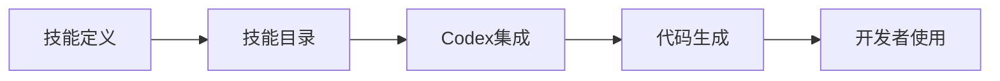
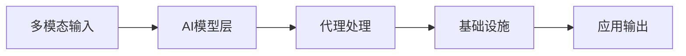
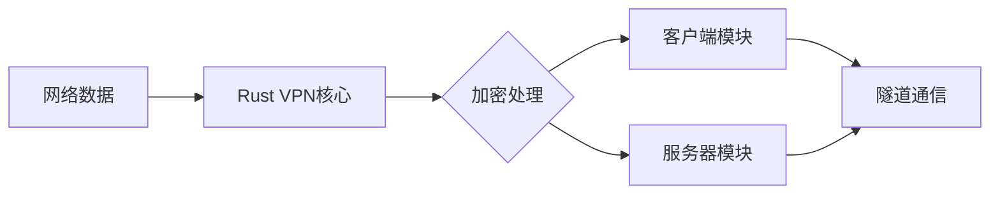
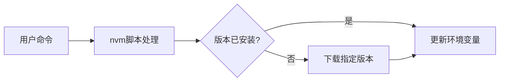
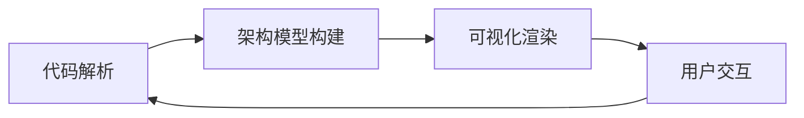

## 今日热点

AI代理技术与安全工具成为今日焦点，OpenAI技能目录与字节跳动多模态AI代理栈大幅增长，同时安全扫描与VPN工具也备受关注，显示开发者对AI应用与网络安全的高度重视。

---

## 热门项目一览

| 排名 | 项目 | 语言 | 今日 | 总计 | 简介 |
|:---:|------|:----:|------:|-----:|------|
| 1 | [openai/skills](https://github.com/openai/skills) | Python | +583 | 4,871 | Skills Catalog for Codex |
| 2 | [bytedance/UI-TARS-desktop](https://github.com/bytedance/UI-TARS-desktop) | TypeScript | +573 | 27,114 | The Open-Source Multimodal ... |
| 3 | [ZeroTworu/anet](https://github.com/ZeroTworu/anet) | Rust | +193 | 533 | Simple Rust VPN Client / Se... |
| 4 | [aquasecurity/trivy](https://github.com/aquasecurity/trivy) | Go | +165 | 31,542 | Find vulnerabilities, misco... |
| 5 | [nvm-sh/nvm](https://github.com/nvm-sh/nvm) | Shell | +131 | 91,502 | Node Version Manager - POSI... |
| 6 | [DataExpert-io/data-engineer-handbook](https://github.com/DataExpert-io/data-engineer-handbook) | Jupyter Notebook | +71 | 39,873 | This is a repo with links t... |
| 7 | [Flowseal/zapret-discord-youtube](https://github.com/Flowseal/zapret-discord-youtube) | Batchfile | +70 | 21,969 | No description |
| 8 | [likec4/likec4](https://github.com/likec4/likec4) | TypeScript | +40 | 1,814 | Visualize, collaborate, and... |

---

## 趋势洞察

```
┌─────────────────────────────────────────────────────────────────┐
│  AI/ML 工具         ████████████████████████  3 个项目        │
│  其他               ████████████████████████  3 个项目        │
│  开发工具             ████████                  1 个项目        │
│  数据分析             ████████                  1 个项目        │
└─────────────────────────────────────────────────────────────────┘
```

---

## 项目深度解读

### 1. openai/skills — AI编程技能库

> **一句话总结**：为OpenAI Codex提供结构化编程技能目录，提升AI辅助开发效率与代码质量

#### 价值主张

| 维度 | 说明 |
|------|------|
| **解决痛点** | 解决AI代码生成缺乏标准化、可重用技能的问题 |
| **目标用户** | 使用OpenAI Codex的开发者和AI编程研究者 |
| **核心亮点** | 结构化技能库 + 标准化代码接口 + 提升编程效率 |

#### 技术架构



**技术特色**：
- 基于Python的模块化技能管理系统
- 提供标准化技能接口与元数据
- 支持技能组合与复杂任务编排

#### 热度分析

- 项目单日增长583星，反映开发者对AI编程工具的强烈需求
- 作为OpenAI官方项目，在AI开发生态中占据战略位置

#### 快速上手

```bash
# 克隆仓库
git clone https://github.com/openai/skills.git

# 安装依赖
cd skills && pip install -r requirements.txt
```

#### 注意事项

- 项目许可证未知，使用前需确认授权条款
- 需配合OpenAI Codex模型使用才能发挥最大效用
- 技能库持续更新，建议关注最新版本变化


### 2. bytedance/UI-TARS-desktop — 多模态AI代理栈

> **一句话总结**：开源多模态AI代理栈，无缝连接前沿AI模型与基础设施，构建智能应用生态。

#### 价值主张

| 维度 | 说明 |
|------|------|
| **解决痛点** | AI模型与应用开发之间的鸿沟，缺乏统一的代理基础设施 |
| **目标用户** | AI开发者、研究人员和企业技术团队 |
| **核心亮点** | 多模态能力 + 开源架构 + 模型连接 + 代理框架 + 企业级支持 |

#### 技术架构



**技术特色**：
- 支持多模态数据处理与融合
- 模块化AI模型连接架构
- 企业级代理基础设施支持

#### 热度分析

- Star数超2.7万且持续增长，显示项目在AI领域具有重要影响力
- Fork数稳定，社区参与度高，适合企业级应用场景

#### 快速上手

```bash
# 克隆项目
git clone https://github.com/bytedance/UI-TARS-desktop.git
# 安装依赖
npm install
# 启动开发环境
npm run dev
```

#### 注意事项

- 项目可能需要较高的计算资源支持AI模型运行
- 需要了解相关AI模型的基础知识才能充分利用项目功能
- 注意查看项目的最新文档，因为AI领域发展迅速


### 3. ZeroTworu/anet — 轻量级Rust VPN

> **一句话总结**：用Rust实现的简洁VPN解决方案，提供客户端与服务器功能，注重安全与性能平衡。

#### 价值主张

| 维度 | 说明 |
|------|------|
| **解决痛点** | 提供无需复杂配置的轻量级VPN实现，兼顾安全性与易用性 |
| **目标用户** | 需要简单VPN解决方案的开发者和技术爱好者 |
| **核心亮点** | Rust内存安全 + 轻量级设计 + 简单API + 跨平台支持 |

#### 技术架构



**技术特色**：
- 利用Rust所有权系统防止内存安全问题
- 采用高效异步IO模型提升并发处理能力
- 模块化设计便于功能扩展与维护

#### 热度分析

- 项目单日新增193个Star，显示社区对Rust VPN解决方案的高度关注
- Fork数相对较少，表明项目处于早期探索阶段，用户更多在评估而非二次开发

#### 快速上手

```bash
# 克隆项目
git clone https://github.com/ZeroTworu/anet.git
cd anet

# 编并运行
cargo run -- --help
```

#### 注意事项

- 项目处于早期阶段，可能存在稳定性问题
- License信息不明确，使用前需确认开源协议
- 功能可能不如成熟VPN解决方案全面，适合轻量级使用场景


### 4. aquasecurity/trivy — 容器安全扫描器

> **一句话总结**：Trivy是一款开源的全栈安全扫描工具，可检测容器、Kubernetes及代码仓库中的漏洞、配置错误和敏感信息。

#### 价值主张

| 维度 | 说明 |
|------|------|
| **解决痛点** | 解决多云环境下安全合规检测难题，提供统一安全评估能力 |
| **目标用户** | DevOps团队、安全工程师、云原生应用开发者 |
| **核心亮点** | 多环境支持 + 高性能扫描 + 轻量级设计 + 丰富漏洞数据库 + 易于集成 |

#### 技术架构


**技术特色**：
- 轻量级设计，无需预装数据库或代理
- 集成多个权威漏洞数据源（CVE、NVD等）
- 支持多种扫描模式（文件系统、容器镜像、Git仓库等）

#### 热度分析

- 项目Star数超31k且持续增长，表明在容器安全领域获得广泛认可
- 零开放Issues反映项目维护成熟度高，社区问题响应及时

#### 快速上手

```bash
# 扫描本地容器镜像中的漏洞
docker run --rm -v /var/run/docker.sock:/var/run/docker.sock aquasec/trivy image <your-image-name>

# 扫描文件系统中的漏洞
trivy fs /path/to/directory
```

#### 注意事项

- 扫描大型容器镜像可能需要较长时间和较多内存资源
- 某些私有注册表可能需要额外配置认证信息
- 定期更新漏洞数据库以确保检测结果的准确性


### 5. nvm-sh/nvm — Node版本管理器

> **一句话总结**：轻量级Node.js版本管理工具，支持多版本共存与快速切换，提升开发效率。

#### 价值主张

| 维度 | 说明 |
|------|------|
| **解决痛点** | 解决Node.js版本冲突与切换困难，实现多版本隔离开发 |
| **目标用户** | 前端开发者、Node.js开发者、全栈工程师 |
| **核心亮点** | + 多版本并行管理 + 快速版本切换 + 纯bash实现 + 跨平台兼容 |

#### 技术架构



**技术特色**：
- 纯 bash 实现，无需外部依赖
- 通过修改 PATH 环境变量实现版本切换
- 支持 .nvmrc 文件自动检测项目所需版本
- 兼容多种操作系统和 Shell 环境

#### 热度分析

- Star 数量超9万且持续增长，表明项目在 Node.js 开发者中广泛采用且需求稳定
- 作为 Node.js 生态的基础工具，处于开发工具链的关键位置，社区活跃度高

#### 快速上手

```bash
# 安装 nvm
curl -o- https://raw.githubusercontent.com/nvm-sh/nvm/v0.39.0/install.sh | bash

# 安装最新 LTS 版本 Node.js
nvm install --lts

# 切换到特定版本
nvm use 16.15.0
```

#### 注意事项

- nvm 安装后需要重新加载 Shell 配置或新开终端才能使用
- 在某些系统上可能需要配置 bash 自动补全功能以获得完整体验
- 在 CI/CD 环境中使用时，需要确保 nvm 被正确初始化并设置版本


### 6. DataExpert-io/data-engineer-handbook — 数据工程学习指南

> **一句话总结**：一个全面的数据工程学习资源集合，包含从基础到高级的所有必要知识点和工具链接。

#### 价值主张

| 维度 | 说明 |
|------|------|
| **解决痛点** | 数据工程学习路径分散，缺乏系统化整合资源 |
| **目标用户** | 数据工程师、数据科学家、学习数据工程的学生和自学者 |
| **核心亮点** | 资源全面覆盖数据工程全栈 + 按主题分类整理便于查找 + 持续更新保持时效性 |

#### 技术架构

**技术特色**：
- 基于 Jupyter Notebook 组织内容，便于交互式学习
- 使用 Markdown 链接整合外部资源，形成知识网络
- 结构化分类展示数据工程各领域资源

#### 热度分析

- Star 数近4万且持续增长，表明数据工程领域需求旺盛
- Fork 数近8千，显示社区高度参与和资源二次利用活跃

#### 快速上手

```bash
# 克隆仓库到本地
git clone https://github.com/DataExpert-io/data-engineer-handbook.git

# 使用 Jupyter Notebook 打开（可选）
jupyter notebook data-engineer-handbook.ipynb
```

#### 注意事项

- 这是一个外部链接集合，部分链接可能失效
- 内容主要基于开源资源，商业工具链接可能有限
- 学习路径需要根据个人背景和目标进行定制


### 7. Flowseal/zapret-discord-youtube — 网络绕行工具

> **一句话总结**：通过Windows批处理脚本绕过Discord和YouTube访问限制的简易工具

#### 价值主张

| 维度 | 说明 |
|------|------|
| **解决痛点** | 解决无法访问Discord和YouTube的网络限制问题 |
| **目标用户** | 面临网络限制的Windows用户，需使用特定服务 |
| **核心亮点** | 批处理实现 + 无需安装 + 即插即用 + 简单配置 + 免费使用 |

#### 技术架构


**技术特色**：
- 利用Windows批处理脚本简化网络配置修改
- 通过修改系统路由表或DNS设置绕过限制
- 无需安装额外软件，降低系统资源占用

#### 热度分析

- 高星项目(21k+)表明其解决了广泛用户的痛点，且持续获得新关注
- 较高fork比例(1.8k)显示社区积极参与改进和本地化

#### 快速上手

```bash
# 下载批处理文件
# 以管理员权限运行脚本
# 按照提示选择Discord或YouTube访问
```

#### 注意事项

- 需要以管理员权限运行脚本
- 可能影响系统网络配置，使用前建议备份
- 在某些地区使用此类工具可能违反当地法律法规


### 8. likec4/likec4 — 架构可视化工具

> **一句话总结**：基于代码的软件架构可视化平台，实时生成与代码同步的动态架构图。

#### 价值主张

| 维度 | 说明 |
|------|------|
| **解决痛点** | 架构图与代码脱节，无法保持同步，导致设计与实现不一致 |
| **目标用户** | 软件开发团队、系统架构师、技术文档编写者 |
| **核心亮点** | 代码自动生成 + 实时同步更新 + 协同编辑 + 多种图表格式 |

#### 技术架构



**技术特色**：
- 基于TypeScript开发，提供类型安全保障
- 采用声明式架构描述，简化配置复杂度
- 支持实时双向同步，确保图表与代码一致

#### 热度分析

- 项目Star数快速增长，单日增长40，表明社区关注度持续上升
- 虽然Issues为0，但Fork数适中，表明项目处于早期发展阶段但已有一定采用度

#### 快速上手

```bash
# 安装likec4
npm install -g likec4

# 初始化项目
likec4 init my-architecture

# 启动可视化服务
likec4 dev
```

#### 注意事项

- 需要正确配置架构描述文件才能生成准确的图表
- 可能需要学习特定的DSL来描述架构关系
- 与现有代码库的集成可能需要额外配置


## 今日推荐

| 主题 | 推荐项目 | 亮点 |
|------|----------|------|
| 今日最热 | [openai/skills](https://github.com/openai/skills) | Skills Catalog fo... |
| 值得关注 | [bytedance/UI-TARS-desktop](https://github.com/bytedance/UI-TARS-desktop) | The Open-Source M... |
| 快速上手 | [ZeroTworu/anet](https://github.com/ZeroTworu/anet) | Simple Rust VPN C... |
| 长期潜力 | [aquasecurity/trivy](https://github.com/aquasecurity/trivy) | Find vulnerabilit... |

---

<div align="center">

*Generated on 2026-02-07 | Powered by GitHub Trending Reporter*

</div>