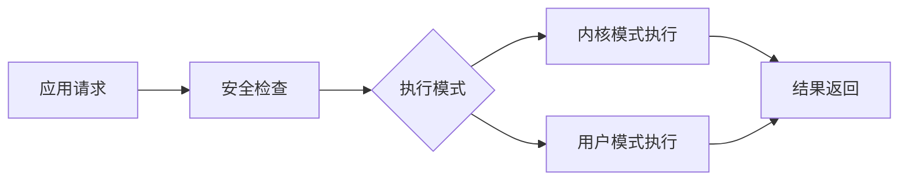
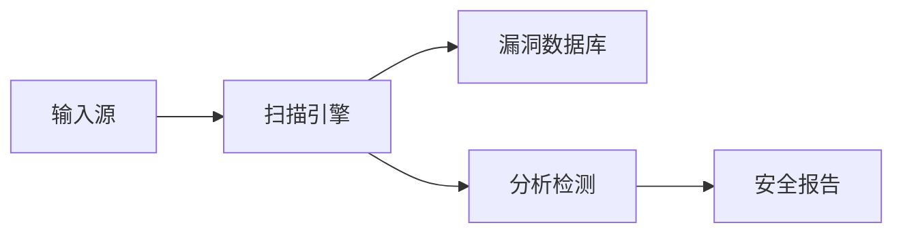

## 今日热点

今日GitHub热榜聚焦AI安全与能力扩展两大趋势，从自动化漏洞发现到大模型技能生态，反映出AI技术在安全边界与能力拓展方面的双重探索。

---

## 热门项目一览

| 排名 | 项目 | 语言 | 今日 | 总计 | 简介 |
|:---:|------|:----:|------:|-----:|------|
| 1 | [KeygraphHQ/shannon](https://github.com/KeygraphHQ/shannon) | TypeScript | +3,139 | 10,068 | Fully autonomous AI hacker ... |
| 2 | [obra/superpowers](https://github.com/obra/superpowers) | Shell | +686 | 46,998 | An agentic skills framework... |
| 3 | [openai/skills](https://github.com/openai/skills) | Python | +592 | 6,038 | Skills Catalog for Codex |
| 4 | [microsoft/litebox](https://github.com/microsoft/litebox) | Rust | +584 | 1,142 | A security-focused library ... |
| 5 | [ComposioHQ/awesome-claude-skills](https://github.com/ComposioHQ/awesome-claude-skills) | Python | +443 | 32,029 | A curated list of awesome C... |
| 6 | [likec4/likec4](https://github.com/likec4/likec4) | TypeScript | +274 | 2,083 | Visualize, collaborate, and... |
| 7 | [aquasecurity/trivy](https://github.com/aquasecurity/trivy) | Go | +168 | 31,689 | Find vulnerabilities, misco... |
| 8 | [gitbutlerapp/gitbutler](https://github.com/gitbutlerapp/gitbutler) | Rust | +85 | 18,004 | The GitButler version contr... |
| 9 | [p-e-w/heretic](https://github.com/p-e-w/heretic) | Python | +69 | 4,746 | Fully automatic censorship ... |
| 10 | [OpenBMB/MiniCPM-o](https://github.com/OpenBMB/MiniCPM-o) | Python | +44 | 23,164 | A Gemini 2.5 Flash Level ML... |
| 11 | [viarotel-org/escrcpy](https://github.com/viarotel-org/escrcpy) | JavaScript | +27 | 7,845 | 📱 Display and control your ... |
| 12 | [wavetermdev/waveterm](https://github.com/wavetermdev/waveterm) | Go | +25 | 17,149 | An open-source, cross-platf... |

---

## 趋势洞察

```
┌─────────────────────────────────────────────────────────────────┐
│  AI/ML 工具         ████████████████████████  7 个项目        │
│  其他               ██████████                3 个项目        │
│  开发工具             ███                       1 个项目        │
│  安全工具             ███                       1 个项目        │
└─────────────────────────────────────────────────────────────────┘
```

---

## 项目深度解读

### 1. KeygraphHQ/shannon — AI安全测试

> **一句话总结**：全自动AI黑客工具，以96.15%成功率发现Web应用实际漏洞，实现安全测试自动化。

#### 价值主张

| 维度 | 说明 |
|------|------|
| **解决痛点** | 人工渗透测试成本高、效率低，难以全面覆盖潜在安全漏洞 |
| **目标用户** | 企业安全团队、开发人员、渗透测试专家、DevOps工程师 |
| **核心亮点** | 全自动化AI驱动 + 无需提示源码感知 + 高精度漏洞发现 + XBOW基准96.15%成功率 |

#### 技术架构


**技术特色**：
- AI驱动的自主漏洞发现技术，大幅提升安全测试效率
- 源码感知能力，无需人工提示即可发现深层次漏洞
- 高精度验证机制，确保发现的漏洞具有实际利用价值

#### 热度分析

- 项目Star数过万且单日增长3000+，表明安全领域对AI自动化测试工具的高度需求
- 作为开源AI安全工具，填补了自动化渗透测试市场空白，社区关注度极高

#### 快速上手

```bash
# 克隆项目
git clone https://github.com/KeygraphHQ/shannon.git
cd shannon

# 安装依赖并运行
npm install
npm run scan -- --target <web_app_url>
```

#### 注意事项

- 许可证信息未知，商业使用前需确认授权条款
- 使用前应确保有合法授权，避免对未经授权的系统进行扫描
- AI发现的漏洞需要人工验证，可能存在误报情况
- 建议仅用于自有系统或获得明确授权的系统测试


### 2. obra/superpowers — 智能技能框架

> **一句话总结**：一种实用智能技能框架与软件开发方法论，提升个人与团队效能。

#### 价值主张

| 维度 | 说明 |
|------|------|
| **解决痛点** | 解决软件开发过程中技能获取与应用效率低下问题 |
| **目标用户** | 软件开发者、技术团队、个人提升者 |
| **核心亮点** | 实用框架 + 方法论 + 智能化 + 可扩展 + 持续改进 |

#### 技术架构


**技术特色**：
- 基于Shell的跨平台兼容性
- 模块化技能框架设计
- 轻量级实现，易于集成

#### 热度分析

- 项目获得近5万星，增长迅速，表明方法获得广泛认可
- 零开放问题，表明项目维护良好，用户问题已得到有效解决

#### 快速上手

```bash
# 克隆项目
git clone https://github.com/obra/superpowers.git
# 进入目录并执行安装
cd superpowers && ./install.sh
```

#### 注意事项

- 项目使用Shell脚本，可能需要特定的Shell环境
- 需要理解项目背后的方法论才能有效利用框架
- 可能需要根据个人需求调整框架内容


### 3. openai/skills — AI技能库

> **一句话总结**：一个为OpenAI Codex设计的可组合技能集合，旨在提升AI编程能力。

#### 价值主张

| 维度 | 说明 |
|------|------|
| **解决痛点** | 解决AI模型缺乏结构化编程技能指导的问题 |
| **目标用户** | AI开发者、研究人员和希望提升AI编程能力的用户 |
| **核心亮点** | 可组合技能结构 + Codex专用优化 + 实用代码示例 |

#### 技术架构


**技术特色**：
- 技能模块化设计，便于组合使用
- 针对Codex模型优化的提示模板
- 结构化的技能分类系统

#### 热度分析

- 项目近期Star增长迅速(+592 today)，表明社区关注度高涨
- 作为OpenAI官方项目，在AI编程生态中占据重要位置

#### 快速上手

```bash
# 克隆项目
git clone https://github.com/openai/skills.git

# 查看技能目录
cd skills && ls -R
```

#### 注意事项

- 项目许可证未知，使用前需确认授权条款
- 需要OpenAI API访问权限才能充分利用Codex相关功能
- 技能可能需要根据具体应用场景进行调整


### 4. microsoft/litebox — 安全库操作系统

> **一句话总结**：安全导向的轻量级库操作系统，支持内核和用户双模式执行。

#### 价值主张

| 维度 | 说明 |
|------|------|
| **解决痛点** | 在保证安全性的同时提供灵活的双模式执行能力 |
| **目标用户** | 安全研究人员、系统级开发者、安全工具开发者 |
| **核心亮点** | 安全导向设计 + 内核用户双模式支持 + Rust内存安全保证 |

#### 技术架构



**技术特色**：
- 安全导向的库操作系统架构设计
- Rust语言提供内存安全保障
- 支持内核和用户模式无缝切换

#### 热度分析

- 项目单日增长584个Star，表明近期获得安全领域高度关注
- 较低Fork数与高Star数对比，显示项目更多作为参考而非二次开发

#### 快速上手

```bash
git clone https://github.com/microsoft/litebox.git
cd litebox
cargo build
```

#### 注意事项

- 许可证未知，使用前需确认授权方式
- 项目为早期阶段，API和功能可能不稳定
- 作为库操作系统，需要系统级编程知识才能有效使用


### 5. ComposioHQ/awesome-claude-skills — Claude技能精选

> **一句话总结**：精选Claude技能资源库，助力AI工作流高效定制与扩展。

#### 价值主张

| 维度 | 说明 |
|------|------|
| **解决痛点** | 解决Claude AI功能碎片化、集成困难的问题 |
| **目标用户** | Claude AI开发者、AI研究人员及企业应用集成者 |
| **核心亮点** | 精选高质量资源 + 提供实用工具 + 社区驱动更新 |

#### 技术架构


**技术特色**：
- 采用Python编写，便于扩展和定制
- 结构化组织Claude相关资源，便于查找
- 社区驱动更新，保持内容时效性

#### 热度分析

- 项目Star数超3.2万，单日增长443，表明Claude生态系统热度持续攀升
- 作为资源聚合型项目，在AI工具生态中占据重要参考位置

#### 快速上手

```bash
# 访问项目资源库
git clone https://github.com/ComposioHQ/awesome-claude-skills.git
cd awesome-claude-skills
# 查看README获取完整资源列表
cat README.md
```

#### 注意事项

- 资源质量参差不齐，使用前需自行评估
- 部分资源可能需要API访问权限或付费订阅
- Claude API持续更新，部分技能可能随API变更而失效


### 6. likec4/likec4 — 架构可视化工具

> **一句话总结**：从代码自动生成实时架构图，支持团队协作与架构演进的工具

#### 价值主张

| 维度 | 说明 |
|------|------|
| **解决痛点** | 传统架构图与代码脱节，维护成本高，无法反映系统真实架构状态 |
| **目标用户** | 软件开发团队、架构师、技术负责人 |
| **核心亮点** | 代码驱动架构图 + 实时同步更新 + 团队协作功能 + 支持架构演进历史 |

#### 技术架构


**技术特色**：
- 基于TypeScript的全栈开发实现
- 采用代码静态分析技术提取架构信息
- 实时更新机制确保架构图与代码同步

#### 热度分析

- 项目Star数增长迅速，今日新增274星，表明社区关注度持续上升
- 虽然Open Issues为0，但Fork数相对较少，说明项目可能处于早期发展阶段

#### 快速上手

```bash
# 安装likec4
npm install -g likec4

# 初始化项目
likec4 init my-architecture

# 启动服务
likec4 dev
```

#### 注意事项

- 项目许可证未知，可能存在商业使用限制
- 项目可能处于早期阶段，API和功能可能会有较大变化
- 需要一定的学习成本，特别是配置代码到架构图的映射关系


### 7. aquasecurity/trivy — 全方位安全扫描器

> **一句话总结**：Trivy是一款开源安全扫描工具，可快速检测容器、Kubernetes和代码中的漏洞、配置错误和密钥泄露。

#### 价值主张

| 维度 | 说明 |
|------|------|
| **解决痛点** | 统一扫描多种环境的安全风险，解决安全检查工具碎片化问题 |
| **目标用户** | DevOps团队、安全工程师、云原生应用开发者 |
| **核心亮点** | 轻量级快速扫描 + 多环境支持 + 丰富的漏洞数据库 |

#### 技术架构



**技术特色**：
- 轻量级设计，无需预装依赖
- 使用NVD等公共漏洞数据库
- 支持多种扫描模式（文件系统、容器镜像等）

#### 热度分析

- 项目Star数超过3万，近7天增长168，表明项目在安全工具领域受关注度高
- 作为CNCF沙盒项目，在云原生安全领域具有生态影响力，社区活跃

#### 快速上手

```bash
# 扫描容器镜像中的漏洞
docker run --rm -v /var/run/docker.sock:/var/run/docker.sock aquasec/trivy:latest image your-image-name

# 扫描文件系统中的漏洞
trivy fs /path/to/directory
```

#### 注意事项

- 扫描大型容器镜像可能需要较长时间和较多资源
- 定期更新漏洞数据库以确保扫描结果的准确性
- 对于私有容器仓库，可能需要配置认证信息


### 8. gitbutlerapp/gitbutler — Git管理客户端

> **一句话总结**：基于Rust/Tauri/Svelte构建的现代化Git桌面客户端，提供直观的分支管理界面和操作体验。

#### 价值主张

| 维度 | 说明 |
|------|------|
| **解决痛点** | 传统Git命令行操作复杂，图形界面工具功能有限 |
| **目标用户** | 需要可视化Git操作的开发者和团队 |
| **核心亮点** | 直观的分支管理 + 可视化提交历史 + 跨平台支持 + 与原生Git深度集成 |

#### 技术架构


**技术特色**：
- 基于Rust构建高性能跨平台桌面应用
- 使用Tauri实现轻量级且安全的应用架构
- Svelte提供响应式且高效的UI体验

#### 热度分析

- 项目获得18k+星标且持续增长(+85今日)，表明开发者社区对其高度认可
- 774次Fork显示开发者对其技术实现和功能的积极参与和贡献意愿
- 0个Open Issues可能表明项目管理严格或处于稳定发展阶段

#### 快速上手

```bash
# 克隆仓库
git clone https://github.com/gitbutlerapp/gitbutler.git
cd gitbutler

# 安装依赖
npm install

# 运行应用
npm run tauri dev
```

#### 注意事项

- 项目尚未明确许可证信息，使用前需确认开源许可条款
- 作为较新的项目，长期维护路线和社区支持情况需要持续关注
- 可能存在与某些Git工作流程的兼容性问题，建议先在非关键项目中测试


### 9. p-e-w/heretic — AI审查绕过工具

> **一句话总结**：自动解除大型语言模型的内容限制，实现无障碍的AI对话能力。

#### 价值主张

| 维度 | 说明 |
|------|------|
| **解决痛点** | 语言模型内容限制过于严格，阻碍正常使用与研究 |
| **目标用户** | 需要突破AI限制的研究人员、开发者和高级用户 |
| **核心亮点** | 自动化 + 无需修改模型 + 保持功能完整性 |

#### 技术架构


**技术特色**：
- 利用提示工程技巧绕过安全机制
- 不需要修改底层模型参数
- 保持模型原有功能完整性

#### 热度分析

- 项目获得4746 stars且持续增长，显示社区高度关注与需求
- 无开放问题表明项目相对成熟或社区通过其他渠道交流

#### 快速上手

```bash
pip install heretic
python -m heretic "你想输入给模型的提示"
```

#### 注意事项

- 此工具可能违反AI服务提供商的使用条款
- 使用时需考虑伦理和法律边界
- 可能被用于生成不当内容


### 10. OpenBMB/MiniCPM-o — [手机端多模态]

> **一句话总结**：轻量级多模态大模型，支持视觉语音处理及全双工直播，可在手机端高效运行。

#### 价值主张

| 维度 | 说明 |
|------|------|
| **解决痛点** | 提供高性能多模态AI能力，解决移动端算力限制问题 |
| **目标用户** | 移动应用开发者、AI研究人员、内容创作者 |
| **核心亮点** | 轻量化设计 + 多模态融合 + 全双工实时交互 + 低资源适配 |

#### 技术架构


**技术特色**：
- 轻量化模型设计，适配移动端低算力环境
- 多模态信息融合技术，实现跨模态理解与生成
- 全双工实时交互技术，支持低延迟流式处理

#### 热度分析

- 项目星数增长迅速，单日增长44星，表明社区关注度持续走高
- 作为OpenBMB开源社区项目，在移动端多模态AI领域具有重要生态地位

#### 快速上手

```bash
# 安装依赖
pip install minicpm-o

# 基本使用
from minicpm_o import MiniCPM
model = MiniCPM.from_pretrained("OpenBMB/MiniCPM-o")
response = model.generate("描述这张图片", image=image)
```

#### 注意事项

- 模型在移动端运行时需要注意资源占用和功耗管理
- 多模态处理对输入数据格式有特定要求，需参考官方文档
- 全双工模式可能需要特定硬件支持以获得最佳性能


### 11. viarotel-org/escrcpy — Android控制工具

> **一句话总结**：基于JavaScript的Android设备图形化控制工具，实现屏幕投射与远程操作。

#### 价值主张

| 维度 | 说明 |
|------|------|
| **解决痛点** | 需要图形化方式远程控制Android设备，无需物理接触设备 |
| **目标用户** | 开发者、测试人员、Android设备管理员 |
| **核心亮点** | 轻量级实现 + 跨平台支持 + 简易集成 + 低延迟控制 |

#### 技术架构


**技术特色**：
- 使用JavaScript实现跨平台兼容性
- 通过ADB协议与Android设备通信
- 提供Web界面实现图形化控制

#### 热度分析

- 项目获得7845个Star且持续增长(+27 today)，表明该项目在Android远程控制领域具有较高认可度
- 相对较少的Fork数(569)可能暗示项目维护良好，用户倾向于直接使用而非分叉

#### 快速上手

```bash
# 安装依赖
npm install

# 启动服务
npm start

# 连接Android设备
adb connect <device-ip>:<port>
```

#### 注意事项

- 需要预先安装ADB工具并配置Android设备调试模式
- 确保设备与计算机在同一网络或通过USB连接
- 可能需要root权限或启用USB调试模式以获得完整功能


### 12. wavetermdev/waveterm — 现代终端工作流工具

> **一句话总结**：WaveTerm是一款跨平台终端工具，通过集成多种功能实现开发工作流程的无缝衔接。

#### 价值主张

| 维度 | 说明 |
|------|------|
| **解决痛点** | 传统终端工具功能分散，工作流程不连贯 |
| **目标用户** | 开发者、系统管理员、需要高效命令行操作的用户 |
| **核心亮点** | 跨平台支持 + 现代化界面 + 工作流集成 + 高性能 + 可扩展性 |

#### 技术架构


**技术特色**：
- 基于Go语言构建，实现跨平台兼容性
- 采用现代UI设计，提升终端使用体验
- 内置多种开发工具集成，减少应用切换

#### 热度分析

- 项目获得17k+星标且持续增长，表明终端工具有稳定需求
- 零开放问题反映项目维护良好，用户体验较佳

#### 快速上手

```bash
# 下载并运行WaveTerm
go install github.com/wavetermdev/waveterm@latest
waveterm
```

#### 注意事项

- 项目许可证未知，需注意商业使用限制
- 作为新兴终端工具，可能存在兼容性问题


## 今日推荐

| 主题 | 推荐项目 | 亮点 |
|------|----------|------|
| 今日最热 | [KeygraphHQ/shannon](https://github.com/KeygraphHQ/shannon) | Fully autonomous ... |
| 值得关注 | [obra/superpowers](https://github.com/obra/superpowers) | An agentic skills... |
| 快速上手 | [openai/skills](https://github.com/openai/skills) | Skills Catalog fo... |
| 长期潜力 | [microsoft/litebox](https://github.com/microsoft/litebox) | A security-focuse... |

---

<div align="center">

*Generated on 2026-02-08 | Powered by GitHub Trending Reporter*

</div>