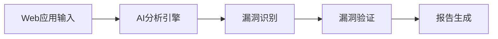
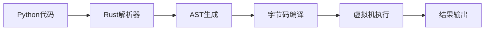
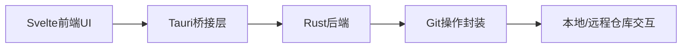
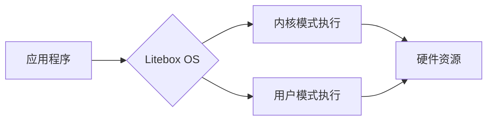
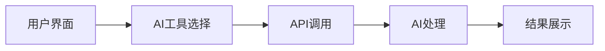
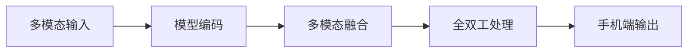
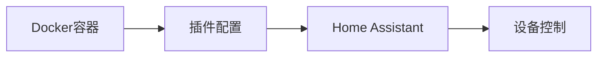

## 今日热点

AI安全工具与自主代理系统引领今日热榜，自动化漏洞发现与多模态AI模型展现强大技术实力，开发者正加速AI赋能安全与效率领域。

---

## 热门项目一览

| 排名 | 项目 | 语言 | 今日 | 总计 | 简介 |
|:---:|------|:----:|------:|-----:|------|
| 1 | [KeygraphHQ/shannon](https://github.com/KeygraphHQ/shannon) | TypeScript | +3,479 | 13,288 | Fully autonomous AI hacker ... |
| 2 | [openai/skills](https://github.com/openai/skills) | Python | +1,425 | 6,986 | Skills Catalog for Codex |
| 3 | [virattt/dexter](https://github.com/virattt/dexter) | TypeScript | +1,039 | 12,660 | An autonomous agent for dee... |
| 4 | [obra/superpowers](https://github.com/obra/superpowers) | Shell | +813 | 47,733 | An agentic skills framework... |
| 5 | [pydantic/monty](https://github.com/pydantic/monty) | Rust | +456 | 2,773 | A minimal, secure Python in... |
| 6 | [google/langextract](https://github.com/google/langextract) | Python | +438 | 24,768 | A Python library for extrac... |
| 7 | [gitbutlerapp/gitbutler](https://github.com/gitbutlerapp/gitbutler) | Rust | +414 | 18,348 | The GitButler version contr... |
| 8 | [microsoft/litebox](https://github.com/microsoft/litebox) | Rust | +359 | 1,413 | A security-focused library ... |
| 9 | [iOfficeAI/AionUi](https://github.com/iOfficeAI/AionUi) | TypeScript | +335 | 13,187 | Free, local, open-source 24... |
| 10 | [likec4/likec4](https://github.com/likec4/likec4) | TypeScript | +271 | 2,366 | Visualize, collaborate, and... |
| 11 | [OpenBMB/MiniCPM-o](https://github.com/OpenBMB/MiniCPM-o) | Python | +212 | 23,403 | A Gemini 2.5 Flash Level ML... |
| 12 | [home-assistant/addons](https://github.com/home-assistant/addons) | Shell | +11 | 1,998 | ➕ Docker add-ons for Home A... |

---

## 趋势洞察

```
┌─────────────────────────────────────────────────────────────────┐
│  AI/ML 工具         ████████████████████████  8 个项目        │
│  智能家居             ███                       1 个项目        │
│  开发工具             ███                       1 个项目        │
│  安全工具             ███                       1 个项目        │
│  其他               ███                       1 个项目        │
└─────────────────────────────────────────────────────────────────┘
```

---

## 项目深度解读

### 1. KeygraphHQ/shannon — AI安全测试

> **一句话总结**：全自动AI黑客系统，高效发现Web应用实际漏洞，准确率达96.15%

#### 价值主张

| 维度 | 说明 |
|------|------|
| **解决痛点** | 自动化发现Web应用中真实存在的安全漏洞，替代人工渗透测试 |
| **目标用户** | 安全研究人员、开发团队、企业安全负责人 |
| **核心亮点** | 全自动化操作 + 96.15%高成功率 + 无提示测试 + 源码感知能力 + XBOW基准认证 |

#### 技术架构



**技术特色**：
- 基于AI的自动化漏洞发现技术
- 源码感知能力，能理解应用代码逻辑
- 无提示测试，减少对测试环境的干扰
- 高准确率，96.15%的成功率在XBOW基准测试中表现优异
- TypeScript实现，保证类型安全和代码质量

#### 热度分析

- 项目近期增长迅猛，单日新增3,479个Star，表明社区高度关注
- Fork数为1,545，显示开发者社区积极参与和二次开发

#### 快速上手

```bash
# 安装依赖
npm install

# 运行Shannon测试
npm run shannon --target <web_app_url>
```

#### 注意事项

- 项目许可证信息不明确，使用前需确认授权条款
- 高准确率不意味着100%安全，仍需人工验证结果
- 仅适用于合法的安全测试，未经授权的测试可能违法
- 可能需要特定环境配置才能正常运行


### 2. openai/skills — AI技能库

> **一句话总结**：提供预定义代码技能集合，简化与Codex AI模型的交互开发流程。

#### 价值主张

| 维度 | 说明 |
|------|------|
| **解决痛点** | 开发者缺乏与AI模型交互的现成代码实现 |
| **目标用户** | AI应用开发者、Codex集成工程师 |
| **核心亮点** | 预定义技能库 + 与Codex深度集成 + 模块化设计 + 易于扩展 |

#### 技术架构


**技术特色**：
- 基于Python的技能封装系统
- 与OpenAI Codex API无缝集成
- 技能模块化设计与扩展机制

#### 热度分析

- 项目近期获得大量Stars(+1,425)，表明社区对其AI技能库概念高度认可
- 作为OpenAI官方项目，在AI开发领域具有重要生态地位

#### 快速上手

```bash
# 克隆仓库
git clone https://github.com/openai/skills.git
cd skills

# 安装依赖
pip install -r requirements.txt

# 导入并使用技能
from skills import SkillCatalog
catalog = SkillCatalog()
skills = catalog.list_skills()
```

#### 注意事项

- 注意技能可能需要OpenAI API密钥才能正常工作
- 确保使用与项目兼容的Python版本
- 某些技能可能需要额外的依赖库


### 3. virattt/dexter — 金融智能代理

> **一句话总结**：基于AI的自动化金融研究助手，能独立完成深度金融数据分析与报告生成。

#### 价值主张

| 维度 | 说明 |
|------|------|
| **解决痛点** | 金融研究耗时耗力，自动化程度低，缺乏深度分析能力 |
| **目标用户** | 金融分析师、投资机构、量化交易者、金融研究人员 |
| **核心亮点** | AI驱动自动化 + 深度金融分析 + 多源数据整合 + 独立研究报告生成 |

#### 技术架构


**技术特色**：
- 基于TypeScript开发，确保类型安全与高质量代码
- AI驱动的自动化金融分析与研究能力
- 多源金融数据整合与处理能力

#### 热度分析

- 项目获12,660 stars且单日新增1,039，表明项目近期热度极高，金融AI领域需求旺盛
- Fork数1,528，说明项目有良好的社区参与度和二次开发价值

#### 快速上手

```bash
# 克隆项目
git clone https://github.com/virattt/dexter.git

# 安装依赖
npm install

# 启动服务
npm start
```

#### 注意事项

- 项目依赖外部金融数据源，可能需要配置API密钥
- 金融AI分析结果仅供参考，投资决策需谨慎
- 项目可能需要较高的计算资源，特别是运行AI模型时
- 项目许可证信息未知，使用前需确认开源许可条款


### 4. obra/superpowers — 智能开发框架

> **一句话总结**：一个实用的代理技能框架与软件开发方法论，提升开发效率与质量。

#### 价值主张

| 维度 | 说明 |
|------|------|
| **解决痛点** | 传统开发方法效率低下，缺乏系统化技能框架指导 |
| **目标用户** | 软件开发者、技术团队和效率提升追求者 |
| **核心亮点** | 代理技能框架 + 开发方法论 + 实用性 + 高效性 |

#### 技术架构


**技术特色**：
- 基于Shell的轻量级实现
- 提供完整的开发方法论指导
- 强调实际应用与效果验证

#### 热度分析

- 项目获得47,733个Star且当日增长813，表明项目受到广泛关注且持续升温
- 3,627个Fork显示社区积极参与和二次开发意愿强烈

#### 快速上手

```bash
# 克隆项目
git clone https://github.com/obra/superpowers.git
# 进入目录并查看使用说明
cd superpowers && cat README.md
```

#### 注意事项

- 需要理解Shell脚本基础才能充分利用项目
- 建议先阅读完整文档再实践，避免配置错误
- 项目可能需要根据具体环境调整配置参数


### 5. pydantic/monty — AI Python解释器

> **一句话总结**：用Rust构建的轻量级安全Python解释器，专为AI应用场景优化。

#### 价值主张

| 维度 | 说明 |
|------|------|
| **解决痛点** | 传统Python解释器在AI环境中存在安全漏洞和性能瓶颈 |
| **目标用户** | AI开发者、机器学习工程师、需要安全执行Python的AI系统 |
| **核心亮点** | Rust内存安全 + 最小化设计 + 专为AI优化 |

#### 技术架构



**技术特色**：
- 利用Rust的内存安全特性消除传统Python解释器的安全漏洞
- 最小化设计减少攻击面，更适合AI环境中的受限执行
- 针对AI工作负载优化，提供更高效的执行环境

#### 热度分析

- 项目Star数2773且单日增长456，显示社区对其高度关注
- 作为Pydantic生态系统的新成员，有望成为AI安全执行Python代码的标准解决方案

#### 快速上手

```bash
# 克隆仓库
git clone https://github.com/pydantic/monty.git
cd monty

# 构建项目
cargo build --release

# 运行示例
./target/release/monty example.py
```

#### 注意事项

- 项目尚处于早期阶段，API和功能可能不稳定
- 目前仅支持Python子集，完整Python 3.x兼容性仍在开发中
- 需要Rust环境才能编译和使用
- 项目许可证信息不明确，商业使用前需确认授权条款


### 6. google/langextract — 文本结构化提取

> **一句话总结**：利用大语言模型从非结构化文本中提取结构化信息，并提供精确源定位和交互式可视化功能。

#### 价值主张

| 维度 | 说明 |
|------|------|
| **解决痛点** | 非结构化文本难以转化为结构化数据，缺乏精确溯源和可视化支持 |
| **目标用户** | 需要从大量文本中提取结构化信息的数据科学家和研究人员 |
| **核心亮点** | LLM驱动提取 + 精确源文档定位 + 交互式可视化 + 高准确性 + 易用API |

#### 技术架构


**技术特色**：
- 基于大语言模型的先进文本理解与信息提取能力
- 提供精确的源文档定位和引用，确保结果可验证
- 集成交互式可视化功能，便于直观分析和理解提取结果

#### 热度分析

- 项目获得24,768个Star，单日增长438个，表明受到广泛关注和认可
- Fork数1,712显示社区活跃度高，有较强的参与度和贡献意愿

#### 快速上手

```bash
# 安装
pip install langextract

# 基本使用
from langextract import extract
result = extract("非结构化文本内容")
```

#### 注意事项

- 项目依赖LLM服务，需考虑API调用成本和性能限制
- 项目许可证信息不明确，商业使用前需确认授权情况
- 可能需要额外配置API密钥或模型访问权限


### 7. gitbutlerapp/gitbutler — Git可视化工具

> **一句话总结**：基于Tauri/Rust/Svelte构建的现代化Git桌面客户端，提供直观的分支管理和版本控制界面。

#### 价值主张

| 维度 | 说明 |
|------|------|
| **解决痛点** | 传统Git命令行操作复杂，分支管理不直观，可视化界面提升效率 |
| **目标用户** | 需要图形化界面的Git使用者，从新手到专业开发者 |
| **核心亮点** | 直观的分支可视化 + 变更预览 + Tauri跨平台支持 + Rust高性能 |

#### 技术架构



**技术特色**：
- 基于Tauri框架，轻量级且跨平台支持，比Electron更高效
- Rust后端确保高性能、内存安全和与Git的紧密集成
- Svelte前端提供响应式和高效的UI体验，减少资源占用

#### 热度分析

- Star数达18,348且日增414，表明项目热度高且增长迅速，开发者社区认可度高
- 零Open Issues反映项目维护质量高，问题解决机制高效，社区参与度高

#### 快速上手

```bash
# 克隆仓库
git clone https://github.com/gitbutlerapp/gitbutler.git
# 进入项目目录
cd gitbutler
# 安装依赖并构建
npm install && cargo tauri build
```

#### 注意事项

- 项目许可证未知，使用前需确认授权条款
- 作为较新项目，生态系统和插件支持可能不如成熟工具丰富
- 需要Rust和Tauri环境支持，初学者可能面临一定学习曲线


### 8. microsoft/litebox — 安全库操作系统

> **一句话总结**：专注于安全的库操作系统，支持内核和用户模式双执行环境，提供高度隔离的安全保障。

#### 价值主张

| 维度 | 说明 |
|------|------|
| **解决痛点** | 解决传统操作系统安全模型漏洞，提供更安全的执行环境隔离 |
| **目标用户** | 安全研究人员、系统开发者、高安全需求应用开发者 |
| **核心亮点** | 微软出品 + Rust实现 + 双模式执行 + 高度安全隔离 |

#### 技术架构



**技术特色**：
- 基于Rust语言实现，内存安全保证
- 库操作系统设计，轻量级且高度模块化
- 支持内核和用户模式无缝切换
- 微软技术背景，企业级质量保证

#### 热度分析

- 项目近期增长迅速，单日新增359个star，表明技术社区高度关注安全领域创新
- 微软背书加上Rust生态系统的兴起，使其在系统安全领域具有独特生态位置

#### 快速上手

```bash
# 克隆仓库
git clone https://github.com/microsoft/litebox.git
cd litebox

# 构建项目
cargo build --release

# 运行示例
cargo run --example secure_execution
```

#### 注意事项

- 项目许可证未知，商业使用前需确认授权条款
- 作为库操作系统，可能需要较深的技术背景才能有效利用
- 项目相对较新，文档和示例可能不够完善
- 微软项目可能存在特定技术栈依赖，需确保环境兼容性


### 9. iOfficeAI/AionUi — AI编程助手平台

> **一句话总结**：本地开源的统一界面，整合多种AI编程助手工具，提供24/7全天候开发支持。

#### 价值主张

| 维度 | 说明 |
|------|------|
| **解决痛点** | 分散的AI编程工具缺乏统一管理，降低开发效率 |
| **目标用户** | 开发者、程序员、AI工具爱好者 |
| **核心亮点** | 本地部署 + 多AI工具集成 + 开源免费 + 24/7可用 + 跨平台支持 |

#### 技术架构



**技术特色**：
- TypeScript全栈开发，类型安全
- 模块化设计，支持多种AI工具集成
- 本地部署，保障数据隐私

#### 热度分析

- Star数超13k且持续增长，表明项目获得开发者广泛认可
- 社区活跃度高，已成为AI编程工具生态的重要一环

#### 快速上手

```bash
# 克隆项目
git clone https://github.com/iOfficeAI/AionUi.git

# 安装依赖
npm install

# 启动项目
npm start
```

#### 注意事项

- 项目需要本地部署，可能需要一定的技术基础
- 不同AI工具可能需要单独配置API密钥
- 开源许可证信息不明确，使用前需确认授权条款


### 10. likec4/likec4 — 架构可视化工具

> **一句话总结**：从代码实时生成、协作和演进软件架构图，确保架构文档与代码同步更新

#### 价值主张

| 维度 | 说明 |
|------|------|
| **解决痛点** | 传统架构文档与代码脱节，维护成本高，信息不一致 |
| **目标用户** | 软件架构师、开发团队和技术文档编写者 |
| **核心亮点** | 实时从代码生成架构图 + 支持团队协作 + 架构与代码同步更新 |

#### 技术架构


**技术特色**：
- 基于TypeScript开发，提供类型安全的架构定义
- 支持从现有代码自动提取架构信息
- 提供实时更新的架构可视化能力

#### 热度分析

- 项目Star数2366且近期增长271，表明其在架构可视化领域受到高度关注，处于快速发展阶段
- 作为架构工具生态中的新兴项目，填补了传统文档与代码同步的空白，社区活跃度高

#### 快速上手

```bash
# 安装LikeC4 CLI
npm install -g @likec4/cli

# 初始化项目
likec4 init

# 生成架构图
likec4 generate
```

#### 注意事项

- 项目可能需要特定的代码注释或标记来正确识别架构组件
- 对于大型项目，首次解析和生成可能需要较长时间
- 与现有CI/CD流程集成可能需要额外配置


### 11. OpenBMB/MiniCPM-o — 手机端多模态大模型

> **一句话总结**：轻量级多模态大模型，可在手机上实现视觉、语音和全双工多模态直播处理能力。

#### 价值主张

| 维度 | 说明 |
|------|------|
| **解决痛点** | 大模型在移动设备上资源受限，难以高效处理多模态任务 |
| **目标用户** | 移动应用开发者、内容创作者、需要AI功能的移动设备用户 |
| **核心亮点** | 轻量化设计 + 多模态融合 + 手机端高效运行 + 全双工交互能力 |

#### 技术架构



**技术特色**：
- 轻量化模型设计，适配手机端资源限制
- 多模态信息融合与处理能力
- 全双工交互实现实时流处理

#### 热度分析

- 项目获得23,403个Star，今日新增212个，Fork数1,788，表明项目正快速增长，受到社区高度关注
- OpenBMB是知名开源社区，该项目作为其重要组成部分，在移动端多模态AI领域占据重要生态位置

#### 快速上手

```bash
# 安装依赖
pip install -r requirements.txt

# 下载模型
git clone https://github.com/OpenBMB/MiniCPM-o.git

# 运行示例
python demo.py --model_path /path/to/model --input_type image
```

#### 注意事项

- 模型运行需要一定的计算资源，建议在性能较好的手机上使用
- 多模态处理可能需要额外的模型文件，请确保下载完整
- 全双工功能可能需要特定硬件支持


### 12. home-assistant/addons — 智能插件集

> **一句话总结**：为Home Assistant提供丰富的Docker插件，扩展智能家居功能边界。

#### 价值主张

| 维度 | 说明 |
|------|------|
| **解决痛点** | 为Home Assistant提供标准化、可扩展的插件解决方案 |
| **目标用户** | Home Assistant用户和智能家居开发者 |
| **核心亮点** | 模块化设计 + 易于部署 + 社区驱动 + 多样化功能 |

#### 技术架构



**技术特色**：
- 基于Docker的容器化部署，确保环境隔离
- 使用Shell脚本实现简单高效的插件管理
- 插件间互不干扰，支持独立更新

#### 热度分析

- 项目获得近2K星标，持续稳定增长，表明Home Assistant生态系统活跃
- 作为官方插件库，拥有高社区参与度和实用价值

#### 快速上手

```bash
# 克隆仓库
git clone https://github.com/home-assistant/addons.git

# 进入插件目录
cd addons

# 查看可用插件
ls -l
```

#### 注意事项

- 需要先安装Home Assistant基础系统
- 插件可能需要额外的配置文件才能正常工作
- 部分插件可能需要特定的硬件支持


## 今日推荐

| 主题 | 推荐项目 | 亮点 |
|------|----------|------|
| 今日最热 | [KeygraphHQ/shannon](https://github.com/KeygraphHQ/shannon) | Fully autonomous ... |
| 值得关注 | [openai/skills](https://github.com/openai/skills) | Skills Catalog fo... |
| 快速上手 | [virattt/dexter](https://github.com/virattt/dexter) | An autonomous age... |
| 长期潜力 | [obra/superpowers](https://github.com/obra/superpowers) | An agentic skills... |

---

<div align="center">

*Generated on 2026-02-09 | Powered by GitHub Trending Reporter*

</div>