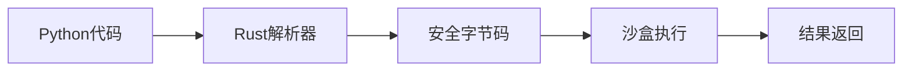
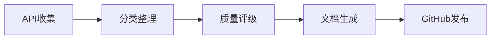
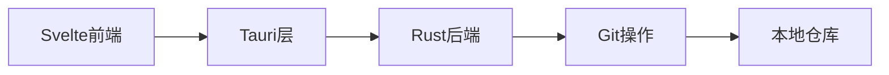
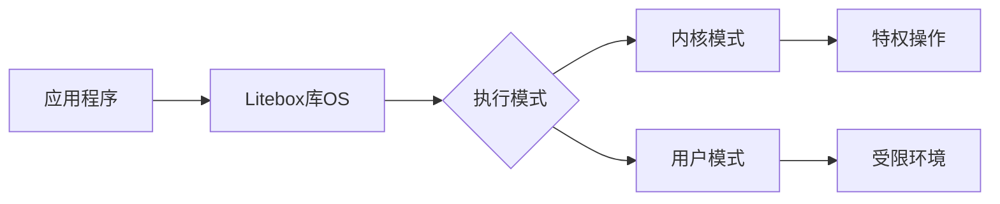
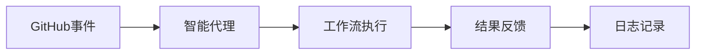
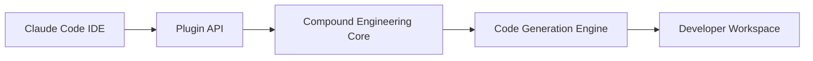

## 今日热点

AI代理与自动化工具持续火热，专业领域应用深化，特别是安全检测与金融分析方向；同时LLM应用生态系统快速扩展，多语言支持增强。

---

## 热门项目一览

| 排名 | 项目 | 语言 | 今日 | 总计 | 简介 |
|:---:|------|:----:|------:|-----:|------|
| 1 | [KeygraphHQ/shannon](https://github.com/KeygraphHQ/shannon) | TypeScript | +4,144 | 17,390 | Fully autonomous AI hacker ... |
| 2 | [pydantic/monty](https://github.com/pydantic/monty) | Rust | +1,291 | 3,973 | A minimal, secure Python in... |
| 3 | [virattt/dexter](https://github.com/virattt/dexter) | TypeScript | +1,115 | 13,569 | An autonomous agent for dee... |
| 4 | [openai/skills](https://github.com/openai/skills) | Python | +707 | 7,552 | Skills Catalog for Codex |
| 5 | [iOfficeAI/AionUi](https://github.com/iOfficeAI/AionUi) | TypeScript | +673 | 13,835 | Free, local, open-source 24... |
| 6 | [public-apis/public-apis](https://github.com/public-apis/public-apis) | Python | +410 | 397,232 | A collective list of free APIs |
| 7 | [gitbutlerapp/gitbutler](https://github.com/gitbutlerapp/gitbutler) | Rust | +376 | 18,656 | The GitButler version contr... |
| 8 | [microsoft/litebox](https://github.com/microsoft/litebox) | Rust | +354 | 1,729 | A security-focused library ... |
| 9 | [github/gh-aw](https://github.com/github/gh-aw) | Go | +260 | 926 | GitHub Agentic Workflows |
| 10 | [Shubhamsaboo/awesome-llm-apps](https://github.com/Shubhamsaboo/awesome-llm-apps) | Python | +227 | 93,166 | Collection of awesome LLM a... |
| 11 | [EveryInc/compound-engineering-plugin](https://github.com/EveryInc/compound-engineering-plugin) | TypeScript | +185 | 7,870 | Official Claude Code compou... |
| 12 | [hsliuping/TradingAgents-CN](https://github.com/hsliuping/TradingAgents-CN) | Python | +149 | 16,245 | 基于多智能体LLM的中文金融交易框架 - Tradin... |

---

## 趋势洞察

```
┌─────────────────────────────────────────────────────────────────┐
│  AI/ML 工具         ████████████████████████  9 个项目        │
│  多媒体应用            ██                        1 个项目        │
│  开发工具             ██                        1 个项目        │
│  安全工具             ██                        1 个项目        │
│  其他               ██                        1 个项目        │
└─────────────────────────────────────────────────────────────────┘
```

---

## 项目深度解读

### 1. KeygraphHQ/shannon — AI安全测试

> **一句话总结**：Shannon是一个完全自主的AI黑客工具，能以96.15%的成功率发现Web应用程序中的实际漏洞。

#### 价值主张

| 维度 | 说明 |
|------|------|
| **解决痛点** | 自动化发现Web应用漏洞，提高安全性测试效率和准确性 |
| **目标用户** | 安全研究员、开发团队、渗透测试人员、DevOps工程师 |
| **核心亮点** | 全自主AI攻击 + 96.15%高成功率 + 源代码感知 + 无需人工干预 |

#### 技术架构


**技术特色**：
- AI驱动的自动化漏洞发现技术
- 源代码感知的智能分析能力
- 高效的漏洞验证和报告机制

#### 热度分析

- 项目近期获得大量关注，一日内增加4,144星，表明安全社区对该AI安全工具有强烈需求
- 高关注度反映了自动化安全测试在DevSecOps流程中的重要性日益提升

#### 快速上手

```bash
# 克隆仓库
git clone https://github.com/KeygraphHQ/shannon.git

# 安装依赖并运行
cd shannon && npm install && npm start
```

#### 注意事项

- 使用前需确保有合法授权的目标应用，避免法律风险
- 96.15%的成功率是在特定测试环境(XBOW Benchmark)下得出的，实际应用效果可能因环境而异
- 由于许可证未知，需谨慎评估商业使用风险


### 2. pydantic/monty — AI安全解释器

> **一句话总结**：用Rust构建的轻量级安全Python解释器，专为AI应用场景优化。

#### 价值主张

| 维度 | 说明 |
|------|------|
| **解决痛点** | 解决AI环境中执行Python代码的安全风险和性能瓶颈 |
| **目标用户** | AI开发者、大模型系统架构师、安全敏感型应用开发者 |
| **核心亮点** | Rust内存安全 + 精简设计 + AI专用优化 + 高性能执行 |

#### 技术架构



**技术特色**：
- 基于Rust内存安全模型防止常见漏洞
- 精简解释器设计减少攻击面
- 针对AI工作负载优化执行效率
- 提供受限的Python环境确保安全边界

#### 热度分析

- 项目单日增长超1200星，表明AI安全解释器需求旺盛
- 0开放问题显示项目维护成熟，可能采用内部问题管理机制

#### 快速上手

```bash
# 克隆项目
git clone https://github.com/pydantic/monty.git

# 构建项目
cd monty && cargo build --release

# 运行Python代码
./target/release/monty example.py
```

#### 注意事项

- 项目可能处于早期阶段，API稳定性有待观察
- 作为精简解释器，可能不支持完整Python标准库
- 专为AI设计，传统Python应用可能需要适配


### 3. virattt/dexter — 智能金融代理

> **一句话总结**：基于AI的自动化金融研究代理，能够深度分析市场数据并生成投资洞察。

#### 价值主张

| 维度 | 说明 |
|------|------|
| **解决痛点** | 传统金融研究耗时耗力，缺乏自动化深度分析能力 |
| **目标用户** | 金融分析师、投资经理、量化交易者和个人投资者 |
| **核心亮点** | 自主研究能力 + 多维度数据分析 + 智能投资建议生成 |

#### 技术架构


**技术特色**：
- 基于TypeScript构建的高性能AI分析引擎
- 多源金融数据整合与实时处理能力
- 智能化投资建议生成与风险评估系统

#### 热度分析

- 项目近期热度极高，单日增长超过1100个star，表明重大更新或功能突破
- 社区活跃度极高，但issues为0可能表明问题通过其他渠道妥善解决

#### 快速上手

```bash
# 克隆项目
git clone https://github.com/virattt/dexter.git
# 安装依赖
npm install
# 启动服务
npm start
```

#### 注意事项

- 需要金融数据API访问权限才能完全使用
- 可能需要配置AI模型和相关密钥
- 金融投资存在风险，AI建议仅供参考


### 4. openai/skills — AI技能目录

> **一句话总结**：为Codex模型提供结构化技能目录，提升AI代码生成能力与效率。

#### 价值主张

| 维度 | 说明 |
|------|------|
| **解决痛点** | 解决AI代码生成中缺乏结构化技能知识的问题 |
| **目标用户** | AI开发者、研究人员及使用Codex的工程师 |
| **核心亮点** | 结构化技能目录 + 可扩展技能体系 + 多语言支持 |

#### 技术架构


**技术特色**：
- 采用结构化方式组织AI技能知识
- 支持多编程语言技能定义
- 提供可扩展的技能添加机制

#### 热度分析

- 项目近期获得显著关注，Star数增长迅速，显示社区对AI技能目录的强烈兴趣
- 作为OpenAI官方项目，在AI代码生成领域具有重要生态位置

#### 快速上手

```bash
# 克隆项目
git clone https://github.com/openai/skills.git

# 安装依赖
pip install -r requirements.txt
```

#### 注意事项

- 项目许可证信息不明确，使用前需确认授权条款
- 需要OpenAI API访问权限才能完整使用功能


### 5. iOfficeAI/AionUi — AI代码助手界面

> **一句话总结**：本地开源统一界面，支持多种AI编程助手全天候协作开发

#### 价值主张

| 维度 | 说明 |
|------|------|
| **解决痛点** | 多种AI代码助手分散，缺乏统一本地化界面体验 |
| **目标用户** | 需要整合多种AI编程工具的开发者和团队 |
| **核心亮点** | 本地部署保护隐私 + 开源免费 + 多AI助手集成 + 24/7可用 + 统一操作界面 |

#### 技术架构


**技术特色**：
- TypeScript开发，确保类型安全和代码质量
- 模块化AI适配器设计，支持多种AI服务无缝切换
- 本地优先架构，保护用户代码隐私安全

#### 热度分析
- 项目Star数超1.3万且持续快速增长，单日新增673，表明社区高度认可
- Fork数过千，显示开发者积极参与和二次开发意愿强烈

#### 快速上手
```bash
# 克隆项目
git clone https://github.com/iOfficeAI/AionUi.git
# 安装依赖
npm install
# 启动服务
npm run dev
```

#### 注意事项
- 项目License未明确，使用前需确认授权条款
- 需单独配置各AI服务的API密钥才能正常使用
- 本地部署环境需要满足Node.js和相关依赖要求


### 6. public-apis/public-apis — API资源库

> **一句话总结**：全球免费API集合，为开发者提供便捷的接口资源库

#### 价值主张

| 维度 | 说明 |
|------|------|
| **解决痛点** | 开发者寻找免费API资源分散、缺乏统一索引的问题 |
| **目标用户** | 需要集成第三方服务的开发者、测试人员和学习者 |
| **核心亮点** | 分类齐全 + 免费可用 + 持续更新 + 质量评级 + 多语言支持 |

#### 技术架构



**技术特色**：
- 使用Markdown格式组织API信息，便于阅读和维护
- 通过Pull Request机制实现社区贡献，保持API列表更新
- 采用分类和标签系统提高API检索效率

#### 热度分析

- 项目拥有近40万星标，增长率稳定，表明开发者对API资源需求旺盛
- 零开放Issues反映社区问题解决机制高效，项目维护状态良好

#### 快速上手

```bash
# 访问项目主页获取API列表
# https://github.com/public-apis/public-apis

# 克隆项目到本地查看完整列表
git clone https://github.com/public-apis/public-apis.git

# 使用README中的API开始开发
# 例如访问随机笑话API: https://official-joke-api.appspot.com/random_joke
```

#### 注意事项

- 部分API可能有使用限制或需要注册获取密钥
- 定期检查API可用性，因为免费服务可能随时变更或关闭
- 注意API的使用条款和隐私政策，避免合规风险


### 7. gitbutlerapp/gitbutler — Git可视化客户端

> **一句话总结**：基于Tauri/Rust/Svelte构建的现代化Git图形化客户端，简化版本控制操作。

#### 价值主张

| 维度 | 说明 |
|------|------|
| **解决痛点** | 传统Git命令行操作复杂，缺乏直观的分支管理和可视化界面 |
| **目标用户** | 需要版本控制但偏好图形界面的开发者，特别是前端和全栈工程师 |
| **核心亮点** | 直观的分支可视化 + 简化的合并操作 + 跨平台桌面支持 |

#### 技术架构



**技术特色**：
- Tauri框架提供轻量级跨平台桌面应用体验
- Rust后端确保高性能Git操作处理
- Svelte前端实现响应式用户界面交互

#### 热度分析

- 项目获得18,656个星标且近期增长迅速，表明开发者社区认可度高
- 0个开放Issues反映项目维护良好或问题处理高效

#### 快速上手

```bash
# macOS安装
brew install --cask gitbutler

# Windows下载
winget install GitButler.GitButler
```

#### 注意事项
- 需要本地安装Git作为依赖
- 目前仅支持桌面平台，暂不支持Web或移动端
- 作为较新项目，插件生态系统可能仍在发展中


### 8. microsoft/litebox — 安全库OS

> **一句话总结**：微软开发的轻量级安全库操作系统，支持内核与用户双模式执行。

#### 价值主张

| 维度 | 说明 |
|------|------|
| **解决痛点** | 提供安全轻量级的操作系统执行环境，减少传统OS的攻击面 |
| **目标用户** | 安全研究人员、系统开发者、需要高度定制化OS的场景 |
| **核心亮点** | 安全导向 + 库OS设计 + 双模式执行 + 微软出品 + Rust实现 |

#### 技术架构



**技术特色**：
- 基于Rust语言实现，提供内存安全和并发安全保证
- 库OS设计，减少传统OS的复杂性和攻击面
- 支持内核与用户双模式执行，灵活平衡安全性与性能

#### 热度分析

- 项目近期获得显著关注，单日增长354星，表明社区对安全库OS技术有强烈兴趣
- 虽为微软项目但开源，且Issues数为零，说明项目成熟度高且维护良好

#### 快速上手

```bash
# 克隆仓库
git clone https://github.com/microsoft/litebox.git

# 构建项目
cd litebox
cargo build --release
```

#### 注意事项

- 项目许可证未知，使用前需确认授权条款
- 作为库OS，可能需要特定的运行环境和配置才能正常工作
- 项目文档可能不够完善，需要一定的操作系统知识背景


### 9. github/gh-aw — 智能工作流工具

> **一句话总结**：为GitHub工作流提供智能代理能力，实现自动化任务执行与协作

#### 价值主张

| 维度 | 说明 |
|------|------|
| **解决痛点** | 解决GitHub工作流缺乏智能代理执行能力的问题 |
| **目标用户** | 开发团队与DevOps工程师 |
| **核心亮点** | 智能工作流执行+GitHub深度集成+自动化任务处理 |

#### 技术架构



**技术特色**：
- 基于Go语言的高性能实现
- GitHub API深度集成
- 智能任务调度与执行机制

#### 热度分析

- 项目今日Star数激增260，显示近期获得高度关注，可能为新发布或重要功能更新
- Open Issues为0表明项目问题解决效率高，社区参与度处于起步阶段

#### 快速上手

```bash
gh extension install github/gh-aw
gh aw --help
gh aw init
```

#### 注意事项

- 项目License未知，使用前需确认授权条款
- 项目处于早期阶段，API可能不稳定
- 可能需要GitHub特定权限才能正常使用


### 10. Shubhamsaboo/awesome-llm-apps — [LLM应用精选]

> **一句话总结**：精选高质量LLM应用集，涵盖多模型支持与RAG技术的AI解决方案。

#### 价值主张

| 维度 | 说明 |
|------|------|
| **解决痛点** | 提供LLM应用开发一站式参考，解决选型与实现难题 |
| **目标用户** | AI开发者、研究人员及企业技术决策者 |
| **核心亮点** | 多模型支持 + RAG技术整合 + 实用案例丰富 + 持续更新 |

#### 技术架构


**技术特色**：
- 跨模型兼容，支持OpenAI、Anthropic、Gemini等多种API
- 集成RAG技术提升回答准确性与知识时效性
- 提供完整应用示例，降低开发门槛

#### 热度分析

- 项目Star数超9万，日增200+，呈现高速增长态势
- 作为LLM应用领域的精选集，已成为开发者社区重要参考资源

#### 快速上手

```bash
# 克隆项目
git clone https://github.com/Shubhamsaboo/awesome-llm-apps.git
# 进入项目目录
cd awesome-llm-apps
# 查看README获取应用列表
cat README.md
```

#### 注意事项

- 项目包含多种第三方应用，使用前需仔细检查依赖和API密钥安全
- 部分应用可能需要特定API访问权限或付费账号


### 11. EveryInc/compound-engineering-plugin — [Claude Code插件]

> **一句话总结**：Claude Code官方复合工程插件，提供AI辅助编程与智能代码生成功能。

#### 价值主张

| 维度 | 说明 |
|------|------|
| **解决痛点** | 提升AI辅助编程体验，实现高效的代码生成与工程化流程 |
| **目标用户** | 开发者、AI编程工具使用者、Claude Code用户 |
| **核心亮点** | 官方支持 + AI辅助编程 + 代码生成 + 工程化能力 + 无缝集成 |

#### 技术架构



**技术特色**：
- TypeScript开发类型安全，提供良好的开发体验
- 插件架构设计，与Claude Code深度集成
- AI驱动的代码生成与工程化能力

#### 热度分析

- 项目获得近7900星标且持续增长(+185/天)，表明市场需求强烈
- 作为官方插件，在Claude Code生态中占据核心位置，社区活跃度高

#### 快速上手

```bash
# 安装Claude Code
npm install -g @anthropic-ai/claude-code

# 安装compound engineering插件
claude-code plugins install compound-engineering

# 启动Claude Code
claude-code
```

#### 注意事项

- 需要先安装Claude Code才能使用此插件
- 插件功能依赖于Claude Code的AI能力，需要有效的API密钥
- 建议查看官方文档获取最新安装和使用说明


### 12. hsliuping/TradingAgents-CN — 中文智能交易框架

> **一句话总结**：基于多智能体LLM构建的中文金融交易框架，支持自动化交易策略与市场分析。

#### 价值主张

| 维度 | 说明 |
|------|------|
| **解决痛点** | 中文金融交易领域缺乏基于先进AI技术的自动化交易解决方案 |
| **目标用户** | 中文金融市场参与者、量化交易开发者、金融分析师及AI交易爱好者 |
| **核心亮点** | 多智能体协作 + LLM驱动的市场分析 + 中文金融数据处理 |

#### 技术架构


**技术特色**：
- 基于多智能体协作的交易决策系统
- 集成大语言模型进行市场分析和策略生成
- 专门针对中文金融市场的数据处理和分析

#### 热度分析

- 项目Star数已达16,245，近期增长迅速(+149 today)，表明在中文量化交易领域受到高度关注
- Fork数达3,573，说明开发者社区活跃，有大量二次开发和定制需求

#### 快速上手

```bash
# 克隆项目
git clone https://github.com/hsliuping/TradingAgents-CN.git
cd TradingAgents-CN

# 安装依赖
pip install -r requirements.txt
```

#### 注意事项

- 需要配置交易API密钥，注意保护账户安全
- 建议在实盘交易前进行充分回测
- 需要一定的金融知识和编程基础


### 13. DrewThomasson/ebook2audiobook — 电子书转语音

> **一句话总结**：利用AI技术将电子书转换为高质量有声读物，支持语音克隆和多语言，让阅读无界限。

#### 价值主张

| 维度 | 说明 |
|------|------|
| **解决痛点** | 将静态电子书转化为动态有声内容，打破阅读场景限制 |
| **目标用户** | 通勤族、多语言学习者、视障人士、有声书爱好者 |
| **核心亮点** | 电子书解析 + 语音克隆 + 1158+语言支持 + 开源免费 + 多格式输出 |

#### 技术架构


**技术特色**：
- 集成先进TTS引擎，支持自然流畅语音合成
- 采用深度学习语音克隆技术，可模拟特定声音
- 多语言处理引擎，覆盖全球主要语言和方言
- 模块化设计，支持多种电子书格式解析
- 可扩展架构，便于集成新的语音服务

#### 热度分析

- 项目获得17,865星且近期增长147星，在有声书生成工具领域备受关注，呈快速增长趋势。
- 开源生态活跃，fork数达1,440，表明开发者社区认可度高，具有良好扩展潜力。

#### 快速上手

```bash
# 克隆项目
git clone https://github.com/DrewThomasson/ebook2audiobook.git
cd ebook2audiobook

# 安装依赖并转换电子书
pip install -r requirements.txt
python ebook2audiobook.py input.epub -o output.mp3
```

#### 注意事项

- 部分语音服务可能需要API密钥，请确保已获取合法授权
- 长文本处理建议分段进行，避免内存溢出问题
- 语音克隆功能需要足够的训练数据和计算资源
- 请遵守版权法规，仅限个人使用或已获授权的内容转换
- 语言支持质量可能因语言而异，小语种可能存在识别问题


## 今日推荐

| 主题 | 推荐项目 | 亮点 |
|------|----------|------|
| 今日最热 | [KeygraphHQ/shannon](https://github.com/KeygraphHQ/shannon) | Fully autonomous ... |
| 值得关注 | [pydantic/monty](https://github.com/pydantic/monty) | A minimal, secure... |
| 快速上手 | [virattt/dexter](https://github.com/virattt/dexter) | An autonomous age... |
| 长期潜力 | [openai/skills](https://github.com/openai/skills) | Skills Catalog fo... |

---

<div align="center">

*Generated on 2026-02-10 | Powered by GitHub Trending Reporter*

</div>