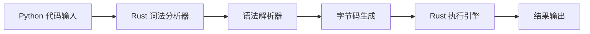
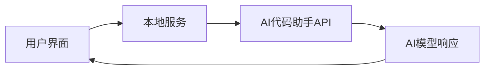
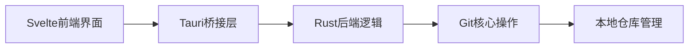
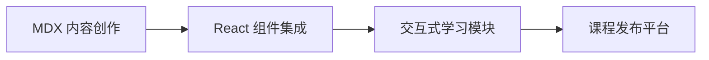

## 今日热点

AI开发工具与安全自动化成为今日热点，Claude Code生态扩展迅速，多智能体系统在金融领域应用深化，本地化LLM解决方案持续增长。

---

## 热门项目一览

| 排名 | 项目 | 语言 | 今日 | 总计 | 简介 |
|:---:|------|:----:|------:|-----:|------|
| 1 | [KeygraphHQ/shannon](https://github.com/KeygraphHQ/shannon) | TypeScript | +3,619 | 19,766 | Fully autonomous AI hacker ... |
| 2 | [google/langextract](https://github.com/google/langextract) | Python | +1,654 | 28,489 | A Python library for extrac... |
| 3 | [pydantic/monty](https://github.com/pydantic/monty) | Rust | +858 | 4,538 | A minimal, secure Python in... |
| 4 | [virattt/dexter](https://github.com/virattt/dexter) | TypeScript | +757 | 14,148 | An autonomous agent for dee... |
| 5 | [iOfficeAI/AionUi](https://github.com/iOfficeAI/AionUi) | TypeScript | +629 | 14,451 | Free, local, open-source 24... |
| 6 | [hsliuping/TradingAgents-CN](https://github.com/hsliuping/TradingAgents-CN) | Python | +498 | 16,677 | 基于多智能体LLM的中文金融交易框架 - Tradin... |
| 7 | [github/gh-aw](https://github.com/github/gh-aw) | Go | +496 | 1,347 | GitHub Agentic Workflows |
| 8 | [Shubhamsaboo/awesome-llm-apps](https://github.com/Shubhamsaboo/awesome-llm-apps) | Python | +443 | 93,629 | Collection of awesome LLM a... |
| 9 | [EveryInc/compound-engineering-plugin](https://github.com/EveryInc/compound-engineering-plugin) | TypeScript | +406 | 8,175 | Official Claude Code compou... |
| 10 | [gitbutlerapp/gitbutler](https://github.com/gitbutlerapp/gitbutler) | Rust | +260 | 19,034 | The GitButler version contr... |
| 11 | [cheahjs/free-llm-api-resources](https://github.com/cheahjs/free-llm-api-resources) | Python | +115 | 8,702 | A list of free LLM inferenc... |
| 12 | [drawdb-io/drawdb](https://github.com/drawdb-io/drawdb) | JavaScript | +95 | 36,322 | Free, simple, and intuitive... |

---

## 趋势洞察

```
┌─────────────────────────────────────────────────────────────────┐
│  AI/ML 工具         ████████████████████████  12 个项目        │
│  开发工具             ██                        1 个项目        │
│  数据分析             ██                        1 个项目        │
└─────────────────────────────────────────────────────────────────┘
```

---

## 项目深度解读

### 1. KeygraphHQ/shannon — AI安全测试工具

> **一句话总结**：全自动AI黑客工具，可自主发现Web应用实际漏洞，在XBOW基准测试中成功率高达96.15%

#### 价值主张

| 维度 | 说明 |
|------|------|
| **解决痛点** | 自动化发现Web应用中的实际漏洞，无需人工干预 |
| **目标用户** | 安全研究员、开发团队、渗透测试人员 |
| **核心亮点** | 全自主运行 + 高准确率 + 无需提示 + 源码感知 |

#### 技术架构


**技术特色**：
- 自主AI驱动无需人工干预
- 源码感知能力提升漏洞检测准确性
- 高达96.15%的漏洞发现成功率

#### 热度分析

- 项目Star数近2万，单日增长超3600，热度飙升明显
- 无开放Issues表明项目维护良好，用户反馈处理及时

#### 快速上手

```bash
# 安装shannon
npm install -g shannon

# 运行安全测试
shannon scan <target-url>
```

#### 注意事项

- 许可证未知，使用前需确认授权条款
- AI工具可能存在误报，建议人工验证结果
- 仅用于合法的安全测试，避免未经授权的扫描


### 2. google/langextract — 非结构化文本结构化工具

> **一句话总结**：基于LLMs的非结构化文本结构化提取工具，支持精确溯源和可视化交互。

#### 价值主张

| 维度 | 说明 |
|------|------|
| **解决痛点** | 从非结构化文本中高效提取结构化信息并确保信息来源可追溯 |
| **目标用户** | 数据科学家、NLP研究人员、信息提取开发者 |
| **核心亮点** | 精确源引用 + 交互式可视化 + LLM驱动 + 结构化信息提取 + 易于集成 |

#### 技术架构


**技术特色**：
- 利用LLMs进行智能文本理解与结构化
- 实现精确的源引用机制确保信息可追溯
- 提供交互式可视化界面提升用户体验

#### 热度分析

- 项目Star数达28,489且单日增长1,654，表明近期热度急剧上升，可能是LLM应用爆发式增长的自然结果
- Fork数为1,922，显示社区活跃度高，但Issues为0，可能说明项目处于早期稳定阶段或问题通过其他渠道解决

#### 快速上手

```bash
# 安装langextract库
pip install langextract

# 基本使用示例
import langextract
result = langextract.extract("非结构化文本内容", schema="预定义结构")
print(result)
```

#### 注意事项

- 项目依赖的LLM模型可能需要额外的API密钥或计算资源
- 由于项目Issues为0，可能社区支持渠道需要进一步了解
- 需要关注项目许可证信息，以确保合规使用


### 3. pydantic/monty — AI Python 解释器

> **一句话总结**：基于 Rust 的最小化安全 Python 解释器，专为 AI 应用场景优化。

#### 价值主张

| 维度 | 说明 |
|------|------|
| **解决痛点** | 解决 Python 解释器在 AI 环境中的安全性和性能问题 |
| **目标用户** | AI 开发者、需要安全 Python 执行环境的应用程序 |
| **核心亮点** | 安全性高 + 性能优化 + Rust 编写 + 最小化设计 + AI 专用 |

#### 技术架构



**技术特色**：
- 基于 Rust 实现，提供内存安全和并发安全保证
- 最小化设计，减少攻击面和资源占用
- 针对AI场景优化的Python解释功能

#### 热度分析

- 项目获得4538个Star，单日增长858，表明项目受到社区高度关注
- 零Open Issues，显示项目维护良好，可能已进入稳定阶段

#### 快速上手

```bash
# 克隆仓库
git clone https://github.com/pydantic/monty.git
# 构建项目
cargo build --release
# 运行示例
./target/release/monty example.py
```

#### 注意事项

- 项目仍处于早期阶段，可能API不稳定
- 需要Rust环境才能编译和使用
- 可能与标准Python解释器存在兼容性差异


### 4. virattt/dexter — 金融研究AI助手

> **一句话总结**：基于TypeScript开发的自主金融研究代理，实现深度金融数据分析与自动化报告生成。

#### 价值主张

| 维度 | 说明 |
|------|------|
| **解决痛点** | 自动化完成复杂金融研究任务，节省专业分析师大量时间 |
| **目标用户** | 金融分析师、投资机构、量化交易者、研究团队 |
| **核心亮点** | 深度财务分析 + 自动报告生成 + 多数据源整合 + 智能决策支持 |

#### 技术架构


**技术特色**：
- 基于TypeScript构建，确保代码质量和类型安全
- 集成多种金融数据源，实现全面市场分析
- 自主研究流程设计，减少人工干预

#### 热度分析

- 项目获得超过14K星标，单日增长757，表明市场高度认可
- Fork数相对较低(1699)，说明项目以使用为主，社区贡献度有待提升

#### 快速上手

```bash
# 克隆项目
git clone https://github.com/virattt/dexter.git

# 安装依赖
npm install

# 启动服务
npm start
```

#### 注意事项

- 需要金融数据API密钥才能完全使用
- 项目可能需要一定的金融知识背景才能充分利用
- 许可证信息不明确，使用前需确认开源协议


### 5. iOfficeAI/AionUi — AI代码助手统一界面

> **一句话总结**：本地开源界面，整合多个AI代码助手，提供全天候编程辅助体验。

#### 价值主张

| 维度 | 说明 |
|------|------|
| **解决痛点** | 为分散的AI代码工具提供统一本地界面，简化开发流程 |
| **目标用户** | 开发者、AI工具使用者、多语言编程需求者 |
| **核心亮点** | 本地部署 + 多AI助手支持 + 开源免费 + 隐私保护 |

#### 技术架构



**技术特色**：
- TypeScript开发，确保类型安全与代码质量
- 本地化部署，保障数据隐私与离线可用
- 插件化架构，支持多种AI助手无缝集成

#### 热度分析

- Star数达1.4万且持续增长，表明项目获得开发者广泛认可
- 社区活跃度高，成为AI编程工具生态中的重要整合平台

#### 快速上手

```bash
# 克隆项目
git clone https://github.com/iOfficeAI/AionUi.git
# 安装依赖
npm install
# 启动服务
npm start
```

#### 注意事项

- 项目License信息不明确，使用前需确认授权条款
- 需配置相应AI助手的API密钥才能正常使用各项功能
- 本地部署需要一定的技术基础，建议阅读项目文档进行配置


### 6. hsliupang/TradingAgents-CN — 中文智能交易

> **一句话总结**：基于多智能体大语言模型的中文金融交易框架，提供增强版中文交易能力

#### 价值主张

| 维度 | 说明 |
|------|------|
| **解决痛点** | 为中文金融市场提供基于LLM的多智能体交易解决方案 |
| **目标用户** | 中文金融市场参与者、量化交易开发者、金融科技研究员 |
| **核心亮点** | 多智能体协作 + 中文金融数据增强 + LLM集成 + 开源可定制 |

#### 技术架构


**技术特色**：
- 多智能体协同决策系统，模拟市场多方博弈
- 中文金融领域专用训练，增强金融术语理解能力
- 模块化设计，支持多种交易策略集成和扩展

#### 热度分析

- 项目获得16k+高星，日增近500星，表明市场对中文AI交易需求旺盛
- 社区活跃度高，但无开放Issue，可能已进入稳定维护阶段

#### 快速上手

```bash
# 克隆项目
git clone https://github.com/hsliupang/TradingAgents-CN.git
cd TradingAgents-CN

# 安装依赖
pip install -r requirements.txt

# 运行示例
python examples/basic_trading.py
```

#### 注意事项

- 需要配置中文金融数据源，可能涉及数据获取成本
- 实盘交易前需充分回测，LLM决策存在不确定性
- 注意遵守相关金融市场监管规定


### 7. github/gh-aw — GitHub智能工作流

> **一句话总结**：通过AI智能代理简化GitHub Actions工作流程的创建与管理，提升自动化效率。

#### 价值主张

| 维度 | 说明 |
|------|------|
| **解决痛点** | 传统GitHub Actions配置复杂，AI辅助简化流程定义与执行 |
| **目标用户** | GitHub用户，尤其是需要复杂自动化流程的开发团队 |
| **核心亮点** | 智能自动化 + 自然语言交互 + 跨平台兼容 + 可扩展架构 |

#### 技术架构


**技术特色**：
- 基于Go语言构建的高性能CLI工具
- 集成大型语言模型实现自然语言到工作流的转换
- 与GitHub API深度整合，无缝衔接现有生态

#### 热度分析

- 项目近期Star激增，表明社区对AI增强GitHub工具有强烈需求
- 作为新兴工具，正在填补GitHub Actions智能化空白，生态潜力大

#### 快速上手

```bash
# 安装工具
go install github.com/gh-aw/gh-aw@latest

# 初始化配置
gh-aw init

# 使用自然语言创建工作流
gh-aw "当有PR合并时自动运行测试"
```

#### 注意事项

- 项目License未知，商业使用前需确认授权条款
- 作为新兴项目，API和功能可能存在不稳定变化
- 需要GitHub API访问权限，可能需要配置个人访问令牌


### 8. Shubhamsaboo/awesome-llm-apps — LLM应用精选

> **一句话总结**：精选的大语言模型应用集合，覆盖多平台模型与实用案例。

#### 价值主张

| 维度 | 说明 |
|------|------|
| **解决痛点** | 解决开发者寻找高质量LLM应用参考案例的需求，提供多样化实现思路。 |
| **目标用户** | AI应用开发者、研究人员、对大语言模型感兴趣的技术人员。 |
| **核心亮点** | 覆盖多平台模型 + 实用案例丰富 + 分类清晰结构化 |

#### 技术架构

**技术特色**：
- 跨平台LLM应用整合
- 涵盖商业和开源模型
- 按功能和应用场景分类

#### 热度分析

- 项目获得超9.3万星，近期每日增长400+，表明社区对LLM应用案例需求旺盛
- 作为资源集合型项目，在AI开发领域具有极高的参考价值和生态影响力

#### 快速上手

```bash
# 访问项目主页
# https://github.com/Shubhamsaboo/awesome-llm-apps

# 克隆项目到本地
git clone https://github.com/Shubhamsaboo/awesome-llm-apps.git

# 浏览README中的分类和应用链接
```

#### 注意事项

- 项目本身不包含代码，而是指向其他项目的链接，需要额外访问这些链接获取详细实现
- 部分链接可能失效，需要自行验证
- 由于LLM技术发展迅速，部分项目可能已过时，建议关注更新日期


### 9. EveryInc/compound-engineering-plugin — AI工程插件

> **一句话总结**：Claude Code官方插件，通过AI辅助提升复合工程效率和代码质量。

#### 价值主张

| 维度 | 说明 |
|------|------|
| **解决痛点** | 解决复杂工程任务中AI辅助编程的效率问题 |
| **目标用户** | 软件开发者、工程师、技术团队 |
| **核心亮点** | 深度代码理解 + 智能代码生成 + 工程流程自动化 |

#### 技术架构


**技术特色**：
- 基于Claude大模型的深度代码理解
- 支持多种编程语言和框架的智能生成
- 工程上下文感知与维护

#### 热度分析

- 项目Star数超过8,000，今日增长406，显示社区高度关注
- 零Open Issues表明项目维护良好，用户反馈积极

#### 快速上手

```bash
# 安装Claude Code
npm install -g @anthropic-ai/claude-code

# 安装compound engineering插件
claude-code plugin install compound-engineering
```

#### 注意事项

- 需要Anthropic API访问权限
- 插件可能需要特定版本的Claude Code支持


### 10. gitbutlerapp/gitbutler — Git可视化客户端

> **一句话总结**：基于Tauri/Rust/Svelte构建的现代化Git图形化客户端，简化版本控制操作体验。

#### 价值主张

| 维度 | 说明 |
|------|------|
| **解决痛点** | 将复杂Git命令转化为直观图形界面，降低版本控制使用门槛 |
| **目标用户** | 需要可视化Git操作的软件开发者及团队协作人员 |
| **核心亮点** | Tauri跨平台支持 + Rust高性能保障 + Svelte响应式UI + Git深度集成 |

#### 技术架构



**技术特色**：
- 采用Tauri框架实现轻量级桌面应用，减少资源占用
- Rust后端提供高性能和内存安全保障，适合处理大量Git操作
- Svelte前端框架实现高效响应式UI，提升用户体验

#### 热度分析

- 项目Star数突破19k且单日增长260，表明开发者社区认可度高且增长迅速
- Fork数820显示二次开发意愿强，已形成活跃的社区生态

#### 快速上手

```bash
# 下载最新版本安装包(以Windows为例)
Invoke-WebRequest -Uri "https://github.com/gitbutlerapp/gitbutler/releases/latest/download/gitbutler-setup-x86_64.exe" -OutFile "gitbutler-setup.exe"
Start-Process -FilePath ".\gitbutler-setup.exe" -Wait
```

#### 注意事项

- 需先安装Git环境作为底层依赖
- 作为较新项目，某些高级Git功能可能仍在完善中
- 建议关注项目许可证更新，目前许可证信息不明确


### 11. cheahjs/free-llm-api-resources — [免费LLM API库]

> **一句话总结**：汇集全球可免费调用的大语言模型API资源，降低AI开发门槛与成本。

#### 价值主张

| 维度 | 说明 |
|------|------|
| **解决痛点** | 解决开发者获取和使用免费LLM API资源困难的问题 |
| **目标用户** | AI开发者、研究人员、创业者、学生等需要免费LLM API资源的用户 |
| **核心亮点** | 资源全面覆盖多种LLM模型 + 持续更新维护 + 提供直接API调用信息 |

#### 技术架构


**技术特色**：
- 轻量级资源聚合，无需复杂部署
- 结构化组织API信息，便于开发者查找
- 社区驱动维护，保持资源时效性

#### 热度分析

- 项目Star数持续增长，今日新增115个Star，表明社区对该类免费资源需求旺盛。
- 作为AI基础设施资源库，处于LLM生态的关键位置，为开发者提供重要支持。

#### 快速上手

```bash
# 克隆项目获取完整资源列表
git clone https://github.com/cheahjs/free-llm-api-resources.git

# 查看README获取最新免费LLM API资源
cat README.md
```

#### 注意事项

- 部分免费API可能有调用次数限制或需要注册
- 免费服务可能随时变更或停止，使用前请确认服务状态
- 注意遵守各API的使用条款和数据隐私政策


### 12. drawdb-io/drawdb — 数据图表设计器

> **一句话总结**：免费直观的在线数据库图表编辑器，支持多种数据库关系图绘制与SQL代码生成。

#### 价值主张

| 维度 | 说明 |
|------|------|
| **解决痛点** | 提供无需安装的数据库图表设计工具，解决数据库设计可视化难题 |
| **目标用户** | 开发者、数据库管理员、系统架构师 |
| **核心亮点** | 支持多种数据库类型 + 实时SQL生成 + 协作编辑功能 + 界面直观易用 |

#### 技术架构


**技术特色**：
- 基于Web的前端架构，无需安装即可使用
- 支持拖放式数据库图表设计与实时预览
- 实时生成符合标准的SQL代码并支持多种数据库方言

#### 热度分析

- 项目star数超过3.6万且持续增长，表明数据库设计可视化工具需求旺盛
- 作为开源项目，在数据库设计领域具有较高影响力，成为开发者的首选工具之一

#### 快速上手

```bash
# 直接访问项目网站开始使用
# https://drawdb.io

# 或者克隆项目到本地
git clone https://github.com/drawdb-io/drawdb.git
cd drawdb
npm install
npm start
```

#### 注意事项

- 项目许可证未知，使用前需确认授权条款
- 作为在线工具，数据隐私需注意，敏感数据库设计建议使用本地部署版本
- 可能需要注册账户才能保存和分享图表


### 13. Jeffallan/claude-skills — Claude技能集

> **一句话总结**：为Claude AI注入65种全栈开发专业技能，打造专业级编程助手。

#### 价值主张

| 维度 | 说明 |
|------|------|
| **解决痛点** | 解决AI助手缺乏专业领域知识，难以提供深度技术指导的问题 |
| **目标用户** | 全栈开发者、希望提升编程效率的开发团队 |
| **核心亮点** | 65种专业技能 + 全栈开发覆盖 + AI专家化 + 即用型提示 |

#### 技术架构


**技术特色**：
- 结构化技能分类系统，覆盖全栈开发各领域
- 精心设计的提示工程，最大化AI专业能力
- 模块化技能组织，便于按需调用

#### 热度分析

- 近期增长迅速，今日新增45星，显示社区对AI开发辅助工具的高需求
- Fork相对较少，表明项目主要作为技能参考使用，而非二次开发基础

#### 快速上手

```bash
# 克隆项目并查看技能列表
git clone https://github.com/Jeffallan/claude-skills.git
cd claude-skills && ls skills
```

#### 注意事项

- 项目许可证未知，商业使用前需确认授权条款
- 需要Claude API访问权限才能实际应用这些技能提示
- 技能效果可能随Claude模型更新而变化，需定期验证有效性


### 14. carlvellotti/claude-code-pm-course — 产品经理课程

> **一句话总结**：为产品经理设计的交互式 Claude Code 使用教程，提升工作效率和AI协作能力。

#### 价值主张

| 维度 | 说明 |
|------|------|
| **解决痛点** | 产品经理缺乏有效利用AI工具提升工作效率的方法 |
| **目标用户** | 产品经理、产品负责人、产品设计师 |
| **核心亮点** | 交互式学习 + 实战案例 + Claude Code 专项技能 |

#### 技术架构



**技术特色**：
- 使用 MDX 结合 React 创建交互式学习体验
- 集成 Claude Code 实例展示实际应用场景
- 响应式设计适配多种学习设备

#### 热度分析

- 项目近期增长迅速，24小时内新增24个Star，显示出产品经理群体对AI工具学习的强烈需求
- 作为垂直领域专业课程，在产品经理和AI工具交叉领域具有独特价值，社区参与度较高

#### 快速上手

```bash
# 克隆项目
git clone https://github.com/carlvellotti/claude-code-pm-course.git

# 安装依赖
npm install

# 启动本地开发服务器
npm run dev
```

#### 注意事项

- 本项目需要基本的 MDX 和 React 知识才能完全理解其实现方式
- 课程内容基于 Claude Code，使用前需要了解 Anthropic 的 Claude AI 工具
- 项目中可能包含需要 Anthropic API 密钥的示例代码，使用时需注意配置


## 今日推荐

| 主题 | 推荐项目 | 亮点 |
|------|----------|------|
| 今日最热 | [KeygraphHQ/shannon](https://github.com/KeygraphHQ/shannon) | Fully autonomous ... |
| 值得关注 | [google/langextract](https://github.com/google/langextract) | A Python library ... |
| 快速上手 | [pydantic/monty](https://github.com/pydantic/monty) | A minimal, secure... |
| 长期潜力 | [virattt/dexter](https://github.com/virattt/dexter) | An autonomous age... |

---

<div align="center">

*Generated on 2026-02-11 | Powered by GitHub Trending Reporter*

</div>