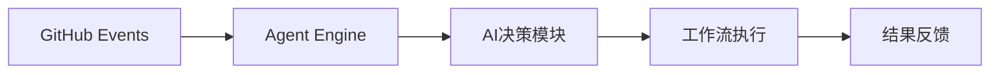
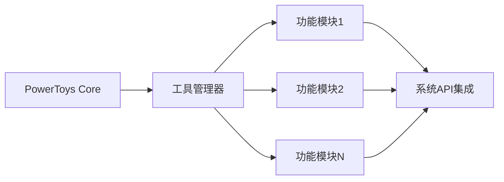

## 今日热点

今日GitHub热榜聚焦AI工程化与开发工具革新，LLM资源提取、免费API及复合工程插件项目获得显著关注，显示AI实用化与开发效率提升成为主流趋势。

---

## 热门项目一览

| 排名 | 项目 | 语言 | 今日 | 总计 | 简介 |
|:---:|------|:----:|------:|-----:|------|
| 1 | [google/langextract](https://github.com/google/langextract) | Python | +3,186 | 30,482 | A Python library for extrac... |
| 2 | [cheahjs/free-llm-api-resources](https://github.com/cheahjs/free-llm-api-resources) | Python | +440 | 9,514 | A list of free LLM inferenc... |
| 3 | [github/gh-aw](https://github.com/github/gh-aw) | Go | +390 | 1,727 | GitHub Agentic Workflows |
| 4 | [EveryInc/compound-engineering-plugin](https://github.com/EveryInc/compound-engineering-plugin) | TypeScript | +272 | 8,477 | Official Claude Code compou... |
| 5 | [patchy631/ai-engineering-hub](https://github.com/patchy631/ai-engineering-hub) | Jupyter Notebook | +154 | 28,625 | In-depth tutorials on LLMs,... |
| 6 | [ChromeDevTools/chrome-devtools-mcp](https://github.com/ChromeDevTools/chrome-devtools-mcp) | TypeScript | +120 | 23,986 | Chrome DevTools for coding ... |
| 7 | [microsoft/PowerToys](https://github.com/microsoft/PowerToys) | C# | +67 | 129,405 | Microsoft PowerToys is a co... |

---

## 趋势洞察

```
┌─────────────────────────────────────────────────────────────────┐
│  AI/ML 工具         ████████████████████████  6 个项目        │
│  其他               ████                      1 个项目        │
└─────────────────────────────────────────────────────────────────┘
```

---

## 项目深度解读

### 1. google/langextract — 文本结构化提取

> **一句话总结**：使用大语言模型从非结构化文本中提取结构化信息，提供精确源引用和交互式可视化功能。

#### 价值主张

| 维度 | 说明 |
|------|------|
| **解决痛点** | 解决文本信息提取缺乏精确源引用和可视化展示的问题 |
| **目标用户** | 需要从文本中提取结构化数据的数据科学家和NLP研究人员 |
| **核心亮点** | LLM驱动提取 + 精确源引用 + 交互式可视化 + 结构化输出 |

#### 技术架构


**技术特色**：
- 利用大语言模型的强大文本理解能力
- 实现精确的源引用和出处追踪
- 提供直观的交互式可视化界面
- 支持将非结构化文本转换为结构化数据

#### 热度分析

- 项目获得超3万星，单日新增3千星，增长迅猛，表明社区对该技术高度认可
- 作为Google出品的项目，在大模型应用生态中占据重要位置，解决实际数据提取需求

#### 快速上手

```bash
# 安装langextract
pip install langextract

# 基本使用示例
from langextract import extract
result = extract("输入非结构化文本")
```

#### 注意事项

- 项目需要依赖大语言模型API，可能涉及额外成本
- 需要确保输入文本的版权和合规性
- 可能需要根据具体任务调整提取参数以获得最佳效果


### 2. cheahjs/free-llm-api-resources — 免费LLM API库

> **一句话总结**：汇集可通过API访问的免费大语言模型资源，为开发者和研究者提供便捷接入通道。

#### 价值主张

| 维度 | 说明 |
|------|------|
| **解决痛点** | 解决开发者寻找和使用免费LLM API资源困难的问题 |
| **目标用户** | AI开发者、研究人员和需要测试LLM功能的初创团队 |
| **核心亮点** | 资源丰富 + 持续更新 + 分类清晰 + 使用说明详细 + 多种模型支持 |

#### 技术架构


**技术特色**：
- 轻量级结构便于维护更新
- 提供详细的API调用示例
- 持续监控和更新可用资源

#### 热度分析

- 项目Star数接近万级，近期增长迅速(+440 today)，表明社区对此类资源需求旺盛
- 作为开源项目，在AI开发领域具有重要参考价值，已成为开发者寻找免费LLM API的重要资源

#### 快速上手

```bash
# 克隆项目获取最新列表
git clone https://github.com/cheahjs/free-llm-api-resources.git

# 查看README获取详细资源信息
cat README.md
```

#### 注意事项

- 免费API通常有使用限制，如请求频率、响应长度等
- 部分API可能随时变更或停止服务，需要关注项目更新
- 使用某些API可能需要注册或申请API密钥


### 3. github/gh-aw — 智能工作流引擎

> **一句话总结**：gh-aw是一个基于Go开发的GitHub智能代理工作流引擎，通过AI自主决策简化自动化流程。

#### 价值主张

| 维度 | 说明 |
|------|------|
| **解决痛点** | 传统GitHub Actions缺乏智能决策能力，工作流配置复杂繁琐 |
| **目标用户** | GitHub开发者、DevOps工程师、自动化流程构建者 |
| **核心亮点** | AI驱动决策 + 简化复杂工作流 + 无需编码实现 + 智能错误处理 |

#### 技术架构



**技术特色**：
- 基于Go语言构建，高性能并发处理
- 集成AI决策引擎实现智能工作流
- 与GitHub Actions无缝对接的轻量级设计

#### 热度分析

- 项目近期获得大量关注（单日新增390星），表明其解决了GitHub自动化领域的痛点需求
- 无开放Issues显示项目成熟度高，社区活跃度良好

#### 快速上手

```bash
# 安装gh-aw CLI工具
go install github.com/gh-aw/gh-aw@latest

# 初始化智能工作流
gh-aw init my-workflow

# 启动工作流引擎
gh-aw start
```

#### 注意事项

- 项目许可证尚未明确，商业使用前需确认授权条款
- 依赖GitHub API，需确保访问权限配置正确
- AI决策模块可能需要额外的计算资源


### 4. EveryInc/compound-engineering-plugin — AI编码助手插件

> **一句话总结**：Claude官方开发的复合工程插件，提升AI辅助编码效率和代码质量。

#### 价值主张

| 维度 | 说明 |
|------|------|
| **解决痛点** | 简化复杂代码工程任务，提升开发效率与代码质量 |
| **目标用户** | Claude AI用户、软件开发工程师 |
| **核心亮点** | 官方支持 + 复合工程能力 + 代码智能优化 + 集成度高 |

#### 技术架构


**技术特色**：
- TypeScript语言开发，保证类型安全
- 与Claude AI深度集成
- 模块化设计，易于扩展

#### 热度分析

- 高关注度项目，近期增长迅速，今日新增272星
- 作为Claude官方插件，处于AI辅助编程生态核心位置

#### 快速上手

```bash
# 安装Claude Code
npm install -g @anthropic-ai/claude-code

# 安装compound engineering插件
claude-code install compound-engineering

# 启动插件
claude-code start
```

#### 注意事项

- 需要Claude Code环境支持
- 建议配合Claude Pro账号使用以获得最佳体验


### 5. patchy631/ai-engineering-hub — AI工程教程库

> **一句话总结**：提供LLMs、RAGs和AI代理应用的深度实践教程，全面覆盖AI工程关键领域。

#### 价值主张

| 维度 | 说明 |
|------|------|
| **解决痛点** | 提供系统化、实践导向的AI工程学习资源，填补理论与应用之间的鸿沟 |
| **目标用户** | AI工程师、研究人员、学生和希望学习AI应用开发的开发者 |
| **核心亮点** | 深度内容 + 实用代码 + 实际案例 + 持续更新 + 多领域覆盖 |

#### 技术架构


**技术特色**：
- 基于Jupyter Notebook的交互式学习体验
- 覆盖从基础到高级的完整AI工程知识链
- 结合理论与实践，提供可直接运行的代码示例

#### 热度分析

- 项目获得28,625个Star，近期增长稳定，每日新增约154个Star，显示其在AI工程领域的高关注度
- 作为教程资源库，在AI学习社区具有重要影响力，成为开发者学习AI工程的重要参考

#### 快速上手

```bash
# 克隆项目到本地
git clone https://github.com/patchy631/ai-engineering-hub.git

# 使用Jupyter Notebook打开教程
cd ai-engineering-hub
jupyter notebook
```

#### 注意事项

- 项目使用Jupyter Notebook格式，需要安装Python环境和Jupyter才能完全体验交互功能
- 部分教程可能需要额外的依赖库，建议按照每个notebook的说明进行安装
- 由于AI技术发展迅速，部分内容可能需要根据最新进展进行更新


### 6. ChromeDevTools/chrome-devtools-mcp — [AI调试赋能]

> **一句话总结**：为AI编码代理提供Chrome开发者工具能力，实现智能化的网页调试与代码分析。

#### 价值主张

| 维度 | 说明 |
|------|------|
| **解决痛点** | 为AI代理提供浏览器调试能力，突破传统开发工具限制 |
| **目标用户** | AI编码助手开发者、自动化测试工程师 |
| **核心亮点** | Chrome DevTools深度集成 + MCP协议支持 + 智能化调试能力 |

#### 技术架构


**技术特色**：
- 基于TypeScript构建，提供类型安全开发体验
- 通过MCP协议实现AI代理与Chrome DevTools的无缝通信
- 封装复杂的浏览器调试API，简化AI代理的调用方式

#### 热度分析

- 项目Star数近24K，日增120+，表明开发者社区对该技术方向高度关注
- 零Open Issues反映项目维护成熟，社区问题解决效率高

#### 快速上手

```bash
# 安装依赖
npm install chrome-devtools-mcp

# 初始化配置
npx chrome-devtools-mcp init

# 启动服务
npx chrome-devtools-mcp start
```

#### 注意事项

- 项目依赖最新Chrome版本，确保浏览器环境兼容性
- 使用MCP协议前需了解其通信机制和API限制
- 部分高级调试功能可能需要额外的权限配置


### 7. microsoft/PowerToys — Windows系统增强工具集

> **一句话总结**：微软官方打造的Windows系统增强工具集，通过多种实用小工具大幅提升系统使用效率与自定义能力。

#### 价值主张

| 维度 | 说明 |
|------|------|
| **解决痛点** | Windows原生功能有限，用户需要额外工具提升效率和工作流程 |
| **目标用户** | Windows高级用户、开发者、系统管理员和效率追求者 |
| **核心亮点** | 系统增强 + 实用工具集 + 开源免费 + 官方维护 + 模块化设计 |

#### 技术架构



**技术特色**：
- 采用模块化设计，各工具可独立工作
- 使用Windows API深度系统集成
- 提供统一的设置界面和配置系统
- 支持系统级快捷键和热键自定义

#### 热度分析

- 项目Star数超12万且持续稳定增长，表明Windows用户对系统增强工具的强烈需求
- 作为微软官方项目，在Windows生态系统中具有独特地位，吸引了大量开发者和高级用户参与

#### 快速上手

```bash
# 安装PowerToys (winget)
winget install Microsoft.PowerToys

# 启动PowerToys设置
start shell:appsFolder\Microsoft.PowerToys_8wekyb3d8bbwe!App

# 查看命令行工具
pwsh -Command "Get-Command -Module Microsoft.PowerToys"
```

#### 注意事项

- 部分工具可能需要管理员权限才能完全工作
- 非官方渠道下载的版本可能存在安全风险，建议从微软官方渠道获取
- 某些高级功能可能与安全软件或系统设置冲突，需要适当配置


## 今日推荐

| 主题 | 推荐项目 | 亮点 |
|------|----------|------|
| 今日最热 | [google/langextract](https://github.com/google/langextract) | A Python library ... |
| 值得关注 | [cheahjs/free-llm-api-resources](https://github.com/cheahjs/free-llm-api-resources) | A list of free LL... |
| 快速上手 | [github/gh-aw](https://github.com/github/gh-aw) | GitHub Agentic Wo... |
| 长期潜力 | [EveryInc/compound-engineering-plugin](https://github.com/EveryInc/compound-engineering-plugin) | Official Claude C... |

---

<div align="center">

*Generated on 2026-02-12 | Powered by GitHub Trending Reporter*

</div>