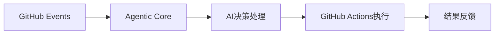
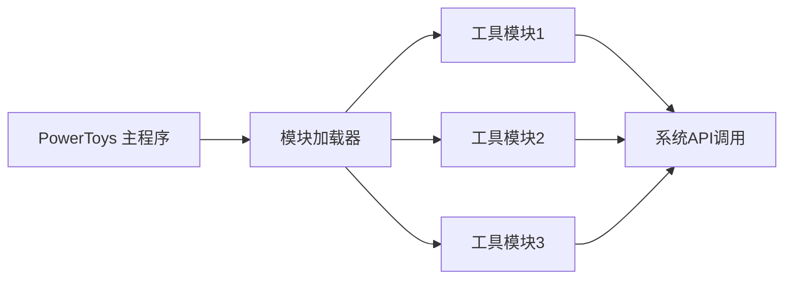

## 今日热点

AI代理工具链与LLM应用生态快速扩张，开发者正积极构建开源AI基础设施，增强人类能力与生产力。

---

## 热门项目一览

| 排名 | 项目 | 语言 | 今日 | 总计 | 简介 |
|:---:|------|:----:|------:|-----:|------|
| 1 | [google/langextract](https://github.com/google/langextract) | Python | +1,122 | 31,403 | A Python library for extrac... |
| 2 | [ChromeDevTools/chrome-devtools-mcp](https://github.com/ChromeDevTools/chrome-devtools-mcp) | TypeScript | +436 | 24,400 | Chrome DevTools for coding ... |
| 3 | [github/gh-aw](https://github.com/github/gh-aw) | Go | +405 | 2,018 | GitHub Agentic Workflows |
| 4 | [HandsOnLLM/Hands-On-Large-Language-Models](https://github.com/HandsOnLLM/Hands-On-Large-Language-Models) | Jupyter Notebook | +361 | 20,908 | Official code repo for the ... |
| 5 | [danielmiessler/Personal_AI_Infrastructure](https://github.com/danielmiessler/Personal_AI_Infrastructure) | TypeScript | +351 | 7,516 | Agentic AI Infrastructure f... |
| 6 | [microsoft/PowerToys](https://github.com/microsoft/PowerToys) | C# | +316 | 129,652 | Microsoft PowerToys is a co... |
| 7 | [tambo-ai/tambo](https://github.com/tambo-ai/tambo) | TypeScript | +300 | 9,028 | Generative UI SDK for React |
| 8 | [Shubhamsaboo/awesome-llm-apps](https://github.com/Shubhamsaboo/awesome-llm-apps) | Python | +287 | 94,358 | Collection of awesome LLM a... |
| 9 | [Jeffallan/claude-skills](https://github.com/Jeffallan/claude-skills) | Python | +278 | 1,681 | 66 Specialized Skills for F... |
| 10 | [iOfficeAI/AionUi](https://github.com/iOfficeAI/AionUi) | TypeScript | +271 | 15,384 | Free, local, open-source 24... |
| 11 | [rowboatlabs/rowboat](https://github.com/rowboatlabs/rowboat) | TypeScript | +191 | 5,184 | Open-source AI coworker, wi... |
| 12 | [unslothai/unsloth](https://github.com/unslothai/unsloth) | Python | +81 | 52,045 | Fine-tuning & Reinforcement... |

---

## 趋势洞察

```
┌─────────────────────────────────────────────────────────────────┐
│  AI/ML 工具         ████████████████████████  11 个项目        │
│  开发工具             ██                        1 个项目        │
│  其他               ██                        1 个项目        │
└─────────────────────────────────────────────────────────────────┘
```

---

## 项目深度解读

### 1. google/langextract — L


### 2. ChromeDevTools/chrome-devtools-mcp — [AI开发工具桥接]

> **一句话总结**：为AI编码代理提供Chrome开发者工具接口，实现智能代码分析与调试能力。

#### 价值主张

| 维度 | 说明 |
|------|------|
| **解决痛点** | 解决AI编程助手无法直接访问浏览器开发者工具的问题 |
| **目标用户** | AI编程助手开发者、自动化测试工具构建者 |
| **核心亮点** | 提供完整的DevTools API封装 + 支持与主流AI模型集成 + 实现代码智能分析能力 |

#### 技术架构


**技术特色**：
- 基于TypeScript构建，提供类型安全
- 封装完整的DevTools功能集
- 支持异步操作和事件驱动架构

#### 热度分析

- 项目Star数高且持续增长，表明开发者社区对该技术需求强烈
- 作为Chrome官方项目，拥有生态优势和技术权威性

#### 快速上手

```bash
# 安装项目依赖
npm install chrome-devtools-mcp

# 在项目中导入并初始化
const { ChromeDevTools } = require('chrome-devtools-mcp');
const devtools = new ChromeDevTools();
await devtools.connect();
```

#### 注意事项

- 需要Chrome浏览器环境支持
- 某些高级功能可能需要特定版本Chrome
- 与AI模型集成时需注意API调用频率限制


### 3. github/gh-aw — GitHub智能工作流

> **一句话总结**：将AI代理能力集成到GitHub工作流中，实现自动化任务处理和智能决策。

#### 价值主张

| 维度 | 说明 |
|------|------|
| **解决痛点** | GitHub Actions缺乏智能决策和复杂任务自动化能力 |
| **目标用户** | 需要高级自动化流程的GitHub企业用户和开发者 |
| **核心亮点** | AI代理集成 + 智能决策 + 工作流增强 + GitHub深度集成 |

#### 技术架构



**技术特色**：
- 基于Go构建的高性能代理工作流引擎
- 集成AI能力实现智能决策和任务处理
- 与GitHub Actions深度无缝集成

#### 热度分析

- 项目近期获得大量关注，单日增长405 stars，表明技术热点度高
- 作为GitHub生态的新兴工具，有望成为CI/CD智能化的重要组件

#### 快速上手

```bash
# 安装gh-aw
go install github.com/github/gh-aw/cmd/gh-aw@latest

# 初始化配置
gh-aw init

# 启动代理工作流
gh-aw run --workflow example.yaml
```

#### 注意事项

- 需要GitHub API权限，确保使用适当的认证
- AI功能可能依赖外部服务，需注意网络连接和成本问题
- 目前尚无公开Issues，可能项目处于早期阶段，稳定性有待验证


### 4. HandsOnLLM/Hands-On-Large-Language-Models — LLM实践教程

> **一句话总结**：O'Reilly官方出品的大型语言模型实践教程，通过Jupyter Notebook提供可运行的LLM代码示例。

#### 价值主张

| 维度 | 说明 |
|------|------|
| **解决痛点** | 理论与实践脱节，提供可执行的LLM代码与实验 |
| **目标用户** | AI研究人员、开发者、LLM技术爱好者 |
| **核心亮点** | O'Reilly官方出品 + Jupyter Notebook实践 + 系统性LLM知识 |

#### 技术架构


**技术特色**：
- 基于Jupyter Notebook的交互式学习体验
- 涵盖从基础到高级的LLM全流程实践
- 提供可复现的代码示例与实验指导

#### 热度分析

- 高Star增长率(今日+361)显示LLM实践教程需求旺盛
- 作为O'Reilly官方教程，在AI教育领域具有重要影响力

#### 快速上手

```bash
# 克隆仓库
git clone https://github.com/HandsOnLLM/Hands-On-Large-Language-Models.git
# 进入目录并启动Jupyter
cd Hands-On-Large-Language-Models && jupyter notebook
```

#### 注意事项

- 需要基本的Python和机器学习基础知识
- 可能需要配置GPU环境以加速模型训练
- 确保安装了所有依赖库，建议使用项目提供的requirements.txt


### 5. danielmiessler/Personal_AI_Infrastructure — AI增强人类基础设施

> **一句话总结**：构建智能代理基础设施，增强人类能力，实现AI与人类协作的价值最大化。

#### 价值主张

| 维度 | 说明 |
|------|------|
| **解决痛点** | 整合分散AI工具，构建统一智能代理平台，增强而非替代人类能力 |
| **目标用户** | AI开发者、研究人员及追求工作流智能化的专业人士 |
| **核心亮点** | 模块化AI架构 + 人类-AI协作工作流 + 可扩展能力集成 + 智能代理系统 |

#### 技术架构


**技术特色**：
- 基于TypeScript构建的模块化智能代理系统
- 支持多种AI服务无缝集成与协同工作
- 优先考虑人类-AI交互的自然性与效率

#### 热度分析

- 项目获得7516个Star且单日增长351，显示近期热度急剧上升
- 1088个Fork表明社区参与度高，项目具有较强生态吸引力

#### 快速上手

```bash
# 克隆项目
git clone https://github.com/danielmiessler/Personal_AI_Infrastructure.git

# 安装依赖
npm install
```

#### 注意事项

- 项目许可证未知，使用前需确认授权条款
- 可能需要配置多个AI服务的API密钥才能完整使用所有功能
- 建议具备TypeScript和AI基础知识以便更好地理解和使用项目


### 6. microsoft/PowerToys — Windows神器集

> **一句话总结**：微软官方开发的Windows系统增强工具集，提供多种实用工具大幅提升系统使用效率。

#### 价值主张

| 维度 | 说明 |
|------|------|
| **解决痛点** | Windows原生功能不足，用户需要更高效的系统操作和定制化工具 |
| **目标用户** | Windows高级用户、开发者、追求效率的生产力工作者 |
| **核心亮点** | 官方支持 + 模块化设计 + 开源免费 + 轻量级 + 高度定制 |

#### 技术架构



**技术特色**：
- 采用C#开发，利用.NET框架实现系统级功能
- 模块化架构设计，每个工具可独立启用和更新
- 使用WinUI 3构建现代化用户界面，提供一致体验
- 通过系统钩子和API扩展实现原生功能增强

#### 热度分析

- Star数超12.9万，近期增长稳定，表明项目获得广泛认可和持续关注
- 作为微软官方开源项目，在Windows生态系统中具有重要地位，社区贡献活跃

#### 快速上手

```bash
# 通过Microsoft Store安装
winget install Microsoft.PowerToys

# 或通过GitHub releases下载最新版本
# 下载后直接运行PowerToys.exe即可启动
```

#### 注意事项

- 部分高级功能可能需要管理员权限
- 某些工具可能与安全软件冲突，需添加白名单
- 建议定期更新以获取最新功能和修复


### 7. tambo-ai/tambo — 智能UI生成工具

> **一句话总结**：基于AI的React组件库，自动生成和优化用户界面，提升开发效率。

#### 价值主张

| 维度 | 说明 |
|------|------|
| **解决痛点** | 传统UI开发手动编写代码繁琐，难以快速响应设计变化 |
| **目标用户** | React开发者、前端工程师、追求开发效率的产品团队 |
| **核心亮点** | AI驱动生成 + 自动优化 + 响应式设计 + 组件复用 + 类型安全 |

#### 技术架构


**技术特色**：
- 基于TypeScript提供完整的类型安全保障
- 利用AI技术自动生成和优化UI组件
- 支持响应式设计和自适应布局策略

#### 热度分析

- 项目Star数快速增长(+300 today)，社区认可度持续攀升
- 作为生成式UI领域的创新项目，在前端开发工具链中占据独特生态位置

#### 快速上手

```bash
# 安装tambo
npm install tambo

# 在React组件中使用
import { Button } from 'tambo';

function App() {
  return <Button>Click me</Button>;
}
```

#### 注意事项

- 需要React环境作为基础依赖
- 可能需要配置AI服务才能使用完整生成功能
- 生成的组件可能需要进一步手动优化和调整


### 8. Shubhamsaboo/awesome-llm-apps — LLM应用精选集

> **一句话总结**：精选LLM应用集合，整合多平台AI代理与RAG技术实现。

#### 价值主张

| 维度 | 说明 |
|------|------|
| **解决痛点** | 碎片化LLM应用资源整合，提供一站式解决方案参考 |
| **目标用户** | AI开发者、研究人员和企业技术决策者 |
| **核心亮点** | 多平台模型支持 + 实用案例集合 + 持续更新维护 + 分类清晰 |

#### 技术架构

**技术特色**：
- 跨平台模型支持，包括OpenAI、Anthropic、Gemini和开源模型
- 分类组织LLM应用，便于开发者快速查找参考
- 包含AI代理和RAG技术的实际应用案例

#### 热度分析

- 高星增长项目(+287今日星)，表明LLM应用开发需求旺盛
- 作为资源集合项目，在AI开发社区具有重要参考价值

#### 快速上手

```bash
# 克隆项目到本地
git clone https://github.com/Shubhamsaboo/awesome-llm-apps.git

# 浏览README.md了解项目分类
cat awesome-llm-apps/README.md
```

#### 注意事项

- 项目作为应用集合，需要开发者自行实现具体功能
- 部分应用可能需要API密钥或特定环境配置
- 开源模型应用部分可能需要较高的硬件资源


### 9. Jeffallan/claude-skills — [Claude技能增强]

> **一句话总结**：通过66种专业技能增强Claude，使其成为全栈开发者的专家级结对编程伙伴。

#### 价值主张

| 维度 | 说明 |
|------|------|
| **解决痛点** | AI助手缺乏专业编程深度，无法满足复杂开发场景需求 |
| **目标用户** | 全栈开发者、需要专业编程辅助的开发团队 |
| **核心亮点** | 66种专业技能 + Claude代码增强 + 全栈开发支持 + 专家级编程助手 |

#### 技术架构


**技术特色**：
- 基于Python构建的技能扩展系统
- 通过提示词工程增强Claude专业能力
- 模块化设计支持66种专业技能集成

#### 热度分析

- 项目单日激增278个Star，表明开发者对AI编程助手增强需求强烈
- 零未解决问题反映项目维护良好，社区反馈机制可能通过其他渠道处理

#### 快速上手

```bash
# 安装项目
pip install claude-skills

# 初始化技能集
claude-skills init

# 启动增强的Claude交互
claude-skills start
```

#### 注意事项

- 项目许可证未知，商业使用前需确认授权条款
- 作为第三方工具，可能与Claude官方API更新存在兼容性风险
- 建议在使用前验证66种技能的质量和适用性


### 10. iOfficeAI/AionUi — AI编程助手平台

> **一句话总结**：为多种AI编程助手提供免费本地开源统一工作环境，提升开发协作效率。

#### 价值主张

| 维度 | 说明 |
|------|------|
| **解决痛点** | 解决开发者多AI工具切换问题，提供一站式编程辅助体验 |
| **目标用户** | 需要集成多种AI助手的开发者和编程爱好者 |
| **核心亮点** | 支持主流AI助手 + 本地部署保障隐私 + 开源免费无限制 |

#### 技术架构


**技术特色**：
- 基于TypeScript构建，确保类型安全和跨平台兼容性
- 本地部署架构，保护代码隐私和数据安全
- 插件化设计，支持多种AI助手无缝集成

#### 热度分析

- 项目Star数超15,000且持续稳定增长，表明市场认可度极高
- 作为AI编程助手集成平台，在AI辅助开发领域占据重要生态位置

#### 快速上手

```bash
# 克隆仓库
git clone https://github.com/iOfficeAI/AionUi.git

# 安装依赖
npm install

# 启动项目
npm start
```

#### 注意事项

- 项目许可证未知，商业使用前需确认授权条款
- Open Issues为0，可能表明项目采用特殊维护方式或社区反馈渠道不同
- 本地部署需要一定的系统资源和配置能力


### 11. rowboatlabs/rowboat — AI记忆助手

> **一句话总结**：开源AI助手，具备记忆功能，可作为持续协作的数字同事。

#### 价值主张

| 维度 | 说明 |
|------|------|
| **解决痛点** | 解决AI助手无法保持长期记忆和上下文连贯性的问题 |
| **目标用户** | 需要长期AI协作的专业人士和开发团队 |
| **核心亮点** | 持久记忆能力 + 上下文理解 + 任务协作 + 开源可定制 |

#### 技术架构


**技术特色**：
- 基于TypeScript构建，类型安全
- 具备长期记忆存储机制
- 模块化设计，易于扩展

#### 热度分析
- 项目获得5184个Star，近期增长较快，表明具有较高的实用价值和关注度
- 0个OpenIssues可能表明项目维护良好或问题解决效率高

#### 快速上手

```bash
# 克隆项目
git clone https://github.com/rowboatlabs/rowboat.git
# 安装依赖
npm install
# 启动服务
npm start
```

#### 注意事项
- 项目许可证未知，商业使用前需确认授权
- 作为AI助手，使用时需注意数据隐私和安全性问题


### 12. unslothai/unsloth — LLM微调加速器

> **一句话总结**：Unsloth是一款LLM微调框架，可提升训练速度2倍，减少70%显存消耗，支持多种主流开源模型。

#### 价值主张

| 维度 | 说明 |
|------|------|
| **解决痛点** | 大模型微调训练速度慢、显存消耗高的技术瓶颈 |
| **目标用户** | AI研究人员、企业工程师及需要高效微调LLM的开发者 |
| **核心亮点** | 2倍训练速度 + 70%显存节省 + 多模型支持 + 高效内存管理 + 简化API接口 |

#### 技术架构


**技术特色**：
- 显存优化技术，降低70%内存需求
- 训练算法优化，实现2倍速度提升
- 多模型统一接口，简化开发流程

#### 热度分析

- Star数超5.2万，日增80+，显示社区高度关注和认可
- 零开放问题表明项目成熟稳定，生态位置处于LLM微调工具前沿

#### 快速上手

```bash
# 安装Unsloth
pip install unsloth

# 快速微调示例
from unsloth import FastLanguageModel
model, tokenizer = FastLanguageModel.from_pretrained(
    model_name="unsloth/llama-3-8b-bnb-4bit",
    max_seq_length=2048,
    dtype=None,
    load_in_4bit=True,
)
```

#### 注意事项

- 注意模型授权限制，确保合规使用
- 硬件配置仍需满足最低要求，显存节省有极限


### 13. cinnyapp/cinny — 轻量Matrix客户端

> **一句话总结**：简洁优雅的Matrix通信客户端，注重隐私与去中心化体验。

#### 价值主张

| 维度 | 说明 |
|------|------|
| **解决痛点** | Matrix平台缺乏简洁美观的官方客户端 |
| **目标用户** | 注重隐私的去中心化通信需求用户 |
| **核心亮点** | 轻量设计 + 隐私保护 + 跨平台支持 |

#### 技术架构

**技术特色**：
- 基于TypeScript构建，提供类型安全
- 采用响应式设计，适配多平台
- 专注于性能优化，资源占用低

#### 热度分析

- 项目Star数持续增长，社区认可度高
- 作为Matrix生态中的重要客户端，填补了官方客户端的空白

#### 快速上手

```bash
# 克隆仓库
git clone https://github.com/cinnyapp/cinny.git
# 安装依赖
npm install
# 启动开发服务器
npm start
```

#### 注意事项

- 项目许可证未知，使用前需确认
- 作为第三方客户端，可能不支持所有Matrix功能特性


## 今日推荐

| 主题 | 推荐项目 | 亮点 |
|------|----------|------|
| 今日最热 | [google/langextract](https://github.com/google/langextract) | A Python library ... |
| 值得关注 | [ChromeDevTools/chrome-devtools-mcp](https://github.com/ChromeDevTools/chrome-devtools-mcp) | Chrome DevTools f... |
| 快速上手 | [github/gh-aw](https://github.com/github/gh-aw) | GitHub Agentic Wo... |
| 长期潜力 | [HandsOnLLM/Hands-On-Large-Language-Models](https://github.com/HandsOnLLM/Hands-On-Large-Language-Models) | Official code rep... |

---

<div align="center">

*Generated on 2026-02-13 | Powered by GitHub Trending Reporter*

</div>