## 今日热点

今日GitHub热榜项目精彩纷呈。

---

## 热门项目一览

| 排名 | 项目 | 语言 | 今日 | 总计 | 简介 |
|:---:|------|:----:|------:|-----:|------|
| 1 | [ChromeDevTools/chrome-devtools-mcp](https://github.com/ChromeDevTools/chrome-devtools-mcp) | TypeScript | +331 | 25,097 | Chrome DevTools for coding ... |
| 2 | [rowboatlabs/rowboat](https://github.com/rowboatlabs/rowboat) | TypeScript | +217 | 6,073 | Open-source AI coworker, wi... |
| 3 | [SynkraAI/aios-core](https://github.com/SynkraAI/aios-core) | JavaScript | +209 | 609 | Synkra AIOS: AI-Orchestrate... |
| 4 | [alibaba/zvec](https://github.com/alibaba/zvec) | C++ | +172 | 1,267 | A lightweight, lightning-fa... |
| 5 | [tambo-ai/tambo](https://github.com/tambo-ai/tambo) | TypeScript | +127 | 9,622 | Generative UI SDK for React |
| 6 | [ruvnet/wifi-densepose](https://github.com/ruvnet/wifi-densepose) | Python | +98 | 6,165 | Production-ready implementa... |
| 7 | [letta-ai/letta-code](https://github.com/letta-ai/letta-code) | TypeScript | +55 | 1,215 | The memory-first coding agent |
| 8 | [cinnyapp/cinny](https://github.com/cinnyapp/cinny) | TypeScript | +41 | 3,048 | Yet another matrix client |
| 9 | [Zipstack/unstract](https://github.com/Zipstack/unstract) | Python | +40 | 6,319 | No-code LLM Platform to lau... |
| 10 | [minio/minio](https://github.com/minio/minio) | Go | +29 | 60,280 | MinIO is a high-performance... |
| 11 | [ruby/ruby](https://github.com/ruby/ruby) | Ruby | +15 | 23,370 | The Ruby Programming Language |

---

## 趋势洞察

```
┌─────────────────────────────────────────────────────────────────┐
│  AI/ML 工具         ████████████████████████  6 个项目        │
│  其他               ████████████              3 个项目        │
│  开发工具             ████                      1 个项目        │
│  数据分析             ████                      1 个项目        │
└─────────────────────────────────────────────────────────────────┘
```

---

## 项目深度解读

### 1. ChromeDevTools/chrome-devtools-mcp — DevTools 编码代理

> **一句话总结**：将 Chrome DevTools 功能集成到 AI 编码代理中，提供浏览器调试环境与智能助手的无缝交互。

#### 价值主张

| 维度 | 说明 |
|------|------|
| **解决痛点** | 打破 AI 编码代理与浏览器调试环境之间的壁垒，实现无缝交互 |
| **目标用户** | AI 编码工具开发者、前端自动化测试工程师、智能 IDE 构建者 |
| **核心亮点** | + 完整的 DevTools API 封装 + 与 AI 模型深度集成 + 支持自动化调试流程 |

#### 技术架构

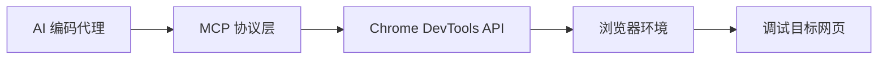

**技术特色**：
- 基于 TypeScript 实现类型安全的 DevTools API 封装
- 采用 MCP 协议实现 AI 模型与 DevTools 的标准化通信
- 提供完整的浏览器环境自动化控制能力

#### 热度分析

- 项目 Star 数超过 25K 且近期增长迅速(+331/天)，表明开发者对该项目高度关注
- 作为 DevTools 与 AI 编码代理的桥梁项目，处于 AI 辅助编程工具生态的关键位置

#### 快速上手

```bash
# 克隆项目
git clone https://github.com/ChromeDevTools/chrome-devtools-mcp.git

# 安装依赖
npm install

# 构建
npm run build
```

#### 注意事项

- 项目目前 Open Issues 为 0，可能表示项目处于早期阶段或问题管理方式不同
- 许可证信息未知，在使用前需要确认开源许可条款
- 项目名称中的 "MCP" 可能指 Model Context Protocol，具体实现方式需要查看源码确认


### 2. rowboatlabs/rowboat — AI记忆助手

> **一句话总结**：具备长期记忆功能的开源AI协作工具，能持续学习用户工作模式并智能辅助。

#### 价值主张

| 维度 | 说明 |
|------|------|
| **解决痛点** | 解决传统AI助手缺乏上下文记忆和连贯性的问题 |
| **目标用户** | 需要长期AI协作的知识工作者和开发团队 |
| **核心亮点** | + 长期记忆能力 + 开源可定制 + TypeScript类型安全 |

#### 技术架构

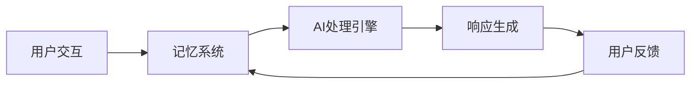

**技术特色**：
- 基于TypeScript构建确保代码质量和类型安全
- 分布式记忆架构支持长期上下文保留
- 开源设计允许社区扩展和功能定制

#### 热度分析

- 项目Star数超6000且近期增长迅速，显示市场对AI协作工具的强烈需求
- Fork数相对较低，表明用户更关注功能使用而非二次开发

#### 快速上手

```bash
# 克隆项目
git clone https://github.com/rowboatlabs/rowboat.git

# 安装依赖
npm install

# 启动服务
npm run start
```

#### 注意事项

- 项目许可证信息不明确，使用前需确认授权条款
- 可能处于开发初期，API和功能可能不稳定
- 需注意AI系统处理的数据隐私和安全问题


### 3. SynkraAI/aios-core — AI全栈框架

> **一句话总结**：Synkra AIOS是一个AI编排的全栈开发系统核心框架，提供自动化开发流程。

#### 价值主张

| 维度 | 说明 |
|------|------|
| **解决痛点** | 全栈开发中AI工具整合与自动化编排问题 |
| **目标用户** | 全栈开发者、AI应用构建者、自动化流程需求者 |
| **核心亮点** | AI智能编排 + 全栈支持 + 开发自动化 + 版本4.0稳定性 |

#### 技术架构

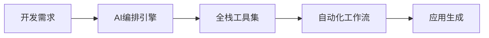

**技术特色**：
- 基于JavaScript的AI编排系统
- 提供全栈开发支持
- 版本4.0表示相对成熟稳定

#### 热度分析

- 项目近期获得209个Star，显示出快速增长的社区关注度
- Fork数达到242，表明开发者积极参与项目改进和定制

#### 快速上手

```bash
# 克隆项目
git clone https://github.com/SynkraAI/aios-core.git

# 安装依赖
npm install

# 启动框架
npm start
```

#### 注意事项

- 由于许可证信息未知，使用前需确认开源许可条款
- 项目版本为4.0，表明相对成熟，但仍需关注API稳定性
- Open Issues为0，可能表示项目问题处理及时或社区反馈渠道不明确


### 4. alibaba/zvec — 轻量内存向量数据库

> **一句话总结**：轻量级、超高性能的进程内向量数据库，提供毫秒级向量查询能力。

#### 价值主张

| 维度 | 说明 |
|------|------|
| **解决痛点** | 解决传统向量数据库重量级、部署复杂、查询延迟高的问题 |
| **目标用户** | 需要高效向量数据处理的开发者、AI/ML应用工程师 |
| **核心亮点** | 轻量级 + 高性能 + 进程内 + C++实现 + 低延迟 |

#### 技术架构

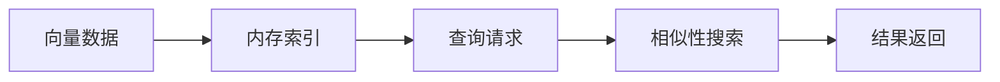

**技术特色**：
- 基于内存的高效向量存储
- 优化的向量索引算法
- C++实现的高性能查询引擎
- 进程内部署，减少网络开销

#### 热度分析

- 项目近期热度显著上升，今日新增Star数172，表明社区关注度提高
- Fork数相对较少，显示项目可能主要作为库使用而非独立应用

#### 快速上手

```bash
# 克隆项目
git clone https://github.com/alibaba/zvec.git

# 编译项目
cd zvec && mkdir build && cd build
cmake .. && make
```

#### 注意事项

- 项目许可证未知，商业使用前需确认授权情况
- Open Issues为0，可能表明问题通过其他渠道处理或项目处于早期阶段
- 作为进程内数据库，不适合需要持久化或分布式场景的应用


### 5. tambo-ai/tambo — React生成式UI

> **一句话总结**：通过自然语言描述自动生成React UI组件，提升开发效率的智能SDK。

#### 价值主张

| 维度 | 说明 |
|------|------|
| **解决痛点** | 减少手动编写React组件的工作量，加速UI开发流程 |
| **目标用户** | React开发者，特别是需要快速构建界面的前端工程师 |
| **核心亮点** | 自然语言生成UI + TypeScript类型安全 + 智能组件优化 |

#### 技术架构

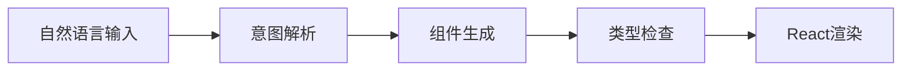

**技术特色**：
- 基于大型语言模型的UI理解与生成能力
- 完全类型安全的TypeScript实现
- 与现有React组件库无缝集成

#### 热度分析

- 项目Star数近万，日增127星，显示强劲增长势头和社区认可度
- 作为生成式UI领域的创新工具，在React生态中占据独特技术位置

#### 快速上手

```bash
# 安装tambo
npm install tambo

# 基本使用示例
import { generate } from 'tambo';

const MyComponent = () => {
  const ui = generate("创建一个带有标题和描述的卡片");
  return ui;
};
```

#### 注意事项

- 生成的UI组件可能需要进一步手动优化和调整
- 对于复杂业务逻辑，建议结合传统组件开发方式
- 需要稳定的网络连接以调用AI生成服务


### 6. ruvnet/wifi-densepose — WiFi姿态估计

> **一句话总结**：基于WiFi信号的全身体态估计系统，无需视觉设备即可实现穿墙实时人体追踪。

#### 价值主张

| 维度 | 说明 |
|------|------|
| **解决痛点** | 传统视觉姿态估计受视线限制且侵犯隐私，无法穿墙追踪 |
| **目标用户** | 智能家居开发者、安全监控机构、医疗监护系统提供商 |
| **核心亮点** | 无需摄像头 + 穿墙追踪 + 保护隐私 + 实时处理 + 商品级路由器支持 |

#### 技术架构

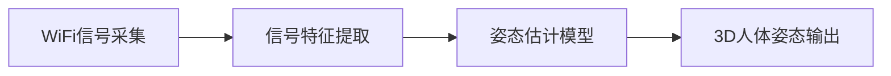

**技术特色**：
- 利用WiFi信号变化推断人体姿态
- 可穿透障碍物进行非视线追踪
- 基于密集姿态估计提供精确的人体关节点信息

#### 热度分析

- 项目获6,165星标且近期增长迅速(+98 today)，表明WiFi姿态估计领域受到高度关注
- 0个开放问题反映项目成熟度高，处于智能感知领域前沿位置

#### 快速上手

```bash
# 克隆项目
git clone https://github.com/ruvnet/wifi-densepose.git
cd wifi-densepose

# 安装依赖
pip install -r requirements.txt
```

#### 注意事项

- 需要特定的WiFi硬件配置和多路由器环境才能正常运行
- 系统精度可能受环境因素和WiFi信号质量影响，需要适当校准
- 使用时需考虑隐私问题，因为系统可以追踪人体活动


### 7. letta-ai/letta-code — 记忆优先编程助手

> **一句话总结**：基于记忆机制的AI编程助手，能持续学习并记住用户编程上下文，提供个性化代码辅助。

#### 价值主张

| 维度 | 说明 |
|------|------|
| **解决痛点** | 传统编程助手缺乏上下文记忆，无法持续学习用户编程习惯和项目特点 |
| **目标用户** | 需要长期协作的软件开发团队和个人开发者 |
| **核心亮点** | 持续学习用户习惯 + 项目上下文记忆 + 个性化代码建议 + 跨会话能力 |

#### 技术架构

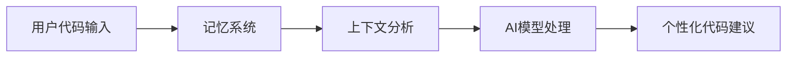

**技术特色**：
- 基于TypeScript构建的全栈架构，确保类型安全
- 记忆系统持续学习用户编程模式，实现个性化体验
- 轻量级设计，易于集成到现有开发工作流

#### 热度分析

- 项目近期增长迅速，55个新增stars表明社区认可度高
- 作为AI辅助编程领域的新兴项目，有望在AI+编程领域占据一席之地

#### 快速上手

```bash
# 克隆项目
git clone https://github.com/letta-ai/letta-code.git
cd letta-code

# 安装依赖并启动
npm install
npm start
```

#### 注意事项

- 项目许可证信息不明确，商业使用前需确认许可条款
- 作为早期项目，API和功能可能会发生变化，不建议用于生产环境关键任务


### 8. cinnyapp/cinny — 简洁Matrix客户端

> **一句话总结**：轻量级、跨平台的Matrix协议客户端，注重隐私与用户体验的平衡。

#### 价值主张

| 维度 | 说明 |
|------|------|
| **解决痛点** | 提供简洁直观的Matrix通信体验，解决官方客户端复杂性问题 |
| **目标用户** | 注重隐私保护的个人用户和小型团队协作 |
| **核心亮点** | 界面简洁 + 端到端加密 + 多账户管理 + 跨平台支持 + 自托管友好 |

#### 技术架构

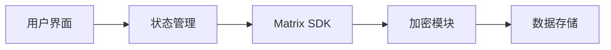

**技术特色**：
- 基于React和TypeScript构建，提供类型安全开发体验
- 采用模块化设计，便于功能扩展和维护
- 实现Matrix端到端加密，保障通信安全与隐私

#### 热度分析

- 项目获得3000+星标且持续增长，表明社区认可度高
- 作为Matrix生态中的重要客户端，填补了轻量级解决方案的空白

#### 快速上手

```bash
# 克隆项目
git clone https://github.com/cinnyapp/cinny.git

# 安装依赖
cd cinny && npm install

# 启动开发服务器
npm run dev
```

#### 注意事项

- 项目许可证信息不明确，使用前需确认开源协议
- 作为Matrix客户端，需要连接到Matrix服务器或使用公共homeserver


### 9. Zipstack/unstract — 无代码文档处理平台

> **一句话总结**：无需编程即可构建API和ETL流程，利用大语言模型处理非结构化文档。

#### 价值主张

| 维度 | 说明 |
|------|------|
| **解决痛点** | 解决非结构化文档处理需编程知识的问题，降低技术门槛 |
| **目标用户** | 需处理文档但缺乏编程技能的业务人员和数据分析师 |
| **核心亮点** | 无代码操作 + LLM集成 + API生成 + ETL管道 + 文档结构化 |

#### 技术架构

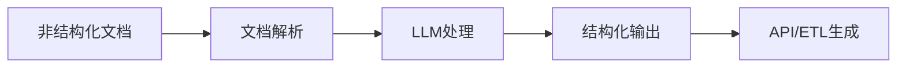

**技术特色**：
- 基于Python构建的无代码低代码平台
- 集成多种大语言模型处理非结构化文档
- 提供可视化流程构建器和API自动生成功能

#### 热度分析

- 项目Star数超6300且持续增长，显示文档处理无代码化需求强劲
- Fork数适中，表明社区正在尝试使用和二次开发该项目

#### 快速上手

```bash
# 克隆项目
git clone https://github.com/Zipstack/unstract.git
cd unstract

# 安装依赖
pip install -r requirements.txt
```

#### 注意事项

- 项目许可证未知，使用前需确认商业许可条款
- 作为处理敏感文档的平台，需关注数据隐私和安全问题


### 10. minio/minio — 分布式对象存储

> **一句话总结**：高性能、S3兼容的对象存储系统，为企业提供私有云存储解决方案

#### 价值主张

| 维度 | 说明 |
|------|------|
| **解决痛点** | 企业私有云存储需求，提供高性能、可扩展的对象存储替代方案 |
| **目标用户** | 需要私有云存储的企业开发者、DevOps工程师、数据科学家 |
| **核心亮点** | 高性能 + S3兼容性 + 分布式架构 + 纠删码技术 + 简单部署 |

#### 技术架构

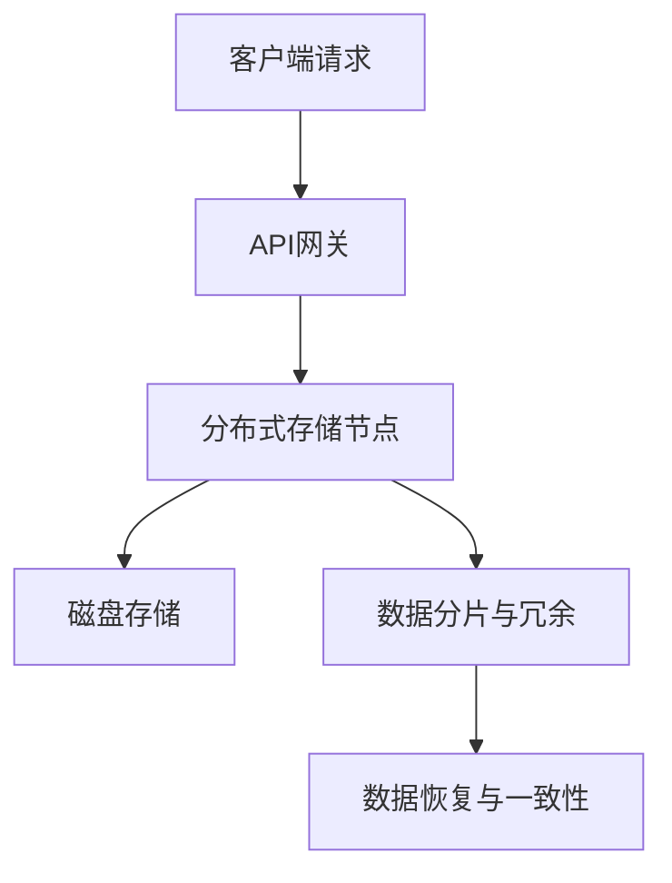

**技术特色**：
- 基于纠删码技术实现高可靠性和数据保护
- 采用Go语言编写，性能优异且资源占用低
- 提供丰富的SDK和工具，支持多种编程语言

#### 热度分析

- 项目Star数超6万，日均增长30+，表明社区活跃度高且认可度强
- 作为对象存储领域领先项目，在云原生和大数据生态中占据重要位置

#### 快速上手

```bash
# 下载并启动MinIO服务器
wget https://dl.min.io/server/minio/release/linux-amd64/minio
chmod +x minio
./minio server /data
```

#### 注意事项

- MinIO默认使用纠删码技术，生产环境建议至少部署4个节点以确保数据冗余
- 在生产环境中应配置HTTPS证书以确保数据传输安全
- 需合理规划存储容量和节点数量，以获得最佳性能和可靠性


### 11. ruby/ruby — 动态编程语言

> **一句话总结**：Ruby是一门注重开发者体验、强调简洁优雅语法的动态编程语言。

#### 价值主张

| 维度 | 说明 |
|------|------|
| **解决痛点** | 提供简洁高效的编程体验，快速开发复杂应用 |
| **目标用户** | Web开发者、脚本编写者、追求开发效率的程序员 |
| **核心亮点** | 简洁语法 + 动态类型 + 元编程能力 + 丰富生态系统 + 开发者友好 |

#### 技术架构

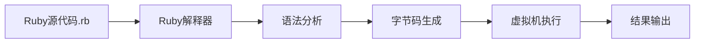

**技术特色**：
- 纯面向对象设计，一切皆对象
- 强大的元编程能力，允许在运行时修改代码结构
- 灵活的块(Block)和迭代器机制，简化集合操作
- 丰富的标准库和活跃的第三方gem生态系统
- 支持多种Ruby实现(CRuby, JRuby, TruffleRuby等)

#### 热度分析

- 项目获得超过2.3万星，保持稳定增长，表明Ruby语言持续受到开发者关注。
- 作为一门成熟的编程语言，Ruby拥有稳定的开发者社区和成熟的生态系统。

#### 快速上手

```bash
# 安装Ruby
$ brew install ruby  # macOS
$ sudo apt-get install ruby  # Ubuntu

# 验证安装
$ ruby --version

# 运行Ruby程序
$ ruby -e "puts 'Hello, Ruby!'"
```

#### 注意事项

- Ruby是动态类型语言，大型项目可能需要额外的类型检查工具
- 不同Ruby实现(CRuby, JRuby等)可能在性能和特性上存在差异
- Ruby 2.7+版本引入了类型签名等静态分析特性，但与静态类型语言相比仍有差距


## 今日推荐

| 主题 | 推荐项目 | 亮点 |
|------|----------|------|
| 今日最热 | [ChromeDevTools/chrome-devtools-mcp](https://github.com/ChromeDevTools/chrome-devtools-mcp) | Chrome DevTools f... |
| 值得关注 | [rowboatlabs/rowboat](https://github.com/rowboatlabs/rowboat) | Open-source AI co... |
| 快速上手 | [SynkraAI/aios-core](https://github.com/SynkraAI/aios-core) | Synkra AIOS: AI-O... |
| 长期潜力 | [alibaba/zvec](https://github.com/alibaba/zvec) | A lightweight, li... |

---

<div align="center">

*Generated on 2026-02-15 | Powered by GitHub Trending Reporter*

</div>