## 今日热点

AI助手与开发工具引领今日GitHub热榜，开源AI同事、个人AI助手及WiFi人体姿态估计等AI项目获得高度关注，同时GitHub代理工作流和Chrome开发工具等开发工具也备受瞩目。

---

## 热门项目一览

| 排名 | 项目 | 语言 | 今日 | 总计 | 简介 |
|:---:|------|:----:|------:|-----:|------|
| 1 | [openclaw/openclaw](https://github.com/openclaw/openclaw) | TypeScript | +2,380 | 197,332 | Your own personal AI assist... |
| 2 | [rowboatlabs/rowboat](https://github.com/rowboatlabs/rowboat) | TypeScript | +803 | 6,819 | Open-source AI coworker, wi... |
| 3 | [alibaba/zvec](https://github.com/alibaba/zvec) | C++ | +673 | 2,341 | A lightweight, lightning-fa... |
| 4 | [steipete/gogcli](https://github.com/steipete/gogcli) | Go | +630 | 2,981 | Google Suite CLI: Gmail, GC... |
| 5 | [ChromeDevTools/chrome-devtools-mcp](https://github.com/ChromeDevTools/chrome-devtools-mcp) | TypeScript | +357 | 25,427 | Chrome DevTools for coding ... |
| 6 | [ruvnet/wifi-densepose](https://github.com/ruvnet/wifi-densepose) | Python | +352 | 6,493 | Production-ready implementa... |
| 7 | [github/gh-aw](https://github.com/github/gh-aw) | Go | +213 | 2,712 | GitHub Agentic Workflows |
| 8 | [SynkraAI/aios-core](https://github.com/SynkraAI/aios-core) | JavaScript | +163 | 795 | Synkra AIOS: AI-Orchestrate... |
| 9 | [moonshine-ai/moonshine](https://github.com/moonshine-ai/moonshine) | C | +157 | 3,828 | Fast and accurate automatic... |
| 10 | [nautechsystems/nautilus_trader](https://github.com/nautechsystems/nautilus_trader) | Rust | +68 | 19,313 | A high-performance algorith... |
| 11 | [brave/brave-browser](https://github.com/brave/brave-browser) | Unknown | +27 | 21,548 | Brave browser for Android, ... |

---

## 趋势洞察

```
┌─────────────────────────────────────────────────────────────────┐
│  AI/ML 工具         ████████████████████████  7 个项目        │
│  其他               ██████████                3 个项目        │
│  数据分析             ███                       1 个项目        │
└─────────────────────────────────────────────────────────────────┘
```

---

## 项目深度解读

### 1. openclaw/openclaw — 跨平台AI助手

> **一句话总结**：一款支持全平台的个人AI助手，采用TypeScript开发，以龙虾为设计理念。

#### 价值主张

| 维度 | 说明 |
|------|------|
| **解决痛点** | 打破操作系统限制，提供统一的跨平台AI助手体验 |
| **目标用户** | 需要跨平台AI辅助的个人用户和开发者 |
| **核心亮点** | 跨平台兼容性 + TypeScript类型安全 + 龙虾主题设计 |

#### 技术架构

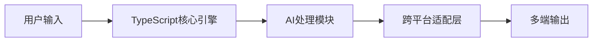

**技术特色**：
- 采用TypeScript构建，确保类型安全和开发效率
- 跨平台架构设计，统一API适配不同操作系统
- 模块化组件结构，便于功能扩展和维护
- 龙虾主题UI设计，提供独特视觉体验

#### 热度分析

- 项目星数近20万且单日增长超2300，表明社区关注度极高且呈上升趋势
- 零开放问题与高Fork比例，反映项目成熟度高且社区参与活跃

#### 快速上手

```bash
# 克隆项目
git clone https://github.com/openclaw/openclaw.git

# 安装依赖
npm install

# 启动开发环境
npm run dev
```

#### 注意事项

- 项目许可证未知，使用前需确认授权条款
- 高关注度项目对代码质量和文档要求较高，贡献需谨慎
- 零开放问题可能意味着问题被快速关闭，需关注实际维护情况


### 2. rowboatlabs/rowboat — AI记忆助手

> **一句话总结**：开源AI助手，具备记忆能力，可长期保存和利用上下文信息辅助工作。

#### 价值主张

| 维度 | 说明 |
|------|------|
| **解决痛点** | 传统AI助手无法记住历史交互，难以持续构建长期工作关系 |
| **目标用户** | 需要与AI建立长期工作关系的开发者、研究人员和内容创作者 |
| **核心亮点** | 记忆存储 + 上下文连续性 + 可定制化 + 开源透明 |

#### 技术架构

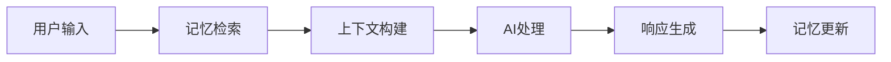

**技术特色**：
- 基于TypeScript构建，确保代码质量和类型安全
- 记忆系统可持久化存储用户交互历史
- 支持长期上下文追踪和智能信息关联

#### 热度分析

- 项目Star数增长迅速，单日新增803星，表明社区认可度高，需求强烈
- 开源项目定位明确，填补了AI助手长期记忆功能的空白，在AI工具生态中占据独特位置

#### 快速上手

```bash
# 克隆项目
git clone https://github.com/rowboatlabs/rowboat.git

# 安装依赖
npm install

# 启动服务
npm start
```

#### 注意事项

- 项目许可证未知，使用前需确认开源协议
- 作为AI助手，使用时需注意数据隐私和安全性问题
- 记忆功能可能需要配置存储后端，确保有适当的存储资源


### 3. alibaba/zvec — 高性能向量库

> **一句话总结**：轻量级进程内向量数据库，为高性能向量相似性搜索提供极致速度。

#### 价值主张

| 维度 | 说明 |
|------|------|
| **解决痛点** | 传统向量数据库在高性能场景下的延迟和资源消耗问题 |
| **目标用户** | 需要高性能向量搜索的开发者和数据科学家 |
| **核心亮点** | 轻量级设计 + 极致性能 + 进程内部署 + C++实现 + 零依赖 |

#### 技术架构

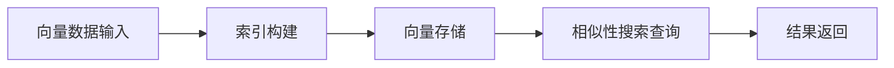

**技术特色**：
- 基于C++实现的高性能向量索引结构
- 零依赖的轻量级设计
- 优化的内存管理策略

#### 热度分析

- 项目近期获得大量Star（今日增长673），表明在向量数据库领域引起了广泛关注
- 作为阿里巴巴开源项目，处于向量数据库技术前沿，社区活跃度高，生态潜力大

#### 快速上手

```bash
# 克隆项目
git clone https://github.com/alibaba/zvec.git

# 构建项目
cd zvec && make
```

#### 注意事项

- 项目许可证未知，使用前需确认授权条款
- 作为进程内数据库，可能不适合大规模分布式场景
- 需要一定的C++知识才能有效使用和二次开发


### 4. steipete/gogcli — Google服务CLI工具

> **一句话总结**：为Google服务提供统一命令行界面，简化Gmail、日历、驱动和联系人管理。

#### 价值主张

| 维度 | 说明 |
|------|------|
| **解决痛点** | 解决无法通过命令行高效管理Google服务的问题 |
| **目标用户** | 需要批量管理Google服务的高级用户和开发者 |
| **核心亮点** | 统一接口 + 命令行操作 + 脚本化自动化 |

#### 技术架构

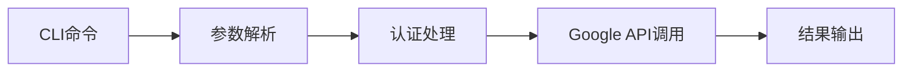

**技术特色**：
- 使用Go语言实现高效CLI工具
- 统一认证管理多个Google服务
- 模块化设计支持不同Google服务

#### 热度分析

- 项目获得近3000个star，近期增长迅速，表明Google服务CLI需求强烈
- 0个open issues可能表示项目成熟度较高或维护者响应及时

#### 快速上手

```bash
# 安装gogcli
go install github.com/steipete/gogcli/cmd/gogcli

# 使用gogcli查看Google Calendar
gogcli cal today
```

#### 注意事项

- 需要Google API认证才能使用
- 可能需要配置API访问权限
- 项目许可证信息不明确，使用前需确认


### 5. ChromeDevTools/chrome-devtools-mcp — 开发工具代理

> **一句话总结**：为AI编码代理提供Chrome开发者工具接口，增强代码分析与调试能力。

#### 价值主张

| 维度 | 说明 |
|------|------|
| **解决痛点** | 为AI编码代理提供浏览器环境交互能力，扩展调试场景 |
| **目标用户** | AI辅助开发工具、自动化测试框架、代码分析系统开发者 |
| **核心亮点** | + 提供完整的浏览器调试能力 + 支持AI代理直接操作DevTools + 跨平台TypeScript实现 |

#### 技术架构

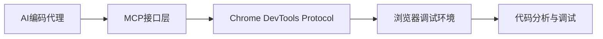

**技术特色**：
- 基于Chrome DevTools Protocol构建，确保与浏览器深度集成
- TypeScript实现，提供类型安全和良好的开发体验
- 设计为AI代理可调用接口，支持自动化代码分析流程

#### 热度分析

- 项目Star数持续快速增长，日均增长超过300，显示开发者高度关注
- 作为AI辅助开发工具链的重要组成部分，生态位置日益重要

#### 快速上手

```bash
# 克隆项目
git clone https://github.com/ChromeDevTools/chrome-devtools-mcp.git
cd chrome-devtools-mcp

# 安装依赖并运行
npm install
npm run start
```

#### 注意事项

- 需要Chrome浏览器或基于Chromium的浏览器环境支持
- 项目依赖最新的Chrome DevTools Protocol，可能需要定期更新以保持兼容性
- 需要了解Chrome DevTools Protocol的基础知识才能充分利用项目功能


### 6. ruvnet/wifi-densepose — WiFi姿态估计算法

> **一句话总结**：利用普通WiFi路由器实现穿墙实时全身姿态跟踪的革命性系统

#### 价值主张

| 维度 | 说明 |
|------|------|
| **解决痛点** | 传统摄像头无法穿墙进行姿态估计，现有WiFi感知系统精度不足 |
| **目标用户** | 需要非接触式人体行为监测的研究人员、安防系统和智能家居开发者 |
| **核心亮点** | 普通WiFi路由器即可实现 + 穿墙实时跟踪 + 全身密集姿态估计 + 生产就绪 |

#### 技术架构

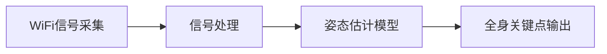

**技术特色**：
- 利用WiFi信道状态信息(CSI)进行人体活动感知
- 通过深度学习模型从WiFi信号中提取人体姿态特征
- 不依赖视觉传感器，实现穿墙监测能力

#### 热度分析

- 项目近期增长迅猛，单日新增352星，表明技术新颖且实用性强
- 高星低Fork比例显示项目主要作为应用工具而非研究参考

#### 快速上手

```bash
# 安装依赖
pip install -r requirements.txt

# 运行示例
python demo.py --input wifi_data --output pose_result
```

#### 注意事项

- 许可证未知，使用前需确认授权条款
- 可能需要特定的WiFi硬件支持才能获得最佳效果
- 穿墙效果可能受墙体材质和厚度影响


### 7. github/gh-aw — GitHub智能工作流

> **一句话总结**：为GitHub设计的智能代理工作流工具，实现自动化任务与决策。

#### 价值主张

| 维度 | 说明 |
|------|------|
| **解决痛点** | 简化GitHub上复杂工作流的创建与管理，实现智能化自动化操作 |
| **目标用户** | GitHub开发者、DevOps工程师、自动化流程需求者 |
| **核心亮点** | + 基于AI的代理决策能力 + 与GitHub深度集成 + 简化的工作流定义 |

#### 技术架构

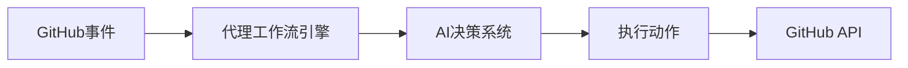

**技术特色**：
- 基于Go语言实现的高效工作流处理引擎
- 集成AI代理系统实现智能决策能力
- 与GitHub API深度无缝集成

#### 热度分析

- 项目Star数快速增长，单日增长213，表明社区认可度高
- 作为GitHub生态的新兴工具，有望成为CI/CD和自动化流程的重要补充

#### 快速上手

```bash
# 安装gh-aw工具
go install github.com/github/gh-aw@latest

# 初始化工作流配置
gh-aw init

# 启动代理工作流
gh-aw run
```

#### 注意事项

- 项目开源许可证信息不明确，商业使用前需确认许可条款
- 项目Issue数量为0，可能表明项目处于早期阶段，稳定性有待验证
- 需要GitHub API权限，确保相关仓库有足够的访问权限


### 8. SynkraAI/aios-core — AI全栈框架

> **一句话总结**：AI驱动的全栈开发核心框架，自动化编排前后端开发流程。

#### 价值主张

| 维度 | 说明 |
|------|------|
| **解决痛点** | 全栈开发中AI工具分散，缺乏统一编排系统 |
| **目标用户** | 全栈开发者、AI工具集成者、自动化流程构建者 |
| **核心亮点** | AI编排能力 + 全栈开发支持 + 核心框架设计 + 版本迭代稳定 |

#### 技术架构

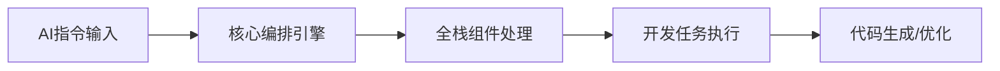

**技术特色**：
- 基于JavaScript的全栈开发框架设计
- AI驱动的开发流程自动化编排机制
- 提供v4.0稳定版本，表明项目持续迭代优化

#### 热度分析

- 项目一日内激增163个star，显示近期关注度快速上升
- Fork数量达287，表明开发者社区有较高参与度和二次开发意愿
- Zero open issues可能反映问题解决效率高或社区规模尚小

#### 快速上手

```bash
# 安装aios-core
npm install synkra-aios-core

# 初始化项目
npx aios-init

# 启动开发服务器
aios dev
```

#### 注意事项

- 项目许可证未知，使用前需确认授权条款
- 作为v4.0版本，可能存在API变更风险
- 需要了解JavaScript和AI集成概念才能充分利用
- 作为核心框架，可能需要配合其他组件才能完整使用


### 9. moonshine-ai/moonshine — 边缘语音识别

> **一句话总结**：专为边缘设备优化的轻量级、低延迟语音识别系统，实现高效离线语音处理。

#### 价值主张

| 维度 | 说明 |
|------|------|
| **解决痛点** | 边缘设备上缺乏高效准确的语音识别解决方案，传统模型过于庞大 |
| **目标用户** | 嵌入式开发者、物联网设备制造商、移动应用开发者 |
| **核心亮点** | 轻量级模型 + 低延迟推理 + 离线运行能力 + 高准确率 |

#### 技术架构

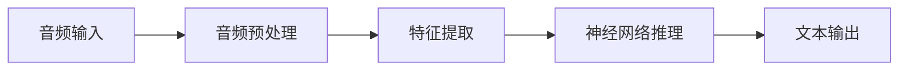

**技术特色**：
- 针对边缘设备计算资源定制的优化神经网络架构
- 高效音频处理流水线，显著降低内存占用和延迟
- 模量化和剪枝技术，在资源受限环境中保持高准确率

#### 热度分析

- 项目获得3828个star且近期增长迅速(+157 today)，表明社区对边缘ASR需求强烈
- 专业领域项目参与度相对较高(fork数179)，开发者群体认可其技术价值

#### 快速上手

```bash
# 克隆项目
git clone https://github.com/moonshine-ai/moonshine.git
cd moonshine

# 编译项目
make

# 运行ASR识别
./moonshine -i audio.wav -o transcript.txt
```

#### 注意事项

- 项目文档可能不够完善，需要开发者具备ASR和C语言基础
- 边缘设备运行时需考虑计算资源和内存限制
- 可能需要针对特定硬件平台进行额外优化配置


### 10. nautechsystems/nautilus_trader — 高频交易平台

> **一句话总结**：基于Rust构建的高性能事件驱动算法交易平台与回测系统，专为量化交易者设计。

#### 价值主张

| 维度 | 说明 |
|------|------|
| **解决痛点** | 提供高性能、低延迟的完整交易解决方案，解决传统回测与实盘交易割裂问题 |
| **目标用户** | 专业量化交易者、对冲基金、高频交易团队 |
| **核心亮点** | 事件驱动架构 + 零拷贝设计 + C++互操作性 + 模块化组件 + 全面回测支持 |

#### 技术架构

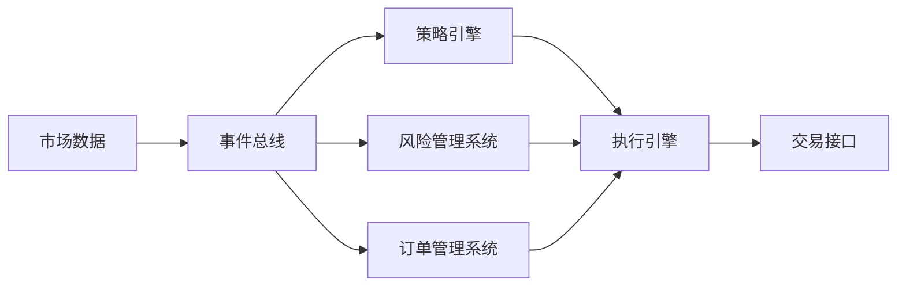

**技术特色**：
- 基于Rust内存安全特性构建，确保关键交易逻辑无内存错误
- 采用事件驱动架构，实现组件间松耦合与高性能处理
- 支持零拷贝数据传递，最小化延迟
- 提供C++ FFI接口，便于集成现有交易系统

#### 热度分析

- 项目获得19,313个星标，近期每日增长约68个，表明在量化交易领域备受关注
- 0开放issues反映项目成熟度高，维护质量优秀，在量化交易开源生态中处于领先地位

#### 快速上手

```bash
# 克隆仓库
git clone https://github.com/nautechsystems/nautilus_trader.git
cd nautilus_trader

# 构建示例
cargo run --example trading_bot
```

#### 注意事项

- 项目采用Rust编写，需要一定Rust语言基础才能进行深度定制
- 系统设计高度复杂，建议先阅读详细文档再尝试在生产环境使用
- 虽然项目描述为开源，但许可证信息不明确，使用前需确认授权条款


### 11. brave/brave-browser — 隐私优先浏览器

> **一句话总结**：Brave 浏览器是一款注重隐私保护和用户数据安全的跨平台开源浏览器。

#### 价值主张

| 维度 | 说明 |
|------|------|
| **解决痛点** | 传统浏览器追踪用户数据、侵犯隐私、展示过多广告的问题 |
| **目标用户** | 注重隐私保护、希望免受广告追踪和干扰的网络用户 |
| **核心亮点** | + 阻止广告和追踪器 + 奖励用户观看广告 + 强调隐私保护 + 跨平台支持 |

#### 技术架构

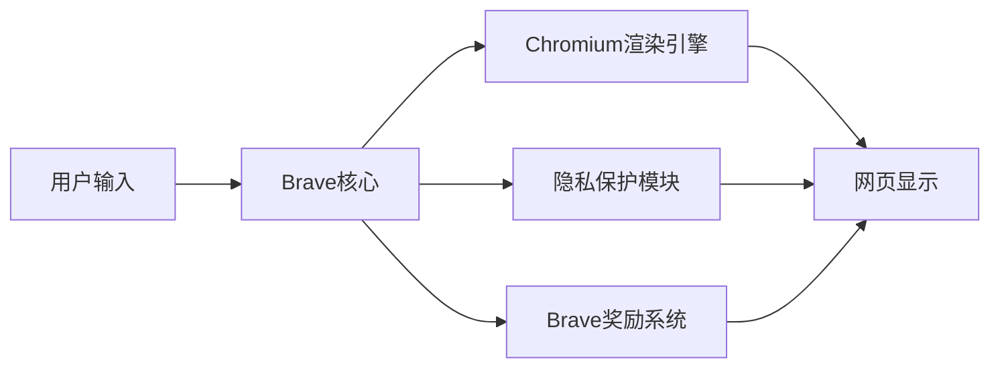

**技术特色**：
- 基于Chromium内核，确保网页兼容性
- 内置广告和追踪器拦截技术
- BAT（Basic Attention Token）奖励系统架构
- 安全浏览和防指纹识别技术
- 开源透明，可验证的隐私保护机制

#### 热度分析

- Brave 浏览器获得超过21,500个Star，近期增长稳定，表明用户对隐私保护浏览器需求持续上升
- 作为隐私保护领域的代表项目，Brave 在浏览器生态中占据重要位置，与Firefox、Tor等形成差异化竞争

#### 快速上手

```bash
# 对于Linux用户
sudo snap install brave

# 对于Windows/Mac用户
# 访问官网 brave.com 下载安装包

# 对于开发人员
git clone https://github.com/brave/brave-browser.git
cd brave-browser
./build.sh
```

#### 注意事项

- Brave 浏览器基于 Chromium，这意味着它与 Chrome 有相似的功能和界面，但更注重隐私
- Brave 的奖励系统需要用户选择加入并创建钱包才能获得BAT代币奖励
- 某些依赖广告收入的网站可能会显示警告，因为Brave默认阻止广告和追踪器
- 项目代码库较大，编译需要较强的硬件配置和较长时间


## 今日推荐

| 主题 | 推荐项目 | 亮点 |
|------|----------|------|
| 今日最热 | [openclaw/openclaw](https://github.com/openclaw/openclaw) | Your own personal... |
| 值得关注 | [rowboatlabs/rowboat](https://github.com/rowboatlabs/rowboat) | Open-source AI co... |
| 快速上手 | [alibaba/zvec](https://github.com/alibaba/zvec) | A lightweight, li... |
| 长期潜力 | [steipete/gogcli](https://github.com/steipete/gogcli) | Google Suite CLI:... |

---

<div align="center">

*Generated on 2026-02-16 | Powered by GitHub Trending Reporter*

</div>