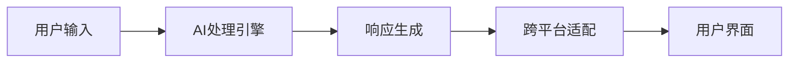
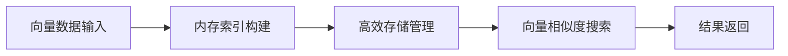
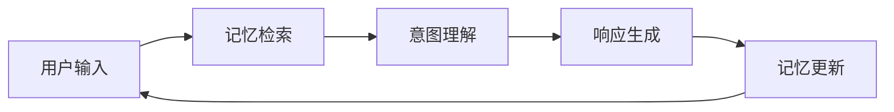
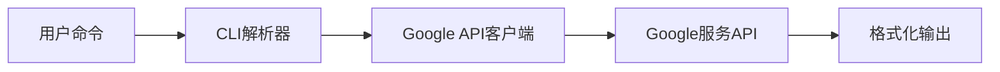
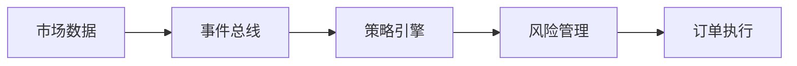
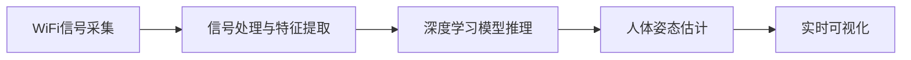
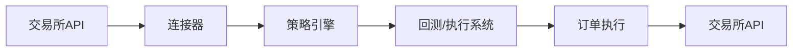
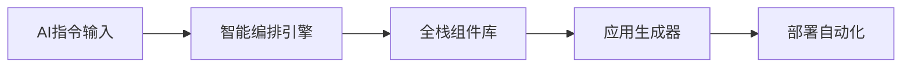
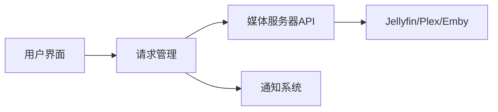
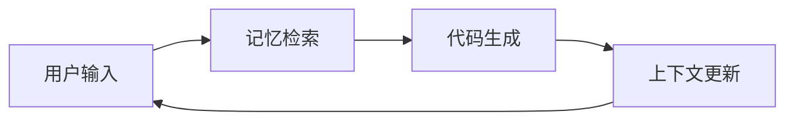

## 今日热点

AI助手与记忆型AI开发工具持续火热，金融交易与加密货币自动化工具受关注，显示AI赋能与自动化仍是开发者焦点。

---

## 热门项目一览

| 排名 | 项目 | 语言 | 今日 | 总计 | 简介 |
|:---:|------|:----:|------:|-----:|------|
| 1 | [openclaw/openclaw](https://github.com/openclaw/openclaw) | TypeScript | +3,873 | 201,705 | Your own personal AI assist... |
| 2 | [alibaba/zvec](https://github.com/alibaba/zvec) | C++ | +1,094 | 3,613 | A lightweight, lightning-fa... |
| 3 | [rowboatlabs/rowboat](https://github.com/rowboatlabs/rowboat) | TypeScript | +700 | 7,329 | Open-source AI coworker, wi... |
| 4 | [steipete/gogcli](https://github.com/steipete/gogcli) | Go | +637 | 3,502 | Google Suite CLI: Gmail, GC... |
| 5 | [nautechsystems/nautilus_trader](https://github.com/nautechsystems/nautilus_trader) | Rust | +546 | 19,783 | A high-performance algorith... |
| 6 | [ruvnet/wifi-densepose](https://github.com/ruvnet/wifi-densepose) | Python | +344 | 6,803 | Production-ready implementa... |
| 7 | [hummingbot/hummingbot](https://github.com/hummingbot/hummingbot) | Python | +339 | 16,565 | Open source software that h... |
| 8 | [SynkraAI/aios-core](https://github.com/SynkraAI/aios-core) | JavaScript | +205 | 991 | Synkra AIOS: AI-Orchestrate... |
| 9 | [seerr-team/seerr](https://github.com/seerr-team/seerr) | TypeScript | +182 | 9,072 | Open-source media request a... |
| 10 | [letta-ai/letta-code](https://github.com/letta-ai/letta-code) | TypeScript | +22 | 1,452 | The memory-first coding agent |

---

## 趋势洞察

```
┌─────────────────────────────────────────────────────────────────┐
│  AI/ML 工具         ████████████████████████  5 个项目        │
│  其他               █████████                 2 个项目        │
│  多媒体应用            ████                      1 个项目        │
│  数据分析             ████                      1 个项目        │
│  安全工具             ████                      1 个项目        │
└─────────────────────────────────────────────────────────────────┘
```

---

## 项目深度解读

### 1. openclaw/openclaw — 跨平台AI助手

> **一句话总结**：用TypeScript构建的开源跨平台AI助手，提供统一的个人智能体验。

#### 价值主张

| 维度 | 说明 |
|------|------|
| **解决痛点** | 打破操作系统限制，提供一致的个人AI助手体验 |
| **目标用户** | 开发者、技术爱好者及需要跨平台AI辅助的用户 |
| **核心亮点** | 跨平台兼容性 + TypeScript开发 + 开源可定制 + 龙虾标志设计 |

#### 技术架构



**技术特色**：
- 采用TypeScript确保代码质量和类型安全
- 跨平台架构设计，支持Windows、macOS和Linux
- 开源架构，允许社区贡献和功能扩展

#### 热度分析

- 项目Star数超20万且持续增长，表明社区认可度和使用热情高涨
- Fork数与Star数比例合理，显示项目有活跃的二次开发贡献

#### 快速上手

```bash
# 克隆项目
git clone https://github.com/openclaw/openclaw.git
# 安装依赖
npm install
# 启动应用
npm start
```

#### 注意事项

- 项目许可证未知，使用前需确认授权条款
- 没有开放的Issues，可能通过其他渠道提供支持
- 作为AI助手项目，需注意数据隐私和安全性问题


### 2. alibaba/zvec — 极速向量数据库

> **一句话总结**：轻量级、高性能的进程内向量数据库，专为快速向量搜索设计。

#### 价值主张

| 维度 | 说明 |
|------|------|
| **解决痛点** | 解决传统向量数据库性能瓶颈和高延迟问题，提供毫秒级检索能力 |
| **目标用户** | 需要高性能向量搜索的AI应用、推荐系统和机器学习工程师 |
| **核心亮点** | 轻量级设计 + 极速检索能力 + 进程内部署 + 零依赖架构 + 内存优化存储 |

#### 技术架构



**技术特色**：
- 基于内存的高效向量索引结构
- 零拷贝数据访问模式
- 优化的SIMD指令集利用
- 自适应的缓存策略

#### 热度分析

- 项目近期增长迅猛，单日新增星标超过1000，表明社区高度关注
- 作为阿里开源项目，在AI和大数据领域具有重要生态价值

#### 快速上手

```bash
# 克隆项目
git clone https://github.com/alibaba/zvec.git

# 构建项目
cd zvec && mkdir build && cd build
cmake .. && make

# 运行示例
./examples/vector_search_demo
```

#### 注意事项

- 项目许可证信息不明确，商业使用前需确认授权条款
- 作为进程内数据库，不适合大规模分布式场景
- 需要一定的C++和向量数据库基础知识才能有效使用


### 3. rowboatlabs/rowboat — 开源AI助手

> **一句话总结**：具有记忆功能的开源AI助手，能够长期保存用户交互历史，提供个性化智能协作体验。

#### 价值主张

| 维度 | 说明 |
|------|------|
| **解决痛点** | AI助手缺乏长期记忆能力，无法保留用户偏好和上下文 |
| **目标用户** | 开发者、研究人员和需要持续AI协作的专业人士 |
| **核心亮点** | 开源可定制 + 记忆功能 + 隐私保护 + 本地部署 + 类型安全 |

#### 技术架构



**技术特色**：
- 基于TypeScript构建，提供类型安全和开发体验
- 实现长期记忆机制，支持跨会话上下文保持
- 开源架构，支持本地部署和隐私保护

#### 热度分析

- 项目近期增长迅猛，单日新增700个star，显示社区对开源AI记忆助手高度关注
- 作为市场上少有的开源记忆型AI助手，填补了技术空白并吸引早期采用者

#### 快速上手

```bash
# 克隆仓库
git clone https://github.com/rowboatlabs/rowboat.git

# 安装依赖
npm install

# 启动服务
npm start
```

#### 注意事项

- 项目许可证信息不明确，商业使用前需确认授权条款
- 记忆功能可能涉及数据隐私问题，使用时需确保符合相关法规
- 作为AI助手，可能需要大量计算资源，建议评估硬件配置需求


### 4. steipete/gogcli — Google服务CLI

> **一句话总结**：统一命令行工具，高效管理Gmail、日历、Drive和联系人。

#### 价值主张

| 维度 | 说明 |
|------|------|
| **解决痛点** | 为Google服务提供统一命令行接口，替代网页操作提升效率 |
| **目标用户** | 需要批量处理Google服务的高级用户和开发者 |
| **核心亮点** | 多服务集成 + Go语言高性能实现 + 直观命令设计 |

#### 技术架构



**技术特色**：
- 基于Go语言构建，提供原生二进制文件和跨平台支持
- 封装多个Google API，简化认证和请求流程
- 采用模块化设计，各服务组件独立可扩展

#### 热度分析

- 项目近期增长迅猛，单日增长637 stars，表明社区高度认可其价值
- 零开放问题反映项目成熟度高，维护状态良好

#### 快速上手

```bash
# 安装
go get github.com/steipete/gogcli

# 配置认证
gogcli auth

# 使用示例
gogcli gmail list --limit 10
gogcli calendar events --today
```

#### 注意事项

- 需要先配置Google API凭据才能使用
- 项目许可证信息不明确，使用前需确认授权条款
- 功能依赖Google API，可能受API配额和限制影响


### 5. nautechsystems/nautilus_trader — [高性能量化平台]

> **一句话总结**：基于Rust的事件驱动量化交易平台，提供极速回测与实盘交易能力

#### 价值主张

| 维度 | 说明 |
|------|------|
| **解决痛点** | 传统量化交易系统性能瓶颈，难以满足高频交易需求 |
| **目标用户** | 专业量化交易者、对冲基金、金融科技公司 |
| **核心亮点** | 零成本抽象 + 事件驱动架构 + 多资产支持 + 高性能回测 |

#### 技术架构



**技术特色**：
- 利用Rust内存安全特性实现高性能零成本抽象
- 完整的事件驱动架构，统一回测与实盘交易
- 模块化设计，支持多种交易资产和连接器

#### 热度分析

- 近2万Star且单日增长500+，表明量化社区对该项目高度认可
- 作为Rust生态中罕见的金融类顶级项目，填补了高性能工具空白

#### 快速上手

```bash
# 克隆项目
git clone https://github.com/nautechsystems/nautilus_trader.git
# 构建项目
cargo build --release
# 运行示例
cargo run --example trading_system
```

#### 注意事项
- 项目架构复杂，需要Rust编程基础和金融市场知识
- 学习曲线较陡峭，不适合量化交易初学者
- 性能优化导致部分API设计不够直观，需深入理解


### 6. ruvnet/wifi-densepose — WiFi姿态追踪

> **一句话总结**：基于WiFi信号的穿墙实时全身姿态估计系统，无需摄像头即可实现隐私保护的人体追踪。

#### 价值主张

| 维度 | 说明 |
|------|------|
| **解决痛点** | 解决摄像头无法穿墙、侵犯隐私、低光环境下无法追踪人体姿态的问题 |
| **目标用户** | 需要非视觉人体追踪的研究机构、智能家居开发者、安防系统提供商 |
| **核心亮点** | 穿墙追踪 + 隐私保护 + 实时处理 + 普通硬件支持 + 高精度姿态估计 |

#### 技术架构



**技术特色**：
- 利用WiFi信道状态信息(CSI)进行人体动作感知
- 采用深度学习模型从WiFi信号中提取人体姿态特征
- 支持普通商用WiFi硬件，无需特殊设备
- 实现实时处理，低延迟姿态输出
- 提供密集人体关键点估计，而非简单姿态

#### 热度分析

- 项目Star数6,803且近期增长迅速(+344 today)，表明在非视觉感知领域有高关注度
- Fork数585适中，显示项目被广泛尝试使用，但可能处于研究向应用转化阶段

#### 快速上手

```bash
# 克隆项目
git clone https://github.com/ruvnet/wifi-densepose.git

# 安装依赖
cd wifi-densepose
pip install -r requirements.txt

# 运行示例
python demo.py --input wifi_data --output pose_result
```

#### 注意事项

- 需要支持CSI(信道状态信息)采集的WiFi硬件
- 系统性能受WiFi环境干扰影响较大
- 模型精度可能因环境复杂度而降低
- 可能需要针对特定环境进行模型校准
- 代码可能需要专业知识才能正确部署和优化


### 7. hummingbot/hummingbot — 高频交易机器人平台

> **一句话总结**：开源高频加密货币交易机器人平台，支持多交易所策略回测与自动化执行。

#### 价值主张

| 维度 | 说明 |
|------|------|
| **解决痛点** | 解决加密货币交易中高频执行、多交易所协同和策略回测的复杂性问题 |
| **目标用户** | 加密货币量化交易者、对冲基金、高频交易团队 |
| **核心亮点** | 支持多交易所连接 + 灵活的策略框架 + 回测系统 + 命令行界面 + 社区驱动开发 |

#### 技术架构



**技术特色**：
- 模块化设计，易于扩展新的交易所和策略
- 支持实时交易与历史数据回测
- 异步处理架构，适合高频交易场景
- 命令行界面简化操作流程
- 完善的风险管理系统

#### 热度分析

- 项目Star数持续增长，今日新增339星，表明项目活跃度高，受社区广泛关注
- Fork数达4386，显示开发者参与度高，项目生态活跃
- Open Issues为0可能表明问题解决机制高效或使用其他渠道处理问题

#### 快速上手

```bash
# 克隆仓库
git clone https://github.com/hummingbot/hummingbot.git
cd hummingbot

# 安装依赖并启动
pip install -r requirements.txt
python hummingbot.py
```

#### 注意事项

- 项目依赖Python环境，确保系统兼容性
- 高频交易需要稳定的网络环境和低延迟连接
- 使用前需充分了解交易策略和风险管理
- 需在交易所申请API密钥并配置相应权限
- 建议在模拟环境中测试策略后再投入实盘


### 8. SynkraAI/aios-core — AI全栈框架

> **一句话总结**：AI驱动的全栈开发核心框架，通过智能编排简化复杂应用开发流程。

#### 价值主张

| 维度 | 说明 |
|------|------|
| **解决痛点** | 解决全栈开发中技术栈整合与自动化编排难题 |
| **目标用户** | 全栈开发团队与AI应用构建者 |
| **核心亮点** | AI智能编排+全栈开发支持+模块化架构+自动化工作流 |

#### 技术架构



**技术特色**：
- 基于JavaScript的全栈开发框架，支持前后端统一
- AI驱动的系统编排能力，自动优化开发流程
- 模块化设计支持灵活扩展，适应不同项目需求

#### 热度分析

- 近期热度显著上升，单日新增Stars超200，表明社区关注度快速提升
- 无开放Issues可能表明项目成熟度高，或社区反馈渠道不完善

#### 快速上手

```bash
# 克隆项目
git clone https://github.com/SynkraAI/aios-core.git

# 安装依赖
npm install

# 启动开发环境
npm run dev
```

#### 注意事项

- 项目License未知，使用前需确认授权条款
- 无开放Issues可能意味着社区反馈渠道不完善
- 版本为v4.0，表明项目已相对成熟，但仍需关注API稳定性


### 9. seerr-team/seerr — 媒体请求管理

> **一句话总结**：开源媒体请求与发现管理工具，统一管理Jellyfin、Plex和Emby的媒体需求。

#### 价值主张

| 维度 | 说明 |
|------|------|
| **解决痛点** | 分散的媒体请求管理，缺乏统一追踪和通知机制 |
| **目标用户** | 使用Jellyfin、Plex或Emby的个人媒体服务器管理员 |
| **核心亮点** | 集中请求管理 + 多媒体平台支持 + 请求状态追踪 + 通知系统 + 开源可定制 |

#### 技术架构



**技术特色**：
- 基于React和TypeScript构建，提供类型安全的前端体验
- 支持多种媒体服务器后端API的统一抽象层
- 开源架构允许社区扩展和功能定制

#### 热度分析

- 项目获得9,072颗星且持续增长(+182/天)，表明在媒体服务器社区中有较高认可度
- Fork数量适中(601)，显示有活跃的社区参与和定制化需求

#### 快速上手

```bash
# 克隆仓库
git clone https://github.com/seerr-team/seerr.git
# 安装依赖
npm install
# 启动开发服务器
npm run dev
```

#### 注意事项

- 需要预先配置Jellyfin、Plex或Emby媒体服务器
- 项目可能需要API密钥或认证信息才能连接媒体服务器
- 由于License未知，使用前需确认开源协议和商业使用限制


### 10. letta-ai/letta-code — 记忆优先编程助手

> **一句话总结**：基于记忆机制的智能编程助手，能够记住上下文并提供连贯的代码生成服务。

#### 价值主张

| 维度 | 说明 |
|------|------|
| **解决痛点** | 传统代码工具缺乏上下文记忆，导致生成的代码片段不连贯 |
| **目标用户** | 开发者、程序员和需要代码生成的技术团队 |
| **核心亮点** | 记忆机制 + 上下文理解 + 代码连贯性 + 智能补全 |

#### 技术架构



**技术特色**：
- 基于记忆的上下文保持机制，维持长对话连贯性
- TypeScript实现的高效代码生成与类型安全
- 持续学习的智能模型，提升生成质量

#### 热度分析

- 项目近期获得较高关注度，Star数增长较快(+22 today)，表明社区对其功能有较高期待
- Fork数相对较少，可能处于早期发展阶段，但零Open Issues显示问题处理效率高

#### 快速上手

```bash
# 克隆项目
git clone https://github.com/letta-ai/letta-code.git
# 安装依赖
npm install
# 启动开发服务器
npm run dev
```

#### 注意事项

- 项目许可证未知，使用时需注意授权问题
- 项目可能处于早期阶段，API和功能可能不稳定
- 需要TypeScript环境支持，确保Node.js版本兼容


## 今日推荐

| 主题 | 推荐项目 | 亮点 |
|------|----------|------|
| 今日最热 | [openclaw/openclaw](https://github.com/openclaw/openclaw) | Your own personal... |
| 值得关注 | [alibaba/zvec](https://github.com/alibaba/zvec) | A lightweight, li... |
| 快速上手 | [rowboatlabs/rowboat](https://github.com/rowboatlabs/rowboat) | Open-source AI co... |
| 长期潜力 | [steipete/gogcli](https://github.com/steipete/gogcli) | Google Suite CLI:... |

---

<div align="center">

*Generated on 2026-02-17 | Powered by GitHub Trending Reporter*

</div>