## 今日热点

AI工具与框架持续引领技术热潮，Claude生态项目爆发增长，同时高性能数据库和实用工具获得开发者高度关注，展现AI赋能与实用主义并行的技术趋势。

---

## 热门项目一览

| 排名 | 项目 | 语言 | 今日 | 总计 | 简介 |
|:---:|------|:----:|------:|-----:|------|
| 1 | [openclaw/openclaw](https://github.com/openclaw/openclaw) | TypeScript | +4,201 | 205,433 | Your own personal AI assist... |
| 2 | [alibaba/zvec](https://github.com/alibaba/zvec) | C++ | +1,473 | 4,493 | A lightweight, lightning-fa... |
| 3 | [p-e-w/heretic](https://github.com/p-e-w/heretic) | Python | +656 | 7,223 | Fully automatic censorship ... |
| 4 | [obra/superpowers](https://github.com/obra/superpowers) | Shell | +569 | 53,614 | An agentic skills framework... |
| 5 | [hummingbot/hummingbot](https://github.com/hummingbot/hummingbot) | Python | +568 | 17,045 | Open source software that h... |
| 6 | [ashishps1/awesome-system-design-resources](https://github.com/ashishps1/awesome-system-design-resources) | Java | +510 | 32,820 | Learn System Design concept... |
| 7 | [steipete/gogcli](https://github.com/steipete/gogcli) | Go | +469 | 3,871 | Google Suite CLI: Gmail, GC... |
| 8 | [seerr-team/seerr](https://github.com/seerr-team/seerr) | TypeScript | +282 | 9,330 | Open-source media request a... |
| 9 | [SynkraAI/aios-core](https://github.com/SynkraAI/aios-core) | JavaScript | +194 | 1,200 | Synkra AIOS: AI-Orchestrate... |
| 10 | [steipete/summarize](https://github.com/steipete/summarize) | TypeScript | +119 | 3,445 | Point at any URL/YouTube/Po... |
| 11 | [davila7/claude-code-templates](https://github.com/davila7/claude-code-templates) | Python | +111 | 20,725 | CLI tool for configuring an... |
| 12 | [anthropics/claude-quickstarts](https://github.com/anthropics/claude-quickstarts) | Python | +87 | 14,488 | A collection of projects de... |

---

## 趋势洞察

```
┌─────────────────────────────────────────────────────────────────┐
│  AI/ML 工具         ████████████████████████  6 个项目        │
│  其他               ████████████              3 个项目        │
│  多媒体应用            ████                      1 个项目        │
│  开发工具             ████                      1 个项目        │
│  数据分析             ████                      1 个项目        │
│  安全工具             ████                      1 个项目        │
└─────────────────────────────────────────────────────────────────┘
```

---

## 项目深度解读

### 1. openclaw/openclaw — 跨平台AI助手

> **一句话总结**：一个基于TypeScript开发的跨平台AI助手，支持任何操作系统，提供个性化智能交互体验。

#### 价值主张

| 维度 | 说明 |
|------|------|
| **解决痛点** | 提供跨平台的统一AI助手体验，打破设备与系统限制 |
| **目标用户** | 需要个性化AI助手的多平台用户 |
| **核心亮点** | TypeScript开发 + 跨平台支持 + 开源免费 + 个性化定制 |

#### 技术架构

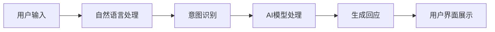

**技术特色**：
- 基于TypeScript的全栈开发，确保代码质量和类型安全
- 跨平台兼容，支持多种操作系统和设备
- 模块化设计，便于功能扩展和定制

#### 热度分析

- 项目Star数超过20万，近期增长迅速，日增4千+，表明社区高度认可
- 零开放Issues反映项目维护质量高，用户问题解决及时

#### 快速上手

```bash
# 克隆项目
git clone https://github.com/openclaw/openclaw.git

# 安装依赖
cd openclaw && npm install

# 启动应用
npm start
```

#### 注意事项

- 项目许可证未知，商业使用前需确认授权条款
- 由于项目描述较为简略，建议查阅README获取更详细的使用说明


### 2. alibaba/zvec — 内存向量数据库

> **一句话总结**：为高性能场景设计的轻量级内存向量数据库，提供极速向量检索能力。

#### 价值主张

| 维度 | 说明 |
|------|------|
| **解决痛点** | 传统向量数据库延迟高、资源消耗大，无法满足高性能场景需求 |
| **目标用户** | 需要高性能向量检索的AI应用、实时推荐系统开发者 |
| **核心亮点** | 轻量级 + 极速查询 + 进程内集成 + 低资源消耗 + 简单易用 |

#### 技术架构

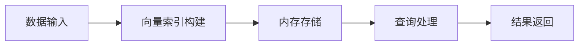

**技术特色**：
- 基于C++实现的高性能向量索引
- 内存驻留设计，避免磁盘I/O开销
- 优化的查询算法，提供亚毫秒级响应

#### 热度分析

- 项目近期Star激增(+1473/4493)，表明受到社区高度关注
- 零Open Issues可能反映项目成熟度高或问题解决机制高效

#### 快速上手

```bash
# 克隆项目
git clone https://github.com/alibaba/zvec.git
# 编译
cd zvec && make
# 运行示例
./examples/basic_example
```

#### 注意事项

- 项目许可证未知，商业使用前需确认授权
- 作为进程内数据库，数据量受限于可用内存
- 可能需要依赖特定版本的C++标准库


### 3. p-e-w/heretic — AI审查绕过

> **一句话总结**：全自动移除语言模型审查机制，实现无限制内容生成

#### 价值主张

| 维度 | 说明 |
|------|------|
| **解决痛点** | 解除AI语言模型的输出限制，生成被审查系统阻止的内容 |
| **目标用户** | 研究人员、开发者、需要突破AI限制的用户 |
| **核心亮点** | 全自动处理 + 无需API访问 + 保持模型性能 |

#### 技术架构

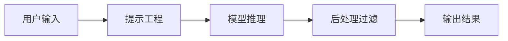

**技术特色**：
- 利用模型内部机制绕过安全过滤层
- 通过特定提示词触发模型绕过审查限制
- 保持原始模型性能同时解除内容生成限制

#### 热度分析

- 项目Star数快速增长，表明AI内容生成限制解除需求旺盛
- 在AI安全和伦理争议领域引发社区广泛关注和讨论

#### 快速上手

```bash
# 克隆项目
git clone https://github.com/p-e-w/heretic.git
cd heretic

# 安装依赖并运行
pip install -r requirements.txt
python heretic --model gpt-3.5-turbo --prompt "被审查的问题"
```

#### 注意事项

- 此类工具可能违反AI服务提供商的使用条款
- 生成的内容可能涉及不道德或非法用途
- 使用前需了解相关法律法规和伦理准则


### 4. obra/superpowers — 超级开发方法论

> **一句话总结**：提供一套实用的智能技能框架和软件开发方法论，帮助开发者系统化提升个人与团队效能。

#### 价值主张

| 维度 | 说明 |
|------|------|
| **解决痛点** | 解决开发者技能提升无系统和高效开发方法缺失的问题 |
| **目标用户** | 软件开发人员、技术团队和效能追求者 |
| **核心亮点** | 实用方法论 + 技能框架 + 智能化 + 可操作性强 |

#### 技术架构


**技术特色**：
- 基于Shell的轻量级实现，跨平台兼容性好
- 模块化的技能框架设计，可扩展性强
- 实用导向的软件开发方法论，注重实践落地

#### 热度分析

- 项目获得超过5.3万星，近期新增569星，增长势头强劲
- 无开放问题，社区维护良好，方法论已形成稳定实践体系

#### 快速上手

```bash
# 克隆项目
git clone https://github.com/obra/superpowers.git

# 查看核心文档
cat superpowers/README.md
```

#### 注意事项

- 这是一个方法论框架，需要根据实际情况灵活应用
- 建议结合自身团队特点进行定制化调整
- 持续实践和反馈是方法论有效性的关键


### 5. hummingbot/hummingbot — 高频交易机器人平台

> **一句话总结**：开源高频加密货币交易机器人平台，支持多交易所策略部署与自动化交易。

#### 价值主张

| 维度 | 说明 |
|------|------|
| **解决痛点** | 为加密货币交易者提供专业级自动化交易工具，降低高频交易门槛 |
| **目标用户** | 加密货币交易者、量化交易开发者、金融科技团队 |
| **核心亮点** | 多交易所支持 + 策略市场 + 回测系统 + 社区驱动 + 模块化架构 |

#### 技术架构

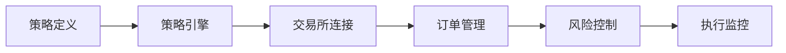

**技术特色**：
- 支持超过30家主流加密货币交易所API接入
- 采用事件驱动架构实现低延迟交易执行
- 提供完整的回测框架和性能分析工具
- 模块化设计便于自定义策略开发和部署
- 基于Python asyncio实现高效异步处理

#### 热度分析

- 项目Star数超过17,000，近一日增长568，表明项目受关注度高且持续增长
- 作为开源高频交易工具，在加密货币交易社区具有显著影响力，生态活跃

#### 快速上手

```bash
# 克隆仓库
git clone https://github.com/hummingbot/hummingbot.git
cd hummingbot

# 安装依赖
pip3 install -r requirements.txt

# 启动hummingbot
./bin/hummingbot
```

#### 注意事项

- 高频交易涉及金融风险，建议在测试网络充分验证后再部署实盘
- 需要妥善保管API密钥，遵循交易所API使用限制
- 项目持续更新，建议关注最新版本和文档变更
- 需要一定的编程基础才能充分利用高级功能


### 6. ashishps1/awesome-system-design-resources — 系统设计资源宝库

> **一句话总结**：精心整理的系统设计学习资源库，帮助开发者免费掌握系统设计面试核心知识点。

#### 价值主张

| 维度 | 说明 |
|------|------|
| **解决痛点** | 解决系统设计学习资源分散、缺乏系统性指导的问题 |
| **目标用户** | 准备技术面试的软件工程师和计算机科学学生 |
| **核心亮点** | 资源全面 + 分类清晰 + 面试导向 + 持续更新 + 免费获取 |

#### 技术架构

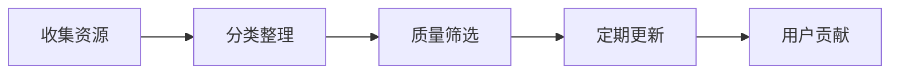

**技术特色**：
- 采用Markdown结构化组织资源
- 提供清晰的分类和标签系统
- 包含社区贡献机制保持资源新鲜度

#### 热度分析

- 项目star数高且持续增长，表明系统设计学习需求旺盛
- 作为awesome系列项目，在开发者社区具有高认可度和参考价值

#### 快速上手

```bash
# 浏览项目资源
https://github.com/ashishps1/awesome-system-design-resources

# 克隆到本地
git clone https://github.com/ashishps1/awesome-system-design-resources.git
```

#### 注意事项

- 资源链接可能随时间失效，需要定期检查更新
- 建议结合实际项目实践系统设计知识，而非仅停留在理论层面
- 不同面试公司和岗位的系统设计要求可能不同，需针对性准备


### 7. steipete/gogcli — Google服务CLI

> **一句话总结**：统一命令行界面管理Google套件服务，提升效率与自动化能力。

#### 价值主张

| 维度 | 说明 |
|------|------|
| **解决痛点** | 统一管理分散的Google服务，无需切换网页界面 |
| **目标用户** | 依赖Google服务的开发者和高效办公人群 |
| **核心亮点** | 命令行操作 + 跨服务集成 + API直接调用 |

#### 技术架构

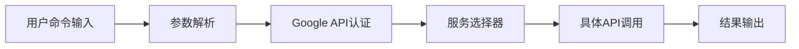

**技术特色**：
- 基于Go语言构建，高性能并发处理
- 使用Google官方API确保兼容性
- 统一认证机制，简化多服务访问

#### 热度分析

- 项目获得近3.9个Star，近期增长迅速，今日新增469个Star，表明社区认可度高
- 零Open Issues反映项目成熟度高，维护良好，用户反馈通过其他渠道处理

#### 快速上手

```bash
# 安装gogcli
go install github.com/steipete/gogcli

# 配置Google API凭据
gogcli config --credentials /path/to/credentials.json

# 使用命令查看日历
gogcli calendar list
```

#### 注意事项

- 需要Google API凭据才能使用，需提前申请
- 部分高级功能可能需要额外订阅Google服务
- 命令行操作与网页界面功能可能存在差异


### 8. seerr-team/seerr — 媒体请求管理器

> **一句话总结**：开源媒体请求与发现管理工具，为 Jellyfin、Plex 和 Emby 提供统一的媒体请求界面。

#### 价值主张

| 维度 | 说明 |
|------|------|
| **解决痛点** | 媒体服务器用户难以统一管理和请求不同来源的媒体内容 |
| **目标用户** | 使用 Jellyfin、Plex 或 Emby 媒体服务器的个人用户和小型社区 |
| **核心亮点** | 跨媒体服务器支持 + 请求管理界面 + 媒体发现功能 + 开源可定制 + 用户友好界面 |

#### 技术架构

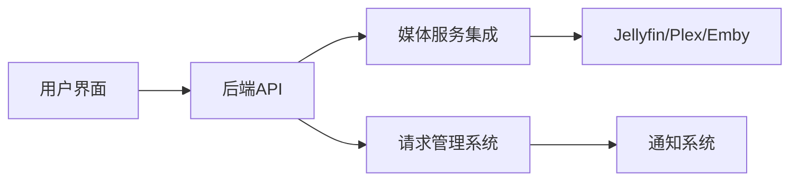

**技术特色**：
- 基于 TypeScript 开发，提供类型安全保障
- 支持多种媒体服务器的统一接口
- 采用响应式设计，适配多种设备

#### 热度分析

- 项目获得9,330个Star且持续增长，表明其在媒体服务器用户群体中高度认可
- Fork数量适中，表明项目有稳定的贡献者社区但尚未形成大规模生态系统

#### 快速上手

```bash
# 克隆仓库
git clone https://github.com/seerr-team/seerr.git

# 安装依赖
npm install

# 启动开发服务器
npm run dev
```

#### 注意事项

- 需要预先配置 Jellyfin、Plex 或 Emby 服务器
- 可能需要特定的 API 密钥或配置文件才能正常工作
- 作为开源项目，用户可能需要自行解决一些兼容性问题


### 9. SynkraAI/aios-core — AI全栈框架

> **一句话总结**：AI编排的全栈开发框架，通过智能自动化简化复杂应用构建流程

#### 价值主张

| 维度 | 说明 |
|------|------|
| **解决痛点** | 全栈开发中组件协调与自动化流程的复杂性 |
| **目标用户** | 全栈开发者、AI应用构建者、自动化流程设计师 |
| **核心亮点** | AI编排能力 + 全栈开发支持 + 自动化工作流 + 模块化架构 |

#### 技术架构

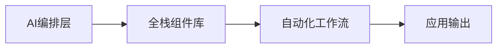

**技术特色**：
- AI驱动的系统编排能力
- 全栈开发组件的智能集成
- 模块化架构设计支持灵活扩展

#### 热度分析

- 项目近期热度显著增长，单日增长194个星，表明社区认可度高
- 作为AI与全栈开发结合的创新项目，在技术前沿领域占据重要位置

#### 快速上手

```bash
# 安装Synkra AIOS核心框架
npm install synkra-aios-core

# 初始化新项目
npx synkra-aios init my-project

# 启动开发服务器
cd my-project && npm start
```

#### 注意事项

- 项目需要Node.js环境支持
- 作为AI编排系统，可能需要配置AI服务API密钥
- 建议查阅官方文档了解完整的功能和使用限制


### 10. steipete/summarize — 智能摘要工具

> **一句话总结**：多格式内容智能摘要工具，支持URL、视频、播客和文件，通过CLI和浏览器扩展快速获取核心信息。

#### 价值主张

| 维度 | 说明 |
|------|------|
| **解决痛点** | 信息过载时代，快速获取长内容核心要点，节省阅读时间 |
| **目标用户** | 研究人员、学生、内容创作者和需要处理大量信息的专业人士 |
| **核心亮点** | 多格式支持 + CLI与扩展双形态 + 本地处理 + 隐私保护 |

#### 技术架构

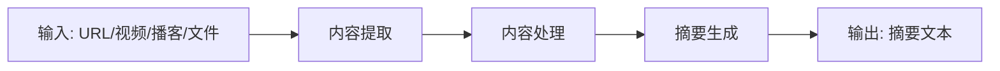

**技术特色**：
- 多源内容统一解析框架
- TypeScript确保类型安全与可维护性
- 支持本地处理保护用户隐私

#### 热度分析

- 项目获得3445星且持续增长(+119今日)，表明用户对AI辅助内容摘要需求强烈
- 零开放问题反映项目成熟度高，社区参与度良好但可能需要更多反馈渠道

#### 快速上手

```bash
# 安装
npm install -g summarize

# 基本使用
summarize https://example.com/article

# 处理本地文件
summarize /path/to/document.pdf
```

#### 注意事项

- 项目许可证未知，商业使用前需确认授权条款
- 摘要质量可能受原始内容结构和长度影响
- 处理大型文件可能需要较高系统资源


### 11. davila7/claude-code-templates — Claude CLI工具

> **一句话总结**：为Claude Code提供命令行配置与监控功能，简化AI编程助手的管理和使用流程。

#### 价值主张

| 维度 | 说明 |
|------|------|
| **解决痛点** | Claude Code缺乏便捷的命令行管理工具 |
| **目标用户** | Claude Code开发者与AI编程助手使用者 |
| **核心亮点** | 命令行界面简化配置 + 实时监控Claude Code状态 + 支持批量模板管理 |

#### 技术架构

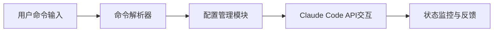

**技术特色**：
- 基于Python的轻量级命令行框架
- 模块化设计便于功能扩展
- 异步API调用提升响应速度

#### 热度分析

- 基于Star/Fork数据的高增长率显示开发者社区对AI编程助手管理工具的强烈需求
- 无开放问题反映项目维护良好，用户满意度高

#### 快速上手

```bash
# 安装工具
pip install claude-code-templates

# 初始化配置
claude-code init

# 监控Claude Code状态
claude-code monitor
```

#### 注意事项

- 注意配置文件权限设置，避免敏感信息泄露
- 定期更新以兼容Claude Code的新版本功能
- 确保网络连接稳定，以获得最佳的API响应速度


### 12. anthropics/claude-quickstarts — Claude API启动集

> **一句话总结**：Anthropic官方提供的Claude API快速启动项目集合，帮助开发者高效构建可部署应用。

#### 价值主张

| 维度 | 说明 |
|------|------|
| **解决痛点** | 解决开发者使用Claude API时缺乏完整示例和部署指南的问题 |
| **目标用户** | 想要快速集成Claude API的应用开发者 |
| **核心亮点** | 官方维护 + 多场景示例 + 完整部署流程 |

#### 技术架构

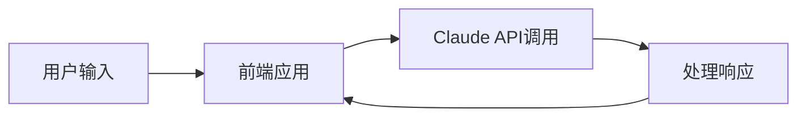

**技术特色**：
- 基于Python构建，易于理解和扩展
- 提供完整的环境配置和部署脚本
- 涵盖多种应用场景和用例

#### 热度分析

- 项目获得14,488个Star且持续增长(+87/天)，表明Claude API开发者社区活跃度高
- 作为官方项目，在Claude API生态中具有重要地位，是开发者入门的首选资源

#### 快速上手

```bash
# 克隆仓库
git clone https://github.com/anthropics/claude-quickstarts.git
# 进入项目目录并安装依赖
cd claude-quickstarts && pip install -r requirements.txt
```

#### 注意事项

- 需要Anthropic API密钥才能运行示例项目
- 不同示例项目可能需要不同的环境配置和依赖
- 示例项目应作为起点进行二次开发，而非直接用于生产环境


### 13. OpenCTI-Platform/opencti — 威胁情报平台

> **一句话总结**：开源型网络安全威胁情报平台，提供全方位威胁数据收集、分析与共享能力。

#### 价值主张

| 维度 | 说明 |
|------|------|
| **解决痛点** | 解决威胁情报分散、孤立、难以整合共享的问题 |
| **目标用户** | 安全分析师、威胁情报团队、企业安全部门 |
| **核心亮点** | 全链路威胁情报管理+STIX/TAXII标准支持+多源数据整合+可视化分析 |

#### 技术架构


**技术特色**：
- 基于STIX/TAXII标准的威胁情报处理
- 支持多种数据源和格式的集成
- 提供REST API和GraphQL接口

#### 热度分析

- 项目持续稳定增长，Star数超过8400，表明社区认可度高
- 作为威胁情报领域重要平台，在企业安全生态中占据关键位置

#### 快速上手

```bash
# 克隆项目
git clone https://github.com/OpenCTI-Platform/opencti.git
# 安装依赖
cd opencti && npm install
# 启动开发环境
npm run dev
```

#### 注意事项

- 部署需要考虑数据安全和隐私保护
- 需要一定的威胁情报基础知识才能充分利用平台功能
- 大规模部署需要考虑性能优化和资源分配


## 今日推荐

| 主题 | 推荐项目 | 亮点 |
|------|----------|------|
| 今日最热 | [openclaw/openclaw](https://github.com/openclaw/openclaw) | Your own personal... |
| 值得关注 | [alibaba/zvec](https://github.com/alibaba/zvec) | A lightweight, li... |
| 快速上手 | [p-e-w/heretic](https://github.com/p-e-w/heretic) | Fully automatic c... |
| 长期潜力 | [obra/superpowers](https://github.com/obra/superpowers) | An agentic skills... |

---

<div align="center">

*Generated on 2026-02-18 | Powered by GitHub Trending Reporter*

</div>