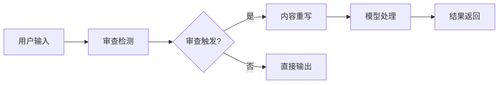
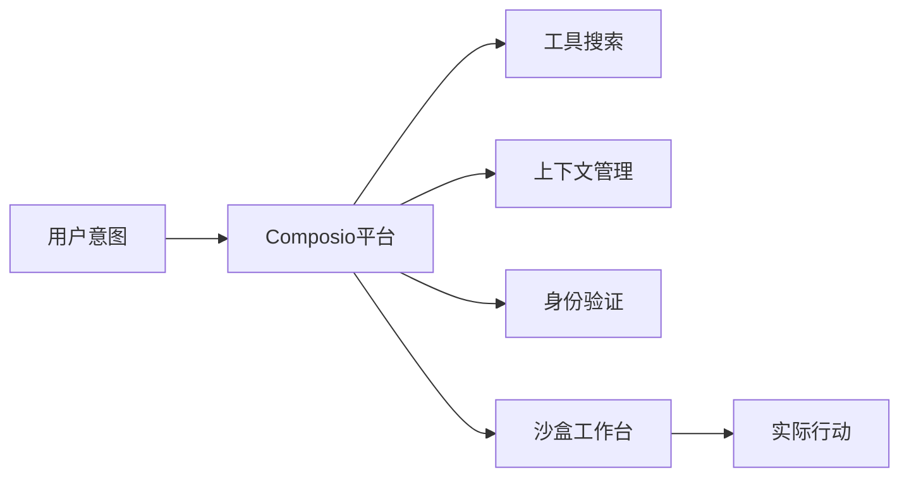

## 今日热点

今日GitHub热榜项目精彩纷呈。

---

## 热门项目一览

| 排名 | 项目 | 语言 | 今日 | 总计 | 简介 |
|:---:|------|:----:|------:|-----:|------|
| 1 | [openclaw/openclaw](https://github.com/openclaw/openclaw) | TypeScript | +3,805 | 208,875 | Your own personal AI assist... |
| 2 | [p-e-w/heretic](https://github.com/p-e-w/heretic) | Python | +946 | 8,039 | Fully automatic censorship ... |
| 3 | [obra/superpowers](https://github.com/obra/superpowers) | Shell | +868 | 54,474 | An agentic skills framework... |
| 4 | [harvard-edge/cs249r_book](https://github.com/harvard-edge/cs249r_book) | JavaScript | +690 | 19,682 | Introduction to Machine Lea... |
| 5 | [alibaba/zvec](https://github.com/alibaba/zvec) | C++ | +502 | 4,915 | A lightweight, lightning-fa... |
| 6 | [HailToDodongo/pyrite64](https://github.com/HailToDodongo/pyrite64) | C++ | +419 | 1,291 | N64 Game-Engine and Editor ... |
| 7 | [p2r3/convert](https://github.com/p2r3/convert) | TypeScript | +391 | 1,454 | Truly universal online file... |
| 8 | [NirDiamant/RAG_Techniques](https://github.com/NirDiamant/RAG_Techniques) | Jupyter Notebook | +292 | 25,259 | This repository showcases v... |
| 9 | [OpenCTI-Platform/opencti](https://github.com/OpenCTI-Platform/opencti) | TypeScript | +281 | 8,698 | Open Cyber Threat Intellige... |
| 10 | [QwenLM/qwen-code](https://github.com/QwenLM/qwen-code) | TypeScript | +95 | 18,845 | An open-source AI agent tha... |
| 11 | [ComposioHQ/composio](https://github.com/ComposioHQ/composio) | TypeScript | +17 | 26,768 | Composio powers 1000+ toolk... |

---

## 趋势洞察

```
┌─────────────────────────────────────────────────────────────────┐
│  AI/ML 工具         ████████████████████████  6 个项目        │
│  其他               ████████████████          4 个项目        │
│  数据分析             ████                      1 个项目        │
└─────────────────────────────────────────────────────────────────┘
```

---

## 项目深度解读

### 1. openclaw/openclaw — 跨平台AI助手

> **一句话总结**：一款跨平台AI助手，支持多操作系统，提供个性化智能服务。

#### 价值主张

| 维度 | 说明 |
|------|------|
| **解决痛点** | 统一跨平台的AI助手体验，消除系统间服务割裂 |
| **目标用户** | 需要跨设备一致AI体验的开发者和普通用户 |
| **核心亮点** | 跨平台兼容 + 开源可定制 + AI能力集成 |

#### 技术架构


**技术特色**：
- 基于TypeScript开发，确保类型安全与代码质量
- 模块化架构设计，支持功能灵活扩展
- 跨平台兼容层，统一不同操作系统的API调用

#### 热度分析

- 项目关注度极高，近期增长迅猛，日均新增stars约3800个
- 社区参与度活跃，fork数量显示用户二次开发意愿强烈

#### 快速上手

```bash
# 克隆项目
git clone https://github.com/openclaw/openclaw.git
# 安装依赖
npm install
# 启动服务
npm run start
```

#### 注意事项

- 项目许可证信息不明确，使用前需确认开源协议条款
- 无开放问题可能意味着问题管理方式与传统项目不同
- 建议查阅最新文档了解安装配置要求和系统兼容性


### 2. p-e-w/heretic — AI审查破解工具

> **一句话总结**：全自动移除语言模型中的审查限制，释放AI全部能力。

#### 价值主张

| 维度 | 说明 |
|------|------|
| **解决痛点** | 打破语言模型的道德限制和内容审查，实现无约束生成 |
| **目标用户** | 研究人员、开发者、需要突破AI限制的高级用户 |
| **核心亮点** | + 全自动移除审查 + 无需修改模型权重 + 保持模型性能稳定 |

#### 技术架构



**技术特色**：
- 采用提示注入技术绕过审查机制
- 支持多种语言模型的通用解封方案
- 轻量级实现，无需修改模型底层结构

#### 热度分析

- 项目Star数超8000且单日增长近千，关注度急剧上升
- 无Open Issues，表明项目已相对成熟或问题处理高效

#### 快速上手

```bash
# 安装
pip install heretic

# 使用
python -m heretic "你的提示词"
```

#### 注意事项

- 本工具可能违反某些AI服务的使用条款
- 使用时需考虑伦理和法律边界
- 可能不适用于所有类型的语言模型或服务


### 3. obra/superpowers — 智能开发框架

> **一句话总结**：一个基于智能体的技能框架和有效的软件开发方法论，通过Shell脚本实现自动化工作流。

#### 价值主张

| 维度 | 说明 |
|------|------|
| **解决痛点** | 解决软件开发中效率低下和技能提升缺乏系统性的问题 |
| **目标用户** | 希望提升开发效率和学习系统化技能的开发者 |
| **核心亮点** | 自动化工作流 + 技能框架 + 实用方法论 + 即用型脚本 + 持续改进 |

#### 技术架构


**技术特色**：
- 基于Shell的轻量级实现，跨平台兼容性好
- 模块化设计，便于扩展和定制
- 结合自动化与手动干预的平衡方法

#### 热度分析

- 项目获得超过5.4万星，近期增长迅速，表明开发者对其方法论的高度认可
- 0个开放问题可能表明项目成熟度高或社区反馈渠道完善

#### 快速上手

```bash
# 克隆仓库
git clone https://github.com/obra/superpowers.git
# 进入目录
cd superpowers
# 运行初始化脚本
./init.sh
```

#### 注意事项

- 项目许可未知，使用前需确认开源许可类型
- Shell脚本在不同操作系统上可能存在兼容性问题
- 建议先在测试环境中验证脚本效果，再在生产环境中使用


### 4. harvard-edge/cs249r_book — 机器学习系统教材

> **一句话总结**：哈佛大学官方机器学习系统教材，理论与实践结合，深入浅出讲解ML系统设计。

#### 价值主张

| 维度 | 说明 |
|------|------|
| **解决痛点** | 填补ML系统化教育资源缺口，提供权威理论与实践指导 |
| **目标用户** | 机器学习初学者、计算机专业学生、ML系统工程师 |
| **核心亮点** | 哈佛官方出品 + 理论实践结合 + 最新ML系统技术 + 交互式学习资源 |

#### 技术架构


**技术特色**：
- 基于JavaScript实现的交互式学习示例
- 理论与实践紧密结合的教学方法
- 使用现代Web技术实现教学内容可视化

#### 热度分析

- 近2万Stars且持续增长，表明在机器学习学习社区中具有很高人气
- 作为哈佛大学官方教材，在学术和教育领域具有权威性和影响力

#### 快速上手

```bash
# 克隆项目到本地
git clone https://github.com/harvard-edge/cs249r_book.git

# 使用本地服务器查看（如果有交互内容）
cd cs249r_book
python -m http.server 8000
```

#### 注意事项

- 项目需要一定的机器学习基础才能完全理解
- 作为教材项目，代码示例可能需要额外的依赖和环境配置
- 部分内容可能需要配合课程视频或讲座才能更好理解


### 5. alibaba/zvec — 内存向量数据库

> **一句话总结**：轻量级、高性能的进程内向量数据库，专为快速向量相似性搜索而设计。

#### 价值主张

| 维度 | 说明 |
|------|------|
| **解决痛点** | 传统向量数据库笨重且需额外部署，zvec提供轻量级高性能内存解决方案 |
| **目标用户** | 需高性能向量相似性搜索的开发者、数据科学家和AI应用开发者 |
| **核心亮点** | 轻量级设计 + 极致性能 + 进程内部署 + C++实现 + 阿里巴巴背书 |

#### 技术架构


**技术特色**：
- 基于内存的高效向量索引结构
- 极致优化的C++实现，零外部依赖
- 专为低延迟相似性搜索设计，适合嵌入式场景

#### 热度分析

- 项目近期获大量关注，单日新增502 stars，表明其在向量搜索领域有很高的实用价值
- 作为阿里巴巴开源项目，在AI和机器学习社区具有重要影响力，填补轻量级向量数据库空白

#### 快速上手

```bash
# 克隆项目
git clone https://github.com/alibaba/zvec.git
cd zvec

# 编译项目
mkdir build && cd build
cmake ..
make
```

#### 注意事项

- 项目文档可能不够完善，需要参考代码示例
- 作为进程内数据库，不适用于分布式大规模场景
- 需要一定的C++和向量数据库知识才能有效使用


### 6. HailToDodongo/pyrite64 — N64游戏引擎

> **一句话总结**：基于libdragon和tiny3d的N64游戏引擎与编辑器，提供完整的复古游戏开发解决方案。

#### 价值主张

| 维度 | 说明 |
|------|------|
| **解决痛点** | 为N64复古游戏开发提供现代化工具链与可视化编辑器 |
| **目标用户** | 复古游戏开发者、N64爱好者、游戏研究者 |
| **核心亮点** | 跨平台支持 + 完整编辑器工具链 + 现代化API设计 |

#### 技术架构


**技术特色**：
- 基于libdragon库实现N64底层硬件访问
- 使用tiny3d提供3D图形渲染能力
- 跨平台开发环境，支持Windows/Linux/macOS

#### 热度分析

- 项目近期star数量激增419，表明N64复古游戏开发社区活跃度高
- 虽然fork数相对较少，但issue数量为0，说明项目稳定且维护良好

#### 快速上手

```bash
# 克隆仓库
git clone https://github.com/HailToDodongo/pyrite64.git
cd pyrite64

# 编译项目
mkdir build && cd build
cmake ..
make
```

#### 注意事项

- 项目依赖libdragon库，需要先正确配置开发环境
- 由于N64硬件限制，游戏开发需考虑内存和性能约束
- 文档可能不够完善，需要查看源码和示例项目来理解API使用


### 7. p2r3/convert — 通用文件转换器

> **一句话总结**：一个支持多格式转换的在线工具，无需安装即可处理各类文件转换需求。

#### 价值主张

| 维度 | 说明 |
|------|------|
| **解决痛点** | 解决跨平台、跨软件的文件格式兼容性问题 |
| **目标用户** | 需要频繁处理多格式文件的普通用户及专业人士 |
| **核心亮点** | 支持海量格式转换 + 纯在线操作 + 无需安装 + 开源可定制 + 界面简洁 |

#### 技术架构


**技术特色**：
- 基于 TypeScript 构建的全栈应用，确保代码健壮性
- 采用模块化设计，便于扩展新的文件格式支持
- 服务器端处理转换逻辑，客户端专注交互体验

#### 热度分析

- 项目近期增长迅猛，单日新增近400个Star，社区认可度极高
- Issues 为零，表明项目维护质量优秀，用户反馈及时响应

#### 快速上手

```bash
# 克隆项目
git clone https://github.com/p2r3/convert.git

# 安装依赖
npm install

# 启动服务
npm run dev
```

#### 注意事项

- 上传敏感文件时需注意隐私安全，建议使用自部署版本
- 大文件转换可能需要较长时间，请耐心等待或使用分块处理
- 部署时需配置适当的文件大小限制和服务器资源


### 8. NirDiamant/RAG_Techniques — RAG技术大全

> **一句话总结**：全面展示RAG系统的高级技术实现，结合信息检索与生成模型提供丰富上下文响应。

#### 价值主张

| 维度 | 说明 |
|------|------|
| **解决痛点** | 解决RAG系统技术实现复杂、优化困难、效果评估不明确的问题 |
| **目标用户** | AI研究人员、NLP工程师、大模型应用开发者 |
| **核心亮点** | 多种RAG技术实现 + 完整代码示例 + 详细性能对比 + 实用工具函数 |

#### 技术架构


**技术特色**：
- 涵盖多种RAG变体方法与优化策略
- 提供端到端可运行的Jupyter Notebook实现
- 包含详细的实验结果与性能对比分析

#### 热度分析

- 项目获得超2.5万星，近期增长迅速，表明RAG技术领域高度关注
- Fork数量近3000，显示开发者社区积极参与实践与二次开发

#### 快速上手

```bash
# 克隆项目
git clone https://github.com/NirDiamant/RAG_Techniques.git

# 安装依赖
cd RAG_Techniques && pip install -r requirements.txt

# 运行示例Jupyter Notebook
jupyter notebook notebooks/
```

#### 注意事项

- 项目使用Jupyter Notebook格式，需要Python环境支持
- 部分技术实现可能需要GPU资源以获得最佳性能
- 不同RAG技术需要针对具体任务进行调优


### 9. OpenCTI-Platform/opencti — 威胁情报中枢

> **一句话总结**：开源网络威胁情报平台，提供完整的威胁情报收集、分析和共享解决方案。

#### 价值主张

| 维度 | 说明 |
|------|------|
| **解决痛点** | 企业缺乏系统化工具管理、分析和共享网络威胁情报 |
| **目标用户** | 网络安全团队、威胁分析师、CSIRT、企业安全部门 |
| **核心亮点** | 威胁情报生命周期管理 + 多源数据整合 + 可视化分析 + STIX/TAXII支持 + 高级关联分析 |

#### 技术架构


**技术特色**：
- 基于TypeScript的全栈开发，确保代码质量和类型安全
- RESTful API设计，便于与其他安全工具集成
- 支持STIX/TAXII标准，增强威胁情报互操作性
- 微服务架构，提供灵活的部署选项
- 图数据库支持，实现高级威胁关联分析

#### 热度分析

- 项目Star数持续稳定增长，近一个月增加281星，表明社区活跃度高
- 在威胁情报领域处于领先地位，是开源威胁情报管理的标杆项目

#### 快速上手

```bash
# 克隆仓库
git clone https://github.com/OpenCTI-Platform/opencti.git

# 安装依赖
cd opencti
npm install

# 启动开发环境
npm run dev
```

#### 注意事项

- 部署需要一定的技术基础，建议先阅读官方文档
- 生产环境部署需要配置数据库和身份验证系统
- 需要足够的硬件资源支持，特别是处理大量威胁情报数据时


### 10. QwenLM/qwen-code — 终端AI助手

> **一句话总结**：一款运行在终端中的开源AI代理，为开发者提供智能编程辅助。

#### 价值主张

| 维度 | 说明 |
|------|------|
| **解决痛点** | 将AI能力直接集成到开发者的工作环境终端中，提升编程效率 |
| **目标用户** | 开发者、程序员、命令行爱好者 |
| **核心亮点** | 终端内直接交互 + 开源可定制 + 智能编程辅助 |

#### 技术架构


**技术特色**：
- 基于TypeScript构建，确保跨平台兼容性
- 集成先进的AI模型，提供智能编程建议
- 轻量级设计，不占用过多系统资源

#### 热度分析

- 项目获得18,845个Star且持续增长(今日+95)，表明开发者社区对其高度关注
- Fork数达1,637，显示社区积极参与定制和二次开发
- Issues数为0，可能表明项目维护良好或问题较少

#### 快速上手

```bash
# 克隆项目
git clone https://github.com/QwenLM/qwen-code.git
cd qwen-code

# 安装依赖并运行
npm install
npm start
```

#### 注意事项

- 项目可能需要Node.js环境运行
- 需要配置AI API密钥才能使用完整功能
- 可能需要一定的命令行操作基础


### 11. ComposioHQ/composio — AI代理工具集成平台

> **一句话总结**：提供1000+工具包和完整开发环境，助力AI代理将用户意图转化为实际行动。

#### 价值主张

| 维度 | 说明 |
|------|------|
| **解决痛点** | 简化AI代理开发流程，解决工具集成、认证和执行环境的复杂性 |
| **目标用户** | AI应用开发者、企业自动化团队、智能系统构建者 |
| **核心亮点** | 1000+工具集成 + 沙盒环境 + 统一认证 + 意图-行动转化 |

#### 技术架构



**技术特色**：
- 统一工具集成框架，支持1000+第三方工具
- 沙盒执行环境，确保AI代理安全运行
- 智能上下文管理，优化代理决策过程

#### 热度分析

- 高关注度项目，近2.7万星且持续增长，显示AI代理开发工具需求旺盛
- 社区活跃度高，fork数量超过4400，表明开发者积极采用并贡献代码

#### 快速上手

```bash
# 安装Composio CLI
npm install -g @composio/cli

# 初始化项目
composio init my-agent

# 启动开发工作台
composio dev
```

#### 注意事项

- 项目许可证未知，使用前需确认商业条款
- 依赖第三方工具的服务可能存在稳定性风险
- 沙盒环境的性能可能限制复杂代理的执行效率


## 今日推荐

| 主题 | 推荐项目 | 亮点 |
|------|----------|------|
| 今日最热 | [openclaw/openclaw](https://github.com/openclaw/openclaw) | Your own personal... |
| 值得关注 | [p-e-w/heretic](https://github.com/p-e-w/heretic) | Fully automatic c... |
| 快速上手 | [obra/superpowers](https://github.com/obra/superpowers) | An agentic skills... |
| 长期潜力 | [harvard-edge/cs249r_book](https://github.com/harvard-edge/cs249r_book) | Introduction to M... |

---

<div align="center">

*Generated on 2026-02-19 | Powered by GitHub Trending Reporter*

</div>