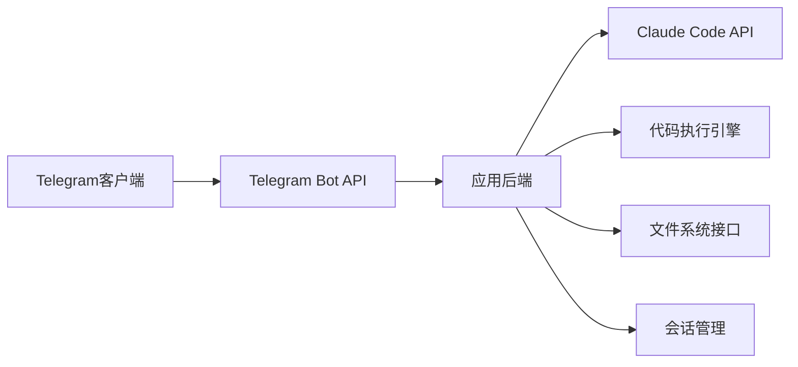
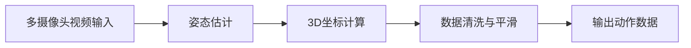
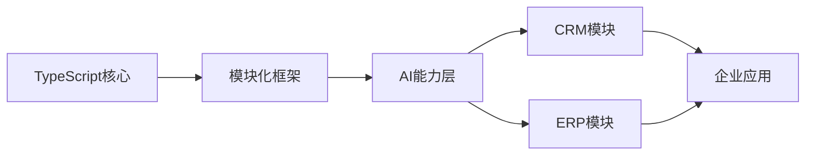

## 今日热点

AI助手与本地化解决方案成为今日焦点，从个人AI助手到企业级AI框架，用户正寻求更自主、隐私友好的AI技术，同时游戏开发工具也呈现显著增长趋势。

---

## 热门项目一览

| 排名 | 项目 | 语言 | 今日 | 总计 | 简介 |
|:---:|------|:----:|------:|-----:|------|
| 1 | [openclaw/openclaw](https://github.com/openclaw/openclaw) | TypeScript | +3,390 | 211,913 | Your own personal AI assist... |
| 2 | [obra/superpowers](https://github.com/obra/superpowers) | Shell | +889 | 55,399 | An agentic skills framework... |
| 3 | [harvard-edge/cs249r_book](https://github.com/harvard-edge/cs249r_book) | JavaScript | +663 | 20,204 | Introduction to Machine Lea... |
| 4 | [p-e-w/heretic](https://github.com/p-e-w/heretic) | Python | +652 | 8,497 | Fully automatic censorship ... |
| 5 | [HailToDodongo/pyrite64](https://github.com/HailToDodongo/pyrite64) | C++ | +608 | 1,755 | N64 Game-Engine and Editor ... |
| 6 | [RichardAtCT/claude-code-telegram](https://github.com/RichardAtCT/claude-code-telegram) | Python | +174 | 965 | A powerful Telegram bot tha... |
| 7 | [freemocap/freemocap](https://github.com/freemocap/freemocap) | Python | +141 | 5,208 | Free Motion Capture for Eve... |
| 8 | [open-mercato/open-mercato](https://github.com/open-mercato/open-mercato) | TypeScript | +56 | 727 | AI‑supportive CRM / ERP fou... |

---

## 趋势洞察

```
┌─────────────────────────────────────────────────────────────────┐
│  AI/ML 工具         ████████████████████████  6 个项目        │
│  其他               ████████                  2 个项目        │
└─────────────────────────────────────────────────────────────────┘
```

---

## 项目深度解读


### 2. obra/superpowers — 开发方法论框架

> **一句话总结**：一个实用的代理技能框架和软件开发方法论，通过系统化流程提升开发者效率与能力。

#### 价值主张

| 维度 | 说明 |
|------|------|
| **解决痛点** | 解决软件开发过程中效率低下和方法论缺失的问题 |
| **目标用户** | 软件开发者、技术团队和项目经理 |
| **核心亮点** | 实用性强+方法论完整+社区活跃+易于实施 |

#### 技术架构


**技术特色**：
- 基于Shell脚本实现，跨平台兼容
- 提供结构化的技能学习路径
- 强调迭代反馈和持续改进

#### 热度分析

- Star数超5.5万且持续增长，表明项目广受欢迎且实用性强
- 社区活跃度高，Fork数适中，反映用户积极参与实践

#### 快速上手

```bash
# 克隆仓库
git clone https://github.com/obra/superpowers.git
cd superpowers
# 查看文档
cat README.md
```

#### 注意事项

- 项目需要一定的Shell脚本基础知识
- 方法论需要长期坚持才能看到明显效果
- 许可证信息不明确，使用前需确认


### 3. harvard-edge/cs249r_book — 机器学习教材

> **一句话总结**：哈佛大学机器学习系统课程教材，理论与实践结合，系统化介绍ML核心概念。

#### 价值主张

| 维度 | 说明 |
|------|------|
| **解决痛点** | 提供系统化机器学习知识体系，弥合理论与工程实践鸿沟 |
| **目标用户** | 计算机科学学生、ML工程师、研究人员及对机器学习系统感兴趣的学习者 |
| **核心亮点** | 学术权威性 + 系统化知识构建 + 实践案例丰富 + 可视化讲解清晰 |

#### 技术架构


**技术特色**：
- 基于JavaScript实现示例，便于学习者直接运行验证
- 内容结构清晰，从基础到前沿循序渐进
- 结合理论与实践，提供完整学习路径

#### 热度分析

- 项目获得超2万Star，日增600+，表明在机器学习教育领域有极高认可度
- 零开放问题，说明内容成熟稳定，社区反馈良好，适合作为系统学习资料

#### 快速上手

```bash
# 克隆项目到本地
git clone https://github.com/harvard-edge/cs249r_book.git

# 启动本地预览服务
cd cs249r_book
npm install && npm start
```

#### 注意事项

- 本项目为教学材料，不包含可直接部署的生产级代码
- 部分章节可能需要前置知识，建议按顺序学习
- JavaScript示例需要浏览器或Node.js环境运行


### 4. p-e-w/heretic — 语言审查绕过

> **一句话总结**：一个自动移除语言模型内容审查的工具，让模型能够回答原本被过滤的问题。

#### 价值主张

| 维度 | 说明 |
|------|------|
| **解决痛点** | 语言模型对某些话题的回答受到不当审查限制 |
| **目标用户** | 研究人员、开发者和需要全面AI能力的用户 |
| **核心亮点** | 自动化绕过审查 + 保持模型功能完整性 + 无需手动干预 |

#### 技术架构

**技术特色**：
- 利用提示注入技术绕过安全机制
- 自动生成绕过特定审查的提示词
- 保持语言模型原有功能不受影响

#### 热度分析

- 项目获得8,497个Star，今日增长652，显示近期关注度快速上升
- 在AI安全和伦理讨论领域具有重要影响力，引发关于AI内容边界的讨论

#### 快速上手

```bash
# 克隆仓库
git clone https://github.com/p-e-w/heretic.git
cd heretic

# 运行示例
python heretic.py "你的问题"
```

#### 注意事项

- 此工具可能被用于绕过合理的内容安全限制
- 使用时需考虑相关法律法规和道德准则
- 可能导致模型输出不准确或有害内容
- 项目许可证未知，使用前需确认授权条款


### 5. HailToDodongo/pyrite64 — N64游戏引擎

> **一句话总结**：基于libdragon和tiny3d的N64游戏开发引擎与编辑器，让开发者能在经典主机上创建现代3D游戏。

#### 价值主张

| 维度 | 说明 |
|------|------|
| **解决痛点** | 为N64游戏开发提供现代化工具链，降低复古游戏开发门槛 |
| **目标用户** | 复古游戏开发者、N64爱好者、独立游戏创作者 |
| **核心亮点** | 完整开发环境 + 3D图形支持 + 跨平台工具链 |

#### 技术架构


**技术特色**：
- 基于开源libdragon工具链，完全免费使用
- 集成tiny3d图形库，支持3D渲染功能
- 提供可视化编辑器，简化资源管理流程

#### 热度分析

- 项目近期获得大量关注，单日增长608 stars，表明复古游戏开发社区对此类工具有强烈需求
- 虽然issues为0，但高star数和积极fork表明社区正通过其他方式参与贡献

#### 快速上手

```bash
# 克隆仓库
git clone https://github.com/HailToDodongo/pyrite64.git
# 进入项目目录
cd pyrite64
# 构建项目
make
```

#### 注意事项

- 项目需要libdragon工具链支持，可能需要额外配置环境
- 仅支持N64平台，无法直接移植到其他平台
- 由于N64硬件限制，开发时需注意性能和内存约束


### 6. RichardAtCT/claude-code-telegram — Claude远程开发助手

> **一句话总结**：通过Telegram机器人集成Claude Code AI，实现开发者随时随地远程管理项目并获得智能辅助。

#### 价值主张

| 维度 | 说明 |
|------|------|
| **解决痛点** | 打破开发环境限制，通过Telegram实现远程代码操作与AI辅助开发 |
| **目标用户** | 需要灵活远程开发能力且追求AI辅助的开发者和DevOps工程师 |
| **核心亮点** | Telegram便捷交互 + Claude AI智能辅助 + 会话持久化 + 远程代码执行 |

#### 技术架构



**技术特色**：
- Telegram Bot API集成实现便捷交互体验
- Claude AI智能辅助提升开发效率和代码质量
- 会话持久化确保远程操作连续性和上下文一致性
- 安全的远程代码执行机制隔离风险
- 跨平台项目文件访问能力支持多样化开发环境

#### 热度分析

- 单日增长174星显示项目热度飙升，可能因Claude AI功能更新或集成突破
- Issues为0表明维护良好，社区反馈积极但使用门槛可能较高

#### 快速上手

```bash
# 安装依赖
pip install -r requirements.txt

# 配置环境变量
export TELEGRAM_BOT_TOKEN="your_token_here"
export CLAUDE_API_KEY="your_api_key"

# 启动服务
python claude_code_telegram.py
```

#### 注意事项

- 需要有效的Telegram Bot Token和Claude API密钥才能正常运行
- 远程代码执行涉及安全风险，建议在隔离环境中使用
- 项目文档可能不够详细，需要一定的Python和API集成背景
- 许可证信息不明确，使用前需确认授权条款和商业限制


### 7. freemocap/freemocap — 开源动捕系统

> **一句话总结**：基于普通摄像头的免费开源全身动作捕捉解决方案，降低动作捕捉技术门槛。

#### 价值主张

| 维度 | 说明 |
|------|------|
| **解决痛点** | 专业动捕设备昂贵，普通用户难以获取高质量动作数据 |
| **目标用户** | 动作捕捉爱好者、研究人员、独立开发者、动画师 |
| **核心亮点** | 基于普通摄像头实现 + 开源免费 + 无需专业设备 + 全身动作捕捉 |

#### 技术架构



**技术特色**：
- 利用MediaPipe等先进姿态估计算法
- 支持多摄像头同步采集提高精度
- 提供完整的3D重建与数据导出流程

#### 热度分析

- 项目Star数超5200且持续增长，显示动捕领域对低成本解决方案的强烈需求
- 作为专业领域的开源项目，在学术研究和创意产业中具有重要影响力

#### 快速上手

```bash
# 克隆项目
git clone https://github.com/freemocap/freemocap.git
cd freemocap
# 安装依赖
pip install -r requirements.txt
# 运行示例
python freemocap/cli.py
```

#### 注意事项

- 需要多个摄像头或至少一个能够捕捉全身的摄像头
- 对光线条件有一定要求，建议在良好光线下使用
- 初次使用可能需要校准摄像头位置以确保数据准确性


### 8. open-mercato/open-mercato — AI企业框架

> **一句话总结**：模块化AI驱动的CRM/ERP基础框架，提供企业级默认配置与完全定制能力。

#### 价值主张

| 维度 | 说明 |
|------|------|
| **解决痛点** | 替代传统Django和Retool，提供AI增强的企业级CRM/ERP解决方案 |
| **目标用户** | 需要高度定制化企业系统的研发团队和运营团队 |
| **核心亮点** | 模块化架构 + AI增强能力 + 企业级质量 + 强大默认配置 + 完全可定制 |

#### 技术架构



**技术特色**：
- 采用TypeScript构建，保证类型安全和代码质量
- 模块化设计支持按需扩展和功能定制
- 内置AI能力层，增强CRM/ERP智能化水平

#### 热度分析

- 项目Star数快速增长(727↑56)，表明技术社区认可度高
- Fork数适中(113)，显示有一定采用但尚未形成大规模生态

#### 快速上手

```bash
# 克隆项目
git clone https://github.com/open-mercato/open-mercato.git

# 安装依赖
npm install

# 启动开发环境
npm run dev
```

#### 注意事项

- 项目许可证未知，商业使用前需确认授权条款
- 作为新兴框架，与成熟解决方案相比可能存在生态不足问题
- 零Open Issues可能表明问题处理高效，但也可能反映社区参与度有限


## 今日推荐

| 主题 | 推荐项目 | 亮点 |
|------|----------|------|
| 今日最热 | [openclaw/openclaw](https://github.com/openclaw/openclaw) | Your own personal... |
| 值得关注 | [obra/superpowers](https://github.com/obra/superpowers) | An agentic skills... |
| 快速上手 | [harvard-edge/cs249r_book](https://github.com/harvard-edge/cs249r_book) | Introduction to M... |
| 长期潜力 | [p-e-w/heretic](https://github.com/p-e-w/heretic) | Fully automatic c... |

---

<div align="center">

*Generated on 2026-02-20 | Powered by GitHub Trending Reporter*

</div>