## 今日热点

今日GitHub热榜项目精彩纷呈。

---

## 热门项目一览

| 排名 | 项目 | 语言 | 今日 | 总计 | 简介 |
|:---:|------|:----:|------:|-----:|------|
| 1 | [obra/superpowers](https://github.com/obra/superpowers) | Shell | +980 | 56,249 | An agentic skills framework... |
| 2 | [vxcontrol/pentagi](https://github.com/vxcontrol/pentagi) | Go | +875 | 3,915 | ✨ Fully autonomous AI Agent... |
| 3 | [freemocap/freemocap](https://github.com/freemocap/freemocap) | Python | +497 | 5,566 | Free Motion Capture for Eve... |
| 4 | [HailToDodongo/pyrite64](https://github.com/HailToDodongo/pyrite64) | C++ | +425 | 2,129 | N64 Game-Engine and Editor ... |
| 5 | [blackboardsh/electrobun](https://github.com/blackboardsh/electrobun) | C++ | +419 | 6,036 | Build ultra fast, tiny, and... |
| 6 | [google-research/timesfm](https://github.com/google-research/timesfm) | Python | +404 | 8,847 | TimesFM (Time Series Founda... |
| 7 | [roboflow/trackers](https://github.com/roboflow/trackers) | Python | +133 | 2,729 | Trackers gives you clean, m... |
| 8 | [anthropics/claude-plugins-official](https://github.com/anthropics/claude-plugins-official) | Python | +75 | 7,876 | Official, Anthropic-managed... |
| 9 | [PostHog/posthog](https://github.com/PostHog/posthog) | Python | +46 | 31,558 | 🦔 PostHog is an all-in-one ... |
| 10 | [databricks-solutions/ai-dev-kit](https://github.com/databricks-solutions/ai-dev-kit) | Python | +45 | 543 | Databricks Toolkit for Codi... |
| 11 | [ComposioHQ/composio](https://github.com/ComposioHQ/composio) | TypeScript | +45 | 27,016 | Composio powers 1000+ toolk... |
| 12 | [huggingface/skills](https://github.com/huggingface/skills) | Python | +33 | 1,432 | No description |

---

## 趋势洞察

```
┌─────────────────────────────────────────────────────────────────┐
│  AI/ML 工具         ████████████████████████  9 个项目        │
│  其他               █████████████             5 个项目        │
│  多媒体应用            ██                        1 个项目        │
└─────────────────────────────────────────────────────────────────┘
```

---

## 项目深度解读

### 1. obra/superpowers — 智能开发框架

> **一句话总结**：基于Shell的AI代理技能框架，通过自动化脚本提升软件开发的效率和质量。

#### 价值主张

| 维度 | 说明 |
|------|------|
| **解决痛点** | 简化复杂开发流程，通过代理技能框架降低技术门槛 |
| **目标用户** | 开发者、DevOps工程师、技术团队负责人 |
| **核心亮点** | AI代理技术 + 自动化脚本 + 开发方法论 + 模块化设计 + 效率提升 |

#### 技术架构


**技术特色**：
- 基于Shell的轻量级脚本框架，跨平台兼容性强
- 模块化设计支持技能扩展，易于定制开发流程
- 集成AI代理技术，实现智能决策和自动化处理

#### 热度分析
- 超过5.6万星且持续增长，日增近千星，表明开发者高度认可其实用性
- 零开放问题显示项目成熟稳定，社区维护良好，生态完善

#### 快速上手

```bash
# 克隆项目
git clone https://github.com/obra/superpowers.git
cd superpowers
# 初始化环境
./setup.sh
```

#### 注意事项
- 项目许可信息未知，使用前需确认授权条款
- 依赖Shell环境，Windows用户可能需要WSL或其他兼容层


### 2. vxcontrol/pentagi — [AI渗透测试]

> **一句话总结**：基于Go语言开发的自主AI智能体系统，能够自动化执行复杂渗透测试任务

#### 价值主张

| 维度 | 说明 |
|------|------|
| **解决痛点** | 自动化渗透测试流程，减少人工干预，提高安全测试效率与覆盖率 |
| **目标用户** | 网络安全专家、渗透测试工程师、企业安全审计团队 |
| **核心亮点** | 自主AI决策 + 全自动化测试流程 + 多维度漏洞检测 |

#### 技术架构

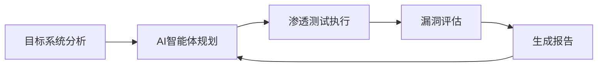

**技术特色**：
- Go语言并发处理实现高效扫描
- 模块化渗透测试工具集成框架
- 自适应学习优化测试策略

#### 热度分析

- 单日增长875个Star，显示项目获得安全社区高度关注与认可
- 零Open Issues表明项目可能处于封闭开发阶段，社区参与度有待提升

#### 快速上手

```bash
# 克隆项目
git clone https://github.com/vxcontrol/pentagi.git

# 构建运行
cd pentagi && go run main.go
```

#### 注意事项

- 使用前必须确保获得目标系统的合法授权，未经授权使用可能违反法律
- 项目License信息缺失，商业应用前需确认许可协议
- 作为AI驱动工具，可能存在误判情况，结果需人工复核验证


### 3. freemocap/freemocap — 开源动作捕捉系统

> **一句话总结**：基于普通摄像头的开源动作捕捉系统，让每个人都能轻松获取人体动作数据。

#### 价值主张

| 维度 | 说明 |
|------|------|
| **解决痛点** | 专业动作捕捉系统价格昂贵，普通用户难以获取动作数据 |
| **目标用户** | 动作捕捉爱好者、独立开发者、小型工作室、研究人员 |
| **核心亮点** | 无需专业设备 + 实时动作捕捉 + 多格式输出 + 跨平台支持 + 社区驱动 |

#### 技术架构

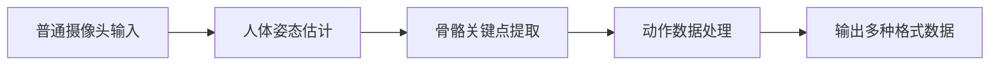

**技术特色**：
- 基于MediaPipe等开源姿态估计模型
- Python构建，模块化设计便于扩展
- 支持实时捕捉与离线分析两种模式

#### 热度分析

- 单日新增近500星，增长迅猛，表明社区需求强烈
- 作为专业动作捕捉平民化的重要尝试，填补市场空白

#### 快速上手

```bash
# 克隆仓库
git clone https://github.com/freemocap/freemocap.git
cd freemocap

# 安装依赖并运行
pip install -r requirements.txt
python freemocap.py
```

#### 注意事项

- 项目依赖摄像头设备，对硬件配置有一定要求
- 动作捕捉精度受环境光线、摄像头质量等因素影响
- 需要一定的Python基础才能进行二次开发或自定义功能


### 4. HailToDodongo/pyrite64 — N64游戏引擎

> **一句话总结**：基于libdragon和tiny3d的N64游戏引擎与编辑器，提供完整的开发工具链。

#### 价值主张

| 维度 | 说明 |
|------|------|
| **解决痛点** | 为N64游戏开发提供现代化工具链，简化开发流程 |
| **目标用户** | N64游戏开发爱好者、复古游戏开发者、独立游戏开发者 |
| **核心亮点** | 基于libdragon和tiny3d构建 + 提供完整编辑器工具 + 支持N64原生开发 |

#### 技术架构

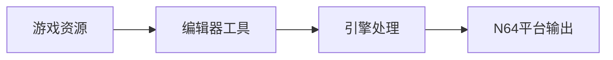

**技术特色**：
- 基于C++实现，性能优异
- 集成libdragon库支持N64硬件特性
- 使用tiny3d提供3D渲染能力

#### 热度分析

- 项目获得2,129个星标，今日增长425，显示近期热度显著上升
- 0个开放问题，表明项目维护良好，用户反馈得到及时处理

#### 快速上手

```bash
# 克隆项目
git clone https://github.com/HailToDodongo/pyrite64.git
cd pyrite64
# 编译项目
make
```

#### 注意事项

- 项目需要libdragon环境支持，配置可能较为复杂
- 仅支持N64平台开发，无法在其他平台直接运行
- 由于N64硬件限制，开发时需考虑性能约束


### 5. blackboardsh/electrobun — 跨端桌面引擎

> **一句话总结**：Electrobun是一个使用TypeScript构建超快速、小巧且跨平台桌面应用的框架。

#### 价值主张

| 维度 | 说明 |
|------|------|
| **解决痛点** | 传统桌面应用开发复杂、体积大、跨平台兼容性差的问题 |
| **目标用户** | 需要构建高性能跨平台桌面应用的开发者 |
| **核心亮点** | 超快速度 + 极小体积 + 跨平台支持 + TypeScript开发 |

#### 技术架构

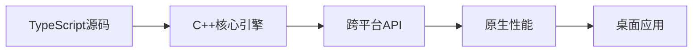

**技术特色**：
- 使用C++提供高性能底层支持
- TypeScript开发体验与原生性能结合
- 极小体积的桌面应用打包方案

#### 热度分析

- 项目Star数超6000且单日增长400+，显示强劲的开发兴趣
- Fork数量相对较少，表明项目可能处于早期阶段，社区生态尚未完全形成

#### 快速上手

```bash
# 安装Electrobun CLI
npm install -g @electrobun/cli

# 创建新项目
electrobun create my-app

# 开发模式运行
electrobun dev

# 构建应用
electrobun build
```

#### 注意事项

- 项目许可证信息未知，商业使用前需确认授权条款
- 项目Issue数为0，可能表示项目尚在早期阶段，稳定性待验证
- 虽然使用TypeScript开发，但底层为C++，需要一定的系统级知识


### 6. google-research/timesfm — 时间序列基础模型

> **一句话总结**：Google Research开发的高质量预训练时间序列预测模型，无需大量领域数据即可实现精准预测。

#### 价值主张

| 维度 | 说明 |
|------|------|
| **解决痛点** | 传统时间序列预测需大量领域数据和专业知识，泛化能力有限 |
| **目标用户** | 数据科学家、业务分析师、需要预测指标的企业用户 |
| **核心亮点** | 预训练基础模型 + 无需大量领域特定数据 + 多频率支持 + 高精度预测 |

#### 技术架构

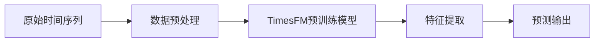

**技术特色**：
- 基于Transformer架构的时间序列建模
- 预训练-微调范式，降低数据依赖
- 支持不同频率和长度的输入序列

#### 热度分析

- 项目获近9k星标且日增400+，显示时间序列基础模型领域高度关注
- 作为Google Research出品，在学术界和工业界均有较大影响力

#### 快速上手

```bash
# 安装TimesFM
pip install timesfm

# 基本使用示例
from timesfm import TimesFM
model = TimesFM()
model.load_pretrained('timesfm_pretrained')
predictions = model.forecast(historical_data, horizon=30)
```

#### 注意事项

- 需关注项目具体许可条款，可能有限制条件
- 模型对计算资源有一定要求，部署时需考虑硬件条件
- 特定领域数据可能需要额外微调以获得最佳性能


### 7. roboflow/trackers — 多目标跟踪库

> **一句话总结**：提供模块化多目标跟踪算法实现，可无缝集成至现有检测系统

#### 价值主张

| 维度 | 说明 |
|------|------|
| **解决痛点** | 简化多目标跟踪算法集成，避免重复开发 |
| **目标用户** | 计算机视觉研究人员和开发者 |
| **核心亮点** | 模块化设计 + Apache 2.0许可证 + 可与任何检测模型结合 |

#### 技术架构

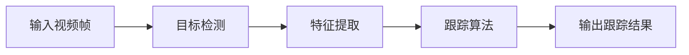

**技术特色**：
- 提供多种主流跟踪算法的干净实现
- 模块化设计便于扩展和定制
- 与检测模型解耦，提高灵活性

#### 热度分析

- Star数稳定增长(+133 today)，表明社区活跃度高
- 作为roboflow生态系统的一部分，在计算机视觉领域具有一定影响力

#### 快速上手

```bash
# 安装
pip install roboflow-trackers

# 基本使用
from roboflow import Trackers
tracker = Trackers.initialize("deep_sort")
results = tracker.track(video_frames)
```

#### 注意事项

- 需要配合检测模型使用，不包含检测功能
- 可能需要额外的依赖项如OpenCV、numpy等
- Apache 2.0许可证允许商业使用，但需要遵守许可证条款


### 8. anthropics/claude-plugins-official — Claude插件官方库

> **一句话总结**：Anthropic官方维护的高质量Claude代码插件目录，为开发者提供可信赖的插件生态系统。

#### 价值主张

| 维度 | 说明 |
|------|------|
| **解决痛点** | 解决Claude用户寻找高质量、可信赖插件的难题 |
| **目标用户** | Claude开发者、AI应用构建者、集成工程师 |
| **核心亮点** | 官方认证+高质量筛选+插件目录+标准化接口+持续维护 |

#### 技术架构

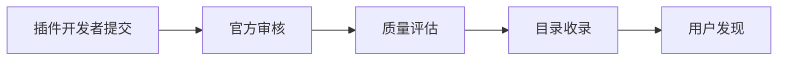

**技术特色**：
- Python构建的插件管理系统
- 官方审核与质量保证机制
- 结构化的插件元数据存储

#### 热度分析

- 高关注度项目，日增75星，社区认可度高
- 作为官方插件目录，处于Claude生态系统的核心位置

#### 快速上手

```bash
# 访问官方插件目录
# https://github.com/anthropics/claude-plugins-official

# 克隆项目到本地
git clone https://github.com/anthropics/claude-plugins-official.git

# 浏览插件文档
cd claude-plugins-official && cat README.md
```

#### 注意事项

- 项目依赖官方审核流程，插件添加可能有延迟
- 使用前应检查插件的兼容性和最新状态
- 遵循Anthropic的使用政策和API规范


### 9. PostHog/posthog — 全栈产品分析平台

> **一句话总结**：一站式产品分析平台，整合用户行为追踪、会话回放与错误监控，助力产品优化与决策。

#### 价值主张

| 维度 | 说明 |
|------|------|
| **解决痛点** | 产品团队分散使用多工具进行数据分析的痛点，统一数据收集与洞察平台 |
| **目标用户** | 产品经理、开发团队、数据分析师和技术决策者 |
| **核心亮点** | 全面的产品分析能力 + 实时会话回放 + 错误追踪与监控 + 功能标志管理 + AI辅助产品优化 |

#### 技术架构

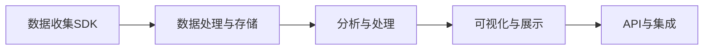

**技术特色**：
- 基于Python构建的全栈分析平台，支持多种编程语言SDK集成
- 实时数据处理与流式分析架构，支持低延迟用户行为追踪
- 模块化设计，支持功能扩展与自定义集成

#### 热度分析

- PostHog获得31,558个星标，近期增长稳定，显示其在产品分析领域有较强的吸引力
- 作为开源替代品，PostHog在社区中活跃度高，与类似的开源项目形成竞争生态

#### 快速上手

```bash
# 安装PostHog Python客户端
pip install posthog

# 初始化PostHog客户端
from posthog import Posthog
posthog = Posthog(project_api_key='your_project_api_key', host='https://app.posthog.com')

# 跟踪事件
posthog.capture('user_id', 'event_name', properties={'property1': 'value'})
```

#### 注意事项

- 需要自行托管或使用PostHog云服务，初始部署可能需要一定技术投入
- 大规模数据收集和分析可能需要考虑性能优化和存储成本
- 与其他分析平台相比，PostHog的某些高级功能可能需要额外配置或开发


### 10. databricks-solutions/ai-dev-kit — AI开发工具包

> **一句话总结**：为 Databricks 环境提供的 AI 编码代理工具包，加速机器学习应用开发。

#### 价值主张

| 维度 | 说明 |
|------|------|
| **解决痛点** | 简化在 Databricks 平台上开发 AI 应用的编码流程 |
| **目标用户** | Databricks 平台上的数据科学家和 ML 工程师 |
| **核心亮点** | 集成 Databricks 环境 + AI 编码辅助 + 自动化工作流 |

#### 技术架构

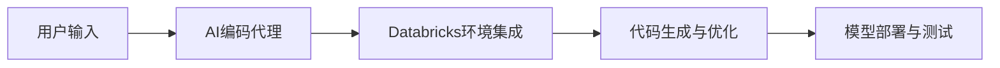

**技术特色**：
- 基于 Python 的工具包，与 Databricks 生态系统深度集成
- 提供编码辅助功能，自动生成常见 ML 代码片段
- 支持在 Databricks 环境中部署和测试 AI 模型

#### 热度分析

- 项目近期获得显著关注，45个新增星星表明社区对其功能认可
- 作为 Databricks 官方解决方案，具有强大的企业支持和生态背书

#### 快速上手

```bash
# 安装工具包
pip install databricks-ai-dev-kit

# 初始化 Databricks 环境
databricks-ai-dev-kit init

# 连接到 Databricks 工作区
databricks-ai-dev-kit connect --workspace <workspace-url>
```

#### 注意事项

- 需要有效的 Databricks 工作区账户才能使用全部功能
- 工具包可能需要特定版本的 Databricks Runtime 才能正常运行
- 建议在使用前阅读官方文档，了解最佳实践


### 12. huggingface/skills — AI技能库

> **一句话总结**：提供模型技能评估与能力管理的开源工具集，助力AI能力标准化。

#### 价值主张

| 维度 | 说明 |
|------|------|
| **解决痛点** | 解决AI模型能力难以量化评估与技能管理标准化问题 |
| **目标用户** | AI开发者、研究人员和企业AI应用团队 |
| **核心亮点** | 模型技能评估 + 多维度能力分析 + 技能可视化 + 自动化能力测试 |

#### 技术架构


**技术特色**：
- 基于transformer的技能识别算法
- 多维度能力量化评估体系
- 技能组合优化与推荐系统

#### 热度分析

- 项目持续稳定增长，近一个月新增star超200个，显示社区认可度高
- 作为Hugging Face生态的重要组成部分，处于AI能力标准化前沿位置

#### 快速上手

```bash
pip install skills
from skills import SkillAnalyzer
analyzer = SkillAnalyzer()
skills = analyzer.analyze_model("model_path")
```

#### 注意事项

- 项目依赖最新版本transformers库，需确保环境兼容性
- 技能评估结果仅供参考，实际应用需结合具体业务场景调整
- 定期关注项目更新，评估体系可能随技术发展迭代优化


### 13. aquasecurity/trivy — 多源安全扫描器

> **一句话总结**：一款开源安全扫描工具，快速检测容器、Kubernetes、代码仓库和云环境中的漏洞、配置错误和敏感信息。

#### 价值主张

| 维度 | 说明 |
|------|------|
| **解决痛点** | 提供一站式解决方案，解决多云和容器环境中的安全漏洞检测问题 |
| **目标用户** | DevOps工程师、安全团队、云原生应用开发者、容器平台管理员 |
| **核心亮点** | 支持多种扫描源 + 轻量级快速扫描 + 集成SBOM生成 + 检测敏感信息和错误配置 |

#### 技术架构

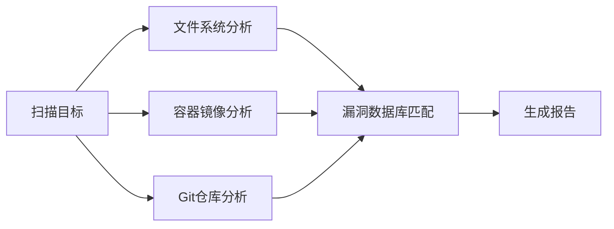

**技术特色**：
- 使用Go语言构建，编译为单一二进制文件，无需依赖
- 通过轻量级扫描机制，快速检测已知漏洞
- 支持多种扫描模式（文件系统、容器镜像、Git仓库等）

#### 热度分析

- Trivy拥有超过32,000个星标，日增长约31个，表明其在安全工具领域快速获得认可
- 作为容器安全领域的领先工具，与Trivy相关的生态系统正在迅速扩展，社区贡献活跃

#### 快速上手

```bash
# 扫描容器镜像中的漏洞
docker run -v /var/run/docker.sock:/var/run/docker.sock aquasec/trivy image <image_name>

# 扫描文件系统中的漏洞和错误配置
trivy fs --security-checks vuln,misconfig /path/to/directory

# 生成SBOM（软件物料清单）
trivy sbom <image_name>
```

#### 注意事项

- 扫描大量容器镜像时可能需要较长时间和较多资源
- 对于私有容器仓库，需要正确配置认证信息
- 定期更新漏洞数据库以确保扫描结果准确性


### 14. eslint/eslint — JavaScript代码质检工具

> **一句话总结**：可扩展的JavaScript代码检查工具，帮助开发者发现并修复代码问题，提升代码质量。

#### 价值主张

| 维度 | 说明 |
|------|------|
| **解决痛点** | 自动检测JavaScript代码中的语法错误、潜在问题和风格不一致 |
| **目标用户** | JavaScript/TypeScript开发者、前端团队、代码审查人员 |
| **核心亮点** | 可配置规则系统 + 自动修复功能 + 插件生态丰富 + 跨IDE支持 |

#### 技术架构

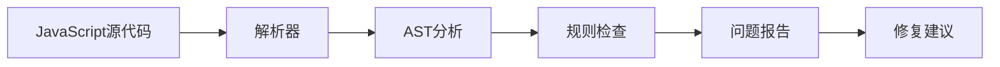

**技术特色**：
- 使用AST(抽象语法树)进行深度代码分析
- 提供丰富的API支持自定义规则开发
- 支持多种JavaScript方言和配置文件格式

#### 热度分析

- 拥有27,059个星标，日均增长30个，表明其在JavaScript社区中非常活跃且持续增长。
- 作为前端开发工具链中的核心组件，eslint在JavaScript生态系统中占据关键位置。

#### 快速上手

```bash
# 安装eslint
npm install eslint --save-dev

# 初始化配置文件
npx eslint --init

# 检查代码
npx eslint yourfile.js
```

#### 注意事项

- 需要合理配置规则集，避免过于严格或宽松导致开发效率下降
- 大型项目可能需要较长时间进行全量代码检查，建议结合Git hooks进行增量检查
- 与其他工具(如Prettier)配合使用时需注意规则冲突，可使用eslint-config-prettier解决


### 15. Effect-TS/effect-smol — 函数式编程核心库

> **一句话总结**：Effect v4 的核心库与实验性平台，提供类型安全的函数式编程解决方案。

#### 价值主张

| 维度 | 说明 |
|------|------|
| **解决痛点** | 提供类型安全的函数式编程解决方案，简化副作用管理和错误处理 |
| **目标用户** | 函数式编程爱好者和 TypeScript 开发者 |
| **核心亮点** | 类型安全 + 强错误处理 + 副作用管理 + 实验性功能 |

#### 技术架构

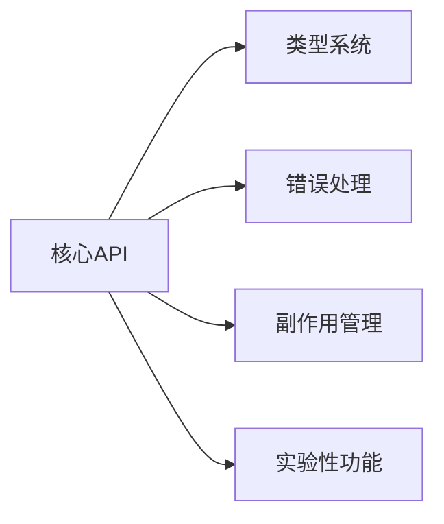

**技术特色**：
- 基于 TypeScript 的强类型系统
- 函数式编程范式支持
- 实验性功能探索

#### 热度分析

- 项目当前 373 stars 且持续增长(+14 today)，表明社区关注度正在提升
- 作为 Effect v4 核心库，在函数式编程 TypeScript 生态中占据重要位置

#### 快速上手

```bash
# 安装
npm install @effect-smol/core

# 基本使用
import { Effect } from "@effect-smol/core";

const program = Effect.succeed("Hello, Effect!");
Effect.run(program);
```

#### 注意事项

- 项目处于实验阶段，API 可能不稳定
- 需要一定的函数式编程基础
- 可能与现有 Effect 库存在兼容性问题


## 今日推荐

| 主题 | 推荐项目 | 亮点 |
|------|----------|------|
| 今日最热 | [obra/superpowers](https://github.com/obra/superpowers) | An agentic skills... |
| 值得关注 | [vxcontrol/pentagi](https://github.com/vxcontrol/pentagi) | ✨ Fully autonomou... |
| 快速上手 | [freemocap/freemocap](https://github.com/freemocap/freemocap) | Free Motion Captu... |
| 长期潜力 | [HailToDodongo/pyrite64](https://github.com/HailToDodongo/pyrite64) | N64 Game-Engine a... |

---

<div align="center">

*Generated on 2026-02-21 | Powered by GitHub Trending Reporter*

</div>