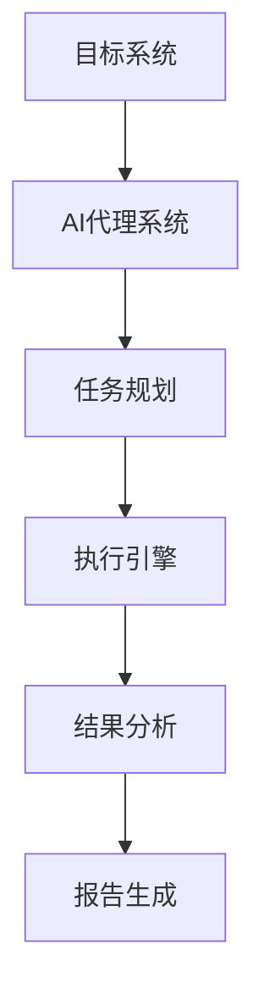
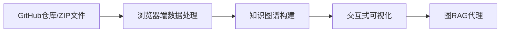

## 今日热点

AI代理与辅助开发工具今日占据主导地位，从渗透测试到代码智能，AI正

---

## 热门项目一览

| 排名 | 项目 | 语言 | 今日 | 总计 | 简介 |
|:---:|------|:----:|------:|-----:|------|
| 1 | [vxcontrol/pentagi](https://github.com/vxcontrol/pentagi) | Go | +2,118 | 5,580 | ✨ Fully autonomous AI Agent... |
| 2 | [obra/superpowers](https://github.com/obra/superpowers) | Shell | +772 | 57,010 | An agentic skills framework... |
| 3 | [HandsOnLLM/Hands-On-Large-Language-Models](https://github.com/HandsOnLLM/Hands-On-Large-Language-Models) | Jupyter Notebook | +355 | 22,562 | Official code repo for the ... |
| 4 | [Stremio/stremio-web](https://github.com/Stremio/stremio-web) | JavaScript | +301 | 9,457 | Stremio - Freedom to Stream |
| 5 | [huggingface/skills](https://github.com/huggingface/skills) | Python | +247 | 1,683 | No description |
| 6 | [anthropics/claude-code](https://github.com/anthropics/claude-code) | Shell | +222 | 68,419 | Claude Code is an agentic c... |
| 7 | [abhigyanpatwari/GitNexus](https://github.com/abhigyanpatwari/GitNexus) | TypeScript | +132 | 1,044 | GitNexus: The Zero-Server C... |
| 8 | [hiddify/hiddify-app](https://github.com/hiddify/hiddify-app) | Dart | +132 | 26,407 | Multi-platform auto-proxy c... |
| 9 | [RichardAtCT/claude-code-telegram](https://github.com/RichardAtCT/claude-code-telegram) | Python | +109 | 1,388 | A powerful Telegram bot tha... |
| 10 | [stan-smith/FossFLOW](https://github.com/stan-smith/FossFLOW) | TypeScript | +74 | 17,784 | Make beautiful isometric in... |
| 11 | [cloudflare/agents](https://github.com/cloudflare/agents) | TypeScript | +65 | 3,435 | Build and deploy AI Agents ... |
| 12 | [ggml-org/ggml](https://github.com/ggml-org/ggml) | C++ | +47 | 14,064 | Tensor library for machine ... |

---

## 趋势洞察

```
┌─────────────────────────────────────────────────────────────────┐
│  AI/ML 工具         ████████████████████████  8 个项目        │
│  开发工具             ██████                    2 个项目        │
│  其他               ██████                    2 个项目        │
│  多媒体应用            ███                       1 个项目        │
└─────────────────────────────────────────────────────────────────┘
```

---

## 项目深度解读

### 1. vxcontrol/pentagi — AI渗透测试框架

> **一句话总结**：全自主AI代理系统，自动化执行复杂渗透测试任务，大幅提升安全评估效率。

#### 价值主张

| 维度 | 说明 |
|------|------|
| **解决痛点** | 传统渗透测试依赖专业人员，耗时耗力且成本高，难以应对快速变化的威胁环境 |
| **目标用户** | 网络安全团队、渗透测试工程师、安全研究人员和DevOps团队 |
| **核心亮点** | 全自动化渗透测试流程 + AI代理自主决策 + 减少人工干预 + 适应复杂网络环境 |

#### 技术架构



**技术特色**：
- 基于Go语言构建的高性能系统
- AI驱动的自主决策机制
- 模块化设计支持扩展性

#### 热度分析

- 项目在短时间内获得大量关注（今日增长超过2000星），表明AI自动化安全工具领域需求旺盛
- 作为安全领域的AI应用创新，填补了传统渗透测试工具与新兴AI技术的空白

#### 快速上手

```bash
# 克隆项目
git clone https://github.com/vxcontrol/pentagi.git
cd pentagi

# 安装依赖并运行
go mod tidy
go run main.go --target <target_ip>
```

#### 注意事项

- 使用前需确保获得合法授权，避免非法入侵
- 该工具可能存在安全风险，建议在隔离环境中测试
- 项目开源状态和许可协议不明确，使用前需确认
- AI代理可能产生不可预测的行为，需谨慎监控测试过程


### 2. obra/superpowers — 智能开发框架

> **一句话总结**：提供智能体技能框架与实用软件开发方法论，提升开发效率与质量

#### 价值主张

| 维度 | 说明 |
|------|------|
| **解决痛点** | 传统软件开发方法效率低下，缺乏结构化智能体技能指导 |
| **目标用户** | 软件开发人员、技术团队、AI系统构建者 |
| **核心亮点** | 实用方法论 + 智能体技能框架 + 结构化开发流程 + 高效工具链 + 可验证成果 |

#### 技术架构


**技术特色**：
- 基于Shell脚本实现，跨平台兼容性强
- 模块化设计，支持灵活扩展与定制
- 提供完整开发生命周期指导与工具支持

#### 热度分析

- 项目Star数突破5.7万，近期增长迅猛，表明社区高度认可其实用价值
- Fork数与Star比健康，显示用户不仅关注而且积极参与实践与贡献

#### 快速上手

```bash
# 克隆项目
git clone https://github.com/obra/superpowers.git
# 进入目录并查看文档
cd superpowers && cat README.md
# 运行框架初始化
./superpowers init
```

#### 注意事项

- 项目License未明确，商业使用前需确认授权条款
- 需要一定Shell脚本基础才能充分利用框架功能
- 建议先阅读项目文档以理解方法论核心理念


### 3. HandsOnLLM/Hands-On-Large-Language-Models — 大语言模型实践教程

> **一句话总结**：提供大语言模型实践的动手教程，通过Jupyter Notebook形式帮助读者深入理解LLM工作原理与应用方法。

#### 价值主张

| 维度 | 说明 |
|------|------|
| **解决痛点** | 大语言模型理论难以实践，缺乏系统性的动手学习资源 |
| **目标用户** | 想要学习大语言模型实践方法的研究人员、开发者和技术爱好者 |
| **核心亮点** | + 基于O'Reilly权威书籍 + Jupyter Notebook形式便于实践 + 涵盖LLM核心概念与应用 |

#### 技术架构


**技术特色**：
- 基于Jupyter Notebook的交互式学习环境
- 涵盖从基础到高级的LLM全栈技术
- 提供可直接运行的代码示例和实践案例

#### 热度分析

- 项目获得22,562个Star，355个今日新增，表明LLM学习需求旺盛，项目受关注度高
- 5,246次Fork显示社区积极参与，表明项目在LLM学习领域具有重要参考价值

#### 快速上手

```bash
# 克隆仓库
git clone https://github.com/HandsOnLLM/Hands-On-Large-Language-Models.git

# 安装依赖并启动Jupyter
cd Hands-On-Large-Language-Models
pip install -r requirements.txt
jupyter notebook
```

#### 注意事项

- 项目可能需要较高的计算资源，特别是运行某些LLM相关实验
- 部分notebook可能需要特定的GPU环境才能正常运行
- 建议按照书籍章节顺序学习，以确保知识的连贯性


### 4. Stremio/stremio-web — 流媒体聚合平台

> **一句话总结**：Stremio 是一个开源跨平台流媒体聚合器，整合多源内容提供统一观影体验。

#### 价值主张

| 维度 | 说明 |
|------|------|
| **解决痛点** | 解决流媒体内容分散，需频繁切换多个平台的痛点 |
| **目标用户** | 追求便捷观影体验的流媒体消费者 |
| **核心亮点** | + 跨平台支持 + 插件生态系统 + 内容聚合管理 + 个人化推荐 |

#### 技术架构


**技术特色**：
- 基于 React 的现代化前端架构
- 模块化插件系统支持扩展功能
- 响应式设计支持多设备访问

#### 热度分析

- 项目获近万星且持续增长，表明流媒体聚合需求旺盛
- 社区活跃度高，无开放问题，显示项目维护状况良好

#### 快速上手

```bash
git clone https://github.com/Stremio/stremio-web.git
cd stremio-web
npm install && npm start
```

#### 注意事项

- 项目依赖许可证信息不明确，商业使用前需确认授权
- 插件系统可能涉及第三方版权内容，使用时需注意合规性


### 5. huggingface/skills — AI技能库

> **一句话总结**：为AI模型提供专业能力模块，实现任务特定技能的快速集成与部署。

#### 价值主张

| 维度 | 说明 |
|------|------|
| **解决痛点** | 简化AI专业能力集成，解决模型与任务适配难题 |
| **目标用户** | AI开发者、研究人员和企业应用工程师 |
| **核心亮点** | 模块化设计 + 预训练技能 + 即插即用API + 跨领域扩展 |

#### 技术架构


**技术特色**：
- 基于Transformers的轻量级技能适配层
- 统一的技能注册与发现机制
- 支持增量学习与动态技能组合

#### 热度分析

- 近期热度显著上升，单日增长247星，表明社区高度关注
- 作为Hugging Face生态的重要补充，连接基础模型与行业应用

#### 快速上手

```bash
# 安装skills库
pip install huggingface-skills

# 加载预训练技能
from skills import load_skill
skill = load_skill("text-classification")

# 应用技能到模型
result = skill(model, input_text)
```

#### 注意事项

- 需要配合Hugging Face Transformers库使用
- 某些高级功能可能需要API密钥或付费订阅
- 技能库仍在快速发展中，API可能会有变化


### 6. anthropics/claude-code — 终端AI编程助手

> **一句话总结**：Claude Code是终端内的AI编程助手，能理解代码库并通过自然语言命令提升开发效率。

#### 价值主张

| 维度 | 说明 |
|------|------|
| **解决痛点** | 减少重复编码任务，提高开发效率，降低理解复杂代码的门槛 |
| **目标用户** | 开发者、程序员、代码审查人员 |
| **核心亮点** | 自然语言交互 + 代码库理解 + 终端集成 + Git工作流自动化 + 任务执行 |

#### 技术架构


**技术特色**：
- 基于Claude AI模型的自然语言理解能力
- 集成于终端的轻量级架构设计
- 支持代码库上下文理解与记忆

#### 热度分析

- 项目获得超过6.8万星，日增222星，表明开发者社区对其高度认可
- 作为Anthropic官方推出的工具，在AI辅助编程领域具有先发优势和技术权威性

#### 快速上手

```bash
# 安装Claude Code
curl -fsSL https://claude.ai/install.sh | sh

# 启动交互
claude-code

# 示例命令
"解释这个函数的作用" 或 "帮我重构这段代码"
```

#### 注意事项

- 需要有效的Anthropic API密钥才能使用
- 代码分析质量依赖于Claude模型的能力，可能存在理解偏差
- 对于大型代码库，首次分析可能需要较长时间
- 项目许可证未知，存在潜在法律风险


### 7. abhigyanpatwari/GitNexus — 零服务器代码智能

> **一句话总结**：完全在浏览器中运行的代码知识图谱工具，无需服务器即可实现代码智能分析与探索。

#### 价值主张

| 维度 | 说明 |
|------|------|
| **解决痛点** | 解决代码探索缺乏直观交互式工具的痛点，无需服务器部署 |
| **目标用户** | 需要深入理解代码库结构的开发者和研究人员 |
| **核心亮点** | 零服务器部署 + 交互式知识图谱 + 内置图RAG代理 |

#### 技术架构



**技术特色**：
- 完全客户端运行，保护数据隐私
- 知识图谱技术应用于代码结构分析
- 图RAG代理实现智能代码问答

#### 热度分析

- 项目获1044个Star且单日新增132个，表明近期热度快速上升
- 作为客户端代码分析工具，填补了无需服务器部署的代码智能分析市场空白

#### 快速上手

```bash
# 访问GitNexus网页
# 导入GitHub仓库或ZIP文件
# 开始探索交互式知识图谱
```

#### 注意事项

- 作为完全客户端工具，可能对浏览器性能有一定要求，特别是处理大型代码库时
- 项目许可证未知，可能存在使用限制
- 由于是客户端工具，处理能力受限于浏览器性能，不适合超大型代码库分析


### 8. hiddify/hiddify-app — 全能代理客户端

> **一句话总结**：开源多平台自动代理客户端，集成多种代理协议，安全无广告。

#### 价值主张

| 维度 | 说明 |
|------|------|
| **解决痛点** | 提供一站式代理解决方案，无需复杂配置即可使用多种代理协议 |
| **目标用户** | 需要跨平台代理服务的普通用户和技术用户，注重隐私安全的人群 |
| **核心亮点** | 多平台支持 + 多协议集成 + 自动代理配置 + 开源无广告 + 简易操作 |

#### 技术架构


**技术特色**：
- 基于Dart/Flutter的跨平台实现，一套代码多端运行
- 多种代理协议的统一封装，包括Sing-box、X-ray、TUIC等
- 自动代理配置和切换机制，降低使用门槛
- 安全的流量加密处理，保障数据传输安全
- 无需复杂配置的即插即用设计，提升用户体验

#### 热度分析

- 项目Star数超2.6万，近期每日新增130+，显示持续增长的高关注度
- 零Open Issues表明项目维护良好，问题解决效率高，社区反馈渠道畅通

#### 快速上手

```bash
# 克隆项目
git clone https://github.com/hiddify/hiddify-app.git

# 进入项目目录
cd hiddify-app

# 安装依赖
flutter pub get
```

#### 注意事项

- 使用代理工具需遵守当地法律法规
- 项目未明确许可证信息，使用前需确认授权条款
- 建议从官方渠道下载，避免第三方修改版本
- 需要确保设备上已安装Flutter SDK环境


### 9. RichardAtCT/claude-code-telegram — AI编程助手机器人

> **一句话总结**：通过Telegram机器人提供远程Claude Code AI编程辅助，支持会话持久化和随时随地的项目交互。

#### 价值主张

| 维度 | 说明 |
|------|------|
| **解决痛点** | 开发者需要远程访问代码并获得实时AI编程辅助，突破设备和环境限制 |
| **目标用户** | 需要远程开发支持和AI编程辅助的开发者及团队 |
| **核心亮点** | Telegram机器人集成 + Claude AI编程助手 + 会话持久化 + 远程代码访问 |

#### 技术架构


**技术特色**：
- 基于Telegram Bot API实现交互式界面
- 集成Claude Code提供专业AI编程辅助
- 实现会话持久化，保持上下文连续性

#### 热度分析

- 项目获1388个Star且单日增长109，表明远程AI编程助手需求强烈，社区关注度快速上升
- Fork数相对较低(170)，说明项目处于早期采用阶段，以使用为主，社区贡献和二次开发较少

#### 快速上手

```bash
# 克隆仓库
git clone https://github.com/RichardAtCT/claude-code-telegram.git
cd claude-code-telegram

# 安装依赖
pip install -r requirements.txt
```

#### 注意事项

- 需要配置Telegram Bot Token和Claude API密钥才能正常运行
- 项目依赖Claude Code API，可能有使用次数限制或成本考量
- 远程访问代码项目需注意安全性，避免暴露敏感信息


### 10. stan-smith/FossFLOW — 等距图表工具

> **一句话总结**：一款基于TypeScript的等距基础设施图表工具，可轻松创建美观的技术架构图。

#### 价值主张

| 维度 | 说明 |
|------|------|
| **解决痛点** | 解决传统技术架构图不够直观、美观的问题 |
| **目标用户** | DevOps工程师、系统架构师、技术文档撰写者 |
| **核心亮点** | 等距视角 + 直观的拖放编辑 + 自动布局 + 丰富的组件库 |

#### 技术架构


**技术特色**：
- 基于TypeScript构建，提供类型安全的开发体验
- 采用等距投影算法，实现专业级视觉效果
- 组件化设计，支持自定义扩展和复用

#### 热度分析

- 项目获得近1.8万星，日增74星，表明技术社区对其高度认可
- 零未解决问题，显示项目维护良好，用户体验流畅

#### 快速上手

```bash
# 安装依赖
npm install fossflow

# 初始化项目
npx fossflow init my-diagram

# 启动编辑器
npx fossflow start
```

#### 注意事项

- 项目许可证未知，商业使用前需确认授权方式
- 等距图表虽然美观，但在展示复杂关系时可能不如传统图表清晰
- 需要一定的学习成本来掌握组件的使用和定制


### 11. cloudflare/agents — AI Agent 平台

> **一句话总结**：基于 Cloudflare 的 AI 智能体构建与部署平台，支持边缘计算和全球分发

#### 价值主张

| 维度 | 说明 |
|------|------|
| **解决痛点** | 简化在边缘构建部署 AI 应用，解决高延迟和扩展性问题 |
| **目标用户** | AI 开发者、企业应用构建者、边缘计算需求方 |
| **核心亮点** | + 基于 Cloudflare Workers + 低延迟响应 + 全球分布式部署 + 与 Cloudflare 服务集成 + 简化开发流程 |

#### 技术架构


**技术特色**：
- 利用 Cloudflare Workers 实现服务器less AI Agent 部署
- 支持多种 AI 模型和推理引擎的灵活集成
- 提供安全、高效的边缘 AI 计算能力

#### 热度分析

- 项目 Star 数持续增长，日均新增约 65 个 Star，社区关注度持续攀升
- 作为边缘 AI 领域的重要工具，在 Cloudflare 生态系统中占据战略位置

#### 快速上手

```bash
# 安装项目依赖
npm install

# 本地开发测试
npm run dev

# 部署到 Cloudflare
npm run deploy
```

#### 注意事项

- 需要注册 Cloudflare 账户并配置 API 权限
- 确保代码符合 Cloudflare Workers 的资源限制要求
- 注意数据隐私和合规性，特别是在处理用户数据时


### 12. ggml-org/ggml — 高效张量计算

> **一句话总结**：轻量级高性能C++张量库，专为机器学习推理优化，支持多硬件后端

#### 价值主张

| 维度 | 说明 |
|------|------|
| **解决痛点** | 解决机器学习模型在资源受限环境中的高效计算与推理加速问题 |
| **目标用户** | 机器学习研究人员、模型开发者、AI性能优化工程师 |
| **核心亮点** | 纯C++实现 + 内存高效 + 量化支持 + 多硬件后端 + 易于集成 |

#### 技术架构


**技术特色**：
- 纯C++实现，零外部依赖，便于部署
- 支持INT4/INT8量化，显著降低内存占用
- 统一API设计，支持CPU、GPU等多种计算后端

#### 热度分析

- 项目Star数持续增长(14,064+)，表明在AI计算库领域获得广泛认可和应用
- 作为基础计算库，处于AI工具链上游位置，被多个知名项目如llama.cpp等依赖

#### 快速上手

```bash
# 克隆仓库
git clone https://github.com/ggml-org/ggml.git
cd ggml

# 编译项目
mkdir build && cd build
cmake .. && make
```

#### 注意事项

- ggml是底层张量库，不是完整机器学习框架，需自行构建模型逻辑
- 项目以C++为核心，对C++编程能力有一定要求
- 不同硬件后端的功能和性能支持可能存在差异，需根据目标平台优化


### 13. PowerShell/PowerShell — 跨平台Shell框架

> **一句话总结**：微软开发的跨平台任务自动化框架，结合命令行与脚本语言实现系统管理。

#### 价值主张

| 维度 | 说明 |
|------|------|
| **解决痛点** | 统一跨平台系统管理体验，解决多环境下脚本兼容性问题 |
| **目标用户** | 系统管理员、DevOps工程师、Windows/Linux/macOS用户 |
| **核心亮点** | 跨平台支持 + 强大对象管道 + 丰富内置模块 + 企业级安全性 |

#### 技术架构


**技术特色**：
- 基于.NET Core构建，实现真正的跨平台能力
- 采用对象管道而非文本流，提供更强大的数据处理能力
- 模块化设计支持扩展，内置丰富管理模块

#### 热度分析

- PowerShell拥有超过5万星，持续稳定增长，表明其在系统管理领域的重要地位
- 作为微软核心工具，拥有活跃的企业用户社区和丰富的第三方模块生态

#### 快速上手

```bash
# 安装PowerShell (以Ubuntu为例)
curl -sSL https://packages.microsoft.com/keys/microsoft.asc | sudo apt-key add -
sudo apt-add-repository "deb [arch=amd64] https://packages.microsoft.com/repos/microsoft-ubuntu-$(lsb_release -cs)-prod $(lsb_release -cs) main"
sudo apt update
sudo apt install powershell

# 启动PowerShell并执行简单命令
pwsh
Get-ChildItem -Path ~
```

#### 注意事项

- PowerShell在Linux/macOS上的某些Windows特定功能可能不可用
- 从Windows PowerShell 5.1升级到PowerShell 6+时，需要注意一些语法和模块的变更
- 某些第三方模块可能尚未完全支持跨平台


## 今日推荐

| 主题 | 推荐项目 | 亮点 |
|------|----------|------|
| 今日最热 | [vxcontrol/pentagi](https://github.com/vxcontrol/pentagi) | ✨ Fully autonomou... |
| 值得关注 | [obra/superpowers](https://github.com/obra/superpowers) | An agentic skills... |
| 快速上手 | [HandsOnLLM/Hands-On-Large-Language-Models](https://github.com/HandsOnLLM/Hands-On-Large-Language-Models) | Official code rep... |
| 长期潜力 | [Stremio/stremio-web](https://github.com/Stremio/stremio-web) | Stremio - Freedom... |

---

<div align="center">

*Generated on 2026-02-22 | Powered by GitHub Trending Reporter*

</div>