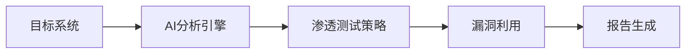
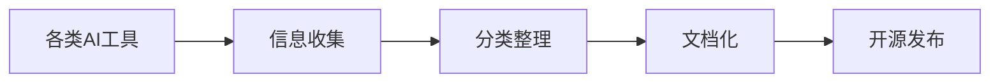
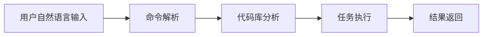
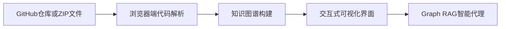
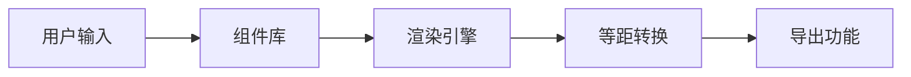
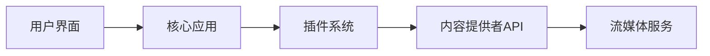
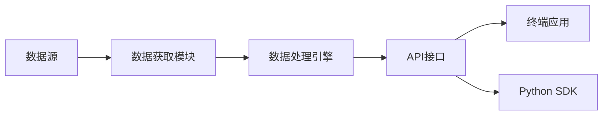

## 今日热点

AI代理系统与辅助编程工具今日占据GitHub热榜，Anthropic的Claude Code和Hugging Face的Skills项目引领趋势，显示AI正在深入软件开发与安全测试领域。

---

## 热门项目一览

| 排名 | 项目 | 语言 | 今日 | 总计 | 简介 |
|:---:|------|:----:|------:|-----:|------|
| 1 | [vxcontrol/pentagi](https://github.com/vxcontrol/pentagi) | Go | +1,579 | 7,025 | ✨ Fully autonomous AI Agent... |
| 2 | [x1xhlol/system-prompts-and-models-of-ai-tools](https://github.com/x1xhlol/system-prompts-and-models-of-ai-tools) | Unknown | +1,134 | 117,823 | FULL Augment Code, Claude C... |
| 3 | [anthropics/claude-code](https://github.com/anthropics/claude-code) | Shell | +503 | 68,970 | Claude Code is an agentic c... |
| 4 | [abhigyanpatwari/GitNexus](https://github.com/abhigyanpatwari/GitNexus) | TypeScript | +424 | 1,521 | GitNexus: The Zero-Server C... |
| 5 | [huggingface/skills](https://github.com/huggingface/skills) | Python | +364 | 2,638 | No description |
| 6 | [stan-smith/FossFLOW](https://github.com/stan-smith/FossFLOW) | TypeScript | +340 | 18,178 | Make beautiful isometric in... |
| 7 | [cloudflare/agents](https://github.com/cloudflare/agents) | TypeScript | +257 | 3,748 | Build and deploy AI Agents ... |
| 8 | [Stremio/stremio-web](https://github.com/Stremio/stremio-web) | JavaScript | +247 | 9,711 | Stremio - Freedom to Stream |
| 9 | [OpenBB-finance/OpenBB](https://github.com/OpenBB-finance/OpenBB) | Python | +188 | 60,998 | Financial data platform for... |

---

## 趋势洞察

```
┌─────────────────────────────────────────────────────────────────┐
│  AI/ML 工具         ████████████████████████  6 个项目        │
│  其他               ████████                  2 个项目        │
│  多媒体应用            ████                      1 个项目        │
└─────────────────────────────────────────────────────────────────┘
```

---

## 项目深度解读

### 1. vxcontrol/pentagi — AI渗透测试系统

> **一句话总结**：完全自主的AI智能体系统，能独立执行复杂渗透测试任务，实现自动化安全评估。

#### 价值主张

| 维度 | 说明 |
|------|------|
| **解决痛点** | 解决渗透测试需要专业人才且耗时耗力的问题，实现自动化安全评估 |
| **目标用户** | 安全研究人员、渗透测试工程师、网络安全团队 |
| **核心亮点** | 全自主AI执行 + 复杂任务处理 + 自动化报告生成 |

#### 技术架构



**技术特色**：
- Go语言高性能实现，适合安全工具开发
- 自主AI决策系统，无需人工干预
- 模块化渗透测试框架，可扩展性强

#### 热度分析

- 项目Star数快速增长，单日增长超1500，显示安全领域对AI自动化工具的高度关注
- 社区活跃度高，Fork比例适中，表明项目处于快速发展阶段，生态尚未完全形成

#### 快速上手

```bash
# 克隆项目
git clone https://github.com/vxcontrol/pentagi.git
cd pentagi

# 运行测试
./pentagi --target <目标IP>
```

#### 注意事项

- 项目许可证未知，商业使用前需确认授权条款
- AI执行渗透测试可能涉及法律风险，需在授权范围内使用
- Open Issues为0可能表示项目较新或问题处理迅速，需进一步验证项目稳定性


### 2. x1xhlol/system-prompts-and-ai-tools — [AI资源库]

> **一句话总结**：汇总各类AI工具系统提示词、内部工具及模型的开源资源集合。

#### 价值主张

| 维度 | 说明 |
|------|------|
| **解决痛点** | 解决AI工具提示词分散、难以获取的问题 |
| **目标用户** | AI开发者、研究人员和工具使用者 |
| **核心亮点** | 资源全面性 + 实用性强 + 持续更新 |

#### 技术架构



**技术特色**：
- 资源分类系统化
- 信息更新及时性
- 社区协作维护

#### 热度分析

- 项目Star数超11万，单日新增超1000，显示AI提示词需求旺盛
- Fork数达3万，表明社区高度参与，多人共同维护资源库

#### 快速上手

```bash
# 克隆项目到本地
git clone https://github.com/x1xhlol/system-prompts-and-models-of-ai-tools.git

# 浏览项目内容，查看各类AI工具的系统提示词
cd system-prompts-and-models-of-ai-tools
ls -la
```

#### 注意事项

- 本项目收集的提示词和工具信息可能随AI工具更新而变化，需关注最新版本
- 使用他人系统提示词时，请遵守相关工具的使用条款和许可协议
- 部分非开源工具的系统提示词可能存在获取限制，请尊重知识产权


### 3. anthropics/claude-code — 终端AI编码助手

> **一句话总结**：Claude Code是终端内AI编程助手，通过自然语言理解代码库，自动化执行编码任务与Git工作流。

#### 价值主张

| 维度 | 说明 |
|------|------|
| **解决痛点** | 开发者频繁切换上下文、处理重复编码任务和复杂代码理解的问题 |
| **目标用户** | 软件开发人员，特别是需要高效管理代码库和自动化工作流程的开发者 |
| **核心亮点** | 终端内集成 + 自然语言交互 + 代码库理解 + Git工作流自动化 + 任务执行 |

#### 技术架构



**技术特色**：
- 基于Shell脚本实现，轻量级部署
- 集成Claude AI模型进行自然语言理解
- 深度代码库分析能力
- Git工作流自动化集成
- 终端内无缝交互体验

#### 热度分析

- 项目获得近7万Stars，日增500+，表明开发者社区对其AI辅助编程工具的高度认可和需求旺盛
- 零OpenIssues可能表明项目已进入稳定阶段，在AI辅助编程工具领域占据领先地位

#### 快速上手

```bash
# 安装Claude Code
npm install -g @anthropic-ai/claude-code

# 使用自然语言命令
claude-code "解释这个函数的功能"
```

#### 注意事项

- 项目许可证未知，使用前需确认商业使用限制
- 作为AI辅助工具，代码生成质量可能需要人工审查
- 可能需要API密钥连接Anthropic服务
- 隐私考虑：代码可能被发送到云端处理


### 4. abhigyanpatwari/GitNexus — 零服务器代码图谱

> **一句话总结**：纯客户端运行的代码知识图谱构建工具，无需服务器即可在浏览器中交互式探索代码结构。

#### 价值主张

| 维度 | 说明 |
|------|------|
| **解决痛点** | 解决传统代码分析需服务器支持的问题，完全浏览器端运行保护隐私 |
| **目标用户** | 软件开发者、代码审查人员、项目维护者 |
| **核心亮点** | 纯客户端运行 + 交互式代码知识图谱 + 内置Graph RAG智能代理 |

#### 技术架构



**技术特色**：
- 基于TypeScript开发，提供类型安全保障
- 纯前端实现架构，无需后端服务器支持
- 集成Graph RAG技术，增强代码理解和分析能力

#### 热度分析

- 项目短期内获得1521个star，单日新增424个，增长迅猛
- 零服务器架构满足开发者对隐私保护和便捷使用的双重需求

#### 快速上手

```bash
# 克隆项目
git clone https://github.com/abhigyanpatwari/GitNexus.git

# 安装依赖
npm install

# 启动开发服务器
npm run dev
```

#### 注意事项

- 浏览器端处理大型代码库可能存在性能限制
- 需要确保浏览器有足够的内存和计算能力
- 项目许可证未知，商业使用前需确认授权方式


### 6. stan-smith/FossFLOW — 等距图表工具

> **一句话总结**：FossFLOW是一款基于TypeScript开发的等距基础设施图表工具，帮助用户创建美观、专业的系统架构图。

#### 价值主张

| 维度 | 说明 |
|------|------|
| **解决痛点** | 简化复杂基础设施的可视化，降低技术沟通成本 |
| **目标用户** | DevOps工程师、系统架构师、技术文档编写者 |
| **核心亮点** | 等距视觉效果 + 直观拖放编辑 + 多种云服务集成 + 实时协作 + 导出多种格式 |

#### 技术架构



**技术特色**：
- 基于TypeScript构建，类型安全且易于维护
- 等距视图渲染算法，提供独特的视觉效果
- 组件化架构，便于扩展和定制

#### 热度分析

- 项目Star数达到18,178，且有每日新增，表明在基础设施可视化领域有显著影响力
- Fork数适中，说明社区活跃度高，但可能尚未形成大规模的二次开发生态

#### 快速上手

```bash
# 克隆项目
git clone https://github.com/stan-smith/FossFLOW.git
cd FossFLOW

# 安装依赖并启动
npm install
npm start
```

#### 注意事项

- 项目许可证未知，商业使用前需确认授权方式
- 由于Open Issues为0，可能意味着问题通过其他渠道管理，或社区反馈机制不透明


### 8. Stremio/stremio-web — 流媒体聚合平台

> **一句话总结**：Stremio是开源流媒体聚合平台，统一界面整合多源视频内容，简化观影体验。

#### 价值主张

| 维度 | 说明 |
|------|------|
| **解决痛点** | 解决多平台内容分散、切换不便的问题，提供一站式观影体验 |
| **目标用户** | 追求便捷观影体验的流媒体爱好者，希望整合多源内容的观众 |
| **核心亮点** | 插件扩展系统 + 多平台内容聚合 + 开源可定制 + 跨平台支持 |

#### 技术架构



**技术特色**：
- 基于React和Electron构建的跨平台客户端应用
- 灵活的插件架构支持第三方内容源集成
- 采用响应式设计适配多种设备屏幕

#### 热度分析

- 项目获得近万星标，近期增长稳定，显示用户对其功能的认可和需求
- 社区活跃度较高，但开源协议不明确可能影响贡献者积极性

#### 快速上手

```bash
# 克隆项目
git clone https://github.com/Stremio/stremio-web.git

# 安装依赖
npm install

# 启动开发服务器
npm start
```

#### 注意事项

- 项目许可证不明确，商业使用前需确认授权条款
- 依赖第三方插件提供内容，需注意版权和合规性问题
- 部分功能可能需要配合服务器端使用，仅前端代码可能无法完整体验


### 9. OpenBB-finance/OpenBB — 开源金融终端

> **一句话总结**：开源金融数据平台，为分析师、量化交易者和AI智能体提供全面市场数据和工具。

#### 价值主张

| 维度 | 说明 |
|------|------|
| **解决痛点** | 统一获取多源金融数据，简化量化分析流程 |
| **目标用户** | 金融分析师、量化交易者、AI开发者 |
| **核心亮点** | 多数据源整合 + 开源可定制 + 专业级分析工具 + AI集成能力 |

#### 技术架构



**技术特色**：
- 支持多种金融数据源整合
- 提供Python API便于二次开发
- 模块化设计便于扩展
- 内置多种金融分析工具
- 支持AI模型集成

#### 热度分析

- 项目Star数超过6万，近期增长稳定，表明金融开源工具需求旺盛
- 作为金融领域开源项目，社区活跃度高，已形成专业生态圈

#### 快速上手

```bash
# 安装OpenBB
pip install openbb-terminal

# 启动终端
openbb

# 获取股票数据
stocks load AAPL
```

#### 注意事项

- 需要API密钥才能获取某些金融数据源
- 部分高级功能可能需要订阅付费服务
- 数据准确性需自行验证，不构成投资建议


## 今日推荐

| 主题 | 推荐项目 | 亮点 |
|------|----------|------|
| 今日最热 | [vxcontrol/pentagi](https://github.com/vxcontrol/pentagi) | ✨ Fully autonomou... |
| 值得关注 | [x1xhlol/system-prompts-and-models-of-ai-tools](https://github.com/x1xhlol/system-prompts-and-models-of-ai-tools) | FULL Augment Code... |
| 快速上手 | [anthropics/claude-code](https://github.com/anthropics/claude-code) | Claude Code is an... |
| 长期潜力 | [abhigyanpatwari/GitNexus](https://github.com/abhigyanpatwari/GitNexus) | GitNexus: The Zer... |

---

<div align="center">

*Generated on 2026-02-23 | Powered by GitHub Trending Reporter*

</div>