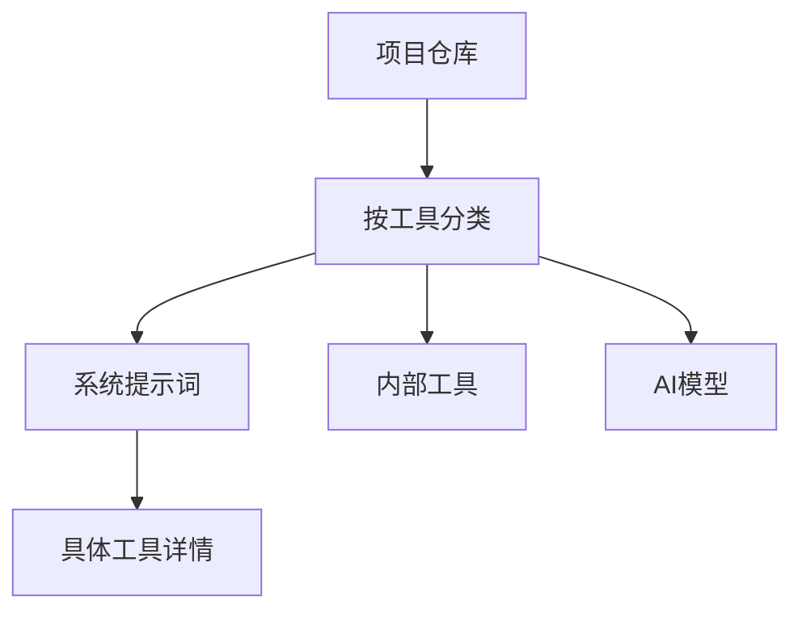
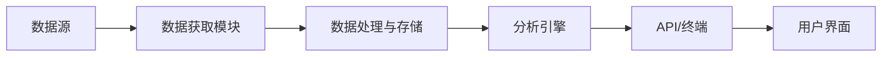
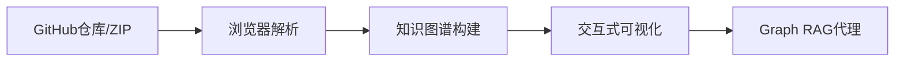
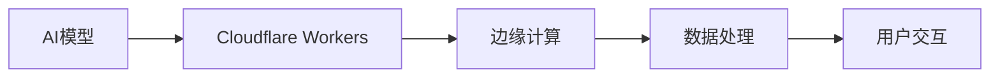
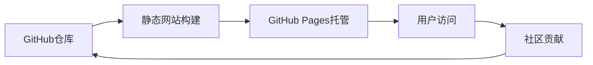
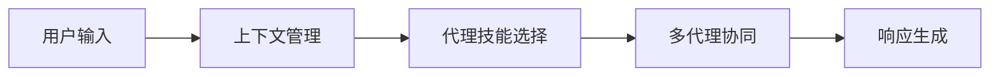
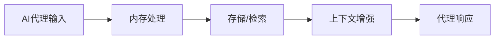
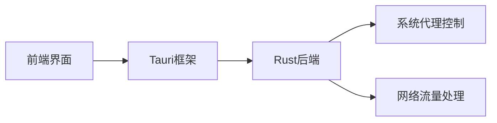
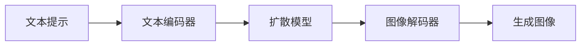

## 今日热点

AI系统提示词与代理技能库引领今日热榜，开发者对AI工具内部机制和上下文工程兴趣激增，向量检索与推理式RAG技术备受关注。

---

## 热门项目一览

| 排名 | 项目 | 语言 | 今日 | 总计 | 简介 |
|:---:|------|:----:|------:|-----:|------|
| 1 | [x1xhlol/system-prompts-and-models-of-ai-tools](https://github.com/x1xhlol/system-prompts-and-models-of-ai-tools) | Unknown | +2,454 | 120,722 | FULL Augment Code, Claude C... |
| 2 | [huggingface/skills](https://github.com/huggingface/skills) | Python | +1,451 | 3,910 | No description |
| 3 | [VectifyAI/PageIndex](https://github.com/VectifyAI/PageIndex) | Python | +624 | 16,787 | 📑 PageIndex: Document Index... |
| 4 | [OpenBB-finance/OpenBB](https://github.com/OpenBB-finance/OpenBB) | Python | +470 | 61,447 | Financial data platform for... |
| 5 | [abhigyanpatwari/GitNexus](https://github.com/abhigyanpatwari/GitNexus) | TypeScript | +467 | 1,933 | GitNexus: The Zero-Server C... |
| 6 | [stan-smith/FossFLOW](https://github.com/stan-smith/FossFLOW) | TypeScript | +430 | 18,558 | Make beautiful isometric in... |
| 7 | [cloudflare/agents](https://github.com/cloudflare/agents) | TypeScript | +318 | 4,009 | Build and deploy AI Agents ... |
| 8 | [f/prompts.chat](https://github.com/f/prompts.chat) | HTML | +295 | 147,054 | a.k.a. Awesome ChatGPT Prom... |
| 9 | [Stremio/stremio-web](https://github.com/Stremio/stremio-web) | JavaScript | +272 | 9,944 | Stremio - Freedom to Stream |
| 10 | [muratcankoylan/Agent-Skills-for-Context-Engineering](https://github.com/muratcankoylan/Agent-Skills-for-Context-Engineering) | Python | +178 | 8,936 | A comprehensive collection ... |
| 11 | [NevaMind-AI/memU](https://github.com/NevaMind-AI/memU) | Python | +163 | 10,110 | Memory for 24/7 proactive a... |
| 12 | [clash-verge-rev/clash-verge-rev](https://github.com/clash-verge-rev/clash-verge-rev) | TypeScript | +142 | 98,234 | A modern GUI client based o... |

---

## 趋势洞察

```
┌─────────────────────────────────────────────────────────────────┐
│  AI/ML 工具         ████████████████████████  10 个项目        │
│  多媒体应用            ████                      2 个项目        │
│  其他               ████                      2 个项目        │
└─────────────────────────────────────────────────────────────────┘
```

---

## 项目深度解读

### 1. x1xhlol/system-prompts-and-ai-tools — AI提示词宝库

> **一句话总结**：汇总各主流AI开发工具的系统提示词、内部工具及模型，是AI开发者的资源枢纽。

#### 价值主张

| 维度 | 说明 |
|------|------|
| **解决痛点** | 解决开发者分散寻找高质量AI工具提示词的难题 |
| **目标用户** | AI开发者、提示词工程师、研究人员及AI工具使用者 |
| **核心亮点** | 覆盖全面 + 实用性强 + 持续更新 + 分类清晰 |

#### 技术架构



**技术特色**：
- 采用Markdown结构化组织内容，便于阅读和贡献
- 分类清晰，提高检索效率
- 社区驱动维护，保证内容时效性

#### 热度分析

- 项目Star数超12万，单日增长2454，显示AI开发者对提示词资源的迫切需求
- 高Fork数反映社区活跃度高，用户不仅查看资源，还积极参与二次分发

#### 快速上手

```bash
# 克隆项目到本地
git clone https://github.com/x1xhlol/system-prompts-and-models-of-ai-tools.git

# 浏览特定工具的提示词
cd system-prompts-and-models-of-ai-tools
cat tools/[工具名称]/prompt.md
```

#### 注意事项

- 部分提示词可能涉及商业机密，使用时需注意合规性
- 不同工具的提示词可能需要根据具体应用场景进行调整优化
- 建议定期关注项目更新，获取最新版本的提示词资源


### 2. huggingface/skills — AI技能库

> **一句话总结**：Hugging Face官方技能库，提供预训练模型与工具的快速集成能力。

#### 价值主张

| 维度 | 说明 |
|------|------|
| **解决痛点** | 简化AI模型集成流程，降低开发门槛 |
| **目标用户** | AI开发者、研究人员、企业技术团队 |
| **核心亮点** | 预训练模型库 + 易用API + 社区支持 + 版本控制 + 多框架兼容 |

#### 技术架构


**技术特色**：
- 提供统一的模型访问接口
- 支持多种深度学习框架
- 内置模型优化与缓存机制
- 版本化模型管理
- 简化的API调用方式

#### 热度分析

- 项目近期获得大量关注，单日增长1451星，表明社区需求强烈
- 作为Hugging Face生态系统的官方组件，拥有稳定的技术支持和持续更新

#### 快速上手

```bash
# 安装huggingface库
pip install transformers

# 基本使用示例
from transformers import pipeline
classifier = pipeline('sentiment-analysis')
result = classifier('I love Hugging Face skills!')
print(result)
```

#### 注意事项

- 使用前需确认项目具体许可证类型
- 部分高级功能可能需要额外配置或付费订阅
- 确保本地环境满足模型运行的硬件要求


### 3. VectifyAI/PageIndex — 无向量推理索引

> **一句话总结**：PageIndex提供了一种不依赖向量嵌入的推理型文档索引方法，实现了高效精准的检索增强生成。

#### 价值主张

| 维度 | 说明 |
|------|------|
| **解决痛点** | 传统RAG系统依赖向量嵌入，计算成本高且难以处理复杂推理场景 |
| **目标用户** | 需要高效文档检索的AI开发者、研究机构和企业应用团队 |
| **核心亮点** | 无向量依赖 + 推理能力 + 高效检索 + 低计算成本 + 易于部署 |

#### 技术架构


**技术特色**：
- 基于推理而非向量嵌入的索引方法
- 降低计算资源需求，提高检索效率
- 支持复杂语义理解和推理

#### 热度分析

- 项目获得1.6万+星标，单日增长624，表明社区对该技术有强烈兴趣
- 零未解决问题显示项目维护良好，代码质量高

#### 快速上手

```bash
# 安装PageIndex
pip install pageindex

# 初始化文档索引
pageindex init --doc-path ./documents

# 执行查询
pageindex query --question "如何提高RAG系统的准确性？"
```

#### 注意事项

- 项目许可证未知，使用前需确认授权条款
- 作为新兴技术，可能存在兼容性限制和性能瓶颈


### 4. OpenBB-finance/OpenBB — 金融数据平台

> **一句话总结**：开源金融数据分析平台，为分析师、量化交易者和AI代理提供全面的数据获取和分析能力。

#### 价值主张

| 维度 | 说明 |
|------|------|
| **解决痛点** | 整合分散的金融数据源，提供统一的数据获取和分析接口 |
| **目标用户** | 金融分析师、量化交易者、AI研究人员和数据科学家 |
| **核心亮点** | 多数据源整合 + 开源可扩展 + 专业分析工具 + AI集成 + 自动化工作流 |

#### 技术架构



**技术特色**：
- 模块化设计，支持多种金融数据源接入
- 使用Python生态系统，整合pandas、numpy等数据分析库
- 提供RESTful API和命令行界面，便于集成和自动化

#### 热度分析

- 项目获得6万+星标，近期增长迅速，日均增长约470星，表明金融科技领域对开源数据平台需求旺盛
- 作为金融数据平台，在量化交易和AI金融分析领域具有重要生态地位，开发者社区活跃

#### 快速上手

```bash
# 安装OpenBB
pip install openbb-terminal

# 启动终端
openbb

# 获取股票数据
AAPL --help
```

#### 注意事项

- 项目依赖较多，安装时可能需要处理依赖冲突
- 部分数据源可能需要API密钥才能完全使用
- 项目更新频繁，使用时需注意API变更


### 5. abhigyanpatwari/GitNexus — 客户端代码智能

> **一句话总结**：纯浏览器端知识图谱构建工具，无需服务器即可实现代码探索与智能分析。

#### 价值主张

| 维度 | 说明 |
|------|------|
| **解决痛点** | 解决代码探索困难，提供无需服务器的代码理解方案 |
| **目标用户** | 开发者、代码审查员、技术团队、研究人员 |
| **核心亮点** | 客户端运行 + 知识图谱构建 + Graph RAG代理 + GitHub集成 |

#### 技术架构



**技术特色**：
- 纯TypeScript实现，保证代码质量与类型安全
- 客户端知识图谱技术，无需后端支持
- 集成Graph RAG(检索增强生成)提升代码理解能力

#### 热度分析

- 近期Star增长迅猛，单日增加467，显示项目受到高度关注
- Fork数相对较少，表明项目处于早期阶段，尚未广泛采用

#### 快速上手

```bash
# 克隆项目
git clone https://github.com/abhigyanpatwari/GitNexus.git

# 安装依赖
npm install

# 启动应用
npm start
```

#### 注意事项
- 项目许可证未知，可能存在使用限制
- 大型代码库可能导致浏览器性能问题
- 代码完全在本地处理，无需担心隐私泄露
- 依赖现代浏览器环境，不支持老旧浏览器


### 6. stan-smith/FossFLOW — 等距图表工具

> **一句话总结**：通过直观的拖放界面，让非技术人员也能轻松创建专业的等距基础设施图表。

#### 价值主张

| 维度 | 说明 |
|------|------|
| **解决痛点** | 复杂基础设施可视化困难，传统工具学习成本高 |
| **目标用户** | DevOps工程师、系统架构师、技术文档编写者 |
| **核心亮点** | 拖放式操作 + 丰富的组件库 + 实时预览 + 多格式导出 + 开源免费 |

#### 技术架构


**技术特色**：
- 基于 TypeScript 开发，提供类型安全
- 采用等距投影算法，实现3D视觉效果
- 组件化设计，支持自定义扩展

#### 热度分析

- 项目获得18k+星标，近期增长迅速，表明社区认可度高
- 零开放问题，维护活跃，已成为基础设施可视化领域的重要工具

#### 快速上手

```bash
# 安装依赖
npm install

# 启动开发服务器
npm run dev

# 构建生产版本
npm run build
```

#### 注意事项

- 需要Node.js环境运行
- 导出大型图表时可能需要较高性能设备


### 7. cloudflare/agents — 云端AI代理

> **一句话总结**：提供在 Cloudflare 平台上构建、部署和管理 AI 代理的完整解决方案，简化云端AI应用开发流程。

#### 价值主张

| 维度 | 说明 |
|------|------|
| **解决痛点** | 解决AI代理在云端部署复杂、扩展性差的问题 |
| **目标用户** | AI开发者、云应用构建者、企业技术团队 |
| **核心亮点** | + Cloudflare全球网络支持 + 无服务器架构 + 边缘计算能力 + TypeScript开发 + 易于部署 |

#### 技术架构



**技术特色**：
- 基于 Cloudflare Workers 无服务器架构
- 利用 TypeScript 提供类型安全的开发体验
- 支持在边缘节点运行 AI 推理，降低延迟

#### 热度分析

- 项目获得4000+ stars，单日增长318，表明AI代理开发领域热度高涨
- 作为 Cloudflare 生态的一部分，受益于边缘计算和AI融合趋势

#### 快速上手

```bash
# 安装 Cloudflare CLI
npm install -g wrangler

# 创建新项目
wrangler init my-ai-agent

# 部署到 Cloudflare
wrangler deploy
```

#### 注意事项

- 项目需要 Cloudflare 账户和相关配置
- 需要了解 TypeScript 和 Cloudflare Workers 的基础知识
- 可能需要额外的 AI 服务 API 密钥来集成 AI 功能


### 8. f/prompts.chat — AI提示词库

> **一句话总结**：开源社区驱动的ChatGPT提示词集合，提供隐私保护的自托管方案。

#### 价值主张

| 维度 | 说明 |
|------|------|
| **解决痛点** | 缺乏高质量、多样化的ChatGPT提示词资源 |
| **目标用户** | AI开发者、研究人员、企业用户和提示词爱好者 |
| **核心亮点** | 社区驱动 + 隐私保护 + 开源免费 + 自托管 + 内容丰富 |

#### 技术架构



**技术特色**：
- 基于HTML的轻量级静态网站架构
- 利用GitHub平台实现社区协作和内容管理
- 支持自托管，提供数据隐私保护

#### 热度分析

- Star数达14.7万，近一日增加295，表明项目处于活跃增长阶段
- Fork数近2万，显示社区参与度高，用户愿意二次开发或部署

#### 快速上手

```bash
# 克隆仓库
git clone https://github.com/f/prompts.chat.git

# 部署到GitHub Pages
cd prompts.chat
git push origin main
```

#### 注意事项
- 项目许可证未知，使用时需注意版权问题
- 作为提示词集合，内容质量参差不齐，需要用户自行甄别
- 自托管需要一定的技术基础，非技术用户可能需要寻求帮助


### 9. Stremio/stremio-web — 流媒体聚合平台

> **一句话总结**：开源流媒体聚合平台，通过插件系统整合多种流媒体服务，提供统一观影体验。

#### 价值主张

| 维度 | 说明 |
|------|------|
| **解决痛点** | 分散的流媒体内容需要频繁切换平台，整合多源内容于一体 |
| **目标用户** | 电影、电视剧爱好者，追求一站式观影体验的用户 |
| **核心亮点** | 跨平台聚合 + 插件生态系统 + 本地媒体库管理 + 简洁UI设计 |

#### 技术架构


**技术特色**：
- 基于React构建的单页应用架构
- 模块化插件系统支持第三方扩展
- 响应式设计适配多端设备

#### 热度分析

- 项目近万星标，日增272星，处于高速发展期，社区认可度持续攀升
- 零开放问题表明项目维护良好，问题可能通过社区渠道高效解决

#### 快速上手

```bash
git clone https://github.com/Stremio/stremio-web.git
cd stremio-web
npm install && npm start
```

#### 注意事项

- 项目许可证未知，商业使用前需确认授权条款
- 第三方插件可能存在安全风险，建议从官方渠道获取插件


### 10. muratcankoylan/Agent-Skills-for-Context-Engineering — 智能代理技能库

> **一句话总结**：提供全面的代理技能集合，专注于上下文工程与多代理系统，助力构建高效智能代理应用。

#### 价值主张

| 维度 | 说明 |
|------|------|
| **解决痛点** | 解决智能代理系统中的上下文管理难题和多代理协同效率问题 |
| **目标用户** | AI系统开发者、智能代理架构师、大模型应用工程师 |
| **核心亮点** | 模块化技能设计 + 上下文工程支持 + 多代理协同框架 + 生产级优化 + 调试工具集成 |

#### 技术架构



**技术特色**：
- 组件化代理技能架构，便于扩展与复用
- 智能上下文处理机制，提升代理决策准确性
- 分布式多代理协同框架，支持复杂任务分解

#### 热度分析

- 近9k星标显示项目高度受关注，日增178星表明社区活跃度持续攀升
- 作为AI代理系统基础设施项目，在当前大模型应用生态中占据重要位置

#### 快速上手

```bash
# 安装依赖
pip install agent-skills

# 基本使用示例
from agent_skills import ContextManager, AgentSkill
context = ContextManager()
skill = AgentSkill("text_analysis")
result = skill.process("待分析文本", context)
```

#### 注意事项

- 需要具备代理系统设计基础知识才能有效利用项目价值
- 部分高级功能可能需要额外配置和依赖管理
- 随着AI代理系统快速发展，建议关注项目更新以获取最新特性


### 11. NevaMind-AI/memU — AI代理内存系统

> **一句话总结**：为全天候AI代理提供持久化内存存储，支持长期上下文保持和智能检索功能。

#### 价值主张

| 维度 | 说明 |
|------|------|
| **解决痛点** | AI代理缺乏长期记忆能力，无法维持跨会话的上下文连贯性 |
| **目标用户** | 需要长期记忆功能的全天候AI代理开发者和部署者 |
| **核心亮点** | 持久化存储 + 智能检索 + 自动上下文管理 + 高效索引系统 |

#### 技术架构



**技术特色**：
- 持久化存储机制确保记忆长期保存
- 智能索引系统加速记忆检索
- 自动上下文管理减少代理负载

#### 热度分析

- 项目获得10k+星标且持续增长，表明AI代理记忆功能需求旺盛
- 作为AI代理基础设施项目具有重要生态价值，社区贡献活跃

#### 快速上手

```bash
# 克隆项目
git clone https://github.com/NevaMind-AI/memU.git
cd memU

# 安装依赖
pip install -r requirements.txt

# 基本使用示例
python -m memU --init
python -m memU --add "重要记忆内容"
python -m memU --query "相关关键词"
```

#### 注意事项

- 需要确保数据库配置正确以避免数据丢失
- 记忆内容可能需要定期清理以保持系统效率
- 大规模部署时需考虑性能优化和扩展性


### 12. clash-verge-rev/clash-verge-rev — 跨平台代理客户端

> **一句话总结**：基于Tauri构建的现代化跨平台代理工具，提供图形化界面与定制化代理体验。

#### 价值主张

| 维度 | 说明 |
|------|------|
| **解决痛点** | 简化跨平台代理配置，提供直观图形化代理管理界面 |
| **目标用户** | 需要灵活网络配置的开发者、研究人员和普通用户 |
| **核心亮点** | 基于Tauri构建 + 跨平台支持 + 图形化界面 + 定制化代理策略 |

#### 技术架构



**技术特色**：
- 基于Tauri的轻量级跨平台架构，性能优于传统Electron
- 使用TypeScript开发，提供类型安全与更好的开发体验
- 现代化GUI设计，提升用户代理配置与管理效率

#### 热度分析

- 项目获得近10万星，每日增长约140星，表明项目热度高且持续增长
- 0个Open Issues反映项目成熟度高，社区问题解决机制高效

#### 快速上手

```bash
# 克隆项目
git clone https://github.com/clash-verge-rev/clash-verge-rev.git
# 进入目录
cd clash-verge-rev
# 安装依赖
npm install
# 运行项目
npm run tauri dev
```

#### 注意事项

- 项目需要安装Tauri运行环境及对应的系统依赖
- 代理工具使用需遵守当地法律法规
- 系统代理配置可能需要管理员权限才能正常工作


### 13. siteboon/claudecodeui — AI编程助手UI

> **一句话总结**：为 Claude Code 等编程工具提供跨平台 Web UI，实现远程项目管理与代码会话控制。

#### 价值主张

| 维度 | 说明 |
|------|------|
| **解决痛点** | 解决 Claude Code 缺乏跨平台界面、难以远程管理的问题 |
| **目标用户** | 使用 Claude Code/Cursor 的开发者与 AI 编程爱好者 |
| **核心亮点** | 跨平台支持 + 远程会话管理 + 项目可视化控制 + 移动端适配 |

#### 技术架构


**技术特色**：
- 基于 JavaScript 的响应式跨平台 UI 架构
- 实现了与 Claude Code 的双向通信机制
- 支持移动端触摸操作与桌面端完整功能

#### 热度分析

- 项目 Star 数持续增长，单日新增 62 个，社区认可度高
- 零开放问题反映项目稳定性强，处于 AI 编程工具前端界面生态位

#### 快速上手

```bash
# 克隆仓库
git clone https://github.com/siteboon/claudecodeui.git

# 安装依赖并启动
cd claudecodeui && npm install && npm start
```

#### 注意事项

- 项目许可证未知，使用前需确认授权条款
- 需先配置 Claude Code/Cursor 后端环境才能正常使用
- 移动端体验可能受网络条件影响，建议稳定网络环境下使用


### 14. CompVis/stable-diffusion — 文本图像生成模型

> **一句话总结**：Stable Diffusion是革命性的潜在文本到图像扩散模型，能从文本描述生成高质量图像。

#### 价值主张

| 维度 | 说明 |
|------|------|
| **解决痛点** | 简化高质量图像生成流程，降低技术门槛 |
| **目标用户** | 艺术创作者、设计师、研究人员和AI爱好者 |
| **核心亮点** | 开源可商用 + 高质量图像生成 + 文本理解能力强 + 低硬件要求 |

#### 技术架构



**技术特色**：
- 采用潜在扩散架构，大幅减少计算资源需求
- 结合CLIP文本编码器，精准理解文本语义
- U-Net架构的扩散过程，保证生成图像质量

#### 热度分析

- 项目获得超7.2万星，日增36星，表明持续受开发者关注
- 作为AI生成领域的标杆项目，拥有庞大且活跃的社区生态

#### 快速上手

```bash
# 安装依赖
pip install torch torchvision
pip install diffusers transformers accelerate

# 基本使用示例
from diffusers import StableDiffusionPipeline
import torch

model_id = "runwayml/stable-diffusion-v1-5"
pipe = StableDiffusionPipeline.from_pretrained(model_id, torch_dtype=torch.float16)
pipe = pipe.to("cuda")

prompt = "a photo of an astronaut riding a horse on mars"
image = pipe(prompt).images[0]
image.save("astronaut_rides_horse.png")
```

#### 注意事项

- 需要较强大的GPU支持，推荐NVIDIA显卡
- 生成结果可能受偏见和不当内容影响，需谨慎使用
- 商业使用前需确认相关许可证要求
- 图像质量和生成时间受提示词质量影响较大


## 今日推荐

| 主题 | 推荐项目 | 亮点 |
|------|----------|------|
| 今日最热 | [x1xhlol/system-prompts-and-models-of-ai-tools](https://github.com/x1xhlol/system-prompts-and-models-of-ai-tools) | FULL Augment Code... |
| 值得关注 | [huggingface/skills](https://github.com/huggingface/skills) | No description |
| 快速上手 | [VectifyAI/PageIndex](https://github.com/VectifyAI/PageIndex) | 📑 PageIndex: Docu... |
| 长期潜力 | [OpenBB-finance/OpenBB](https://github.com/OpenBB-finance/OpenBB) | Financial data pl... |

---

<div align="center">

*Generated on 2026-02-24 | Powered by GitHub Trending Reporter*

</div>