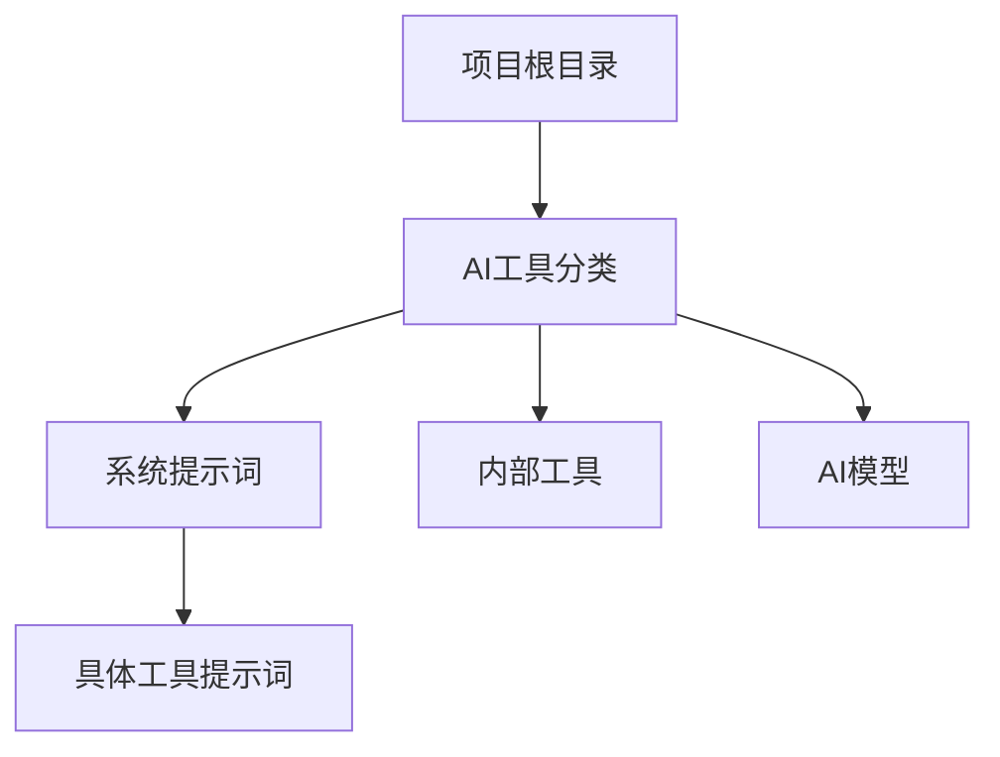
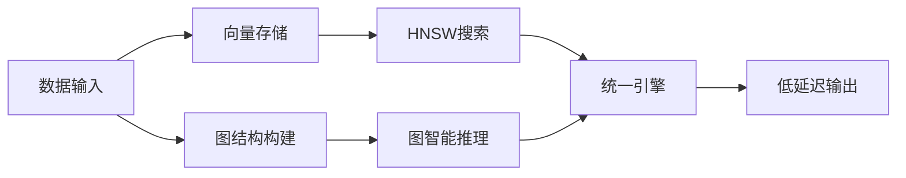
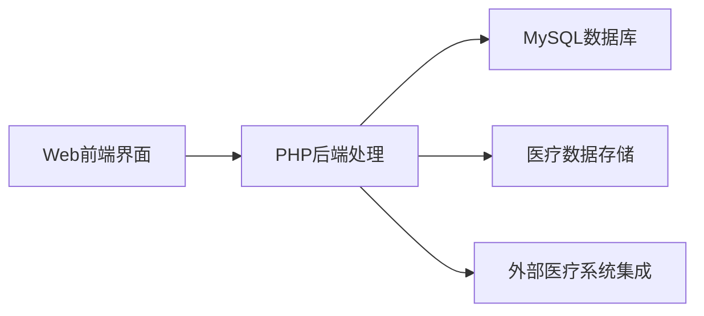

## 今日热点

今日GitHub热榜项目精彩纷呈。

---

## 热门项目一览

| 排名 | 项目 | 语言 | 今日 | 总计 | 简介 |
|:---:|------|:----:|------:|-----:|------|
| 1 | [x1xhlol/system-prompts-and-models-of-ai-tools](https://github.com/x1xhlol/system-prompts-and-models-of-ai-tools) | Unknown | +3,804 | 123,081 | FULL Augment Code, Claude C... |
| 2 | [D4Vinci/Scrapling](https://github.com/D4Vinci/Scrapling) | Python | +1,970 | 12,632 | 🕷️ An adaptive Web Scraping... |
| 3 | [huggingface/skills](https://github.com/huggingface/skills) | Python | +1,206 | 5,331 | No description |
| 4 | [obra/superpowers](https://github.com/obra/superpowers) | Shell | +1,195 | 60,478 | An agentic skills framework... |
| 5 | [muratcankoylan/Agent-Skills-for-Context-Engineering](https://github.com/muratcankoylan/Agent-Skills-for-Context-Engineering) | Python | +722 | 9,905 | A comprehensive collection ... |
| 6 | [VectifyAI/PageIndex](https://github.com/VectifyAI/PageIndex) | Python | +714 | 17,249 | 📑 PageIndex: Document Index... |
| 7 | [OpenBB-finance/OpenBB](https://github.com/OpenBB-finance/OpenBB) | Python | +504 | 61,887 | Financial data platform for... |
| 8 | [LadybirdBrowser/ladybird](https://github.com/LadybirdBrowser/ladybird) | C++ | +236 | 59,098 | Truly independent web browser |
| 9 | [HunxByts/GhostTrack](https://github.com/HunxByts/GhostTrack) | Python | +145 | 7,459 | Useful tool to track locati... |
| 10 | [GVCLab/PersonaLive](https://github.com/GVCLab/PersonaLive) | Python | +73 | 1,979 | [CVPR 2026] PersonaLive! : ... |
| 11 | [ruvnet/ruvector](https://github.com/ruvnet/ruvector) | Rust | +41 | 732 | RuVector is a high performa... |
| 12 | [openemr/openemr](https://github.com/openemr/openemr) | PHP | +13 | 4,849 | The most popular open sourc... |

---

## 趋势洞察

```
┌─────────────────────────────────────────────────────────────────┐
│  AI/ML 工具         ████████████████████████  7 个项目        │
│  开发框架             ███                       1 个项目        │
│  多媒体应用            ███                       1 个项目        │
│  项目管理             ███                       1 个项目        │
│  开发工具             ███                       1 个项目        │
│  其他               ███                       1 个项目        │
└─────────────────────────────────────────────────────────────────┘
```

---

## 项目深度解读

### 1. x1xhlol/system-prompts-and-models-of-ai-tools — AI工具资源库

> **一句话总结**：收集整理各类AI编程工具的系统提示词、内部工具及模型的开源资源库。

#### 价值主张

| 维度 | 说明 |
|------|------|
| **解决痛点** | 缺乏集中获取各类AI工具系统提示词和模型的权威渠道 |
| **目标用户** | AI开发者、研究人员及对AI工具系统提示感兴趣的技术人员 |
| **核心亮点** | 覆盖广泛AI工具 + 系统提示词完整收集 + 开源资源整合 |

#### 技术架构



**技术特色**：
- 采用清晰的目录结构组织各类AI工具资源
- 系统提示词经过分类整理，便于查找和使用
- 包含开源AI工具的内部实现细节

#### 热度分析

- 项目Star数超过12万，且单日增长近4000，显示AI工具提示词资源需求旺盛
- 高Fork数表明社区积极参与资源贡献和二次开发，形成AI工具研究生态

#### 快速上手

```bash
# 克隆仓库获取完整资源
git clone https://github.com/x1xhlol/system-prompts-and-models-of-ai-tools.git

# 浏览目录结构
cd system-prompts-and-models-of-ai-tools && ls -la
```

#### 注意事项

- 项目包含大量第三方AI工具的系统提示词，使用时需注意相关许可协议
- 部分提示词可能随工具更新而变化，建议定期查看更新
- 使用提示词时请遵守各AI工具的使用条款，避免滥用


### 2. D4Vinci/Scrapling — 自适应爬虫框架

> **一句话总结**：自适应网页抓取框架，可处理从简单请求到大规模爬取的全套解决方案。

#### 价值主张

| 维度 | 说明 |
|------|------|
| **解决痛点** | 统一解决网页抓取中从简单请求到复杂爬取的全流程需求 |
| **目标用户** | 数据分析师、爬虫开发者、研究人员、自动化测试人员 |
| **核心亮点** | 自适应爬取 + 全流程覆盖 + 高度可定制化 + 负载均衡 |

#### 技术架构


**技术特色**：
- 自适应请求处理，根据目标网站特性自动调整策略
- 内置多种解析器，支持不同网页结构和数据格式
- 内置负载均衡和请求队列管理机制

#### 热度分析

- 项目近期获得大量关注，单日增长近2000星，表明社区对高质量爬虫框架需求旺盛
- Fork数相对Star数较低，表明项目处于使用阶段而非二次开发阶段，用户更倾向于直接使用

#### 快速上手

```bash
# 安装Scrapling
pip install scrapling

# 基本使用示例
from scrapling import Scrapling
scraper = Scrapling('https://example.com')
data = scraper.fetch()
print(data)
```

#### 注意事项

- 由于项目没有明确说明许可证，使用时需要注意可能的许可限制
- 自适应特性可能意味着某些高级功能需要额外配置才能发挥最大效用
- 对于反爬虫严格的网站，可能需要额外配置代理和请求头


### 3. huggingface/skills — AI技能框架

> **一句话总结**：为Hugging Face生态系统提供模块化AI能力集成与管理解决方案

#### 价值主张

| 维度 | 说明 |
|------|------|
| **解决痛点** | 简化AI技能开发、部署与组合流程，降低应用门槛 |
| **目标用户** | AI应用开发者、企业AI集成团队、研究人员 |
| **核心亮点** | 模块化技能设计 + Hugging Face生态无缝集成 + 低代码能力组合 |

#### 技术架构


**技术特色**：
- 基于Hugging Face模型库的标准化技能封装
- 提供统一的技能接口规范与版本管理
- 支持技能的动态组合与编排能力

#### 热度分析

- 项目近期热度激增，单日增长1200+ stars，表明可能发布了重要更新
- 作为Hugging Face生态的重要组件，具备强大的品牌背书和用户基础

#### 快速上手

```bash
# 安装技能库
pip install skills

# 初始化技能环境
skills init

# 运行预置技能
skills run --skill text-classification
```

#### 注意事项

- 项目许可证信息不明确，商业使用前需确认授权条款
- 建议查阅项目文档了解与Hugging Face其他产品的兼容性要求
- 需要评估技能组合的性能开销和资源消耗


### 4. obra/superpowers — 技能框架

> **一句话总结**：代理驱动的软件开发方法论与技能提升框架，助力开发者高效成长

#### 价值主张

| 维度 | 说明 |
|------|------|
| **解决痛点** | 解决传统软件开发效率低下与技能获取碎片化问题 |
| **目标用户** | 追求高效成长的软件开发者与技术团队 |
| **核心亮点** | 代理驱动 + 技能体系 + 实践方法论 + 持续学习 |

#### 技术架构


**技术特色**：
- 基于Shell的轻量级代理系统
- 模块化技能框架设计
- 自适应学习循环机制

#### 热度分析

- 项目近期增长迅猛，单日新增Stars近1200，显示强烈社区关注
- 高Fork比例表明项目被广泛实践和定制，方法论已形成社区共识

#### 快速上手

```bash
# 克隆项目
git clone https://github.com/obra/superpowers.git
cd superpowers
# 运行初始化脚本
./init.sh
```

#### 注意事项

- 项目许可证未知，使用前需确认开源协议
- 需要基本的Shell环境知识，建议有一定Linux/Unix基础
- 项目依赖可能因系统不同而有所差异，注意安装文档说明


### 5. muratcankoylan/Agent-Skills-for-Context-Engineering — 智能体上下文工程

> **一句话总结**：提供全面的智能体技能集合，专注于上下文工程与多智能体架构，助力构建高效生产级智能体系统。

#### 价值主张

| 维度 | 说明 |
|------|------|
| **解决痛点** | 解决智能体系统上下文管理混乱、多智能体协同效率低的问题 |
| **目标用户** | AI系统架构师、智能体开发者、智能体系统优化工程师 |
| **核心亮点** | 丰富的上下文管理技能 + 多智能体架构模式 + 生产级部署经验 + 调试优化工具 + 模块化设计 |

#### 技术架构


**技术特色**：
- 模块化上下文管理架构，支持动态上下文构建与优化
- 多智能体通信协议，实现高效任务分配与协作
- 生产级性能监控与自适应调整机制

#### 热度分析

- 项目近期Star增长迅速(+722 today)，表明上下文工程与多智能体系统正成为研究热点
- 高Star数与低Issues比值(9,905/0)反映项目成熟度高，社区认可度强

#### 快速上手

```bash
# 克隆项目
git clone https://github.com/muratcankoylan/Agent-Skills-for-Context-Engineering.git
cd Agent-Skills-for-Context-Engineering

# 安装依赖
pip install -r requirements.txt
```

#### 注意事项

- 项目未明确许可证，使用前需确认授权条款
- 部分高级功能可能需要额外配置或依赖，建议详细阅读文档
- 多智能体系统设计复杂，建议从简单场景入手，逐步扩展


### 6. VectifyAI/PageIndex — 无向量索引

> **一句话总结**：PageIndex提供无向量推理的文档索引方案，实现高效的检索增强生成。

#### 价值主张

| 维度 | 说明 |
|------|------|
| **解决痛点** | 解决传统向量索引依赖嵌入计算、推理能力有限的问题 |
| **目标用户** | 需要高效文档检索和知识库构建的开发者与研究人员 |
| **核心亮点** | 无向量索引 + 基于推理检索 + 页面级上下文保持 |

#### 技术架构


**技术特色**：
- 无向量索引技术，避免传统嵌入计算开销
- 基于推理的检索机制，提高语义理解能力
- 页面级文档处理，保持上下文连贯性

#### 热度分析

- 项目获得17,249个星标，单日增长714，表明近期受到高度关注
- Fork数1,228，说明开发者社区积极参与二次开发与扩展

#### 快速上手

```bash
# 克隆项目
git clone https://github.com/VectifyAI/PageIndex.git
cd PageIndex

# 安装依赖
pip install -r requirements.txt
```

#### 注意事项

- 项目许可证未知，商业使用前需确认授权条款
- 虽然当前Open Issues为0，但作为新项目，文档和社区支持可能还在发展中


### 7. OpenBB-finance/OpenBB — 金融数据平台

> **一句话总结**：开源金融数据平台，为分析师、量化交易者和AI代理提供全面市场数据。

#### 价值主张

| 维度 | 说明 |
|------|------|
| **解决痛点** | 统一获取多源金融数据，简化量化分析和AI代理开发流程 |
| **目标用户** | 金融分析师、量化交易者、AI开发者和投资研究机构 |
| **核心亮点** | 开源免费 + 多数据源整合 + AI友好接口 + 扩展性强 + 社区驱动 |

#### 技术架构


**技术特色**：
- 模块化设计，支持多种数据源接入
- 高效的数据处理管道，确保实时性
- RESTful API设计，便于集成和扩展

#### 热度分析

- 高关注度持续增长，日均500+ Star，在金融科技领域处于领先地位
- 社区活跃度高，Fork数超过6k，表明被广泛采用和二次开发

#### 快速上手

```bash
# 安装OpenBB
pip install openbb-terminal

# 启动终端
openbb

# 获取股票数据
stocks load AAPL
```

#### 注意事项

- 部分数据源可能需要API密钥或订阅服务
- 定期更新以确保获取最新的功能和数据源支持
- 对于高频交易场景，可能需要额外优化数据获取和处理速度


### 8. LadybirdBrowser/ladybird — 独立浏览器引擎

> **一句话总结**：Ladybird是一款完全独立自主的网页浏览器，致力于提供无厂商控制的浏览体验。

#### 价值主张

| 维度 | 说明 |
|------|------|
| **解决痛点** | 打破主流浏览器厂商垄断，提供真正自主可控的浏览体验 |
| **目标用户** | 隐私保护倡导者、技术极客及开源社区贡献者 |
| **核心亮点** | 自研渲染引擎 + 完全开源 + 架构简洁 + 跨平台支持 |

#### 技术架构


**技术特色**：
- 基于C++20构建，保证高性能与内存安全
- 采用模块化设计，各组件职责清晰分离
- 自主研发渲染引擎，不依赖现有浏览器内核

#### 热度分析

- 项目获得近6万星且持续高增长(+236/天)，表明社区对其独立理念高度认可
- 高Star/Fork比例显示项目更受关注而非二次开发，凸显其原创性与独特价值

#### 快速上手

```bash
# 克隆仓库
git clone https://github.com/LadybirdBrowser/ladybird.git

# 构建项目
cd ladybird
./build.sh
```

#### 注意事项
- 项目可能处于早期开发阶段，功能完善度有待提高
- 作为新兴浏览器，可能存在网页兼容性问题
- 由于Open Issues为0，可能采用其他问题管理渠道或机制


### 9. HunxByts/GhostTrack — 位置追踪工具

> **一句话总结**：一款基于Python的移动号码与位置追踪工具，提供精准定位与实时监控功能

#### 价值主张

| 维度 | 说明 |
|------|------|
| **解决痛点** | 解决手机号码定位与实时位置追踪需求，无需专业设备 |
| **目标用户** | 需要追踪家人位置或进行安全监控的个人用户 |
| **核心亮点** | 精准定位 + 实时追踪 + 多平台支持 + 简易操作 |

#### 技术架构


**技术特色**：
- 使用Python实现，跨平台兼容性强
- 集成多种定位服务API，提高追踪准确性
- 简洁的命令行界面，易于使用和集成

#### 热度分析

- 项目获得7,459个星标且持续增长(+145/天)，表明其在手机定位领域有较高需求
- 985个Fork数显示社区活跃度高，用户可能进行二次开发或定制

#### 快速上手

```bash
# 安装依赖
pip install -r requirements.txt

# 运行追踪工具
python ghosttrack.py +号码
```

#### 注意事项

- 该工具可能涉及隐私和法律问题，使用前需确保符合当地法律法规
- 未知许可证限制了商业用途的可能性
- 追踪他人位置可能侵犯隐私权，仅建议在合法合规情况下使用


### 10. GVCLab/PersonaLive — 直播人像动画

> **一句话总结**：PersonaLive实现实时、富有表现力的肖像图像动画化，专为直播场景优化。

#### 价值主张

| 维度 | 说明 |
|------|------|
| **解决痛点** | 解决直播中静态头像缺乏表现力的问题，实现实时表情和动作同步 |
| **目标用户** | 主播、内容创作者、虚拟主播、直播平台 |
| **核心亮点** | 实时渲染 + 表情自然 + 低延迟计算 + 跨平台兼容 |

#### 技术架构


**技术特色**：
- 基于深度学习的面部表情迁移技术
- 低延迟实时处理架构
- 适应不同光照和姿态的鲁棒性算法
- 保持肖像特征的同时实现自然表情变化

#### 热度分析

- 项目在短时间内获得近2K星标，日均增长约70星，显示社区高度关注
- 作为CVPR 2026的投稿项目，在学术界和工业界均有较大影响力

#### 快速上手

```bash
# 克隆仓库
git clone https://github.com/GVCLab/PersonaLive.git

# 安装依赖
cd PersonaLive
pip install -r requirements.txt

# 运行示例
python demo.py --input webcam --output animated_portrait.mp4
```

#### 注意事项

- 需要NVIDIA GPU以获得最佳性能
- 项目可能需要特定的Python环境和CUDA版本
- 仅支持特定格式的人像图像输入
- 可能需要调整参数以获得最佳动画效果


### 11. ruvnet/ruvector — 高性能向量图数据库

> **一句话总结**：RuVector是结合HNSW搜索与图智能的高性能向量图数据库，专为AI与实时分析优化。

#### 价值主张

| 维度 | 说明 |
|------|------|
| **解决痛点** | 解决AI系统中向量检索与图推理的整合难题 |
| **目标用户** | AI开发者、代理系统构建者、实时分析工程师 |
| **核心亮点** | HNSW搜索 + 动态最小割相干性 + 自学习记忆 |

#### 技术架构



**技术特色**：
- 基于Rust的高性能内存管理
- HNSW算法优化的快速向量检索
- 动态最小割相干性维护图结构
- 自学习记忆系统持续优化推理

#### 热度分析

- 项目Star数732且单日增长41，显示快速增长趋势，社区认可度高
- 0个Open Issues表明项目维护良好，问题响应及时

#### 快速上手

```bash
# 克隆仓库
git clone https://github.com/ruvnet/ruvector.git
cd ruvector

# 构建项目
cargo build --release

# 运行示例
cargo run --example basic_usage
```

#### 注意事项

- 项目License未知，使用前需确认授权条款
- 作为新兴项目，生态系统和文档可能仍在完善中
- Rust学习曲线较陡，非Rust开发者可能需要额外学习成本


### 12. openemr/openemr — 开源医疗管理系统

> **一句话总结**：提供最流行的开源电子健康记录和医疗实践管理解决方案，助力医疗机构实现数字化诊疗。

#### 价值主张

| 维度 | 说明 |
|------|------|
| **解决痛点** | 解决医疗机构电子化记录和管理患者健康信息的高成本难题 |
| **目标用户** | 医院、诊所、医疗集团等医疗服务提供者 |
| **核心亮点** | 开源免费降低成本 + 完整的患者健康记录管理 + 医疗实践流程自动化 + 符合医疗行业标准 |

#### 技术架构



**技术特色**：
- 基于PHP开发，采用MVC架构，易于扩展和维护
- 支持HL7、DICOM等医疗标准，确保系统互操作性
- 提供RESTful API接口，便于第三方系统集成

#### 热度分析

- 拥有近5,000个Star和2,700多个Fork，持续稳定增长，显示医疗开源软件领域需求旺盛
- 作为医疗信息化领域的重要开源项目，社区活跃度高，但医疗数据安全特性限制了广泛参与

#### 快速上手

```bash
# 克隆项目
git clone https://github.com/openemr/openemr.git

# 配置Web服务器指向public目录
```

#### 注意事项

- 需确保服务器环境满足PHP 7.4+和MySQL 5.7+要求
- 首次使用前需进行详细的医疗数据隐私和安全配置
- 建议在正式部署前进行充分测试和合规性检查，符合HIPAA等医疗数据保护法规


## 今日推荐

| 主题 | 推荐项目 | 亮点 |
|------|----------|------|
| 今日最热 | [x1xhlol/system-prompts-and-models-of-ai-tools](https://github.com/x1xhlol/system-prompts-and-models-of-ai-tools) | FULL Augment Code... |
| 值得关注 | [D4Vinci/Scrapling](https://github.com/D4Vinci/Scrapling) | 🕷️ An adaptive We... |
| 快速上手 | [huggingface/skills](https://github.com/huggingface/skills) | No description |
| 长期潜力 | [obra/superpowers](https://github.com/obra/superpowers) | An agentic skills... |

---

<div align="center">

*Generated on 2026-02-25 | Powered by GitHub Trending Reporter*

</div>