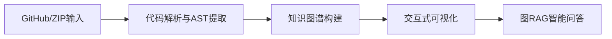
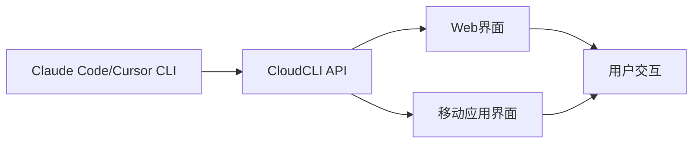

## 今日热点

AI代理技能

---

## 热门项目一览

| 排名 | 项目 | 语言 | 今日 | 总计 | 简介 |
|:---:|------|:----:|------:|-----:|------|
| 1 | [D4Vinci/Scrapling](https://github.com/D4Vinci/Scrapling) | Python | +1,656 | 15,072 | 🕷️ An adaptive Web Scraping... |
| 2 | [huggingface/skills](https://github.com/huggingface/skills) | Python | +1,538 | 6,397 | No description |
| 3 | [obra/superpowers](https://github.com/obra/superpowers) | Shell | +1,250 | 61,845 | An agentic skills framework... |
| 4 | [x1xhlol/system-prompts-and-models-of-ai-tools](https://github.com/x1xhlol/system-prompts-and-models-of-ai-tools) | Unknown | +1,241 | 124,137 | FULL Augment Code, Claude C... |
| 5 | [muratcankoylan/Agent-Skills-for-Context-Engineering](https://github.com/muratcankoylan/Agent-Skills-for-Context-Engineering) | Python | +1,042 | 10,730 | A comprehensive collection ... |
| 6 | [abhigyanpatwari/GitNexus](https://github.com/abhigyanpatwari/GitNexus) | TypeScript | +894 | 3,718 | GitNexus: The Zero-Server C... |
| 7 | [ruvnet/ruvector](https://github.com/ruvnet/ruvector) | Rust | +437 | 1,188 | RuVector is a High Performa... |
| 8 | [VectifyAI/PageIndex](https://github.com/VectifyAI/PageIndex) | Python | +378 | 17,714 | 📑 PageIndex: Document Index... |
| 9 | [datawhalechina/hello-agents](https://github.com/datawhalechina/hello-agents) | Python | +222 | 21,958 | 📚 《从零开始构建智能体》——从零开始的智能体原理与实践教程 |
| 10 | [katanemo/plano](https://github.com/katanemo/plano) | Rust | +205 | 5,570 | Delivery infrastructure for... |
| 11 | [NevaMind-AI/memU](https://github.com/NevaMind-AI/memU) | Python | +187 | 10,803 | Memory for 24/7 proactive a... |
| 12 | [liyupi/ai-guide](https://github.com/liyupi/ai-guide) | JavaScript | +182 | 7,695 | 程序员鱼皮的 AI 资源大全 + Vibe Codin... |

---

## 趋势洞察

```
┌─────────────────────────────────────────────────────────────────┐
│  AI/ML 工具         ████████████████████████  14 个项目        │
│  开发框架             █                         1 个项目        │
│  多媒体应用            █                         1 个项目        │
└─────────────────────────────────────────────────────────────────┘
```

---

## 项目深度解读

### 1. D4Vinci/Scrapling — 智能爬虫框架

> **一句话总结**：自适应网页抓取框架，从小规模请求到大规模爬取提供一站式解决方案。

#### 价值主张

| 维度 | 说明 |
|------|------|
| **解决痛点** | 传统爬面对复杂多变的网页结构需要频繁调整，Scrapling提供自适应解析能力 |
| **目标用户** | 数据分析师、研究人员、需要网络数据采集的开发者和企业 |
| **核心亮点** | 自适应解析 + 多种数据提取方式 + 反爬虫应对能力 + 易于扩展的架构 |

#### 技术架构


**技术特色**：
- 自适应HTML解析技术，无需手动定义选择器
- 内置多种反爬虫机制，自动处理常见反爬策略
- 模块化设计，支持自定义插件和扩展

#### 热度分析
项目短期内获得大量关注，今日增长1,656 stars，表明其在爬虫领域有较高实用价值和社区认可度。

#### 快速上手

```bash
# 安装
pip install scrapling

# 基本使用
from scrapling import Scrapling
scrap = Scrapling('https://example.com')
data = scrap.get()
print(data.text)
```

#### 注意事项
- 使用前需确认目标网站的robots.txt规则和使用条款
- 过度频繁的请求可能导致IP被封禁，建议设置合理的请求间隔
- 某些网站可能需要额外的认证或特殊处理才能抓取成功


### 2. huggingface/skills — 模型技能库

> **一句话总结**：提供预训练模型的能力集合与技能管理框架，简化AI能力应用

#### 价值主张

| 维度 | 说明 |
|------|------|
| **解决痛点** | 统一管理模型能力，简化AI应用开发流程 |
| **目标用户** | AI开发者、研究人员和企业应用工程师 |
| **核心亮点** | 模块化技能设计 + 即插即用架构 + 版本控制 + 性能优化 + 社区贡献 |

#### 技术架构


**技术特色**：
- 基于Transformers的技能扩展机制
- 技能组合与流水线处理能力
- 轻量级技能封装与复用系统

#### 热度分析

- 近期Star激增(+1,538)，显示社区高度关注和认可
- 作为HuggingFace生态系统的重要组成部分，具有战略价值

#### 快速上手

```bash
# 安装项目
pip install skills

# 加载预定义技能
from skills import load_skill
skill = load_skill("text-classification")

# 使用技能
result = skill("这是一条测试文本")
```

#### 注意事项
- 需要熟悉HuggingFace基础模型架构
- 技能组合可能需要额外计算资源
- 部分高级功能可能需要API访问权限


### 3. obra/superpowers — 开发效能框架

> **一句话总结**：提供系统化的代理技能框架与开发方法论，提升软件工程效能与团队协作质量。

#### 价值主张

| 维度 | 说明 |
|------|------|
| **解决痛点** | 解决软件开发过程无系统方法论、技能培养零散的问题 |
| **目标用户** | 软件开发团队、技术管理者、全栈开发者 |
| **核心亮点** | 系统性方法论 + 技能培养框架 + 团队协作指南 + 持续改进机制 |

#### 技术架构


**技术特色**：
- 基于Shell的轻量级实现方案
- 跨平台兼容的命令行工具集
- 模块化的技能框架设计

#### 热度分析

- 高关注度项目，近单日新增Stars超1200，社区活跃度极高
- 作为软件开发方法论框架，在效能提升领域占据重要生态位置

#### 快速上手

```bash
git clone https://github.com/obra/superpowers.git
cd superpowers
./install.sh
source superpowers.sh
```

#### 注意事项

- 项目使用Shell脚本编写，需要基本的Shell环境知识
- 作为方法论框架，需要团队共同实践才能发挥最大效用


### 4. x1xhlol/system-prompts-and-models-of-ai-tools — AI工具集萃

> **一句话总结**：该项目收集了各类AI编程工具的系统提示词、内部工具和AI模型，为开发者和研究人员提供全面的AI工具参考。

#### 价值主张

| 维度 | 说明 |
|------|------|
| **解决痛点** | 解决了开发者难以获取和比较各类AI工具系统提示词和模型的问题 |
| **目标用户** | AI开发者、研究人员、工具设计师和对AI技术感兴趣的专业人士 |
| **核心亮点** | 全面性 + 实用性 + 开源性 + 持续更新 + 多样化覆盖 |

#### 技术架构


**技术特色**：
- 信息收集系统化，确保覆盖全面
- 分类清晰，便于查找和使用
- 社区驱动，保持信息更新和准确性

#### 热度分析

- 项目获得超过12万星，单日增长超过1200星，表明AI工具领域关注度极高
- 作为AI工具信息的集大成者，已成为行业参考标准，社区贡献活跃

#### 快速上手

```bash
# 克隆项目到本地
git clone https://github.com/x1xhlol/system-prompts-and-models-of-ai-tools.git

# 浏览项目中的工具分类
cd system-prompts-and-models-of-ai-tools
ls -la
```

#### 注意事项

- 由于各AI工具的系统提示词可能随时间更新，项目中的信息可能不是最新的
- 使用某些提示词可能需要遵守相关AI工具的使用条款和许可协议
- 部分工具可能需要付费订阅才能完全访问其功能


### 5. muratcankoylan/Agent-Skills-for-Context-Engineering — AI代理上下文工程

> **一句话总结**：全面提供构建、优化和调试需要有效上下文管理的AI代理系统的技能集合。

#### 价值主张

| 维度 | 说明 |
|------|------|
| **解决痛点** | 解决AI代理系统上下文管理不完善、难以优化和调试的问题 |
| **目标用户** | 构建和优化AI代理系统的开发者和研究人员 |
| **核心亮点** | 上下文工程技能集合 + 多代理架构支持 + 生产级系统优化 + 调试工具集 |

#### 技术架构


**技术特色**：
- 提供全面的上下文工程解决方案
- 支持多代理系统架构
- 包含生产环境优化工具

#### 热度分析

- 项目短时间内获得大量关注，Star数超10,000，日增1,000+，社区高度关注
- 作为AI代理系统的上下文工程工具，处于当前AI应用开发热点领域，具有高生态价值

#### 快速上手

```bash
# 克隆项目
git clone https://github.com/muratcankoylan/Agent-Skills-for-Context-Engineering.git
cd Agent-Skills-for-Context-Engineering

# 安装依赖
pip install -r requirements.txt

# 基本使用示例
python example_agent.py
```

#### 注意事项

- 项目许可证未知，商业使用前需确认授权
- 项目文档可能不够完善，需要参考代码示例
- 作为上下文工程工具，需要一定的AI代理系统基础知识才能充分利用


### 6. abhigyanpatwari/GitNexus — 代码知识图谱

> **一句话总结**：纯客户端代码知识图谱构建工具，无需服务器即可交互式探索代码库。

#### 价值主张

| 维度 | 说明 |
|------|------|
| **解决痛点** | 打破传统代码分析的服务器依赖，实现浏览器端即时代码知识构建 |
| **目标用户** | 开发者、代码审查人员、技术团队代码探索者 |
| **核心亮点** | 完全客户端运行 + 交互式知识图谱可视化 + 内置图RAG智能代理 |

#### 技术架构



**技术特色**：
- 基于WebAssembly实现高性能代码解析
- 纯前端架构，确保数据隐私与即时响应
- 结合图数据库与RAG技术提供智能代码探索

#### 热度分析

- Star数3,718且单日新增894，显示项目正经历快速增长期，契合AI辅助编程工具热潮
- 作为纯客户端代码分析工具，填补了市场空白，吸引大量关注代码智能化的开发者

#### 快速上手

```bash
git clone https://github.com/abhigyanpatwari/GitNexus.git
cd GitNexus
npm install && npm start
```

#### 注意事项

- 处理超大型代码库时可能受浏览器内存限制
- 需要现代浏览器支持以获得最佳性能体验
- 代码分析深度可能不如专业服务器端工具全面


### 7. ruvnet/ruvector — 高性能向量图数据库

> **一句话总结**：Rust构建的高性能向量图神经网络数据库，支持实时学习与查询。

#### 价值主张

| 维度 | 说明 |
|------|------|
| **解决痛点** | 高效处理复杂图结构数据的实时学习与查询需求 |
| **目标用户** | 需要高性能图计算的研究人员和工程师 |
| **核心亮点** | 高性能Rust实现 + 实时学习能力 + 图神经网络集成 + 向量数据库功能 |

#### 技术架构


**技术特色**：
- Rust语言提供内存安全与高性能
- 自学习机制适应数据变化
- 图神经网络与数据库融合架构

#### 热度分析

- 项目近期增长迅速，一个月内增长437 stars，关注度持续攀升
- 作为新兴的图神经网络数据库，填补了高性能实时处理领域的空白

#### 快速上手

```bash
cargo add ruvector
# 基本使用示例
let db = RuVector::new();
db.insert(&graph_data);
let result = db.query(&query_vector);
```

#### 注意事项

- 项目许可证信息不明确，使用前需确认
- 作为新兴项目，API可能不稳定，生产环境使用需谨慎


### 8. VectifyAI/PageIndex — 无向量文档索引

> **一句话总结**：PageIndex提供无需向量嵌入的基于推理的文档索引方案，为RAG系统提供高效检索能力。

#### 价值主张

| 维度 | 说明 |
|------|------|
| **解决痛点** | 传统RAG系统依赖向量嵌入计算资源消耗大，PageIndex提供轻量级解决方案 |
| **目标用户** | 计算资源有限但仍需高效文档检索的开发者与研究团队 |
| **核心亮点** | 无需向量嵌入 + 基于推理检索 + 高效页面索引 + 低计算开销 + 易于部署 |

#### 技术架构


**技术特色**：
- 创新的无向量索引方法，避免传统向量嵌入的高计算成本
- 基于推理的检索机制，提高检索的相关性和准确性
- 优化的页面级索引结构，适合长文档处理

#### 热度分析

- 项目获17k+星标且单日增长378，表明近期受到极大关注，可能解决了重要痛点
- 零开放问题显示项目维护良好，社区贡献积极，有望成为RAG领域的重要工具

#### 快速上手

```bash
# 安装PageIndex
pip install pageindex

# 初始化索引
pageindex init my_docs

# 添加文档
pageindex add my_docs document.pdf
```

#### 注意事项

- 项目可能需要Python 3.7+环境
- 文档格式支持可能有限，需确认支持的文件类型
- 由于项目较新，API可能还不够稳定


### 9. datawhalechina/hello-agents — 智能体教程项目

> **一句话总结**：从零开始的智能体原理与实践教程，系统化教授智能体构建知识。

#### 价值主张

| 维度 | 说明 |
|------|------|
| **解决痛点** | 为智能体初学者提供系统化、实践导向的学习路径 |
| **目标用户** | 人工智能初学者、智能体应用开发者、AI研究人员 |
| **核心亮点** | 系统化教程 + 实践项目 + 理论结合实际 + 开源免费 |

#### 技术架构


**技术特色**：
- 基于Python的智能体开发实践
- 理论与实践相结合的教学方法
- 循序渐进的知识体系设计
- 开源社区协作的学习模式

#### 热度分析

- 项目星数超过2万，日均增长200+，表明智能体领域学习需求旺盛
- 作为中文教程项目，在中文AI学习社区具有重要影响力

#### 快速上手

```bash
# 克隆项目
git clone https://github.com/datawhalechina/hello-agents.git

# 安装依赖
cd hello-agents
pip install -r requirements.txt
```

#### 注意事项

- 本项目需要一定的Python和人工智能基础知识
- 建议按照章节顺序学习，以获得最佳学习效果
- 部分实践项目可能需要额外的硬件资源支持


### 10. katanemo/plano — AI代理交付平台

> **一句话总结**：AI原生代理与数据平面，简化AI应用基础设施，专注核心逻辑开发。

#### 价值主张

| 维度 | 说明 |
|------|------|
| **解决痛点** | 简化AI代理应用基础设施，减少底层工作负担 |
| **目标用户** | 开发AI代理和应用的开发者与团队 |
| **核心亮点** | AI原生架构 + 多框架支持 + 代理与数据平面一体化 |

#### 技术架构


**技术特色**：
- 基于 Rust 构建，性能高效且内存安全
- AI原生设计，专为代理应用优化
- 数据平面与控制平面分离架构

#### 热度分析

- 项目获得5570星且单日增长205，显示AI代理基础设施领域的高关注度
- 零开放Issues表明项目维护质量高，社区参与积极

#### 快速上手

```bash
# 克隆项目
git clone https://github.com/katanemo/plano.git
cd plano

# 构建项目
cargo build --release

# 配置并启动代理
./plano --config config.yaml
```

#### 注意事项

- 项目许可证未知，商业使用前需确认授权条款
- 作为基础设施组件，集成前应充分评估性能与兼容性


### 11. NevaMind-AI/memU — AI代理内存系统

> **一句话总结**：为24/7运行的AI代理提供持久化记忆能力，实现跨会话上下文保持与学习能力。

#### 价值主张

| 维度 | 说明 |
|------|------|
| **解决痛点** | 为长期运行的AI代理提供持久化记忆能力，解决上下文丢失问题 |
| **目标用户** | 开发24/7 AI代理、聊天机器人和自动化系统的开发者 |
| **核心亮点** | 持久化存储 + 上下文管理 + 随时间学习能力 + 跨会话记忆 + 高性能检索 |

#### 技术架构


**技术特色**：
- 基于Python构建，易于集成到现有AI代理系统
- 提供持久化记忆解决方案，支持24/7运行的代理保持长期记忆
- 高效的向量检索系统，实现语义级记忆匹配

#### 热度分析

- 项目Star数突破10,000，单日增长近200，显示社区对AI代理基础设施的高度关注
- 作为AI代理记忆系统的关键组件，在AI自动化生态中占据重要位置

#### 快速上手

```bash
# 克隆仓库
git clone https://github.com/NevaMind-A


### 12. liyupi/ai-guide — AI知识导航

> **一句话总结**：全方位AI学习资源库，从基础到进阶，助力开发者快速掌握AI技术。

#### 价值主张

| 维度 | 说明 |
|------|------|
| **解决痛点** | 碎片化AI知识整合难，缺乏系统学习路径 |
| **目标用户** | 程序员、AI学习爱好者、技术产品经理 |
| **核心亮点** | 大模型选择指南 + Prompt大全 + AI工具教程 + 框架实战 + 变现指南 |

#### 技术架构

**技术特色**：
- 基于JavaScript构建的开源知识文档系统
- 结构化组织AI学习资源，便于快速检索
- 持续更新的AI资讯和技术栈内容

#### 热度分析

- 项目Star数达7695，近期增长稳定，日均新增约10-20个Star
- 作为AI学习资源导航，在开发者社区具有较高参考价值

#### 快速上手

```bash
# 克隆项目
git clone https://github.com/liyupi/ai-guide.git

# 安装依赖（如需要）
npm install
```

#### 注意事项

- 项目内容持续更新，建议关注最新版本
- 部分AI工具链接可能需要网络访问才能正常使用
- 贡献内容前请先阅读项目的贡献指南


### 13. shareAI-lab/learn-claude-code — 轻量级代码助手

> **一句话总结**：基于TypeScript构建的Bash原生轻量级代理，模仿Claude Code核心功能，从零开始开发。

#### 价值主张

| 维度 | 说明 |
|------|------|
| **解决痛点** | 提供轻量级代码辅助工具，无需完整Claude Code功能的场景 |
| **目标用户** | 开发者、命令行爱好者、需要轻量级AI辅助的用户 |
| **核心亮点** | 纯Bash实现 + TypeScript开发 + 从零构建可学习 + 轻量高效 |

#### 技术架构


**技术特色**：
- 纯Bash实现，轻量高效
- TypeScript开发，类型安全
- 从零构建，学习价值高

#### 热度分析

- 高关注度项目(近18k stars)，日增长175，显示社区对轻量级AI工具有强烈需求
- 作为Claude Code的轻量替代品，在特定场景下填补了市场空白

#### 快速上手

```bash
# 克隆项目
git clone https://github.com/shareAI-lab/learn-claude-code.git
# 运行
cd learn-claude-code && npm install && npm start
```

#### 注意事项

- 项目可能处于早期阶段，功能可能有限
- 作为Claude Code的替代品，某些高级功能可能不支持
- 需要TypeScript环境和Node.js运行时


### 14. siteboon/claudecodeui — 云端AI编程助手

> **一句话总结**：为 Claude Code 提供 Web/GUI 界面，实现远程管理和跨设备使用 AI 编程助手

#### 价值主张

| 维度 | 说明 |
|------|------|
| **解决痛点** | 解决 Claude Code 命令行工具在移动设备上使用困难的问题 |
| **目标用户** | 需要远程管理 AI 编程会话的开发者和移动端用户 |
| **核心亮点** + 跨平台支持 + 远程会话管理 + 移动端适配 + 项目可视化 + 免费开源 |

#### 技术架构



**技术特色**：
- 基于 TypeScript 开发，提供类型安全和良好的开发体验
- 采用前后端分离架构，支持多平台访问
- 提供远程会话管理功能，实现项目状态持久化

#### 热度分析

- 项目获得 7,012 星且持续增长，表明社区对 Claude Code 图形化界面需求强烈
- 无开放问题显示项目维护良好，社区认可度高

#### 快速上手

```bash
# 克隆仓库
git clone https://github.com/siteboon/claudecodeui.git

# 安装依赖并启动
cd claudecodeui
npm install
npm start
```

#### 注意事项

- 需要配合 Claude Code 或 Cursor CLI 使用
- 项目许可证信息不明确，建议在使用前确认开源条款
- 可能需要配置 API 密钥才能正常使用 Claude Code 功能


### 15. bytedance/deer-flow — 智能代理框架

> **一句话总结**：字节跳动开源的SuperAgent框架，通过多模块协同处理复杂任务。

#### 价值主张

| 维度 | 说明 |
|------|------|
| **解决痛点** | 解决复杂任务自动化执行与多智能体协同问题 |
| **目标用户** | 开发者、研究人员和企业自动化需求团队 |
| **核心亮点** | 沙箱隔离 + 记忆系统 + 工具集成 + 技能库 + 子代理 |

#### 技术架构


**技术特色**：
- 模块化智能体架构设计，支持任务分解与协同
- 沙箱环境确保安全执行复杂代码和操作
- 记忆系统实现长期上下文保持与知识积累

#### 热度分析

- 项目获得超过2万星且持续增长，表明技术社区高度认可
- 零未解决问题反映项目维护状态良好，处于稳定发展阶段

#### 快速上手

```bash
# 克隆仓库
git clone https://github.com/bytedance/deer-flow.git

# 安装依赖
npm install

# 运行示例
npm run example
```

#### 注意事项

- 项目使用TypeScript开发，需要Node.js环境
- 项目依赖可能需要特定版本兼容
- 由于是字节跳动开源项目，需关注其商业使用条款


### 16. NVIDIA/Megatron-LM — 大规模Transformer训练

> **一句话总结**：NVIDIA开发的大规模Transformer模型训练框架，支持千亿参数模型的高效分布式训练。

#### 价值主张

| 维度 | 说明 |
|------|------|
| **解决痛点** | 解决大规模Transformer模型训练中的内存瓶颈和计算效率问题 |
| **目标用户** | AI研究人员、大规模语言模型开发工程师、高性能计算应用开发者 |
| **核心亮点** | 支持千亿参数模型训练 + 多GPU高效并行 + 内存优化技术 + 混合精度训练 |

#### 技术架构


**技术特色**：
- 支持张量模型并行和流水线并行，解决超大模型内存瓶颈
- 实现高效的注意力机制计算，降低训练复杂度
- 采用混合精度训练技术，提升训练速度并减少内存占用

#### 热度分析

- 项目获得超过15k星，保持稳定增长，表明在AI研究社区有很高认可度
- 作为NVIDIA官方项目，在大规模语言模型训练领域处于技术前沿，生态影响力强

#### 快速上手

```bash
# 克隆仓库
git clone https://github.com/NVIDIA/Megatron-LM
cd Megatron-LM

# 安装依赖
pip install -e .

# 运行示例训练
torchrun --nproc_per_node=8 pretrain_gpt.py \
    --num-layers 12 --hidden-size 512 --num-attention-heads 8 \
    --micro-batch-size 4 --global-batch-size 32 \
    --seq-length 1024 --max-position-embeddings 1024
```

#### 注意事项

- 需要高性能计算环境和多GPU支持，硬件要求较高
- 项目配置参数复杂，需要根据具体任务调整
- 主要针对NVIDIA GPU优化，使用其他硬件可能需要额外适配


## 今日推荐

| 主题 | 推荐项目 | 亮点 |
|------|----------|------|
| 今日最热 | [D4Vinci/Scrapling](https://github.com/D4Vinci/Scrapling) | 🕷️ An adaptive We... |
| 值得关注 | [huggingface/skills](https://github.com/huggingface/skills) | No description |
| 快速上手 | [obra/superpowers](https://github.com/obra/superpowers) | An agentic skills... |
| 长期潜力 | [x1xhlol/system-prompts-and-models-of-ai-tools](https://github.com/x1xhlol/system-prompts-and-models-of-ai-tools) | FULL Augment Code... |

---

<div align="center">

*Generated on 2026-02-26 | Powered by GitHub Trending Reporter*

</div>