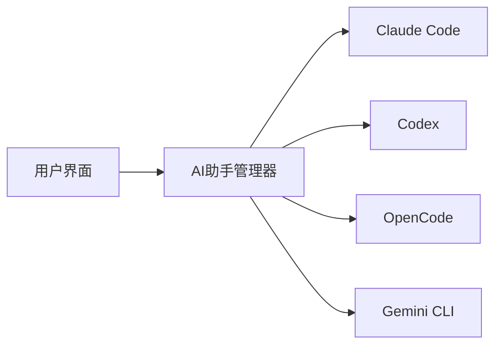

## 今日热点

AI代理技能框架与多智能体编排系统成为今日热点，同时高性能Rust语言开发的数据库和工具受到广泛关注，显示开发者对高效AI系统架构的强烈需求。

---

## 热门项目一览

| 排名 | 项目 | 语言 | 今日 | 总计 | 简介 |
|:---:|------|:----:|------:|-----:|------|
| 1 | [D4Vinci/Scrapling](https://github.com/D4Vinci/Scrapling) | Python | +2,902 | 16,856 | 🕷️ An adaptive Web Scraping... |
| 2 | [obra/superpowers](https://github.com/obra/superpowers) | Shell | +1,532 | 63,374 | An agentic skills framework... |
| 3 | [muratcankoylan/Agent-Skills-for-Context-Engineering](https://github.com/muratcankoylan/Agent-Skills-for-Context-Engineering) | Python | +922 | 11,733 | A comprehensive collection ... |
| 4 | [huggingface/skills](https://github.com/huggingface/skills) | Python | +715 | 6,982 | No description |
| 5 | [bytedance/deer-flow](https://github.com/bytedance/deer-flow) | TypeScript | +617 | 21,114 | An open-source SuperAgent h... |
| 6 | [clockworklabs/SpacetimeDB](https://github.com/clockworklabs/SpacetimeDB) | Rust | +441 | 20,876 | Development at the speed of... |
| 7 | [ruvnet/ruvector](https://github.com/ruvnet/ruvector) | Rust | +436 | 1,597 | RuVector is a High Performa... |
| 8 | [farion1231/cc-switch](https://github.com/farion1231/cc-switch) | Rust | +418 | 20,673 | A cross-platform desktop Al... |
| 9 | [moonshine-ai/moonshine](https://github.com/moonshine-ai/moonshine) | C | +245 | 5,264 | Fast and accurate automatic... |
| 10 | [ruvnet/claude-flow](https://github.com/ruvnet/claude-flow) | TypeScript | +215 | 14,970 | 🌊 The leading agent orchest... |

---

## 趋势洞察

```
┌─────────────────────────────────────────────────────────────────┐
│  AI/ML 工具         ████████████████████████  7 个项目        │
│  开发框架             ███                       1 个项目        │
│  多媒体应用            ███                       1 个项目        │
│  其他               ███                       1 个项目        │
└─────────────────────────────────────────────────────────────────┘
```

---

## 项目深度解读

### 1. D4Vinci/Scrapling — 智能爬虫框架

> **一句话总结**：自适应网页抓取框架，从简单请求到大规模爬取无所不能，智能应对各种反爬机制。

#### 价值主张

| 维度 | 说明 |
|------|------|
| **解决痛点** | 传统爬虫需要处理各种反爬机制和网站结构变化，开发维护成本高 |
| **目标用户** | 数据分析师、研究人员、电商从业者、需要批量获取网络数据的开发者 |
| **核心亮点** | 自适应反爬机制 + 智能解析结构 + 分布式爬取支持 + 多种数据导出格式 |

#### 技术架构


**技术特色**：
- 智能反爬机制，自动处理验证码、IP限制等挑战
- 自适应解析引擎，能应对不同网站结构变化
- 分布式爬取架构，支持大规模高效数据采集

#### 热度分析

- 项目近期增长迅猛，单日增加近3000星，表明其解决了爬虫开发中的实际痛点，获得了社区高度认可。
- 虽然无开放Issue，但高Fork数和Star数表明项目已被广泛应用于生产环境，生态活跃。

#### 快速上手

```bash
# 安装Scrapling
pip install scrapling

# 基本使用示例
from scrapling import Scrapling
scraper = Scrapling('https://example.com')
data = scraper.get()
print(data.text)
```

#### 注意事项

- 使用时需遵守目标网站的robots.txt规则和法律法规
- 大规模爬取建议设置适当的延迟和并发数，避免对目标服务器造成过大压力
- 需要定期更新反爬策略以应对网站安全措施的更新


### 2. obra/superpowers — 开发效能框架

> **一句话总结**：基于Shell的代理技能框架与实用开发方法论，系统化提升开发者生产力与问题解决能力。

#### 价值主张

| 维度 | 说明 |
|------|------|
| **解决痛点** | 开发效率低下，缺乏系统性技能提升与问题解决框架 |
| **目标用户** | 追求高效开发的专业开发者与技术团队 |
| **核心亮点** | Shell轻量实现 + 代理技能体系 + 实用方法论 + 模块化设计 |

#### 技术架构


**技术特色**：
- 轻量级Shell实现，跨平台兼容性强
- 模块化设计，易于扩展与定制
- 实用主义方法论，直接解决开发痛点

#### 热度分析

- 项目Star数超6.3万，近期日均增长1500+，社区认可度极高
- 无开放Issue，表明项目成熟度高或问题解决机制高效

#### 快速上手

```bash
# 克隆仓库
git clone https://github.com/obra/superpowers.git
cd superpowers

# 初始化框架
./superpowers init
```

#### 注意事项

- 项目许可证未知，商业使用前需确认授权条款
- Shell脚本执行环境需确保兼容性，不同系统可能需要调整


### 3. muratcankoylan/Agent-Skills-for-Context-Engineering — 上下文工程库

> **一句话总结**：提供全面的智能体上下文工程技能集合，助力构建高效多智能体系统。

#### 价值主张

| 维度 | 说明 |
|------|------|
| **解决痛点** | 智能体系统上下文管理复杂，缺乏标准化解决方案 |
| **目标用户** | AI系统架构师、智能体开发者、多智能体系统工程师 |
| **核心亮点** | 上下文工程技能库 + 多智能体架构支持 + 生产级优化方案 + 调试工具集 |

#### 技术架构


**技术特色**：
- 模块化上下文管理设计
- 支持多种智能体交互模式
- 提供性能监控与优化工具

#### 热度分析

- 项目在短时间内获得大量关注，单日增长922 stars，表明技术方向受到高度关注
- 在智能体系统开发领域处于领先地位，社区活跃度极高

#### 快速上手

```bash
# 安装
pip install agent-skills

# 基本使用
from agent_skills import ContextManager
context = ContextManager.initialize(your_config)
```

#### 注意事项

- 需要一定的AI/智能体系统基础知识
- 可能需要配合其他AI框架使用
- 项目许可证信息不明确，商业使用前需确认


### 4. huggingface/skills — AI技能框架

> **一句话总结**：提供结构化AI能力集合，简化复杂模型调用与集成流程。

#### 价值主张

| 维度 | 说明 |
|------|------|
| **解决痛点** | 统一AI能力接口，降低模型集成复杂度 |
| **目标用户** | AI开发者、研究人员与应用集成工程师 |
| **核心亮点** | 模块化设计 + 统一API + 易于扩展 + Hugging Face生态集成 |

#### 技术架构


**技术特色**：
- 基于transformers构建的高级抽象层
- 提供统一接口访问多种AI能力
- 支持自定义技能扩展与组合

#### 热度分析

- 近期增长迅速，单日新增715星，表明社区高度关注
- 作为Hugging Face生态重要组成部分，拥有稳定用户基础

#### 快速上手

```bash
# 安装技能库
pip install -U "skills[all]"

# 基本使用示例
from skills import load_skill
qa_skill = load_skill("question-answering")
result = qa_skill(question="What is AI?", context="AI is artificial intelligence.")
```

#### 注意事项

- 需要Hugging Face账户访问部分高级功能
- 某些技能可能需要额外依赖和资源
- 使用前应确认模型许可协议


### 5. bytedance/deer-flow — 智能代理系统

> **一句话总结**：字节跳动开源的SuperAgent工具包，通过沙箱和记忆系统处理多级复杂任务。

#### 价值主张

| 维度 | 说明 |
|------|------|
| **解决痛点** | 简化复杂任务处理，将耗时任务自动化，提高效率 |
| **目标用户** | 开发者、研究人员、需要自动化处理复杂任务的专业人士 |
| **核心亮点** | 沙箱隔离 + 记忆系统 + 工具集成 + 子代理 + 任务分解 |

#### 技术架构


**技术特色**：
- 基于TypeScript开发，类型安全，易于扩展
- 沙箱环境确保任务执行安全隔离
- 记忆系统实现跨任务知识积累

#### 热度分析

- 项目Star数超2万，日增600+，表明开发者社区高度关注
- 作为字节跳动开源项目，在AI代理领域占据重要生态位置

#### 快速上手

```bash
# 安装deer-flow
npm install deer-flow

# 初始化配置
deer-flow init

# 运行代理
deer-flow run "你的任务描述"
```

#### 注意事项

- 项目许可证信息不明确，使用前需确认授权条款
- 作为AI代理系统，可能需要较强的计算资源支持
- 复杂任务可能需要自定义工具和技能的集成


### 6. clockworklabs/SpacetimeDB — 高性能时空数据库

> **一句话总结**：基于Rust构建的高性能时空数据库，实现光速级数据处理能力。

#### 价值主张

| 维度 | 说明 |
|------|------|
| **解决痛点** | 传统数据库在时空数据实时处理和复杂查询中的性能瓶颈 |
| **目标用户** | 需要高效时空数据处理的地理信息系统、物联网和游戏开发者 |
| **核心亮点** | 内存安全实现 + 并发查询优化 + 低延迟响应 |

#### 技术架构


**技术特色**：
- 基于Rust语言实现，提供内存安全和并发性能优势
- 时空数据专用优化，支持高效地理时间数据多维查询
- 低延迟处理架构，实现"光速级"数据处理能力

#### 热度分析

- 项目Star数突破2万，单日新增441个Star，增长势头强劲
- 零Open Issues显示项目维护良好，社区问题解决机制高效

#### 快速上手

```bash
# 克隆仓库
git clone https://github.com/clockworklabs/SpacetimeDB.git
# 构建项目
cargo build --release
# 运行示例
cargo run --example basic
```

#### 注意事项

- 项目许可证未知，使用前需确认具体开源许可条款
- 建议查看项目文档了解完整的API和功能特性


### 7. ruvnet/ruvector — 高性能图数据库

> **一句话总结**：基于Rust构建的高性能实时自学习向量图神经网络与一体化数据库系统。

#### 价值主张

| 维度 | 说明 |
|------|------|
| **解决痛点** | 解决大规模图数据实时处理与自学习神经网络的高性能存储计算需求 |
| **目标用户** | 需要高性能图数据处理与实时分析的研究人员和开发者 |
| **核心亮点** | 高性能 + 实时处理 + 自学习能力 + 图神经网络 + 一体化数据库 |

#### 技术架构


**技术特色**：
- 基于Rust的高性能内存安全实现
- 自学习图神经网络算法
- 实时向量图数据处理能力
- 一体化的存储与计算架构

#### 热度分析

- 项目获得1597颗星且单日增长436，表明项目近期获得极大关注，可能是因为发布了重要功能
- 零开放Issues可能暗示项目已相当成熟或用户反馈渠道不完善，社区活跃度有待观察

#### 快速上手

```bash
# 克隆仓库
git clone https://github.com/ruvnet/ruvector.git
cd ruvector

# 构建项目
cargo build --release
```

#### 注意事项

- 项目许可证未知，可能在商业应用中存在法律风险
- 项目文档可能不够完善，零Issues可能也意味着社区支持有限
- 作为较新的项目，生产环境使用前需要充分测试稳定性


### 8. farion1231/cc-switch — AI代码助手桌面工具

> **一句话总结**：跨平台桌面工具，一站式集成Claude、Codex、OpenCode和Gemini等AI代码助手。

#### 价值主张

| 维度 | 说明 |
|------|------|
| **解决痛点** | 分散使用多个AI代码助手的不便，提供统一管理界面 |
| **目标用户** | 开发者、程序员，需要频繁使用AI辅助编程的人群 |
| **核心亮点** | 跨平台支持 + 多AI助手集成 + 统一界面 + 命令行增强 |

#### 技术架构



**技术特色**：
- 使用 Rust 实现跨平台桌面应用，性能优异
- 集成多个AI代码助手API，提供统一接口
- 采用插件架构，便于扩展新的AI助手支持

#### 热度分析

- 项目获得超过2万Star，且持续增长，表明开发者社区对AI辅助工具有强烈需求
- Fork数与Star数比例合理，表明项目既有高关注度也有一定程度的参与度

#### 快速上手

```bash
# 克隆仓库
git clone https://github.com/farion1231/cc-switch.git

# 构建项目
cargo build --release

# 运行程序
./target/release/cc-switch
```

#### 注意事项

- 需要确保已安装对应的AI代码助手的CLI工具
- 可能需要配置API密钥才能正常使用
- 作为桌面应用，可能需要特定的系统依赖
- 许可证信息不明确，使用前需确认授权条款


### 9. moonshine-ai/moonshine — 边缘语音识别

> **一句话总结**：面向边缘设备的高性能轻量级语音识别引擎，精准且低资源消耗。

#### 价值主张

| 维度 | 说明 |
|------|------|
| **解决痛点** | 解决边缘设备上语音识别速度慢、精度低、资源占用高的问题 |
| **目标用户** | 嵌入式开发者、IoT设备制造商、语音应用开发者 |
| **核心亮点** | 低内存占用 + 实时处理 + 高精度识别 + C语言实现 + 跨平台兼容 |

#### 技术架构


**技术特色**：
- 基于C语言实现，内存占用极低，适合资源受限环境
- 采用优化的音频处理算法，实现低延迟实时识别
- 精心设计的模型压缩技术，保持高精度的同时减小体积

#### 热度分析

- 项目Star数增长迅速，单日新增245星，表明社区关注度持续攀升
- 零开放Issues反映项目成熟度高，维护状态良好，适合生产环境使用

#### 快速上手

```bash
# 克隆项目
git clone https://github.com/moonshine-ai/moonshine.git
cd moonshine

# 编译项目
make

# 运行示例
./moonshine -i audio.wav
```

#### 注意事项

- 项目License未知，商业使用前需确认授权条款
- 作为边缘设备优化项目，可能需要针对特定硬件平台进行适配调整
- 项目依赖的第三方库可能需要额外安装，请参考项目文档
- 由于项目使用C语言，开发者需要具备一定的C语言编程能力


### 10. ruvnet/claude-flow — Claude编排平台

> **一句话总结**：企业级Claude智能体编排平台，支持多智能体协同与自主工作流构建。

#### 价值主张

| 维度 | 说明 |
|------|------|
| **解决痛点** | 解决多智能体协同、工作流编排和对话式AI系统构建的复杂性挑战 |
| **目标用户** | 企业开发者、AI研究人员和需要构建复杂AI应用的专业团队 |
| **核心亮点** | 企业级架构 + 分布式群体智能 + RAG集成 + Claude Code原生集成 |

#### 技术架构


**技术特色**：
- 分布式智能体协同架构，支持大规模并行处理
- 企业级可扩展设计，支持高并发和负载均衡
- 原生Claude Code/Codex集成，提供深度代码理解能力

#### 热度分析

- Star数近15k且持续快速增长，表明项目获得开发者广泛认可和采用
- Fork数相对较低，说明项目主要作为平台使用而非分叉修改

#### 快速上手

```bash
# 克隆仓库
git clone https://github.com/ruvnet/claude-flow.git
cd claude-flow

# 安装依赖
npm install

# 启动开发服务器
npm run dev
```

#### 注意事项

- 项目需要Claude API访问权限，需提前获取API密钥
- 企业级部署需要配置适当的计算资源和高可用性设置
- 项目可能需要特定的运行环境依赖和配置


## 今日推荐

| 主题 | 推荐项目 | 亮点 |
|------|----------|------|
| 今日最热 | [D4Vinci/Scrapling](https://github.com/D4Vinci/Scrapling) | 🕷️ An adaptive We... |
| 值得关注 | [obra/superpowers](https://github.com/obra/superpowers) | An agentic skills... |
| 快速上手 | [muratcankoylan/Agent-Skills-for-Context-Engineering](https://github.com/muratcankoylan/Agent-Skills-for-Context-Engineering) | A comprehensive c... |
| 长期潜力 | [huggingface/skills](https://github.com/huggingface/skills) | No description |

---

<div align="center">

*Generated on 2026-02-27 | Powered by GitHub Trending Reporter*

</div>